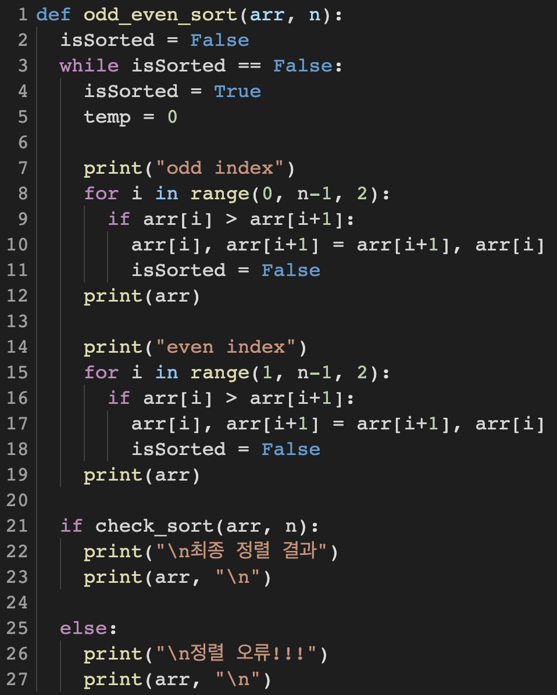
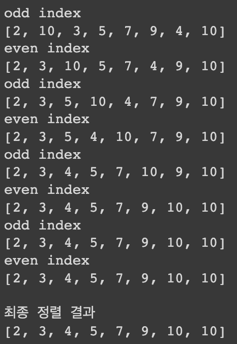
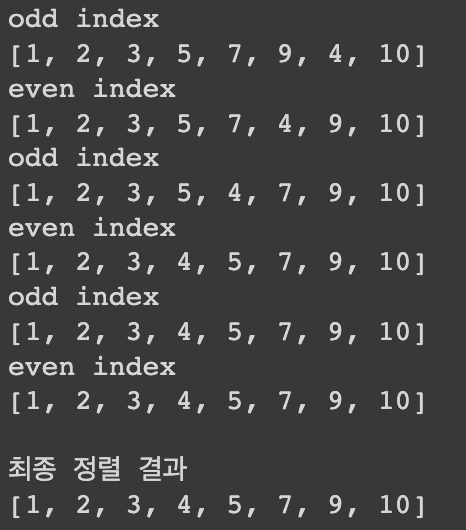
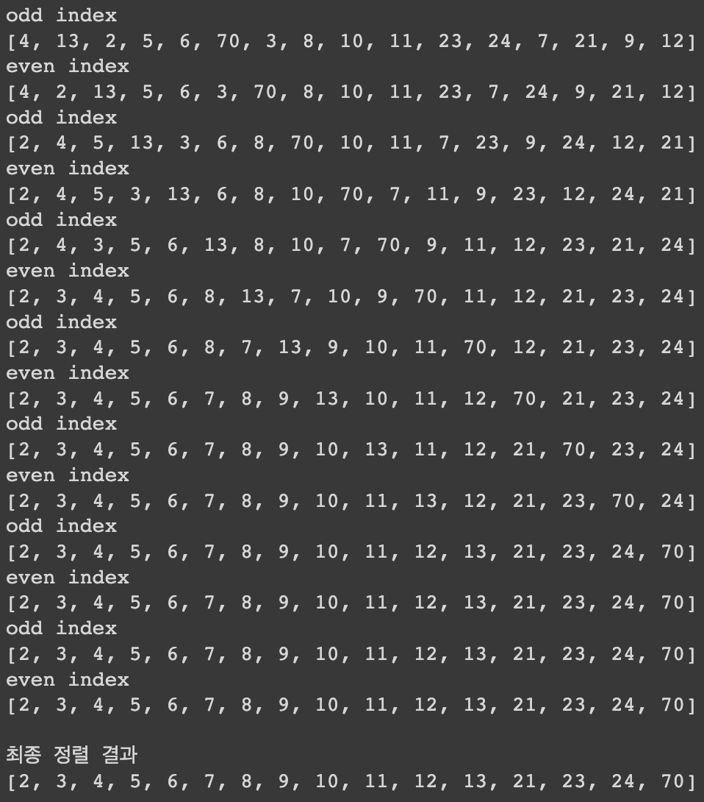
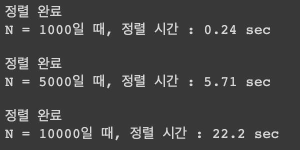
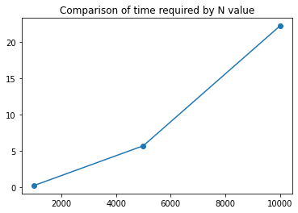

# 병렬 정렬 알고리즘 (Odd-Even Sorting)

## 1. 개요
- Odd-Even sort 알고리즘을 구현하고 아래의 요구사항을 수행하시오.
	- 아래의 서로 다른 세 개의 정수 배열을 odd-even sort 알고리즘으로 정렬
	- 각 phase(odd index or even index) 단계마다 정렬된 상태를 출력할 것
	- 세 개의 서로 다른 임의의 랜덤 정수 배열(N=1,000, 5,000, 10,000 / 정수 범위는 0~1000)을 만 들고 odd-even sort로 정렬했을 때 각각 걸리는 시간을 측정하여 출력할 것(이 경우에는 정렬 결과 출력하지 않음)
	- 최종 정렬된 결과를 출력할 것
- 입력 
	- 2, 10, 5, 3, 7, 9, 4, 10 
	- 2, 1, 5, 3, 7, 9, 4, 10
	- 4, 13, 2, 5, 6, 70, 8, 3, 10, 11, 24, 23, 21, 7, 9, 12 
	- 세 개의 서로 다른 임의의 정수 배열 
- 출력
	- 결과 예시와 같은 형태로 위의 세 개의 정수 행렬 결과를 출력 
	- 세 개의 서로 다른 임의의 정수 배열을 정렬하는 데 걸리는 시간 및 그래프
## 2. 상세 설계 내용

Odd Even Algorithm은 홀수 번째(odd) phase와 짝수 번째(even) phase로 나누어, 수의 대소를 비교하면서 정렬하는 알고리즘이다. N개의 정수로 이루어진 배열인 경우 N번 이하의 phase를 반복하여 정렬이 이루어진다. 
 
코드의 7번줄부터 12번줄까지는 홀수 번째(odd) phase를 의미하는 코드이며, 14번줄부터 19번줄까지는 짝수 번째(even) phase를 의미하는 코드이다. 각각의 phase에서 `arr[i]`와 `arr[i+1]`를 대소비교하며, 만약 `arr[i] > arr[i+1]`일 때 즉, 정렬이 되지 않았다면 그 두 개의 순서를 바꿔준다. 
이 과정을 정렬이 완료될 때까지 반복한다.
 
마지막에는 정렬 여부를 검사하는 `check_sort()` 함수를 통해 정렬 여부를 검사한다.
 
## 3. 실행 화면
### 입력이 `2, 10, 5, 3, 7, 9, 4, 10` 일 때

### 입력이 `2, 1, 5, 3, 7, 9, 4, 10`  일 때

### 입력이 `4, 13, 2, 5, 6, 70, 8, 3, 10, 11, 24, 23, 21, 7, 9, 12` 일 때

### 세 개의 서로 다른 임의의 정수 배열 

## 4. 결론
N개의 정수로 이루어진 배열을, N번 이하의 phase를 반복하여 정렬할 수 있다는 것을 결과를 통해 확인할 수 있었다.
 
또한, N=1000일 때 실행시간이 5.71초가 걸렸고, 배열의 길이를 2배 늘린 N=10000일 때의 실행시간이 N=1000일 때의 실행시간의 약 2^2배(=4배)인 22.2초가 걸렸다. 이를 통해 Odd Even Algorithm은 시간복잡도 O(N)을 가진다는 것을 추측할 수 있다.

