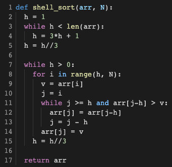
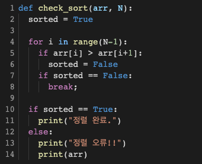
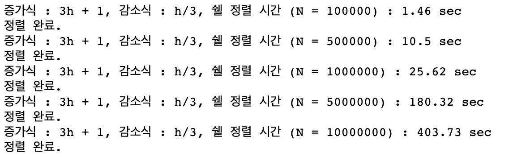
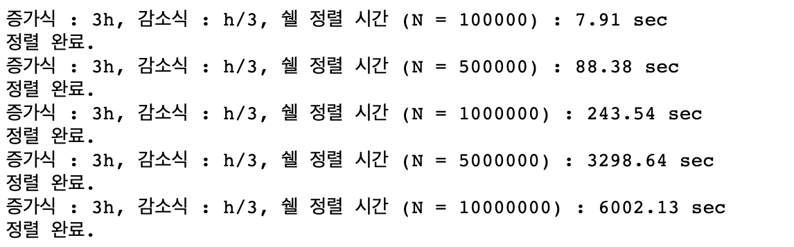
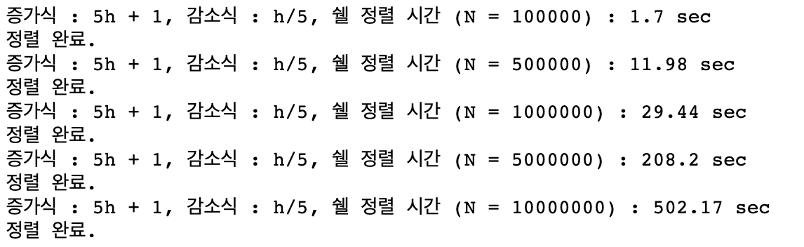

# Shell Sort

## 1. 개요

- 쉘 정렬을 만들고 아래의 요구사항을 수행하시오.
  - 임의의 서로 다른 3개의 Gap 증감식을 사용하여 성능을 비교
    - 1. 증가식 : h = 3\*h+1 감소식: h = h/3
    - 2. 증가식 : h = 3\*h 감소식: h = h/3
    - 3. 증가식 : h = 5\*h + 1 감소식: h = h/5
  - 입력
    - N = 100,000, 500,000, 1,000,000, 5,000,000, 10,000,000
  - 출력
    - N값, 증감식에 따른 정렬 소요 시간 및 정렬 결과
    - N값에 따른 소요 시간 비교 그래프

## 2. 상세 설계 내용

### Shell Sort 알고리즘

Shell Sort는 insertion sort를 간단하게 변형한 알고리즘으로서, j개의 서브리스트로 분할하여 insertion sort를 수행하는 정렬기법이다.
위 코드의 2번 줄부터 5번 줄, 그리고 15번 줄은 리스트 속 원소들의 간격을 나타내는 h의 증가식과 감소식을 구현한 코드이다.
7번 줄의 while문부터 반복이 시작되는데, h>0일 동안만 즉, 서브리스트의 간격이 0이 될 때까지 반복을 수행한다.
9번 줄에서는 정렬 대상의 데이터를 변수 v에 백업을 시켜 놓고, 11번 줄에서 j와 h 값, arr[j-h]와 v의 대소비교를 통해 특정조건이 성립할 때, arr[j] = arr[j-h]를 실행하며 리스트를 정렬한다. 그리고 이 과정을 h번째 원소부터 마지막까지 반복한다.
for문의 반복이 끝나면, 감소식을 거쳐 h를 감소시킨 후 (15번 줄) 다시 과정을 반복한다.

### Check Sort 알고리즘

Check Sort 알고리즘은 구현한 Shell Sort 알고리즘이 알맞게 정렬되었는지 확인하기 위해 구현한 알고리즘이다. 반복을 통해 배열의 연속적으로 탐색하여 크기를 비교하며 정렬여부를 확인하다가, 뒤에 나오는 수가 앞에 나오는 수보다 작으면 반복문을 break하고 빠져나와 “정렬 오류!!”를 출력한다. for문을 끝까지 정상적으로 수행한다면, “정렬 완료.”를 출력한다.

## 3. 실행 화면

- 1. 증가식 : h = 3\*h+1 감소식 : h = h/3
  - 
- 2. 증가식 : h = 3\*h 감소식: h = h/3
  - 
- 3. 증가식 : h = 5\*h + 1 감소식: h = h/5
  - 
- N값에 따른 소요 시간 비교 그래프
  - 

## 4. 결론

N값에 따른 소요 시간 비교 그래프를 참고하였을 때, 정렬 소요 시간이 `증가식 : h = 3*h, 감소식: h = h/3` 일 때, `증가식 : h = 5*h + 1, 감소식: h = h/5` 일 때, `증가식 : h = 3*h+1, 감소식: h = h/3` 일 때 순으로 감소하는 것을 확인할 수 있었다.
특히 증가식이 3h+1이고, 감소식이 h/3인 경우와 증가식이 5h+1이고 감소식이 h/5인 경우의 차이는 거의 나타나지 않았으며, 감소식이 h/3으로 같을 때, 증가식이 3h+1인 것과 3h인 것의 소요 시간의 차이는 극명하게 나타났다.
즉, 데이터를 나누는 값 h가 단순히 3을 나누는 경우보단, 3을 나누고 1을 더하는 경우의 성능이 더 빠르다고 할 수 있다.
