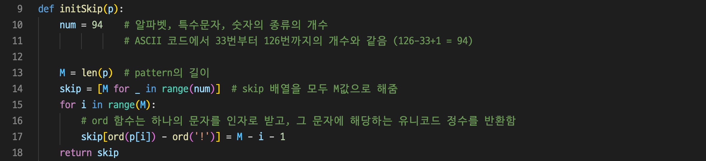
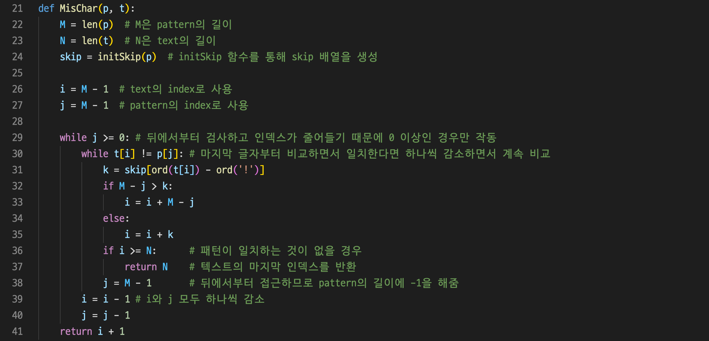
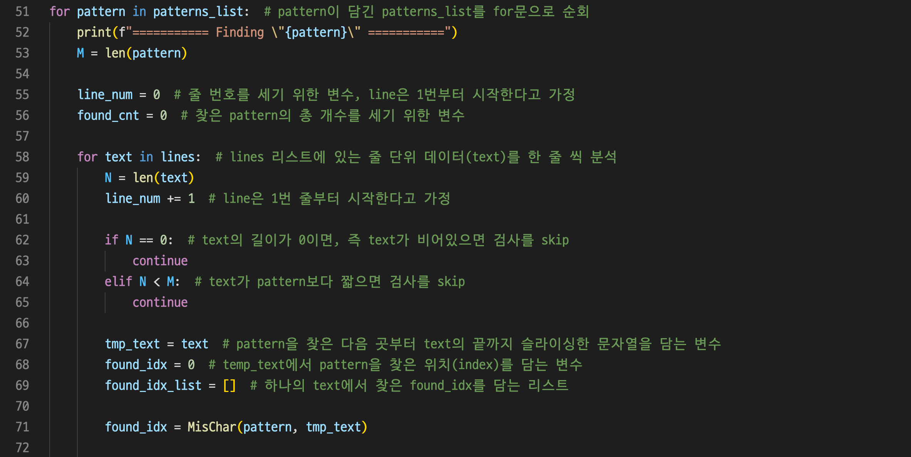
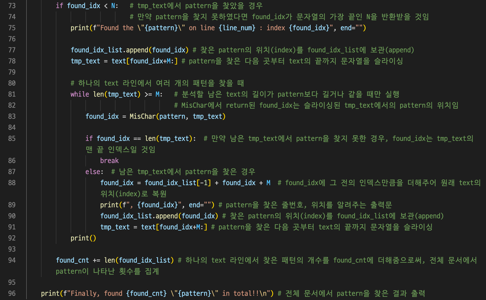
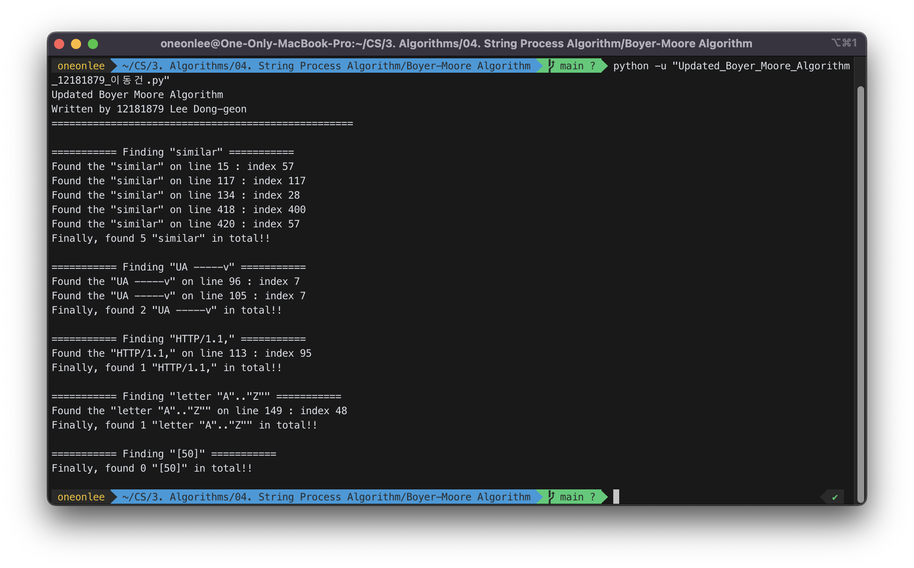

# 보이어-무어 알고리즘의 확장

## 1. 개요

- 보이어-무어 알고리즘을 아래와 같은 제약조건을 만족하도록 구현하고 동작여부를 보일 것.
  - (1) 보이어-무어 알고리즘을 확장하여 숫자와 특수기호도 검색할 수 있도록 할 것.
    - 주어진 “RFC2616_modified.txt”화일을 텍스트로 사용할 것.
  - (2) “similar” “UA -----v” “HTTP/1.1,” “letter "A".."Z"” “[50]”이 검색되는 과정을 보일 것.

## 2. 상세 설계 내용

### (1) 보이어-무어 알고리즘의 확장

#### `initSkip` 함수

`initSkip` 함수는 주어진 패턴 `p`대로 `skip` 배열을 만들어주는 함수이다. 보이어-무어 알고리즘에서 `skip` 배열은 주어진 패턴 `p`의 역순으로 0부터 index를 매기고, 패턴 `p` 외의 다른 문자는 `p`의 길이만큼 index를 매긴다. 예를 들어, “algorithm”이라는 pattern이 있다면, 아래와 같은 `skip` 배열이 만들어지게 된다.

| 문자  | m   | h   | t   | i   | r   | o   | g   | l   | a   | 다른 모든 문자 |
| ----- | --- | --- | --- | --- | --- | --- | --- | --- | --- | -------------- |
| index | 0   | 1   | 2   | 3   | 4   | 5   | 6   | 7   | 8   | 9              |

기존의 보이어-무어 알고리즘에서는 10번 줄의 `num`의 수를 52만큼 (알파벳의 개수26 × 2) 초기화해주지만, 숫자와 특수기호도 검색할 수 있도록 개선된 보이어-무어 알고리즘에서는 알파벳, 특수문자, 숫자의 종류의 개수인 94로 초기화해주었다. 이는 ASCII 코드에서 33번부터 126번까지의 개수와 같다. (126-33+1 = 94)

다음으로 `skip` 배열을 길이가 `num`이고, 주어진 패턴 `p`의 길이가 각각의 값이 되도록 초기화해준다. 그리고 문자를 유니코드 정수로 변환해주는 파이썬의 `ord` 함수를 통해 `p` 속의 문자들을 위에서 설명한 규칙에 맞도록 `skip` 배열의 index를 변환하여 준다.

#### `MisChar` 함수

`MisChar` 함수는 “텍스트에 있는 불일치가 발생한 문자가 패턴의 문자와 일치하도록 패턴을 오른쪽으로 이동”하는 불일치 문자 방책 (mismatched character heuristic) 알고리즘으로 설계된 함수이다. 먼저, `initSkip` 함수를 통해 `skip` 배열을 생성한다. `t[i]`와 `p[j]`가 일치하지 않는 경우에는 30번 줄의 while문 내부의 실행문을 실행한다. 31번 줄에서는 `ord` 함수로 해당 text 문자의 `skip` 배열 값을 불러온다. 그 후, `M–j`와 `k`의 대소비교를 통해 `i` 값을 바꿔준다. 만약, 패턴이 일치하는 것이 없을 경우 (36번 줄), 텍스트의 마지막 인덱스를 반환한다. 그 후, `i`와 `j`의 값을 감소시켜준다.

### (2) 패턴 검색 과정

 

바깥 쪽 for문에서는 패턴들이 담긴 리스트인 `patterns_list`를 순회하고 (51번 줄), 안 쪽 for문에서는 “RFC2616_modified.txt” 파일이 줄 단위로 담긴 리스트인 `lines`를 순회한다. (58번 줄) 안 쪽 for문 내부에서는 하나의 패턴을 행 단위로 한 줄 씩, 전체 파일을 분석한다.

이 때, 줄 단위 데이터인 `text`가 비어 있거나, `text`가 `pattern`보다 짧으면 검사를 하지 않는다. 먼저, 71번 줄에서 `MisChar` 함수로 `pattern`의 유무를 분석하고, 인덱스를 `found_idx`에 반환 받는다. 만약 패턴을 찾지 못하였다면, `found_idx`가 문자열의 가장 끝인 `N`을 반환 받을 것이다. 만약 패턴을 찾았다면, 73번 줄의 if문 내부로 들어가 패턴을 찾았을 때 수행하는 로직을 수행한다. (1.출력문 출력, 2.패턴의 index를 found_idx_list에 append, 3.패턴을 찾은 다음 곳부터 `text`의 끝까지 문자열을 슬라이싱)

다음으로 하나의 text 라인에서 여러 개의 패턴을 찾기 위해, 슬라이싱하고 남은 `text`의 길이가 `pattern`보다 길거나 같을 때만 81번 줄 while문을 실행한다. 83번 줄에서 다시 한번 `MisChar` 함수로 `pattern`의 유무를 분석하고 패턴을 찾지 못하면 (85번 줄) `break`, 패턴을 찾았다면 (87번 줄) `found_idx`에 그 전의 인덱스 만큼을 더해주어 원래 `text`의 index로 복원해준다. (88번 줄) 그 후, 그 전과 마찬가지로 패턴을 찾았을 때 수행하는 로직을 수행한다. (89번 ~ 91번 줄)

## 3. 실행 화면

## 4. 결론

패턴의 오른쪽에서 왼쪽으로 비교하는 보이어-무어 알고리즘은 대부분의 상용 소프트웨어에서 채택하고 있는 알고리즘이다. 패턴에 오른쪽 끝에 있는 문자가 불일치하고, 이 문자가 패턴 내에 존재하지 않는 경우, 패턴의 길이 만큼 이동한다. n과 m이 각각 text와 pattern의 길이라고 할 때, 시간 복잡도는 일반적으로 O(n) 이하이고 최악의 경우에는 O(nm)을 보인다.

개선된 보이어-무어 알고리즘을 구현하기 위해서, `initSkip` 함수에서는 `skip` 배열의 범위를 넓혀주었고, 패턴 검색 과정에서 패턴을 여러 번 검색할 수 있도록 수정하였다.

그 결과, 주어진 “RFC2616_modified.txt” 파일에서 “similar”, “UA -----v”, “HTTP/1.1,”, “letter "A".."Z"”, “[50]”는 각각 5번, 2번, 1번, 1번, 0번 등장한 것을 확인할 수 있었다.

## 5. 참고 자료

- [1] R. Boyer & J. Moore. (1977). A fast string searching algorithm. CACM 20(10), 262-272.
- [2] Z. Galil. (1978). On improving the worst case running time of Boyer-Moore string matching algorithm. Communications of the ACM 22(9), 241-250.
- [3] Michael T. Goodrich, Roberto Tamassia & David M. Mount. (2022). Data Structures & Algorithms in C++ (Second Edition). Wiley.
- [4] HANCODING Tistory 블로그 : [[python] 보이어 무어 알고리즘 (Boyer Moore Algorithm)](https://hanco.tistory.com/1)
