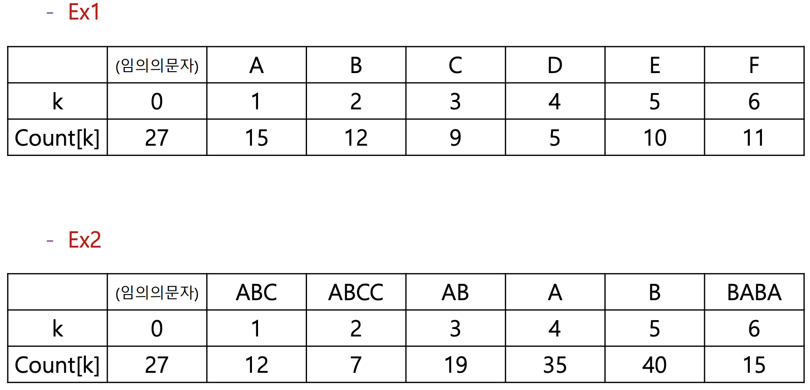
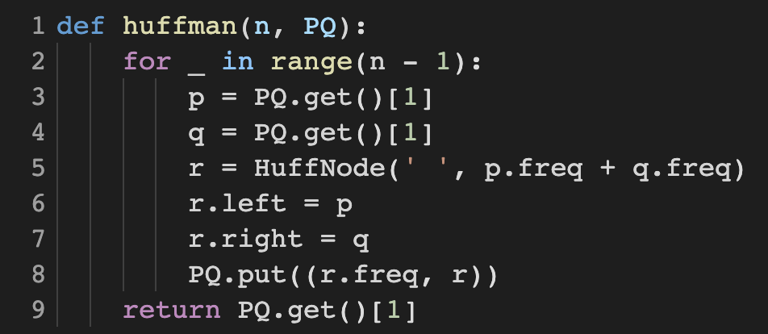
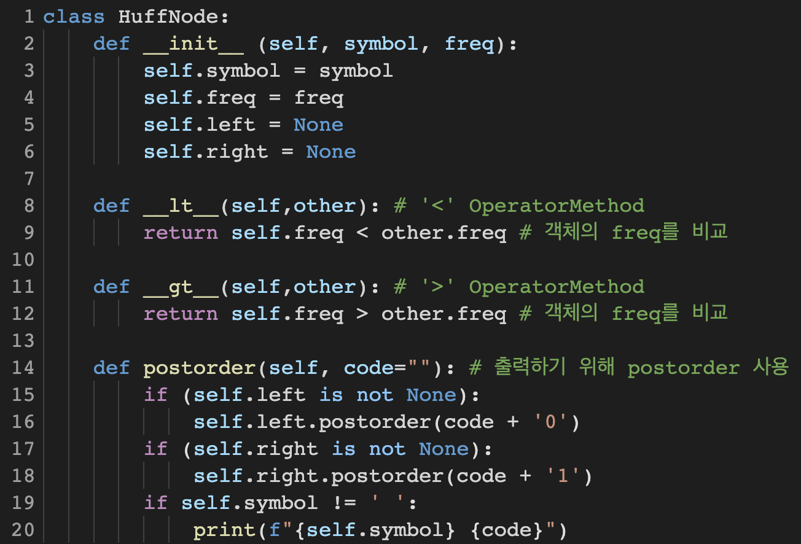
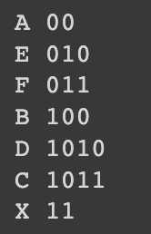
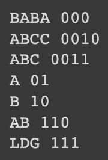

# Huffman Encoding

## 1. 개요

- 주어진 텍스트 및 빈도수를 활용하여 허프만 인코딩 결과를 제시하시오
  

## 2. 상세 설계 내용

### Huffman Tree 알고리즘

허프만 코드는 압축 알고리즘 중 하나로, 입력 데이터를 더 적은 용량으로 만드는 것이다. 자주 나오는 문자에는 짧은 비트를, 조금 나오는 문자에는 긴 비트를 할당한다. 허프만 인코딩의 알고리즘은 다음과 같다.

1. 모두 Priority Queue에 insert한다.
2. Priority Queue에서 빈도 수가 가장 작은 2개의 노드를 뺀다.
3. 그 두 노드를 합쳐 하나의 노드로 만든다.
4. 합친 노드를 다시 Priority Queue에 넣는다.
5. 2번부터 4번까지의 과정을 데이터의 개수만큼 반복한다.

huffman 함수에서는 앞서 설명한 과정을 코드로 구현하였다.

Priority Queue를 구현하기 위해, `from queue import PriorityQueue` 코드를 통해 내장 모듈을 불러왔다.

허프만 인코딩 알고리즘을 사용하기 위해서는 `HuffNode` 클래스가 필요하다.

`HuffNode` 클래스에서는 노드 안의 문자를 의미하는 `symbol`과 빈도 수를 의미하는 `freq`를 인스턴스 변수로 가진다. 또한, `left`와 `right`에는 다른 `symbol`들이 들어가게 된다. 또한, `HuffNode` 객체를 Priority Queue에 집어 넣을 때, 대소비교를 하기 위해 Operator Method를 사용하여 `HuffNode` 클래스의 대소비교가 가능하도록 구현하였다. 마지막으로, 허프만 인코딩 결과를 확인하기 위해 postorder 방식으로 허프만 트리를 순회하여 출력해주었다. 이때, `postorder` 함수는 `code`라는 인자를 받는데 이는 인코딩 결과를 의미한다. `postorder`의 인자 `code`는 기본값으로 `“”` 즉, 빈 값을 가지는데, 이는 처음 트리의 루트에서 시작할 때 비어있는 채로 트리를 내려오기 때문이다. 내려오면서 왼쪽으로 갈 경우 ( `if (self.left is not None):` ) `code` 값의 뒤에 `0`을 붙혀주며, 오른쪽으로 갈 경우 ( `if (self.right is not None):` ) `code` 값의 뒤에 `1`을 붙혀주었다.

## 3. 실행 화면

Ex1

Ex2

## 4. 결론

이번 실습에서는 입력 데이터를 더 적은 용량으로 만드는 압축 알고리즘 중 하나인 허프만 인코딩 알고리즘을 직접 구현해보고, 주어진 텍스트 및 빈도수를 활용하여 허프만 인코딩 결과를 제시하였다. Ex1에서는 모두 한 글자의 텍스트가 주어졌고, Ex2에서는 한 글자 이상의 텍스트가 주어졌다. Ex1과 Ex2 모두 빈도 수에 따라 정상적으로 인코딩이 된 것을 확인할 수 있었다. 또한, 허프만 인코딩의 제약조건인 한 문자의 코드가 다른 문자의 코드 워드의 prefix가 되지 않는 것을 확인할 수 있었다.
