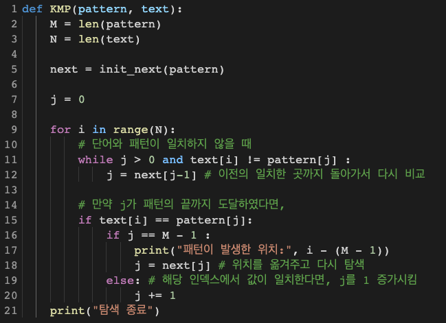
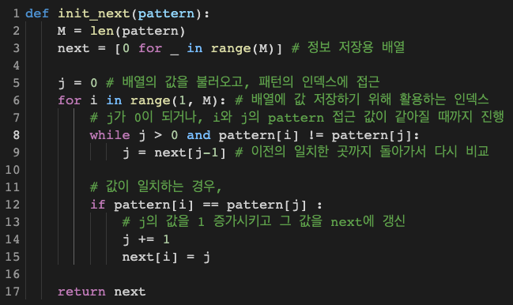
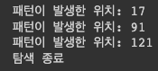

# 1. 개요

- KMP 알고리즘을 구현한 후 아래의 여러 텍스트에서 각 패턴이 발생한 위치를 찾으시오.
  - Ex1
    - Text: `ababababcababababcaabbabababcaab`
    - Pattern: `abababca`
  - Ex2
    - Text: `This class is an algorithm design class. Therefore, students will have time to learn about algorithms and implement each algorithm themselves.`
    - Pattern: `algorithm`

# 2. 상세 설계 내용

### KMP 패턴 매칭 알고리즘

KMP 패턴 매칭 알고리즘은 텍스트 문자열 text를 패턴 문자열 pattern과 비교하면서 증가적으로 처리한다. 패턴이 일치할 때마다, 현재의 인덱스를 증가시킨다. 반면에, 이전에 pattern에서 진행을 한 다음 불일치가 존재하면, text에 대하여 pattern의 점검을 계속할 필요가 있는 곳의 pattern의 새로운 인덱스를 결정하기 위해 실패 함수로부터 받아온 next의 정보를 참고한다.

불일치가 발생했지만, pattern의 시작 위치에 있다면, 단순히 text의 인덱스를 증가시킨다. 즉, pattern의 인덱스는 처음 값을 유지하게 된다.

text에서 pattern과의 일치를 발견하거나, text의 인덱스가 text의 길이인 N에 도달 할 때 (text에서 pattern을 찾지 못했을 때)까지 이러한 과정을 반복한다.

### InitNext (실패함수)

실패함수 init_next는 KMP 알고리즘을 수행하기 전, 패턴을 처리하는 함수이다. 실패함수 f(i)는 i번째 위치에서 접두사와 접미사가 같아지는 되는 최대 접두사의 길이로 정의된다.

KMP 패턴 매칭 알고리즘처럼 패턴 자신을 비교하는 면에서 KMP 패턴 매칭 알고리즘과 매우 유사하다.

# 3. 실행 화면

- Ex1
  - Text: `ababababcababababcaabbabababcaab`
  - Pattern: `abababca`
  - 

 

- Ex2
  - Text: `This class is an algorithm design class. Therefore, students will have time to learn about algorithms and implement each algorithm themselves.`
  - Pattern: `algorithm`
  - 

# 4. 결론

KMP 알고리즘의 주요 아이디어는 미리 수행한 비교를 재사용할 수 있도록 함으로써 정보의 낭비를 피하는 것이며, 가장 큰 범위로 가능한 패턴 문자열의 적합한 이동을 표시하는 실패 함수(failure function)를 계산하기 위해 패턴 문자열을 미리 처리하는 것이다.

그렇게 함으로써 최악의 경우에서도 KMP 알고리즘은 n 길이의 텍스트 문자열과 m 길이의 패턴 문자열에 대해 O(n+m)의 실행 시간을 얻게 된다. 즉, 최악의 경우에는 실패함수를 만드는데 O(m), 실패함수를 통해 문자열을 검색하는데 O(n)의 시간복잡도를 가지고, 이는 텍스트 내의 모든 문자와 패턴 내의 모든 문자를 최소한 한 번은 검사 해야 한다는 것을 뜻한다.

# 5. 참고문헌 및 사이트

1. Michael T. Goodrich, Roberto Tamassia, David M. Mount. Data Structures & Algorithms in C++. n.p.: Wiley, n.d..
2. [MEIN_FIGUR.daily_log : [Python]KMP 알고리즘](https://velog.io/@mein-figur/PythonKMP-%EC%95%8C%EA%B3%A0%EB%A6%AC%EC%A6%98)
