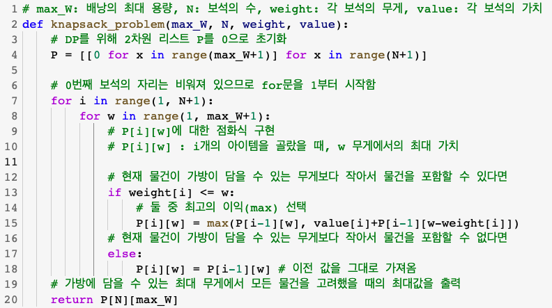
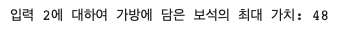

# 0-1 Knapsack Problem

## 1. 개요

- 주어진 배낭의 최대 용량(무게)과 보석의 무게 및 가치를 고려하여 배낭에 담은 보석이 최대한의 가치를 가지도록 담는 방법을 구하시오.

### 입력 1

- 배낭 무게: 15
- 보석(무게 / 가치)
  `(5, 5), (10, 7), (7, 10), (3, 6), (4, 8), (11, 20)`

### 입력 2

- 배낭 무게: 30
- 보석(무게 / 가치)
  `(3, 5), (7, 7), (8, 10), (5, 6), (6, 8), (13, 20), (11, 18), (2, 5)`

## 2. 상세 설계 내용

### 0-1 Knapsack Problem

집합 𝐴를 𝑛개의 보석들 중에 최적으로 고른 부분집합이라고 가정하자. 집합 𝐴가 𝑛번째 보석을 포함하고 있지 않다면, 𝐴는 𝑛번째 보석을 뺀 나머지 𝑛−1개의 보석들 중에서 최적으로 고른 부분집합과 같다. 집합 𝐴가 𝑛번째 보석을 포함하고 있다면, 𝐴에 속한 보석들의 총 가격은 𝑛−1개의 보석들 중에서 최적으로 고른 가격의 합에다가 보석 𝑛의 가격을 더한 것과 같다.(단, 𝑛번째 보석을 넣었을 때 보석의 무게가 배낭의 최대 용량을 넘지 않아야 한다.)

이것을 점화식으로 풀어 보기 위해 𝑤𝑖는 item 의 무게, 𝑝𝑖는 아이템의 가치라고 하자. 𝑖> 0이고 𝑤>0일 때, 전체 무게가 𝑤가 넘지 않도록 𝑖번째 까지의 항목 중에서 얻어진 최고의 이익(optional profit)을 𝑃[𝑖][𝑤]라고 하면, 
  
와 같다. 이때, 𝑃[𝑖 − 1][𝑤]는 𝑖번째 항목을 포함시키지 않는 경우의 최고 이익이고,
𝑝𝑖 +𝑃[𝑖−1][𝑤−𝑤𝑖]는 𝑖번째 항목을 포함시키는 경우의 최고 이익이다. 이 점화식을 동적계획법 알고리즘으로 구현하여 프로그래밍한 것은 아래와 같다.

## 3. 실행 화면

### 입력 1

- 배낭 무게: 15
- 보석(무게 / 가치)
  `(5, 5), (10, 7), (7, 10), (3, 6), (4, 8), (11, 20)`
  

### 입력 2

- 배낭 무게: 30
- 보석(무게 / 가치)
  `(3, 5), (7, 7), (8, 10), (5, 6), (6, 8), (13, 20), (11, 18), (2, 5)`
  

## 4. 결론

본 설계에서는 주어진 배낭의 최대 용량과 보석의 무게 및 가치를 고려하여 배낭에 담은 보석이 최대한의 가치를 가지도록 담는 방법을 동적계획법(Dynamic Programming)을 통해 구하였다. 입력 1과 같이 조건이 주어졌을 때의 가방에 담은 보석의 최대 가치는 28이었으며, 입력 2에 대한 최대 가치는 48임을 확인하였다.

위 문제에서 모든 경우의 수를 하나하나 계산하는 완전 탐색의 경우 𝑂(2^𝑛)의 시간복잡도를 가질 것이다. 하지만 동적계획법을 통해, 중복되는 계산을 하지 않는다면 시간복잡도는 𝑂(𝑛𝑊)까지 줄일 수 있을 것이고, 본 설계에서 사용한 이차원 배열 `P`에 따라 공간복잡도 역시 𝑂(𝑛𝑊)가 될 것이다.

## 5. 참고자료

1. [Dynamic Programming: 배낭 채우기 문제 (Knapsack Problem) - 환상빛 별하늘: Reb∞t:티스토리](https://gsmesie692.tistory.com/113)
2. [백준 12865번: 평범한 배낭](https://www.acmicpc.net/problem/12865)
3. [0-1 Knapsack - Small talks with something: 티스토리](https://timewizhan.tistory.com/entry/01-Knapsack)
4. [[DP] 배낭 문제(Knapsack Problem) - 햄과함께IT: 티스토리](https://withhamit.tistory.com/481)
