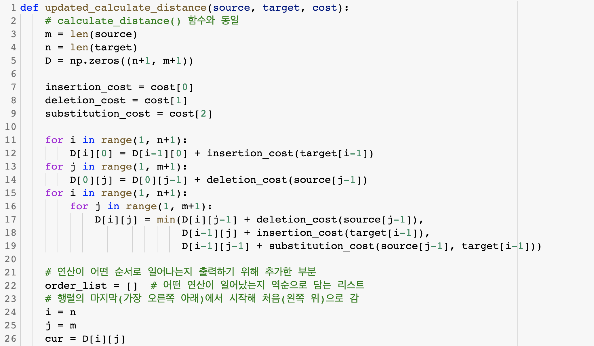
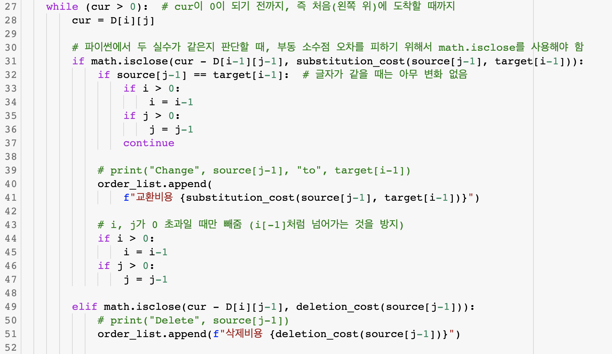
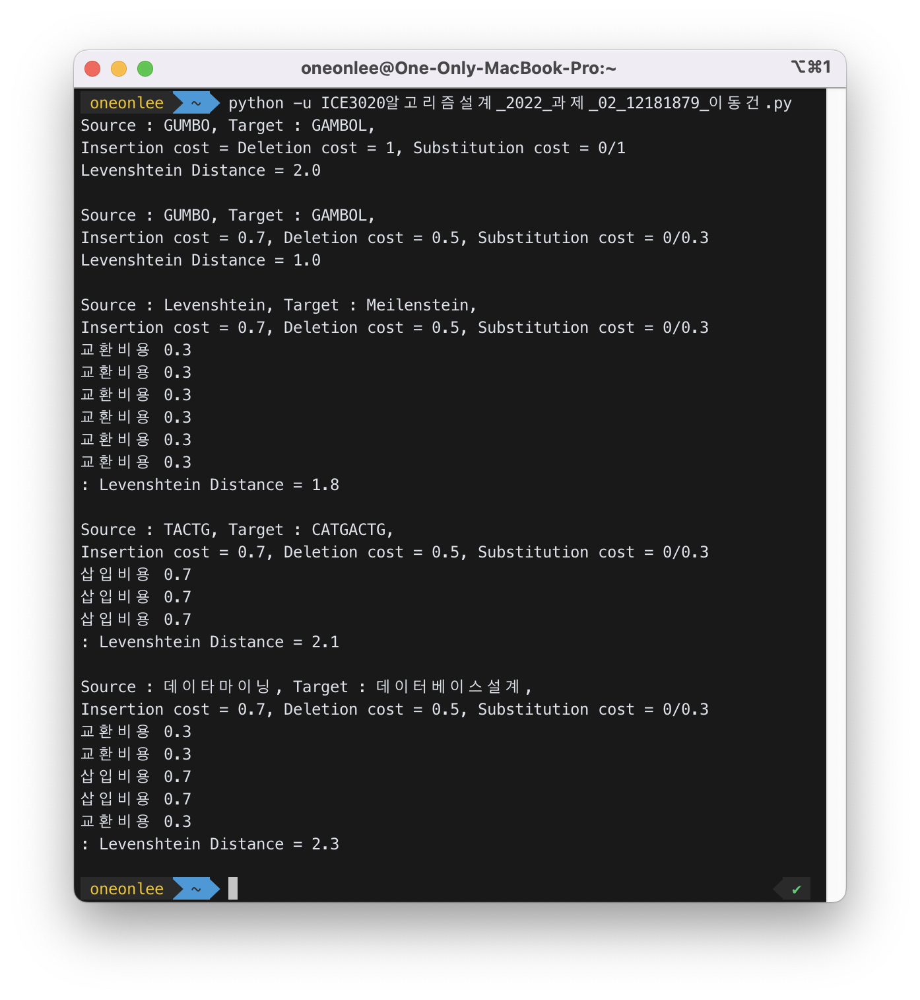

# Levenshtein Distance

## 1. 개요

Levenshtein Distance 를 구현하라.

- (1) Levenshtein Distance 를 구하는 알고리즘을 구현하고 Source=“GUMBO”, Target=“GAMBOL”를 이용하여 연산비용이 아래와 같을 때 동작함을 보일 것.
  - (a) 삽입비용 = 삭제비용 = 1,교환비용 = 0/1 일 때
  - (b) 삽입비용 = 0.7, 삭제비용 = 0.5, 교환비용 = 0/0.3 일 때
- (2) 위에서 작성한 알고리즘을 삽입, 삭제, 교환연산이 어떤 순서로 일어나는지 출력하도록 수정할 것, 아래 Data 1,2,3 에 대한 연산순서를 출력할 것  (삽입비용 = 0.7, 삭제비용 = 0.5, 교환비용 = 0/0.3)  Source=“GUMBO”, Target=“GAMBOL”의 경우 출력 예)  `교환연산 0.3, 삽입연산 0.7 : Levenshtein Distance = 1`
  - Data 1) Source = Levenshtein, Target = Meilenstein
  - Data 2) Source = TACTG, Target = CATGACTG
  - Data 3) Source = 데이타마이닝, Target = 데이터베이스설계

## 2.상세 설계 내용

### (1) Levenshtein Distance 알고리즘

원래의 스트링을 𝑆(source), 편집하고자 하는 목표 스트링을 𝑇(target)이라고 하고, 각각의 문자열의 길이를 𝑚,𝑛 이라고 하자.또한,𝛿*𝐼는 삽입 연산의 비용,𝛿*𝐷는 삭제 연산의 비용, 𝛿_S는 교환 연산의 비용이라고 하자. 𝐷[𝑖][𝑗]를 𝑆=𝑠1𝑠2 ...𝑠𝑗와 𝑇=𝑡1𝑡2 ...𝑡𝑖 사이의 편집 거리라고 할 때, 𝐷[𝑖][𝑗]의 점화식 (Recursive Property)은 아래와 같다.

위 점화식에 의하면 Levenshtein Distance 에 대하여 최적성의 원리가 성립된다. 이 때, 𝐷[𝑖][𝑗]를 계산할 때 loop 로 계산한다면 계산이 중복되어 낭비가 일어날 것이다. 따라서 본 설계에서는 𝐷[𝑖][𝑗]를 계산할 때 동적 계획법 (Dynamic Programming)을 적용하여 Levenshtein Distance를 계산하였다.

한편, `calculate_distance()` 함수는 Levenshtein Distance 를 동적 계획법을 적용하여 구하는 함수이다. 행렬 `D`에 값을 계산하여 쌓을 때, 10번 줄부터 13번 줄은 가장 외곽 (위쪽, 왼쪽)을 채워주는 코드이며, 14번 줄 부터 18번 줄은 이중 for문을 돌면서 Recursive Property 에 따라 최솟값을 `D[i][j]`를 채워나갔다. 최종적으로 구한 Distance를 반환할 때에는 파이썬에서 발생하는 부동소수점 오차를 해결하기 위해서 `round()` 함수를 사용하여 반올림하여 반환하였다.

### (2) 개선된 Levenshtein Distance 알고리즘 (연산순서 출력)

 
 
 

`updated_calculate_distance()` 함수는 Levenshtein Distance 를 계산할 때 일어나는 연산 순서를 출력하기 위해 `calculate_distance()` 함수를 보완한 것이므로, 2 번 줄부터 19 번 줄까지는 `calculate_distance()` 함수와 동일하다. 21 번 줄부터가 연산이 어떤 순서로 일어나는지 출력하기 위해 추가한 부분이다.

연산 순서를 알아내기 위한 기본적인 아이디어는 ‘행렬의 마지막(가장 오른쪽 아래)에서 시작해 처음(왼쪽 위)으로 가면서 어떤 연산을 하였는지 역추적’하는 것이다. 역추적 시, 어떤 연산을 하였는지 알아내기 위해서는 아래의 알고리즘을 사용하였다. (30 번 줄 ~ 67 번 줄)

위의 과정을 `D[i][j]`이 0 이 되기 전까지, 즉 처음(왼쪽 위)에 도착할 때까지 while 문으로 반복하였다. 𝛿*𝑆,𝛿*𝐼,𝛿_𝐷와 비교하는 3가지의 if문의 조건을 보자. 현재 위치를 `D[i][j]`라고 할 때, 교환 연산이 일어났다면 왼쪽 대각선 위(`D[i-1][j-1]`)으로부터 내려온 것이다. `D[i][j]`와 `D[i-1][j-1]` 값의 차는 교환 비용 𝛿𝑆와 같을 것이다. 삭제 연산과 삽입 연산도 마찬가지로 현재 위치와의 차가 각각의 비용과 동일한지를 판단해, 어떤 연산을 통해 내려왔는지를 역추적한다. if 문을 통해 조건을 판단할 때, 조건을 `cur - D[i][j-1] == deletion_cost(source[j-1])`처럼 사용한다면 파이썬의 부동 소수점 오차로 인해 원하는 값을 얻지 못할 우려가 있다. 이를 해결하기 위해, `math` 라이브러리의 `isclose()` 함수를 사용하여 두 실수를 비교하므로써 오차를 해결해주었다.

수집한 연산의 순서는 끝에서 처음으로 올라간 것이므로 역순으로 수집된 것이다. 따라서 이를 원래의 연산순서를 확인할 수 있도록 69 번 줄에서 뒤집어주고, 한꺼번에 출력하였다. 최종적으로 Levenshtein Distance 를 출력할 때에는 부동소수점 오차를 해결하기 위해 `round()` 함수를 사용하여 반올림하여 출력하였다.

## 3.실행 화면

마지막 3가지 경우, 연산 순서가 올바르게 출력되었는지 해석적으로 확인해보았다.

### Data 1) Source = Levenshtein, Target = Meilenstein

1. ‘L’과 ‘M’의 교환연산
2. ‘v’와 ‘i’에서 교환연산
3. 바뀐 ‘i’와 ‘e’ 사이에 ‘l’의 삽입연산 4. ‘h’의 삭제연산

### Data 2) Source = TACTG, Target = CATGACTG

1. ‘C’의 삽입연산
2. ‘A’의 삽입연산
3. ‘T’와 ‘A’ 사이에서 ‘G’의 삽입연산

### Data 3) Source = 데이타마이닝, Target = 데이터베이스설계

1. ‘타’와 ‘터’의 교환연산
2. ‘마’와 ‘베’의 교환연산
3. ‘닝’과 ‘스’의 교환연산
4. ‘설’의 삽입연산 5. ‘계’의 삽입연산

해석적으로 확인해본 결과, 연산 비용의 순서가 올바르게 출력된 것을 확인할 수 있었다.

## 4. 결론

본 설계의 목적은 편집 비용(edit distance)라고도 불리는 Levenshtein Distance 를 구현하는 것이었다. Levenshtein Distance 를 구하는 것 이외에도, 삽입·삭제·교환 연산이 어떤 순서로 일어나는지 출력하도록 수정하였다. 또한, 다양한 souce 단어들과 target 단어들, 그리고 두 가지의 삽입·삭제·교환 비용의 경우들을 조합하여 설계한 프로그램을 검증하였다.

Levenshtein Distance 를 구할 때는 동적 계획법(Dynamic Programming)을 사용하여, 행렬 `D`에 값을 계산하여 쌓았다. 최종적으로 구한 Distance 를 반환할 때에는 파이썬에서 발생하는 부동소수점 오차를 해결하기 위해서 `round()` 함수를 사용하여 반올림하여 반환하였다.

Source가 GUMBO, Target이 GAMBOL인 경우, 삽입 비용 = 삭제 비용 = 1, 교환 비용 = 0/1 일 때는 Levenshtein Distance 가 2 였다. 삽입 비용 = 0.7, 삭제 비용 = 0.5, 교환 비용 = 0/0.3 일 때는 Levenshtein Distance 가 1 임을 알 수 있었다.

삽입·삭제·교환 연산이 어떤 순서로 일어나는지 출력하기 위해선, 행렬 `D`의 마지막(가장 오른쪽 아래)에서부터 시작해 정해진 규칙에 따라 처음(왼쪽 위)으로 가면서 선택한 경로를 탐색하였다.

삽입 비용 = 0.7, 삭제 비용 = 0.5, 교환 비용 = 0/0.3 일 때, Source 가 Levenshtein, Target 이 Meilenstein 이라면 교환 연산이 6 번 이루어져 Levenshtein Distance 가 1.8 이었다. Source 가 TACTG, Target 이 CATGACTG 라면, 삽입이 3 번 이루어져 Levenshtein Distance 이 2.1 이었다. Source 가 데이타마이닝, Target 이 데이터베이스설계 였을 때는, 교환, 교환, 삽입, 삽입, 교환의 순서로 연산이 이루어져 Levenshtein Distance 가 2.3 임을 알 수 있었다.

## 5. 참고자료

1. [문자열 사이의 거리 구하기 — 편집거리 | 인사이저:네이버 블로그](https://blog.naver.com/myincizor/221636314058)
2. [Edit Distance - 최소 편집 방법 추적하기 / DP | 개발자 라면:티스토리](https://flower0.tistory.com/88)
3. [최소 편집 거리(Minimum Edit Distance) 알고리즘 | 안경잡이개발자:네이버 블로그](https://blog.naver.com/ndb796/220870218783)
4. [파이썬 코딩 도장 | 47.7 실수 값의 오차](https://dojang.io/mod/page/view.php?id=2466)
5. [[5] 문장의 유사도 분석하기 - 레벤슈타인 거리, N-gram | Hello:티스토리](https://too-march.tistory.com/20)
