# 세가지 구현 방식에 따른 TSP 문제의 성능 비교

## 1. 개요

NP-Complete 문제 중 TSP 문제를 아래 세가지 방식으로 구현한 후 성능 (수행시간)을 비교 분석하라.

### (1) Naive 방법 (모든 경우 탐색)

### (2) Dynamic Programming 기법 사용

### (3) 유전자 알고리즘 (Genetic Algorithm) 사용

- 어떤 encoding기법과 selection, crossover, mutation기법 등이 사용되었는지 그리고 어떻게 scaling을 했는지 자세히 기술할 것.
- 그 외 어떤 파라미터 값을 이용했는지 기술할 것.
- 성능 비교를 위해 최소 3개 이상의 그래프를 구성하여 실험한 후, 성능을 비교 분석할 것. 성능 비교 그래프도 제시할 것.
- 대용량 데이타셋이 필요한 경우에는 아래 링크들을 참고할 것.
  - http://comopt.ifi.uni-heidelberg.de/software/TSPLIB95/tsp
  - http://www.math.uwaterloo.ca/tsp/data/index.html

## 2. 상세 설계 내용

### (1) Naive 방법 (모든 경우 탐색)

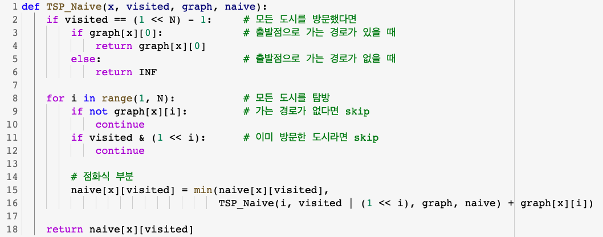

TSP(Traveling Salesman Problem)는 한 정점에서 다른 모든 정점을 순회하여 다시 출발 정점으로 돌아오는 최적의 경로를 찾는 알고리즘이다.

`TSP_Naive` 함수는 TSP 문제를 모든 경우를 탐색하는 완전 탐색 기법으로 문제를 푸는 함수이다. 모든 도시를 탐방하며, graph 배열에서 가는 경로가 없다면 그 경로를 skip한다. 또한, 이미 방문한 도시라면 skip한다.

`naive` 배열에는 현재 도시에서 남은 도시들을 거쳐 다시 출발점으로 돌아오는 비용이 저장하였다. `naive[x][visit]`는 현재 `x` 도시에 있을 때, 방문현황은 `visit`과 같고, 아직 방문하지 않은 도시들을 모두 거쳐 다시 시작점으로 돌아가는데 드는 최소 비용이다. 이때, 비트마스킹 기법을 사용하여 방문한 도시를 `visited`라는 변수에 2진수로 거친 도시를 표시하였다

`naive[x][visit]`이 next도시에서 남은 도시를 거쳐 시작점으로 돌아가는 최소비용이기 때문에 `naive[x][visit]`에 대한 점화식으로 나타내면 다음과 같다

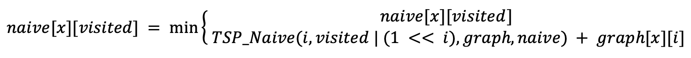

### (2) Dynamic Programming 기법 사용

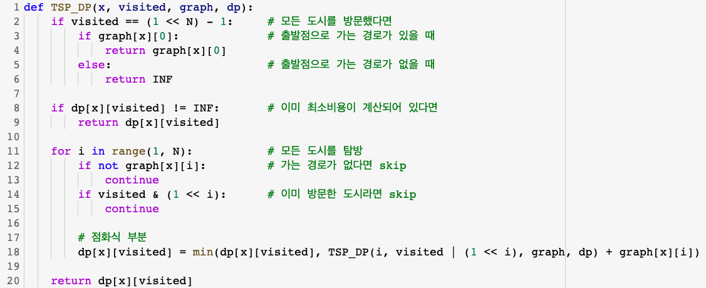

`TSP_DP` 함수는 기존의 `TSP_Naive` 함수를 개선하여 설계하였다. 8~9번 줄을 추가하였는데, `TSP_Naive` 함수에서의 `naive` 배열과 동일한 `dp` 배열에, 이미 최소 비용이 계산되어 있다면 추가로 계산할 필요가 없으므로 그 값을 반환한다. 불필요한 계산 낭비를 줄여주기 때문에 `TSP_Naive` 함수에 실행시간의 차이가 있을 것이라 기대하였다.

### (3) 유전자 알고리즘 (Genetic Algorithm) 사용

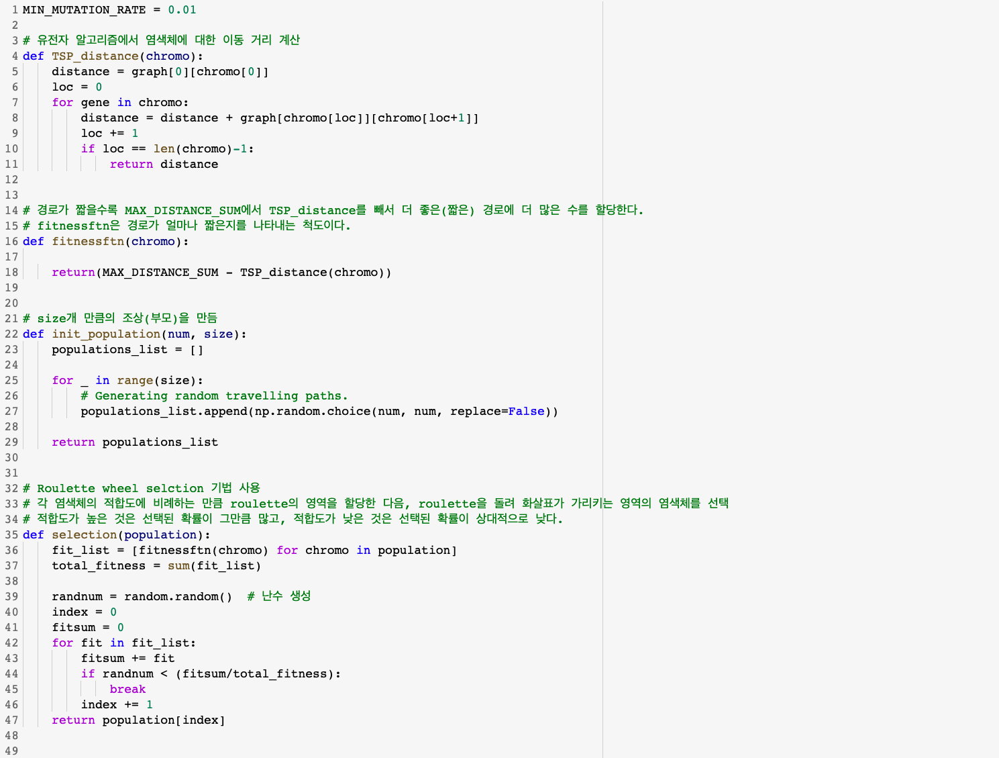 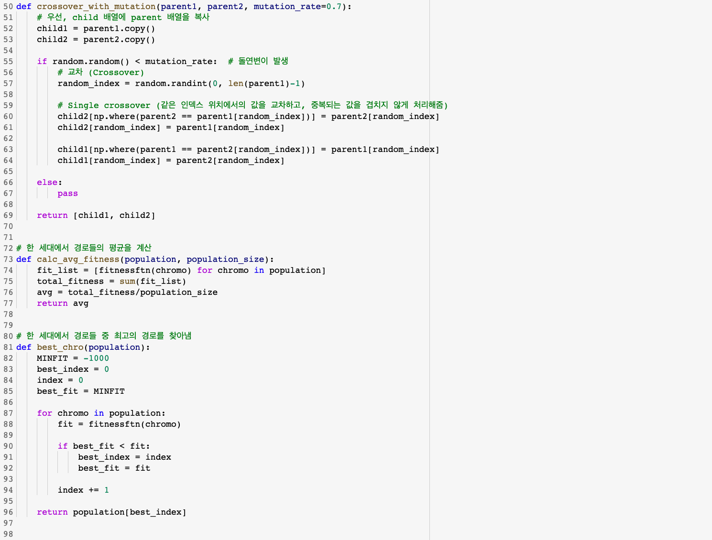 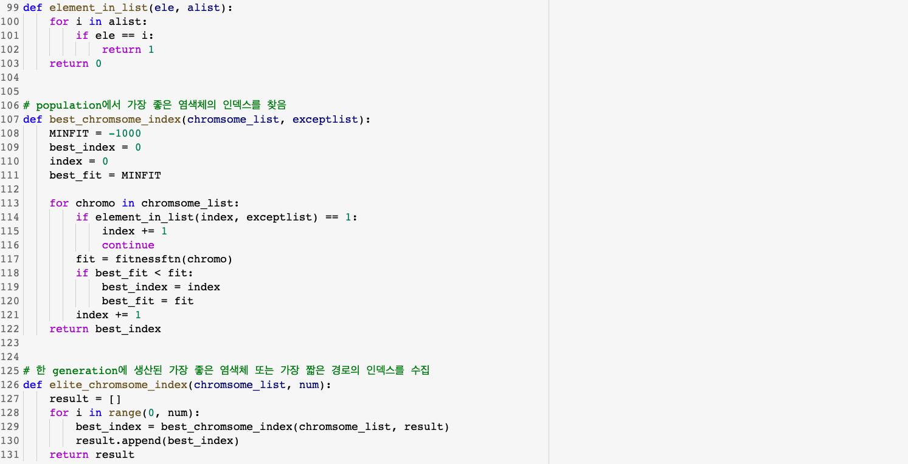

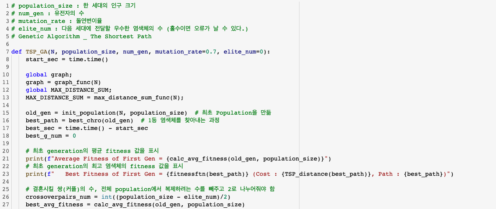 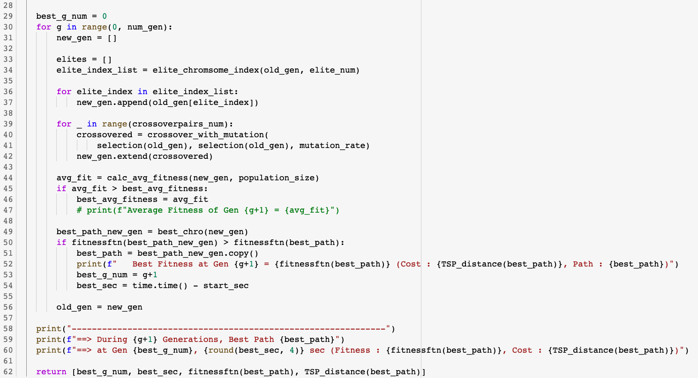

유전 알고리즘 (Genetic Algorithm)은 생물의 진화를 모방하여 최적해를 구하는 알고리즘이다. TSP 문제를 풀기 위해, 순열을 유전자형으로 가지는 순열 표현 (Permutation Encoding)을 Encoding 기법으로 사용하였다. 순열 표현은 순서 기반형 표현이므로 TSP 문제에 적합한 Encoding 기법이다.

Selection 기법으로는 Roulette wheel selction 기법을 사용하여 `selection` 함수를 만들었다. Roulette wheel selction 기법은 각 염색체의 적합도에 비례하는 만큼 roulette의 영역을 할당한 다음, roulette을 돌려 화살표가 가리키는 영역의 염색체를 선택하는 기법이다. 적합도가 높은 것은 선택된 확률이 그만큼 많고, 적합도가 낮은 것은 선택된 확률이 상대적으로 낮다는 특징이 있다. 설계된 함수이다.

Crossover 기법과 Mutation 기법을 구현하기 위해 하나의 `crossover_with_mutation` 함수로 만들었다. Single crossover 기법을 선택하여 사용하였는데, 같은 인덱스 위치에서의 값을 교차하고, 중복되는 값을 겹치지 않게 처리해주었다.

## 3. 실험

실험은 크게 3가지로 구성하여 성능을 비교해보았다. 사용하는 그래프는 각 실험마다 무작위로 구성된 그래프를 사용하였다.

### 실험 1) N값과 알고리즘에 따른 TSP의 실행시간 비교

#### 실험 1-1) Naive Algorithm과 Dynamic Programming의 비교

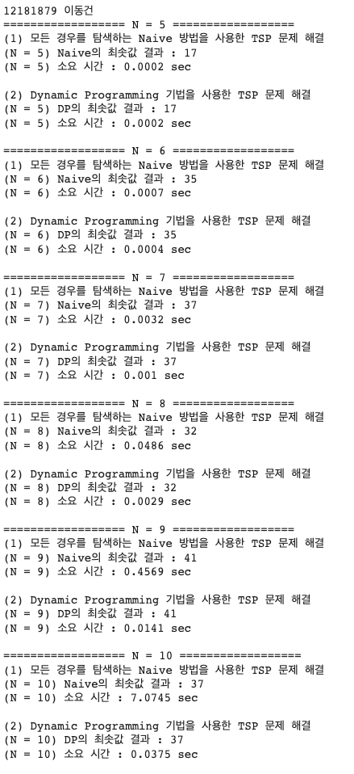 

이를 그래프로 나타내면 아래와 같다.

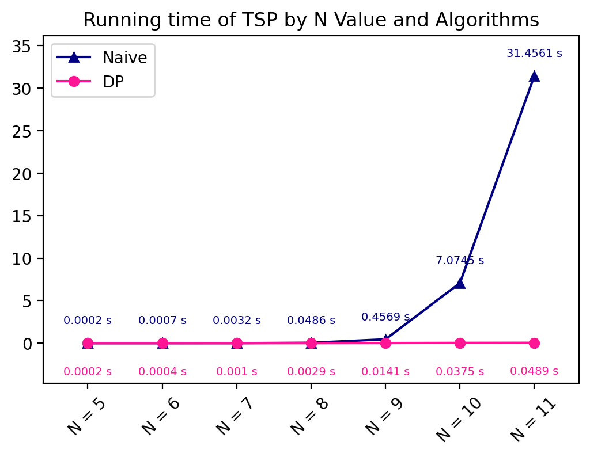

#### 실험 1-2) 유전 알고리즘에서의 N값에 따른 성능 비교 (최고 성능이 나온 세대, 시간)

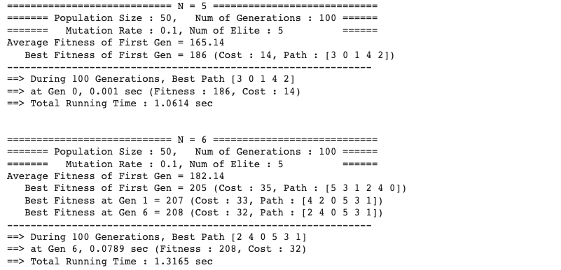 

이를 그래프로 나타내면 아래와 같다.

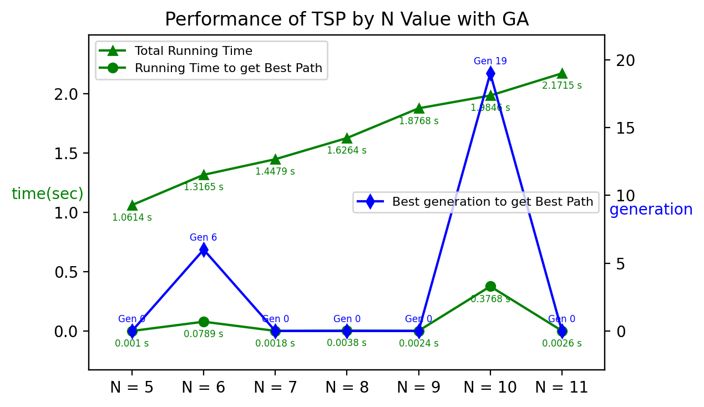

#### 실험 1-3) N값과 알고리즘에 따른 TSP의 실행시간 비교 (Naive, DP, GA)

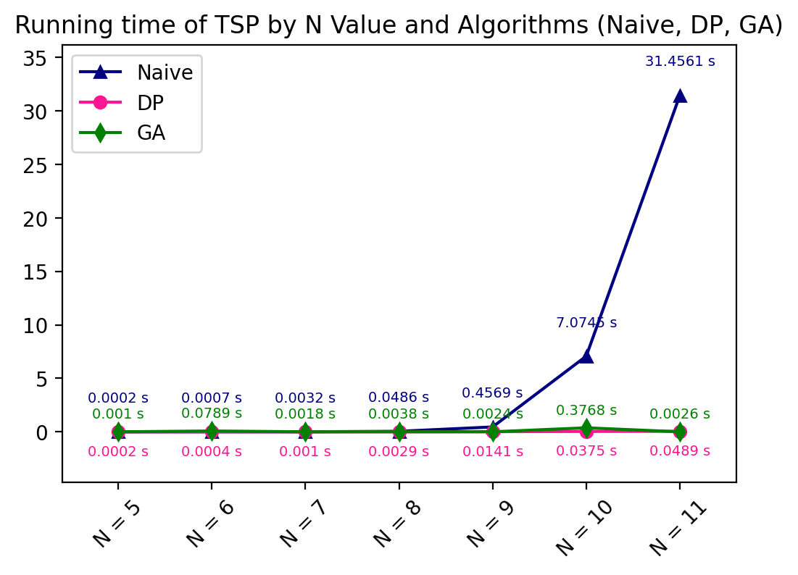

### 실험 2) N = 40일 때, mutation_rate에 따른 성능 비교

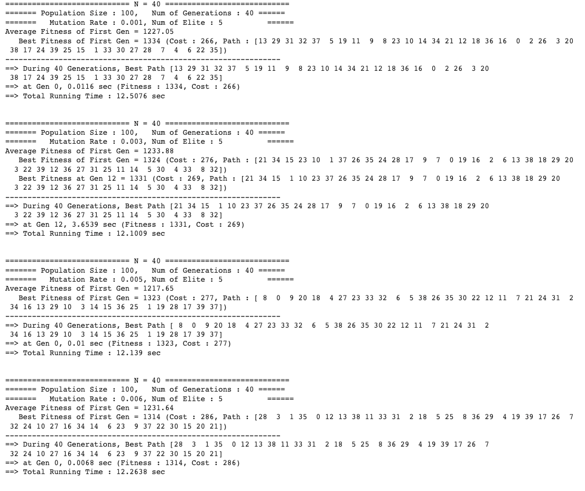

이를 그래프로 나타내면 아래와 같다.

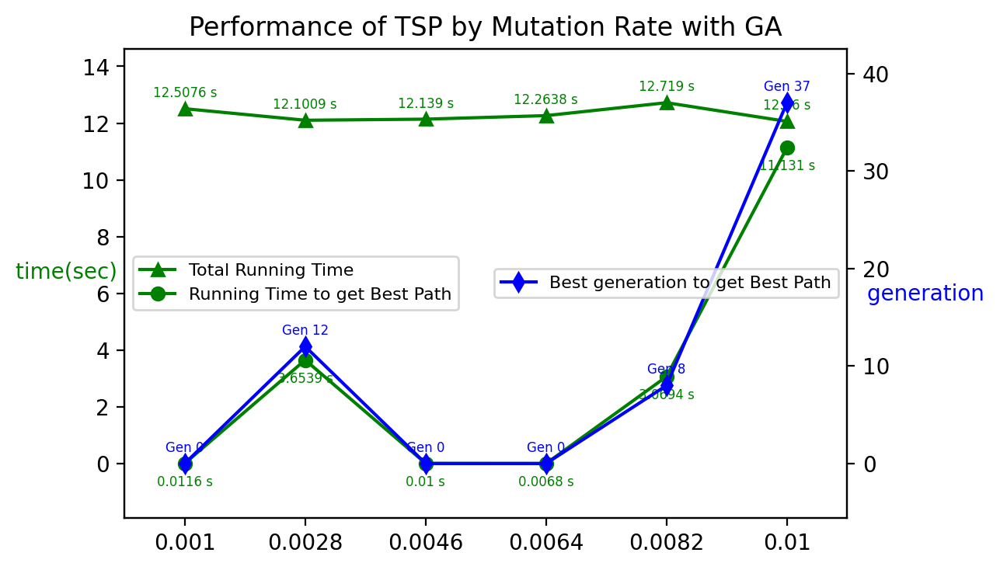

### 실험 3) N = 40일 때, elite_num에 따른 성능 비교

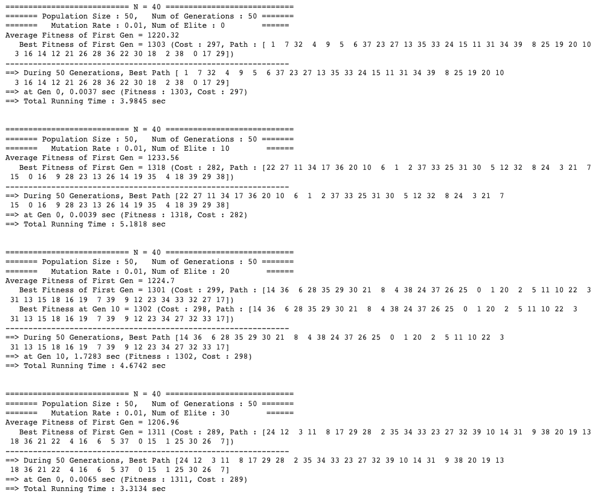 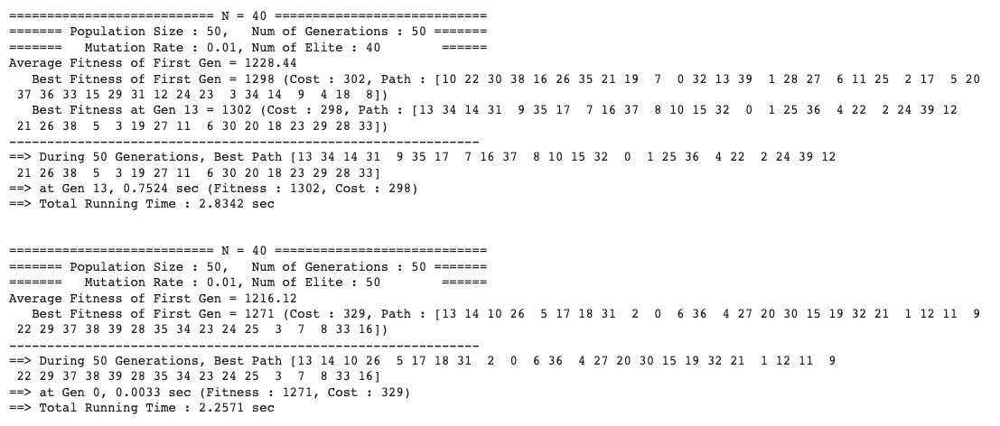

이를 그래프로 나타내면 아래와 같다.

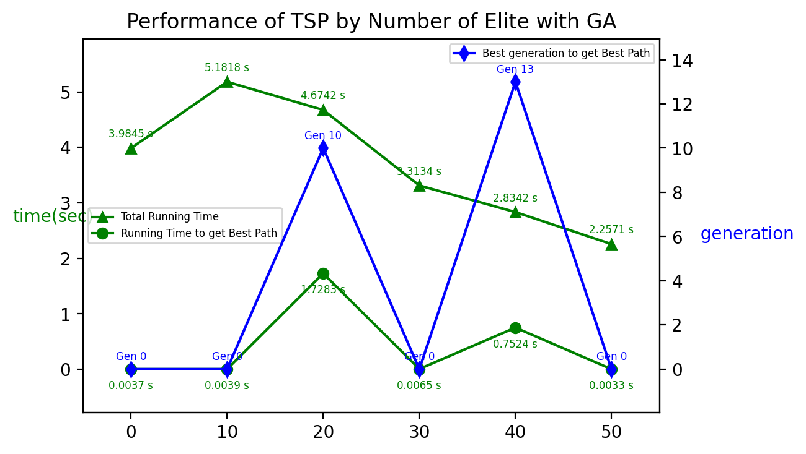
