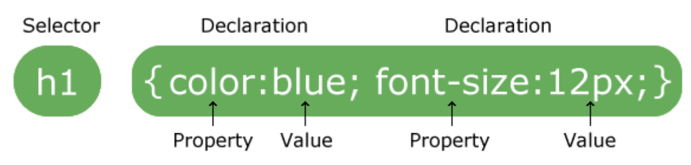
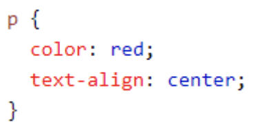
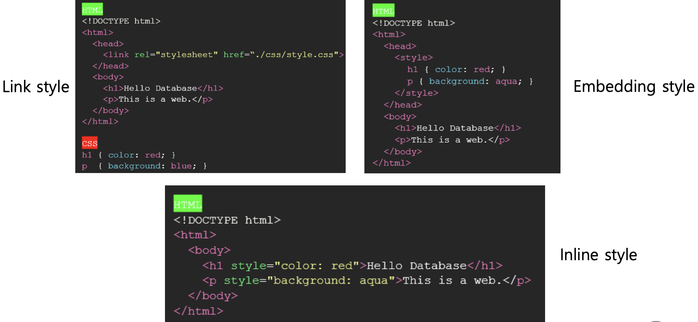
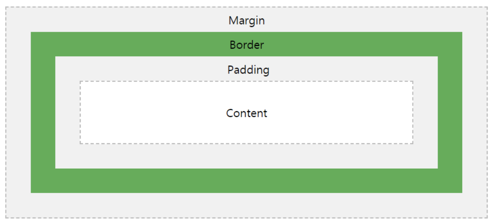
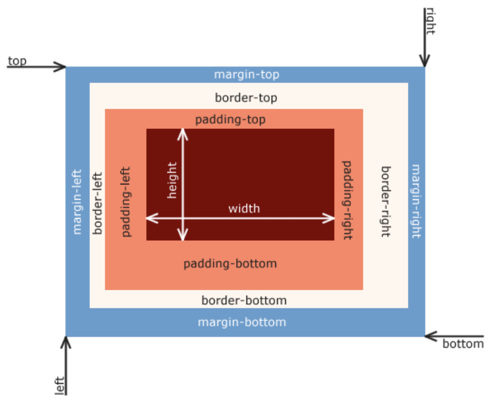

# HTML, CSS, JavaScript

- [HTML](#html-tag)
- [CSS](#css)
- [JavaScript](#javascript)

## HTML

### HTML TAG

- `<!DOCTYPE html>`
  - HTML5의 문서형식 정의, 대소문자를 구별하지 않음
- `<html>`
  - 모든 HTML 요소의 부모 요소로 웹페이지에 단 하나만 존재
- `<head>`
  - 메타데이터(title, style, link, script)를 포함하기 위한 요소
- `<title>`
  - 문서의 제목으로 브라우저의 탭에 표시됨
- `<style>`
  - HTML 문서를 위한 style 정보를 정의
- `<meta>`
  - Description, keywords, author 등의 정의에 사용. 주로 charset 정의
- `<script>`
  - 클라이언트 쪽 JavaScript를 정의
  - 예시)

```html
<script>
  document.addEventListener("click", function () {
    alert("Clicked!");
  });
</script>
```

- `<hn>`
  - 제목을 나타나 낼 때 사용하면 `h1`~`h6`까지 존재
- `<b>`, `<strong>`
  - **Bold**체를 지정, 의미론적(Semantic) 중요성을 가진다면 `<strong>`을 권장(웹 표준)
- `<p>`
  - 단락(paragraphs)을 지정
- `<br>`
  - 개행을 지정하며, 종료태그가 없음 => `<br>` 단독으로 사용
- `<a>`

  - 한 텍스트에서 다른 텍스트로 건너뛰어 읽기(하이퍼텍스트) – `href` 어트리뷰트 사용

- `<link>`
  - 외부 리소스와의 연계 정보를 정의하며 주로 외부 CSS 파일을 연계
- `<ol>`
  - 순서 있는 목록
- `<ul>`
  - 순서 없는 목록
- `<li>`
  - 목록 요소
- ``
  - 이미지 삽입
  - 예시)

```html

```

- `<div>`
  - 공간을 분할하는 태그로 의미론적으로 어떠한 의미도 가지고 있지 않지만 가장 많이 사용하는 태그 중 하나

### Layout


### HTML form

- 기본적인 form 태그 속성
  - method : 폼을 서버에 전송할 http 메소드를 지정 (GET, POST, DELETE등등)
  - action : 폼을 전송할 서버 쪽 스크립트 파일을 지정
  - name : 폼을 식별하기 위한 이름을 지정
  - accept-charset : 폼 전송에 사용할 문자 인코딩을 지정
  - target : action에서 지정한 스크립트 파일을 현재 창이 아닌 다른 위치에 열도록 지정

## CSS

CSS(Cascading Style Sheets)는 HTML의 각 요소(Element)의 style(design, layout etc.)을 정의하여 화면(Screen) 등에 어떻게 렌더링하면 되는지 브라우저에게 설명하기 위한 언어

참고 : https://www.w3schools.com/css/css_intro.asp

### Selector

- 스타일을 적용하고자 하는 HTML 요소를 선택
- 선택된 특정 HTML 요소를 어떻게 렌더링할 것인지 브라우저에 지시
  
- 모든 `<p>` 요소는 빨간색 텍스트 색상으로 가운데 정렬됨
  

참고 : https://www.w3schools.com/css/css_syntax.ASP

### HTML과 CSS 연동



### 키워드

- 각 프로퍼티에 따라 사용할 수 있는 키워드가 존재
- display 프로퍼티
  - `block`, `inline`, `inline-block`, `none`

### 크기 단위

- `px` (절대값)
- `em`, `rem`, `%` (상대값)
- 200만 화소(px) => 1600 (가로) \* 1200 (세로) = 1,920,000 (통상 200만 화소라 함)

### Box model

- Content, Padding, Border, Margin으로 구성
- Content: 요소의 텍스트나 이미지 등 실제 내용이 위치하는 영역
- Padding: border 안쪽에 위치하는 요소의 내부 여백
- Border: 테두리 영역으로 두께를 의미함
- Margin: 요소의 외부 여백




참고 : https://www.w3schools.com/css/css_boxmodel.asp

### Icon 사용

- https://fonts.google.com/icons?selected=Material+Icons
- `<head>` 태그 내에 <link> 태그에서 참조하도록 설정

```html
<link
  href="https://fonts.googleapis.com/icon?family=Material+Icons"
  rel="stylesheet"
/>
```

## JavaScript

### 문법

- `const`
  - 상수 선언 (`var`는 더 이상 사용하지 않음), 함수를 포함한 대부분의 선언은 `const`를 사용함
  - 변수가 필요한 경우만 `let` 사용

```js
const pi = 3.14;

let days = 1;
days = 2;
```

- 비교연산자
  - `===` : 두 값이 타입까지 완전히 일치하는지 확인
  - `==` : 타입은 검사하지 않음
  - `!==` : 두 값이 일치하지 않는 확인

```js
const num = 1;
const str = "1";

if (num === str) {
  console.log("true");
} else {
  console.log("false");
}
```

```js
const num = 1;
const str2 = 3;

if (num == num2) {
  console.log("true");
} else {
  console.log("false");
}
```

- 문자열
  - 문자열 조합 시 + 연산자를 사용할 수 있지만 템플릿 리터럴(``) 문법 사용

```js
function hello(name) {
  console.log(`Hello, ${name}!`);
}

hello("World!");
```

- 화살표 함수
  - 화살표 문법을 사용하여 간단하게 함수 선언 가능

```js
const hello = (name) => console.log(`Hello, ${name}!`);

hello("World!");
```

### 실행 방법

- IDE(VS Code)에서 Javascript 실행
  - 파일 확장자는 `.js`
  - 터미널 창에서 `node` 명령어로 실행 (`node [파일명.js]`)

```bash
$ node practice.js
```

### HTML tag 접근 방법

- Dom
  - The Document Object Model(DOM) 은 HTML, XML 문서의 프로그래밍 interface
  - DOM은 문서의 구조화된 표현(structured representation)을 제공
  - 프로그래밍 언어가 DOM 구조에 접근할 수 있는 방법을 제공
  - 문서 구조, 스타일, 내용 등을 변경할 수 있게 함
- `document.getElementById`(아이디)
  - html에서 해당 아이디를 가진 태그를 선택
- `getElementsByClassName`(클래스), `getElementsByName`(이름), `getElementsByTagName`(태그)
  - html에서 각각 해당 클래스, 네임, 태그명을 가진 태그를 선택
  - 여러개 선택되기 때문에 항상 배열
- `document.querySelector`(선택자)
  - css 선택자로 선택할 (아이디는 `#`, 클래스는 `.`)
