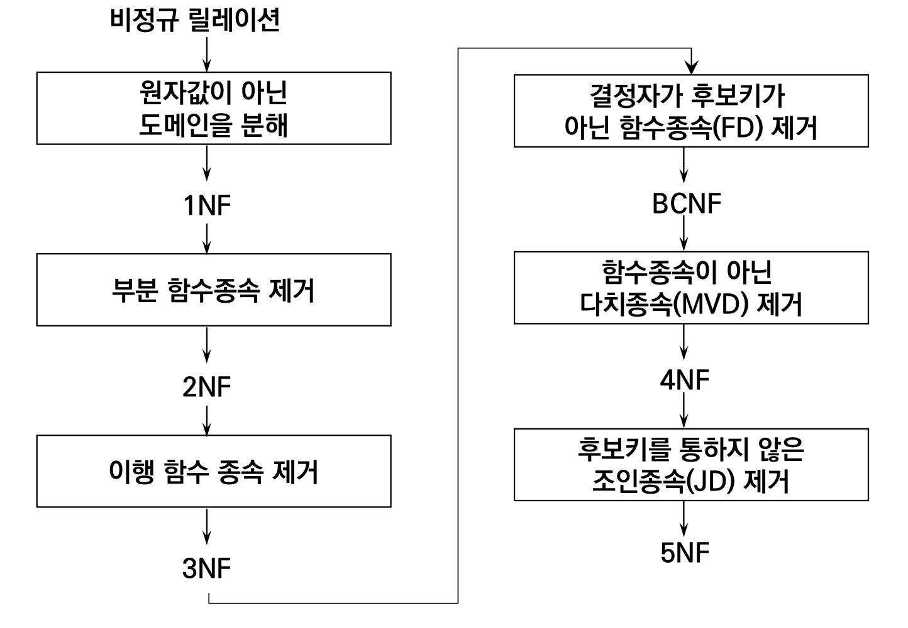
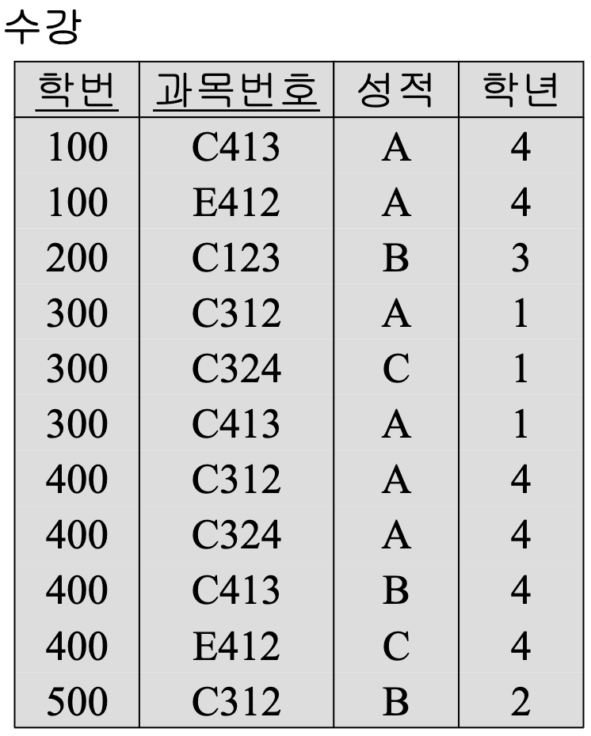
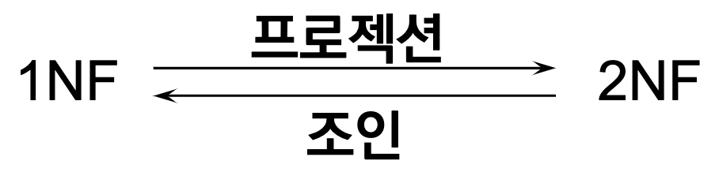

# FD and Normalization

- [릴레이션 스키마를 설계하는 몇 가지 개략적인 지침](#릴레이션-스키마를-설계하는-몇-가지-개략적인-지침)
- [함수적 종속성 (functional dependencies, FDs)](#함수적-종속성fd)
- [기본 키를 기반으로 한 정규형](#정규화normalization)
- [BCNF (Boyce-Codd Normal Form)](#bcnf-boyce-codd-normal-form)
- [더 많은 종속성과 정규형](#더-많은-종속성과-정규형)

---

## 릴레이션 스키마를 설계하는 몇 가지 개략적인 지침

먼저 좋은 릴레이션 설계에 관한 개괄적인 지침을 논의한 후, 함수적 종속성과 정규형 개념에 관해 논
의함

- 정규형의 종류
  - 1NF (제1정규형)
  - 2NF (제2정규형)
  - 3NF (제3정규형)
  - BCNF (Boyce-Codd 정규형)
  - 4NF (제4정규형)
  - 5NF (제5정규형)

### 릴레이션 애트리뷰트들의 의미

- 릴레이션 스키마를 형성하기 위해 애트리뷰트들을 집단화 하는 경우, 한 릴레이션에 속하는 애트리뷰트는 실세계에서 어떤 의미를 가져야 한다.
- 여러 엔티티(EMPLOYEE, DEPARTMENT, PROJECT)의 애트리뷰트들이 하나의 릴레이션에 혼합되면 의미가 불명확해지므로 좋지 않음.
  - **하나의 릴레이션은 하나의 엔티티나 관계**를 나타내는 것이 바람직함
- 다른 엔티티를 참조하기 위해서는 **외래키** 만을 사용해야 한다.

### Anomaly의 예

- 삭제이상(deletion anomaly)
  - 200번 학생이 'C123'의 등록을 취소
    - 3학년이라는 정보도 **함께 삭제됨**
  - 연쇄 삭제(triggered deletion)에 의한 **정보의 손실(loss of information)**
- 삽입이상(insertion anomaly)
  - 600번 학생이 2학년이라는 사실을 삽입
    - 어떤 과목을 등록하지 않는 한 **삽입이 불가능**
      - (∵ 과목 번호가 기본 키)
  - 원하지 않는 정보의 강제 삽입
- 갱신이상(update anomaly)
  - 400번 학생의 학년을 4에서 3으로 변경
    - 학번이 400인 4개의 투플 **모두를 갱신**시켜야 함
  - 중복데이타의 일부 갱신으로 정보의 모순성(inconsistency) 발생

결론 :

> 애트리뷰트들 간의 종속관계를 분석하여 여러개의 릴레이션으로 분해(decomposition) ⇒ **정규화(normalization)**

### 튜플의 NULL 값

- 릴레이션의 투플들이 (가급적) 널 값을 가지지 않도록 설계해야 함
  - 널 값은 저장 단계에서 공간을 낭비하게 되고
  - 논리적 차원에서는 조인 연산들을 지정하기 힘들고
  - 애트리뷰트들의 의미를 이해하기 어려움
  - COUNT나 AVG와 같은 집단 함수들이 적용되었을 때 널 값의 해석이 모호함
  - 널 값은 다음과 같이 여러 가지로 해석이 가능함
    - 그 애트리뷰트가 이 투플에는 적용되지 않는다. (존재 여부를 모른다)
    - 이 투플에서 애트리뷰트의 값이 아직 알려져 있지 않다 (존재하지만 모른다).
    - 애트리뷰트 값이 알려져 있지만 DB에 기록되지는 않았다.
  - 모든 널 값을 동일하게 표현하면 널 값이 갖는 여러 의미를 훼손하게 된다.
- 널 값의 방지 기법 : 릴레이션의 분리
  - 널 값이 많이 나타나는 애트리뷰트들은 **별도 릴레이션으로 분리**함
  - 예: 사원들 중 10%만이 자기의 사무실을 가지고 있는 경우, 사원 레코드의 90%는 널 값으로 채워짐

### 정보의 변형으로 인한 가짜 투플 (Spurious Tuple)

- 관계 데이터베이스 설계를 잘못하게 되면, 조인 연산들이 틀린 결과를 생성할 수 있다.
- 조인 연산의 결과가 올바르기 위해서는, 릴레이션들이 “무손실 조인(lossless join)” 조건을 만족하도록 설계되어야 한다.
- 무손실 조인 특성: 원래의 릴레이션을 분해하여 두 릴레이션을 생성하는 경우, 분해된 두 릴레이션을 조인하면 원래의 릴레이션이 복원되어야 한다.
- 무손실 조인 특성이 만족되지 않으면 조인 시 원래의 릴레이션에 없던 가짜 투플이 발생함.
- 분해 시 (기본키, 외래키) 조합을 이용하는 것이 바람직함
  - 키가 아닌 애트리뷰트를 매개로 분해하면 조인 시 가짜 투플이 발생할 수 있음

## 함수적 종속성(FD)

- 함수적 종속성(FD: functional dependency)은 좋은 릴레이션 설계의 정형적 기준으로 사용된다.
- FD와 키는 릴레이션의 정규형을 정의하기 위해 사용된다.
- FD는 데이터 애트리뷰트들의 의미와 애트리뷰트들 간의 상호 관계로부터 유도되는 제약조건(constraints)의 일종이다.

### 함수적 종속성의 정의 (1/2)

- 함수적 종속성
  - X와 Y를 임의의 애트리뷰트 집합이라고 할 때, X의 값이 Y의 값을 유일하게(unique) 결정한다면 “X는 Y를 함수적으로 결정한다(functionally determines)”라고 함
  - X → Y로 표기하고, “Y는 X에 함수적으로 종속된다” 라고 함
    - X를 결정자(determinant)
    - Y를 종속자(dependent)
  - 함수적 종속성은 모든 릴레이션 인스턴스 r(R)에 대하여 성립해야 함
- 함수적 종속성의 검사 방법
  - 릴레이션 인스턴스 r(R)에 속하는 어떠한 임의의 두 투플에 대해서도 속성들의 집합 X에 대해 동일한 값을 가질 때마다 Y에 대해서도 동일한 값을 가진다면 X → Y라는 함수적 종속성이 성립한다.
  - 즉, r(R)에서의 임의의 두 투플 t1과 t2에 대해 t1[X] = t2[X]이면, t1[Y] = t2[Y]이다.
- FD 제약조건의 예제
  - 주민등록번호는 사원의 이름을 결정한다.
    - SSN → ENAME
  - 프로젝트 번호는 프로젝트 이름과 위치를 결정한다.
    - PNUMBER → {PNAME, PLOCATION}
  - 사원의 주민등록번호와 프로젝트 번호는 그 사원이 일주일 동안 그 프로젝트을 위해서 일하는 시간을 결정한다.
    - {SSN, PNUMBER} → HOURS
- FD는 스키마 R에 있는 애트리뷰트들의 특성이며, 모든 릴레이션 인스턴스 r(R)에서 성립해야 하는 성질이다.
- K가 R의 키이면 K는 R의 모든 애트리뷰트들을 함수적으로 결정한다.
  - (t1[K] = t2[K]인 서로 다른 두 투플이 존재하지 않기 때문에).

### 완전 함수 종속과 부분 함수 종속

복합 애트리뷰트 X에 대하여 X ®Y가 성립할 때

- 완전 함수 종속 (full functional dependency)
  - X' ⊂ X 이고 X' ⊂ Y 를 만족하는 애트리뷰트 X'이 존재하지 않음
- 부분 함수 종속 (partial functional dependency)
  - X' ⊂ X 이고 X' ⊂ Y 를 만족하는 애트리뷰트 X'이 존재함

#### 함수 종속에 대한 추론 규칙

- R1: (반사, reflexive) A ⊇ B이면 A → B이다. 또한 A → A이다
- R2: (첨가, augmentation) A → B이면 AC → BC이고 AC → B이다.
- R3: (이행, transitive) A → B이고 B → C이면 A → C이다.
- R4: (분해, decomposition) A → BC이면 A → B이다.
- R5: (결합, union) A → B이고 A → C이면 A → BC이다.

#### Note

- 함수 종속은 데이타의 의미(data semantics) 를 표현
  - 예: “학번 → 학년”의 의미는 “학생은 하나의 학년에만 속한다”
  - 의미적 제약 조건
- DBMS는 함수 종속을 유지하기 위하여 함수 종속을 스키마에 명세하는 방법과 함수 종속을 보장하는 방법을 제공하여야 함

## 정규화(normalization)

- 정규화(normalization)
  - 개념 : **서로 독립적인 관계(relationship)는 별개의 릴레이션으로 분해**
  - 이상이 있는 “나쁜” 릴레이션의 애트리뷰트들을 나누어서 더 작은 “좋은” 릴레이션으로 분해하는 과정
- **decomposition**
- 정규형(normal form)
  - 특정 조건을 만족하는 릴레이션 스키마의 형태
- 제1정규형, 제2정규형, 제3정규형, BCNF
  - 릴레이션 스키마의 FD와 키에 기반하여 정의됨
- 일반적으로 업계에서는 제 3 정규형 또는 BCNF형까지 고려
- 주요 애트리뷰트: 키(기본키, 후보기 모두 포함)에 속하는 애트리뷰트
- 비주요 애트리뷰트: 주요 애트리뷰트가 아닌 애트리뷰트

### 제1정규형 (1NF)

- 애트리뷰트의 도메인이 오직 원자 값만을 포함하고, 투플의 모든 애트리뷰트가 도메인에 속하는 하나의 값을 가져야 함
- 복합 애트리뷰트(composite attribute), 다치 애트리뷰트(multivalue attribute), 그리고 중첩 릴레이션(nested relation) 등 비원자적(non-atomic) 애트리뷰트들을 허용하지 않은 릴레이션의 형태

#### 1NF의 이상(anomaly)

- 1NF로 정규화하여도 이상(anomaly)이 발생함
  - 삽입이상
  - 삭제이상
  - 갱신이상
- 1NF 이상의 원인
  - 기본키에 부분 함수 종속된 애트리뷰트가 존재
  - 기본키로 식별되는 개체와 무관한 애트리뷰트가 존재
  - 두가지 상이한 정보가 포함
- 1NF 이상의 해결
  - 프로젝션으로 릴레이션을 분해 (부분 함수 종속을 제거)
  - ⇒ 2NF

### 제2정규형 (2NF)

- 제2정규형은 기본키와 완전 함수적 종속성의 개념에 기반을 둔다.
- 완전 함수적 종속성(full functional dependency):
  - FD Y→Z에서 Y의 어떤 애트리뷰트라도 제거하면 더 이상 함수적 종속성이 성립하지 않는 경우
- 예제:
  - {SSN, PNUMBER} → HOURS는 SSN → HOURS와 PNUMBER → HOURS가 성립하지 않기 때문에 완전 함수적 종속성이다.
  - {SSN, PNUMBER} → ENAME은 SSN → ENAME이 성립하기 때문에 완전 함수적 종속성이 아니다 - (이는 부분 함수 종속성(partial functional dependency)이라고 부름).
- 제 2 정규형의 정의:
  - 릴레이션 스키마 R의 모든 비주요 애트리뷰트들이 기본키에 대해서 완전 함수적 종속이면, R은 제2정규형(2NF)에 속한다.
  - 1NF이고, 키에 속하지 않는 애트리뷰트들은 모두 기본키에 완전 함수 종속

#### 무손실 분해(nonloss decomposition)

- 프로젝션하여 분해된 릴레이션들은 자연 조인을 통해 원래의 릴레이션으로 복귀 가능
- 원래의 릴레이션에서 얻을 수 있는 정보는 분해된 릴레이션들로 부터도 얻을 수 있음 그러나, 그 역은 성립하지 않음
- (500번 학생의 지도교수가 P4라는 정보는 원래의 릴레이션에서 표현할 수 없음)

#### 2NF의 이상(anomaly)

- 2NF로 정규화하여도 이상(anomaly)가 있음 : 예) 지도 릴레이션
  - 삽입이상
    - 어떤 지도교수가 특정 학과에 속한다는 사실의 삽입 불가능
  - 삭제이상
    - 300번 학생의 투플을 삭제하면 지도교수 P3가 컴퓨터공학과에 속한다는 정보 손실
  - 갱신이상
    - 지도교수 P1의 소속이 컴퓨터공학과에서 전자과로 변경된다면 학번이 100과 400번인 두개의 투플을 모두 변경하여야 함
- 2NF 이상의 원인
  - 이행적(transitive) 함수 종속이 존재
- 2NF 이상의 해결
  - 프로젝션으로 릴레이션 분해 (이행적 함수 종속을 제거)
  - ⇒ 3NF

### 제3정규형 (3NF)

- 제3정규형은 이행 함수적 종속성을 제거가 목적
- 이행 함수적 종속성(transitive functional dependency):
  - 두 FD Y → X와 X → Z에 의해서 추론될 수 있는 FD Y → Z
- 예제
  - SSN → DMGRSSN은 SSN → DNUMBER과 DNUMBER → DMGRSSN이 성립하기 때문에 이행적 함수적 종속성이다.
  - SSN → ENAME는 SSN → X이고 X → ENAME인 애트리뷰트 집합 X가 존재하지 않기 때문에 이행적 종속성이 아니다.
- 제3정규형의 정의:
  - 릴레이션 스키마 R이 제2정규형을 만족하고,
  - R의 어떤 비주요 애트리뷰트도 기본키에 대해서 이행적으로 종속되지 않으면 R은 제3정규형을 만족한다고 함

#### 3NF의 약점

- 적용 불가능한 경우
  - 복수의 후보키를 가지고 있고
  - 후보키들이 복합 애트리뷰트들로 구성되고
  - 후보키들이 서로 중첩되는 경우
- ⇒ 보다 일반적인 Boyce/Codd Normal Form(BCNF)을 제안

- Note
  - 키가 아닌 애트리뷰트 값의 갱신시 불필요한 부작용(이상) 발생 없음
  - 모든 이진 릴레이션은 3NF에 속함

### ERD의 정규화 분석

- 1NF를 만족하고 있는지 분석
  - 1NF : 중복된 행(repeating groups)이 없고, 모든 속성은 원자값(atomic value)
  - ERD에 있는 모든 entity가 PK가 있는지 확인
  - 1NF를 만족하고 있는지 판단
- 2NF를 만족하고 있는지 분석
  - 2NF : 부분적 함수 종속을 제거
  - PK가 1개이면 무조건 2NF를 만족
  - PK가 2개 이상의 속성으로 이루어진 entity에서 PK속성일부와 나머지 속성들이 종속 관계가 있는지 일일이 체크해야 함
- 3NF를 만족하고 있는지 분석
  - 3NF : 이행적 함수종속을 제거
  - PK가 아닌 속성들 중에서 종속관계가 있는지 일일이 체크해야 한다.

## BCNF (Boyce-Codd Normal Form)

- 릴레이션 스키마 R에서 성립하는 임의의 FD X → A에서 X가 R의 슈퍼키이면 R은 Boyce-Codd 정규형(BCNF)을 갖는다고 한다.
  - 즉, 릴레이션 R의 모든 결정자가 후보키이면 릴레이션 R은 BCNF에 속한다.
- 각 정규형은 그의 선행 정규형보다 더 엄격한 조건을 갖는다. (strong 3NF라고도 함)
  - 모든 제2정규형 릴레이션은 제1정규형을 갖는다.
  - 모든 제3정규형 릴레이션은 제2정규형을 갖는다.
  - 모든 BCNF 릴레이션은 제3정규형을 갖는다.
- 제3정규형에는 속하나 BCNF에는 속하지 않는 릴레이션이 존재한다.
  - 관계 데이터베이스 설계의 목표는 각 릴레이션이 BCNF(또는 3NF)를 갖게 하는 것이다.

## 더 많은 종속성과 정규형

### 다치 종속성과 제4정규형(4NF)

- 함수적 종속성은 하나의 공통된 형태의 제약조건을 명기하기 위해서 사용되며, 함수적 종속성 만에 의해서 명기될 수 없는 다른 형태의 제약조건들이 존재한다.
- 추가적인 종속성에는 다치 종속성(multi-valued dependency)이 있으며, 이에 기반한 정규형이 제4정규형(4NF)이다.
- 제4정규형의 특성
  - 3NF와 BCNF는 다치 종속성을 다루지 않는다.
  - 비단순 다치 종속성을 가지는 릴레이션 스키마는 좋은 디자인이 아닐 수 있다.
  - 제 4 정규형은 위와 같은 문제를 다루며, BCNF 정규형이 된다.
    - (제 4 정규형에 속하는 모든 릴레이션은 BCNF 정규형에 속한다)

### 조인 종속성과 제5정규형(5NF)

- 또 다른 추가적 종속성으로 조인 종속성(Join Dependency)이 있으며, 이에 기반한 정규형이 제5정규형이다.
  - 조인 종속(JD, Join Dependency)
    - 릴레이션 R이 그의 프로젝션 A, B, ..., Z의 조인과 동일하면 R은 JD \*(A, B, ..., Z)을 만족.
- 제5정규형(5NF)
  - 함수적 종속성, 다치 종속성, 조인 종속성을 모두 고려하는 정규형으로, 프로젝트-조인 정규형 (Project-Join NF: PJNF)이라고도 한다.
  - 조인 종속성을 발견하는 것은 매우 어려운 일로, 실제로 제5정규형은 거의 쓰이지 않는다.

---

## Source

1. **Fundamentals of Database Systems 7th Edition** by Ramez Elmasri, Shamkant B. Navathe.
