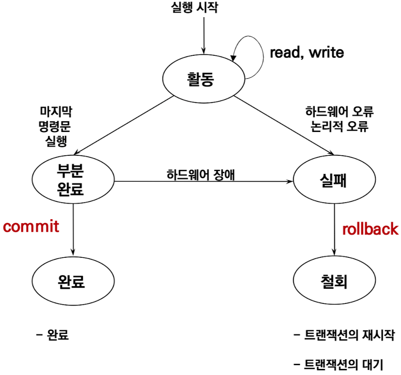

# 목차

<!-- TOC start -->

- [Transaction Processing](#transaction-processing)
  - [트랜잭션의 정의](#트랜잭션의-정의)
  - [트랜잭션의 주요 성질: **ACID**](#트랜잭션의-주요-성질-acid)
  - [원자성을 위한 연산](#원자성을-위한-연산)
  - [MySQL의 autocommit, commit, rollback](#mysql의-autocommit-commit-rollback)
  - [트랜잭션 상태](#트랜잭션-상태)
    - [트랜잭션의 예](#트랜잭션의-예)
    - [실패 상태에 있는 트랜잭션](#실패-상태에-있는-트랜잭션)
  - [장애](#장애)
    - [저장장치와 장애](#저장장치와-장애)
  - [회복 (recovery)](#회복-recovery)
    - [회복을 위한 연산](#회복을-위한-연산)
      - [데이터베이스 로그 : 로그 압축](#데이터베이스-로그-:-로그-압축)
    - [다양한 회복 기법](#다양한-회복-기법)
      - (1) 로그 기반 회복 기법
        - [(1-1) 즉시 갱신 회복 기법](#1-1-즉시-갱신-회복-기법)
        - [(1-2) 지연 갱신 회복 기법](#1-2-지연갱신의-회복)
      - [(2) 검사 시점 회복 기법](#2-검사시점-회복)
      - [(3) 미디어 회복 기법](#3-미디어-회복-기법)
- [References](#references)
    <!-- TOC end -->

# Transaction Processing

- 데이터의 공유와 다수 사용자 트랜잭션 처리
  - 여러 사용자가 (**동시**에) 동일한 데이터베이스 공유 가능하도록 지원
  - 동시에 사용하더라도 **일관성**(consistency)을 보장하기 위한 **동시성** 제어 (concurrency control) 기능 제공

## 트랜잭션의 정의

- 데이터베이스의 상태를 변환시키는 하나의 논리적 기능을 수행하기 위한 작업의 단위 프로세스 (예: 계좌이체, 좌석예약)
  - 장애가 일어날 때 데이터를 복구하는 작업의 단위가 됨
  - 동시에 같은 데이터를 다룰 때가 이 작업을 서로 분리하는 단위가 됨
- 하나의 작업을 수행하는 데 필요한 데이터베이스의 연산들을 모아놓은 것 (한꺼번에 모두 수행되어야 할 일련의 연산들)

## 트랜잭션의 주요 성질: **ACID**

- **A**tomicity (원자성)
  <!-- - 트랜잭션과 관련된 작업들이 부분적으로 실행되다가 중단되지 않는 것을 보장하는 능력 -->
  - 트랜잭션과 관련된 작업들은 전부 정상적으로 실행되거나, 아예 하나도 실행되지 않아야 한다. (all or nothing)
- **C**onsistency (일관성)
  <!-- - 트랜잭션이 실행을 성공적으로 완료하면 언제나 일관성 있는 데이터베이스 상태로 유지하는 것을 의미 -->
  - 트랜잭션이 성공적으로 수행된 후에도, 데이터베이스는 항상 일관된 상태를 유지해야 한다.
- **I**solation (격리성, 고립성)
  <!-- - 트랜잭션을 수행 시 다른 트랜잭션의 연산 작업이 끼어들지 못하도록 보장하는 것을 의미 -->
  - 현재 수행 중인 트랜잭션이 완료될 때까지 트랜잭션이 생성한 중간 연산 결과에, 다른 트랜잭션들이 접근할 수 없어야 한다.
- **D**urability (지속성, 영속성)
  - 성공적으로 수행된 트랜잭션은 손실되지 않고, 영구적으로 반영되어야 한다.

## 원자성을 위한 연산

- Commit (완료)
  - 트랜잭션의 성공적인 실행
    - 일관성 있는 데이터베이스 상태 (Consistency)
  - 영구적인 갱신
  - 갱신된 데이터의 영속성을 보장 (Durability)
- Rollback (취소, 복귀)
  - 트랜잭션 실행의 실패
    - 모순된 데이터베이스 상태
  - 수행한 모든 연산 결과의 UNDO

## MySQL의 autocommit, commit, rollback

```sql
mysql> SHOW VARIABLES LIKE "%commit%";
+-----------------------------------------+-------------------+
| Variable_name                           | Value             |
+-----------------------------------------+-------------------+
| autocommit                              | ON                |
| binlog_group_commit_sync_delay          | 0                 |
| binlog_group_commit_sync_no_delay_count | 0                 |
| binlog_order_commits                    | ON                |
| innodb_api_bk_commiTinterval           | 5                 |
| innodb_commit_concurrency               | 0                 |
| innodb_flush_log_at_trx_commit          | 1                 |
| original_commit_timestamp               | 36028797018963968 |
| replica_preserve_commit_order           | ON                |
| replication_sender_observe_commit_only  | OFF               |
| slave_preserve_commit_order             | ON                |
+-----------------------------------------+-------------------+
11 rows in set (0.06 sec)

mysql> SET autocommit = 0;
Query OK, 0 rows affected (0.00 sec)

mysql> SHOW VARIABLES LIKE "%commit%";
+-----------------------------------------+-------------------+
| Variable_name                           | Value             |
+-----------------------------------------+-------------------+
| autocommit                              | OFF               |
| binlog_group_commit_sync_delay          | 0                 |
| binlog_group_commit_sync_no_delay_count | 0                 |
| binlog_order_commits                    | ON                |
| innodb_api_bk_commiTinterval           | 5                 |
| innodb_commit_concurrency               | 0                 |
| innodb_flush_log_at_trx_commit          | 1                 |
| original_commit_timestamp               | 36028797018963968 |
| replica_preserve_commit_order           | ON                |
| replication_sender_observe_commit_only  | OFF               |
| slave_preserve_commit_order             | ON                |
+-----------------------------------------+-------------------+
11 rows in set (0.00 sec)
```

```sql
mysql> CREATE TABLE customer (a INT, b CHAR (20), INDEX (a));
Query OK, 0 rows affected (0.00 sec)

mysql> -- Do a transaction with autocommit turned on.
mysql> START TRANSACTION;
Query OK, 0 rows affected (0.00 sec)

mysql> INSERT INTO customer VALUES (10, 'Heikki');
Query OK, 1 row affected (0.00 sec)

mysql> COMMIT;
Query OK, 0 rows affected (0.00 sec)

mysql> -- Do another transaction with autocommit turned off.
mysql> SET autocommit=0;
Query OK, 0 rows affected (0.00 sec)

mysq1> INSERT INTO customer VALUES (15, 'John');
Query OK, 1 row affected (0.00 sec)

mysq1> INSERT INTO customer VALUES (20, 'Paul');
Query OK, 1 row affected (0.00 sec)

mysql> DELETE FROM customer WHERE b = 'Heikki';
Query OK, 1 row affected (0.00 sec)

mysql> -- Now we undo those last 2 inserts and the delete.
mysql> ROLLBACK;
Query OK, 0 rows affected (0.00 sec)

mysql> SELECT * FROM customer;
+------+---------+
| a    | b       |
+------+---------+
|   10 | Heikki  |
+------+---------+
1 row in set (0.00 sec)
```

## 트랜잭션 상태

- 트랜잭션의 상태는 다섯가지 상태 중 하나에 속하게 된다.
  - 활동 상태
    - 트랜잭션이 수행되기 시작하여 현재 수행 중인 상태
  - 부분 완료 상태
    - 트랜잭션의 마지막 연산이 실행된 직후의 상태.
    - 모든 연산의 처리가 끝났지만 트랜잭션이 수행된 최종 결과를 데이터베이스에 아직 반영하지 않은 상태
  - 완료 상태
    - 성공적으로 완료되어 커밋 연산을 실행한 상태
  - 실패 상태
    - 장애가 발생하여 트랜잭션의 수행이 중단된 상태
  - 철회 상태
    - 트랜잭션을 수행하는데 실패하여 롤백연산을 실행한 상태



- 프로그램 : 하나 이상의 트랜잭션을 포함
  - 프로그램의 성공적인 수행 = 모든 트랜잭션의 성공적인 완료

### 트랜잭션의 예

- 계좌 A에서 계좌 B로 100원을 이체
- ```sql
  BEGIN_TRANS;
      UPDATE ACCOUNT SET Balance = Balance - 100 WHERE Accnt = 'A';
      IF ERROR GO TO UNDO;

      UPDATE ACCOUNT SET Balance = Balance + 100 WHERE Accnt = 'B';
      IF ERROR GO TO UNDO;

      COMMIT TRANS;
      GO TO FINISH
      UNDO:
          ROLLBACK TRANS;
      FINISH:
          RETURN;
  END_TRANS;
  ```

### 실패 상태에 있는 트랜잭션

- 데이터베이스 상태를 트랜잭션 실행이 시작되기 직전의 상태로 환원 시키기 위해 Rollback 연산 실행
- 그 뒤에서 철회 상태의 트랜잭션으로 되어 종료
- 이때 취할 수 있는 조치
  - 트랜잭션의 재시작 : 하드웨어나 시스템 소프트웨어 오류로 인해 철회된 트랜잭션은 다시 새로운 트랜잭션으로 취급되어 재시작
  - 트랜잭션의 폐기 : 트랜잭션의 내부적 오류로 재작성을 해야 하든지 원하는 데이터가 데이터베이스에 없는 경우에 취하는 조치

## 장애

- 시스템이 정해진 명세대로 작동하지 않는 상태
- 원인 : 하드웨어 결함, 소프트웨어의 논리오류, 사람의 실수
- 장애의 유형
  - 트랜잭션 장애 : 논리적 오류, 입력 데이터의 불량
  - 시스템 장애 : 하드웨어의 오동작
  - 미디어 장애 : 디스크 헤드 붕괴 또는 고장

### 저장장치와 장애

- 휘발성 저장 장치
  - 장애가 발생하면 저장된 데이터가 손실됨 (메인 메모리)
- 비휘발성 저장 장치
  - 장애가 발생해도 저장된 데이터가 손실되지 않음.
  - 단, 디스크 헤더 손상 같은 저장 장치 자체에 이상이 발생하면 데이터가 손실될 수도 있음
- 안정 저장 장치
  - 비휘발성 저장 장치를 이용해 데이터 복사본 여러 개를 만드는 방법으로, 어떤 장애가 발생해도 데이터가 손실되지 않고 데이터를 영구적으로 저장할 수 있음

## 회복 (recovery)

- 데이터베이스를 장애 발생 이전의 일관된 상태 (consistent state)로 복원시키는 것
  - 일관된 상태 : 데이터베이스에 오류가 없는 상태, 데이터베이스의 내용에 모순이 없는 상태
- 기본원리 : **중복(redundancy)**

### 회복을 위한 연산

- 덤프 (dump)
  - full backup, 데이터베이스 전체를 다른 저장 장치에 주기적으로 복사하는 방법 (archive)
- **로그** (log, journal)
  - 데이터베이스에서 변경 연산이 실행될 때마다, 데이터를 변경하기 이전 값과 변경한 이후의 값을 별도의 파일에 기록하는 방법
- REDO (재실행) : 가장 최근 복제본 + 로그
  - **가장 최근에 저장한 데이터베이스 복사본**을 가져온 후 **로그를 이용해** 복사본이 만들어진 이후에 실행된 모든 변경 **연산을 재실행**하여 장애가 발생하기 직전의 데이터베이스 상태로 복구
  - 전반적으로 손상된 경우에 주로 사용
- UNDO (취소) : 로그 + 모든 변경들을 취소
  - **로그를 이용**해 지금까지 실행된 **모든 변경 연산을 취소**하여 **했던 것을 없던 것처럼 원래의 데이터베이스를 복원**하는 것
  - 변경 중이었거나 이미 변경된 내용만 신뢰성을 잃은 경우에 주로 사용

#### 데이터베이스 로그 : 로그 압축

- 목적 : 저장장치의 효율성, 신속한 회복
- 이유
  - 1. 실패한 트랜잭션은 로그 불필요
    - 트랜잭션이 이미 rollback 되었음
  - 2. 성공한 트랜잭션의 갱신 전 데이터는 불필요
    - REDO를 위해 새로운 값만 필요
  - 3. 하나의 데이터 아이템이 여러 트랜잭션에 의해 여러 번 갱신되었다면 가장 마지막 데이터 값만 필요
    - REDO 시 중간 과정의 데이터 값은 불필요

### 다양한 회복 기법

- (1) 로그 기반 회복 기법
  - [(1-1) 즉시 갱신 회복 기법](#1-1-즉시-갱신-회복-기법)
  - [(1-2) 지연 갱신 회복 기법](#1-2-지연갱신의-회복)
- [(2) 검사 시점 회복 기법](#2-검사시점-회복)
- [(3) 미디어 회복 기법](#3-미디어-회복-기법)

#### (1-1) 즉시 갱신 회복 기법

> 트랜잭션 수행 도중 데이터를 변경하면 변경 정보를 로그 파일에 저장하고, 트랜잭션이 부분 완료되기 전이라도 모든 변경 내용을 즉시 데이터베이스에 반영하는 기법

- 특징
  - 회복 시 로그 파일을 참조하여 Redo와 Undo 연산을 모두 실행해야 한다.
  - 트랜잭션이 완료되기 전 장애가 발생한 경우 : Undo
    - 만일 로그에 `<Ti, Start>` 레코드만 있고 `<Ti, Commit>` 레코드가 없으면 `Undo(Ti)`를 수행
  - 트랜잭션이 완료된 후 장애가 발생한 경우: Redo
    - 만일 로그에 `<Ti, Start>` 레코드와 `<Ti, Commit>` 레코드가 모두 다 있으면 `Redo(Ti)`를 수행
- 구현
  - 트랜잭션 활성 상태에서 데이터 변경 결과를 로그와 데이터베이스에 반영
  - 회복 시 트랜잭션 실행 이전의 상태로 복구
  - 로그 파일을 참조하여 미완료된 변경에 대해 Undo를 우선 실행한 후, 완료된 변경에 대해 Redo 실행
- 적용의 예 (<T1, T2> 순으로 실행)
  - T1이 Commit하기 직전에 시스템 붕괴
    - `Undo(T1)`실행
  - T2가 Commit하기 직전에 시스템 붕괴
    - `Undo(T2)`를 먼저 실행, 다음 `Redo(T1)` 실행
      - 일반적으로 모든 Undo 후에 Redo를 해야 함
  - T2가 `<T2, Commit>`로그 레코드 출력 직후 시스템 붕괴
    - `Redo(T1)`, `Redo(T2)` 실행
      - Undo는 역순, Redo는 기록된 순서대로 실행

#### (1-2) 지연 갱신 회복 기법

> 트랜잭션이 수행되는 동안에는 데이터 변경 연산의 결과를 데이터베이스에 즉시반영하지 않고 로그 파일에만 기록해두었다가, 트랜잭션이 완료된 후에 로그에 기록된 내용을 이용해 데이터베이스에 한 번에 반영

- 특징
  - 트랜잭션이 수행되는 동안 장애가 발생할 경우 로그에 기록된 내용을 버리기만 하면 데이터베이스가 원래 상태를 그대로 유지하게 된다.
    - 지연 갱신 회복 기법에서는 REDI 연산만 이용함
      - 데이터베이스 회복 과정에서 UNDO는 필요 없음. 트랜잭션 복구 시 로그 파일 내용만 폐기
  - 트랜잭션이 완료되기 전 장애가 발생한 경우: 로그 내용을 무시하고 버림
  - 트랜잭션이 완료된 후 장애가 발생한 경우: Redo
  - 부분 완료될 때까지 모든 Output 연산을 지연
    - 모든 데이터베이스의 변경을 로그에 먼저 기록
    - 안전한 저장소에 `<Ti, Commit>`를 포함하는 로그 레코드를 기록한 후에 데이터베이스 갱신
      - 완료 상태로 감
      - `<Ti, Commit>`는 부분적으로 기록
    - 로그 레코드 : REDO 연산에 대비. 예전값도 필요없음
      - `<트랜잭션 id, 데이터 아이템, 변경된 값>`
  - Redo 연산은 idempotent 성질을 가지고 있어야 함
    - 같은 Redo를 여러번 실행한 것이나 한 번 실행한 것이나 그 결과는 동등
    - Redo 작업 중 다시 장애가 일어나 Redo 연산을 또 다시 실행하더라도 처음 한 번 시행한 결과와 동일
    - `Redo(Redo(Redo...(x))) = Redo(x)`
- 구현
  - 트랜잭션 단위가 종료될 때까지 디스크에 기록하는 출력 연산을 지연시키고, 데이터베이스 변경 내역을 로그에 보관
  - 트랜잭션 완료(Commit) 시 로그를 이용해 지연된 출력 연산(Redo) 수행
  - 트랜잭션이 실패할 경우 Undo 없이 로그 단순 폐기

##### 어떤 트랜잭션이 Redo 되어야 하는가?

- 로그에 <Ti, Start> 레코드와 <Ti, Commit> 레코드가 모두 있는 트랜잭션 Ti에 대해서만 재실행
- 회복절차 : 세 개의 상이한 시점의 로그
  - 로그에 Commit 레코드가 있는 트랜잭션에 대해서 Redo 다시 실행


#### (2) 검사시점 회복

> 데이터베이스 트랜잭션 동작 과정에 주기적으로 검사점을 기록하여 데이터베이스 장애시 로그를 기반으로 회복하는 기법

- 특징
  - 검사시점을 도입하면서, Undo를 다시 도입함
  - 회복작업이 완료될 때까지 시스템은 새로운 트랜잭션을 받아들일 수 없음
- 동작
  - 장애 발생 시 검사점 이전에 처리된 트랜잭션은 회복에서 제외하고
  - 검사점 이후에 처리된 트랜잭션은 회복 작업 수행
    - 검사점 이후, 장애 발생 이전에 commit이 완료된 경우 Redo 수행
    - 장애 발생 시점까지 commit되지 못한 경우 Undo 수행
    - Undo/Redo의 수행
      - Step 1. Undo-list에 있는 모든 트랜잭션들에 대해 **로그에 기록된 역순**으로 Undo 연산 수행
      - Step 2. 그런 다음 Redo-list에 있는 트랜잭션에 대해 **로그에 기록된 순서**로 Redo를 수행
- 검사시점 (Checkpoint) 방법
  - 로그 기록 유지, 일정시간 간격으로 검사시점 (Checkpoint) 설정
    - 메인 메모리(로그 버퍼)에 있는 모든 로그 레코드를 안정 저장소로 출력
    - 변경된 데이터 버퍼 블록을 전부 디스크로 출력
    - 검사 시점 표시로써 <Checkpoint L> 로그 레코드를 안정 저장소에 출력
      - 이 때, L은 현재 실행 중에 있는 트랜잭션들의 리스트

##### 검사시점(checkpoint) 회복이 필요한 이유

일정한 간격으로 생성된 검사시점은 장애가 발생했을 때, 불필요한 부하를 줄이게 됨으로써 회복 처리 절차의 시간을 절약해 준다.<br>
시스템 에러가 났을 때 회복관리자가 이를 해결하기 위해 로그 전체를 분석해야 되는데 시간이 많이 소요되고 불필요한 REDO 연산을 반복하는 문제가 발생하므로 검사시점 회복이 필요하다.

#### (3) 미디어 회복 기법

- 구현
  - 로그 우선 기록 규약 (write-ahead log protocol)
    - 로그를 디스크에 써야지만 커밋할 수 있다.

---

# References

1. **Fundamentals of Database Systems 7th Edition** by Ramez Elmasri, Shamkant B. Navathe.
2. https://overcome-the-limits.tistory.com/528
3. https://itwiki.kr/w/%EB%A1%9C%EA%B7%B8_%EA%B8%B0%EB%B0%98_%ED%9A%8C%EB%B3%B5_%EA%B8%B0%EB%B2%95
4. https://m.blog.naver.com/wook2124/222108776229
5. https://itwiki.kr/w/%EA%B2%80%EC%82%AC%EC%A0%90_%ED%9A%8C%EB%B3%B5_%EA%B8%B0%EB%B2%95
6. https://www.studocu.com/ko/document/dankook-university/%EB%8D%B0%EC%9D%B4%ED%84%B0%EB%B2%A0%EC%9D%B4%EC%8A%A4-%EA%B4%80%EB%A6%AC/%EA%B2%BD%EC%98%81%ED%95%99%EA%B3%BC-%EB%8D%B0%EC%9D%B4%ED%84%B0%EB%B2%A0%EC%9D%B4%EC%8A%A4-%EA%B0%9C%EB%A1%A0-%EA%B8%B0%EB%A7%90%EA%B3%A0%EC%82%AC-%EB%8C%80%EB%B9%84-%EC%9E%90%EB%A3%8C-%EA%B5%90%EC%9E%AC-%EB%B0%8F-%EC%88%98%EC%97%85-%EB%82%B4%EC%9A%A9-%ED%95%84%EA%B8%B0-%EB%85%B8%ED%8A%B8/17316211
7. https://m.blog.naver.com/paradice29/50184565199
