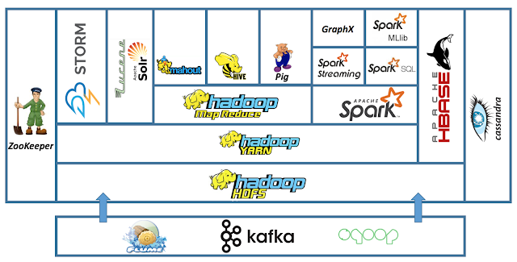

# Big Data Technologies Based on MapReduce and Hadoop

## Big Data & 5Vs (3Vs + 2Vs)

- 3Vs
  - **Volume**: 데이터의 크기
  - **Velocity**: 데이터의 생성/처리 속도
  - **Variety**: 데이터의 다양성 (Structured, Semi-structured, Unstructured)
- \+ 2Vs (2010~)
  - **Veracity**: 데이터의 진실성 (truthfulness), 정확성, 불확실성, Noise, 오류
  - **Value**: 데이터의 가치

## Database 작업의 두 종류

## Hadoop

> Hadoop : High-Availability Distributed Object-Oriented Platform

- 대용량 데이터를 분산 처리할 수 있는 자바 기반의 오픈 소스 프레임워크
- 시스템 비용이 적게 들고 여러 대의 서버에 데이터베이스를 분산해서 저장해두기 때문에 처리 속도가 빠르다는 장점이 있음

### Hadoop Ecosystem

### 주요 Component

- **HDFS**: Hadoop Distributed File System - 분산 데이터 저장
- **YARN**: Hadoop의 resource manager - 분산 클러스터 리소스 관리
- **MapReduce2**: breaking up the JobTracker into a few different services, it avoids many of the scaling issues faced by MRv1
- **Spark2**: RDD-based computing framework. (고속처리)
- Tez: A Framework for YARN-based, Data Processing Applications In Hadoop
- Hive: SQL-like interface to query
- HBase: NoSQL DB on top of Hadoop
- Pig: script language to run MapReduce jobs on Hadoop
- Oozie: **workflow** scheduler to manage Hadoop jobs
- Zookeeper: centralized operational services for a Hadoop cluster
- Storm: real-time stream analytic system
- Flume: collecting, aggregating, moving **unstructured data like log data** to Hadoop
- Kafka: **Stream data** processing platform. Distributed message broker
- Sqoop: RDBMS ↔ Hadoop. Import, Export **Strucured data**
- Solr: 검색 인덱싱
- Zeppelin: web-based notebook for interactive data analysis

---

# References

1. **Fundamentals of Database Systems 7th Edition** by Ramez Elmasri, Shamkant B. Navathe.
