# Inha 데이터베이스 설계 v2

## 1. 개요

- STEP 1 : [InhaDBv1](../InhaDBv1/) 확장
  - Inha 데이터베이스에 `Club`, `Employee` 테이블 추가
  - 추가된 테이블을 참고하여 기존 DB의 관계(Relation)를 재구성 수행
- STEP 2 : 확장한 InhaDBv2를 Express와 연동
  - `sql.js` 파일에서 `INSERT`문 실행
  - `INSERT`한 결과를 `sql.js` 파일에서 `SELECT`문으로 조회한 결과를 캡처

## 2. 상세 설계 내용

### STEP 1 : [InhaDBv1](../InhaDBv1/) 확장

기존의 Inha 데이터베이스에는 `Building`, `Room`, `Department`, `Class`, `Student` 테이블이 존재했다. 본 InhaDBv2 설계에서는 기존의 데이터베이스에 `Club` 테이블과 `Employee` 테이블을 추가하여 데이터베이스를 확장시켰다. 각각의 테이블 간의 참조관계를 아래와 같이 가정하고 정의하였다.

- `Department`와 `Employee`는 1:N의 식별 관계를 가진다.
  - 하나의 `Department`는 여러 `Employee`를 가진다.
  - 한 명의 `Employee`는 하나의 `Department`에만 속한다고 가정한다.
- `Club`과 `Room`는 1:1의 비식별 관계를 가진다.
  - 하나의 `Room`은 하나의 `Club`만이 사용한다고 가정한다.
  - 하나의 `Club`은 하나의 `Room`만이 배정된다고 가정한.
  - 어떤 `Club`은 배정받은 `Room`이 없을 수도 있다고 가정한다.

MySQL Workbench 상에서 그린 `InhaDB`의 Schema Diagram은 아래와 같다.<br>
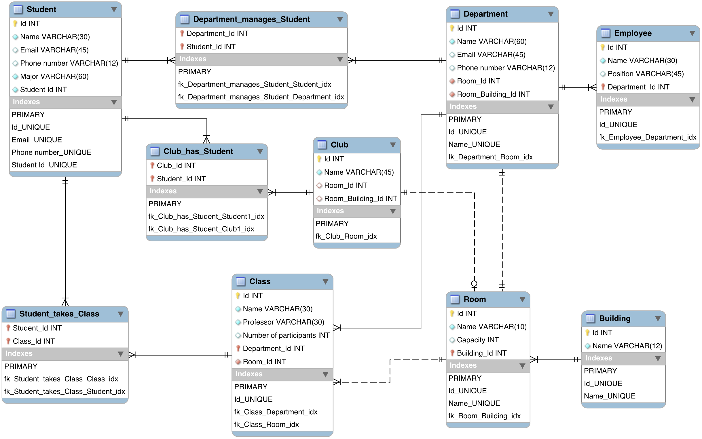

## 3. 실행 화면

### STEP 2 : 확장한 InhaDBv2를 Express와 연동

Express는 Node.js의 핵심 모듈인 http와 Connect 컴포넌트를 기반으로 한 빠르고 간편한 웹 프 레임워크이다.<br>
Node.js를 통해 다양한 자바스크립트 애플리케이션을 실행하며, 웹서버와 같이 확장성 있는 네트워크 프로그램을 제작하기 위해 만들어졌다.

```bash
$ npm init
$ npm install express mysql2 body-parser
$ npm install @babel/node @babel/core @babel/present-env
$ npm install nodemon
$ npm install dotenv
```

프로젝트 폴더 경로에서 `npm init` 명령을 실행하고, `npm install express mysql2 body-parser`, `npm install @babel/node @babel/core @babel/present-env`, `npm install nodemon` 명령어로 `express`, `mysql2`, `body-parser`, `babel`, `nodemon` 등의 모듈을 설치하였다.

`Babel` 모듈은 최신 JS 문법을 모든 브라우저에서 사용할 수 있는 형태로 변환할 수 있는 transcomplier이다.<br>
또한, `Nodemon` 모듈은 웹개발 편의성을 높이기 위한 스크립트 모니터링 유틸리티이며, 어떤 파일이라도 수정될 경우, 이를 반영하여 자동으로 서버를 재시작시켜준다.

#### `package.json` :

`package.json`은 프로젝트와 관련된 메타데이터를 기록하는 파일이며, 의존중인 패키지들의 버전을 기록 및 관리한다.

```json
{
  "name": "inhadb",
  "version": "1.0.0",
  "description": "Inha Database",
  "main": "index.js",
  "scripts": {
    "test": "echo \"Error: no test specified\" && exit 1",
    "start": "nodemon  --exec babel-node index.js"
  },
  "author": "Lee Dong-geon",
  "license": "ISC",
  "dependencies": {
    "@babel/core": "^7.19.3",
    "@babel/node": "^7.19.1",
    "@babel/preset-env": "^7.19.3",
    "body-parser": "^1.20.1",
    "dotenv": "^16.0.3",
    "express": "^4.18.1",
    "mysql2": "^2.3.3",
    "nodemon": "^2.0.20"
  }
}
```

생성된 `package.json` 파일의 `”scripts”` 부분에 위와 같이 `"start": "nodemon --exec babel-node index.js"` 구문을 추가해주었다.

<br>
다음으로 프로젝트 상위 폴더에 `babel.config.json`, `index.html`, `index.js`, `sql.js` 파일을 생성하고, 아래와 같이 코드를 작성하였다.

#### `babel.config.json`

```json
{
  "presets": ["@babel/preset-env"]
}
```

#### `index.html`

```html
<!DOCTYPE html>
<html lang="en">
  <head>
    <meta charset="UTF-8" />
    <meta name="viewport" content="width=device-width, initial-scale=1.0" />
    <title>Inha Database</title>
  </head>
  <body>
    <h1>Welcome to InhaDB!</h1>
    <ul>
      <li>Click <a href="/Insert/">Here</a> to Insert Values</li>
    </ul>
    <ul>
      <li>
        <a href="/Building/"><strong>Building</strong> Table</a>
      </li>
      <li>
        <a href="/Room/"><strong>Room</strong> Table</a>
      </li>
      <li>
        <a href="/Department/"><strong>Department</strong> Table</a>
      </li>
      <li>
        <a href="/Employee/"><strong>Employee</strong> Table</a>
      </li>
      <li>
        <a href="/Class/"><strong>Class</strong> Table</a>
      </li>
      <li>
        <a href="/Student/"><strong>Student</strong> Table</a>
      </li>
      <li>
        <a href="/Student_takes_Class/"
          ><strong>Student_takes_Class</strong> Table</a
        >
      </li>
      <li>
        <a href="/Department_manages_Student/"
          ><strong>Department_manages_Student</strong> Table</a
        >
      </li>
      <li>
        <a href="/Club/"><strong>Club</strong> Table</a>
      </li>
      <li>
        <a href="/Club_has_Student/"><strong>Club_has_Student</strong> Table</a>
      </li>
    </ul>
  </body>
</html>
```

`index.html`에는 `INSERT`를 실행할 수 있는 링크와 각 테이블의 값들을 `SELECT` 구문을 통해 확인할 수 있는 링크를 `<a>` 태그로 구성하였다.

#### `index.js`

```js
import express from "express";
import bodyParser from "body-parser";
import path from "path";
import sql from "./sql";

const PORT_NUMBER = 3000;
const app = express();

app.use(bodyParser.json());
app.use(bodyParser.urlencoded({ extended: true }));

app.get("/Insert/", async (req, res) => {
  const truncate_Tables = await sql.delTables();
  const insert_Values = await sql.setValues();
  res.send(`
    <h1>INSERT COMPLETED!<h1/>
    <h2>Click <a href="/">HERE</a> to go to main page!</h2>
    `);
});
app.get("/Building/", async (req, res) => {
  const building_table = await sql.getBuilding();
  res.json({ Building: building_table });
});

app.get("/Class/", async (req, res) => {
  const class_table = await sql.getClass();
  res.json({ Class: class_table });
});

app.get("/Club/", async (req, res) => {
  const club_table = await sql.getClub();
  res.json({ Club: club_table });
});

app.get("/Club_has_Student/", async (req, res) => {
  const club_has_student_table = await sql.getClubHasStudent();
  res.json({ Club_has_Student: club_has_student_table });
});

app.get("/Department/", async (req, res) => {
  const department_table = await sql.getDepartment();
  res.json({ Department: department_table });
});

app.get("/Department_manages_Student/", async (req, res) => {
  const department_manages_student_table =
    await sql.getDepartmentManagesStudent();
  res.json({ Department_manages_Student: department_manages_student_table });
});

app.get("/Employee/", async (req, res) => {
  const employee_table = await sql.getEmployee();
  res.json({ Employee: employee_table });
});

app.get("/Room/", async (req, res) => {
  const room_table = await sql.getRoom();
  res.json({ Room: room_table });
});

app.get("/Student/", async (req, res) => {
  const student_table = await sql.getStudent();
  res.json({ Student: student_table });
});

app.get("/Student_takes_Class/", async (req, res) => {
  const student_takes_class_table = await sql.getStudentTakesClass();
  res.json({ Student_takes_Class: student_takes_class_table });
});

app.get("/", (req, res) => {
  res.sendFile(path.join(__dirname + "/index.html"));
});

app.listen(PORT_NUMBER, () => {
  console.log(`Server is running on port ${PORT_NUMBER}.`);
});
```

`index.js`에서는 각 테이블의 값들을 `SELECT`로 조회할 수 있도록 테이블 별로 다른 Route를 구성하였다.
`/Insert/` Route에서는 `INSERT` 구문을 담은 `setValues` 함수를 호출한다. 호출 전에 중복 삽입을 방지하기 위해 테이블을 비워주는 `TRUNCATE` 구문을 담은 `delTables` 함수를 호출해주었다.

#### `sql.js`

```js
import mysql from "mysql2";

require("dotenv").config(); // 모듈 불러오기

const pool = mysql.createPool({
  host: "localhost",
  port: 3306,
  user: "root",
  password: process.env.MYSQL_PASSWORD,
  database: "InhaDB",
});

const promisePool = pool.promise();

const sql = {
  delTables: async () => {
    let results = await promisePool.query(`SET FOREIGN_KEY_CHECKS=0;`);
    results = await promisePool.query(`TRUNCATE Building;`);
    results = await promisePool.query(`TRUNCATE Room;`);
    results = await promisePool.query(`TRUNCATE Department;`);
    results = await promisePool.query(`TRUNCATE Employee;`);
    results = await promisePool.query(`TRUNCATE Class;`);
    results = await promisePool.query(`TRUNCATE Student;`);
    results = await promisePool.query(`TRUNCATE Student_takes_Class;`);
    results = await promisePool.query(`TRUNCATE Department_manages_Student;`);
    results = await promisePool.query(`TRUNCATE Club;`);
    results = await promisePool.query(`TRUNCATE Club_has_Student;`);
    results = await promisePool.query(`SET FOREIGN_KEY_CHECKS=1`);
    return results;
  },

  setValues: async () => {
    let results = await promisePool.query(`
        INSERT INTO Building 
        VALUES      (null, '2호관'),
                    (null, '5호관'),
                    (null, '9호관'),
                    (null, '본관'),
                    (null, '하이테크센터'),
                    (null, '학생회관');
        `);
    results = await promisePool.query(`
        INSERT INTO Room
        VALUES      (null, '2북-291', 10, 1),
                    (null, '5동-105B', 50, 2),
                    (null, '5북-211', 10, 2),
                    (null, '9-409', 10, 3),
                    (null, '하-230', 70, 5),
                    (null, '하-232', 80, 5),
                    (null, '하-416', 10, 5),
                    (null, '하-424', 50, 5),
                    (null, '하-801', 10, 5),
                    (null, '하-1234', 123, 5),
                    (null, '학생회관-123', 30, 6)
        `);
    results = await promisePool.query(`
        INSERT INTO Department
        VALUES      (null, '기계공학과', '220478@inha.ac.kr', '032-860-7300', 1, 1),
                    (null, '전자공학과', null, '032-860-7410', 9, 5),
                    (null, '정보통신공학과', '221103@inha.ac.kr', '032-860-7430', 7, 5),
                    (null, '수학과', null, '032-860-7620', 3, 2),
                    (null, '경제학과', null, '032-860-7770', 4, 3)
        `);
    results = await promisePool.query(`
        INSERT INTO Employee
        VALUES      (null, '박기계', '팀원', 1),
                    (null, '전전자', '교수', 2),
                    (null, '정정통', '조교수', 3),
                    (null, '김수학', '팀원', 4),
                    (null, '이경제', '팀원', 5)
        `);
    results = await promisePool.query(`
        INSERT INTO Class
        VALUES(null, '공업수학 2', '최경표', 46, 2, 2),
            (null, '오퍼레이팅시스템', '김기창', 50, 3, 8),
            (null, '신호및시스템', '김춘우', 51, 3, 8),
            (null, '컴퓨터네트워크', '유상조', 65, 3, 8),
            (null, '데이터베이스설계', '최원익', 76, 3, 8)
        `);
    results = await promisePool.query(`
        INSERT INTO Student
        VALUES(null, '이동건', 'time@inha.edu', '01000000000', '정보통신공학과', '12181879'),
            (null, '공신오', 'eng-sig-op@inha.edu', '01011111111', '정보통신공학과', '12201111'),
            (null, '오컴데', 'op-com-da@inha.edu', '01022222222', '수학과', '12192222'),
            (null, '공신컴', 'eng-sig-com@inha.edu', '01033333333', '정보통신공학과', '12213333'),
            (null, '신컴데', 'sig-com-da@inha.edu', '01044444444', '전자공학과', '12194444')
        `);
    results = await promisePool.query(`
        INSERT INTO Student_takes_Class
        VALUES(1, 1), (1, 2), (1, 3), (1, 4), (1, 5),
            (2, 1), (2, 2), (2, 3),
            (3, 2), (3, 4), (3, 5),
            (4, 1), (4, 3), (4, 4),
            (5, 3), (5, 4), (5, 5)
        `);
    results = await promisePool.query(`
        INSERT INTO Department_manages_Student
        VALUES(2, 3),
            (3, 1), (3, 2), (3, 3), (3, 4), (3, 5),
            (4, 3)
        `);
    results = await promisePool.query(`
        INSERT INTO Club
        VALUES(null, '축구 동아리', null, null),
            (null, '농구 동아리', null, null),
            (null, '야구 동아리', null, null),
            (null, '코딩 동아리', 10, 5),
            (null, '주식 동아리', 11, 6)
        `);
    results = await promisePool.query(`
        INSERT INTO Club_has_Student
        VALUES(1, 2), (1, 4),
            (2, 2), (2, 4),
            (3, 2), (3, 4),
            (4, 1), (4, 2), (4, 4),
            (5, 3)
        `);
    return results;
  },

  getBuilding: async () => {
    const results = await promisePool.query(`
        SELECT * FROM Building;
        `);
    return results;
  },
  getClass: async () => {
    const results = await promisePool.query(`
        SELECT * FROM Class;
        `);
    return results;
  },
  getClub: async () => {
    const results = await promisePool.query(`
        SELECT * FROM Club;
        `);
    return results;
  },
  getClubHasStudent: async () => {
    const results = await promisePool.query(`
        SELECT * FROM Club_has_Student;
        `);
    return results;
  },
  getDepartment: async () => {
    const results = await promisePool.query(`
        SELECT * FROM Department;
        `);
    return results;
  },
  getDepartmentManagesStudent: async () => {
    const results = await promisePool.query(`
        SELECT * FROM Department_manages_Student;
        `);
    return results;
  },
  getEmployee: async () => {
    const results = await promisePool.query(`
        SELECT * FROM Employee;
        `);
    return results;
  },
  getRoom: async () => {
    const results = await promisePool.query(`
        SELECT * FROM Room;
        `);
    return results;
  },
  getStudent: async () => {
    const results = await promisePool.query(`
        SELECT * FROM Student;
        `);
    return results;
  },
  getStudentTakesClass: async () => {
    const results = await promisePool.query(`
        SELECT * FROM Student_takes_Class;
        `);
    return results;
  },
};

export default sql;
```

`sql.js`에는 `index.js`에서 사용된 다양한 함수들을 정의하였다. 특히, `setValues` 함수에는 설계한 테이블들의 관계를 확인하기 위한 `INSERT` 구문을 담았다. 이 때, 참조 무결성 제약조건(Referential integrity constraint)을 고려하여 `INSERT` 구문의 실행 순서를 결정하였다.

<br>
파일들을 구성한 후, `npm run start` 명령어를 통해 localhost의 3000번 포트에 서버를 구동시켰다.

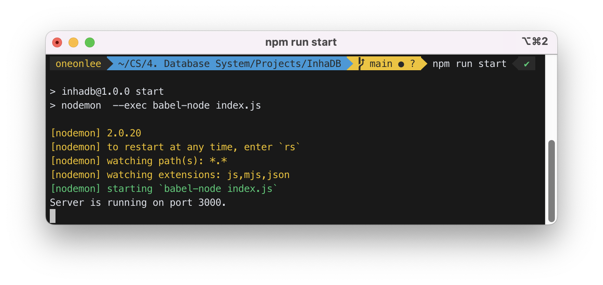

Main 페이지는 아래와 같다.<br>
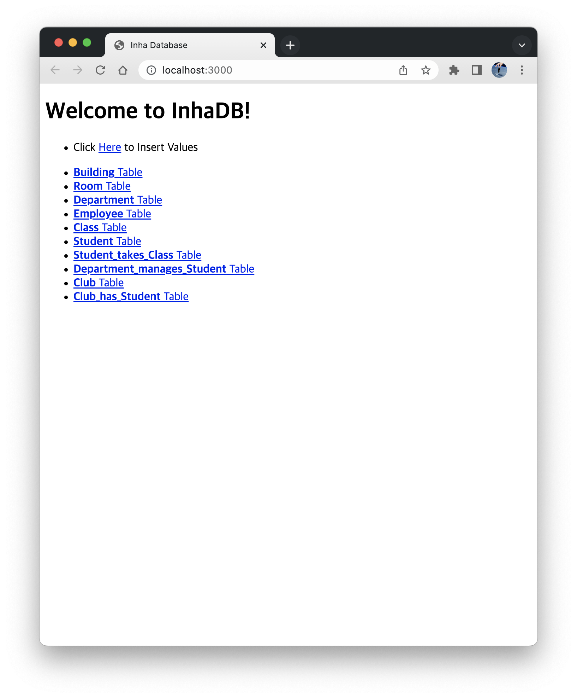

먼저, `localhost:3000/Insert/`로 이동하여 SQL의 `INSERT` 구문을 실행하는 `setValues`를 호출하였다.<br>


`Building`, `Room`, `Department`, `Employee`, `Class`, `Student`, `Student_takes_Class`, `Department_manages_Student`, `Club`, `Club_has_Student` 테이블을 순서대로 조회하면 아래와 같다.<br>
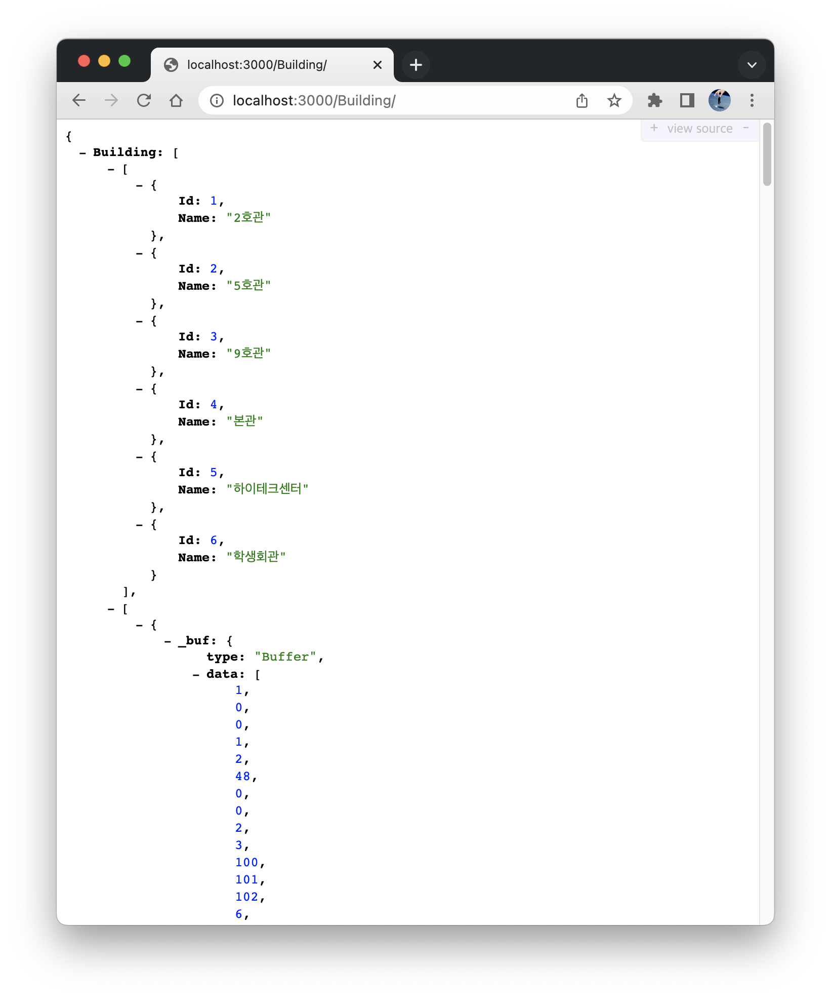<br>
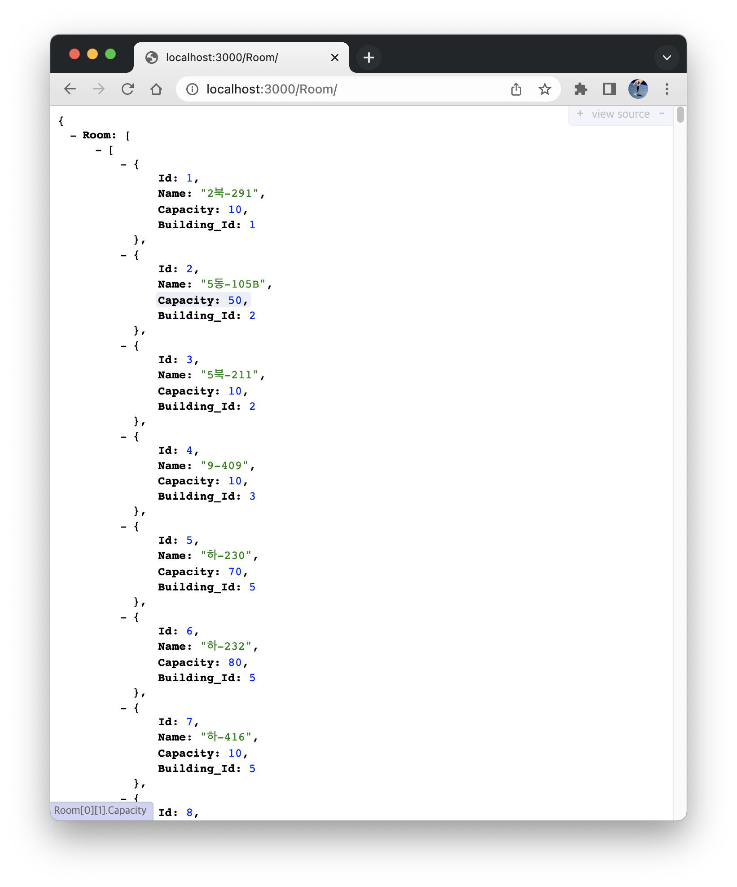<br>
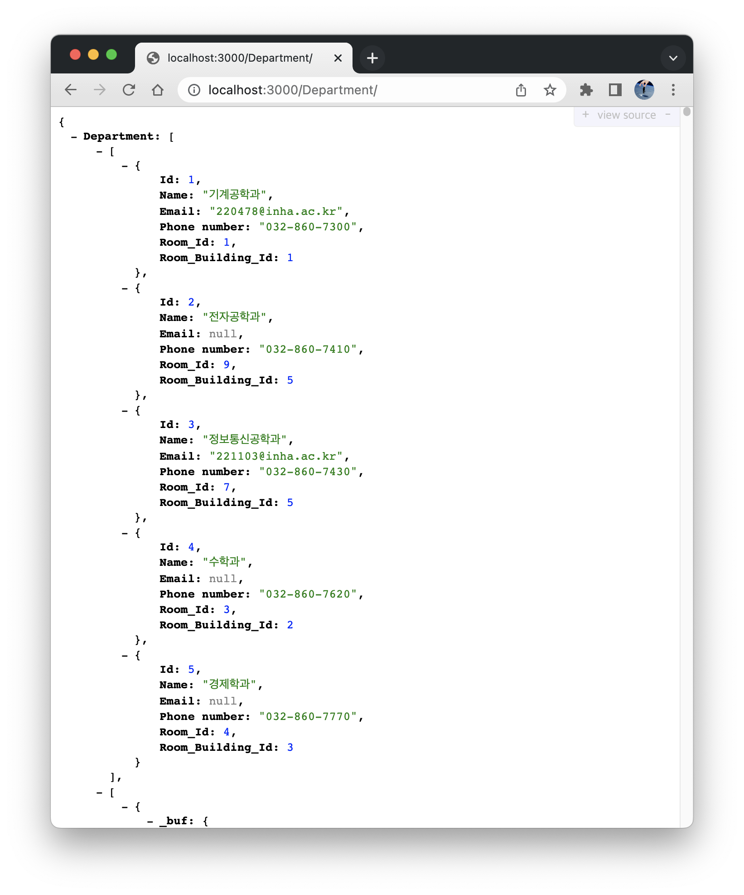<br>
<br>
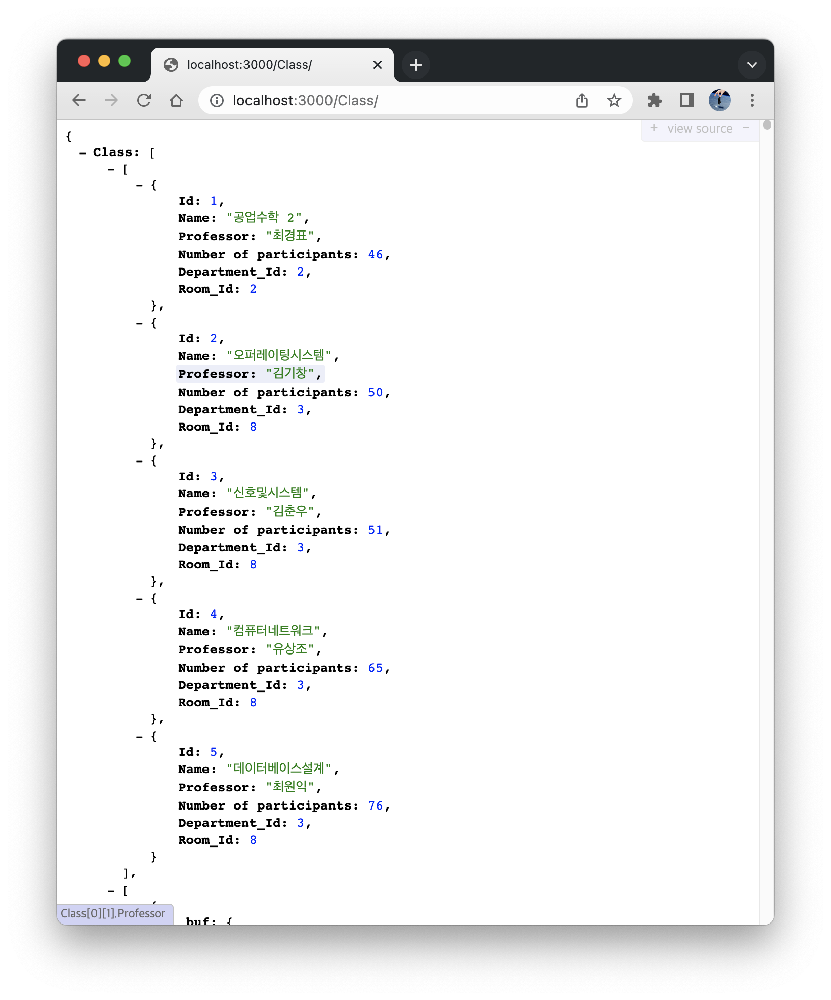<br>
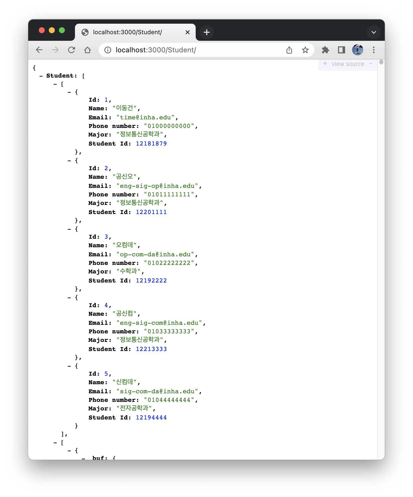<br>
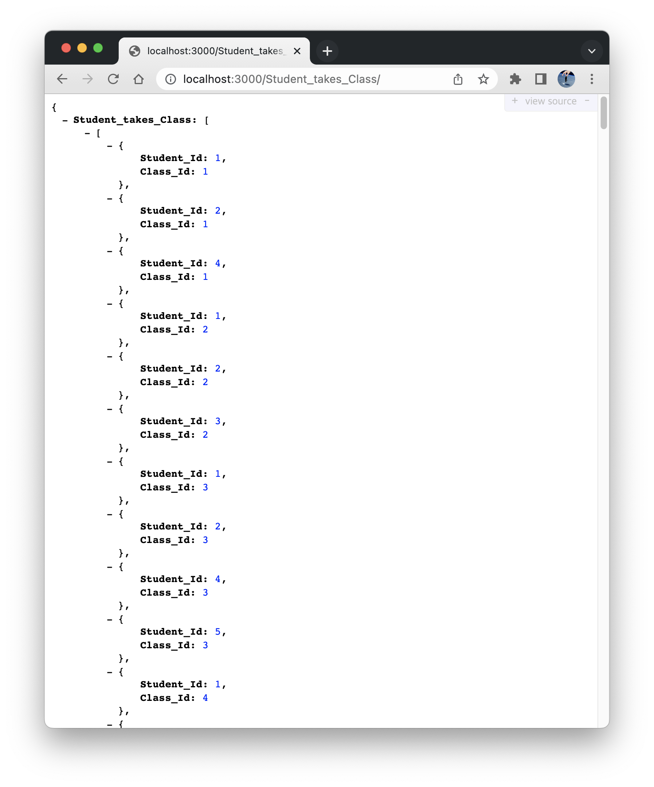<br>
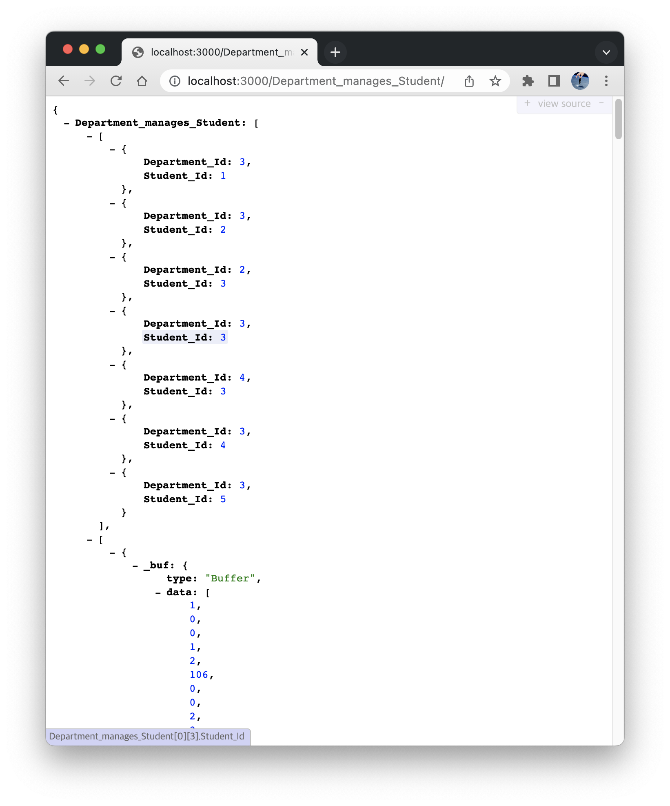<br>
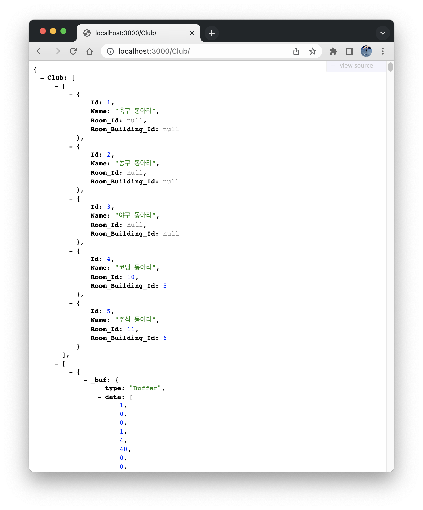<br>
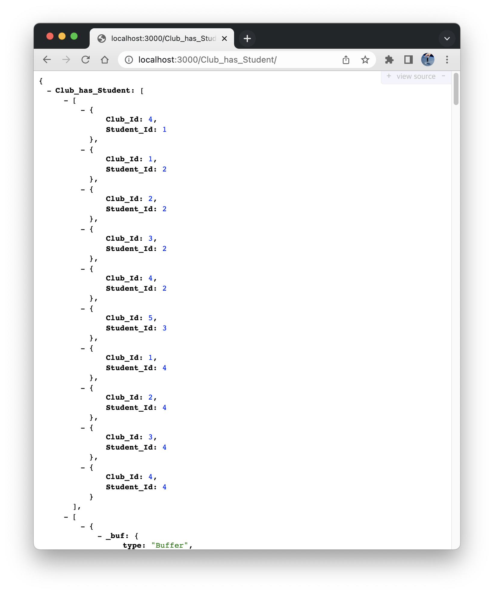

## 4. 결론

본 설계에서는 `Building`, `Room`, `Department`, `Class`, `Student` 테이블을 가지고 있는 기존의 `InhaDB` 데이터베이스에 `Club`, `Employee` 테이블을 확장하여 설계하였다. 주어진 조건 이외에도 각각의 테이블 간의 관계에 맞도록 참조관계를 추가하여 정의하였다.

STEP 2에서는 설계한 `InhaDB`를 Express와 연동시키고 localhost의 3000번 포트에 서버를 구동시켰다. 그리고 각 테이블에서의 `INSERT`와 `SELECT` 구문의 실행을 웹페이지에서 확인하였다. `INSERT` 시에는 참조 무결성 제약조건(Referential integrity constraint)을 고려하여 `INSERT` 구문의 실행 순서를 결정하였다. 각 테이블의 값들을 확인할 수 있는 페이지로 접속한 결과를 확인해보면, 각 테이블 간의 관계가 결함없이 이루어진 것을 확인할 수 있으며, `INSERT` 했던 값들 역시, 테이블의 각 Field Type에 맞게 삽입된 것을 확인할 수 있었다.
