# Inha 데이터베이스 설계 v4

Web 상 login 기능 구현

## 1. 개요

- STEP 1 : Inha DB에 로그인 기능 구현 적용
  - 학생의 학번 및 비밀번호로 로그인 하는 기능 구현할 것
    - 학생은 학생 정보를 조회할 수 있는 페이지로 이동
- STEP 2 : Class 테이블에 데이터 삽입하여 delete 결과 확인
  - 학생으로 로그인 한 경우에만 수강하는 수업(class)을 수강취소(삭제) 할 수 있도록 구현

## 2. 상세 설계 내용

### STEP 1 : 기존의 [InhaDBv2](../InhaDBv2/)를 확장하여 Web에서 로그인 기능 구현

기존의 InhaDB의 Schema Diagram은 아래와 같다. 

웹 상에서 로그인 기능과 MySQL의 InhaDB의 Select, Delete 명령어를 사용하기 위해 다음과 같이 라우터를 구상하였다.

- `localhost:3000/`
  - `/` : 로그인 페이지
  - `/select` : Student 테이블에서 로그인한 계정의 기본 정보 표시
  - `/delete` : Student_takes_Class 테이블에서 로그인한 계정의 수강 과목 삭제 기능

프로젝트 폴더에서 아래 사진과 같이 폴더 및 파일들을 생성하여 전체적인 프로젝트 구조를 구성하였다. 
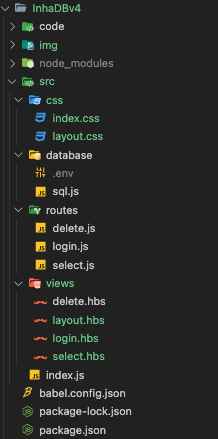

`src/index.js` 파일에서는 서버 실행 코드를 작성하고, 구상한 라우터를 바탕으로 필요한 라우터를 선언하였다. 
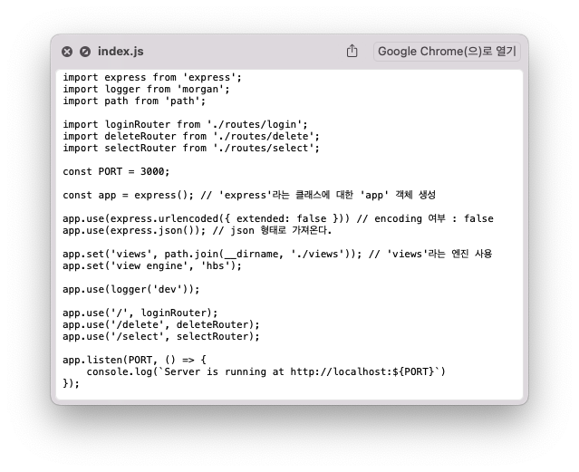

`src/database/sql.js` 파일에서는 Select, Delete를 수행하기 위한 쿼리를 작성하였다. `localhost:3000/select`에서 Student 테이블의 튜플 중 로그인한 계정의 기본 정보를 Select하기 위해 `setStudents`를 사용하였다. 마찬가지로 `localhost:3000/delete`에서 로그인한 계정의 수강 과목 정보를 Select하기 위해 `setStudent_takes_Class`를 사용하였다.

`setStudents`와 `setStudent_takes_Class`의 쿼리문 `sql`을 보면 로그인한 계정의 정보만을 나타내기 위해 `loginId` 변수가 사용된 것을 확인할 수 있다. 이 `loginId` 변수는 로그인 페이지에서 입력한 아이디의 정보로 `src/routes/login.js`에서 받아온 것이다.

`src/database/sql.js`가 `src/routes/login.js`로부터 `loginId` 변수를 `import { loginInfo } from "../routes/login.js";` 코드와 `const loginId = await loginInfo.id();`를 통해 받아올 수 있다. `src/routes/login.js`가 `src/database/sql.js`로 `loginId` 변수를 보내는 방법은 후술할 것이다.

`src/database/sql.js`의 전체 코드는 아래와 같다.

`src/database/sql.js` : 
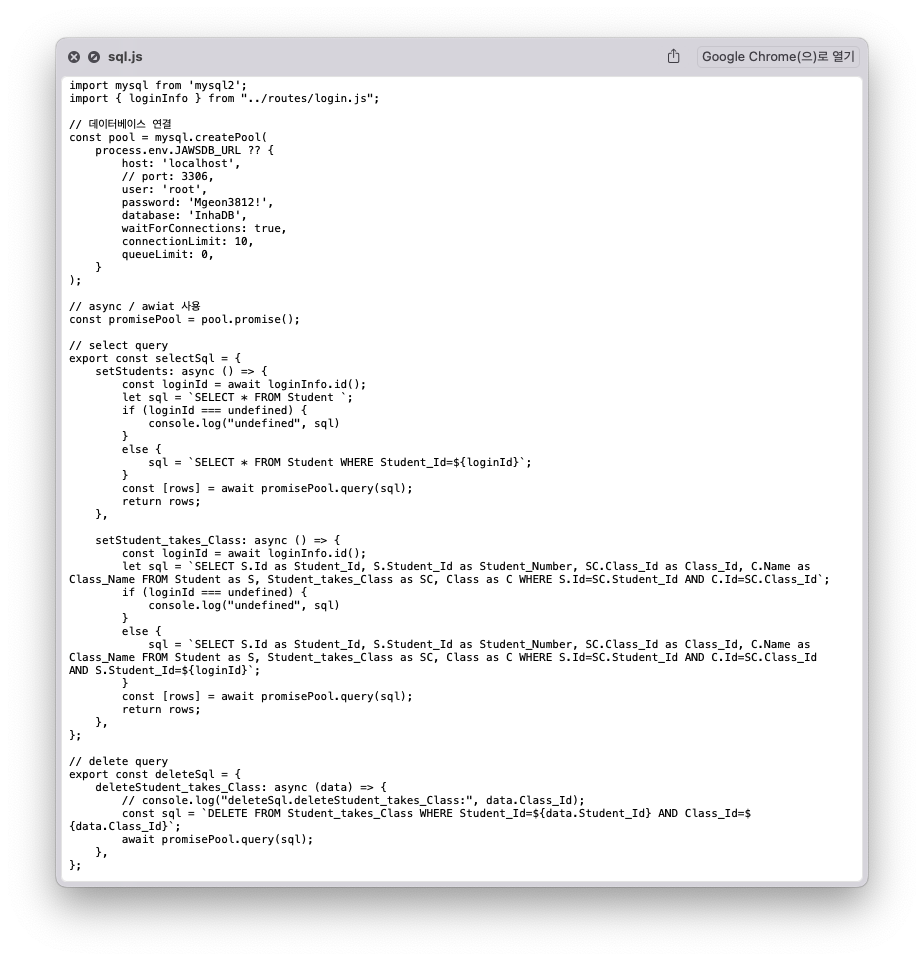

서버 및 웹 페이지를 구현하기 위해, `src/routes` 폴더 내에 `login.js`, `select.js`, `delete.js` 파일을 구성하였다.

`src/routes/login.js` 파일은 홈 화면 역할을 하는 로그인 기능을 구현한 파일로, `src/views/login.hbs` 파일과 연동함으로서 로그인 폼을 구현하였다. 학생의 학번 및 비밀번호로 로그인 하도록 하였는데, 이때의 비밀번호는 학생의 Phone_number라고 가정하였다. `src/routes/login.js`와 `src/views/login.hbs` 코드는 아래와 같다.

`src/routes/login.js` :  
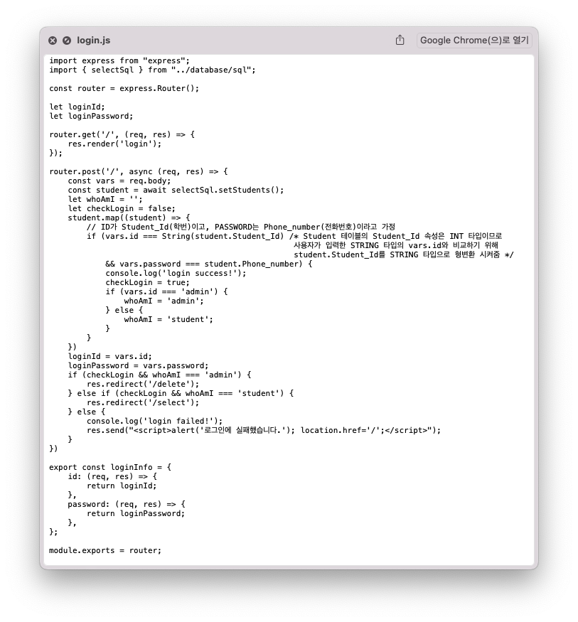

`src/views/login.hbs` :  
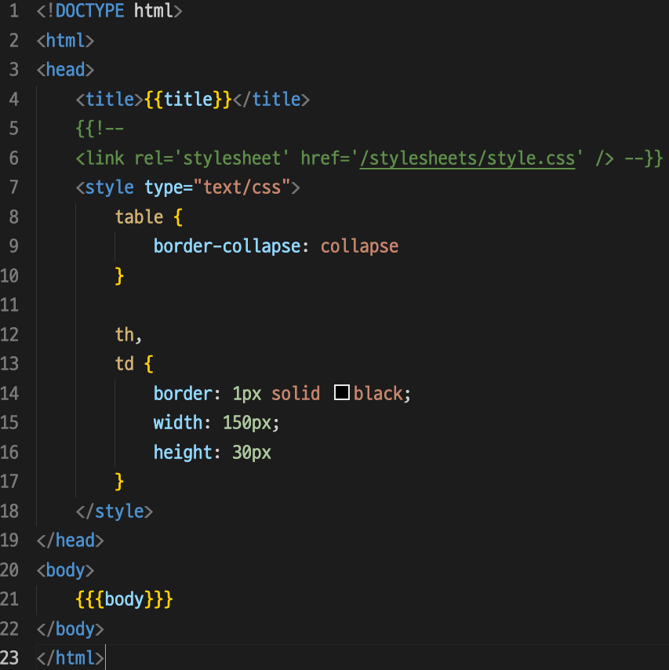

`src/routes/select.js` 파일은 조회 역할을 하는 Select 기능을 구현한 파일로, `src/database/sql.js`의 `setStudents`를 통해 Student 테이블에서 로그인한 계정의 기본 정보 표시한다. 또한, `src/views/select.hbs` 파일과 연동시켜 테이블에 데이터 값을 나타내었다. `src/routes/select.js`와 `src/views/select.hbs` 코드는 아래와 같다.

`src/routes/select.js` :  
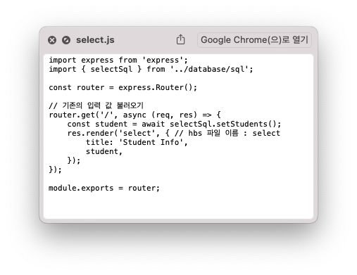

`src/views/select.hbs` :  
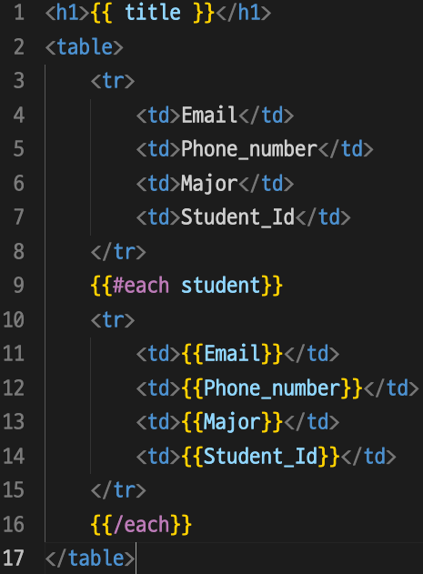

`src/routes/delete.js` 파일은 Student_takes_Class 테이블에서 로그인한 계정의 수강 과목 삭제 기능을 구현한 파일로, `src/views/delete.hbs` 파일과 연동시켜 웹 상에서 데이터 삭제가 가능하도록 구현하였다. `src/routes/delete.js`와 `src/views/delete.hbs` 코드는 아래와 같다.

`src/routes/delete.js` :  
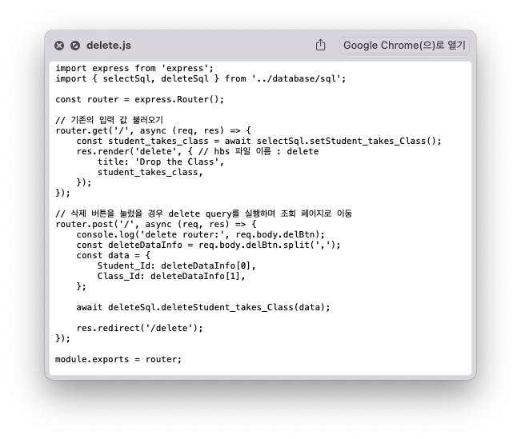

`src/views/delete.hbs` :  
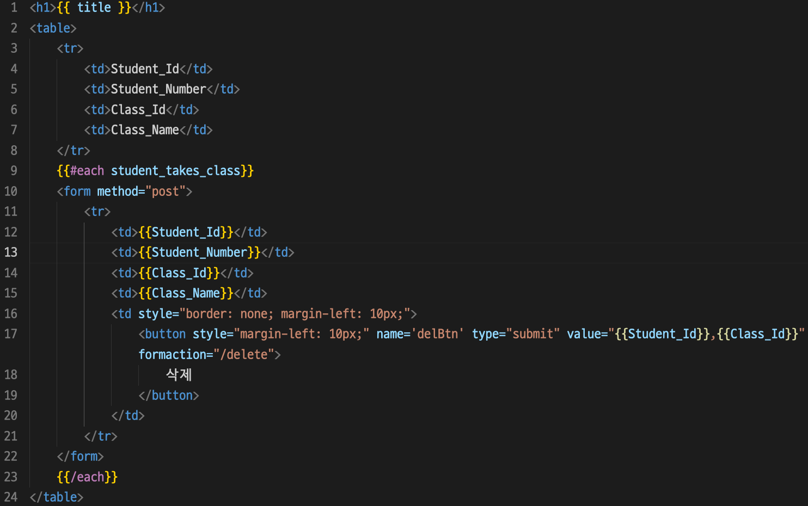 

삭제 버튼을 누른 후 실행되는 `src/database/sql.js`의 `deleteSql` 속 쿼리문 `sql`이 실행될 때, Student_takes_Class의 속성값인 Student_Id와 Class_Id 데이터가 필요하다.

따라서 `src/views/delete.hbs`에서 삭제 버튼을 구성할 때, `<button>` 태그의 `value` 속성값으로 `"{{Student_Id}},{{Class_Id}}"`을 전달하였다.
이 값의 자료형은 STRING이므로 `src/routes/delete.js`에서 `const deleteDataInfo = req.body.delBtn.split(',');` 코드로 문자열 속 Student_Id 값과 Class_Id 값을 분리하여 배열로 만들어주었다.

## 3. 실행 화면

### STEP 1 - 학생의 학번 및 비밀번호로 로그인 하는 기능 구현

앞서 설명하였듯이, `src/routes/login.js`에 학생의 학번 및 비밀번호로 로그인 하도록 기능을 구현하였는데, 이때의 비밀번호는 학생의 Phone_number라고 가정하였다.

먼저, `localhost:3000/`으로 접속하였을 때, 화면은 아래와 같다. 
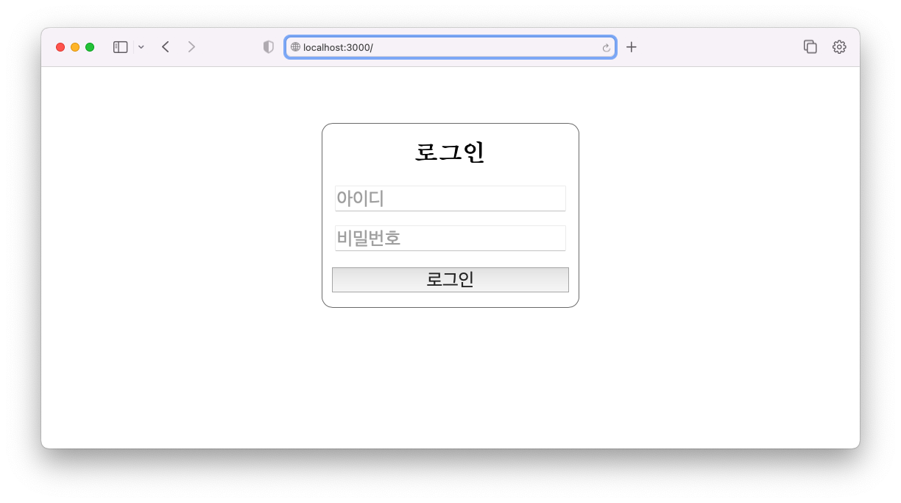

아이디와 비밀번호로 각각 '12181879'와 '01000000000'을 입력하였다. 
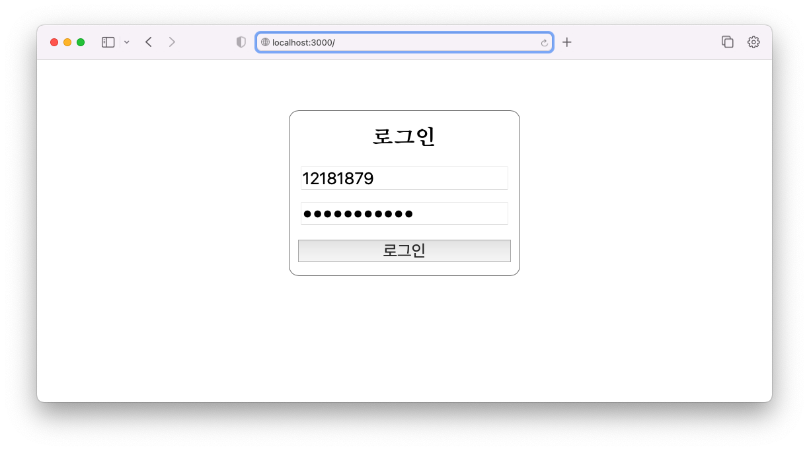

학생으로 로그인하면, 학생 정보를 조회할 수 있는 페이지인 `localhost:3000/select`로 자동 이동하게 된다. 
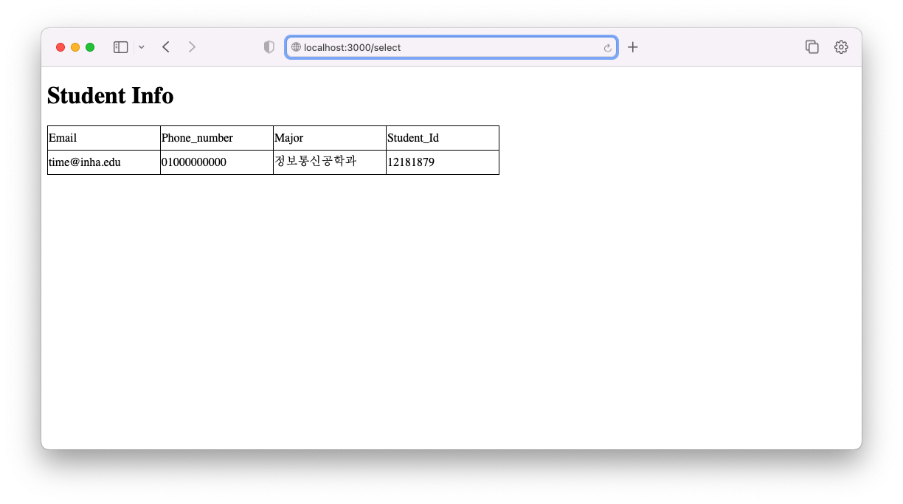

### STEP 2 - 학생으로 로그인 한 경우에만 수강하는 수업(class)을 수강취소(삭제) 할 수 있도록 구현

로그인한 계정의 수강 정보를 확인할 수 있고, 수강취소(삭제)가 가능한 `localhost:3000/delete` 페이지로 이동하였다. 
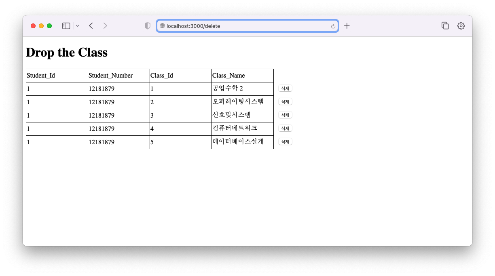

Class_Id가 5인 '데이터베이스설계' 과목을 수강 삭제한 이후의 결과는 아래와 같다. 

## 4. 결론

본 설계에서는 기존의 설계한 InhaDB의 데이터를 JavaScript 기반 Express 프레임워크를 사용하여 웹에 나타내었다. 이 웹에는 로그인 기능과 Select 및 Delete 기능이 포함되었다. 기능 별로 라우터를 구분하여 구성하였으며, routes 폴더 내부의 `.js` 파일과 `.hbs` 파일을 연동시켜, 웹 페이지에 기능을 구현하였다.

학생이 웹에 로그인을 하면, 그 학생의 정보를 조회할 수 있는 페이지로 자동 이동되도록 구현하였는데, 이 때 나타나는 정보는 `SELECT * FROM Student WHERE Student_Id=${loginId}` 쿼리로 표시하였다. (`loginId`는 로그인 한 학생의 Id, 즉 학번이다.)

delete 기능이 구현된 페이지로 이동하면, Student 테이블과 Class 테이블의 관계를 나타낸 Student_takes_Class 테이블을 기반으로 로그인한 학생이 수강중인 수업을 나타내었다. 이 때는 `SELECT S.Id as Student_Id, S.Student_Id as Student_Number, SC.Class_Id as Class_Id, C.Name as Class_Name FROM Student as S, Student_takes_Class as SC, Class as C WHERE S.Id=SC.Student_Id AND C.Id=SC.Class_Id AND S.Student_Id=${loginId}`의 쿼리문으로 3개의 테이블을 조인하여 가독성있게 나타내었다.

delete 페이지에서 삭제버튼을 클릭하면 Student_takes_Class의 튜플 중 삭제하고자 하는 Student_Id 값과 Class_Id 값을 `DELETE FROM Student_takes_Class WHERE Student_Id=${data.Student_Id} AND Class_Id=${data.Class_Id}` 쿼리에 전달하여, Student_takes_Class 테이블의 그 튜플을 삭제함으로써 수강 취소 기능을 구현하였다.
