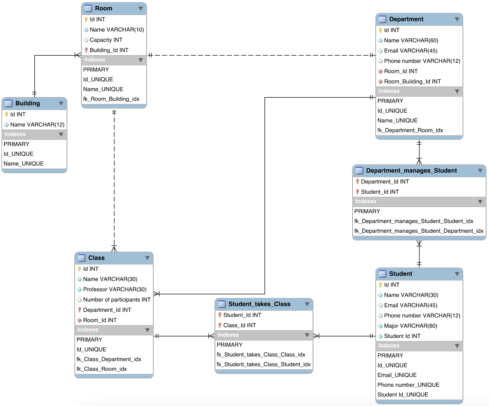
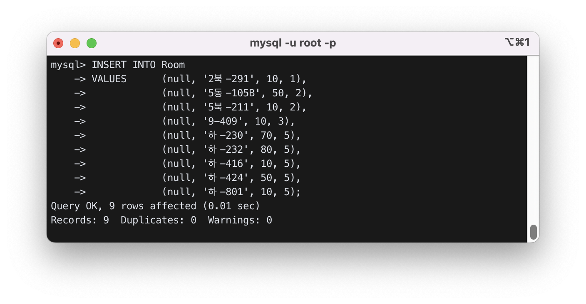
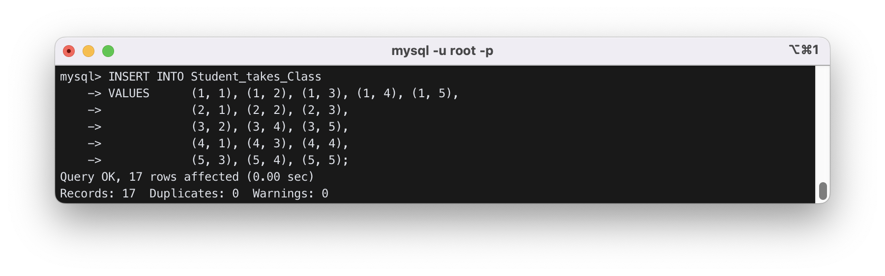
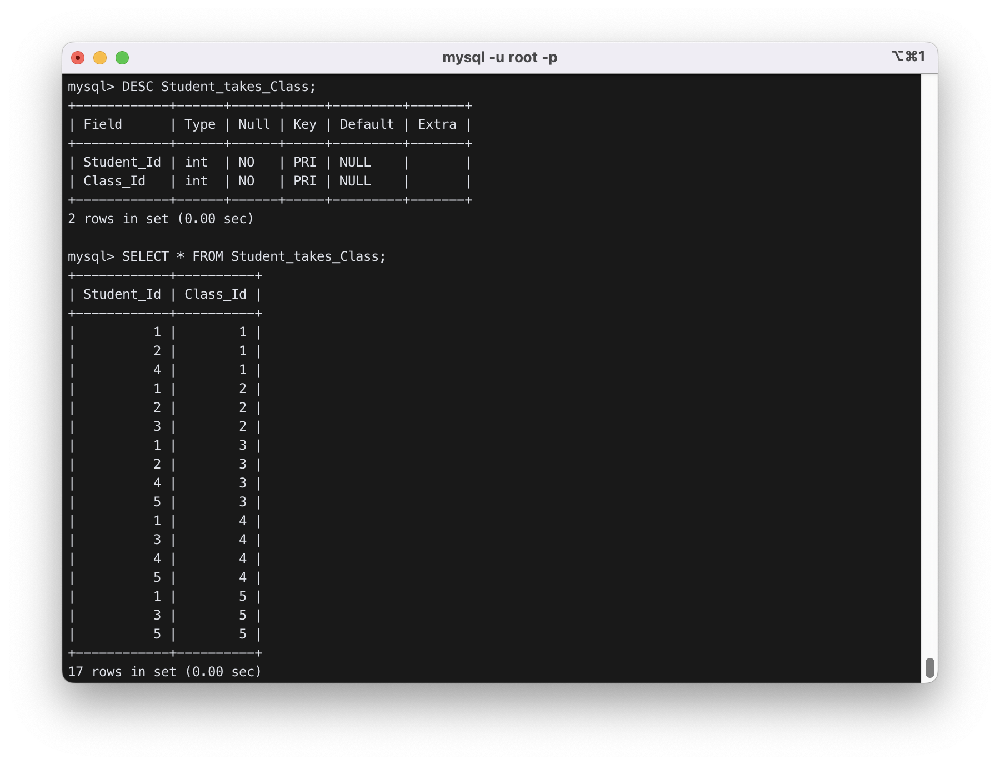

# Inha 데이터베이스 설계

## 1. 개요

- STEP 1 : 아래의 요구사항을 만족하는 Inha 데이터베이스를 만들 것.
  - Inha 데이터베이스에는 `Building`, `Room`, `Department`, `Class`, `Student` 테이블이 존재
- STEP 2 : Inha 데이터베이스를 workbench 상에서 그리고 화면 캡처할 것.
- STEP 3 : Inha 데이터베이스의 각 테이블에 5개 이상의 값을 insert 할 것.
- STEP 4: 각 테이블의 설명(`desc` 명령어) 및 조회(`select`) 결과를 캡처할 것

## 2. 상세 설계 내용

### STEP 1

 
**그림 1 MySQL Workbench 프로그램 실행 화면**

MySQL Workbench 프로그램을 실행시켜 `InhaDB` 데이터베이스 모델을 생성하였다.

주어진 조건대로 Inha 데이터베이스에는 `Building`, `Room`, `Department`, `Class`, `Student` 테이블이 존재한다. 본 설계에서는 테이블의 참조관계를 아래와 같이 가정하고 정의하였다.

- `Building`과 `Room`은 1:N의 식별 관계를 가진다.
  - `Building`은 여러 `Room`을 가질 수 있고, `Room`은 하나의 `Building`에 속하기 때문이다.
  - `Room`은 `Building`이 있어야 존재할 수 있다.
- `Room`과 `Department`는 1:1의 비식별 관계를 가진다.
  - 모든 부서는 하나의 방에만 존재하고, 하나의 방에는 하나의 부서만이 있다고 가정한다.
- `Room`과 `Class`는 1:N의 비식별 관계를 가진다.
  - 하나의 강의실에서 여러 수업이 열릴 수 있기 때문에 하나의 `Room`은 여러 `Class`를 가질 수 있다.
  - 또한, 모든 수업은 하나의 강의실만을 사용한다고 가정하면, 하나의 `Class`는 하나의 `Room` 만을 가진다.
- `Department`와 `Class`는 1:N의 비식별 관계를 가진다.
  - 하나의 부서는 여러 수업을 개설할 수 있으므로, 하나의 `Department`는 여러 `Class`를 가질 수 있다.
  - 또한, 모든 수업은 하나의 부서로부터 개설된다고 가정하면, 하나의 `Class`는 하나의 `Department`에 속한다.
- `Department`와 `Student`는 M:N의 식별 관계를 가진다.
  - 하나의 부서는 여러 학생을 관리하고, 한 명의 학생이 여러 전공 (e.g., 복수전공, 부전공 등)을 가질 수 있으므로, 여러 부서로부터 관리를 받을 수 있기 때문이다.
  - M:N 관계를 실제로 구현하기 위해, 두 테이블의 PK를 FK로 참조하고 있는 연결테이블인 ` Department_manages_Student`를 사용하였다.
- `Student`와 `Class`는 M:N의 식별 관계를 가진다.
  - 한 명의 학생이 여러 수업을 수강할 수 있고, 한 수업은 여러 학생을 수용하기 때문이다.
  - M:N 관계를 실제로 구현하기 위해, 두 테이블의 PK를 FK로 참조하고 있는 연결테이블인 `Student_takes_Class`를 사용하였다.

### STEP 2

 
**그림 2 MySQL Workbench 상에서 그린 `InhaDB`의 Schema Diagram**

MySQL Workbench 프로그램 상에서, [STEP 1](#step-1)에서 정의한 관계대로 테이블을 만들었다. 이후, 상단 메뉴 중 “Database” 메뉴의 “Forward Engineer”를 클릭하여 “Forward Engineer to Database” 기능을 실행하였고, Schema Diagram을 `InhaDB`에 반영하였다.

## 3. 실행 화면

### STEP 3

우선, 터미널에 `mysql -u root -p` 명령어를 입력하고, 비밀번호 입력 후 MySQL에 접속하였다. 아래 **그림 3**처럼 `use InhaDB` 명령어로 `InhaDB` 데이터베이스를 적용하였다. 그 후, `show tables;` 명령어로 MySQL Workbench 프로그램 상에서 만든 테이블이 정상적으로 생성된 것을 확인하였다.

 
**그림 3** `mysql` 접속 후, `InhaDB`의 테이블을 확인하는 화면

먼저 아래 **그림 4**와 같이 `INSERT`문으로 `Building` 테이블에 5개의 값들을 insert 하였다.

 
**그림 4 `Building` 테이블에 값들을 `INSERT` 하는 화면**

`Room` 테이블에는 아래 그림 5처럼 `INSERT`문으로 9개의 값들을 insert 하였다.

 
**그림 5 `Room` 테이블에 값들을 `INSERT` 하는 화면**

다음으로, 아래 그림 6, 그림 7, 그림 8과 같이 `INSERT`문으로 `Department` 테이블, `Class` 테이블, `Student` 테이블에 각각 5개의 값들을 insert 하였다.

 
**그림 6 `Department` 테이블에 값들을 `INSERT` 하는 화면**

 
**그림 7 `Class` 테이블에 값들을 `INSERT` 하는 화면**

 
**그림 8 `Student` 테이블에 값들을 `INSERT` 하는 화면**

다음으로는 `Student`와 `Class` 테이블의 M:N 관계를 설명하는 `Student_takes_Class` 테이블에 값들을 insert 하였다. **그림 9**에서 확인할 수 있듯이, 17개의 값들을 insert 하였다.

 
**그림 9 `Student_takes_Class` 테이블에 값들을 `INSERT` 하는 화면**

이전과 마찬가지로, `Department`와 `Student` 테이블의 M:N 관계를 실제로 구현하기 위해, 두 테이블의 PK (Primary Key, 기본키)를 FK (Foreign Key, 외래키)로 참조하고 있는 연결테이블인 `Department_manages_Student` 테이블에 값들을 insert 하였다. 학생들은 복수전공, 부전공 등의 이유로 여러 전공에 속할 수 있고, 부서들을 본전공 뿐만 아니라 복수전공, 부전공 등의 학생들까지 관리한다고 가정한다. **그림 10**에서 확인할 수 있듯이, 7개의 값들을 insert 하였다.

 
**그림 10 `Department_manages_Student` 테이블에 값들을 `INSERT` 하는 화면**

### STEP 4

#### `Building` 테이블

 
**그림 11 `Building` 테이블의 설명 및 조회 결과**

#### `Room` 테이블

 
**그림 12 `Room` 테이블의 설명 및 조회 결과**

#### `Department` 테이블

 
**그림 13 `Department` 테이블의 설명 및 조회 결과**

#### `Class` 테이블

![]Class(img/.png) 
**그림 14 `Class` 테이블의 설명 및 조회 결과**

#### `Student` 테이블

 
**그림 15 `Student` 테이블의 설명 및 조회 결과**

#### `Student_takes_Class` 테이블

 
**그림 16 `Student_takes_Class ` 테이블의 설명 및 조회 결과**

#### `Department_manages_Student` 테이블

 
**그림 17 `Department_manages_Student` 테이블의 설명 및 조회 결과**

4. 결론
   본 설계에서는 `Building`, `Room`, `Department`, `Class`, `Student` 테이블을 가지고 있는 `InhaDB` 데이터베이스를 설계하였다. [STEP 1](#step-1)에서 주어진 조건 이외에도 각각의 테이블 간의 관계에 맞도록 참조관계를 추가하여 정의하였다.

[STEP 2](#step-2)에서는 개념적 설계 이외에도 MySQL Workbench 프로그램을 통해 직접 Schema Diagram으로 나타내보고, “Forward Engineer to Database” 기능을 통해 설계한 Schema Diagram을 `InhaDB`에 반영하였다.

[STEP 3](#step-3)에서는 반영한 `InhaDB`의 작동을 하기 위해, 각 테이블에 5개 이상의 임의의 값들을 `INSERT` 구문을 통해 insert 하였다. 이 때, 참조 무결성 제약조건(Referential integrity constraint)을 고려하여 `INSERT` 구문의 실행 순서를 결정하였다.

그리고, 테이블의 설명(describe)를 뜻하는 `DESC` 명령어와 조회를 의미하는 `SELECT 명령어로 `각 테이블의 설명 및 조회 결과를 확인하였다. **그림 11**부터 **그림 17**까지의 결과를 확인해보면, 각 테이블 간의 관계가 결함없이 이루어진 것을 확인할 수 있으며, `INSERT` 했던 값들 역시, 테이블의 각 Field Type에 맞게 삽입된 것을 확인할 수 있다.
