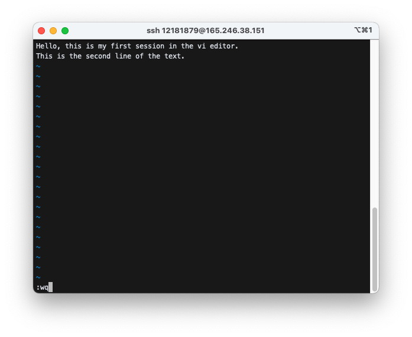
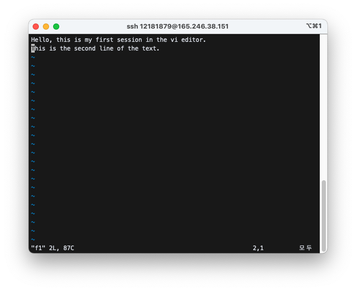
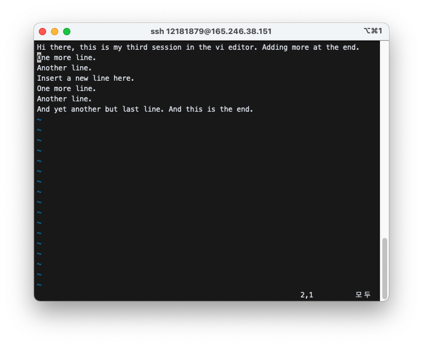

# Using `vi`

### 1) Make a file with `vi`.

`vi f1`


(when you open a file with `vi`, sometimes you see Open, Edit, ... etc. at the bottom of the screen, in that case just type "e" in order to start editing)

### 2) Start insertion with `i` key and type following.

> Hello, this is my first session in the vi editor.

> This is the second line of text.


### 3) Return to command mode with `esc` key which is located at the top left position of your keyboard. Save and exit with `:wq`

`esc`
`:wq`



### 4) Reopen the file

`vi f1`



### 5) Use `j`, `k`, `h`, `l` to move the cursor around. Move the cursor to the word “first”. Use `x` key to delete the word “first”. The result should be as follows.

> Hello, this is my session in the vi editor.

> This is the second line of text.


### 6) Insert “third” as follows.


### 7) Add a new line as follows. Use `o` key.

> Hello, this is my third session in the vi editor.

> Insert a new line here.

> This is the second line of text.


### 8) Change the beginning as follows. Use `x` and `i` key.

> Hi there, this is my third session in the vi editor.

> Insert a new line here.

> This is the second line of text.


### 9) Add more at the end. Use `a` key.

> Hi there, this is my third session in the vi editor. Adding more at the end.

> Insert a new line here.

> This is the second line of text.


### 10) Delete the last line. Use `dd`.

> Hi there, this is my third session in the vi editor. Adding more at the end.

> Insert a new line here.


### 11) Add few more lines. Use `o`.

> Hi there, this is my third session in the vi editor. Adding more at the end.

> Insert a new line here.

> One more line.

> Another line.

> And yet another line.


### 12) Change the last line.

> Hi there, this is my third session in the vi editor. Adding more at the end.

> Insert a new line here.

> One more line.

> Another line.

> And yet another but last line. And this is the end.


### 13) Copy and paste as follows. Use `2yy` to copy two lines at the current cursor; move the cursor to another location and use `p` to paste them at that location.

> Hi there, this is my third session in the vi editor. Adding more at the end.

> One more line.

> Another line.

> Insert a new line here.

> One more line.

> Another line.

> And yet another but last line. And this is the end.



### 14) Go to line 6 with `:6` and make change as follows.

> Hi there, this is my third session in the vi editor. Adding more at the end.

> One more line.

> Another line.

> Insert a new line here.

> One more line.

> The 6th line.

> And yet another but last line. And this is the end.


### 15) Write a simple c program and compile and run.

Write a program:

`$ vi ex1.c`

```c
#include <stdio.h>
void main(){
   printf("hi there\n");
}
```


Compile:
`$ gcc –o ex1 ex1.c`

Run:

`$ ./ex1`

`hi there`


