# Basic file system calls: [`open`](#1-open), [`read`](#2-read), [`write`](#3-write)

## 1. `open`

- `open` 함수를 사용하면 "/aa/bb"라는 file을 read-write가 가능하도록 open 한다. <br>
- `open` 함수는 file descriptor라고 부르는 고유 번호를 return 한다.
  - file descriptor
    - `0` (standard input)
    - `1` (standard output)
    - `2` (standard error)
  - 아래 예제에서 `x`는 file descriptor를 받는다.
  - file descriptor의 범위가 0부터 2까지이기 때문에 `x`는 3 미만일 것이다.

```cpp
x = open("/aa/bb", O_RDWR, 00777);
```

or

```cpp
char fname[20];
strcpy(fname, "/aa/bb");
x = open(fname, O_RDWR, 00777); // fname contains "/aa/bb"
```

- The opening mode can be
  - `O_RDONLY`
    - open for read only
  - `O_WRONLY`
    - open for write only
  - `O_RDWR`
    - open for read and write
  - `O_RDWR | O_CREAT | O_TRUNC`
    - open for read and write.
    - 존재하지 않으면, 생성한다.
    - 새로운 내용을 작성하기 전에 미리 비운다. (empty)
  - Permission mode `00777`은 기본(default) permission mode를 의미한다.

<br>

- "/aa/bb"는 파일의 절대경로(absolute path)이다.
  - 만약, 경로가 `/`로 시작하지 않는다면 그것은 상대경로(relative path)이다.
  - 상대경로는 현재 디렉토리에서 탐색을 시작한다.

<br>

- `x = open("d1/f1", O_RDWR, 00777);` 다음과 같은 순서로 파일을 찾을 것이다.
  - 현재 디렉토리에서 `d1` 탐색
  - `d1` 디렉토리에서 `f1` 탐색

## 2. `read`

```cpp
y = read(x, buf, 10);
```

- 위의 `read` 함수는 파일 `x`의 현재 [file position](http://www.gnu.org/software/libc/manual/html_node/File-Position.html)에서 시작해서 최대 `10` bytes를 읽어 character array `buf`에 저장한다.
- `10`만큼 읽는다면, File position이 `10`만큼 움직인다.
- 파일이 처음 열렸을 때의 file position은 `0`이다.
- 시스템은 `y`에 실제로 읽은 바이트 수만큼 반환한다.
- 만약, 파일을 읽는 도중, 에러가 발생한다면 `-1`을 반환한다.
- File position이 파일의 끝까지 도달하면 `0`을 반환한다.

## 3. `write`

```cpp
y = write(x, buf, 10);
```

- 위의 `write` 함수는 `buf`의 현재 file position에서 시작해, 최대 `10` bytes를 file `x`에 write한다.
- File positiond은 10만큼 움직인다.
- 실제로 기록한 바이트 수만큼 반환된다.
- 에러가 발생한다면 `-1`이 return 된다.

파일에 직접적으로 string을 write 할 수 있다.

```cpp
y = write(x, "hello", 5);
```

`string` 형 변수를 통해서도 가능하다.

```cpp
char buf[10];
strcpy(buf, "hello");
y = write(x, buf, 5);
```

## 4. standard input, standard output, standard error

```cpp
y = read(0, buf, 10);   // read 10 bytes from the standard input file (keyboard in default)
// and store them in buf
y = write(1, buf, 10);  // write 10 bytes from buf in the standard output file (terminal in default)
y = write(2, buf, 10);  // write 10 bytes from buf in the standard error file (terminal in default)
```

## 5. manuals for system call

```bash
$ man 2 open
```

```bash
$ man 2 read
```

```bash
$ man 2 write
```

`man`의 mannual에는 각 시스템 호출에 사용해야 하는 파일에 대한 설명이 나와 있다.

## 6. Exercise

### 6-0) Reading 20 bytes from file "f1" and display them in the terminal using printf.

```cpp
#include <fcntl.h>
#include <sys/stat.h>
#include <sys/types.h>
#include <unistd.h>
#include <stdio.h>
#include <string.h>

int main(){
     int x, y;
     char buf[50];

     x=open("f1", O_RDONLY, 00777); // open f1 in the current directory
     y=read(x, buf, 20); // read max 20 bytes. return actual number of bytes read in y.
     buf[y]=0; // make buf a string
     printf("%s\n", buf); // and display
     return 0;
}
```

### 6-1) Reading 20 bytes from file "f1" and display them in the terminal using write.

```cpp
#include <fcntl.h>
#include <sys/stat.h>
#include <sys/types.h>
#include <unistd.h>
#include <stdio.h>
#include <string.h>

int main(){
     int x, y;
     char buf[50];

     x=open("f1", O_RDONLY, 00777); // open f1 in the current directory
     y=read(x, buf, 20); // read max 20 bytes. return actual number of bytes read in y.
     write(1, buf, y); // write y bytes in buf to the terminal.
     return 0;
}
```

### 6-2) Copying 20 bytes from file "f1" to "f2". Check "f2" with "cat f2".

```cpp
#include <fcntl.h>
#include <sys/stat.h>
#include <sys/types.h>
#include <unistd.h>
#include <stdio.h>
#include <string.h>

int main(){
     int x1, x2, y;
     char buf[50];

    x1=open("f1", O_RDONLY, 00777); // open f1 for reading
    x2=open("f2", O_RDWR | O_CREAT | O_TRUNC, 00777); // open f2 for writing
    y=read(x1, buf, 20); // read max 20 bytes. return actual number of bytes read in y.
    write(x2, buf, y); // write y bytes in buf to f2
    return 0;

}
```

### 6-3) Same as above, but copy all data from f1 to f2. Check "f2" with "cat f2".

```cpp
#include <fcntl.h>
#include <sys/stat.h>
#include <sys/types.h>
#include <unistd.h>
#include <stdio.h>
#include <string.h>

int main(){
     int x1, x2, y;
     char buf[50];

     x1=open("f1", O_RDONLY, 00777); // open f1 for reading
     x2=open("f2", O_RDWR | O_CREAT | O_TRUNC, 00777); // open f2 for writing
     for(;;){
          y=read(x1, buf, 20); // read max 20 bytes from f1
          if (y==0) break; // if end-of-file, get out
          write(x2, buf, y); // write to f2
     }

     return 0;
}
```

## 7. gdb

```cpp
gcc -g -o myx x.c
```

```bash
gdb commands
b main : break point on main
r : start the program
n : execute the next statement (if function, execute the function and return)
s : execute the next statement (if function, enter the function and execute the
first statement of it and stop)
p x1 : show the value of variable x1
p arr1 : show the contents of array arr1
x/10xb arr1 : show 10 bytes (in hexa) starting from the address of arr1
help : show all commands
help print : show the explanation about print command
q : quit
```

## 8. error handling

- error: compile-time error, runtime error
  - compile time error:
    - ex1.c:10:4: warning -- you can ignore warning
    - ex1.c:12:8: error -- error is at line number 12.
    - Use `vi ex1.c` and go to line number 12 (with ":12") and fix the error
  - runtime error:
    - Use `printf` to find the error

```cpp
         x=open("/aa/bb", ….);
         y=open("f2", ….);
         printf("x:%d y:%d\n", x, y);
```

Use `gdb` to find the error

Sometimes, `perror` is better than simple `printf`:

When there is an error, the system calls usually returns -1. To check what was the error do followings.

```cpp
#include <errno.h>
     ..........
     x = open(............);
     if (x < 0){ // we have an error
          perror("error in foo\n"); // will show error message
          exit(0); // stop program
     }
................
```

## 9. Homework

### 1) Make a file, "f1", and fill it with more than 20 bytes.

```
$vi f1
I have a dream
that one day this nation
will rise up and
live out the true
meaning of its creed
that all men are created equal.
```

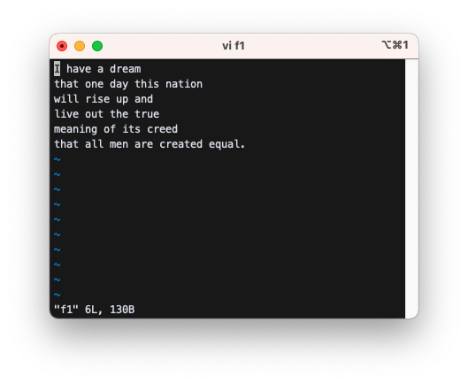

### 2) Try the code in 6-0), 6-1), 6-2), 6-3).

#### 6-0) Reading 20 bytes from file "f1" and display them in the terminal using printf.

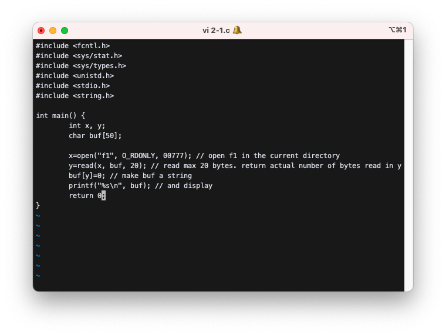
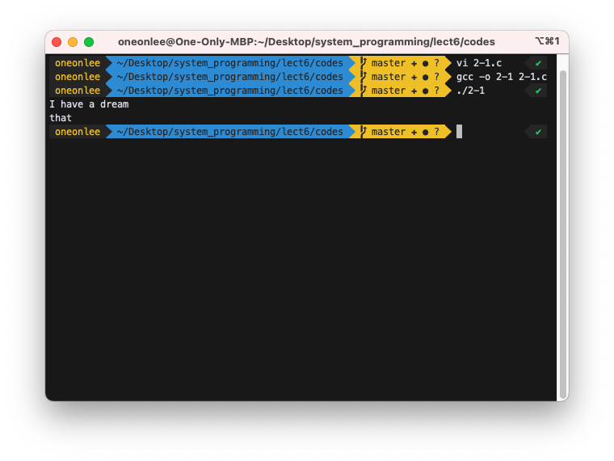

#### 6-1) Reading 20 bytes from file "f1" and display them in the terminal using write.


#### 6-2) Copying 20 bytes from file "f1" to "f2". Check "f2" with `cat f2`.

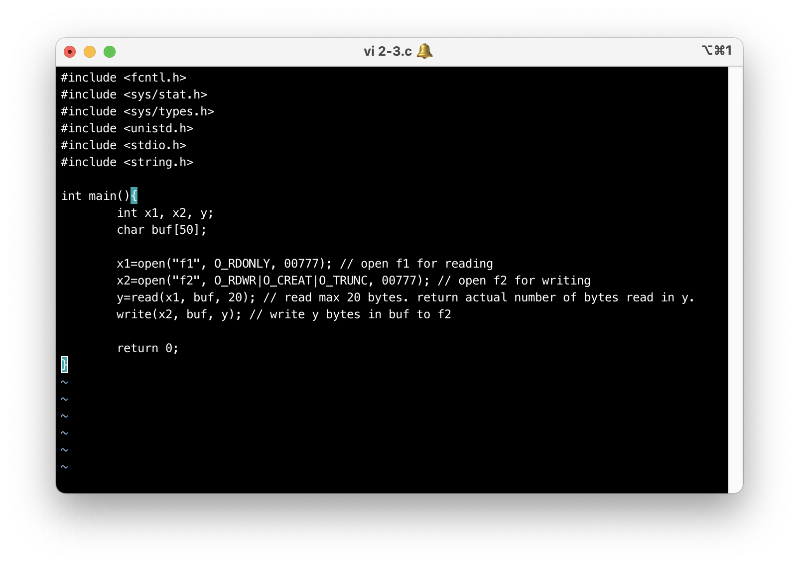


#### 6-3) Same as above, but copy all data from f1 to f2. Check "f2" with `cat f2`.

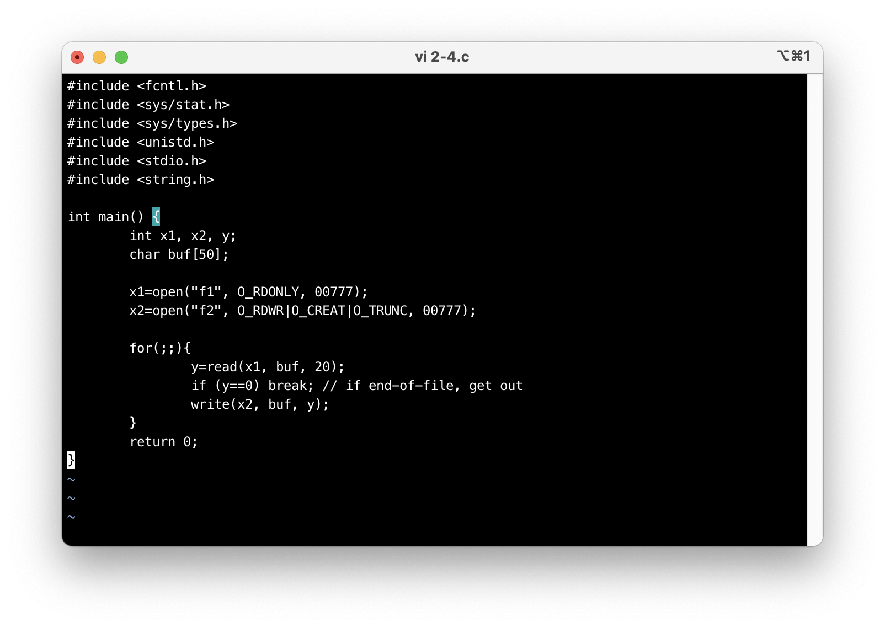


### 3) Find the byte size of f2 with `ls –l f2`. Use `xxd` to find out the actual data stored in f2.


f2의 byte size는 130bytes이다.

### 4) Write a program "hw4.c" that opens f2 and shows each byte of it in hexadecimal number, decimal number, and character. Use printf("%x %d %c\n", ...............) to display a number in various format.

```c
       int x, y; char buf[20];
       x=open("f2", O_RDONLY, 00777);      // open f2 for reading
       for(;;){
           y=read(x, buf, 1);  // read next byte
           if (y==0) break;    // we read all, exit the loop
           printf("%x %d %c\n", buf[0], buf[0], buf[0]); // display
       }
```

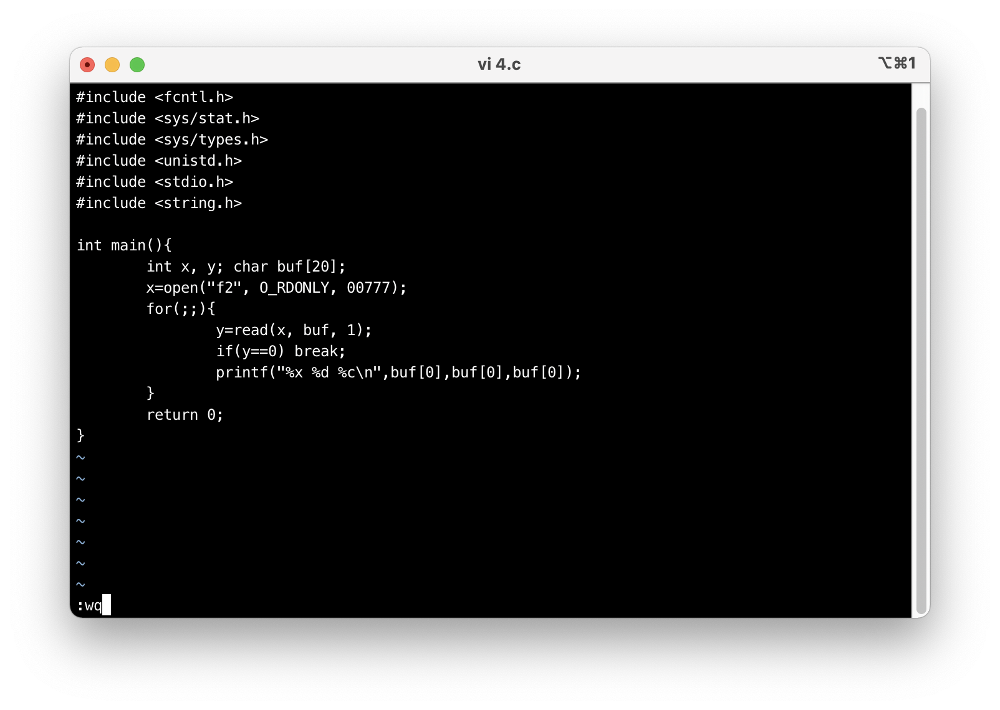
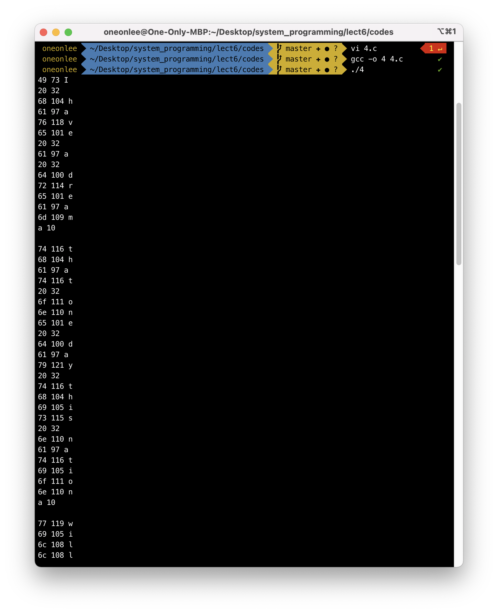

### 5. Compile hw4.c with `–g` option and run `gdb` to execute each instruction one by one. Use `p` or `x` to check the value of a variable.

```
    $ gcc -g -o hw4 hw4.c
    $ gdb hw4
    gdb) b main -- stop at main
    gdb) r -- run
    ............
    9 x=open("f2", O_RDONLY, 00777); -- next line to execute
    gdb) list -- show code list
    gdb) n -- execute current line
    11 y=read(x, buf, 1); -- line 9 has been executed. next is line 11
    gdb) p x -- show x
    $1 = 7 -- f2 is now file number 7
    gdb) n
    ..........
    gdb) p y
    $2 = 1 -- we have read 1 byte
    gdb) p buf[0]
    $4 = 73 'I' -- assume we have 'I' in buf[0]
    gdb) x/4xb buf -- show 4 bytes at buf in hexadecimal num
    0x7fffffffe470: 0x49 0x06 0x40 0x00 -- we have 0x49=73='I' in buf[0]
    gdb) n
    ............ –- repeat a few times
    gdb) list -- show rest of code
    gdb) b 15 -- break point at line 15 (after loop)
    gdb) c -- continue to that break point
    gdb) q -- stop gdb
```


### 6. Write a program that creates a file and writes "hello there"in it. Use open() and write(). Confirm the result with "cat".

```c
    x = open("f3", O_RDWR | O_CREAT | O_TRUNC, 00777); // create f3
    write(x, "hello there", 11); // write 11 bytes in f3
```


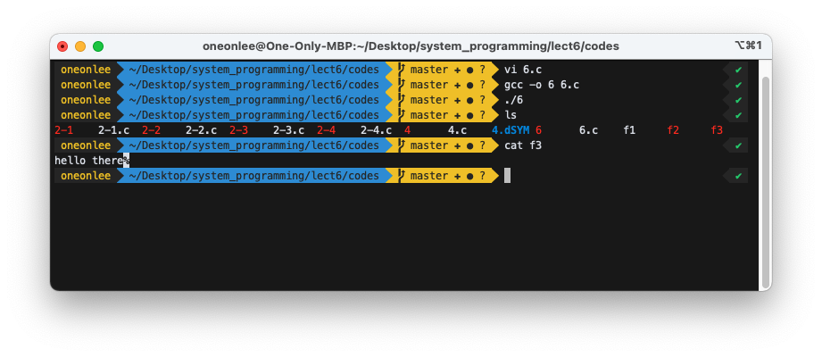

### 7. Write a program that makes a copy for file "hw4.c" into another file "cphw4.c". Use `open()`, `read()`, and `write()`. Confirm that they are same with `cat` and `ls -l`.

```c
              x1 = open hw4.c as O_RDONLY
              x2 = open cphw4.c as O_RDWR | O_CREAT | O_TRUNC
              for(;;){
                  y = read max 20 bytes from x1 into buf
                  if y is 0, break
                  write y bytes of buf into x2
              }
```


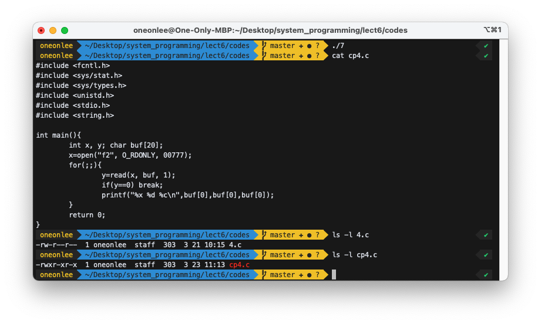

### 8. Write a program that makes a copy for file "hw4" (the executable file for "hw4.c) into another file cphw4. Confirm that they are same with `xxd` and `ls -l`. Execute cphw4 to see if it runs ok.

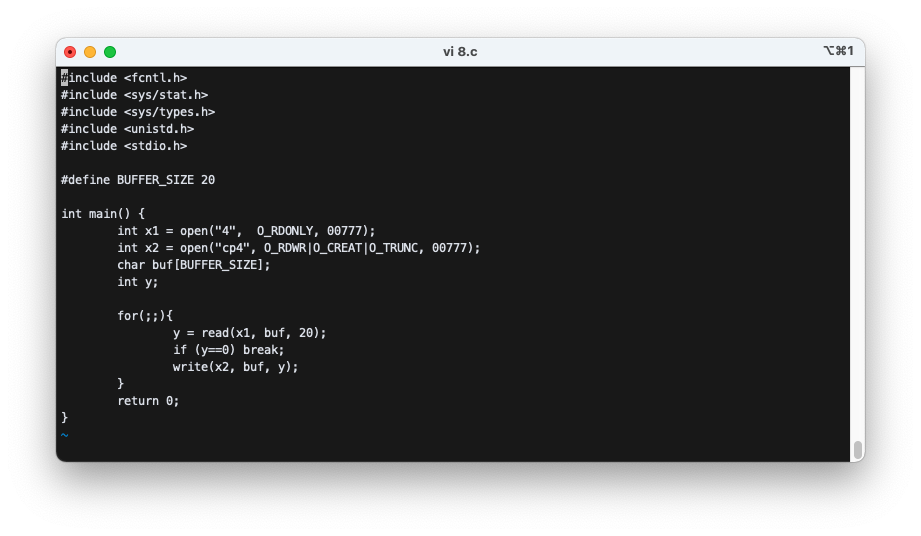


### 9. Repeat 7). But get the name of the files from the user. Confirm that the result of copy with "cat" and "ls -l".

```
Enter src file name
hw4.c
Enter dest file name
newhw4.c
hw4.c is copied into newhw4.c successfully.
```

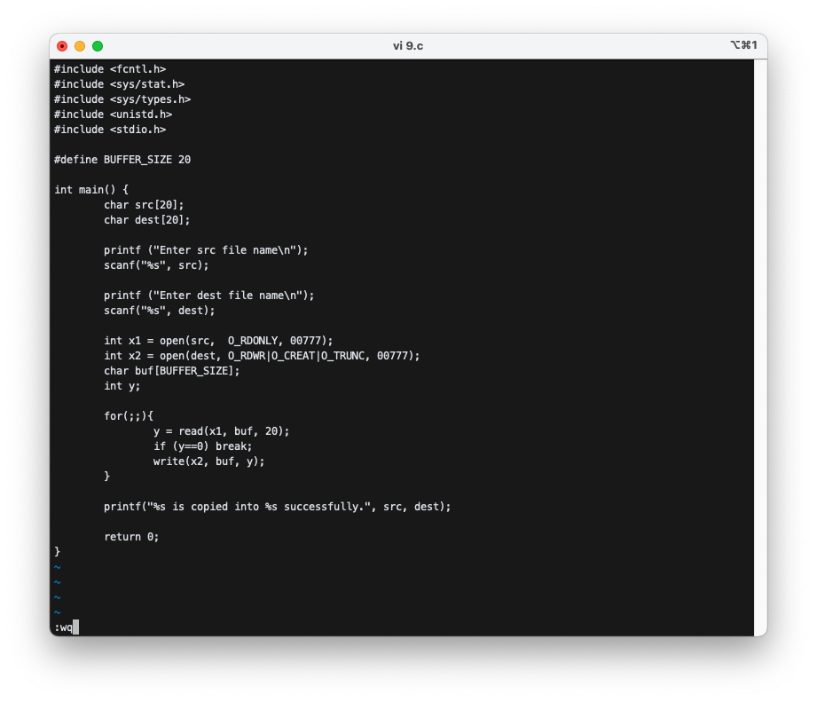
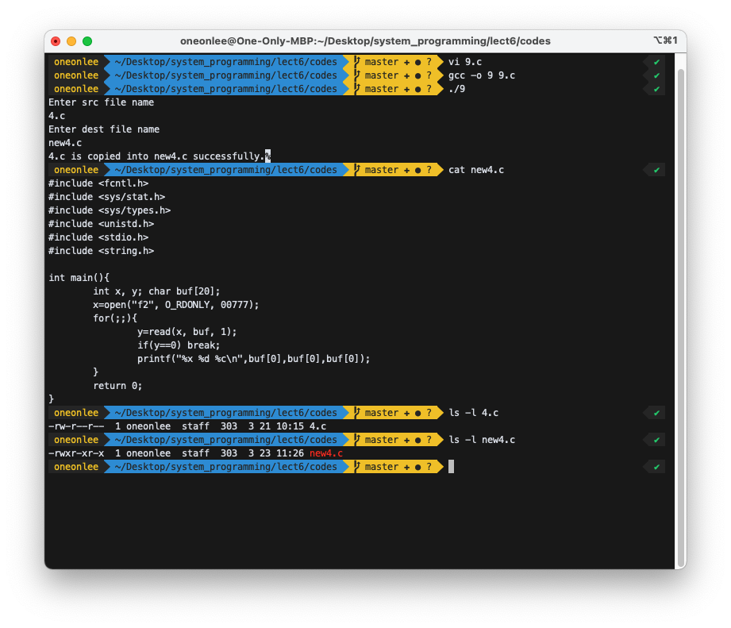

### 10. Write `mycat` that displays the contents of a user-input file in the terminal in characters. Give a text file and a non-text file to `mycat` and explain the difference.

```
$./mycat
Enter file name
f1
The content of f1 is :
I have a dream
that one day this nation
will rise up and
live out the true
meaning of its creed
that all men are created equal.
$./mycat
Enter file name
hw4
.............
```


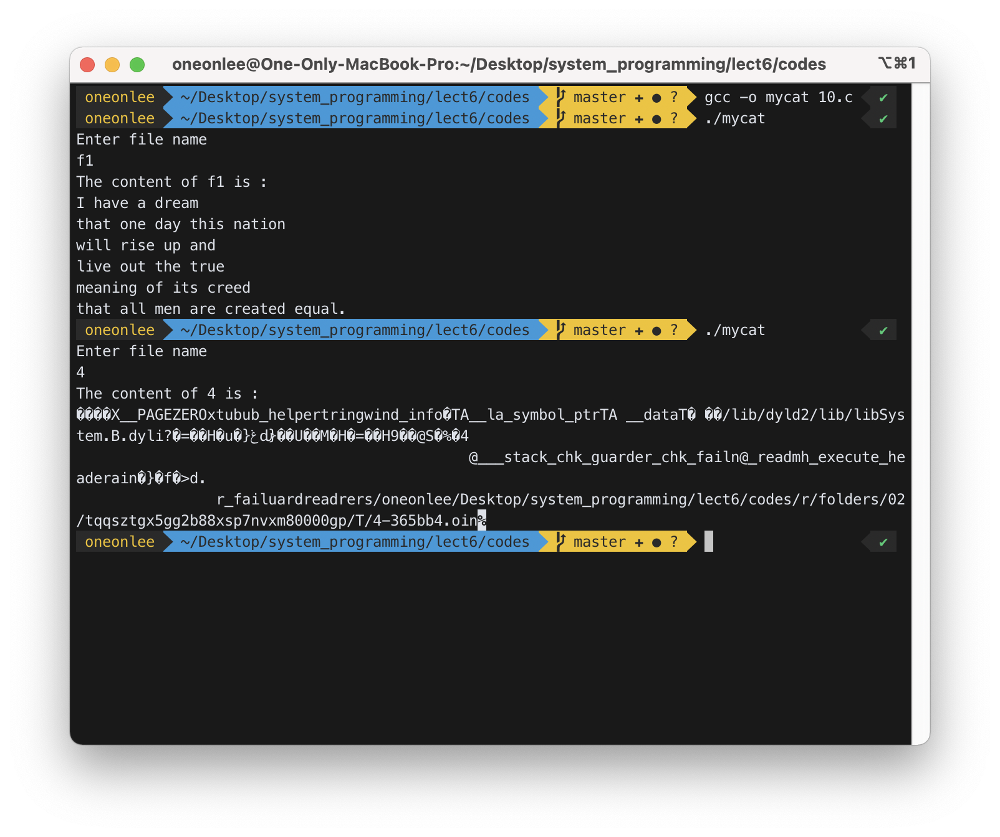

- `cat` 명령은 파일이름을 인자로 받아서 그 내용을 쭉 이어주는 역할을 한다.
- `mycat` 프로그램은 `cat` 명령과 같은 기능을 수행하는 프로그램이다.
  - 텍스트 파일(`f1`)을 입력으로 주었을 때는 내용물이 잘 나온 것을 확인할 수 있다.
  - 하지만, 실행 파일(`4`)은 문자가 깨져서 나온 것을 확인할 수 있다.

### 11. Write `myxxd` that displays the contents of a user-input file in the terminal in hexadecimal numbers. Give a text file and a non-text file to myxxd and explain the difference. You need to use `printf("%x ", buf[i])` to display a byte in a hexadecimal number. Also declare the buffer as an array of unsigned char. Compare the result from the result of `xxd`.

```
$./myxxd
Enter file name
f1
The content of f1 is :
49 20 68 61 ..........
$ xxd f1
..................
$./myxxd
Enter file name
hw4
.............
$ xxd hw4
...............
```

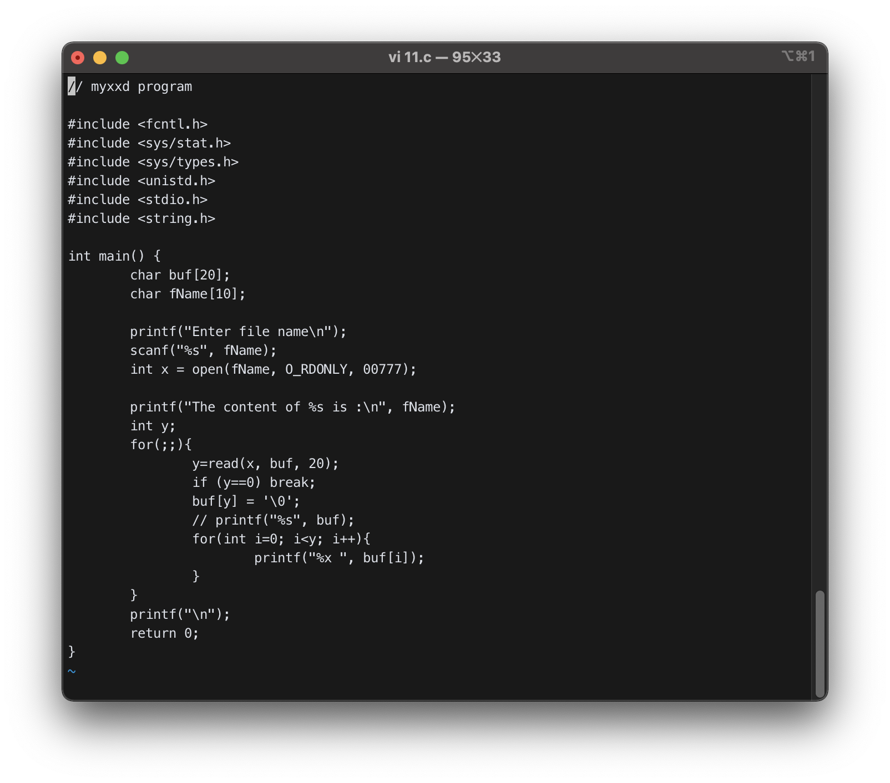

- `xxd` 명령은 바이너리 데이터를 16진수로, 16진수 데이터를 바이너리 데이터로 변환해주는 명령어다.
- `myxxd` 프로그램은 `xxd` 명령과 같은 기능을 수행하는 프로그램이다.
  - 텍스트 파일(`f1`)을 입력으로 주었을 때는 내용물이 잘 나온 것을 확인할 수 있다.
    - 
  - 실행 파일(`4`)을 입력으로 주었을 때도 내용물이 잘 나온 것을 확인할 수 있다.
    - `myxxd`로 `4`를 실행했을 때
      - 
    - `xxd`로 `4`를 실행했을 때
      - 

### 12. Run following code and display `f8` with `cat` and `xxd` respectively. Explain the results.

```c
    int x=open("f8", O_CREAT|O_RDWR|O_TRUNC, 00777);
    write(x, "ab", 2);
    int y=10;
    write(x, &y, 4);
    write(x, "cd", 2);
    y=235;
    write(x, &y, 4);
```

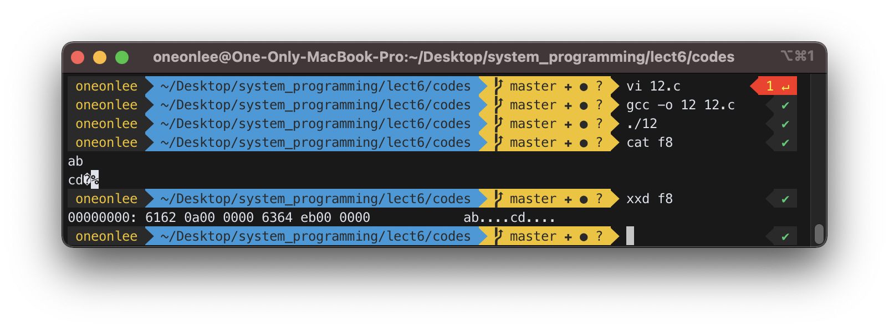

- `write(x, "ab", 2);`와 `write(x, "cd", 2);`를 실행하면 `x`에 각각 "ab"와 "cd"가 저장된다.
- `write(x, &y, 4);`를 실행했을 때 `y`의 값을 아스키코드로서 해석했을 때의 문자열로 저장하게 된다.
- 프로그램이 실행되면서 저장되는 텍스트 파일 `f8`을 `cat` 명령으로 실행하면 아래와 같이 일부 글자가 깨져서 출력된다.

```
ab
cd�
```

- 하지만 `f8`을 `xxd` 명령으로 실행하면 아래와 같이 출력된다.

```
00000000: 6162 0a00 0000 6364 eb00 0000            ab....cd....
```

- `xxd`로 보면 6162로 시작하는 것으로 보아 "ab"가 맨 앞에 기록된 것을 확인할 수 있다. 그다음 "0a"(\n)으로 줄 바꿈이 되었고 그 뒤 3(=4-1)칸이 0으로 채워진 것을 확인할 수 있다.
- 마찬가지로 "cd"가 6364로 기록되었고 그 뒤 "235"(ë) 아스키코드가 기록되었지만 터미널에선 글자가 깨져 확인할 수 없다.
- 마지막으로 남는 3칸은 0으로 채워진 것을 확인할 수 있다.

### 13. Write a program that divides a given file into three small files of roughly equal size. Use `fstat()` to find out the size of a file.

```
    Enter file name to split
    f9
    f9 is split into f91, f92, and f93.
```

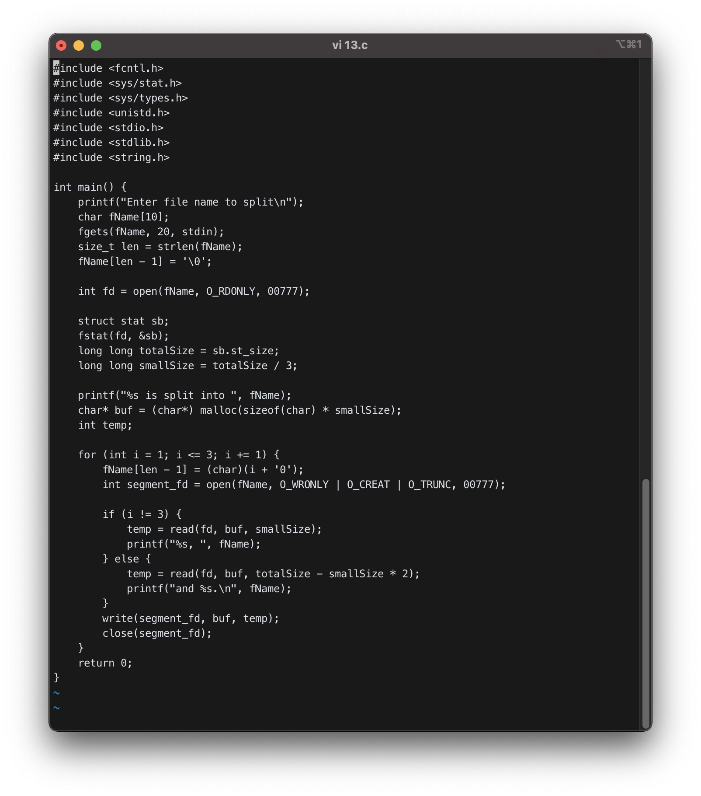


### 14. What is wrong with following program?

```c
char temp0[20], *temp1[10], *temp2[10];
printf("enter src file name\n");
gets(temp0);
temp1[0]=temp0;
printf("enter dest file name\n");
gets(temp0);
temp2[0]=temp0;
printf("src file:%s dest file:%s\n", temp1[0], temp2[0]);
```

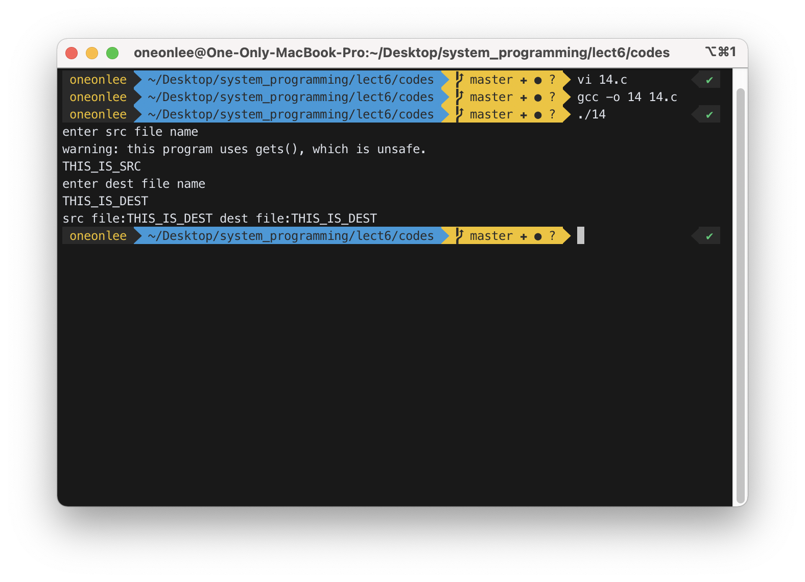

`temp1[0]=temp0;`과 `temp2[0]=temp0;`는 `temp1[0]`과 `temp2[0]`에 `temp0`의 시작지점 포인터를 기록하게 하는 동작이다. 즉, 문자열을 복사하는 기능이 아니다. 그런데 두 번째 `gets(temp0);`에서 `temp0` 값이 덮어 씌워져 `temp1[0]`과 `temp2[0]`이 같은 값을 같게 되었다. 아래와 같이 `strcpy`로 파일 내용을 복사한다면 원래의 의도대로 문제를 해결할 수 있다.

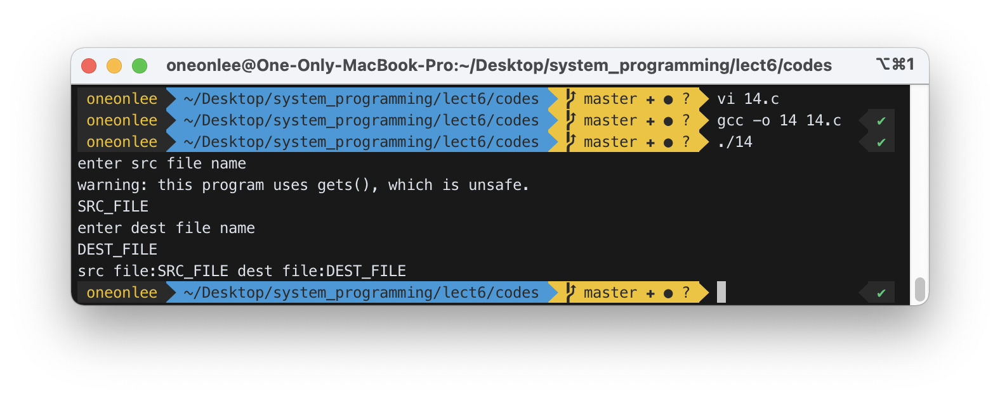

### 15. What is wrong with following program. Find the problem with GDB and fix it.

```c
    int x, x1, y;
    x=open("f1", O_RDONLY, 00777);
    x1=open("f2", O_WRONLY|O_CREAT|O_TRUNC,00777);
    char buf[512];
    int cnt=0;
    for(;;){
        y=read(x,buf,1);
        if (y==0) break;
        cnt++;
    }
    write(x1, buf, cnt);
```


---

## 7. Extra Practice

### 1. Write a program that adds up the ascii number of a text file and print it.

If "f1" has

```text
ab
c
```

then, the output should be `61+62+a+63+a=13a` in hexadecimal number as follows.

```bash
$ ./hexa_sum f1
sum: 13a
```

See [hexa_sum.c](./codes/hexa_sum.c) (Ref [myxxd 11.c](#11-write-myxxd-that-displays-the-contents-of-a-user-input-file-in-the-terminal-in-hexadecimal-numbers-give-a-text-file-and-a-non-text-file-to-myxxd-and-explain-the-difference-you-need-to-use-printf"x-"-bufi-to-display-a-byte-in-a-hexadecimal-number-also-declare-the-buffer-as-an-array-of-unsigned-char-compare-the-result-from-the-result-of-xxd) and [code](<./codes/11v2_(myxxd).c>))
