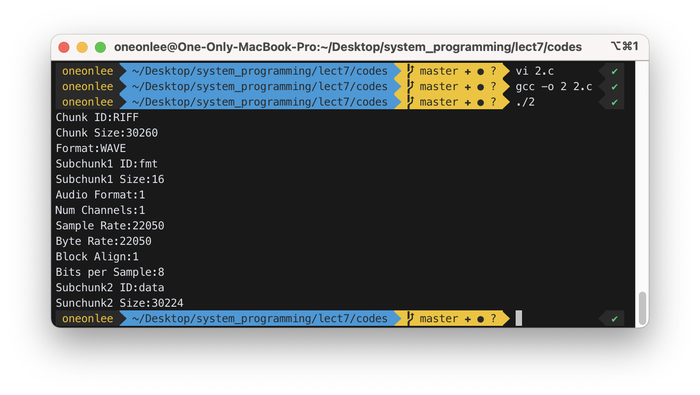
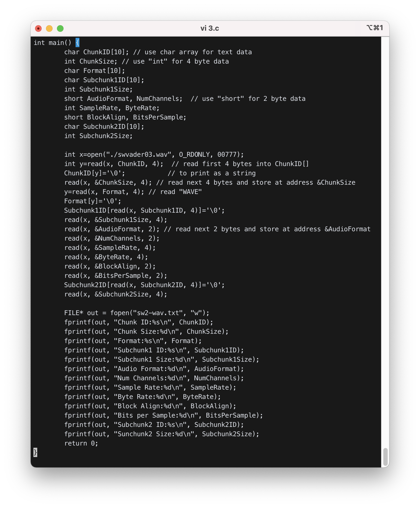
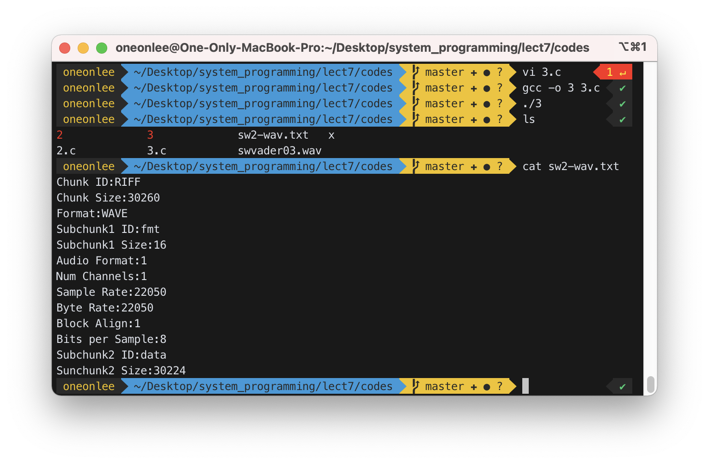
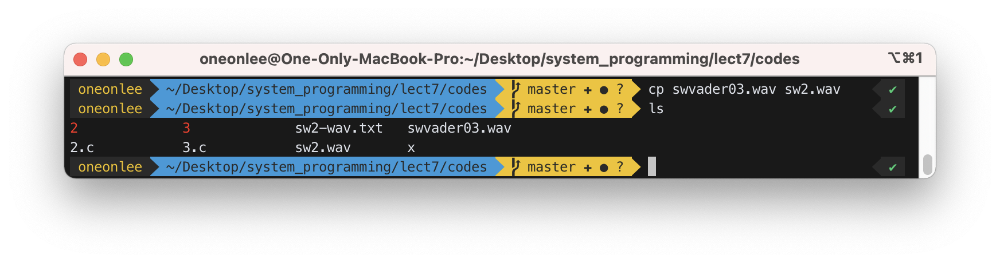
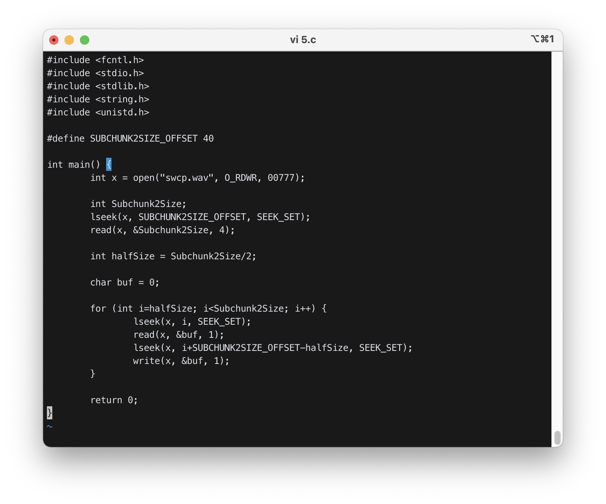

# Reading a non-text file

(various file formats : http://en.wikipedia.org/wiki/List_of_file_formats)

## 1. file type

- regular file (type 1)
    - 데이터를 포함하고 있는 파일
- text file
    - ASCII 코드나 유니코드(Unicode)로 인코딩된 문자(character)들을 포함하고 있는 파일
- non-text file (binary file)
    - non-characters를 포함
- directory file (type 2)
    - 그 directory의 각 파일에 대한 정보가 들어 있는 파일
- link file (type 7)
    - 다른 파일을 가르키는 파일
- device file (type 3, 4)
    - 키보드, 프린터, 마우스 등 다른 기기를 나타내는 파일
- socket file (type 5)
    - 네트워크 연결을 가르키는 파일

## 2. binary file

- binary file은 아래의 데이터를 포함한다.
    - 소리 (wav, mp3, ..)
    - 그림 (jpg, gif, ...)
    - 명령 (exe, elf, ...)
    - 압축된 데이터 (zip, gz, ...)
    - 기타 등등


## 3. little endian, big endian

- Multi-byte data는 little endian이나 big endian 방식으로 저장된다.
    - little endian: 높은 주소는 높은 바이트로, 낮은 주소는 낮은 바이트로 (high-high low-low)
    - big endian: 높은 주소는 낮은 바이트로, 낮은 주소는 높은 바이트로 (high-low low-high)

## 4. WAV file format

wav file은 sound data를 포함한다.

#### WAV File Specification 
출처 : https://ccrma.stanford.edu/courses/422-winter-2014/projects/WaveFormat/

```
The canonical WAVE format starts with the RIFF header:
(RIFF file types: WAV, AVI, RMI, …)
    0         4   ChunkID          Contains the letters "RIFF" in ASCII form
                                   (0x52494646 big-endian form).
    4         4   ChunkSize        36 + SubChunk2Size, or more precisely:
                                   4 + (8 + SubChunk1Size) + (8 + SubChunk2Size)
                                   This is the size of the rest of the chunk
                                   following this number.  This is the size of the
                                   entire file in bytes minus 8 bytes for the
                                   two fields not included in this count:
                                   ChunkID and ChunkSize. Expressed in little-endian.
    8         4   Format           Contains the letters "WAVE"
                                   (0x57415645 big-endian form).
```

```
The "WAVE" format consists of two subchunks: "fmt " and "data":

    The "fmt " subchunk describes the sound data's format:
        12        4   Subchunk1ID      Contains the letters "fmt "
                                    (0x666d7420 big-endian form).
        16        4   Subchunk1Size    16 for PCM.  This is the size of the
                                    rest of the Subchunk which follows this number.
        20        2   AudioFormat      PCM = 1 (i.e. Linear quantization)
                                    Values other than 1 indicate some
                                    form of compression.
        22        2   NumChannels      Mono = 1, Stereo = 2, etc.
        24        4   SampleRate       8000, 22050, 44100, etc.
        28        4   ByteRate         == SampleRate * NumChannels * BitsPerSample/8
        32        2   BlockAlign       == NumChannels * BitsPerSample/8
                                    The number of bytes for one sample including
                                    all channels.
        34        2   BitsPerSample    8 bits = 8, 16 bits = 16, etc.

    The "data" subchunk contains the size of the data and the actual sound:
        36        4   Subchunk2ID      Contains the letters "data"
                                    (0x64617461 big-endian form).
        40        4   Subchunk2Size    == NumSamples * NumChannels * BitsPerSample/8
                                    This is the number of bytes in the data.
                                    You can also think of this as the size
                                    of the rest of the subchunk following this
                                    number.
        44        *   Data             The actual sound data.
```

## 5. Reading a non-text file

- 4, 2, 1바이트의 binary data를 읽으려면 각각 `int`, `short`, `char` 자료형을 사용한다.
- 텍스트 데이터에는 char array를 사용합니다.


실제 코드는 [여기](https://github.com/oneonlee/Computer-Science/blob/main/4.%20System%20Programming/06.%20Reading%20a%20non-text%20file/codes/2.c)를 참조

```c
char ChunkID[10];           // use char array for text data
int ChunkSize;              // use "int" for 4 byte data
char Format[10];
........
short AudioFormat;          // use "short" for 2 byte data
........

x=open("./f1.wav", ...........);
y=read(x, ChunkID, 4);      // read first 4 bytes into ChunkID[]
ChunkID[y]=0;               // to print as a string
y=read(x, &ChunkSize, 4);   // read next 4 bytes and store at address &ChunkSize
y=read(x, Format, 4);       // read "WAVE"
Format[y]=0;
.......
y=read(x, &AudioFormat, 2); // read next 2 bytes and store at address &AudioFormat
..........
printf("ChunkID:%s\n", ChunkID);
printf("ChunkSize:%d\n",ChunkSize);
printf("Format:%s\n",Format);
.......
printf("AudioFormat:%d\n", AudioFormat);
.......
```

## 6. Other file-related system functions

`lseek`, `fopen`, `fprintf`, ....

```c
int y;
y=lseek(x, 30, SEEK_SET);  // move file pointer to 30. return 30
y=lseek(x, 30, SEEK_CUR);  // move file pointer to current file pointer+30=60.
                           // return 60
y=lseek(x, 0, SEEK_END);   // move file pointer to the end of file. return this
                           // file pointer

FILE *f2;
char buf[100];
..........
f2=fopen("./yy","w");       // open ./yy for writing
fprintf(f2,"%s",buf);       // write the string in buf into f2
```


## 7. Exercise

### 1) Read swvader03.wav with `xxd`. Interpret all fields in the header.

First copy swvader03.wav file from `../../linuxer1` directory into current directory. <br>"`.`" means current directory.

```
$ cp  ../../linuxer1/swvader03.wav  .
(or cp ../../linuxer2/swvader03.wav .  in 165.246.38.152)
```

Look at the file with `xxd`.

```
$ xxd swvader03.wav > x
$ vi x
```


숫자는 Little-endian, 문자열은 Big-endian임을 유의해서 해석해야 한다.

- Chunk ID: 52 49 46 46 : RIFF (0x52 0x 49 0x 46 0x 46)
- Chunk Size: 34 76 00 00 : 30260 (0x00007634)
- Format : 57 41 56 45 : WAVE (0x57 0x41 0x56 0x45)
- Subchunk1 ID : 66 6d 74 20 : fmt (0x66 0x6d 0x74 0x20)
- Subchunk1 Size : 10 00 00 00 : 16 (0x00000010)
- Audio Format : 01 00 : PCM = 1 (0x0001)
- Num Channels : 01 00 : Mono = 1 (0x0001)
- Sample Rate : 22 56 00 00 : 22050
- Byte Rate : 22 56 00 00 : 22050 (0x00005622)
- Block Align : 01 00 : 1 (0x0001)
- Bits Per Sample : 08 00 : 8 bits (0x0008)
- Subchunk2 ID : 64 61 74 61 : data (0x61 0x74 0x61 0x64)
- Subchunk2 Size : 10 76 00 00 : 30224 (0x00007610)

### 2) Write a program that reads swvader03.wav and displays the content as above.

```c
        ..............
        char ChunkID[10]; // use char array for text data
        int ChunkSize; // use "int" for 4 byte data
        char Format[10];
        ........
        short AudioFormat;  // use "short" for 2 byte data
        ........
        x=open("./swvader03.wav", ...........);

        y=read(x, ChunkID, 4);  // read first 4 bytes into ChunkID[]
        ChunkID[y]=0;           // to print as a string
        y=read(x, &ChunkSize, 4); // read next 4 bytes and store at address &ChunkSize
        y=read(x, Format, 4); // read "WAVE"
        Format[y]=0;
        .......
        y=read(x, &AudioFormat, 2); // read next 2 bytes and store at address &AudioFormat
        ..........
        printf("ChunkID:%s\n", ChunkID);
        printf("ChunkSize:%d\n",ChunkSize);
        printf("Format:%s\n",Format);
        .......
        printf("AudioFormat:%d\n", AudioFormat);
        .......
```


- 파일 포맷을 크기에 맞게 변수로 정의하고 차례대로 read 함수로 읽었다.
- 문자열은 맨 뒤에 `\0`을 붙여 `printf` 함수가 올바르게 문자열을 인식해 출력할 수 있게 하였다.



### 3) Same as 2), but display the content in file "sw2-wav.txt". Using `write()` to write into a text file is very hard. Use `fopen()` and `fprintf()` for formatted output.

```c
..........
x=open("./swvader03.wav", ...........); // input file
FILE *fout=fopen("sw2-wav.txt", "w"); // output file

y=read(x, ChunkID, 4); // read "RIFF"
ChunkID[y]=0; // to print as a string
y=read(x, &ChunkSize, 4); // read chunk size
y=read(x, Format, 4); // read "WAVE"
Format[y]=0;
.......
fprintf(fout,"ChunkID:%s\n", ChunkID); // write to sw2-wav.txt
fprintf(fout, "ChunkSize:%d\n",ChunkSize);
fprintf(fout, "Format:%s\n",Format);
.......
```



- 3번 코드는 2번 코드를 재사용하여 작성하였다.
- 마지막에 `fopen()`을 이용해 파일 스트림을 생성하고, `printf()`를 `fprintf()`로 바꿔 파일에 기록될 수 있도록 하였다.



### 4) "swvader03.wav" contains a sentence, “Yes, my master”. Write a program that modifies the file such that it contains only “master”. Move the file read pointer to the start of the actual sound data with `lseek()` and write 0 for half of the sound data, since "Yes, my" and "master" take about half of the sound data each. It will be better that you copy swvader03.wav to sw2.wav and modify sw2.wav. When you modified the file, you need to download it to your PC using psftp (look at Section 7 for the explanation for psftp).



- 먼저 `cp` 명령어를 통해 `sw2.wav`를 `swvader03.wav`로부터 복사하였다.


- `lseek()`로 40번째 바이트로 이동하여 Subchunk2의 사이즈를 구하였다.
- Subchunk2의 사이즈의 절반만큼을 for문으로 지워주고, "sw2.wav"를 재생했더니 “master”만 들렸다.

### 5) Write a program that modifies the wav file such that it contains "master" twice. That is, when you play this file you should here "master master".



- `lseek()`로 40번째 바이트로 이동하여 Subchunk2의 사이즈를 구하였다.
- for문을 돌면서 절반의 뒷부분의 정보를 `read`하여 `buf`에 저장하고, 그 값을 절반의 앞부분에 `write`하였다.

### 6) Use `gdb` to debug the error in following code.

```c
#include<fcntl.h>
#include<sys/stat.h>
#include<sys/types.h>
#include<unistd.h>
#include<stdio.h>

int main(){
	char chunkID[10];
	int chunkSize;
	char format[10];
	short AudioFormat;
	short NumChannel;
	int SampleRate;
	int ByteRate;
	short BlockAlign;
	short BitsPerSample;
	char data[20];
	int x,y;

	x = open("./swvader03.wav", O_RDONLY, 00777);
	x = read(x, chunkID, 4);
	chunkID[y] = 0;
	y = read(x, &chunkSize, 4);
	y = read(x, format, 4);
	format[y] = 0;

	printf("chunkID : %s ", chunkID);
	printf("chunkSize : %d ", chunkSize);
	printf("format : %s ", format);
	printf("\n");

	y = read(x, chunkID, 4);
	chunkID[y] = 0;
	y = read(x, &chunkSize, 4);
	y = read(x, &AudioFormat, 2);
	y = read(x, &NumChannel, 2);
	y = read(x, &SampleRate, 4);
	y = read(x, &ByteRate, 4);
	y = read(x, &BlockAlign, 2);
	y = read(x, &BitsPerSample, 2);

	printf("chunkID : %s ", chunkID);
	printf("chunkSize : %d ", chunkSize);
	printf("AudioFormat : %d ", AudioFormat);
	printf("NumChannel : %d ", NumChannel);
	printf("ByteRate : %d ", ByteRate);
	printf("BlockAlign : %d ", BlockAlign);
	printf("BitsPerSample : %d", BitsPerSample);
	printf("\n");

	y = read(x, chunkID, 4);
	chunkID[y] = 0;
	y = read(x, &chunkSize, 4);

	printf("chunkID : %s ",chunkID);
	printf("chunkSize : %d", chunkSize);
	printf("\n");

	return 0;
}
```

```
$ gcc -g -o ex2 ex2.c           ==> compile with -g to use gdb
$ gdb ex2
b main
r
     x=open("swvader03.wav",...);
n                              ==> run "x=open(...)"
     x=read(x, chunkID, 4);     ==> next statement to debug
p x                            ==> print x to see the result of "x=open(...)"
$1=7                          ==> swvader03.wav file is now file no 7
n                              ==> run "x=read(x, chunkID, 4)"
   chunkID[y]=0               ==> next statement to debug
p chunkID        ==> print chunkID to see the result of "x=read(x, chunkID, 4)"
$5="RIFF\000..."              ==> we have RIFF in chunkID
n                             ==> run "chunkID[y]=0"
   y=read(x, ...);              ==> next statement to debug
p chunkID                    ==> check chunkID again after "chunkID[y]=0"
......................
```
