# Command line argument

## 1. `main()` with command line arguments.

ex1.c:

```c
int main(int *x, char *y[]){
   .............
}
```

The system will pass

- `x`: number of command line arguments
- `y`: command line argument

For example,

```bash
$ ./ex1 x1 x2 x3
```

will pass **4** command line arguments: `./ex1`, `x1`, `x2`, `x3`.

Therefore, the system will pass

- `x` <-- 4 (number of command line arguments)
- `y[0]` <-- `./ex1` (first command line argument)
- `y[1]` <-- `x1` (second command line argument)
- `y[2]` <-- `x2` (third command line argument)
- `y[3]` <-- `x3` (fourth command line argument)

## 2. Exercise

### 0) Set up bash startup file: copy .bashrc and .bash_profile into your login directory

```bash
$ pwd
/home/sp11/12181234              -- make sure you are in the login directory
$ cp  ../../linuxer1/.bashrc  .        (use linuxer2 instead of linuxer1 in 152 server)
$ cp  ../../linuxer1/.bash_profile  .   (use linuxer2 instead of linuxer1 in 152 server)
```

And close your putty window and reopen. Now the prompt should have been changed to

```
[12181234@linuxer2 ~]$
```

Now you can type program name without `./` prefix.<br>
`$ ex1` <br>
instead of<br>
`$./ex1`

The new bash startup files will include the current directory (`.`) in the PATH environment variable which in turn allows you to type program name withtout `./` prefix to run it. (You have to reopen putty terminal to see the effect!)


### 1) Try following program which doesn't receive command line arguments.

ex0.c:

```c
int main(){  // this program doesn't receive command line arguments
   printf("hi\n");
}
```

```bash
$ gcc –o ex0 ex0.c
$ ex0
hi
```


### 2. Try following program that receives one command line argument.

ex1.c:

```c
int main(int argc, char * argv[]){ // this program receives command line arguments
   printf("hi\n");
   printf("%d\n", argc);     // number of arguments: 1
   printf("%s\n", argv[0]);  // the first argument: program name
}
```

```bash
$ gcc –o ex1 ex1.c
$ ex1
hi
1
ex1
```

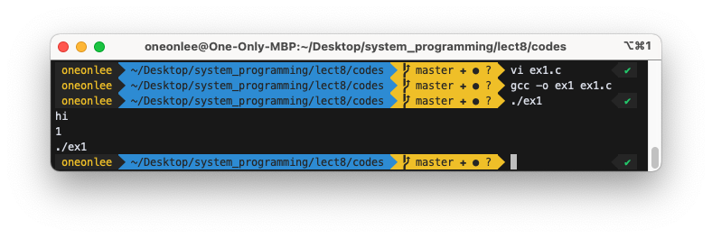

### 3. Try following program that receives two command line arguments.

ex2.c:

```
int main(int argc, char * argv[]){ // this program receives command line arguments
    printf("hi\n");
    printf("%d\n", argc); // number of arguments: 2
    printf("%s\n", argv[0]); // the first argument: program name
    printf("%s\n", argv[1]); // the second command line argument
}
```

```bash
$ gcc –o ex2 ex2.c
$ ex2
hi
1
ex2
Segmentation fault (core dumped)
```

=> You have to provide two command line arguments!
<br>

```bash
$ ex2 hello
hi
2
ex2
hello
$ ex2 hello uzbek tuit
hi
4
ex2
hello
```

=> If you provide more arguments than what the program can receive, the rest will be ignored.


### 4. A program that receives three command line arguments.

ex3.c:

```c
int main(int argc, char * argv[]){
   printf("hi\n");
   printf("%d\n", argc);
   printf("%s\n", argv[0]); // the first command line argument . the program name
   printf("%s\n", argv[1]); // the second command line argument
   printf("%s\n", argv[2]); // the third command line argument
}
```

```bash
$ ex3 hello there
hi
3
ex3
hello
there
```


### 5. A program that receives any number of arguments.

ex4.c:

```
int main(int argc, char *argv[]){
   int i;
   printf("argc is %d\n", argc);
   for(i=0;i<argc;i++){
       printf("argv[%d] is %s\n", i, argv[i]);
   }
}
```

Run above program with some arguments.

```bash
$ ex4 x1 x2 x3 x4
argc is 5
argv[0] is ex4
argv[1] is x1
argv[2] is x2
argv[3] is x3
argv[4] is x4
```

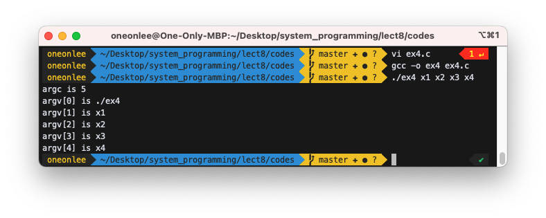

### 6. Try following and explain the difference from echo command.

myecho.c

```c
int main(int argc, char *argv[]){
    int i;
    for(i=1;i<argc;i++){ // skip program name
        printf("%s ", argv[i]); // and display all the arguments
    }
    printf("\n");
}
```

```bash
$ gcc –o myecho myecho.c
$ myecho hello
hello
$ echo hello
hello
$ myecho hello hi bye
hello hi bye
$ echo hello hi bye
hello hi bye
$ echo hi > f1
$ cat f1
hi
$ myecho hi > f2
$ cat f2
hi
```


### 7. Try following and explain the difference from `cat` command.

mycat.c

```c
#include <fcntl.h>
#include <sys/stat.h>
#include <sys/types.h>
#include <unistd.h>
#include <stdlib.h>
#include <stdio.h>

int main(int argc, char *argv[]){
    int x,y;
    char buf[20];

    x=open(argv[1], O_RDONLY, 00777); // open the specified file
    if (x==-1){ // if there is an error
        perror("error in open"); // report it
        exit(1); // and stop the program
    }
    for(;;){
        y=read(x, buf, 20); // read max 20 bytes
        if (y==0) break; // if end-of-file, get out
        write(1, buf, y); // write to terminal
    }
}
```

Now check whether it is working similarly to `cat`.

```bash
$ cat f1
I have a dream
that one day
this nation will rise up,
live out the true meaning of its creed.
$ mycat f1
I have a dream
that one day
this nation will rise up,
live out the true meaning of its creed.
$ cat f23
cat: f23: No such file or directory
$ mycat f23
error in open: No such file or directory
$ cat mycat.c
………
$ mycat mycat.c
……….
```

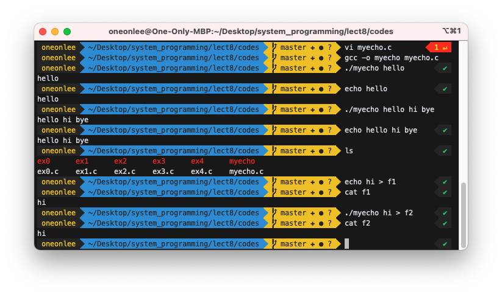

### 8) Try following: mycat2.c. Use functions for your program.

```c
#include <fcntl.h>
#include <sys/stat.h>
#include <sys/types.h>
#include <unistd.h>
#include <stdlib.h>
#include <stdio.h>
void display_content(int x); // function prototype

int main(int argc, char *argv[]){
    int x;
    x=open(argv[1], O_RDONLY, 00777); // open the specified file
    if (x==-1){ // if there is an error
        perror("error in open"); // report it
        exit(1); // and stop the program
    }
    display_content(x);
}

void display_content(int x){ // display the content of file x in the screen
    char buf[20];
    int y;
    for(;;){
        y=read(x, buf, 20); // read max 20 bytes
        if (y==0) break; // if end-of-file, get out
        write(1, buf, y); // write to terminal
    }
}
```

```
$ mycat2 f1
..............
```

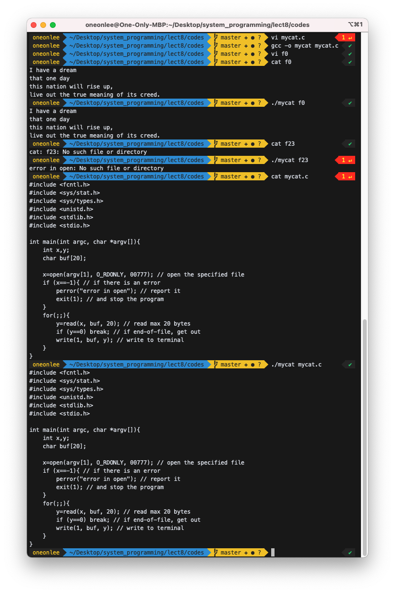

### 9) Try following: "mycat3.c."

```c
#include <fcntl.h>
#include <sys/stat.h>
#include <sys/types.h>
#include <unistd.h>
#include <stdlib.h>
#include <stdio.h>

void show_file(char * fname);
void display_content(int x); // function prototype

int main(int argc, char *argv[]){
    show_file(argv[1]);
}

void show_file(char *fname){
    int x;
    x=open(fname, O_RDONLY, 00777); // open the specified file
    if (x==-1){ // if there is an error
        perror("error in open"); // report it
        exit(1); // and stop the program
    }
    display_content(x);
}

void display_content(int x){ // display the content of file x in the screen
    char buf[20];
    int y;
    for(;;){
        y=read(x, buf, 20); // read max 20 bytes
        if (y==0) break; // if end-of-file, get out
        write(1, buf, y); // write to terminal
    }
}
```

```
$ mycat3 f1
.............
```


### 10. You can debug programs with command line arguments as follows. Debug "mycat3.c" with gdb. To pass command line arguments to gdb, do `set args arg1 arg2 ...`.

```
$gdb mycat3
gdb) b main
gdb) set args f1 f2 f3
gdb) r
.........
gdb) s ==> execute next statement (for function, enter the function)
...
gdb) n ==> execute next statement (for function, execute whole function and return)
......
```


```bash
[12181879@linuxer1 ~]$ gdb mycat3
GNU gdb (GDB) Fedora (7.5.1-38.fc18)
Copyright (C) 2012 Free Software Foundation, Inc.
License GPLv3+: GNU GPL version 3 or later <http://gnu.org/licenses/gpl.html>
This is free software: you are free to change and redistribute it.
There is NO WARRANTY, to the extent permitted by law.  Type "show copying"
and "show warranty" for details.
This GDB was configured as "x86_64-redhat-linux-gnu".
For bug reporting instructions, please see:
<http://www.gnu.org/software/gdb/bugs/>...
Reading symbols from /home/sp11/12181879/mycat3...done.
(gdb) b main
Breakpoint 1 at 0x40065b: file mycat3.c, line 12.
(gdb) set args f1 f2 f3
(gdb) r
Starting program: /home/sp11/12181879/mycat3 f1 f2 f3

Breakpoint 1, main (argc=4, argv=0x7fffffffe428) at mycat3.c:12
12	    show_file(argv[1]);
Missing separate debuginfos, use: debuginfo-install glibc-2.16-34.fc18.x86_64
(gdb) b 17
Breakpoint 2 at 0x40067c: file mycat3.c, line 17.
(gdb) c
Continuing.

Breakpoint 2, show_file (fname=0x7fffffffe6b5 "f1") at mycat3.c:17
17	    x=open(fname, O_RDONLY, 00777); // open the specified file
(gdb) p x
$1 = 0
(gdb) b 28
Breakpoint 3 at 0x4006cb: file mycat3.c, line 28.
(gdb) c
Continuing.

Breakpoint 3, display_content (x=7) at mycat3.c:29
29	        y=read(x, buf, 20); // read max 20 bytes
(gdb) x/20bx buf
0x7fffffffe2d0:	0xb5	0xe6	0xff	0xff	0xff	0x7f	0x00	0x00
0x7fffffffe2d8:	0x80	0x2e	0x9b	0x65	0x3b	0x00	0x00	0x00
0x7fffffffe2e0:	0x30	0xf4	0x20	0x65
(gdb) c
Continuing.
I have a dream
that
Breakpoint 3, display_content (x=7) at mycat3.c:29
29	        y=read(x, buf, 20); // read max 20 bytes
(gdb) x/20bx buf
0x7fffffffe2d0:	0x49	0x20	0x68	0x61	0x76	0x65	0x20	0x61
0x7fffffffe2d8:	0x20	0x64	0x72	0x65	0x61	0x6d	0x0a	0x74
0x7fffffffe2e0:	0x68	0x61	0x74	0x20
(gdb) c
Continuing.
one day
this nation
Breakpoint 3, display_content (x=7) at mycat3.c:29
29	        y=read(x, buf, 20); // read max 20 bytes
(gdb) x/20bx buf
0x7fffffffe2d0:	0x6f	0x6e	0x65	0x20	0x64	0x61	0x79	0x0a
0x7fffffffe2d8:	0x74	0x68	0x69	0x73	0x20	0x6e	0x61	0x74
0x7fffffffe2e0:	0x69	0x6f	0x6e	0x20
(gdb) c
Continuing.
will rise up,
live o
Breakpoint 3, display_content (x=7) at mycat3.c:29
29	        y=read(x, buf, 20); // read max 20 bytes
(gdb) x/20bx buf
0x7fffffffe2d0:	0x77	0x69	0x6c	0x6c	0x20	0x72	0x69	0x73
0x7fffffffe2d8:	0x65	0x20	0x75	0x70	0x2c	0x0a	0x6c	0x69
0x7fffffffe2e0:	0x76	0x65	0x20	0x6f
(gdb) c
Continuing.
ut the true meaning
Breakpoint 3, display_content (x=7) at mycat3.c:29
29	        y=read(x, buf, 20); // read max 20 bytes
(gdb) x/20bx buf
0x7fffffffe2d0:	0x75	0x74	0x20	0x74	0x68	0x65	0x20	0x74
0x7fffffffe2d8:	0x72	0x75	0x65	0x20	0x6d	0x65	0x61	0x6e
0x7fffffffe2e0:	0x69	0x6e	0x67	0x20
(gdb) c
Continuing.
of its creed.

Breakpoint 3, display_content (x=7) at mycat3.c:29
29	        y=read(x, buf, 20); // read max 20 bytes
(gdb) x/20bx buf
0x7fffffffe2d0:	0x6f	0x66	0x20	0x69	0x74	0x73	0x20	0x63
0x7fffffffe2d8:	0x72	0x65	0x65	0x64	0x2e	0x0a	0x61	0x6e
0x7fffffffe2e0:	0x69	0x6e	0x67	0x20
(gdb) c
Continuing.
[Inferior 1 (process 31703) exited normally]
(gdb) q
```

#### 10-1) Following program falls into infinite loop when run: ex1 f1. Debug it with `gdb`.

```c
#include <fcntl.h>
#include <sys/stat.h>
#include <sys/types.h>
#include <unistd.h>
#include <stdlib.h>
#include <stdio.h>
int main(int argc, char *argv[]){
    int x,y;
    char buf[20];

    x=open(argv[1], O_RDONLY, 00777); // open the specified file
    if (x==-1){ // if there is an error
        perror("error in open"); // report it
        exit(1); // and stop the program
    }
    for(;;){
        y=read(x, buf, 20); // read max 20 bytes
        if (y==0) break; // if end-of-file, get out
        write(1, buf, y); // write to terminal
    }
}
```

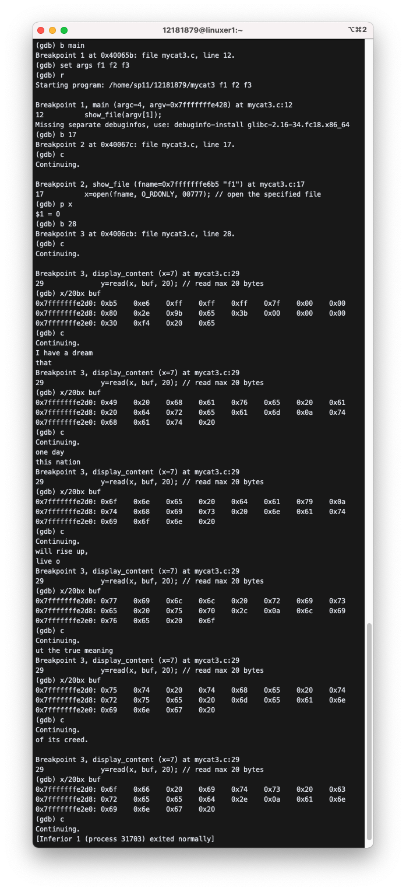

```bash
[12181879@linuxer1 ~]$ gdb ex10-1
GNU gdb (GDB) Fedora (7.5.1-38.fc18)
Copyright (C) 2012 Free Software Foundation, Inc.
License GPLv3+: GNU GPL version 3 or later <http://gnu.org/licenses/gpl.html>
This is free software: you are free to change and redistribute it.
There is NO WARRANTY, to the extent permitted by law.  Type "show copying"
and "show warranty" for details.
This GDB was configured as "x86_64-redhat-linux-gnu".
For bug reporting instructions, please see:
<http://www.gnu.org/software/gdb/bugs/>...
Reading symbols from /home/sp11/12181879/ex10-1...done.
(gdb) b main
Breakpoint 1 at 0x40065b: file ex10-1.c, line 11.
(gdb) set args f1 f2 f3
(gdb) r
Starting program: /home/sp11/12181879/ex10-1 f1 f2 f3

Breakpoint 1, main (argc=4, argv=0x7fffffffe428) at ex10-1.c:11
11	    x=open(argv[1], O_RDONLY, 00777); // open the specified file
Missing separate debuginfos, use: debuginfo-install glibc-2.16-34.fc18.x86_64
(gdb) b 16
Breakpoint 2 at 0x40069a: file ex10-1.c, line 16.
(gdb) c
Continuing.

Breakpoint 2, main (argc=4, argv=0x7fffffffe428) at ex10-1.c:17
17	        y=read(x, buf, 20); // read max 20 bytes
(gdb) x/20bx buf
0x7fffffffe320:	0xe0	0x06	0x40	0x00	0x00	0x00	0x00	0x00
0x7fffffffe328:	0x60	0x05	0x40	0x00	0x00	0x00	0x00	0x00
0x7fffffffe330:	0x20	0xe4	0xff	0xff
(gdb) c
Continuing.
I have a dream
that
Breakpoint 2, main (argc=4, argv=0x7fffffffe428) at ex10-1.c:17
17	        y=read(x, buf, 20); // read max 20 bytes
(gdb) x/20bx buf
0x7fffffffe320:	0x49	0x20	0x68	0x61	0x76	0x65	0x20	0x61
0x7fffffffe328:	0x20	0x64	0x72	0x65	0x61	0x6d	0x0a	0x74
0x7fffffffe330:	0x68	0x61	0x74	0x20
(gdb) c
Continuing.
one day
this nation
Breakpoint 2, main (argc=4, argv=0x7fffffffe428) at ex10-1.c:17
17	        y=read(x, buf, 20); // read max 20 bytes
(gdb) x/20bx buf
0x7fffffffe320:	0x6f	0x6e	0x65	0x20	0x64	0x61	0x79	0x0a
0x7fffffffe328:	0x74	0x68	0x69	0x73	0x20	0x6e	0x61	0x74
0x7fffffffe330:	0x69	0x6f	0x6e	0x20
(gdb) c
Continuing.
will rise up,
live o
Breakpoint 2, main (argc=4, argv=0x7fffffffe428) at ex10-1.c:17
17	        y=read(x, buf, 20); // read max 20 bytes
(gdb) x/20bx buf
0x7fffffffe320:	0x77	0x69	0x6c	0x6c	0x20	0x72	0x69	0x73
0x7fffffffe328:	0x65	0x20	0x75	0x70	0x2c	0x0a	0x6c	0x69
0x7fffffffe330:	0x76	0x65	0x20	0x6f
(gdb) c
Continuing.
ut the true meaning
Breakpoint 2, main (argc=4, argv=0x7fffffffe428) at ex10-1.c:17
17	        y=read(x, buf, 20); // read max 20 bytes
(gdb) x/20bx buf
0x7fffffffe320:	0x75	0x74	0x20	0x74	0x68	0x65	0x20	0x74
0x7fffffffe328:	0x72	0x75	0x65	0x20	0x6d	0x65	0x61	0x6e
0x7fffffffe330:	0x69	0x6e	0x67	0x20
(gdb) c
Continuing.
of its creed.

Breakpoint 2, main (argc=4, argv=0x7fffffffe428) at ex10-1.c:17
17	        y=read(x, buf, 20); // read max 20 bytes
(gdb) x/20bx buf
0x7fffffffe320:	0x6f	0x66	0x20	0x69	0x74	0x73	0x20	0x63
0x7fffffffe328:	0x72	0x65	0x65	0x64	0x2e	0x0a	0x61	0x6e
0x7fffffffe330:	0x69	0x6e	0x67	0x20
(gdb) c
Continuing.
[Inferior 1 (process 32208) exited normally]
(gdb) q
```

### 11. Modify "mycat.c" such that it can handle two input files.

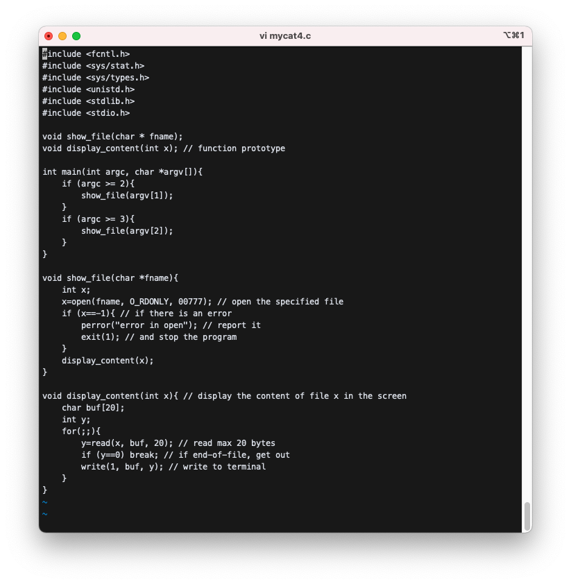

```
$ mycat f1
```

will print the contents of f1.<br><br>

```
$ mycat f1 f2
```

Will print the contents of f1, and f2. The result should be same as the result of `cat f1 f2`.<br><br>

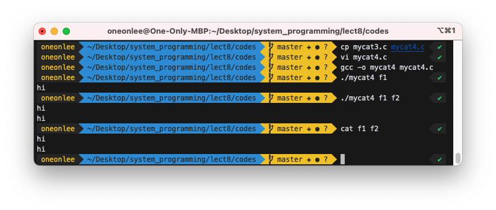

### 12. Modify "mycat" such that it can handle any number of files.


```
$ mycat f1 f2 f3
```

Will print the contents of f1, f2, and f3. The result should be same as the result of "cat f1 f2 f3".

```
$ mycat f1 f2 f3 f4
```

will print the contents of f1, f2, f3, and f4.

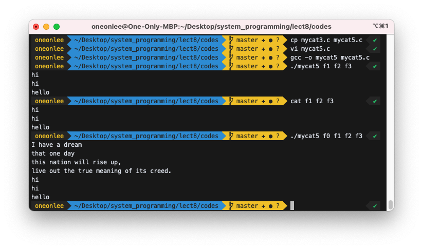

### 13. Implement "mycp" that works similarly to `cp`.

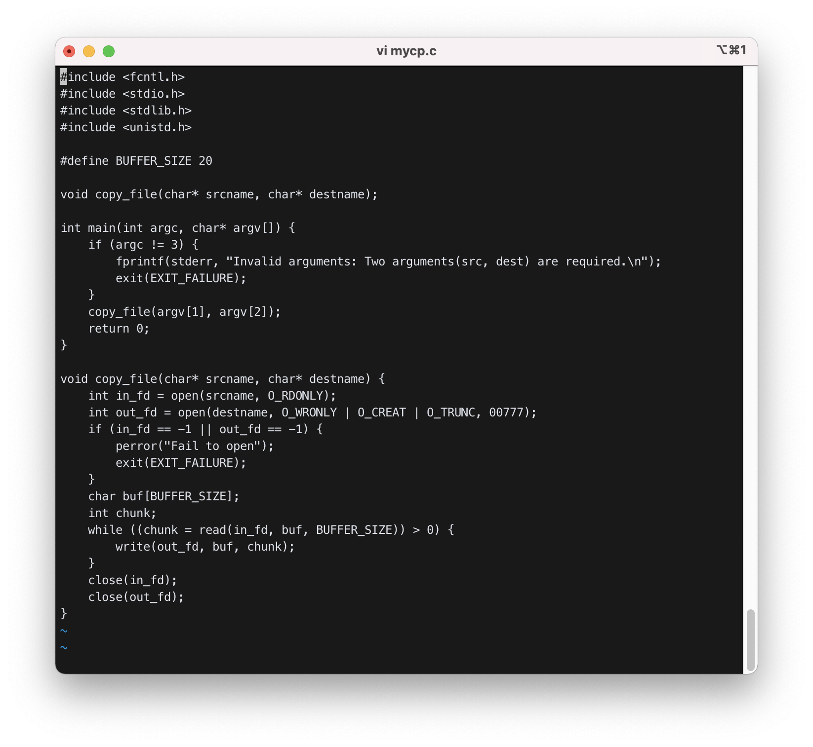

```
$ mycp f1 f2
```

will copy f1 into f2
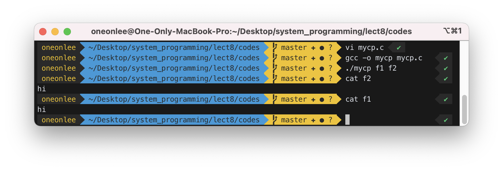

### 14. Implement "myxxd" that works similarly to `xxd`. Run `myxxd mycat.c`. Compare the result with `xxd mycat.c`.


```
$ cat f1
abc
$ xxd f1
0000000: 6162 630a abc.
$ myxxd f1
61 62 63 a
```


### 15. Modify "mycat" to handle various options. The second argument is either a file or an option. If it is a file, just display the contents. If it is an option (starting with `-`), perform the following corresponding actions.

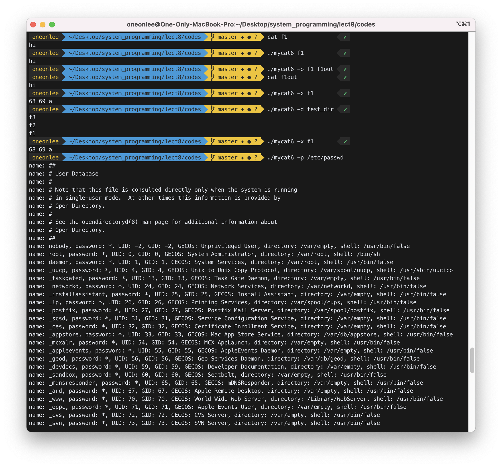

```
$ mycat -o f1 f1out
```

will copy f1 into f1out. (same effect as `cat f1 > f1out`)
<br>

```
$ mycat -x f1
```

will print the contents of "f1" on screen in hexadecimal numbers. (similar effect as `xxd f1`)
<br>

```
$ mycat -p /etc/passwd
```

will show the contents of "/etc/passwd" more user-friendly as follows:

```bash
................
id: 12170099 passwd:x uid:1300 gid:1300 desc: Student Account home:/home/sp1/12170099 sh:/bin/bash
id: 12131122 passwd:x uid:1301 gid:1301 desc: Student Account home:/home/sp1/12131122 sh:/bin/bash
....................
............
```

You may need `fopen`, `fgets`, `strtok()` for this option.
You need to know the structure of "/etc/passwd" file with `man 5 passwd`.
<br>

```
$ mycat -d d1
```

will print the name of files belonging to d1 which is a directory file.

You may need `opendir()`, `readdir()` for this option. Do `man 3 opendir`, `man 3 readdir` to see the usage.

Use functions wisely.

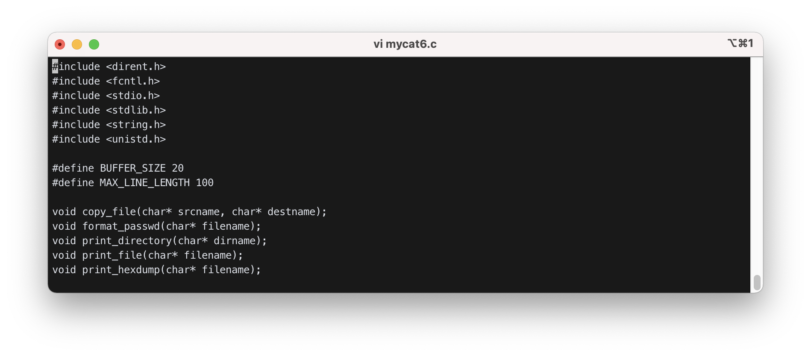
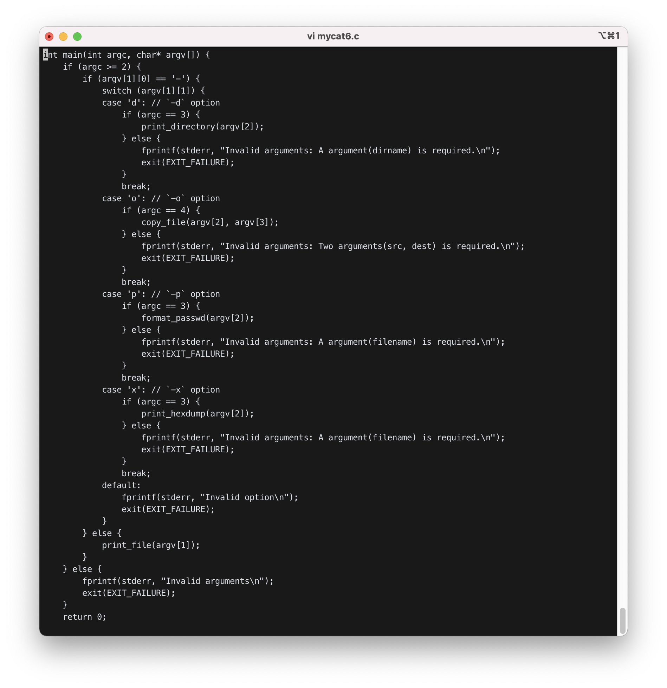


