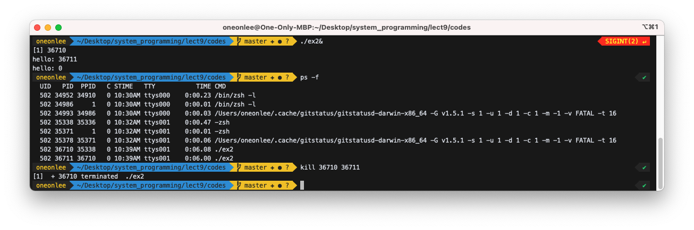
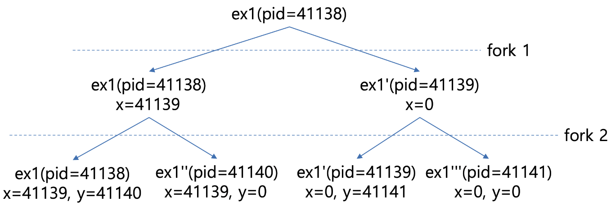
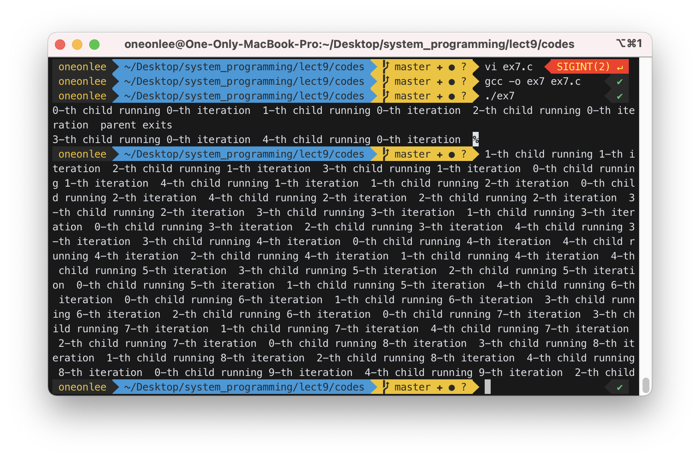

# Process related system calls

## 1. process

A program loaded in the memory.<br>
process = body + process descriptor<br>
body = code + data + stack

- `ps -ef` 명령어는 현재 메모리에 로드된 모든 프로세스를 보여준다.
- `ps -f` 명령어는 현재 터미널에서 실행 중인 프로세스를 나타낸다.
- 시스템은 [round-robin](https://ko.wikipedia.org/wiki/%EB%9D%BC%EC%9A%B4%EB%93%9C_%EB%A1%9C%EB%B9%88_%EC%8A%A4%EC%BC%80%EC%A4%84%EB%A7%81) 방식으로 각 프로세스를 하나씩 실행한다.
  - 스케줄러는 실행할 다음 프로세스를 선택하고 CPU는 이를 짧은 시간(예: 프로세스당 10ms, time quantum이라고 부름) 동안 실행하고 스케줄러는 다음 실행할 프로세스를 선택한다.

## 2. System calls to manage processes

- `fork`: 프로세스를 복제
- `exec`: 프로세스를 다른 프로세스로 변환
- `exit`: 프로세스 중지
- `wait`: 자식 프로세스(child process)가 종료될 때까지 대기
- `getpid`: process ID를 get
- `getppid`: parent process ID를 get

### What happens when a program calls `fork()`:

- copy body
  - copy process descriptor
  - adjust child's process descriptor
  - return 0 to child
  - return child's pid to parent
  - scheduler picks the parent or the child
  - the selected process starts to run AFTER `fork()`

## 3. Exercise

### 0) Try "ex0" below. Who is the parent of "ex0"?

ex0.c:

```c
#include <stdio.h>
#include <sys/types.h>
#include <unistd.h>
int main(){
   int x,y;
   x=getpid();
   y=getppid();
   printf("PID:%d PPID:%d\n", x, y);
   for(;;);   // to make this process alive
}
```

```bash
$ gcc –o ex0 ex0.c
```

Run "ex0" with `&`. `&` puts process in the background so that you can issue next command to the shell.

```
$ ex0&
[1] 2950
PID:2950 PPID:2219
```

Now confirm with `ps –f`.

```
$ ps  –f
 UID   PID  PPID   C STIME   TTY           TIME CMD
  502  1358  4160   0  9:19AM ttys000    0:00.37 /bin/zsh -l
  502  1405     1   0  9:19AM ttys000    0:00.01 /bin/zsh -l
  502  2219  2217   0  9:24AM ttys001    0:00.61 -zsh
  502  2258     1   0  9:24AM ttys001    0:00.01 -zsh
  502  2950  2219   0  9:28AM ttys001    0:15.66 ./ex0
```

Now kill "ex0".

```
$ kill 2950
[1]  + 2950 terminated  ./ex0
```

,where xxxx is the pid of "ex0".


위 사진처럼 "ex0"를 `kill` 한 후, `ps –f`를 통해 확인해보면 정상적으로 종료된 것을 확인할 수 있다.

### 1) Try "ex1" below.

ex1.c:

```c
#include <stdio.h>
#include <sys/types.h>
#include <unistd.h>
int main(){
   int x;
   x=fork();
   printf("hello\n");
   for(;;);
}
```

```bash
$ gcc –o ex1 ex1.c
$ ex1&
hello
hello
$ ps  -f
  502  1358  4160   0  9:19AM ttys000    0:00.37 /bin/zsh -l
  502  1405     1   0  9:19AM ttys000    0:00.01 /bin/zsh -l
  502  2219  2217   0  9:24AM ttys001    0:00.74 -zsh
  502  2258     1   0  9:24AM ttys001    0:00.01 -zsh
  502  4653  2219   0  9:39AM ttys001    0:08.18 ./ex1
  502  4662  4653   0  9:39AM ttys001    0:08.07 ./ex1
$ kill xxxx(pid of ex1) yyyy(pid of ex1's child)
```

- Why do we have two hello's?
  - `fork`를 통해 process를 복제하여 `printf("hello\n");`가 2번 실행되었기 때문이다.
- What are the `PID` of "ex1" and "ex1"'s child?
  - `PID` of "ex1" : 4653
  - `PID` of "ex1"'s child : 4662
    - `PID`가 4662인 것의 `PPID`가 4653이기 때문. 즉, `PID`가 4662인 것이 `PID`가 4653인 것으로부터 복제된 것이다.
- Who is the parent of "ex1"?
  - "ex1"의 `PPID`가 2219이므로 "ex1"의 parent는 "-zsh"이다.

### 2) Modify "ex1.c" such that it prints its own pid and the parent pid. Confirm the result with `ps -ef`.

```c
#include <stdio.h>
#include <sys/types.h>
#include <unistd.h>
int main(){
   int x;
   x=fork();
   printf("hello. my pid is %d\n", getpid());
   printf("and my parent pid is %d\n", getppid());
   for(;;);
}
```

```bash
$ ps -ef
  UID   PID  PPID   C STIME   TTY           TIME CMD
    0     1     0   0 토10AM ??         6:26.11 /sbin/launchd
    ...
  502 23834     1   0  2:08PM ??         3:05.88 /Applications/iTerm 2.app/Contents/MacOS/iTerm2
  502 23835 23834   0  2:08PM ??         0:00.02 /Users/oneonlee/Library/Application Support/iTerm2/iTermServer-3.4.15 /Users/oneonlee/Library/Application Support/iTerm2/iterm2-daemon-1.socket
    ...
  502  1358  4160   0  9:19AM ttys000    0:00.37 /bin/zsh -l
  502  1405     1   0  9:19AM ttys000    0:00.01 /bin/zsh -l
    0  2217 23835   0  9:24AM ttys001    0:00.36 login -fp oneonlee
  502  2219  2217   0  9:24AM ttys001    0:00.97 -zsh
  502  2258     1   0  9:24AM ttys001    0:00.01 -zsh
  502  7759  2219   0  9:57AM ttys001    0:10.25 ./ex2
  502  7760  7759   0  9:57AM ttys001    0:09.97 ./ex2
    0  8254  2219   0 10:00AM ttys001    0:00.01 ps -ef

```

- Who is the parent of the parent of "ex1"?
  - "ex2"의 parent : `-zsh`(2219)
  - `-zsh`(2219)의 parent : `login -fp oneonlee`(2217)
- Who is the parent of the parent of the parent of "ex1"?
  - `login -fp oneonlee`(2217)의 parent : `/Users/oneonlee/Library/Application Support/iTerm2/iTermServer-3.4.15 /Users/oneonlee/Library/Application Support/iTerm2/iterm2-daemon-1.socket`(23835)
- Follow the parent link until you reach `PID 0` and show all of them.
  - `/Users/oneonlee/Library/Application Support/iTerm2/iTermServer-3.4.15 /Users/oneonlee/Library/Application Support/iTerm2/iterm2-daemon-1.socket`(23835)의 parent : `/Applications/iTerm 2.app/Contents/MacOS/iTerm2` (23834)
  - `/Applications/iTerm 2.app/Contents/MacOS/iTerm2` (23834)의 parent : `/sbin/launchd` (1)

### 3) Try below ("ex2.c"). Which hello is displayed by the parent and which hello is by the child?

```c
#include <stdio.h>
#include <sys/types.h>
#include <unistd.h>

int main(){
   int x;
   x=fork();
   printf("hello: %d\n", x);
}
```


parent와 child의 PID를 확인하기 위해 주어진 코드에 `for(;;);` 무한루프를 추가하여 프로그램이 종료되지 않게 하였다.

```bash
$ gcc –o ex2 ex2.c
$ ex2
hello: 36711
hello: 0
```



`fork()`는 성공할 경우 자식의 PID를 부모에게 전달하며, 자식은 0을 반환 받는다.

따라서 "hello: 36711"를 출력한 것이 parent이며(PID:36710), "hello: 0"를 출력한 것이 child이다. (PID:36711)

### 4) Try below ("ex3.c") and show all ancestor processes of "ex3" (parent, parent of parent, etc).

```c
#include <stdio.h>
#include <sys/types.h>
#include <unistd.h>

int main(){
   int x;
   x=fork();
   printf("hello: %d\n", x);
   for(;;); // make the parent and child alive
}
```


```bash
$ gcc –o ex3 ex3.c
$ ex3 &
hello: 36711
hello: 0
$ ps  -ef
  UID   PID  PPID   C STIME   TTY           TIME CMD
  502 35338 35336   0 10:32AM ttys001    0:00.47 -zsh
  502 36710 35338   0 10:39AM ttys001    0:06.08 ./ex3
  502 36711 36710   0 10:39AM ttys001    0:06.00 ./ex3
```

PPID를 따라가며 ps의 출력값을 읽어보면, zsh 프로세스(35338)로부터 "ex3(36710)" 프로세스가 생성되었으며 "ex3(36710)"부터 "ex3(36711)" 프로세스가 생성되었다.

### 5) Try below ("ex4.c"). Which message was displayed by the parent and which one by the child?

```c
#include <stdio.h>
#include <sys/types.h>
#include <unistd.h>

int main(){
   int x;
   x=fork();
   if (x==0){
       printf("hello: %d\n", x);
   }else{
       printf("hi: %d \n", x);
   }
}
```

```bash
$ gcc –o ex4 ex4.c
$ ex4
```

`x`는 `fork()`로부터 반환된 값이기 때문에 `x`가 `0`이면 현재 프로세스는 자식 프로세스이고, `0`이 아니면 부모 프로세스이다. 따라서 "hi"는 부모 프로세스에서 출력된 값이고, "hello"는 복제된 자식 프로세스에서 출력된 값이다.

### 6) Try below ("ex5.c"). How many hellos do you see? Explain why you have that many hellos. Draw the process tree.

```c
#include <stdio.h>
#include <sys/types.h>
#include <unistd.h>

int main(){
   int x,y;
   x=fork();
   y=fork();
   printf("hello: %d %d\n", x, y);
}
```

```bash
$ gcc –o ex5 ex5.c
$ ex5
hello: 41139 41140
hello: 41139 0
hello: 0 41141
hello: 0 0
```

<!--  -->

- "ex5"를 실행하면 4개의 "hello"가 출력되는 것을 확인할 수 있다.
- `fork()`를 한 번하면 총 2개에 프로세스가 생성된다.
- 연속적으로 `fork()`를 두 번 하게 되면, 처음에 생긴 프로세스 각각 `fork()`를 수행하게 되므로 "4 (= 2^2)"개의 프로세스가 생성된다.
- 첫 번째 출력은 `x`, `y` 모두 `0`이 아니기 때문에 최초의 부모 프로세스로부터 생성된 것이다.
- 두 번째와 세 번째 출력은 `x`가 `0`이기 때문에 첫 번째 `fork()`로 복사된 프로세스에서 생성된 것으로, 두 번째 출력은 1번만 복사된 것, 세 번째는 2번 복사된 프로세스이다.
- 마지막 출력은 부모 프로세스로부터 두 번째 `fork()`에서 복사된 프로세스에서 출력된 것을 `x`는 `0`이 아니지만 `y`는 `0`임에서 알 수 있다.



### 7) Try below ("ex6.c"). How many hellos do you see? Explain why you have that many hellos.

```c
#include <stdio.h>
#include <sys/types.h>
#include <unistd.h>

int main(){
    int x,y;
    x=fork();
    printf("hello: %d\n", x);
    y=fork();
    printf("hello: %d\n", y);
}
```


```bash
$ gcc –o ex6 ex6.c
$ ex6
hello: 44973
hello: 44974
hello: 0
hello: 0
hello: 44975
hello: 0
```

- 처음 두 줄 "hello"는 최초의 부모 프로세스와 첫 번째 `fork()`로부터 생성된 자식 프로세스로부터 출력되었다.
- 나머지 프로세스는 "ex5"처럼 2개의 프로세스로부터 프로세스를 하나씩 생성했기 때문에 총 4개의 프로세스가 되고 각각의 프로세스가 "hello"을 출력하므로 총 "6 (= 2+2^2)"개의 "hello"가 출력된다.

### 8) Try below ("ex7.c"). When you run "ex7", how many processes run at the same time? Which process finishes first and which process finishes last? Show the finishing order of the processes. Run "ex7" again and compare the finishing order with that of the first run.

```c
#include <stdio.h>
#include <stdlib.h>
#include <sys/types.h>
#include <unistd.h>

int main(){
   int x, i;
   for(i=0;i<5;i++){
      x=fork();
      if (x==0){ // child
         int k;
         for(k=0;k<10;k++){
            printf("%d-th child running %d-th iteration \n", i, k);
            fflush(stdout);         // to make printf work immediately
            // sleep(1);              // sleep 1 second
        }
        printf("\n\n")
        exit(0);   // child exits after 10 iterations
      }
   }
   // now parent
   printf("parent exits\n");
}
```

```bash
$ ./ex9
0-th child running 0-th iteration
1-th child running 0-th iteration
3-th child running 0-th iteration
parent exits
4-th child running 0-th iteration
2-th child running 0-th iteration
0-th child running 1-th iteration
1-th child running 1-th iteration
3-th child running 1-th iteration
4-th child running 1-th iteration
2-th child running 1-th iteration
0-th child running 2-th iteration
1-th child running 2-th iteration
3-th child running 2-th iteration
4-th child running 2-th iteration
2-th child running 2-th iteration
0-th child running 3-th iteration
1-th child running 3-th iteration
3-th child running 3-th iteration
4-th child running 3-th iteration
2-th child running 3-th iteration
0-th child running 4-th iteration
1-th child running 4-th iteration
3-th child running 4-th iteration
4-th child running 4-th iteration
2-th child running 4-th iteration
0-th child running 5-th iteration
1-th child running 5-th iteration
3-th child running 5-th iteration
4-th child running 5-th iteration
2-th child running 5-th iteration
0-th child running 6-th iteration
1-th child running 6-th iteration
3-th child running 6-th iteration
4-th child running 6-th iteration
2-th child running 6-th iteration
0-th child running 7-th iteration
1-th child running 7-th iteration
3-th child running 7-th iteration
4-th child running 7-th iteration
2-th child running 7-th iteration
0-th child running 8-th iteration
1-th child running 8-th iteration
3-th child running 8-th iteration
4-th child running 8-th iteration
2-th child running 8-th iteration
0-th child running 9-th iteration
1-th child running 9-th iteration
3-th child running 9-th iteration
4-th child running 9-th iteration
2-th child running 9-th iteration
```



- When you run "ex7", how many processes run at the same time?
  - 5개 프로세스가 실행된다.

`fork()`를 총 5번 수행하므로 최종적으로는 하나의 부모 프로세스와 5개의 자식 프로세스가 생성된다. 부모 프로세스는 "parent exits"를 출력하고 자식 프로세스보다 먼저 종료된다. 이때 자식 프로세스는 모두 부모를 잃어버린 고아 프로세스가 되어 PPID가 init 프로세스의 PID인 `1`을 가리키게 된다.

자식 프로세스는 0부터 9까지 순회하며 `printf`로 문자열을 출력한다.

이때 `fflush(stdout)`는 표준출력스트림을 비워주는 역할로, 버퍼에 문자열을 넣고 기다리지 말고 바로 출력하기 위해 사용한다.

`sleep(1)` 자식 프로세스가 부모 프로세스보다 나중에 종료됨을 보장하기 위해 프로세스 실행 시간에 딜레이를 넣은 것이다.

프로세스가 반복문 순회를 마쳤다면 `exit(0)`를 통해 자식 프로세스를 종료한다.

따라서 프로그램은 총 5개의 자식 프로세스로부터 5\*10번 `printf`를 호출할 것이다.

### 9) If you delete `exit(0)` in "ex7.c", how many processes will be created? Confirm your answer by modifying the code such that each process displays its own `pid`.

```bash
$ ./ex7-1
0-th child running 0-th iteration(pid: 79605)
1-th child running 0-th iteration(pid: 79606)
2-th child running 0-th iteration(pid: 79607)
parent exits
3-th child running 0-th iteration(pid: 79608)
4-th child running 0-th iteration(pid: 79609)
0-th child running 1-th iteration(pid: 79605)
2-th child running 1-th iteration(pid: 79607)
3-th child running 1-th iteration(pid: 79608)
4-th child running 1-th iteration(pid: 79609)
1-th child running 1-th iteration(pid: 79606)
0-th child running 2-th iteration(pid: 79605)
3-th child running 2-th iteration(pid: 79608)
2-th child running 2-th iteration(pid: 79607)
4-th child running 2-th iteration(pid: 79609)
1-th child running 2-th iteration(pid: 79606)
0-th child running 3-th iteration(pid: 79605)
2-th child running 3-th iteration(pid: 79607)
4-th child running 3-th iteration(pid: 79609)
1-th child running 3-th iteration(pid: 79606)
3-th child running 3-th iteration(pid: 79608)
2-th child running 4-th iteration(pid: 79607)
4-th child running 4-th iteration(pid: 79609)
1-th child running 4-th iteration(pid: 79606)
0-th child running 4-th iteration(pid: 79605)
3-th child running 4-th iteration(pid: 79608)
4-th child running 5-th iteration(pid: 79609)
1-th child running 5-th iteration(pid: 79606)
3-th child running 5-th iteration(pid: 79608)
0-th child running 5-th iteration(pid: 79605)
2-th child running 5-th iteration(pid: 79607)
1-th child running 6-th iteration(pid: 79606)
3-th child running 6-th iteration(pid: 79608)
0-th child running 6-th iteration(pid: 79605)
4-th child running 6-th iteration(pid: 79609)
2-th child running 6-th iteration(pid: 79607)
0-th child running 7-th iteration(pid: 79605)
3-th child running 7-th iteration(pid: 79608)
2-th child running 7-th iteration(pid: 79607)
4-th child running 7-th iteration(pid: 79609)
1-th child running 7-th iteration(pid: 79606)
3-th child running 8-th iteration(pid: 79608)
2-th child running 8-th iteration(pid: 79607)
4-th child running 8-th iteration(pid: 79609)
1-th child running 8-th iteration(pid: 79606)
0-th child running 8-th iteration(pid: 79605)
0-th child running 9-th iteration(pid: 79605)
3-th child running 9-th iteration(pid: 79608)
1-th child running 9-th iteration(pid: 79606)
4-th child running 9-th iteration(pid: 79609)
2-th child running 9-th iteration(pid: 79607)
parent exits
parent exits
4-th child running 0-th iteration(pid: 79635)
2-th child running 0-th iteration(pid: 79638)
1-th child running 0-th iteration(pid: 79636)
3-th child running 0-th iteration(pid: 79637)
parent exits
parent exits
3-th child running 0-th iteration(pid: 79639)
4-th child running 0-th iteration(pid: 79640)
2-th child running 0-th iteration(pid: 79641)
4-th child running 0-th iteration(pid: 79642)
3-th child running 0-th iteration(pid: 79643)
parent exits
...
$ ./ex7-1 | grep -c "iteration"
310
```

만약 `exit(0))`를 제거한다면 자식 프로세스가 10번 `printf`를 한 이후에 다시 상위 반복문으로 돌아와 새로운 자식 프로세스를 생성한다.

가장 말단의 자식만 `printf`를 할 수 있지만, 가장 말단의 자식 프로세스가 아니더라도 `fork()`를 통해 새로운 프로세스를 계속 생성할 수 있다.

이는 이분법으로 증식하는 세포 같이 생각할 수 있다. 5회 반복 시 31(= 2^0+2^1+2^2+2^3+2^4)개의 자식 프로세스가 생성되며, 따라서 31개의 자식 프로세스로부터 310번 `printf`가 호출될 것이다.

---

## 4. Extra practice

### 1. Write a program that creates a child. The parent and child both print their PID's, but make sure the child always runs first.

```bash
$ ./child_first
child: 19019
parent: 19018
```

See [child_first.c](./codes/child_first.c) (Ref [Exercise 3](#3-try-below-"ex2c"-which-hello-is-displayed-by-the-parent-and-which-hello-is-by-the-child))

### 2. Write program that creates 3 children and let them print their PID's.

```bash
$ ./pid_of_children
Child(0)'s PID: 28899
Child(1)'s PID: 28900
Child(2)'s PID: 28901
```

See [pid_of_children.c](./codes/pid_of_children.c)
