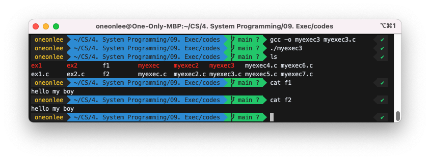
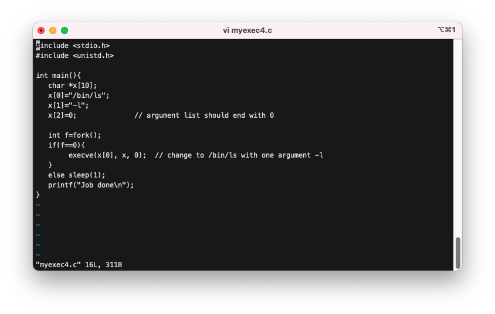
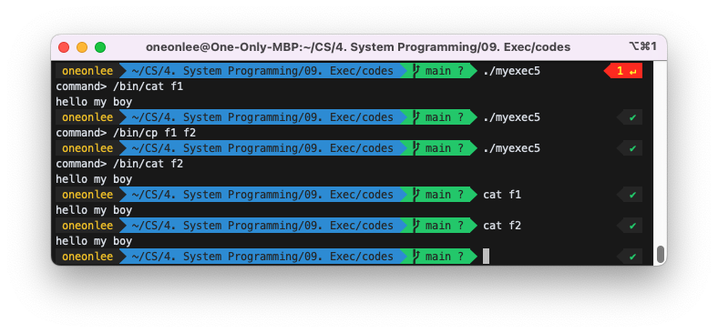
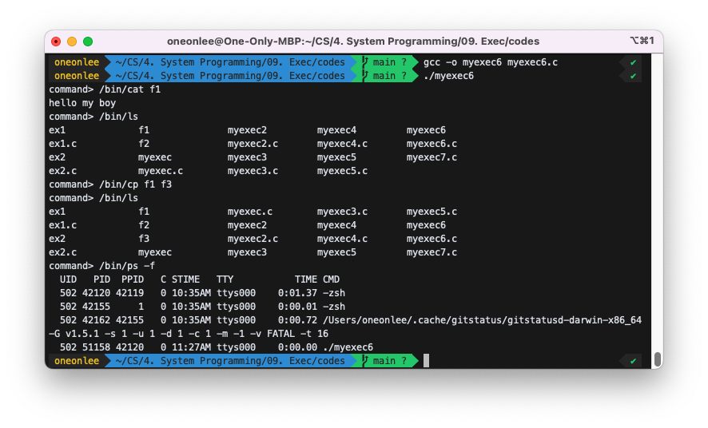
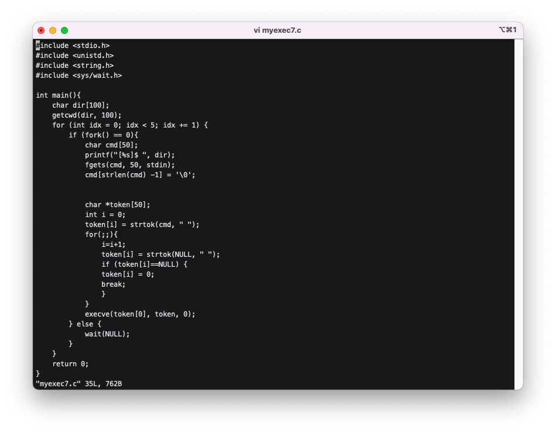
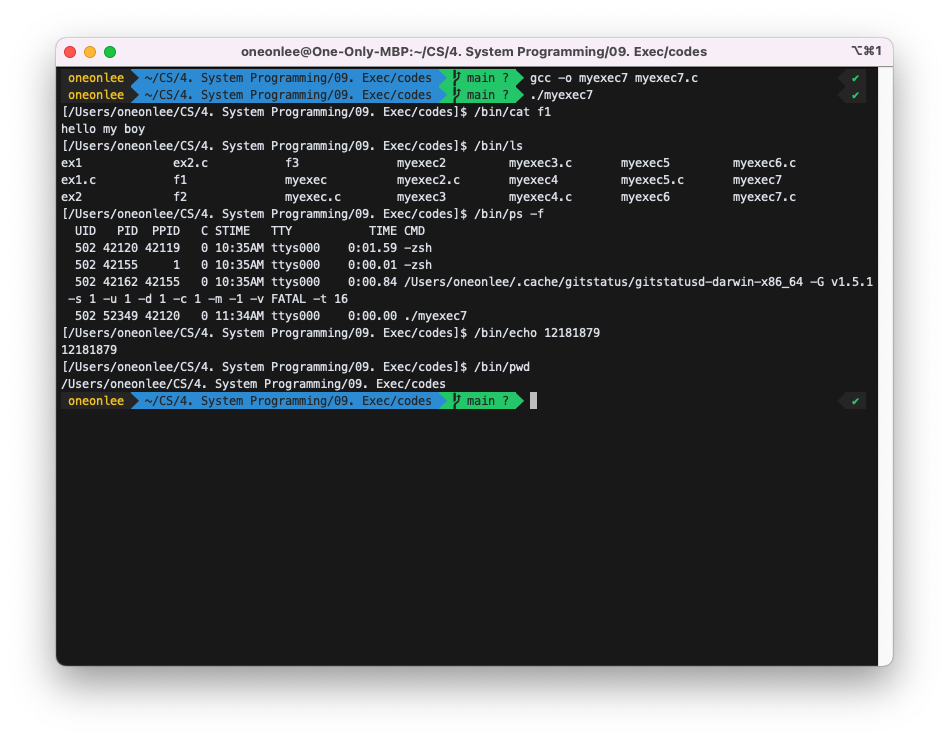

# Exec

## 1. exec : execve, execl, execlp, ....

A program calls `exec` to transform itself to another.

1. algorithm of `exec`
   - remove old body
   - load new body
   - adjust process descriptor
2. function prototype of `execve`

```c
    y=execve(fname, argv, envp); // change to fname with additional arguments specified in
    // argv[] and additional environment variables specified in
    // envp[]. returns -1 if error.
    y=execve("/aa/bb", k, 0); // change to /aa/bb with additional arguments in k
```

## 2. Example

### 1-1) Try below and explain why the output is "I am ex1" when "ex2" runs.

ex1.c:

```c
#include <stdio.h>
int main(){
   printf("I am ex1\n");
}
```

ex2.c:

```c
#include <stdio.h>
#include <unistd.h>
int main(){
   execve("./ex1",0 , 0); // change to ./ex1 with no additional argument
   printf("I am ex2\n");
}
```

```bash
$ gcc -o ex1 ex1.c
$ gcc -o ex2 ex2.c
$ ex2
I am ex1
```


- `execve(const char *filename, char *const argv[], char *const envp[]);`<br>
  에서 `execve` 함수는 실행가능한 파일인 filename의 실행코드를 현재 프로세스에 적재하여 기존의 실행코드와 교체하여 새로운 기능으로 실행한다. 즉, 현재 실행되는 프로그램의 기능은 없어지고 filename 프로그램을 메모리에 loading하여 처음부터 실행하기 때문에 ex2를 실행했지만 ex1이 실행되었다.

### 1-2) Run myexec below. Explain the result.

myexec.c:

```c
#include <stdio.h>
int main(){
char *k[10];
   k[0]="/bin/ls";
   k[1]=0;
   execve(k[0], k, 0); // change to /bin/ls with no additional argument
}
```

The above program will exec to /bin/ls and print the listing of files in the current directoy.

### 1-3) Run myexec below and explain the result.

myexec.c:

```c
int main(){
   char *x[10];
   x[0]="/bin/cat";
   x[1]="f1";
   x[2]=0;              // argument list should end with 0
   execve(x[0], x, 0);  // change to /bin/cat with one argument f1
}
```


The above program will exec to "/bin/cat f1" which will print the contents of f1.

### 2) Change myexec such that it execs to "/bin/ls -l".


### 3) Change myexec such that it execs to "/bin/cp f1 f2".




### 4) Change myexec such that it runs "/bin/ls -l" and prints "job done" after "/bin/ls -l" is finished.




### 5) Change myexec such that it reads a command and execs to the given command.


```bash
$ myexec
command> /bin/cat  f1
```

myexec execs to "/bin/cat f1"

```bash
$ myexec
command> /bin/cp f1 f2
```

myexec execs to "/bin/cp f1 f2"



### 6) Same as 5), but myexec will repeat the process 5 times.

to avoid system-down, use a fixed-iteration loop:<br>

> `for(;;){…}` -> `for(i=0;i<5;i++){…}`<br>


```c
$ myexec
command> /bin/cat f1 // display the contents of f1
command> /bin/ls     // display file names in the current directory
...
```



### 7) Same as 6), but change the prompt to the current location and `$` as follows. You may need "getcwd".



```c
$ myexec
[/home/sp1/12345]$ /bin/cat f1   // display the contents of f1
[/home/sp1/12345]$ /bin/ls       // display file names in the current directory
...
```


