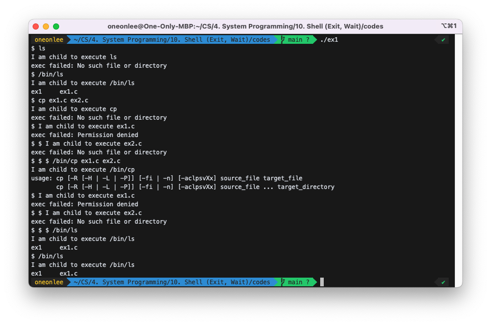
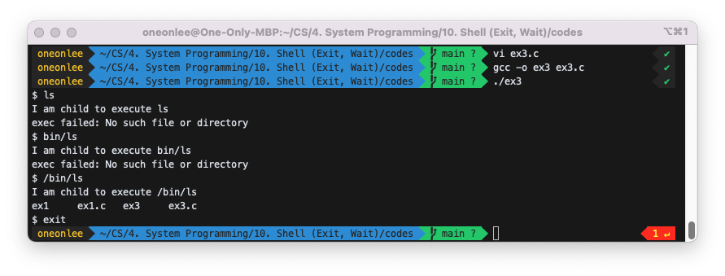
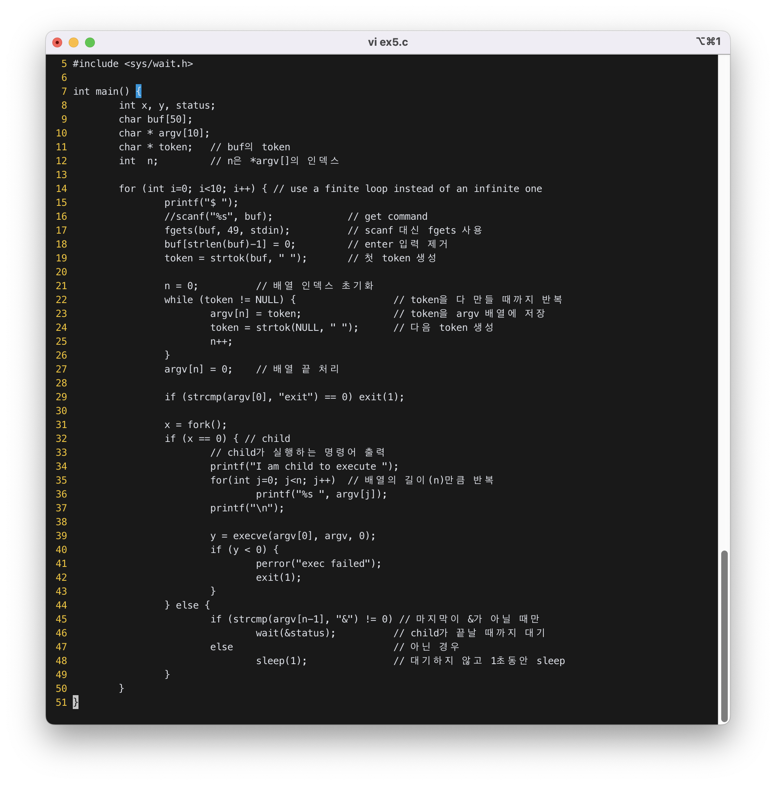
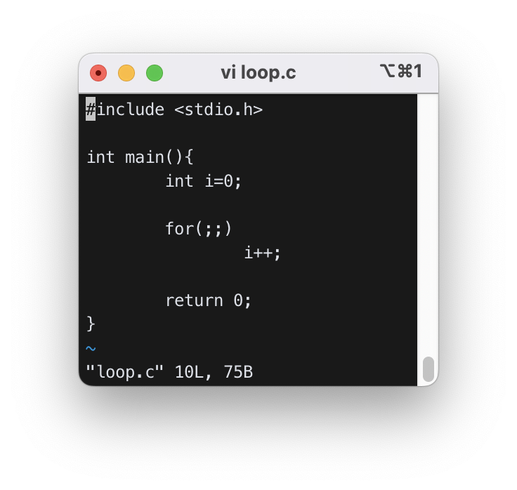
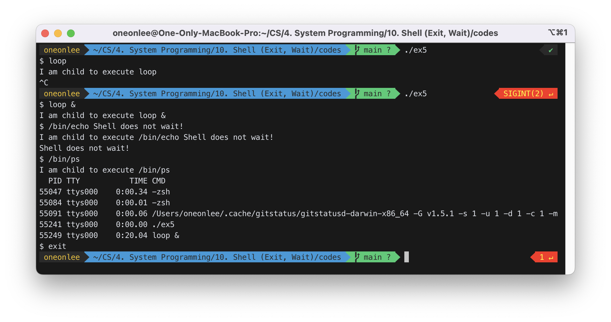
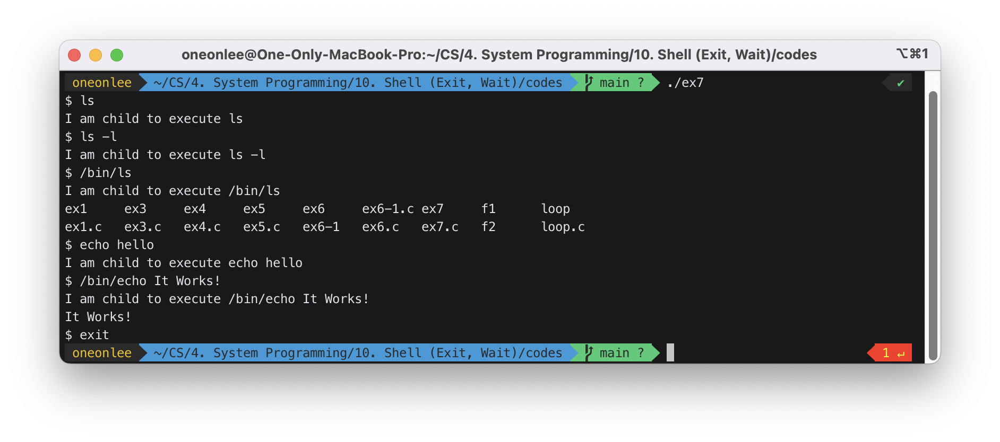

# Shell (Exit, Wait)

## 1. exit, wait

exit: A program calls `exit()` to exit. - remove the body - becomes a zombie until the parent calls `wait()`
wait: A program calls `wait()` and waits for the child to exit. - if the child already called `exit()` - remove its process descriptor - else - wait until the child exits

## 2. shell

algorithm:

```c
 for(;;){
          printf("$");
          scanf("%s", buf);
          x=fork();
          if (x==0) execve(buf,0,0);
          else wait();
        }
```

Actual code:

```c
#include <stdio.h>
#include <unistd.h>
#include <string.h>

int main(){
   int x,y,status, i;
   char buf[50];
   char * argv[10];

   for(i=0;i<10;i++){ // use a finite loop instead of an infinite one
      printf("$");
      scanf("%s", buf); // get command.
      argv[0]=buf;
      argv[1]=0;

      x=fork();
      if (x==0){ // child
          printf("I am child to execute %s\n", buf);
          y=execve(buf, argv, 0);
          if (y<0){
             perror("exec failed");
             exit(1);
          }
      } else wait(&status);
   }
}
```

## 3. process tree

```
kernel (pid=0)
fork: init (pid=1)
exec: /sbin/init (pid=1)
fork & exec: iscsid
rsyslogd
..........
/usr/sbin/sshd (pid=1262)
fork : sshd : linuxer (pid=5198)
fork : sshd: linuxer@pts/0 (pid=5201)
fork & exec: -bash (pid=5202)
fork & exec: vi cli.c (pid=6420)
```

## 4. debugging a program with fork

In `gdb`, use `set follow-fork-mode child` or `set follow-fork-mode parent` to debug child or parent process.

```bash
$ gdb ex1
(gdb) set follow-fork-mode child
```

## 5. Example

### 1) Try the shell example. What is the difference between your shell and the system shell?




- 명령어에 `/bin/ls`처럼 실행파일의 전체 경로를 써주어야 한다.
- `cp ex1.c ex2.c`처럼 인자가 주어지는 명령어는 실행시킬 수 없다.
- 명령어를 10개만 실행시킬 수 있다.

### 2) Find all ancestor processes of your shell.


`pstree`는 실행 중인 프로세스를 트리형태로 보여주는 유닉스 명령어이다. `-p`는 "show pids"로 PID를 함께 출력하는 옵션이다.

### 3) (Builtin Command) <br>Change the shell such that it exits when the user types "exit".

`scanf("%s", buf);`로 `buf`를 입력받은 뒤,

```c
if (strcmp(buf, "exit") == 0) exit(1);
```

를 추가하여, `exit`을 입력 받았을 경우 프로그램을 종료할 수 있게 하였다.



### 4) Change the shell such that it can handle a command with arguments. Use `gets()` or `fgets()` to read the command.


`fgets()`로 사용자의 입력을 공백을 포함하여 받아왔다. 그 후, `strtok`로 입력을 공백을 기준으로 분리해주고, 그것을 `argv[]` 배열에 저장하여 `execve` 함수에 넘겨주었다.


### 5) (Handling `&`) <br>Change the shell such that it can handle `&` at the end of the command.



사용자의 입력의 맨 마지막이 `&`인지에 따라 `wait` 여부를 결정하는 코드를, 45번 줄부터 49번 줄까지 수정해주었다.

실행여부를 검증하기 위해 아래와 같이 무한루프를 도는 "loop"라는 프로그램을 만들었다.



그 후 아래와 같이 실행했을 때, 정상작동하는 것을 확인할 수 있었다.


### 6) (Handling relative path) <br>Make your shell handle relative paths assuming the executable file always exists in "/bin" directory. When the user enters only the command name (e.g. `ls -l`, `cp f1 f2`, etc), build a full path such as "/bin/ls", "/bin/cp", etc. and perform exec. Use `sprintf()` to build the full path.


상대경로로 입력 받은 명령어의 경로를 절대경로로 바꿔주기 위해 우선, 7번 줄에 `PATH`를 "/bin/"로 정의해주었다.

그 후, `sprintf`를 이용해 상대경로로 되어있는 `argv[0]`를 절대경로로 변환해주었다. (41번 줄 ~ 43번 줄)


#### 6-1) Use `getenv("PATH")` to retrieve PATH environment variable and use `strtok()` to extract each system path. Display each system path line by line.

```c
int main(void) {
    char * path = getenv("PATH");
    printf("%s\n",  path);
    return 0;
}
```

위와 같이 코드를 구성하여 실행했을 때의 실행 결과는 아래와 같다.

```bash
/Users/oneonlee/opt/anaconda3/bin:/Users/oneonlee/opt/anaconda3/condabin:/usr/local/opt/bison/bin:/usr/local/bin:/Library/Frameworks/Python.framework/Versions/3.7/bin:/Library/Frameworks/Python.framework/Versions/3.9/bin:/usr/local/bin:/usr/bin:/bin:/usr/sbin:/sbin:/Library/Apple/usr/bin
```

경로들이 `:`를 기준으로 구분되어 있으므로 이를 `strtok()`를 사용하여 분리해주었다.


### 7) (Handling relative path) <br>Change the shell such that it can handle relative path for the command in general. The shell will search the PATH environment variable to compute the full path of the command when it is given as a relative path name. Use `getenv("PATH")` to obtain the pointer to the value of the PATH environment variable. Note you need to copy the string of the PATH variable into another char array before you start extracting each path component with `strtok()` since `strtok()` destroys the original string.


절대경로로 입력 받았을 경우(45번 줄)와 상대경로로 입력 받았을 경우(55번 줄)로 나누엉 각각의 상황에 맞게 대응하였다.

상대경로로 입력 받았을 경우에는 `getenv("PATH")`를 사용하여, `execve` 함수 실행이 성공할 때까지 `env`를 바꿔가며 while문을 실행한다.



---

### 8) `dup(x)` duplicates `fd[x]` in the first empty entry in the fd table. Run following program and explain the output. Assume f1 has "hello my boy"

```c
x=open("f1", O_RDONLY, 00777);
int y;
y=dup(x);
printf("x:%d y:%d\n", x, y);
char buf[50];
int k=read(x, buf, 5);
buf[k]=0;
printf("buf:%s\n", buf);
k=read(y, buf, 5);
buf[k]=0;
printf("buf:%s\n", buf);
```

### 9) (Standard output redirection) Explain the output of the following code.

```c
x=open("f2", O_WRONLY|O_CREAT|O_TRUNC,00777);
printf("x:%d\n", x);
int y;
close(1);
y=dup(x);
printf("x:%d y:%d\n", x, y);
write(1, "hi there", 8);
```

### 10) (Standard output redirection) Change the shell such that it can handle standard output redirection.

```bash
$ cat f1 > f3
```

will redirect the output of "cat f1" to file f3.
