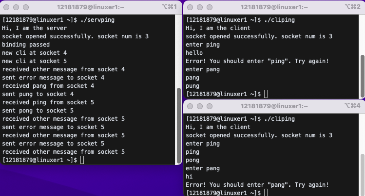
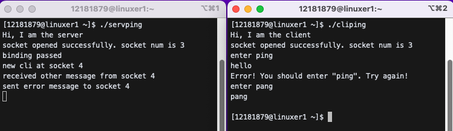
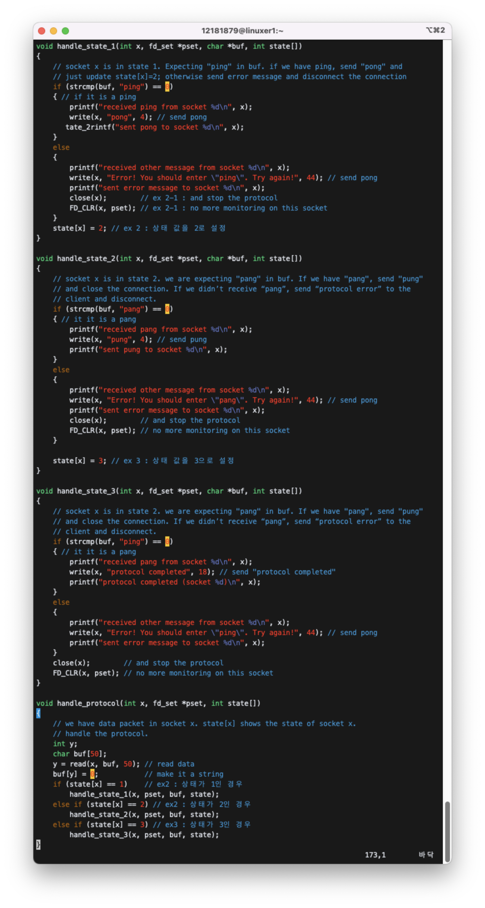
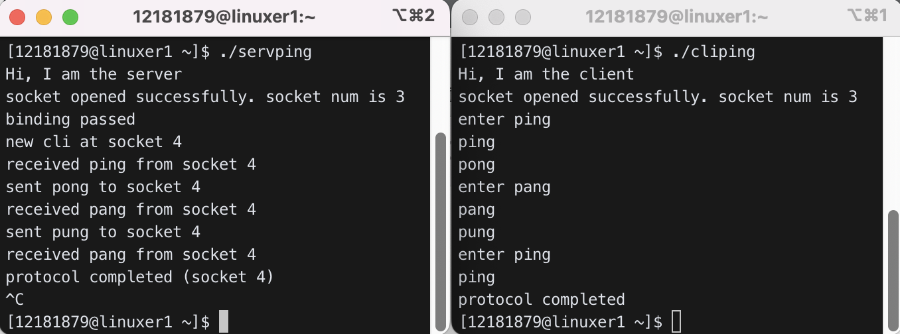
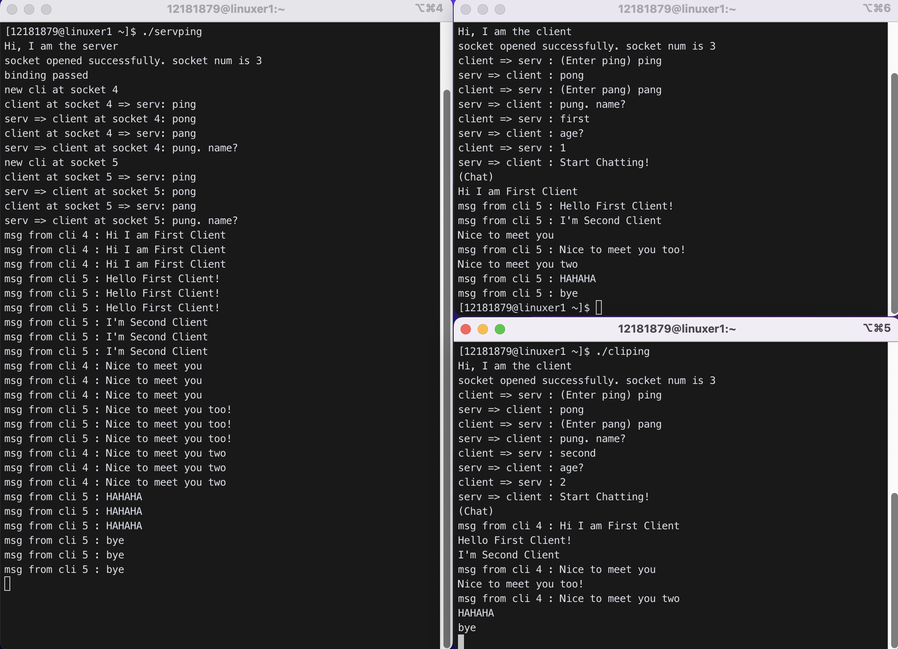
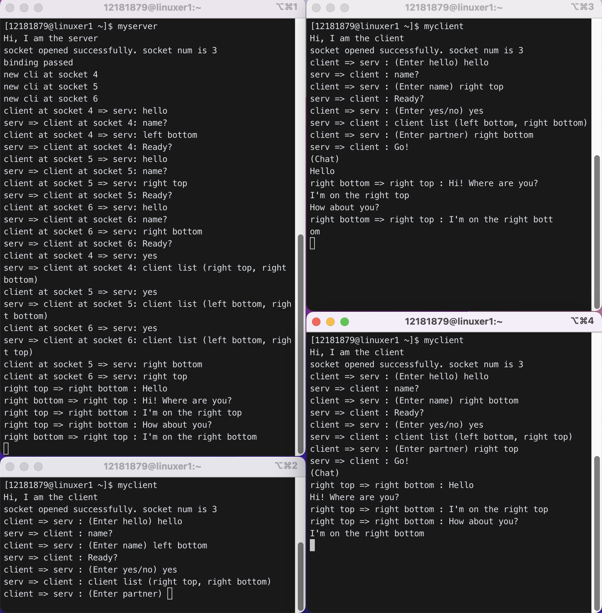

# `select`

## 1. Usage

A server program can handle multiple sockets using `select()`.

```c
select(maxfd, &rset, NULL, NULL, NULL);
```

## 2. bit vector handling

```c
fd_set  rset;   // rset is a bit vector of size 1024 bit
FD_ZERO(&rset); // initialize rset with 0
FD_SET(3, &rset); // set bit 3 of rset to 1
FD_CLR(3, &rset); // reset bit 3 of rset to 0
FD_ISSET(3, &rset); / return true if bit 3 of rset is 1
```

## 3. `select()` system call

```c
s2=accept(s1, ...);   // waiting on socket s1 only (for SYN packet)
read(s2, ...);         // waiting on socket s2 only (for data packet)
```

==>

```c
select(..., &rset, ......);  // waiting on all sockets marked in rset
for each socket "x" that has packet arrived(SYN, or data packet)
    if it is SYN packet
        s2 = accept(x, .....);    // handle SYN packet
    or if it is data packet
        read(x, .....);           // read the data and handle appropriately
        .........
```

- A server program can handle multiple clients either by forking children and letting each child handle each client or by using `select()`.
  - `select()` is better in the case when the clients need to talk to each other.
    - Chat servers use `select()` since the server has to relay messages between clients.
  - `fork()` is better when the clients do not need to talk to each other.
    - FTP or HTTP servers use `fork()` since the clients do not need to talk to each other.

```c
       FD_SET(3, &rset);
       FD_SET(5, &rset);
       FD_SET(21, &rset);
       select(maxfd, &rset, NULL, NULL, NULL);
```

The server will wait for client packets from either one or multiple of socket 3, 5, and 21 in `select()`. When packets from one or multiple of these sockets arrive, the select will return with active sockets (ones with packets arrived) marked 1 and non-active sockets (ones with no packet) reset to 0 in rset.

Therefore, after `select()`, we can check which sockets had packets.

To use `select()`:

```c
   set pset; // step 1
   for(;;){
     copy pset to rset;  // step 2
     Call select();       // step 3
     //The active sockets (those where a packet has arrived) will be marked as 1 in
     // rset; non-active sockets (where no packet has arrived) will be reset to 0.
     for(all marked sockets){ // step 4
        read the arrived data and handle them appropriately.
     }
   }
```

Without `select()`, it is hard to read from multiple sockets at the same time.

```c
        read(3, buf, n);       // reading packets from socket 3
        read(5, buf, n);       // reading from socket 5
        read(21, buf, n);      // reading from socket 21
```

We have to read each socket one by one, not at the same time.

## 4. Code example

```c
   fd_set  rset, pset;   // rset used in select(). pset remembers the sockets to monitor
   FD_ZERO(&rset);
   FD_ZERO(&pset);   // all bits are zerorized in the beginning

   // step 1. prepare pset
   FD_SET(3, &pset);
   FD_SET(5, &pset);
   FD_SET(21, &pset); // we want to monitor socket 3, 5, and 21
   for(;;){
        // step 2. copy pset to rset
        rset = pset;    // pset remembers target socket numbers.
        // setp 3. call select()
        select(maxfd, &rset, NULL, NULL, NULL);
        // step 4. now we check which sockets had packets
        for(x=0; x<maxfd; x++){ // check each socket
           if (FD_ISSET(x, &rset)){ // this socket has some packet
               ........handle this packet .........
           }
        }
   }
```

## 5. ping-pong-pang-pung Example

A server communicates with multiple clients. When connected, the client and the server exchange messages as follows:

```bash
cli=>serv: ping
serv=>cli : pong
cli=>serv: pang
serv=>cli: pung
```

### client:

```c
    s = socket(...);
    connect(s, server, ...);
    write(s, "ping", 4);
    read(s, buf, n);  // read "pong"
    write(s, "pang", 4);
    read(s, buf, n); // read "pung"
    close(s);
```

### server:

```c
    s1 = socket(...);  // to accept connection
    ......bind, listen, .......
    FD_SET(s1, &pset);  // step 1. we have to monitor connection request packet

    for(;;){
       rset = pset;                               // step 2
       select(maxfd, &rset, NULL, NULL, NULL); // step 3
       for(x=0; x<maxfd; x++){                 // step 4
          if (FD_ISSET(x, &rset)){ // found active socket
              if (x == s1){  // connection request on s1. new client has arrived.
                 s2 = accept(s1, .........); // create a new socket, s2, for this client
                 FD_SET(s2, &pset);   // and remember s2 in pset for future monitoring
              } else{ // must be a data packet from a client. follow the protocol.
                 handle_protocol(x, &pset);
               }
             }
         }
      }
................
```

```c
void handle_protocol(int x, fd_set * pset){
   ...........
   y=read(x, buf, n);  // read data from socket x
   buf[y]=0;         // make it a string
   if (strcmp(buf, "ping")==0)
      write(x, "pong", 4);
   else if (strcmp(buf, "pang")==0){
      write(x, "pung", 4);
      write(x, "protocol ended ok", 17);
      close(x);
      FD_CLR(x, &pset);  // don't monitor this socket anymore
   }
}
```

## 4. Example

### 1) Copy cliping.c and servping.c into your directory, modify IP and port number appropriately, and compile them. Run the server first and run client 3 times each in different window. Check if the server can handle multiple clients at the same time.

```c
$ cp ../../linuxer1/cliping.c  .
$ cp ../../linuxer1/servping.c  .
```


- 사진의 왼쪽은 server를 실행시킨 터미널이며, 오른쪽의 3개는 모두 각각 따로 client를 실행시킨 터미널이다.
- 먼저, server를 실행시켜주고, 첫번째 client만 활성화 해주었더니, socket 4 번으로 들어와 'ping-pong-pang-pung'이 잘 작동했다. 통신이 종료된 후에는 socket이 닫혔다.
- 그 후, 두번째 client와 세번째 client를 실행시켰다. 각각 4번과 5번 socket으로 들어온 것을 확인 할 수 있었고, 하나의 'ping-pong-pang-pung' 프로세스가 끝나지 않았을 때 서로 엇갈려서 pang을 입력해도 'ping-pong-pang-pung'이 잘 작동했다.
- 통신이 종료된 후에는 socket이 닫혔다. client는 종료되었으며, server는 종료되지 않아 `^C`로 빠져나왔다.

### 2) The server in Prob 1) cannot give error message to clients even when the client doesn't follow the protocol. Run server and run client and let the client send "pang" instead of "ping" as the first message. The server gives "pung" instead of error message as below.


client에서 첫번째 입력에 'ping'이 아니라 'pang'을 입력함으로써 프로토콜을 지키지 않았을 때, server가 오류를 반환하지 않고 'pong'을 반환하였다.

#### Modify servping.c so that it can send error message when the client sends something other than "ping" for the first message. But make sure the server still sends "pung" when the client sends "pang" as the second message.

`state` 배열을 선언해 각 소켓별 상태를 저장하였다.
그리고 소켓이 생성될 때, 상태를 1로 초기화해주었다.

```c
    ......
    int maxfd = 50;   // just monitor max 50 sockets
    int state[maxfd]; // ex2 : 각 소켓별 상태를 저장하는 배열 선언

    ......

    // step 1. monitor conn req packet
    FD_SET(s1, &pset);
    for (i = 0; i < 20; i++)
    {
        ......
        for (x = 0; x < maxfd; x++)
        {
            if (FD_ISSET(x, &rset))
            {
                if (x == s1)
                {
                    s2 = accept(s1, (struct sockaddr *)&cli_addr, &xx);
                    state[s2] = 1; // ex2 : 해당 소켓의 상태를 1로 초기화
                    ......
                }
                ......
            }
        }
    }
```

`state`의 상태에 따라 어떤 프로토콜을 실행시킬지를 구분하고, 각각의 상황을 함수로 구현하였다. (`handle_state_1()`, `handle_state_2()`) 그리고 `handle_protocol()` 함수를 수정해주었다.

```c
void handle_state_1(int x, fd_set *pset, char *buf, int state[])
{
    if (strcmp(buf, "ping") == 0)
    { // if it is a ping
        printf("received ping from socket %d\n", x);
        write(x, "pong", 4); // send pong
        printf("sent pong to socket %d\n", x);
    }
    else
    {
        printf("received other message from socket %d\n", x);
        write(x, "Error! You should enter \"ping\". Try again!", 44); // send pong
        printf("sent error message to socket %d\n", x);
    }
    state[x] = 2; // ex 2 : 상태 값을 2로 설정
}

void handle_state_2(int x, fd_set *pset, char *buf, int state[])
{

    if (strcmp(buf, "pang") == 0)
    { // it it is a pang
        printf("received pang from socket %d\n", x);
        write(x, "pung", 4); // send pung
        printf("sent pung to socket %d\n", x);
        close(x);        // and stop the protocol
        FD_CLR(x, pset); // no more monitoring on this socket
    }

    else
    {
        printf("received other message from socket %d\n", x);
        write(x, "Error! You should enter \"pang\". Try again!", 44); // send pong
        printf("sent error message to socket %d\n", x);
    }
}

void handle_protocol(int x, fd_set *pset, int state[])
{
    // we have a data packet in socket x. do protocol
    int y;
    char buf[50];
    y = read(x, buf, 50); // read data
    buf[y] = 0;           // make it a string
    if (state[x] == 1)    // ex2 : 상태가 1인 경우
        handle_state_1(x, pset, buf, state);
    else if (state[x] == 2) // ex2 : 상태가 2인 경우
        handle_state_2(x, pset, buf, state);
}
```

실행결과는 아래와 같다.



오른쪽의 두 client를 주목하자. 위쪽의 client에서 먼저 "ping" 대신 "hello"를 입력했을 때 error message를 돌려받았다. 그 후, 정상적으로 "pang"을 입력했을 때는 정상적으로 "pung"을 돌려받았다.

아래쪽의 client에서는 먼저 "ping"을 알맞게 입력했을 때, 정상적으로 "pong"을 돌려받았다. 그 후, "pang" 대신 "hi"를 입력했을 때 error message를 돌려받았다.

#### 2-1) Modify the server such that it disconnects the connection if the client doesn't follow the protocol. You need to keep track of the state of each client to do this. (The client will act strange when the server disconnects it. You don't have to change the client code for this since we don't care about what happens to the client when it does not follow the protocol.)

client가 protocol을 준수하지 않았을 경우 연결을 `close`하였다.

```c
       int state[50]; // state of each client (state of each client socket)
                     // 1: the server is waiting for "ping" from this client
                     // 2: the server is waiting for "pang" from this client
       ...........
       for(x=0;x<maxfd;x++){ // check all fd
          if (FD_ISSET(x, &rset)){ // if we have packet in socket x
             if (x==s1){ // if x is the connection accepting socket, we have a new client
                        // and we must have the connection request packet(SYN) at x
                 s2=accept(s1, ........); // now s2 is this client's socket
                 state[s2]=1;  // init the state of this client.
                               // the server is expecting "ping" from this client
                 .............
             }else{ // we must have the data packet at socket x
                 handle_protocol(x, &pset, state);
             }
       ................

void handle_protocol(int x, fd_set *pset, int state[])
{
    // we have data packet in socket x. state[x] shows the state of socket x.
    // handle the protocol.
    int y;
    char buf[50];
    y = read(x, buf, 50); // read the data
    buf[y] = 0;           // make it a string
    if (state[x] == 1)
    { // the state of this socket is 1 meaning we are
      // expecting "ping" from this socket
        handle_state_1(x, pset, buf, state);
    }
    else if (state[x] == 2)
    { // expecting "pang"
        handle_state_2(x, pset, buf, state);
    }
}
void handle_state_1(int x, fd_set *pset, char *buf, int state[])
{
    // socket x is in state 1. Expecting "ping" in buf. if we have ping, send "pong" and
    // just update state[x]=2; otherwise send error message and disconnect the connection
    if (strcmp(buf, "ping") == 0)
    {                        // yes we have "ping"
        write(x, "pong", 4); // send pong to this client
        state[x] = 2;        // now we are waiting for "pang" from this client
    }
    else
    {                                   // no we didn't receive "ping"
        write(x, "protocol error", 14); // send err message to the client
        close(x);                       // end the connection
        FD_CLR(x, pset);                // remove from the watch list.
                                        // we don't monitor socket x any more
    }
}
void handle_state_2(int x, fd_set *pset, char *buf, int state[])
{
    // socket x is in state 2. we are expecting "pang" in buf. If we have "pang", send "pung"
    // and close the connection. If we didn’t receive “pang”, send “protocol error” to the
    // client and disconnect.
    ....................
}
```



- 첫번째 입력으로 "hello"를 입력하여 에러 메세지를 수신받았다.
- 두번째 입력으로 정상적인 "pang"을 보냈으나, error 메세지 이후 소켓이 닫혀 아무 응답이 없는 것을 확인할 수 있다.

### 3) Modify the protocol such that the server expects a final “ping” again from the client. Make sure the server give error message and disconnect the client if the client doesn't follow the protocol.

```bash
    cli=>serv: ping
    serv=>cli: pong
    cli=>serv: pang
    serv=>cli: pung
    cli=>serv: ping (final ping)
    serv=>cli: protocol completed
```

Ex2처럼 `handle_state_3` 함수를 추가로 정의하여 3번째 상태를 다뤄주었다.

#### servping.c



#### cliping.c


#### result



### 4) Modify the protocol such that the server relays a message from a client to all other clients after the “ping-pong-pang-pung” sequence is completed. The clients should fork itself after the “ping-pong-pang-pung” sequence so that the parent part keeps reading while the child part keeps writing. The server does not fork since it doesn't do the chatting by itself; it just relays a message from one client to all other clients. The server checks `state[]` array to see which socket is ready to receive message.

```bash
cli at socket 3 => serv: ping
    serv => cli at socket 3 : pong
cli at socket 3 => serv: pang
    serv => cli at socket 3 : pung. Protocol completed. Start chatting.

cli at socket 4 => serv: ping
     serv => cli at socket 4 : pong
cli at socket 4 => serv: pang
     serv => cli at socket 4 : pung. Protocol completed. Start chatting.

cli at socket 5 => serv: ping
     serv => cli at socket 5 : pong
cli at socket 5 => serv: pang
     serv => cli at socket 5 : pung. Protocol completed. Start chatting.

cli at socket 3 => serv: hello
    serv => cli at socket 4, 5 : hello
cli at socket 4 => serv: hi
    serv => cli at socket 3, 5: hi
     .................
```


#### servping.c

```c
#include <stdio.h>
#include <sys/types.h>
#include <sys/socket.h>
#include <netinet/in.h>
#include <arpa/inet.h>
#include <string.h>
#include <stdlib.h>
#include <sys/time.h>
#include <unistd.h>
#include <sys/select.h>

#define SERV_TCP_PORT 8739
#define SERV_ADDR "165.246.38.151" //"192.168.50.122"

void handle_protocol(int x, fd_set *pset, int state[]);
void handle_state_1(int x, fd_set *pset, char *buf, int state[]);
void handle_state_2(int x, fd_set *pset, char *buf, int state[]);
void handle_state_3(int x, fd_set *pset, char *buf, int state[]);

int main()
{
    int s1, s2, i, x, y;
    struct sockaddr_in serv_addr, cli_addr;
    char buf[50];
    socklen_t xx;

    printf("Hi, I am the server\n");

    bzero((char *)&serv_addr, sizeof(serv_addr));
    serv_addr.sin_family = PF_INET;
    serv_addr.sin_addr.s_addr = inet_addr(SERV_ADDR);
    serv_addr.sin_port = htons(SERV_TCP_PORT);

    // open a tcp socket
    if ((s1 = socket(PF_INET, SOCK_STREAM, 0)) < 0)
    {
        printf("socket creation error\n");
        exit(1);
    }
    printf("socket opened successfully. socket num is %d\n", s1);

    // bind ip
    x = bind(s1, (struct sockaddr *)&serv_addr, sizeof(serv_addr));
    if (x < 0)
    {
        printf("binding failed\n");
        exit(1);
    }
    printf("binding passed\n");
    listen(s1, 5);
    xx = sizeof(cli_addr);

    // now start ping-pong-pang-pung
    // pset remembers all sockets to monitor
    // rset is the copy of pset passed to select
    int maxfd = 50;   // just monitor max 50 sockets
    int state[maxfd]; // ex2 : 각 소켓별 상태를 저장하는 배열 선언

    fd_set rset, pset;
    FD_ZERO(&rset); // init rset
    FD_ZERO(&pset); // init pset

    // step 1. monitor conn req packet
    FD_SET(s1, &pset);
    // and loop on select
    for (i = 0; i < 20; i++)
    {                                           // should be infinite loop in real life
        rset = pset;                            // step 2
        select(maxfd, &rset, NULL, NULL, NULL); // step 3
        // now we have some packets
        for (x = 0; x < maxfd; x++)
        { // check which socket has a packet
            if (FD_ISSET(x, &rset))
            { // socket x has a packet
                // s1 is a special socket for which we have to do "accept"
                // otherwise do ping-pong-pang-pung
                if (x == s1)
                { // new client has arrived
                    // create a socket for this client
                    s2 = accept(s1, (struct sockaddr *)&cli_addr, &xx);
                    state[s2] = 1; // ex2 : 해당 소켓의 상태를 1로 초기화
                    printf("new cli at socket %d\n", s2);
                    FD_SET(s2, &pset); // and include this socket in pset
                }
                else
                { // data packet. do ping-pong-pang-pung protocol
                    handle_protocol(x, &pset, state);
                }
            }
        }
    }
}

void handle_state_1(int x, fd_set *pset, char *buf, int state[])
{
    // socket x is in state 1. Expecting "ping" in buf. if we have ping, send "pong" and
    // just update state[x]=2; otherwise send error message and disconnect the connection

    if (strcmp(buf, "ping") == 0)
    { // if it is a ping
        printf("client at socket %d => serv: ping\n", x);
        write(x, "pong", 4); // send pong
        printf("serv => client at socket %d: pong\n", x);
    }
    else
    {
        printf("client at socket %d => serv: other message\n", x);
        write(x, "Error! You should enter \"ping\". Try again!", 44); // send pong
        printf("serv => client at socket %d: Error! You should enter \"ping\". Try again!\n", x);
        close(x);        // ex 2-1 : and stop the protocol
        FD_CLR(x, pset); // ex 2-1 : no more monitoring on this socket
    }
    state[x] = 2; // ex 2 : 상태 값을 2로 설정
}

void handle_state_2(int x, fd_set *pset, char *buf, int state[])
{
    // socket x is in state 2. we are expecting "pang" in buf. If we have "pang", send "pung"
    // and close the connection. If we didn’t receive “pang”, send “protocol error” to the
    // client and disconnect.
    if (strcmp(buf, "pang") == 0)
    { // it it is a pang
        printf("client at socket %d => serv: pang\n", x);
        write(x, "pung. Process completed. Start chatting.", 40); // send pung
        printf("serv => client at socket %d: pung. Process completed. Start chatting.\n", x);
    }

    else
    {
        printf("client at socket %d => serv: %s\n", x, buf);
        write(x, "Error! You should enter \"pang\". Try again!", 44); // send pong
        printf("serv => client at socket %d: Error! You should enter \"pang\". Try again!\n", x);
        close(x);        // and stop the protocol
        FD_CLR(x, pset); // no more monitoring on this socket
    }

    state[x] = 3; // ex 3 : 상태 값을 3으로 설정
}

void handle_state_3(int x, fd_set *pset, char *buf, int state[]) // 채팅 송수신이 가능한 상태
{
    int i;
    char msg[100];
    sprintf(msg, "msg from cli %d : %s\n", x, buf); // 메세지에 송신자 기재 (소켓번호 이용)
    for (i = 0; i < 50; i++)                        // 최대 50개 소켓까지 monitor
    {
        if (state[i] >= 3 && i != x) // 소켓의 상태가 3이상이면서 자신이 아닐 때
        {
            // write(i, buf, strlen(buf)); // 메세지 전송
            // printf("serv => client at socket %d : %s\n", i, buf);
            write(i, msg, strlen(msg)); // 메세지 전송
        }
    }

    state[x]++;
}

void handle_protocol(int x, fd_set *pset, int state[])
{
    // we have data packet in socket x. state[x] shows the state of socket x.
    // handle the protocol.
    int y;
    char buf[50];
    y = read(x, buf, 50); // read data
    buf[y] = 0;           // make it a string
    if (state[x] == 1)    // ex2 : 상태가 1인 경우
        handle_state_1(x, pset, buf, state);
    else if (state[x] == 2) // ex2 : 상태가 2인 경우
        handle_state_2(x, pset, buf, state);
    else if (state[x] >= 3 && state[x] <= 7) // ex4 : 채팅 송수신이 가능한 상태 (sequence 완료)
        handle_state_3(x, pset, buf, state);
    else if (state[x] == 8) // ex4 : 한 클라이언트가 채팅을 5번 이상 입력했다면,
    {
        close(x);        // 소켓을 닫고
        FD_CLR(x, pset); // pset에서 해당 소켓 clear
    }
}
```

#### cliping.c

```c
#include <stdio.h>
#include <sys/types.h>
#include <sys/socket.h>
#include <netinet/in.h>
#include <arpa/inet.h>
#include <string.h>
#include <stdlib.h>
#include <sys/time.h>
#include <unistd.h>
#include <sys/select.h>

#define BUFFER_SIZE 50
#define SERV_TCP_PORT 8739
#define SERV_ADDR "165.246.38.151" //"192.168.50.122"

int main()
{
    int x, y, i;
    struct sockaddr_in serv_addr;
    char buf[BUFFER_SIZE];
    printf("Hi, I am the client\n");

    bzero((char *)&serv_addr, sizeof(serv_addr));
    serv_addr.sin_family = PF_INET;
    serv_addr.sin_addr.s_addr = inet_addr(SERV_ADDR);
    serv_addr.sin_port = htons(SERV_TCP_PORT);

    // open a tcp socket
    if ((x = socket(PF_INET, SOCK_STREAM, 0)) < 0)
    {
        printf("socket creation error\n");
        exit(1);
    }
    printf("socket opened successfully. socket num is %d\n", x);

    // connect to the server
    if (connect(x, (struct sockaddr *)&serv_addr, sizeof(serv_addr)) < 0)
    {
        printf("can't connect to the server\n");
        exit(1);
    }
    // now start ping-pong-pang-pung protocol
    printf("client => serv : (Enter ping) ");
    fgets(buf, BUFFER_SIZE - 1, stdin);
    write(x, buf, strlen(buf) - 1); // send "ping"

    y = read(x, buf, 50); // read "pong"
    buf[y] = '\0';
    printf("serv => client : %s\n", buf);

    if (strcmp(buf, "pong") != 0)
    {
        fprintf(stderr, "Error occurred by the protocol.\n");
        close(x);
        exit(EXIT_FAILURE);
    }

    printf("client => serv : (Enter pang) ");
    fgets(buf, BUFFER_SIZE - 1, stdin);
    write(x, buf, strlen(buf) - 1); // send "pang"

    y = read(x, buf, BUFFER_SIZE - 1); // read "pung"
    buf[y] = '\0';
    printf("serv => client : %s\n", buf);

    if (strcmp(buf, "pung. Process completed. Start chatting.") != 0)
    {
        fprintf(stderr, "Error occurred by the protocol.\n");
        close(x);
        exit(EXIT_FAILURE);
    }

    int ch = fork();
    if (ch == 0)
    {
        printf("(Chat)\n");

        for (i = 0; i < 5; i++)
        {
            // printf("client => serv : (Chat) ");
            fgets(buf, BUFFER_SIZE - 1, stdin);
            write(x, buf, strlen(buf) - 1);
            // write(x, buf, BUFFER_SIZE - 1);
        }
        close(x);
        exit(0);
    }
    else
    {
        for (i = 0; i < 5; i++)
        {
            y = read(x, buf, BUFFER_SIZE - 1);
            if (y > 0)
            {
                buf[y] = '\0';
                printf("%s", buf);

                // printf("server => client: %s\n", buf);
            }
        }
    }

    close(x); // disconect the communication
}
```

### 5) Modify your code in Problem 4) such that the server attaches the client’s name and age in the message. For this purpose, the server should ask name and age for each client and store them in `cli[]` array which is an array of client{} structure to store name and age of each client. `cli[x]` will remember the client information whose socket number is `x`.

```c
     struct client{
        char name[20];  // this client's name
        char age[5];      // this client's age as a string
     };
     ......
     struct client cli[50];  // max 50 clients
```

```bash
cli  aaa=> serv: ping
serv => cli aaa: pong
cli  aaa=> serv: pang
serv => cli aaa: pung. name?
cli  aaa=> serv: aaa
serv => cli aaa: age?
cli aaa => serv: 19

cli  bbb=> serv: ping
serv => cli bbb: pong
cli  bbb=> serv: pang
serv => cli bbb: pung. name?
cli  bbb=> serv: bbb
serv => cli aaa: age?
cli aaa => serv: 22

cli  ccc=> serv: ping
serv => cli ccc: pong
cli  ccc=> serv: pang
serv => cli ccc: pung. name?
cli  ccc=> serv: ccc
serv => cli aaa: age?
cli aaa => serv: 21

serv => cli aaa: start chatting
serv => cli bbb: start chatting
serv => cli bbb: start chatting
cli aaa => serv: "hello there"
serv=> cli bbb: "aaa 19 to bbb 22: hello there"
serv=> cli ccc: "aaa 19 to ccc 21: hello there"
cli bbb=> serv: "hi"
serv => cli aaa: "bbb 22 to aaa 19: hi"
serv => cli ccc: "bbb 22 to ccc 21: hi"
```



#### servping.c

```c
#include <stdio.h>
#include <sys/types.h>
#include <sys/socket.h>
#include <netinet/in.h>
#include <arpa/inet.h>
#include <string.h>
#include <stdlib.h>
#include <sys/time.h>
#include <unistd.h>
#include <sys/select.h>

#define SERV_TCP_PORT 8739
#define SERV_ADDR "165.246.38.151" //"192.168.50.122"

struct client // ex 5 : 구조체 선언
{
    char name[20]; // ex 5 : 클라이언트 이름
    char age[5];   // ex 5 : 클라이언트 나이
};

void handle_protocol(int x, fd_set *pset, int state[], struct client cli[]);
void handle_state_1(int x, fd_set *pset, char *buf, int state[]);
void handle_state_2(int x, fd_set *pset, char *buf, int state[]);
void handle_state_3(int x, fd_set *pset, char *buf, int state[], struct client cli[]);
void handle_state_4(int x, fd_set *pset, char *buf, int state[], struct client cli[]);
void handle_state_5(int x, fd_set *pset, char *buf, int state[], struct client cli[]);

int main()
{

    int s1, s2, i, x, y;
    struct sockaddr_in serv_addr, cli_addr;
    char buf[50];
    socklen_t xx;

    printf("Hi, I am the server\n");

    bzero((char *)&serv_addr, sizeof(serv_addr));
    serv_addr.sin_family = PF_INET;
    serv_addr.sin_addr.s_addr = inet_addr(SERV_ADDR);
    serv_addr.sin_port = htons(SERV_TCP_PORT);

    // open a tcp socket
    if ((s1 = socket(PF_INET, SOCK_STREAM, 0)) < 0)
    {
        printf("socket creation error\n");
        exit(1);
    }
    printf("socket opened successfully. socket num is %d\n", s1);

    // bind ip
    x = bind(s1, (struct sockaddr *)&serv_addr, sizeof(serv_addr));
    if (x < 0)
    {
        printf("binding failed\n");
        exit(1);
    }
    printf("binding passed\n");
    listen(s1, 5);
    xx = sizeof(cli_addr);

    // now start ping-pong-pang-pung
    // pset remembers all sockets to monitor
    // rset is the copy of pset passed to select
    int maxfd = 50;        // just monitor max 50 sockets
    int state[maxfd];      // ex2 : 각 소켓별 상태를 저장하는 배열 선언
    struct client cli[50]; // ex5 : 구조체 생성

    fd_set rset, pset;
    FD_ZERO(&rset); // init rset
    FD_ZERO(&pset); // init pset

    // step 1. monitor conn req packet
    FD_SET(s1, &pset);
    // and loop on select
    for (i = 0; i < 20; i++)
    {                                           // should be infinite loop in real life
        rset = pset;                            // step 2
        select(maxfd, &rset, NULL, NULL, NULL); // step 3
        // now we have some packets
        for (x = 0; x < maxfd; x++)
        { // check which socket has a packet
            if (FD_ISSET(x, &rset))
            { // socket x has a packet
                // s1 is a special socket for which we have to do "accept"
                // otherwise do ping-pong-pang-pung
                if (x == s1)
                { // new client has arrived
                    // create a socket for this client
                    s2 = accept(s1, (struct sockaddr *)&cli_addr, &xx);
                    state[s2] = 1; // ex2 : 해당 소켓의 상태를 1로 초기화
                    printf("new cli at socket %d\n", s2);
                    FD_SET(s2, &pset); // and include this socket in pset
                }
                else
                { // data packet. do ping-pong-pang-pung protocol
                    handle_protocol(x, &pset, state, cli);
                }
            }
        }
    }
}

void handle_state_1(int x, fd_set *pset, char *buf, int state[])
{
    // socket x is in state 1. Expecting "ping" in buf. if we have ping, send "pong" and
    // just update state[x]=2; otherwise send error message and disconnect the connection

    if (strcmp(buf, "ping") == 0)
    { // if it is a ping
        printf("client at socket %d => serv: ping\n", x);
        write(x, "pong", 4); // send pong
        printf("serv => client at socket %d: pong\n", x);
    }
    else
    {
        printf("client at socket %d => serv: other message\n", x);
        write(x, "Error! You should enter \"ping\". Try again!", 44); // send pong
        printf("serv => client at socket %d: Error! You should enter \"ping\". Try again!\n", x);
        close(x);        // ex 2-1 : and stop the protocol
        FD_CLR(x, pset); // ex 2-1 : no more monitoring on this socket
    }
    state[x] = 2; // ex 2 : 상태 값을 2로 설정
}

void handle_state_2(int x, fd_set *pset, char *buf, int state[])
{
    // socket x is in state 2. we are expecting "pang" in buf. If we have "pang", send "pung"
    // and close the connection. If we didn’t receive “pang”, send “protocol error” to the
    // client and disconnect.
    if (strcmp(buf, "pang") == 0)
    { // it it is a pang
        printf("client at socket %d => serv: pang\n", x);
        write(x, "pung. name?", 11); // send pung
        printf("serv => client at socket %d: pung. name?\n", x);
    }

    else
    {
        printf("client at socket %d => serv: %s\n", x, buf);
        write(x, "Error! You should enter \"pang\". Try again!", 44); // send pong
        printf("serv => client at socket %d: Error! You should enter \"pang\". Try again!\n", x);
        close(x);        // and stop the protocol
        FD_CLR(x, pset); // no more monitoring on this socket
    }

    state[x] = 3; // ex 3 : 상태 값을 3으로 설정
}

void handle_state_3(int x, fd_set *pset, char *buf, int state[], struct client cli[])
{
    strcpy(cli[x].name, buf); // ex5 : buf(이름)를 해당 소켓의 이름 항목으로 복사
    write(x, "age?", 4);      // ex5 : age 요청 메시지 전송
    state[x] = 4;             // ex5 : 상태 값을 4으로 설정
}

void handle_state_4(int x, fd_set *pset, char *buf, int state[], struct client cli[])
{
    strcpy(cli[x].age, buf);         // ex5 : buf(나이)를 해당 소켓의 나이 항목으로 복사
    write(x, "Start Chatting!", 15); // ex5 : chatting 시작 메시지 전송
    state[x] = 5;                    // ex5 : 상태 값을 5으로 설정
}

void handle_state_5(int x, fd_set *pset, char *buf, int state[], struct client cli[]) // 채팅 송수신이 가능한 상태
{
    int i;
    char msg[100];
    sprintf(msg, "msg from cli %d : %s\n", x, buf); // 메세지에 송신자 기재 (소켓번호 이용)
    for (i = 0; i < 50; i++)                        // 최대 50개 소켓까지 monitor
    {
        if (state[i] >= 3 && i != x) // 소켓의 상태가 3이상이면서 자신이 아닐 때
        {
            write(i, msg, strlen(msg)); // 메세지 전송
        }
    }

    state[x]++; // 상태 + 1
}

void handle_protocol(int x, fd_set *pset, int state[], struct client cli[])
{
    // we have data packet in socket x. state[x] shows the state of socket x.
    // handle the protocol.
    int y;
    char buf[50];
    y = read(x, buf, 50);                         // read data
    buf[y] = 0;                                   // make it a string
    if (state[x] == 1)                            // ex2 : 상태가 1인 경우
        handle_state_1(x, pset, buf, state);      // ping 도착, pong 전송 상태
    else if (state[x] == 2)                       // ex2 : 상태가 2인 경우
        handle_state_2(x, pset, buf, state);      // pang 도착, pung 전송 상태
    else if (state[x] == 3)                       // ex5 : 상태가 3인 경우
        handle_state_3(x, pset, buf, state, cli); // ex5 : name 도착, age 요청 상태
    else if (state[x] == 4)                       // ex5 : 상태가 3인 경우
        handle_state_4(x, pset, buf, state, cli); // ex5 : name 도착, age 요청 상태
    else if (state[x] >= 5 && state[x] <= 9)      // ex4 : 채팅 송수신이 가능한 상태 (sequence 완료)
        handle_state_5(x, pset, buf, state, cli);
    else if (state[x] == 10) // ex4 : 한 클라이언트가 채팅을 5번 이상 입력했다면,
    {
        close(x);        // 소켓을 닫고
        FD_CLR(x, pset); // pset에서 해당 소켓 clear
    }
}
```

#### cliping.c

```c
#include <stdio.h>
#include <sys/types.h>
#include <sys/socket.h>
#include <netinet/in.h>
#include <arpa/inet.h>
#include <string.h>
#include <stdlib.h>
#include <sys/time.h>
#include <unistd.h>
#include <sys/select.h>

#define BUFFER_SIZE 50
#define SERV_TCP_PORT 8739
#define SERV_ADDR "165.246.38.151" //"192.168.50.122"

int main()
{
    int x, y, i;
    struct sockaddr_in serv_addr;
    char buf[BUFFER_SIZE];
    printf("Hi, I am the client\n");

    bzero((char *)&serv_addr, sizeof(serv_addr));
    serv_addr.sin_family = PF_INET;
    serv_addr.sin_addr.s_addr = inet_addr(SERV_ADDR);
    serv_addr.sin_port = htons(SERV_TCP_PORT);

    // open a tcp socket
    if ((x = socket(PF_INET, SOCK_STREAM, 0)) < 0)
    {
        printf("socket creation error\n");
        exit(1);
    }
    printf("socket opened successfully. socket num is %d\n", x);

    // connect to the server
    if (connect(x, (struct sockaddr *)&serv_addr, sizeof(serv_addr)) < 0)
    {
        printf("can't connect to the server\n");
        exit(1);
    }
    // now start ping-pong-pang-pung protocol
    printf("client => serv : (Enter ping) ");
    fgets(buf, BUFFER_SIZE - 1, stdin);
    write(x, buf, strlen(buf) - 1); // send "ping"

    y = read(x, buf, 50); // read "pong"
    buf[y] = '\0';
    printf("serv => client : %s\n", buf);

    if (strcmp(buf, "pong") != 0)
    {
        fprintf(stderr, "Error occurred by the protocol.\n");
        close(x);
        exit(EXIT_FAILURE);
    }

    printf("client => serv : (Enter pang) ");
    fgets(buf, BUFFER_SIZE - 1, stdin);
    write(x, buf, strlen(buf) - 1); // send "pang"

    y = read(x, buf, BUFFER_SIZE - 1); // read "pung. name?"
    buf[y] = '\0';
    printf("serv => client : %s\n", buf); // ex5 : print server message
    if (strcmp(buf, "pung. name?") != 0)
    {
        fprintf(stderr, "Error occurred by the protocol.\n");
        close(x);
        exit(EXIT_FAILURE);
    }
    printf("client => serv : ");
    fgets(buf, BUFFER_SIZE - 1, stdin); // ex5 : enter name
    write(x, buf, strlen(buf) - 1);     // ex5 : send name

    y = read(x, buf, BUFFER_SIZE - 1); // ex5 : read "age?"
    buf[y] = '\0';
    printf("serv => client : %s\n", buf); // ex5 : print server message ("age?")
    printf("client => serv : ");
    fgets(buf, BUFFER_SIZE - 1, stdin); // ex5 : enter age
    write(x, buf, strlen(buf) - 1);     // ex5 : send age

    y = read(x, buf, BUFFER_SIZE - 1); // ex5 : read "Start chatting"
    buf[y] = '\0';
    printf("serv => client : %s\n", buf); // ex5 : print server message ("Start chatting")

    int ch = fork(); // ex4 : 프로세스 복제
    // ex4 : child는 송신 담당, parents는 수신 담당
    if (ch == 0)
    {
        printf("(Chat)\n");

        for (i = 0; i < 5; i++)
        {
            fgets(buf, BUFFER_SIZE - 1, stdin);
            write(x, buf, strlen(buf) - 1);
        }
        close(x);
        exit(0);
    }
    else
    {
        for (i = 0; i < 5; i++)
        {
            y = read(x, buf, BUFFER_SIZE - 1);
            if (y > 0)
            {
                buf[y] = '\0';
                printf("%s", buf);
            }
        }
    }

    close(x); // disconect the communication
}
```

### 6) Modify your code in Problem 5) such that the client can now specify which client it wants to chat with. Add "partner" to `client{}` strucure to remember the socket number of the chatting partner. The server should ask which partner the clients wants to talk with and remember the partner's socket number in the `client{}` structure. Assume if 'cli A' points to 'cli B' as a partner, 'cli B' also points to 'cli A' as a partner.

```c
     struct client{
        char name[20];  // this client's name
        char age[5];      // this client's age as a string
        int partner;     // the socket number of the chatting partner of this client
     };
```

```bash
cli  aaa=> serv: ping
serv => cli aaa: pong
cli  aaa=> serv: pang
serv => cli aaa: name?
cli  aaa=> serv: aaa

cli  bbb=> serv: ping
serv => cli bbb: pong
cli  bbb=> serv: pang
serv => cli bbb: name?
cli  bbb=> serv: bbb

cli  ccc=> serv: ping
serv => cli ccc: pong
cli  ccc=> serv: pang
serv => cli ccc: name?
cli  ccc=> serv: ccc

cli  ddd=> serv: ping
serv => cli ddd: pong
cli  ddd=> serv: pang
serv => cli ddd: name?
cli  ddd=> serv: ddd

serv=>cli aaa: chat partner?
cli aaa=>serv: bbb
serv=>cli bbb: chat partner?
cli bbb=>serv: aaa

serv=>cli ccc: chat partner?
cli ccc=>serv: ddd
serv=>cli ddd: chat partner?
cli ddd=>serv: ccc

serv => cli aaa: start chatting
serv => cli bbb: start chatting
serv => cli ccc: start chatting
serv => cli ddd: start chatting

cli aaa => serv: hello there
serv=> cli bbb: aaa to bbb: hello there
cli bbb=> serv: hi
serv => cli aaa: bbb to aaa: hi

cli ccc => serv: hear me
serv=> cli ddd: ccc to ddd: hear me
cli ddd=> serv: hi there
serv => cli ccc: ddd to ccc: hi there
```


위 사진에서 왼쪽 터미널은 server이고, 오른쪽의 3개의 터미널은 client를 담당하였다. 편의를 위해, 오른쪽의 client들을 위에서부터 각각 first, second, third라고 하자.

second와 third는 서로를 chatting partner로 지정하였다. chatting partner로 매칭된 second와 third는 대화가 가능하였지만, chatting partner를 매칭하지 못함 first에게는 메세지가 오지 않았다.

#### servping.c

```c
#include <stdio.h>
#include <sys/types.h>
#include <sys/socket.h>
#include <netinet/in.h>
#include <arpa/inet.h>
#include <string.h>
#include <stdlib.h>
#include <sys/time.h>
#include <unistd.h>
#include <sys/select.h>

#define SERV_TCP_PORT 8739
#define SERV_ADDR "165.246.38.151" //"192.168.50.122"

struct client // ex 5 : 구조체 선언
{
    char name[20]; // ex 5 : 클라이언트 이름
    char age[5];   // ex 5 : 클라이언트 나이
    int partner;   // ex 6 : the socket number of the chatting partner of this client
};

void handle_protocol(int x, fd_set *pset, int state[], struct client cli[]);
void handle_state_1(int x, fd_set *pset, char *buf, int state[]);
void handle_state_2(int x, fd_set *pset, char *buf, int state[]);
void handle_state_3(int x, fd_set *pset, char *buf, int state[], struct client cli[]);
void handle_state_4(int x, fd_set *pset, char *buf, int state[], struct client cli[]);
void handle_state_5(int x, fd_set *pset, char *buf, int state[], struct client cli[]);

int main()
{

    int s1, s2, i, x, y;
    struct sockaddr_in serv_addr, cli_addr;
    char buf[50];
    socklen_t xx;

    printf("Hi, I am the server\n");

    bzero((char *)&serv_addr, sizeof(serv_addr));
    serv_addr.sin_family = PF_INET;
    serv_addr.sin_addr.s_addr = inet_addr(SERV_ADDR);
    serv_addr.sin_port = htons(SERV_TCP_PORT);

    // open a tcp socket
    if ((s1 = socket(PF_INET, SOCK_STREAM, 0)) < 0)
    {
        printf("socket creation error\n");
        exit(1);
    }
    printf("socket opened successfully. socket num is %d\n", s1);

    // bind ip
    x = bind(s1, (struct sockaddr *)&serv_addr, sizeof(serv_addr));
    if (x < 0)
    {
        printf("binding failed\n");
        exit(1);
    }
    printf("binding passed\n");
    listen(s1, 5);
    xx = sizeof(cli_addr);

    // now start ping-pong-pang-pung
    // pset remembers all sockets to monitor
    // rset is the copy of pset passed to select
    int maxfd = 50;        // just monitor max 50 sockets
    int state[maxfd];      // ex2 : 각 소켓별 상태를 저장하는 배열 선언
    struct client cli[50]; // ex5 : 구조체 생성

    fd_set rset, pset;
    FD_ZERO(&rset); // init rset
    FD_ZERO(&pset); // init pset

    // step 1. monitor conn req packet
    FD_SET(s1, &pset);
    // and loop on select
    for (i = 0; i < 40; i++)                    // ex6 : select 루프 횟수를 20에서 40으로 변경
    {                                           // should be infinite loop in real life
        rset = pset;                            // step 2
        select(maxfd, &rset, NULL, NULL, NULL); // step 3
        // now we have some packets
        for (x = 0; x < maxfd; x++)
        { // check which socket has a packet
            if (FD_ISSET(x, &rset))
            { // socket x has a packet
                // s1 is a special socket for which we have to do "accept"
                // otherwise do ping-pong-pang-pung
                if (x == s1)
                { // new client has arrived
                    // create a socket for this client
                    s2 = accept(s1, (struct sockaddr *)&cli_addr, &xx);
                    state[s2] = 1; // ex2 : 해당 소켓의 상태를 1로 초기화
                    printf("new cli at socket %d\n", s2);
                    FD_SET(s2, &pset); // and include this socket in pset
                }
                else
                { // data packet. do ping-pong-pang-pung protocol
                    handle_protocol(x, &pset, state, cli);
                }
            }
        }
    }
}

void handle_state_1(int x, fd_set *pset, char *buf, int state[])
{
    // socket x is in state 1. Expecting "ping" in buf. if we have ping, send "pong" and
    // just update state[x]=2; otherwise send error message and disconnect the connection

    if (strcmp(buf, "ping") == 0)
    { // if it is a ping
        printf("client at socket %d => serv: ping\n", x);
        write(x, "pong", 4); // send pong
        printf("serv => client at socket %d: pong\n", x);
    }
    else
    {
        printf("client at socket %d => serv: other message\n", x);
        write(x, "Error! You should enter \"ping\". Try again!", 44); // send pong
        printf("serv => client at socket %d: Error! You should enter \"ping\". Try again!\n", x);
        close(x);        // ex 2-1 : and stop the protocol
        FD_CLR(x, pset); // ex 2-1 : no more monitoring on this socket
    }
    state[x] = 2; // ex 2 : 상태 값을 2로 설정
}

void handle_state_2(int x, fd_set *pset, char *buf, int state[])
{
    // socket x is in state 2. we are expecting "pang" in buf. If we have "pang", send "pung"
    // and close the connection. If we didn’t receive “pang”, send “protocol error” to the
    // client and disconnect.
    if (strcmp(buf, "pang") == 0)
    { // it it is a pang
        printf("client at socket %d => serv: pang\n", x);
        write(x, "pung. name?", 11); // send pung
        printf("serv => client at socket %d: pung. name?\n", x);
    }

    else
    {
        printf("client at socket %d => serv: %s\n", x, buf);
        write(x, "Error! You should enter \"pang\". Try again!", 44); // send pong
        printf("serv => client at socket %d: Error! You should enter \"pang\". Try again!\n", x);
        close(x);        // and stop the protocol
        FD_CLR(x, pset); // no more monitoring on this socket
    }

    state[x] = 3; // ex 3 : 상태 값을 3으로 설정
}

void handle_state_3(int x, fd_set *pset, char *buf, int state[], struct client cli[])
{
    strcpy(cli[x].name, buf);      // ex5 : buf(이름)를 해당 소켓의 이름 항목으로 복사
    write(x, "Chat partner?", 13); // ex6 : chat partner 요청 메시지 전송
    state[x] = 4;                  // ex5 : 상태 값을 4으로 설정
}

void handle_state_4(int x, fd_set *pset, char *buf, int state[], struct client cli[])
{
    int i;
    for (i = 0; i < 50; i++)
    {
        if (strcmp(cli[i].name, buf) == 0) // ex6 : 입력받은 chat partner(buf)와 동일한 client name이 있으면,
            cli[x].partner = i;            // ex6 : 해당 소켓 번호를 partner 변수에 저장
    }
    write(x, "Start Chatting!", 15); // ex5 : chatting 시작 메시지 전송
    state[x] = 5;                    // ex5 : 상태 값을 5으로 설정
}

void handle_state_5(int x, fd_set *pset, char *buf, int state[], struct client cli[]) // 채팅 송수신이 가능한 상태
{
    int i;
    char msg[100];
    sprintf(msg, "msg from cli %d : %s\n", x, buf); // ex6 : 메세지에 송신자(현재 cli)와 수신자(partner) 기재 (소켓번호 이용)
    write(cli[x].partner, msg, strlen(msg));        // ex6 : partner에게 메세지 전송

    state[x]++; // 상태 + 1
}

void handle_protocol(int x, fd_set *pset, int state[], struct client cli[])
{
    // we have data packet in socket x. state[x] shows the state of socket x.
    // handle the protocol.
    int y;
    char buf[50];
    y = read(x, buf, 50);                         // read data
    buf[y] = 0;                                   // make it a string
    if (state[x] == 1)                            // ex2 : 상태가 1인 경우
        handle_state_1(x, pset, buf, state);      // ping 도착, pong 전송 상태
    else if (state[x] == 2)                       // ex2 : 상태가 2인 경우
        handle_state_2(x, pset, buf, state);      // pang 도착, pung 전송 상태
    else if (state[x] == 3)                       // ex5 : 상태가 3인 경우
        handle_state_3(x, pset, buf, state, cli); // ex5 : name 도착, age 요청 상태
    else if (state[x] == 4)                       // ex5 : 상태가 3인 경우
        handle_state_4(x, pset, buf, state, cli); // ex5 : name 도착, age 요청 상태
    else if (state[x] >= 5 && state[x] <= 9)      // ex4 : 채팅 송수신이 가능한 상태 (sequence 완료)
        handle_state_5(x, pset, buf, state, cli);
    else if (state[x] == 10) // ex4 : 한 클라이언트가 채팅을 5번 이상 입력했다면,
    {
        close(x);        // 소켓을 닫고
        FD_CLR(x, pset); // pset에서 해당 소켓 clear
    }
}
```

#### cliping.c

`cliping.c`는 6번의 코드를 그대로 이용하였다.

### 7) Implement a chatting server. The state of the client during the protocol is as follows. At any moment multiple pair of clients should be able to talk at the same time.

- state 1
  - The server is expecting **"hello"** for this client.
  - When "hello" arrives, the server sends **"name?"**
- state 2
  - The server is expecting **client ID** from this client.
  - The server **rembers** this client's ID in `cli[x].name`, where `x` is the socket number of this client.
  - The server asks **"ready?"**.
- state 3
  - The server is expecting **"yes"** from this client.
  - The server sends **all client name whose state is greater than or equal to `3`**.
- state 4
  - The server is expecting the **chatting partner's ID** from this client.
  - The server **remembers** partner socket number in `cli[x].partner`.
  - Send **"go"** to the client.
- state 5
  - The client is now in chatting session.
  - The server is expecting some chat message from this client.
  - The server sends this message to `cli[x].partner`.

All client's initial state is `1`.

```bash
cli eee => serv: hello
serv => cli eee: name?
cli eee=> serv: eee
serv => cli eee: ready?
cli eee => serv : yes
serv => cli eee: client list (aaa bbb ccc …..)
cli eee=> serv : bbb
serv => cli eee: go
................
cli bbb => serv : yes
serv => cli bbb : client list (aaa bbb ccc eee ...)
cli bbb => serv : eee
serv => cli bbb : go

cli eee => serv : hi how are you
serv => cli bbb : hi how are you
cli bbb => serv : hi there
serv => cli eee : hi there
..............
```



#### myserver.c

```c

#include <stdio.h>
#include <sys/types.h>
#include <sys/socket.h>
#include <netinet/in.h>
#include <arpa/inet.h>
#include <string.h>
#include <stdlib.h>
#include <sys/time.h>
#include <unistd.h>
#include <sys/select.h>

#define SERV_TCP_PORT 8739
#define SERV_ADDR "165.246.38.151" //"192.168.50.122"

struct client // ex 5 : 구조체 선언
{
    char name[20]; // ex 5 : 클라이언트 이름
    char age[5];   // ex 5 : 클라이언트 나이
    int partner;   // ex 6 : the socket number of the chatting partner of this client
    int state;
};

void handle_protocol(int x, fd_set *pset, int state[], struct client cli[]);
void handle_state_1(int x, fd_set *pset, char *buf, int state[], struct client cli[]);
void handle_state_2(int x, fd_set *pset, char *buf, int state[], struct client cli[]);
void handle_state_3(int x, fd_set *pset, char *buf, int state[], struct client cli[]);
void handle_state_4(int x, fd_set *pset, char *buf, int state[], struct client cli[]);
void handle_state_5(int x, fd_set *pset, char *buf, int state[], struct client cli[]);

int main()
{

    int s1, s2, i, x, y;
    struct sockaddr_in serv_addr, cli_addr;
    char buf[50];
    socklen_t xx;

    printf("Hi, I am the server\n");

    bzero((char *)&serv_addr, sizeof(serv_addr));
    serv_addr.sin_family = PF_INET;
    serv_addr.sin_addr.s_addr = inet_addr(SERV_ADDR);
    serv_addr.sin_port = htons(SERV_TCP_PORT);

    // open a tcp socket
    if ((s1 = socket(PF_INET, SOCK_STREAM, 0)) < 0)
    {
        printf("socket creation error\n");
        exit(1);
    }
    printf("socket opened successfully. socket num is %d\n", s1);

    // bind ip
    x = bind(s1, (struct sockaddr *)&serv_addr, sizeof(serv_addr));
    if (x < 0)
    {
        printf("binding failed\n");
        exit(1);
    }
    printf("binding passed\n");
    listen(s1, 5);
    xx = sizeof(cli_addr);

    // pset remembers all sockets to monitor
    // rset is the copy of pset passed to select
    int maxfd = 50;   // just monitor max 50 sockets
    int state[maxfd]; // ex2 : 각 소켓별 상태를 저장하는 배열 선언

    struct client cli[50]; // ex5 : 구조체 생성
    for (i = 0; i < 50; i++)
        cli[i].state = 0; // ex7 : 모든 후보 소켓들의 초기 state는 0으로 설정

    fd_set rset, pset;
    FD_ZERO(&rset); // init rset
    FD_ZERO(&pset); // init pset

    // step 1. monitor conn req packet
    FD_SET(s1, &pset);
    // and loop on select
    for (i = 0; i < 40; i++)                    // ex6 : select 루프 횟수를 20에서 40으로 변경
    {                                           // should be infinite loop in real life
        rset = pset;                            // step 2
        select(maxfd, &rset, NULL, NULL, NULL); // step 3
        // now we have some packets
        for (x = 0; x < maxfd; x++)
        { // check which socket has a packet
            if (FD_ISSET(x, &rset))
            { // socket x has a packet
                // s1 is a special socket for which we have to do "accept"
                if (x == s1)
                { // new client has arrived
                    // create a socket for this client
                    s2 = accept(s1, (struct sockaddr *)&cli_addr, &xx);
                    cli[s2].state = 1; // ex7 : 새로 생성된 클라이언트 소켓의 상태를 1로 설정
                    printf("new cli at socket %d\n", s2);
                    FD_SET(s2, &pset); // and include this socket in pset
                }
                else
                {
                    handle_protocol(x, &pset, state, cli);
                }
            }
        }
    }
}

void handle_state_1(int x, fd_set *pset, char *buf, int state[], struct client cli[])
{
    if (strcmp(buf, "hello") == 0) // ex7 : "hello"를 받으면
    {
        printf("client at socket %d => serv: hello\n", x);
        write(x, "name?", 5); // ex7 : send "name?"
        printf("serv => client at socket %d: name?\n", x);
    }
    else
    {
        printf("client at socket %d => serv: other message\n", x);
        write(x, "Error! You should enter \"hello\". Try again!", 44); // send Error message
        printf("serv => client at socket %d: Error! You should enter \"hello\". Try again!\n", x);
        close(x);        // ex 2-1 : and stop the protocol
        FD_CLR(x, pset); // ex 2-1 : no more monitoring on this socket
    }
    cli[x].state = 2; // ex 2 : 상태 값을 2로 설정
}

void handle_state_2(int x, fd_set *pset, char *buf, int state[], struct client cli[])
{
    strcpy(cli[x].name, buf);                                    // ex7 : buf(이름)를 해당 소켓의 구조체의 이름 항목으로 복사
    printf("client at socket %d => serv: %s\n", x, cli[x].name); // 대답 출력
    write(x, "Ready?", 6);                                       // ex7 : "Ready?" 메시지 전송
    printf("serv => client at socket %d: Ready?\n", x);
    cli[x].state += 1; // ex3 : 상태 값을 3으로 설정
}

void handle_state_3(int x, fd_set *pset, char *buf, int state[], struct client cli[])
{
    int i;
    printf("client at socket %d => serv: %s\n", x, buf); // 대답 출력
    if (strcmp(buf, "yes") == 0)                         // ex7 : "Ready?"에 대한 대답으로 "yes"를 받으면
    {
        // ex7 : client list를 보냄
        strcpy(buf, "client list (");
        for (i = 0; i < 50; i++)
        {
            if (x != i && cli[i].state > 2)
            {
                strcat(buf, cli[i].name);
                strcat(buf, ", ");
            }
        }
        if (buf[strlen(buf) - 2] == ',')
        {
            buf[strlen(buf) - 2] = '\0';
        }
        strcat(buf, ")");
        write(x, buf, strlen(buf));
        printf("serv => client at socket %d: %s\n", x, buf);
        cli[x].state += 1;
    }
    else
    {
        printf("client at socket %d => serv: other message\n", x);
        write(x, "You are not ready yet!", 22); // ex7 : send Error message
        printf("serv => client at socket %d: You are not ready yet!\n", x);
        close(x);        // ex 2-1 : and stop the protocol
        FD_CLR(x, pset); // ex 2-1 : no more monitoring on this socket
    }
}

void handle_state_4(int x, fd_set *pset, char *buf, int state[], struct client cli[])
{
    int i;
    printf("client at socket %d => serv: %s\n", x, buf);
    for (i = 0; i < 50; i++)
    {
        if (x != i && cli[i].state > 2 && strcmp(cli[i].name, buf) == 0) // ex6 : 입력받은 chat partner(buf)와 동일한 client name이 있으면,
        {
            cli[x].partner = i; // ex6 : 해당 소켓 번호를 partner 변수에 저장
            write(x, "Go!", 3); // ex7 : chatting 시작 메시지 전송
            cli[x].state += 1;  // ex5 : 상태 값을 5으로 설정
            break;
        }
    }
}

void handle_state_5(int x, fd_set *pset, char *buf, int state[], struct client cli[]) // 채팅 송수신이 가능한 상태
{
    char msg[50];
    int len = sprintf(msg, "%s => %s : %s", cli[x].name, cli[cli[x].partner].name, buf);
    write(cli[x].partner, msg, len); // ex6 : partner에게 메세지 전송
    printf("%s\n", msg);
    cli[x].state++; // 상태 + 1
}

void handle_protocol(int x, fd_set *pset, int state[], struct client cli[])
{
    // we have data packet in socket x.
    // cli[x].state shows the state of socket x.
    // handle the protocol.
    int y;
    char buf[50];
    y = read(x, buf, 50);                            // read data
    buf[y] = 0;                                      // make it a string
    if (cli[x].state == 1)                           // ex2 : 상태가 1인 경우
        handle_state_1(x, pset, buf, state, cli);    // hello 도착, pong 전송 상태
    else if (cli[x].state == 2)                      // ex2 : 상태가 2인 경우
        handle_state_2(x, pset, buf, state, cli);    // pang 도착, pung 전송 상태
    else if (cli[x].state == 3)                      // ex5 : 상태가 3인 경우
        handle_state_3(x, pset, buf, state, cli);    // ex5 : name 도착, age 요청 상태
    else if (cli[x].state == 4)                      // ex5 : 상태가 3인 경우
        handle_state_4(x, pset, buf, state, cli);    // ex5 : name 도착, age 요청 상태
    else if (cli[x].state >= 5 && cli[x].state <= 9) // ex4 : 채팅 송수신이 가능한 상태 (sequence 완료)
        handle_state_5(x, pset, buf, state, cli);
    else if (cli[x].state == 10) // ex4 : 한 클라이언트가 채팅을 5번 이상 입력했다면,
    {
        close(x);        // 소켓을 닫고
        FD_CLR(x, pset); // pset에서 해당 소켓 clear
    }
}
```

#### myclient.c

```c
#include <stdio.h>
#include <sys/types.h>
#include <sys/socket.h>
#include <netinet/in.h>
#include <arpa/inet.h>
#include <string.h>
#include <stdlib.h>
#include <sys/time.h>
#include <unistd.h>
#include <sys/select.h>

#define BUFFER_SIZE 50
#define SERV_TCP_PORT 8739
#define SERV_ADDR "165.246.38.151" //"192.168.50.122"

int main()
{
    int x, y, i;
    struct sockaddr_in serv_addr;
    char buf[BUFFER_SIZE];
    printf("Hi, I am the client\n");

    bzero((char *)&serv_addr, sizeof(serv_addr));
    serv_addr.sin_family = PF_INET;
    serv_addr.sin_addr.s_addr = inet_addr(SERV_ADDR);
    serv_addr.sin_port = htons(SERV_TCP_PORT);

    // open a tcp socket
    if ((x = socket(PF_INET, SOCK_STREAM, 0)) < 0)
    {
        printf("socket creation error\n");
        exit(1);
    }
    printf("socket opened successfully. socket num is %d\n", x);

    // connect to the server
    if (connect(x, (struct sockaddr *)&serv_addr, sizeof(serv_addr)) < 0)
    {
        printf("can't connect to the server\n");
        exit(1);
    }

    printf("client => serv : (Enter hello) ");
    fgets(buf, BUFFER_SIZE - 1, stdin);
    write(x, buf, strlen(buf) - 1); // send "hello"

    y = read(x, buf, 50); // read "name?"
    buf[y] = '\0';
    printf("serv => client : %s\n", buf);

    if (strcmp(buf, "name?") != 0)
    {
        fprintf(stderr, "Error occurred by the protocol.\n");
        close(x);
        exit(EXIT_FAILURE);
    }

    printf("client => serv : (Enter name) ");
    fgets(buf, BUFFER_SIZE - 1, stdin);
    write(x, buf, strlen(buf) - 1); // send name

    y = read(x, buf, BUFFER_SIZE - 1); // read "Ready?"
    buf[y] = '\0';
    printf("serv => client : %s\n", buf); // ex5 : print server message
    if (strcmp(buf, "Ready?") != 0)
    {
        fprintf(stderr, "Error occurred by the protocol.\n");
        close(x);
        exit(EXIT_FAILURE);
    }
    printf("client => serv : (Enter yes/no) ");
    fgets(buf, BUFFER_SIZE - 1, stdin); // ex5 : enter "yes"
    write(x, buf, strlen(buf) - 1);     // ex5 : send "yes"

    y = read(x, buf, BUFFER_SIZE - 1); // ex5 : read "client list"s
    buf[y] = '\0';
    printf("serv => client : %s\n", buf); // ex5 : print server message ("client list"s)
    printf("client => serv : (Enter partner) ");
    fgets(buf, BUFFER_SIZE - 1, stdin); // ex5 : enter client lists
    write(x, buf, strlen(buf) - 1);     // ex5 : send client

    y = read(x, buf, BUFFER_SIZE - 1); // ex5 : read "Go!"
    buf[y] = '\0';
    printf("serv => client : %s\n", buf); // ex5 : print server message ("Go!")

    if (strcmp(buf, "Go!") != 0)
    {
        fprintf(stderr, "Error occurred by the protocol.\n");
        close(x);
        exit(EXIT_FAILURE);
    }

    int ch = fork(); // ex4 : 프로세스 복제
    // ex4 : child는 송신 담당, parents는 수신 담당
    if (ch == 0)
    {
        printf("(Chat)\n");

        while (1)
        {
            fgets(buf, BUFFER_SIZE - 1, stdin);
            write(x, buf, strlen(buf) - 1);
        }
    }
    else
    {
        while (1)
        {
            y = read(x, buf, BUFFER_SIZE - 1);
            if (y > 0)
            {
                buf[y] = '\0';
                printf("%s\n", buf);
            }
        }
    }

    close(x); // disconect the communication

    return 0;
}
```
