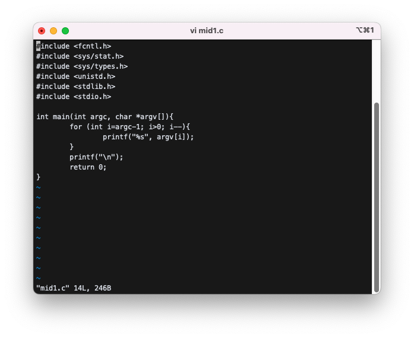
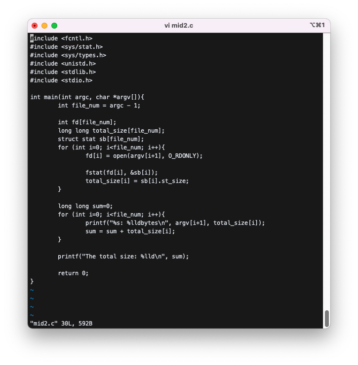
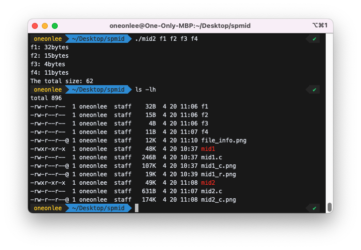

# System Programming Midterm Exam, Spring, 2022, Class 1

For each problem, you should show 1) the source code, 2) the output result, and 3) explanation about your code. Submit in one word/pdf/hwp file. A zip file is not allowed. The exam is open book and everything including lecture notes, Internet, etc. are open except people.

### 1. Write a program that reads any number of numbers and displays them in reverse order.

```bash
$ ./mid1 1 2 3 4 5 6 7 8
8 7 6 5 4 3 2 1
$ ./mid1 22 33 44
44 33 22
```



- command line argument를 통해 입력받은 숫자들은 `argv[]` 안에 저장되게 된다.
- 따라서 for문을 역순으로 돌려주면서 `printf` 함수를 통해 배열 안의 원소를 출력해주었다.
- 이때, `argv[0]`에는 프로그램의 이름인 `.mid1`이 담겨있고, 배열의 맨 끝에는 `NULL` 값이 담겨있으므로 두 부분은 제외해주었다.


---

### 2. Write a program that reads any number of files and show the size of each file and the total.

```bash
$ ./mid2 f1 f2 f3 f4
f1: 23 bytes
f2: 7 bytes
f3: 88 bytes
f4: 10 bytes
The total size: 128
```



- 먼저 arument의 개수인 `argc`에서 1을 빼준 값이 argument로 받아온 파일의 개수이므로, 그것을 `file_num`에 저장해주었다.
- 파일의 개수대로 file desciptor와 file의 size를 담아야하기 때문에 `file_num`만큼의 크기를 가지는 `fd`, `total_size`, `sb` 배열을 각각 선언해주었다.
- 그 다음, 각각의 파일을 `open`하고, 이를 `fd` 배열에 저장한 뒤, `fstat`과 `sb[i].st_size`를 통해 그 파일의 크기를 알아낸 뒤, 그 크기를 `total_size[i]`에 저장하는 과정을, `file_num`만큼 for문으로 반복하였다.
- 반복문이 끝나고, `argv[i+1]`을 통해 파일의 이름과, `total_size[i]`에 저장했던 파일의 크기를 출력해주었다. 또 이를 `file_num`만큼 for문으로 반복하였다.
- 반복을 하며, 모든 파일의 크기의 합을 담는 변수인 `sum`에 `sum = sum + total_size[i];`를 통해 파일의 크기를 모두 더하고, 반복문이 끝나면 이를 출력해주었다.



- 예시와 같이 4개의 파일을 argument로 주었을 때, 정상적으로 작동하는 것을 확인할 수 있다.
- `ls -lh` 명령어로 파일의 실제 크기를 확인해보았을 때도 동일한 것을 확인 할 수 있다.
