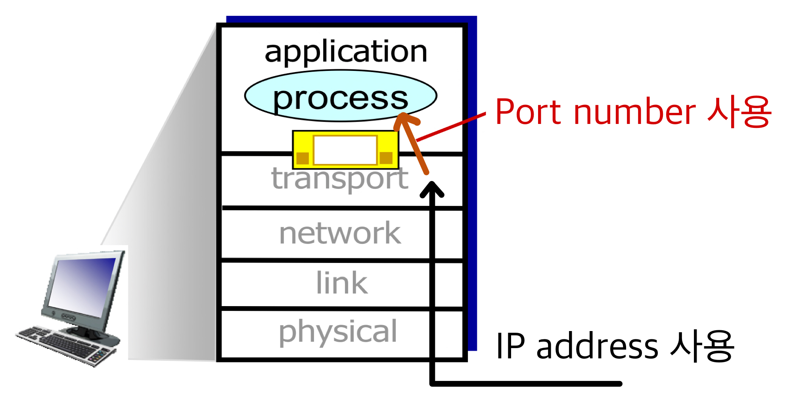
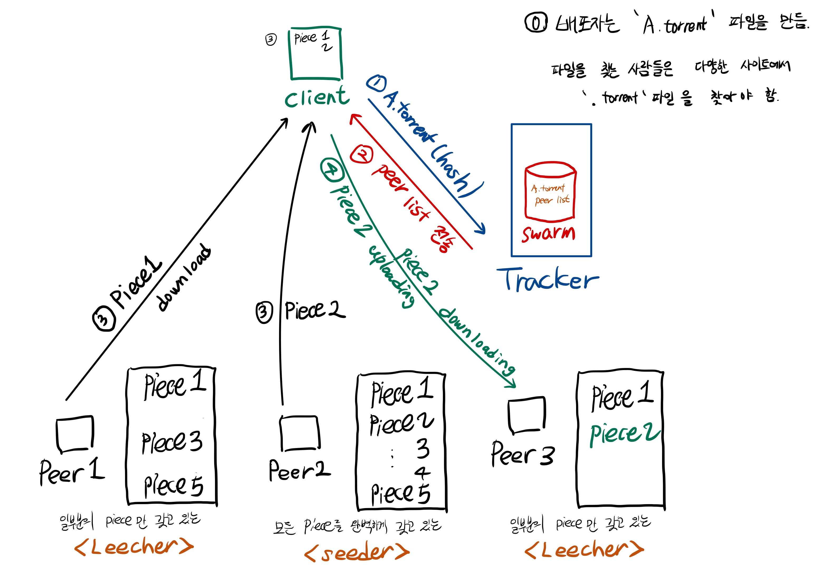

# Application Layer

overview:

- [Principles of Network Applications](#1-principles-of-network-applications)
- [Web and HTTP](#2-web-and-http)
- [DNS](#3-dns-domain-name-system)
- [P2P applications](#4-p2p-applications)

## 1. principles of network applications

### Application architectures

- [client-server](#client-server-architecture)
- [peer-to-peer (P2P)](#p2p-architecture)

#### Client-server architecture

> 유저의 시스템(client)이 내놓은 요구를 시스템(server)이 처리하도록 한 네트워크 구성

- 서버:
  - 항상 켜져 있는 호스트이다.
  - 영구적인 **고정 IP 주소**를 가진다.
- 클라이언트:
  - 서버와 통신하며, 간헐적으로 연결될 수 있다.
  - 통상적으로 **동적 IP 주소**를 가진다.
  - 클라이언트들끼리 서로 직접 소통하지 않는다.

#### P2P architecture

- P2P는 Peer-to-Peer의 약자로, 임의의 end system들끼리 (peer들끼리) **직접** 통신한다.
  - 중앙 서버를 거치지 않고 클라이언트 컴퓨터끼리 직접 통신하는 방식이다.
  - P2P 네트워크에서 "피어"는 예를 들어 인터넷을 통해 서로 연결된 컴퓨터 시스템 및 기타 장치이다.
- 피어는 다른 피어에게 서비스를 요청하고 제공한다.
- Client-server architecture와 다르게, 항상 켜져 있는 서버가 없다.
  - **self scalability** (자체 확장성) : 새로운 peer는 새로운 서비스를 요구하고 새로운 서비스를 가져다 준다.
- 피어가 간헐적으로 연결되고, IP 주소가 변경된다.

### Addressing processes

- Process는 호스트 내에서 돌아가는 프로그램이다.
  - 같은 호스트 내에서 복수개의 processes가 돌아갈 수 있다.
  - 또한, 두 개의 processes가 내부적으로 communication할 수 있다.
- 이러한 프로세스는 메시지를 받기 위해 **ID**가 필요하다. 이 ID 역할을 하는 것이 **IP 주소**와 호스트의 프로세스와 관련된 **포트 번호**이다.
  - 호스트 장치는 고유한 32bit IP 주소를 가진다.
- 예를 들어, 한 집에 네 식구가 산다고 해보자.
  - 그 집에 각 사람들을 어떻게 구별할까? 집주소는 하나만 쓰고 각 식구마다 이름을 붙인다.
  - 이 때 집주소가 'IP 주소'이고, 그 집의 각 사람들에게 붙힌 이름이 '포트 번호'다.
- 특정한 쓰임새를 위해서 0번부터 1023번까지 미리 할당한 포트 번호를 **Well-known port number**라고 한다.
  - e.g.,
    - HTTP 서버: `80`
    - 메일 서버: `25`
  - 클라이언트는 well-known port number를 사용하지(가지지) 않아도 된다.
    - 일반적으로, 클라이언트가 먼저 통신을 요청받는 경우는 없기 때문이다.
- IP 주소가 `128.119.245.12`인 호스트에서 HTTP 메시지를 보낸다하면, 포트 번호는 `80`으로 보내는 것이다.
  - IP 주소는 호스트를 지칭하고, 포트 번호는 processes를 지칭한다.
  - 

### App-layer protocol defines

애플리케이션 계층 프로토콜은 다른 종단 시스템에서 실행되는 애플리케이션의 프로세스가 **서로 메시지를 보내는 방법**을 정의한다.

- 교환 메시지 타입 (요청 메시지, 응답 메시지)
- 여러 메시지 타입의 문법 (메시지 내부의 필드와 필드 간의 구별 방법)
- 데이터의 헤더 속 필드(field)의 의미, 즉 필드에 있는 정보의 의미
- 언제, 어떻게 프로세스가 메시지를 전송하고 메시지에 응답하는지 결정

만약 브라우저 개발자가 HTTP RFC의 규칙을 따른다면, 브라우저는 HTTP RFC의 규칙을 따른 어떠한 웹 서버로부터도 웹 페이지를 가져올 수 있다.

- 네트워크 애플리케이션과 애플리케이션 계층 프로토콜은 같은 개념이 아니다. 애플리케이션 계층 프로토콜은 네트워크 애플리케이션의 한 요소일 뿐이다.
  - 예를 들어, 웹은 사용자가 필요에 따라 웹 서버로부터 문서를 얻게 해주는 네트워크 애플리케이션이다. 웹 애플리케이션은 문서 포맷 표준(HTML), 웹 브라우저(크롬, 파이어폭스 등), 웹 서버(아파치, ms 서버), 애플리케이션 계층 프로토콜을 포함하는 여러 요소들로 구성된다.
  - 웹 애플리케이션 계층 프로토콜(HTTP)은 브라우저와 웹 서버 사이에서 교환되는 메시지의 포맷과 순서를 정의한다. 따라서 HTTP는 웹 애플리케이션의 한 요소다.

### transport service의 요구사항

- data integrity (데이터 무결성) : loss-sensitive
  - 데이터 송수신 시, 링크의 에러 혹은 라우터 버퍼 에러로 인한 bit 변형 혹은 손실이 일어날 수 있다.
  - 이로 인해 source가 보낸 정보와 destination에서 받은 정보가 일치하지 않을 수 있다.
  - 이메일, 은행 시스템, 파일 전송, Web transactions 애플리케이션 등은 **100% 신뢰 가능한 데이터 전송을** 요구한다.
  - 오디오나 비디오 애플리케이션은 약간의 손실을 허용하기도 한다.
- timing : delay-sensitive
  - 인터넷 전화, 인터랙티브 게임 등은 지연 시간이 짧아야 한다.
- throughput : bandwidth-sensitive
  - 멀티미디어가 효과적이기 위해서 최소한의 throughput을 요구한다.
  - 이메일, FTP, 웹 전송 같은 탄력적인 애플리케이션은 많은 throughput을 요구하지 않는다.
- security
  - encryption, data integrity (중간에 의도적인 개입이 없이 전송되어 수신자가 받은 정보가 송신자가 보낸 정보와 일치한다는 확신을 주는 것)

#### 애플리케이션 별 요구사항의 예시

| application           | data loss     | throughput                                | time sensitive  |
| --------------------- | ------------- | ----------------------------------------- | --------------- |
| file transfer         | no loss       | elastic                                   | no              |
| e-mail                | no loss       | elastic                                   | no              |
| Web documents         | no loss       | elastic                                   | no              |
| real-time audio/video | loss-tolerant | audio: 5kbps-1Mbps video: 10kbps-5Mbps | yes, 100's msec |
| stored audio/video    | loss-tolerant | audio: 5kbps-1Mbps video: 10kbps-5Mbps | yes, few secs   |
| interactive games     | loss-tolerant | few kbps up                               | yes, 100's msec |
| text messaging        | no loss       | elastic                                   | yes and no      |

### 인터넷 전송 프로토콜이 제공하는 서비스 (Internet transport protocols services)

transport layer에서 application layer protocol에 제공해주어야 하는 것

#### TCP service (for loss-sensitive application)

- **reliable transport**
  - 전송 프로세스와 수신 프로세스 간의 안정적인 전송이 가능하다.
- **connection-oriented (연결 지향)** : 클라이언트와 서버 간에 설정(setup)이 필요하다.
  - 여기서 말하는 설정(setup)이란?
    - sender/receiver에 buffer 할당
    - buffer & window size 설정 등
- flow control
  - sender 측 버퍼가 넘치치 않도록 제어해준다.
- congestion control
  - 각 TCP 연결이 네트워크 대역폭을 공평하게 공유할 수 있게끔 제어한다.
- timing, minimum throughput guarantee, security 등의 기능은 제공하지 않는다.

#### UDP service (for delay-sensitive application)

- **unreliable data transfer**
- UDP는 TCP에서 제공하는 것을 하나도 제공하지 않는다.
  - reliability, connection setup, flow control, congestion control, timing, minimum throughput guarantee, security 등을 **제공하지 않는다.**
- 정말 아무것도 안 하는 것 같은데 필요한 이유가 무엇일까?
  - UDP는 포트 번호에 따라 전달하는 역할을 한다.
  - UDP는 신뢰성을 보장하지는 않지만, TCP에 비하여 빠른 전송 속도를 제공한다.
  - UDP는 비연결을 지향하기 때문에 데이터를 재전송할 필요도 없고, 흐름 제어나 에러 체크도 항상 필요로 하지 않는다.

## 2. Web and HTTP

### Web

- 웹 페이지는 HTML file + referenced object 로 이루어져 있는데, 이 때 각 object들은 URL을 통해 reference 되는 구조이다.
  - 여기서 URL이란, Uniform Resource Locator의 약자로 아래 그림과 같은 구조로 이루어져 있다.
  - 

### HTTP(Hyper Text Transfer Protocol)

- HTTP는 Application layer의 여러 프로토콜 중 하나로 주로 웹에서 많이 쓰이는 프로토콜이다.
- HTTP 프로토콜을 통해 우리는 웹사이트에서 다양한 활동을 할 수 있다.

### (1) HTTP의 특징

- 1. HTTP는 TCP와 짝지어져 있다.
  - 처음에 TCP가 연결을 맺으면 이후 HTTP 메시지가 교환되는 구조이다.
  - TCP를 통해 통신을 하므로 신뢰성 있는 통신을 할 수 있다.
- 2. HTTP는 'stateless' 하다.
  - 클라이언트의 상태나 과거 연결했던 기록 등을 신경쓰지 않고, 그냥 그 순간 요구하는 것만을 처리한다.
  - 이러한 특징 덕분에 간단하고 빠르게 프로토콜이 동작할 수 있다.

### (2) HTTP 연결 종류

HTTP는 어떻게 연결을 하느냐에 따라서 다음과 같이 분류할 수 있다.

- 1. non-persistent HTTP
  - HTTP의 초기 모델로, **한번의 연결에 1개의 컨텐츠**를 처리하는 형식이다.
- 2. persistent HTTP
  - **한 번 연결하는 동안에 컨텐츠를 계속해서 교환**하는 형식이다.
  - TCP로 처음 연결하는데 RTT(Round Trip Time)이 너무 오래 걸려서 고안된 연결 방식이다.
  - RTT는 한 패킷이 end to end로 one-round-trip 하는데(다시 되돌아오는데) 소요되는 delay 시간을 나타낸다.

### (3) HTTP request/response messages

HTTP 프로토콜에 사용되는 메시지들은 ASCII로 작성되어 일반 사용자들이 읽을 수 있는 형태이다. HTTP 프로토콜 메세지는 크게 HTTP request와 HTTP response로 구분할 수 있다.

#### HTTP request message

이름 그대로 클라이언트가 서버에게 컨텐츠를 요구할 때 사용되는 메시지로, 아래와 같은 구조로 되어 있다.

- 1. request line
  - HTTP request 메시지의 가장 첫번째 줄에 위치한다.
  - GET, POST, PUT, DELETE와 같은 메소드 + 요청하는 object + 프로토콜 버전 정보 등으로 이루어져 있다.
- 2. header line
  - 주요 내용들을 담고 있다.
  - 서버 호스트 주소, 클라이언트 사용자 정보, 클라이언트가 지원하는 언어 / 형식 / 파일 등을 나타낸다.

참고로 메소드 중 POST 라는 메소드는 클라이언트가 서버에게 변화를 알려줄 때 사용한다. 그래서 인스타그램에 게시글을 올리는 등 사용자가 웹페이지에 어떤 변화를 주면 POST 메소드를 이용한다.

같은 맥락으로 사용자가 구글 검색을 할때, 사용자가 입력한 검색어를 POST 메소드를 통해 서버에게 넘겨주는게 일반적이다. 하지만, POST 메소드보다 GET 메소드가 더 간단하므로, GET 메소드에 검색어를 parameter로 넘겨주는 형태로 이용하기도 한다.

#### HTTP response message

서버가 클라이언트에게 보낼 때 사용되는 메시지로, 아래와 같은 구조로 되어 있다.

### Cookies, Web caches (Proxy server)

#### Cookie

쿠키는 문자와 숫자의 조합으로 된 작은 파일이다. 쉽게 말해, 서버가 주는 **일종의 인덱스**이다.

서버는 쿠키를 통해서 클라이언트를 식별하고 이에 맞춰 다양한 서비스를 제공한다. 아마존 사이트에 들어가면 내가 클릭했던 상품 목록들을 보여 주는데, 이런 것들이 모두 쿠키를 이용하기 때문에 가능한 것이다.

사용자가 특정 사이트에 처음 접속하면, 그 사이트 서버는 사용자에게 Cookie header라는 숫자를 부여해준다. 브라우저는 부여받은 Cookie header와 사이트 이름을 조합하여 만들어진 쿠키 파일을 사용자의 컴퓨터에 저장한다.

이후 사용자가 그 사이트에 접속할 때마다 해당 쿠키파일을 보내주면 서버는 이를 통해 사용자를 식별할 수 있다.

이처럼 쿠키를 사용하면 HTTP의 stateless한 특성을 **state하게 만들 수 있다.**

전체적인 동작 과정은 아래와 같다.

- (1) 서버가 cookie를 initiate 해 set-cookie 라는 필드로 넣어 response
- (2) 다음에 다시 요청할 때 cookie 값을 담아서 요청
  - 서버는 해당 클라이언트를 cookie로 관리할 수 있음
- 클라이언트는 컴퓨터를 껐다 켜더라도 cookie값으로 다시 요청할 수 있음

위의 내용들을 종합해보았을 때, 쿠키를 사용하려면 다음과 같은 4가지 구성요소가 필요하다.

- HTTP response 메시지의 Cookie header line
- HTTP request 메시지의 Cookie header line (HTTP response 메시지 바로 다음에 등장)
- 클라이언트의 컴퓨터에 저장되는 쿠키파일과 이를 관리해주는 브라우저
- 웹사이트에서 사용자들의 쿠키파일을 관리할 데이터베이스

Cookie가 사용되는 곳은 아래와 같다.

- 웹브라우저에 대한 로그인 정보 기억 (로그인했던 웹페이지에 다시 접속해보면 로그인 정보가 기억돼 있는 것)
- 온라인 몰에서의 구매목록 기능
- email 정보 기억

등등 state가 필요한 곳에서 사용된다.

하지만, 쿠키는 사용자 정보를 담고 있기 때문에 **privacy 이슈**가 있다. 그래서 보통 서버쪽에서는 쿠키를 사용할 때, 개인정보활용 동의가 수반된다.

#### Web caches (Proxy server)

캐시라는 말은 컴퓨터의 다양한 분야에서 자주 쓰인다. CPU에서의 캐시 메모리, 운영체제에서의 페이지 캐시, 파일 시스템에서도 캐시라는 말이 등장할 정도로 다양한 분야에서 쓰인다.

그 중에서도 웹에서 쓰이는 웹 캐시는 서버와 클라이언트 사이에서 서버로부터 컨텐츠를 더 빨리 받아, 클라이언트에게 더 빠르게 컨텐츠를 제공하기 위해서 사용한다.

웹 캐시는 프록시 서버(Proxy server)를 통해 구현하며, 클라이언트와 서버 사이에 위치한다.

- 프록시 서버는 클라이언트가 서버에게 요청하는 것을 듣고
  - (1) 만약 요청하는 컨텐츠가 자신(프록시 서버)에게 있을 경우, 바로 클라이언트에게 컨텐츠를 제공하고
  - (2) 요청하는 컨텐츠가 자신에게 없을 경우 오리지널 서버에게 컨텐츠를 요청하고 이를 프록시 서버에 저장한 후 클라이언트에게 제공하는 형태로 동작한다.

그래서 최초 클라이언트의 최초 요청을 제외한 나머지 요청들은 프록시 서버에서 정보를 받아올 수 있게 된다.

- 웹 캐시의 장점
  - (1) 요청-응답 시간(response time)을 줄일 수 있다.
    - 웹 캐시는 굳이 멀리 있는 오리지널 서버로 가지 않고, 가까이 있는 프록시 서버로 가서 정보를 가져오기 때문에 요청-응답 시간을 줄일 수 있다.
  - (2) 서버의 트래픽(traffic)을 줄일 수 있다.
    - 웹 캐시를 사용하면 클라이언트의 요청이 모두 서버로 가는 것이 아닌, 프록시 서버로 트래픽이 분산되기 때문에, 그만큼의 요청에 대한 트래픽을 아낄 수 있다.
    - 만약 40%가 hit되어 오리지널 서버로 오지 않는다면, 40%만큼 트래픽을 아낄 수 있는 것이다.
- 웹 캐시의 단점
  - 프록시 서버가 제공하는 컨텐츠는 최신 컨텐츠가 아닐 수 있다.
    - 만약 오리지널 서버에서 컨텐츠를 계속해서 업데이트 하고 있지만, 프록시 서버는 오래된 컨텐츠를 제공할 수 있다.

## 3. DNS: domain name system

DNS는 한마디로 말해서 사람들이 쓰기 편한 호스트 네임(`www.naver.com`)을 컴퓨터가 알아들을 수 있는 아이피 주소(`125.209.222.141`)로 바꿔주는 시스템이다.

세상에 있는 모든 서버의 주소는 IP 주소를 가지고 있다. 따라서 사용자들이 해당 서버에 접속하기 위해서는 그 서버의 IP 주소를 외우고 입력해야 한다. 하지만, IP 주소는 보다시피 그냥 숫자와 점의 조합으로 이루어진 주소로, 사람들이 외우고 사용하기 매우 불편하다.

그래서 DNS 라는 서비스를 이용해 영문 주소와 IP 주소를 쉽게 매핑(mapping)하여 사용할 수 있는 것이다.

### DNS가 제공하는 서비스

- 1. Hostname을 IP 주소로 바꿔주는 서비스 (hostname to IP address translation)
  - DNS의 가장 기본적인 서비스이다.
- 2. Host aliasing
  - 호스트 이름이 너무 길 경우, 줄여서 부를 수 있도록 매핑 정보를 제공할 수 있다.
  - 예를 들어 우리가 잘 알고있는 `www.naver.com`의 실제 호스트 이름은 `www.naver.com.nheos.com`이다. 이게 너무 기니까 전자와 같이 줄여서 부르는 것이 편하다.
- 3. 도메인 이름으로 메일 서버의 호스트 이름 찾기 (Mail server aliasing)
  - 사용자들이 쓰는 메일 주소를 실제 메일 서비스를 제공하는 서버와 매핑시켜주는 기능을 제공할 수 있다.
  - 예를 들어 `~~~@naver.com` 이라는 이름으로 메일 서비스를 이용 했을 때, 해당 메일 서비스를 담당하는 메일 서버의 호스트명은 `mx1.naver.com` 이다.
- 4. 동일 도메인 주소에 접근하는 클라이언트들에게 IP 주소 분산 시켜 주기 (Load distribution)
  - 서버에 여러개의 IP 주소를 대응하게 해줌으로써 서버의 부담을 분산해주는 기능을 제공할 수 있다.
  - 예를 들어 네이버 서버의 IP 주소는 `125.209.222.141`과 `223.130.195.95` 두 개이다.
  - 이처럼 IP 주소를 여러개로 대응시킴으로써 네이버 서버의 부담을 분산해줄 수 있다.
  - 하지만, 그렇다고 해서 네이버 서버를 두개의 컴퓨터가 담당하고 있다는 것은 아니다.

### DNS 구조

- DNS는 계층적인 구조를 가지고 있다.
  - 위의 그림에서 가장 최상위에 위치한 DNS 서버를 루트 네임 서버라 하고,
  - 그 바로 아래에 있는 DNS 서버를 TLD 네임 서버라고 한다. (Top Level Domain name)
  - 그리고 실제 IP 주소를 가지고 있는 DNS 서버를 Authoritative name server라고 한다.  
- 따라서 만약 사용자가 `www.amazon.com` 라고 주소창에 입력하면,
  - 루트 네임 서버가 `.com`을 담당하는 TLD 네임 서버를 찾아준다.
  - `.com` 을 담당하는 TLD 네임서버는 `amazon.com`을 담당하는 DNS 서버를 찾아줄 것이고,
  - 결국 원하는 웹사이트의 IP 주소를 찾을 수 있게 된다.

루트 네임 서버는 초기에 13개만 존재했다. 대부분이 미국에 존재했으므로, 각 Local DNS 서버가 루트 네임 서버에 쿼리를 날리기 위해서는 해외에 존재하는 루트 네임 서버에 접근해야만 했다.  
하지만, 현재는 13개의 루트 네임 서버를 미러링하는 서버가 전세계에 있으므로 그걸 이용하면 된다. 현재, 우리나라에서 가장 가까운 건 도쿄에 있는 서버이다.

- 만일 DNS 서버를 하나로 둔다면?
  - 시간이 오래 걸림 (traffic volume / distant centralized database)
  - Single Point of Failure (하나의 centralized server die > 서비스 중단)
  - maintenance

### Local DNS 서버

Local DNS 서버는 DNS 서비스를 이용할 때, 도와주는 역할을 한다.

주로 KT나 SKT 같은 ISP가 가지고 있으며, 사용자가 DNS 쿼리를 날리면 local DNS 서버가 가장 먼저 받게 된다.

DNS 쿼리를 처리하는 방식에 따라 Iterative query와 recursive query로 분류할 수 있다.

#### Iterative query

1. 사용자가 특정 호스트 이름의 IP 주소를 요청하는 쿼리를 날리면, Local DNS 서버가 먼저 받는다.
2. Local DNS 서버는 루트 네임 서버에게 쿼리를 날리고, 루트 네임 서버는 .edu에 해당하는 TLD를 알려준다.
3. Local DNS 서버는 edu에 해당하는 TLD에게 쿼리를 날리고, TLD는 umass.edu에 해당하는 DNS 서버를 알려준다.
4. Local DNS 서버는 umass.edu에 해당하는 DNS 서버에게 쿼리를 날리고, 해당 DNS 서버는 gaia.cs.umass.edu에 해당하는 IP 주소를 알려준다. 즉, umass.edu를 책임지는 DNS 서버가 authoritative name 서버인 것이다.
5. 마지막으로 Local DNS 서버가 사용자에게 IP 주소를 전달한다.

#### Recursive query

1. 사용자가 특정 호스트 이름의 IP 주소를 요청하는 쿼리를 날리면, Local DNS 서버가 먼저 받는다.
2. Local DNS 서버는 루트 네임 서버에게 쿼리를 날리고, 루트 네임 서버는 .edu에 해당하는 TLD 서버에게 쿼리를 날린다.
3. edu에 해당하는 TLD 서버는 umass.edu에 해당하는 DNS 서버에게 쿼리를 날린다.
4. umass.edu에 해당하는 DNS 서버는 gaia.cs.umass.edu에 해당하는 IP 주소를 TLD 서버에게 알려준다. 즉, umass.edu를 책임지는 DNS 서버가 authoritative name 서버인 것이다.
5. TLD 서버는 루트 네임 서버에게 IP 주소를 알려준다.
6. 루트 네임 서버는 Local DNS 서버에게 IP 주소를 알려준다.
7. 마지막으로 Local DNS 서버가 사용자에게 IP 주소를 전달한다.

### DNS caching

DNS도 Local DNS 서버를 통해 caching을 한다.

Local DNS 서버에 이전에 사용했던 DNS 매핑 정보를 저장해 놓고, 같은 질의가 오면 빠르게 처리하는 방식이다. TTL(Time To Live) 개념을 사용하여, 특정 기간동안 사용되지 않으면 자동으로 삭제된다.

특히 TLD 네임 서버는 Local DNS 서버에 캐싱되어 있는 경우가 많으므로, 루트 네임 서버에게 TLD 네임 서버를 물어보지 않는 경우가 대다수이다.

## 4. P2P applications

[Pure P2P architecture에 관한 내용은 이 곳](#p2p-architecture) 참조

### (1) "Napster"

Napster는 잠꾸러기라는 뜻으로, 온라인 음악 파일 공유 서비스였다. (개발자 숀 패닝의 대학생 시절, 그의 룸메이트가 음악을 다운받느라 새벽에 매일 같이 웹 페이지를 뒤져서 숀 패닝이 잠을 못 잤다고 한다. 그래서 답답한 숀 패닝은 음악 파일 공유 서비스를 직접 만들어버렸고, '잠 좀 자자'라는 의미가 만든 "Napster"에 담겨있다고 한다.) (현재는 저작권 관련 소송 등의 문제 때문에 서비스가 중단되었다.)

- Napster는 초창기 P2P 모델로, **중앙화된 서버(centralized server)**를 가진다.
  - (1) 피어(A)는 서버에 연결하여 원하는 파일을 질문(query)한다.
  - (2) 서버는 피어(A)에게 해당 파일을 갖고 있는 다른 피어(B)를 알려준다.
  - (3) 피어(A)는 파일을 가진 피어(B)와 연결하여 파일을 요청하고, **서버를 거치지 않고 피어들끼리 파일을 공유한다.**

이처럼, P2P 모델은 파일의 공유 시, 중앙 서버를 거치지 않고 클라이언트 컴퓨터끼리 직접 통신하는 방식이다.

하지만, Napster는 중앙 집중식 디렉토리(centralized directory)를 가지는데, 이 같은 구조는 아래와 같은 문제를 가진다.

- Robustness : single point of failure
  - centralized server가 fail되면 서비스는 끝난다! (centralized service의 단점)
- Scalability : Performance bottleneck

### (2) "Gnutella"

Gnutella는 GNU 회사에 다니던 개발자들이 만든 서비스이다. (개발자 중 한 명의 와이프가 누텔라를 좋아해서 이름을 이렇게 만들었다고 한다.)

- Gnutella는 중앙 서버를 두지 않는 **분산형 서비스**이다.
- 하나의 서버가 모든 것을 알기보다, 하나의 피어가 몇개의 피어들이 가진 파일을 알고 있고, 그 피어들도 몇 개의 피어들이 가진 파일을 아는 구조이다.
- 즉 다단계처럼 뻗어나가 결국 **모든 피어들이 연결**되는 형태이다.
- 작동 방식
  - (1) 어느 피어가 어떤 파일을 원하면 자신이 알고있는 피어에게 쿼리를 날린다.
  - (2) 쿼리를 받은 피어는 자기가 해당 파일을 가지고 있으면 쿼리를 날린 피어에게 알려주고, 자기가 해당 파일이 없으면 자신이 알고있는 피어에게 또다시 쿼리를 날린다.
  - (3) 그렇게 어느 피어가 파일을 가지고 있는지 알게되면, 그 중 하나의 피어를 선택해 파일을 받는다.
  - (4) 파일 전송에는 HTTP 프로토콜이 사용된다. (GET 메소드 사용)  
- Gnutella는 모든 피어들이 연결되어 있기에 생기는 단점도 존재한다.
  - 이 방식은 중앙 서버가 없으므로, 서버가 고장나 전체 서비스가 다운되는 문제는 없지만 피어가 너무 많으면 속도가 느려진다는 단점이 있다.
  - 보안에 취약하고, 악의적인 피어가 마음을 먹으면, 다른 피어들을 조종하여 DDoS 공격을 감행할 수 있다.

### (3) "BitTorrent"

- Piece: 공유 파일의 한 조각 (256 kb)
  - 피어들은 파일을 256kb로 쪼개어 공유한다. (사실, 공유하는 파일의 크기가 크면, 쪼개는 파일의 크기를 256kb로 고정하지 않고, 늘리는 경우도 있다.)
- Peer: Piece들을 upload/download 하는 주체.
- Seeder: 모든 piece를 전부 가지고 있는 피어를 지칭
- Leecher: 일부 piece만을 가지고 있는 피어를 지칭
- Tracker: 클라이언트(피어)에게 peer list를 전달하는 중앙 컴퓨터 (공개/비공개)
- Swarm: Tracker 안에 있으며, peer list를 담고 있는 DB

작동방식 

#### Torrent의 알고리즘과 전략

- 1. 조각 선택 알고리즘 (Piece Selection Algorithm)
  - (1) Strict Priority (전 과정)
    - 조각을 받기 시작하면, 다른 조각에 신경 쓰지 말고, 해당 조각을 다운 받는데 최선을 다하라.
  - (2) Random First Piece (처음)
    - Client가 어떤 조각도 갖고 있지 않을 경우, random으로 piece를 선택해서 download를 시작한다.
  - (3) Rarest First (중간)
    - download 시, 자신이 download 해야하는 조각 중에서 해당 조각을 가지고 있는 peer의 수가 가장 적은 조각으로 결정한다.
    - 따라서 가장 많은 peer를 가지고 있는 조각이 다운로드의 마지막에 남게 된다.
    - 첫 조각은 Random First Piece 전략을 사용하며, 그 다음 조각부터 Rarest First 전략을 사용한다.
  - (4) End Game Mode (마지막)
    - 마지막 한 개의 조각을 download 할 때는, peer 전체에게 download request를 한다.
    - download가 끝나면 다른 peer들에게는 cancel 요청을 한다.
- 2. 피어 선택 알고리즘 (Peer Selection Algorithm)
  - Choking
    - upload를 하지 않고, download만 하는 peer를 방지하는 방법.
    - "일시적으로 특정한 client에게 uploading을 거부하는 것."
    - 10초마다 갱신되는 각각의 peer로부터의 download 속도를 계산하여 choke를 할지 unchoke를 할지 계산한다.
    - BitTorrent에서는 uploading 하는 peer가 downloading 하는 peer에게 “unchoke”를 보냄으로서 download가 시작된다.
    - “unchoke” 되는 peer의 수는 4개
  - "optimistic unchocking"
    - 자신으로 uploading하는 속도가 빠른 peer에 대해 unchoke를 실행
    - (20초 단위로 관측하고, 10초마다 unchoke peer를 변경)
  - 30초마다 optimistic unchocking 하지 않고, "random selection" 한다.
    - 방금 접속한 새로운 peer들에게 기회를 주는 역할을 한다.
- 번외) torrent 운영 회사의 수익 모델은 무엇인가?
  - SW의 업데이트, 신규 배포 등을 torrent를 통해 배포를 하기 대문에 수익이 발생한다.

---

## Source

1. **Computer Networking: A Top Down Approach** 6th edition - Jim Kurose, Keith Ross Addison-Wesley March 2012
2. https://en.dict.naver.com/#/entry/enko/3365d85cadaf4ba19c6e2bb70cd4cd1f
3. https://ko.itpedia.nl/2019/01/11/wat-is-p2p-peer-to-peer-en-wat-kan-je-er-mee/
4. https://velog.io/@wjs4199/%EB%84%A4%ED%8A%B8%EC%9B%8C%ED%81%AC-P2P
5. https://inyongs.tistory.com/56
6. https://heo-seongil.tistory.com/103
7. https://ko.wikipedia.org/wiki/TCP/UDP%EC%9D%98_%ED%8F%AC%ED%8A%B8_%EB%AA%A9%EB%A1%9D
8. https://velog.io/@jeanbaek/%EC%BB%B4%ED%93%A8%ED%84%B0-%EB%84%A4%ED%8A%B8%EC%9B%8C%ED%82%B9-2-%EC%95%A0%ED%94%8C%EB%A6%AC%EC%BC%80%EC%9D%B4%EC%85%98-%EA%B3%84%EC%B8%B5-1-%EB%84%A4%ED%8A%B8%EC%9B%8C%ED%81%AC-%EC%95%A0%ED%94%8C%EB%A6%AC%EC%BC%80%EC%9D%B4%EC%85%98%EC%9D%98-%EC%9B%90%EB%A6%AC
9. https://velog.io/@lychee/%EB%84%A4%ED%8A%B8%EC%9B%8C%ED%81%AC-2.1-Application-layer
10. https://hwanine.github.io/network/UDP/
11. https://namu.wiki/w/P2P
12. https://ddongwon.tistory.com/m/72
13. https://inyongs.tistory.com/m/57
14. https://ddongwon.tistory.com/m/73
15. https://inyongs.tistory.com/m/58
16. https://inyongs.tistory.com/m/59
17. https://ddongwon.tistory.com/m/74
18. https://velog.io/@lychee/%EB%84%A4%ED%8A%B8%EC%9B%8C%ED%81%AC-2.4#iterated-query
19. https://ddongwon.tistory.com/m/75
