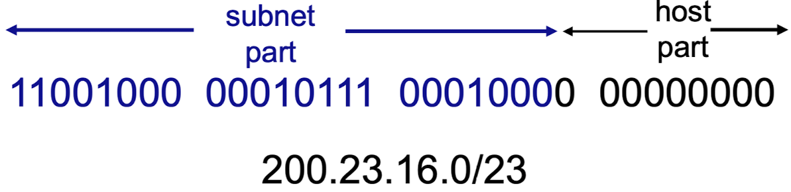

# Network Layer

- Virtual circuit and datagram networks
- What’s inside a router
- IP: Internet Protocol
- Routing algorithms
  - link state
  - distance vector
  - hierarchical routing
- Routing in the Internet
  - RIP
  - OSPF
  - BGP

## 1. Virtual circuit and datagram networks

## 2. What’s inside a router

### Input port queuing

- Head-of-the-Line (HOL) blocking
  - 자신보다 앞에 있는 datagram이 block되면, 자기자신도 block됨

## 3. IP: Internet Protocol

### IP datagram format

each line's length is 32 bits

#### Header

##### Default Header = 20 bytes

- (1-1) IP protocol version number
- (1-2) header length (bytes)
  - 20 bytes + @
- (1-3) "type" of data
  - "type" : 빠른 길 or 느리지만 싼 길
  - 실제 router가 고려하지는 않음
- (1-4) total datagram length (bytes)
- (2-1) 16-bit identifier
  - for fragmentation/reassembly
- (2-2) flags
  - D (Done fragmentation)
    - 0이면 fragmentation을 수행
    - 1이면 fragmentation을 수행 x
  - M (More flag = fragflag)
    - 0이면 내가 마지막이다.
    - 1이면 내가 마지막이 아니다.
  - for fragmentation/reassembly
- (2-3) fragmentation offset
  - 원래 데이터에서 어느 위치에 있었는지를 나타낸다.
  - for fragmentation/reassembly
- (3-1) time to live
  - max number remaining hops (decremented at each router)
- (3-2) upper layer
  - upper layer protocol to deliver payload to
- (3-3) header checksum
  - IPv4에서는 모든 패킷에 대해 checksum을 계산해주어야 한다. (시간이 느려짐)
  - 왜냐하며느 라우터를 거칠때마다 TTL이 변경되기 때문이다.
- (4) 32 bit source IP address
- (5) 32 bit destination IP address

##### Option Header

- (6) options (if any)

#### Data

- data (variable length, typically a TCP or UDP segment)

### Subnets

네트워크를 구분하고 싶을 때 사용

### IP addressing: CIDR

- CIDR: Classless InterDomain Routing
  - subnet portion of address of arbitrary length
  - address format: a.b.c.d/x, where x is # bits in subnet portion of address

### NAT: network address translation

IP 주소가 한정된 상황에서 인트라넷/내부망을 구성하기 위해 사용하는 “10.0.x.x” 주소는 외부와 통신이 불가하다. 
하지만 외부와 통신하고 싶다면? ➡️ Network Address Translation 사용!

### ICMP: internet control message protocol

### IPv6

- datagram format:
  - IPv6에서는 Header의 크기가 40 bytes로 고정되어 있다.
  - 만약 Option이 필요하면 데이터에 Option 값을 표시한다.
  - 이때, 어떤 옵션을 어디에 넣었는지 알려주는 것이 'next hdr'이다.
  - no fragmentation allowed

## 4. Routing algorithms

- Routing algorithm classification
  - global or decentralized information
    - global - "link state" algorithms (전체 경로를 시작하기 전에 알고 있을 때)
    - decentralized - "distance vector" algorithms (전체 토폴로지를 알 필요가 없고, 주변 노드들의 정보만 알고 있으면 됨)
  - static or dynamic
    - static (한번 경로가 설정되면 경로가 잘 바뀌지 않을 때)
    - dynamic

### link state

Dijkstra’s algorithm

### distance vector

Bellman-Ford equation (dynamic programming)

### Comparison of LS and DV algorithms

\* 참고 : Convergence Time이란, 토폴로지 변화가 일어났을 때 이를 반영하여 네트워크가 재구성 될 때까지 소요되는 시간을 말한다.

- message complexity
  - LS: with n nodes, E links, O(nE) msgs sent
  - DV: exchange between neighbors only
    - convergence time varies
- speed of convergence
  - LS: O(n^2) algorithm requires O(nE) msgs
    - may have oscillations
  - DV: convergence time varies
    - may be routing loops
    - count-to-infinity problem
- robustness: what happens if router malfunctions?
  - LS: (토폴로지를 알고 있으면 한번에 계산 가능)
    - node can advertise incorrect link cost
    - each node computes only its own table
  - DV: (토폴로지를 모를 때 적합, 하지만 propagation 과정이 요망되므로 시간이 비교적 길게 소모된다.)
    - DV node can advertise incorrect path cost
    - each node’s table used by others
      - error propagate thru network

### hierarchical routing

link state + distance vector

## 5. Routing in the Internet

- RIP (distance vector 표준화)
- OSPF (link state 표준화)
- BGP (hierarchical routing 표준화)
