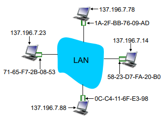

# Link Layer

- flow control
  - 인접한 송신 노드와 수신 노드 사이의 페이싱
- error detection
  - 신호 감쇠, 노이즈 등으로 인한 오류
  - receiver가 오류의 존재를 감지함
    - sender에게 재전송 신호를 보내거나 프레임을 삭제함
- error correction
  - sender는 재전송에 의존하지 않고, 비트 오류를 식별하고 수정한다.
- half-duplex and full-duplex
  - half-duplex 방식에서는 링크 양쪽 끝의 노드가 전송할 수 있지만, 동시에 전송할 수는 없음
- sharing a broadcast channel: multiple access
- link layer addressing
- local area networks: Ethernet, VLANs, WLAN

## Error Detection

- Parity checking
  - 비트 에러 발생 유무만 확인 가능
- Internet checksum
  - 수신된 것의 sum과 checksum(sum의 보수)를 더하면 0이 나옴
- Cyclic Redundancy Check (CRC) : 순환 중복 검사
  - `D` : 데이터 비트 (이진수)
  - `G` : Generator (`r+1`) 비트
  - `R` : CRC `r` bits (Remainder)

## Multiple access protocols

두 개 이상의 노드가 전송할 경우 신호가 충돌하며 간섭이 발생한다.

- Solution : Multiple Access Protocol
  - 노드가 전송할 수 있는 시기를 결정하는 분산 알고리즘

## MAC protocol의 분류

MAC(Medium Access Protocol)은 공유된 채널에 다수의 사용자가 접속할 수 있도록 도와주는 정의한 프로토콜이다.

MAC 프로토콜은 크게 세가지의 class로 얘기할 수 있다. 
(channel partitioning, random access, taking turns)

### 1. channel partitioning

- 채널(자원)을 작은 조각으로 쪼갬. (time slots, frequency, code)
- TDMA (time division multiple access), FDMA (frequency division multiple access) 등
- 사용 예 : 유선 전화 등 - 안정적인 서비스 제공

### 2. **random access**

- 미리 자원을 쪼개지 않음
- 충돌을 회피 할 수 있는 메커니즘
- 사용 예 : 스마트폰, 컴퓨터 등 - 간헐적 데이터 발생
- random access MAC protocol은 '충돌을 어떻게 detection 할 것인가', '어떻게 recovery 할 것인가'를 정의한다.
  - 이런 부분을 어떻게 해결하느냐에 따라서 여러가지 프로토콜이 갈라진다.
    - ALOHA, Slotted ALOHA, CSMA (carrier sense multiple access), CSMA/CD, CSMA/CA 등등
      - Slotted ALOHA는 지금도 이동통신 시스템에서 쓰는 개념이다.
      - CSMA/CD (Collision Detect)는 유선 LAN에서 쓰는 방식이다.
      - CSMA/CA (Collision Avoid)는 무선 네트워크에서 쓰는 방식이다.

#### (1) Slotted ALOHA

- 가정 :
  - 모든 프레임은 같은 사이즈이다.
  - 시간은 똑같은 size의 slot으로 나눠져 있다.
  - 한 개 frame을 한 개 slot에서 보낸다.
  - node들은 slot의 시작하는 시점을 알고 있어서 sync는 맞춰져 있다. (synchronized)
  - 동일한 slot에 데이터를 보내면 충돌이 발생하여, 모든 node들이 충돌 사실을 알게 된다. (detect collision)
- 작동 :
  - 만약, node가 충돌이 없었다면 아무 문제 없다.
  - 그런데 만약 충돌이 났으면 재전송을 해야한다.
    - 그 node가 바로 이어지는 time slot에서 재전송하면 또 충돌날 것이다.
    - 그래서 확률 `p`로 보낼지 말지 확률적으로 결정한다.
    - 그러면 확률적으로 충돌나는 것을 줄일 수 있다.
- 장점 :
  - decentralized된 방식이고, 간단하다.
- 단점 :
  - 충돌이 나고 slot을 낭비한다.
  - 전송을 하지 않는 slot이 있을 수 있다.
  - node들이 충돌을 바로바로 detection 할 수 없기도 하고, clock 싱크도 맞아야 한다.

#### (2) CSMA (carrier sense multiple access)

- 어떤 signal을 전달해서 전송하기 전에 channel을 살펴보며, 지금 누가 데이터를 보내고 있는가 아닌가를 들어볼 수 있다.
  - 이때, channel이 idle하다고 보이면 전송을 시도한다. 혹은 누군가가 보내고 있으면 busy하다고 보고 전송을 미룬다.
- propagation delay로 인해, CSMA에서도 여전히 collosion이 발생할 수 있다.
  - 

#### (3) CSMA/CD

- CSMA의 collision 문제를 해결하기 위해, collision을 detection 하는 CSMA/CD 프로토콜을 사용한다.
- 아주 짧은 시간 내에 충돌을 detection 할 수 있는 방식이며, 충돌이 난 경우에 전송을 취소한다.
- 이런 방식은 유선 LAN에서 쉽게 사용할 수 있고, 무선 LAN에서는 사용하기 어렵다.

##### CSMA/CD 알고리즘

1. Network Interface Card (NIC)가 상위 계층(network layer)으로부터 datagram을 받는다.
2. NIC가 channel이 idle한지 본다. idle한 것이 sense 됐으면 전송한다.  만약 busy하다면 idle해질 때까지 기다린다. idle이면 전송한다.
3. 전송하였는데 만약에 다른 전송이 detection 됐다면 바로 취소하고, jam signal 이라는 것을 보낸다.
4. 충돌이 났으니까 바로 이어서 보내면 또 충돌날 것이니, 한 템포 쉬었다가 보낸다.  다음 보내는 것은 확률 `p`로 정하는데 어떤 확률로 보낼 것인지 정해주는 protocol이 있다. 바로 binary backoff 방식이다.
   - 어떤 충돌이 났을 때 0에서 3까지의 숫자를 뽑는다.
   - 뽑은 시간만큼을 기다렸다가 재전송한다.
   - 만약 0을 뽑았으면 바로 전송하고 3을 뽑으면 3번 쉬는 것이다.
   - 그런데 idle을 기다리는 얘들이 많을 수도 있다.
   - 이러면 0에서 3까지 뽑으면 같은 숫자를 뽑아 다시 충돌날 확률이 높다.
     - 그래서 다시 충돌이 나면 0에서 7까지 뽑는다.
     - 그래도 또 충돌이 많이 난다면 다시 0에서 15까지 뽑는다.
     - `m`th collision : `0` ~ `2^m - 1`
   - 결국 가장 작은 수를 뽑은 얘가 한 개여서 그 얘가 성공할 때까지 진행한다.
   - 최대로 1023까지 늘어난다.
   - 1023까지 해보고 계속 충돌이 난다면 취소한다.
   - 이것은 충돌이 문제가 아니라 네트워크의 문제라고 보는 것이다.

##### CSMA/CA 알고리즘

IEEE 802.11 MAC Protocol: CSMA/CA

### 3. taking turns

- "참여하고 있는 모든 node들이 항상 보낼게 있다"는 전제 하에 **서로서로 번갈아가면서** 보내도록 하는 방식
- 만약 전제가 성립하지 않을 경우, 보내지 않을 때의 리소스는 그냥 날리는 것
  - 좋은 방식이 아님

#### (1) polling

- polling은 master node가 있어서, master가 여러 slave node들한테 "너 데이터 보낼래?"라는 call을 던져서 데이터를 보내게 한다.
- 그러나 이런 경우에 polling overhead가 있고, polling을 해서 전송해야 하니까 그만큼의 lateny도 있다.
- 그리고 master에 문제가 생기면 전송이 되지 않는다는 단점이 있다.

#### (2) token passing

- token passing 방식은 control token을 순차적으로 넘겨주는 방식이다.
  - token이 있어야지만 데이터를 보낼 수 있다.
  - 전송할 데이터가 없어도 일단 token을 받고 넘긴다.
- 그러나 token을 돌리는 overhead가 있고, token을 기다리는 latency가 있을 수 있다.
- 또한, token 방식에 문제가 생기거나, node가 token을 먹튀하면 네트워크 자체에 토큰이 없어져버려서 붕괴해버릴 수 있다.

## LAN addresses and ARP

ARP는 IP 주소를 가지고 MAC 주소를 알아내는 프로토콜이다. 
 
ARP table은 LAN에 연결된 각각의 node가 가지고 있다.

### ARP protocol : same LAN

- 상황
  - A가 B한테 datagram을 보내려고 한다.
  - A의 ARP table에 B의 MAC 주소가 없을 때 어떻게 할까?
- 해결책
  - A가 ARP 쿼리 패킷을 broadcast한다. B의 IP주소를 가지고 MAC address를 물어보는 것이다.
    - 모든 노드들에게 broadcast하기 위해서는 destination MAC address를 `FF-FF-FF-FF-FF-FF` 로 사용한다.
    - 이것은 network 내에 있는 누구나 수신 가능하다는 뜻이다.
  - 모든 node들이 A가 B의 MAC 주소를 요청하는 쿼리를 받는다.
  - B가 받으면 A한테 MAC address를 담은 채 reply를 보내준다.
  - A는 B에 대한 IP와 MAC 주소의 매핑을 caches (saves) 한다. (timeout 날때까지).
  - 그래서 ARP는 실행하자마자 작동하는 **plug-and play**다.
  - 어떤 관리자의 개입이 필요 없이, 무언가가 넣어지면 각자의 역할을 실행하는 것이다.

## Ethernet switch

- Ethernet switch는 **link layer**의 device이다.
  - **store & forward** : 이더넷 frame들을 store했다가 forward한다.
  - 라우터하고 비슷한데, 라우터는 3계층에서 작동하는 것이다.
  - switch는 MAC 주소만 보고 어디로 갈지 forward 하는 것이다.
  - 보통 내부망 하나를 구성할 때는 router를 거쳐 밖으로 나가기 전에 이더넷 스위치로 구성이 된다.
  - 들어오는 MAC address를 검사해서 **selectively forward** 한다.
  - outgoing link 중에 하나 또는 그 이상으로 forwarding을 선택적으로 하는 것이다.
  - 그리고 **CSMA/CD**를 통해 access한다.
- **transparent**
  - host가 중간에 스위치가 있는지 **알지 못하고 그냥 보낸다**.
  - 이더넷 스위치는 투명한 역할을 한다.
- **plug-and-play**
  - 들어가면 **self-learning**도 한다.
  - 스스로 학습해서 frame이 들어오면 어디로 갈지 스스로 정해서 돌아가게 된다.
  - 별도로 네트워크 관리자가 작업해주지 않아도 된다.

---

## References

1. **Computer Networking: A Top Down Approach** 6th edition - Jim Kurose, Keith Ross Addison-Wesley March 2012
2. [[ 네트워크 ] MAC protocol ( + ARP ) by 신인용 2020. 7. 3.](https://inyongs.tistory.com/79)
3. [[ 네트워크 ] Ethernet by 신인용 2020. 7. 3.](https://inyongs.tistory.com/80?category=761968)
4. [만렙 개발자 키우기 - (6) Link layer](https://www.nowwatersblog.com/cs/%EC%BB%B4%ED%93%A8%ED%84%B0%EB%A7%9D/6.%20link%20layer)
