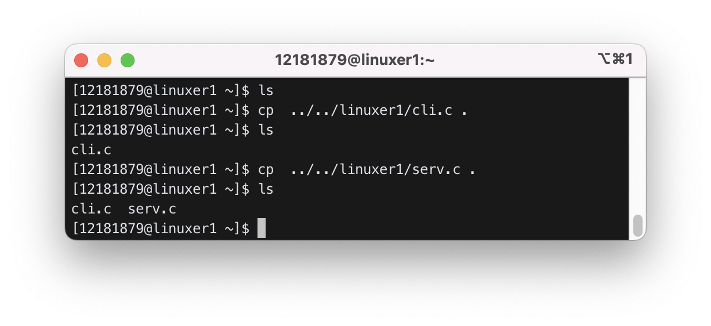
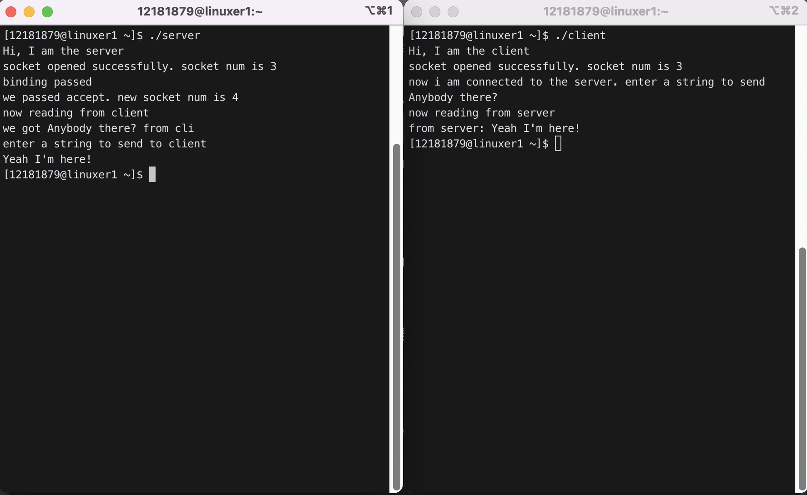
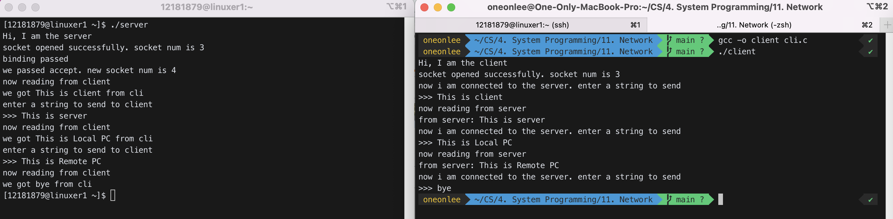
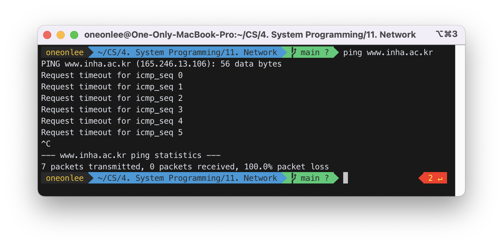
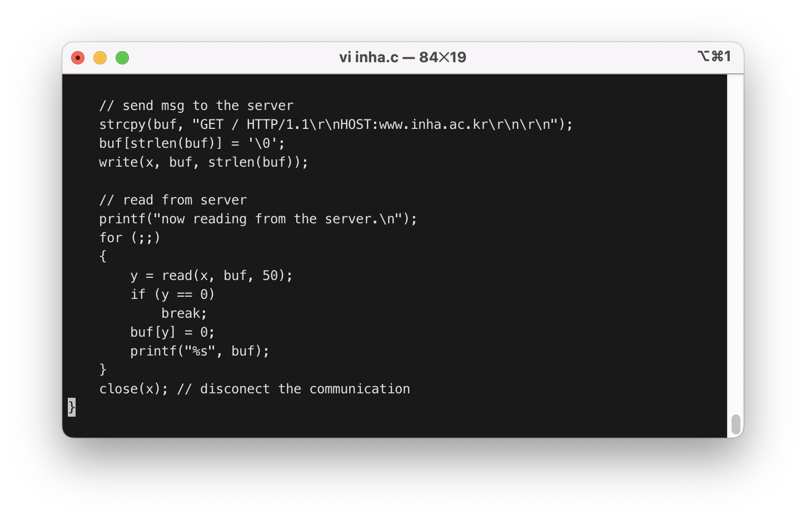
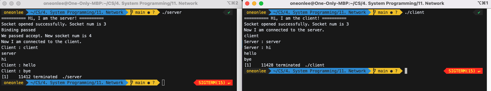
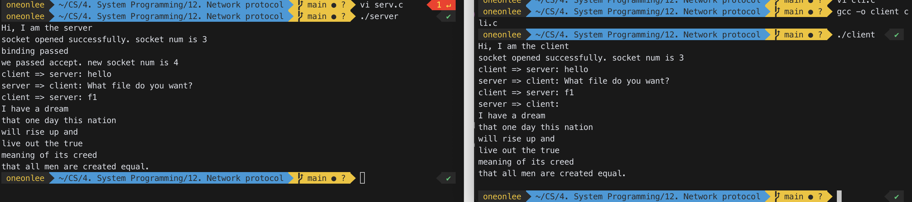

# Socket programming and Protocol

## 0. file vs. socket

### FILE

#### p1:

```c
   x=open("/aa/bb", ...); // find the location of file /aa/bb
   // now x is pointing to the location of /aa/bb
   write(x, "korea", 5);  // write "korea" to the place x is pointing to
```

#### p2:

```c
   y=open("/aa/bb", ...); // find the location of file /aa/bb
   // now y is pointing to the location of /aa/bb
   read(y, buf, 5);
```

### SOCKET

p1 is at 1.1.1.1:8000, p2 is at 2.2.2.2:9000

#### p1:

```c
   x=socket(..........);
   connect(x, 2.2.2.2:9000, ..);  // send connection request to 2.2.2.2:9000
   // now x pointing to 2.2.2.2:9000
   write(x, "korea", 5); // write "korea" to a packet which will be sent to 2.2.2.2:9000
```

#### p2:

```c
   y=socket(....);
   bind(y, 2.2.2.2:9000, ..);
   listen(y, ..);
   y1=accept(y, ...);  // response to connection request
   // now y1 pointing to 1.1.1.1:8000
   read(y1, buf, 5);
```

## 1. socket programming

### client:

```c
#include <stdio.h>
#include <unistd.h>
#include <sys/types.h>
#include <sys/socket.h>
#include <netinet/in.h>
#include <arpa/inet.h>
#include <string.h>
#include <stdlib.h>

#define SERV_TCP_PORT 9948
#define SERV_ADDR "165.246.38.151"

void main(){
   int x,y;
   struct sockaddr_in serv_addr;
   char buf[50];
   printf("Hi, I am the client\n");

   bzero((char *)&serv_addr, sizeof(serv_addr));
   serv_addr.sin_family=PF_INET;
   serv_addr.sin_addr.s_addr=inet_addr(SERV_ADDR);
   serv_addr.sin_port=htons(SERV_TCP_PORT);

   //open a tcp socket
   if ((x=socket(PF_INET, SOCK_STREAM, 0))<0){
      printf("socket creation error\n");
      exit(1);
   }
   printf("socket opened successfully. socket num is %d\n", x);

   //connect to the server
   if (connect(x, (struct sockaddr *)&serv_addr, sizeof(serv_addr)) < 0){
      printf("can't connect to the server\n");
      exit(1);
   }
   // send msg to the server
   printf("now i am connected to the server. enter a string to send\n");
   scanf("%s",buf);
   write(x, buf, strlen(buf));
   // read from server
   printf("now reading from server\n");
   y=read(x, buf, 50);
   buf[y]=0;
   printf("from server: %s\n", buf);
   close(x);  // disconect the communication
}
```

### server:

```c
#include <stdio.h>
#include <unistd.h>
#include <sys/types.h>
#include <sys/socket.h>
#include <netinet/in.h>
#include <arpa/inet.h>
#include <string.h>
#include <stdlib.h>

#define SERV_TCP_PORT 13131
#define SERV_ADDR "165.246.38.151"

void main(){
   int s1,s2, x, y;
   struct sockaddr_in serv_addr, cli_addr;
   char buf[50];
   socklen_t  xx;

   printf("Hi, I am the server\n");

   bzero((char *)&serv_addr, sizeof(serv_addr));
   serv_addr.sin_family=PF_INET;
   serv_addr.sin_addr.s_addr=inet_addr(SERV_ADDR);
   serv_addr.sin_port=htons(SERV_TCP_PORT);

   //open a tcp socket
   if ((s1=socket(PF_INET, SOCK_STREAM, 0))<0){
      printf("socket creation error\n");
      exit(1);
   }
   printf("socket opened successfully. socket num is %d\n", s1);

   // bind ip
   x =bind(s1, (struct sockaddr *)&serv_addr, sizeof(serv_addr));
   if (x < 0){
      printf("binding failed\n");
      exit(1);
   }
   printf("binding passed\n");
   listen(s1, 5);
   xx = sizeof(cli_addr);
   s2 = accept(s1, (struct sockaddr *)&cli_addr, &xx);
   printf("we passed accept. new socket num is %d\n", s2);

   // read msg from client
   printf("now reading from client\n");
   y=read(s2, buf, 50);
   buf[y]=0;
   printf("we got %s from cli\n", buf);
   // send msg to the client
   printf("enter a string to send to client\n");
   scanf("%s", buf);
   write(s2, buf, strlen(buf));
   close(s2);   // disconnect the connection
   close(s1);   // close the original socket
}
```

## 2. socket system calls

Assume src ip=2.2.2.2, src port=2000, dest ip=3.3.3.3, dest port=3000.

```c
x=socket();  // in client
```

The client system will allocate a socket structure which has<br>

```c
x ={my ip, my port, remote ip, remote port, input buffer, output buffer}
```

`x` is the socket id.

```c
connect(x, &serv_addr, ...);  // in client
```

The client system fills in the socket structure and sends a connection request packet to the server.

```c
x={my ip=2.2.2.2, my port=2000, remote ip=3.3.3.3, remote port=3000,
        input buffer={}, output buffer={}}
s1 = socket(.......);  // in server
```

The server system will allocate a socket structure which has

```c
s1={my ip, my port, remote ip, remote port, input buffer, output buffer}
```

`s1` is the socket id.

```c
s2=accept(s1, .......);
```

The server system sends back a response packet to the client, make another socket for actual data transmission (the original s1 socket is kept for connection purpose), and fills in the socket structure.

```c
s1={my ip=3.3.3.3, my port=3000, remote ip={}, remote port={},
    input buffer={}, output buffer={}}
s2={my ip=3.3.3.3, my port=3000, remote ip=2.2.2.2,remote port=2000,
    input buffer={}, output buffer={}}

write(x, "korea", 5);  // in client
```

The system fills in the socket x and sends the packet containing "korea" to the server.

```c
x={my ip=2.2.2.2, my port=2000,remote ip=3.3.3.3,remote port=3000,
    input buffer={},output buffer="korea"}

read(s2, buf, n); // in server
```

The system receives the packet from the client in `s2`.

```c
s2={my ip=3.3.3.3,my port=3000, remote ip=2.2.2.2, remote port=2000,
    input buffer="korea", output buffer={}}
```

And copy "korea" in `buf`.

## 3. protocol

### 1) well-known port

Internet service programs are waiting on well-known ports for service. The client can talk to these service programs by opening a socket on a well-known port and following the corresponding protocol.
21: ftp, 23: telnet, 25: smtp, 80: http, ........................

### 2) SMTP (Simple Mail Transfer Protocol) (rfc 2821) : for sending mail (port 25)

kchang(mail.inha.ac.kr) ==> kchang(mail.inha.ac.kr)

```
S: EHLO 165.246.38.219
R: 250-portal.inha.ac.kr Hello
   250-TURN
   .............
   250 OK
S: MAIL FROM:<kchang@inha.ac.kr>
R: 250 ............... OK
S: RCPT TO:<kchang@mail.inha.ac.kr>
R: 250 ................
S: DATA
R: 354 Start mail input; end with <CRLF>.<CRLF>
S: Blah blah blah...
S: <CRLF>.<CRLF>
R: 250 ..........
S: QUIT
R: Connection closed
```

### 3) POP3 (rfc 1939) : for retrieving mail (port 110)

```
S: USER ****
R: +OK
S: PASS ****
R: +OK
S: stat
R: +OK 1 539
S: list
R: +OK 1 539
S: retr 1
R: +OK
   mail here .........
S: quit
```

### 4) http client/server

#### http client(web browser):

```c
      ..........
      #define SERV_TCP_PORT 80
      #define SERV_ADDR "165.246.10.21"   // www.inha.ac.kr
      ..........
      connect(s, ........);
      write(s, "GET / HTTP/1.0\r\n\r\n", 18);  // 1st msg in http protocol
      read(s, buf, ..);
      .............
```

#### http server(web server):

```c
     ...............
     s1=socket(...);
     bind(s1,...);  // bind on port 80
     listen(s1,...);
     for(;;){
       s2=accept(s1, .....);
       x=fork();
       if (x==0){
            close(s1);
            read(s2, in_buf, n); // read http request
            build_out_buf(in_buf, out_buf);
                                //find the requested html file and return with
                                // a proper header.
            write(s2, out_buf, ....);
            close(s2);
            exit(0);
        } else cose(s2); /
     }
```

## 4. Example

### 0) Copy [cli.c](#client) and [serv.c](#server) from linuxer1(151 server) or linnuxer2(152 server) using cp command as follows.

```bash
$ pwd
/home/sp1/12345
$ cp  ../../linuxer1/cli.c .
$ cp  ../../linuxer1/serv.c .
```



### 1) Adjust port and IP address for both cli.c and serv.c. SERV_ADDR in cli.c and serv.c should be the IP address of the linux server you are using. cli.c will use this SERV_ADDR to access the server while serv.c will use this SERV_ADDR to set its own IP address. Pick a port number in the range of [10000..65535]. You need two putty windows: one for the server and the other for the client. Run the server first and then the client.

(\* Sometimes, you have binding failure when running the server. It happens because the server port number is blocked temporarily. Wait for 10 seconds and retry or use a different port number.)

IP 주소를 올바르게 설정해주고, 포트 번호를 35530으로 설정해주었다.


#### 1-1) Modify cli.c and serv.c such that they can talk in sentence (not just in word as in the current implementation).

```c
   //scanf("%s",buf);
   fgets(buf, 50, stdin);
   buf[strlen(buf)-1] = '\0';
```

msg를 보내는 부분에서 기존에 있던 `scanf` 대신 `fgets`를 사용하여 공백을 포함하여 입력을 받을 수 있도록 하고, 마지막의 개행문자를 없애주었다.



### 2) Modify cli.c and serv.c such that they can keep talking until the client sends "bye". **Use a finite loop.**

- cli.c
  - client가 server에게 메세지를 보내는 부분과 server로부터 메세지를 읽는 부분을 loop로 감싸주었다.
  - server에게 메세지를 보낼 때, 메세지가 "bye"라면 loop를 탈출한다.
  - 탈출한 후에는 `close(x);`를 통해 communication을 disconnect 시켜주었다.

```c
    for (int i; i<10; i++)
    {
        // send msg to the server
        printf("now i am connected to the server. enter a string to send\n>>> ");
        fgets(buf, 50, stdin);
        buf[strlen(buf) - 1] = '\0';
        write(x, buf, strlen(buf));
        if (strcmp(buf, "bye") == 0)
            break;

        // read from server
        printf("now reading from server\n");
        y = read(x, buf, 50);
        buf[y] = 0;
        printf("from server: %s\n", buf);
    }
    close(x); // disconect the communication
```

- serv.c
  - server도 client와 마찬가지로 client로부터 메세지를 읽어오는 부분과 client에게 메세지를 보내는 부분을 loop로 감싸주었다.
  - client로부터 읽어온 메세지가 "bye"라면, loop를 탈출한다.
  - 탈출한 후에는 `close(s2);`를 통해 client와의 connection을 disconnect하고, `close(s1);`를 통해 original socket을 close 한다.

```c
    for (int i; i<10; i++)
    {
        // read msg from client
        printf("now reading from client\n");
        y = read(s2, buf, 50);
        buf[y] = 0;
        printf("we got %s from cli\n", buf);
        if (strcmp(buf, "bye") == 0)
            break;

        // send msg to the client
        printf("enter a string to send to client\n>>> ");
        fgets(buf, 50, stdin);
        buf[strlen(buf) - 1] = '\0';
        write(s2, buf, strlen(buf));
    }
    close(s2); // disconnect the connection
    close(s1); // close the original socket
```


#### 2-1) Try to talk with the other student. Note that one of you would be the client and the other the server. SERV_ADDR and SERV_TCP_PORT in cli.c should match to those in serv.c of the other student. (If you prefer to work alone, modify your cli.c such that it connects to 165.246.38.136 with port number 19924. The server program at 165.246.38.136:19924 will simply echo whatever message you send. You stop the chatting with "bye".)



IP주소를 바꿔서 로컬PC와 원격접속PC와 통신을 하였을 때도 정상작동하였다.

#### 2-2) Modify cli.c such that it connects to Inha web server and read the web page. Inha web server domain name is [www.inha.ac.kr](www.inha.ac.kr) and port number is 80. You can find the IP address for [www.inha.ac.kr](www.inha.ac.kr) with `ping` command. To receive the web page from a web server, use `GET` command (your code should send below string automatically using `write()` function – do not type it by hand):


`ping` 명령어로 [www.inha.ac.kr](www.inha.ac.kr)의 IP address를 확인한 결과 **165.246.13.107**임을 알 수 있었다.

따라서 먼저, cli.c에서 define한 주소와 포트번호를 아래와 같이 수정해주었다.

```c
#define SERV_TCP_PORT 80
#define SERV_ADDR "165.246.13.108" // www.inha.ac.kr
```

다음으로 서버에 메세지를 보낼 때, `strcpy(buf, "GET / HTTP/1.1\r\nHOST:www.inha.ac.kr\r\n\r\n");`로 web page를 요청하였다.

```c
    // send msg to the server
    strcpy(buf, "GET / HTTP/1.1\r\nHOST:www.inha.ac.kr\r\n\r\n");
    buf[strlen(buf)] = '\0';
    write(x, buf, strlen(buf));
```

그리고 web page를 마지막까지 읽을 때까지 `buf`에 `read`하고 `buf`를 출력해서 보여준다.

```c
    // read from server
    printf("now reading from the server.\n");
    for (;;)
    {
        y = read(x, buf, 50);
        if (y == 0)
            break;
        buf[y] = 0;
        printf("%s", buf);
    }
    close(x); // disconect the communication
```





### 3) Modify the code such that the client and the server can talk in any order. Use a finite loop to avoid infinite number of processes.

#### serv.c

```c
    k = fork();
    if (k == 0) // child will keep reading
    {
        printf("Now I am connected to the client.\n");
        chpid = getpid();
        // read msg from client
        for (int c = 0; c < 10; c++)
        {
            y = read(s2, buf, 50 - 1);
            buf[y] = '\0';
            printf("Client : %s\n", buf);

            if (strcmp(buf, "bye") == 0)
            {
                break;
            }
        }
        kill(getppid(), 15); // kill parent process
    }
    else // parent keep writing
    {
        // send msg to the client
        for (int p = 0; p < 10; p++)
        {
            // printf("Server : ");
            fgets(buf, 50 - 1, stdin);
            buf[strlen(buf) - 1] = '\0';
            write(s2, buf, strlen(buf));
            if (strcmp(buf, "bye") == 0)
            {
                kill(chpid, 15); // kill child process
                break;
            }
        }
    }
```

#### cli.c

```c

    k = fork();
    if (k == 0) // child will keep writing
    {
        chpid = getpid();
        // send msg to the server
        printf("Now I am connected to the server.\n");
        for (int c = 0; c < 10; c++)
        {
            // printf("Client : ");
            fgets(buf, 50 - 1, stdin);
            buf[strlen(buf) - 1] = '\0';
            write(x, buf, strlen(buf));
            if (strcmp(buf, "bye") == 0)
            {
                kill(getppid(), 15); // kill parent process
                break;
            }
        }
    }

    else
    {
        // read from server
        for (int p = 0; p < 10; p++)
        {
            y = read(x, buf, 50 - 1);
            buf[y] = '\0';
            printf("Server : %s\n", buf);

            if (strcmp(buf, "bye") == 0)
            {
                break;
            }
        }
        kill(chpid, 15); // kill child process
    }
    close(x); // disconect the communication
```



순서에 상관없이 server와 client간의 채팅을 할 수 있도록 수정하였다.

### 4) Implement simple ftp server and client. If the client doesn't follow the protocol, the server should stop the communication. This is not chatting program. **Do not type "hello", "what file do you want?", etc.** The server and client should automatically send or receive the ftp protocol messages. The user will only provide the file name to download. **Do not use the code from Problem 3, which will make the coding very hard.** Modify the code from Problem 1.

```
Simple ftp protocol

client => server: hello
server => client: what file do you want?
client => server: file name
server => client: file contents
```

#### serv.c

```c
#include <stdio.h>
#include <unistd.h>
#include <fcntl.h>
#include <sys/stat.h>
#include <sys/types.h>
#include <sys/socket.h>
#include <netinet/in.h>
#include <arpa/inet.h>
#include <string.h>
#include <stdlib.h>

#define SERV_TCP_PORT 32330
#define SERV_ADDR "165.246.240.109"//"192.168.50.122"//"165.246.38.151"

int main(){
   int s1,s2, x, y;
   struct sockaddr_in serv_addr, cli_addr;
   char buf[50];
   char fileName[50];
   socklen_t  xx;

   printf("Hi, I am the server\n");

   bzero((char *)&serv_addr, sizeof(serv_addr));
   serv_addr.sin_family=PF_INET;
   serv_addr.sin_addr.s_addr=inet_addr(SERV_ADDR);
   serv_addr.sin_port=htons(SERV_TCP_PORT);

   //open a tcp socket
   if ((s1=socket(PF_INET, SOCK_STREAM, 0))<0){
      printf("socket creation error\n");
      exit(1);
   }
   printf("socket opened successfully. socket num is %d\n", s1);

   // bind ip
   x =bind(s1, (struct sockaddr *)&serv_addr, sizeof(serv_addr));
   if (x < 0){
      printf("binding failed\n");
      exit(1);
   }
   printf("binding passed\n");
   listen(s1, 5);
   xx = sizeof(cli_addr);
   s2 = accept(s1, (struct sockaddr *)&cli_addr, &xx);
   printf("we passed accept. new socket num is %d\n", s2);
   // read msg from client
   y=read(s2, buf, 50);
   buf[y]=0;
   printf("client => server: %s\n", buf);

   if (strcmp(buf, "hello") == 0) {
      char * init_response = "What file do you want?";
      write(s2, init_response, strlen(init_response));
      printf("server => client: %s\n", init_response);

      wait(0);

      // read name of the file from client
      y=read(s2, fileName, 50);
      fileName[y]=0;
      printf("client => server: %s\n", fileName);

      // send contents of the file
      int fd = open(fileName, O_RDONLY, 00777);

      for(;;) {
         y = read(fd, buf, 50);
         if (y==0) break;
         buf[y] = '\0';
         write(s2, buf, strlen(buf));
         printf("%s", buf);
      }
      char * endString = "END";
      write(s2, endString, strlen(endString));
   }
   close(s2);   // disconnect the connection
   close(s1);   // close the original socket

   return 0;
}
```

#### cli.c

```c
#include <stdio.h>
#include <unistd.h>
#include <sys/types.h>
#include <sys/socket.h>
#include <netinet/in.h>
#include <arpa/inet.h>
#include <string.h>
#include <stdlib.h>

#define SERV_TCP_PORT 32330
#define SERV_ADDR "165.246.240.109"//"192.168.50.122"//"165.246.38.151"

int main(){
   int x,y;
   struct sockaddr_in serv_addr;
   char buf[50];
   printf("Hi, I am the client\n");

   bzero((char *)&serv_addr, sizeof(serv_addr));
   serv_addr.sin_family=PF_INET;
   serv_addr.sin_addr.s_addr=inet_addr(SERV_ADDR);
   serv_addr.sin_port=htons(SERV_TCP_PORT);

   //open a tcp socket
   if ((x=socket(PF_INET, SOCK_STREAM, 0))<0){
      printf("socket creation error\n");
      exit(1);
   }
   printf("socket opened successfully. socket num is %d\n", x);

   //connect to the server
   if (connect(x, (struct sockaddr *)&serv_addr, sizeof(serv_addr)) < 0){
      printf("can't connect to the server\n");
      exit(1);
   }

   // send msg to the server
   printf("client => server: ");
   char * init_request = "hello";
   write(x, init_request, strlen(init_request));
   printf("%s\n", init_request);

   // read from server
   y=read(x, buf, 50);
   buf[y]=0;
   printf("server => client: %s\n", buf);

   if (strcmp(buf, "What file do you want?") == 0) {
      printf("client => server: ");

      // send name of the file to the server
      fgets(buf, 50, stdin);
      buf[strlen(buf)-1] = '\0';
      write(x, buf, strlen(buf));

      // receive contents of the file
      char * endString = "END";
      printf("server => client: \n");
      for(;;) {
        y=read(x, buf, 50);
        buf[y]='\0';
        if (strcmp(endString, buf) == 0){
          printf("\n");
          break;
        }
        printf("%s", buf);
      }
   }
   close(x);  // disconect the communication
}
```



### 5) Modify your ftp server such that it can handle multiple clients at the same time.

serv.c

```c
       // open socket, bind, lisen
       ........................
       // now wait for clients
       for(i=0;i<20;i++){
            s2=accept(s1, .............);
            // now we have a new client. make a child to handle it
            ch=fork();
            if (ch==0){ // this child will handle the newly arrived client
                  // process simple ftp protocol
                  ...............
                  close(s1);
                  close(s2);
                  exit(0);  // child has completed the mission. exit now.
            }
         }
```


#### serv.c

```c
#include <stdio.h>
#include <unistd.h>
#include <fcntl.h>
#include <sys/stat.h>
#include <sys/types.h>
#include <sys/socket.h>
#include <netinet/in.h>
#include <arpa/inet.h>
#include <string.h>
#include <stdlib.h>

#define SERV_TCP_PORT 32330
#define SERV_ADDR "172.30.1.29"

int main()
{
   int s1, s2, x, y, ch;
   struct sockaddr_in serv_addr, cli_addr;
   char buf[50];
   char fileName[50];
   socklen_t xx;

   printf("Hi, I am the server\n");

   bzero((char *)&serv_addr, sizeof(serv_addr));
   serv_addr.sin_family = PF_INET;
   serv_addr.sin_addr.s_addr = inet_addr(SERV_ADDR);
   serv_addr.sin_port = htons(SERV_TCP_PORT);

   // open a tcp socket
   if ((s1 = socket(PF_INET, SOCK_STREAM, 0)) < 0)
   {
      printf("socket creation error\n");
      exit(1);
   }
   printf("socket opened successfully. socket num is %d\n", s1);

   // bind ip
   x = bind(s1, (struct sockaddr *)&serv_addr, sizeof(serv_addr));
   if (x < 0)
   {
      printf("binding failed\n");
      exit(1);
   }
   printf("binding passed\n");

   // listen
   listen(s1, 5);
   xx = sizeof(cli_addr);

   // now wait for clients
   for (int i = 0; i < 20; i++)
   {
      s2 = accept(s1, (struct sockaddr *)&cli_addr, &xx);
      printf("we passed accept. new socket num is %d\n", s2);

      // now we have a new client. make a child to handle it
      ch = fork();
      if (ch == 0)
      { // this child will handle the newly arrived client
         // process simple ftp protocol

         // read msg from client
         y = read(s2, buf, 50);
         buf[y] = 0;
         printf("client => server: %s\n", buf);

         if (strcmp(buf, "hello") == 0)
         {
            char *init_response = "What file do you want?";
            write(s2, init_response, strlen(init_response));
            printf("server => client: %s\n", init_response);

            wait(0);

            // read name of the file from client
            y = read(s2, fileName, 50);
            fileName[y] = 0;
            printf("client => server: %s\n", fileName);

            // send contents of the file
            int fd = open(fileName, O_RDONLY, 00777);

            for (;;)
            {
               y = read(fd, buf, 50);
               if (y == 0)
                  break;
               buf[y] = '\0';
               write(s2, buf, strlen(buf));
               printf("%s", buf);
            }
            buf[0] = -1;
            write(s2, buf, 1);
         }
         close(s2); // disconnect the connection
         close(s1); // close the original socket
         exit(0);   // child has completed the mission. exit now.
      }
   }
   return 0;
}
```

#### cli.c

```c
#include <stdio.h>
#include <unistd.h>
#include <sys/types.h>
#include <sys/socket.h>
#include <netinet/in.h>
#include <arpa/inet.h>
#include <string.h>
#include <stdlib.h>

#define SERV_TCP_PORT 32330
#define SERV_ADDR "172.30.1.29" //"165.246.240.109"//"192.168.50.122"//"165.246.38.151"

int main()
{
   int x, y;
   struct sockaddr_in serv_addr;
   char buf[50];
   printf("Hi, I am the client\n");

   bzero((char *)&serv_addr, sizeof(serv_addr));
   serv_addr.sin_family = PF_INET;
   serv_addr.sin_addr.s_addr = inet_addr(SERV_ADDR);
   serv_addr.sin_port = htons(SERV_TCP_PORT);

   // open a tcp socket
   if ((x = socket(PF_INET, SOCK_STREAM, 0)) < 0)
   {
      printf("socket creation error\n");
      exit(1);
   }
   printf("socket opened successfully. socket num is %d\n", x);

   // connect to the server
   if (connect(x, (struct sockaddr *)&serv_addr, sizeof(serv_addr)) < 0)
   {
      printf("can't connect to the server\n");
      exit(1);
   }

   // send msg to the server
   printf("client => server: ");
   char *init_request = "hello";
   write(x, init_request, strlen(init_request));
   printf("%s\n", init_request);

   // read from server
   y = read(x, buf, 50);
   buf[y] = 0;
   printf("server => client: %s\n", buf);

   if (strcmp(buf, "What file do you want?") == 0)
   {
      printf("client => server: ");

      // send name of the file to the server
      fgets(buf, 50, stdin);
      buf[strlen(buf) - 1] = '\0';
      write(x, buf, strlen(buf));

      // receive contents of the file
      char *endString = "END";
      printf("server => client: \n");
      for (;;)
      {
         y = read(x, buf, 50);
         buf[y] = '\0';
         if (buf[y - 1] == -1)
         {
            buf[y - 1] = ' ';
            printf("%s", buf);
            break;
         }
         printf("%s", buf);
      }
   }
   close(x); // disconect the communication
}

```

### 6) Write a client in your PC as follows and let it talk to the server program in the lab server. To compile the client program:

- Make an empty c++ project and copy the code given below.
- Adjust the server IP and port number
- Select
  - “project->project property->manifest tools->input and output->include manifest” and set “No”
- add ws2_32.lib in project>project property>link>input>additional dependencies
- Select build->Solution Build
- You should see “Success 1” at the bottom of the compile window.

```c
#define _CRT_SECURE_NO_WARNINGS
#include "winsock2.h"
#include "ws2tcpip.h"
#include "stdio.h"

#define SERVER_PORT 9924  // server port number
#define BUF_SIZE 4096 // block transfer size
#define QUEUE_SIZE 10
#define IPAddress "165.246.38.152" // server IP address

int main()
{
	WORD		        wVersionRequested;
	WSADATA		wsaData;
	SOCKADDR_IN          target; //Socket address information
	SOCKET		        s;
	int			err;
	int			bytesSent;
	char		        buf[100];

	   //--- INITIALIZATION -----------------------------------
	   wVersionRequested = MAKEWORD( 1, 1 );
	   err = WSAStartup( wVersionRequested, &wsaData );

	   if ( err != 0 ) {
		printf("WSAStartup error %ld", WSAGetLastError() );
		WSACleanup();
		return false;
	   }
	   //------------------------------------------------------

	   //---- Build address structure to bind to socket.--------
	   target.sin_family = AF_INET; // address family Internet
	   target.sin_port = htons (SERVER_PORT); //Port to connect on
	   inet_pton(AF_INET, IPAddress, &(target.sin_addr.s_addr)); // target IP
           //--------------------------------------------------------


	   // ---- create SOCKET--------------------------------------
	   s = socket (AF_INET, SOCK_STREAM, IPPROTO_TCP); //Create socket
	   if (s == INVALID_SOCKET)
	   {
		printf("socket error %ld" , WSAGetLastError() );
		WSACleanup();
		return false; //Couldn't create the socket
	   }
	   //---------------------------------------------------------


	   //---- try CONNECT -----------------------------------------
	   if (connect(s, (SOCKADDR *)&target, sizeof(target)) == SOCKET_ERROR)
	   {
		printf("connect error %ld", WSAGetLastError() );
		WSACleanup();
		return false; //Couldn't connect
	   }
	   //-------------------------------------------------------

	   //---- SEND bytes -------------------------------------------
	   printf("enter a string to send to server\n");
	   gets_s(buf, 99);
	   bytesSent = send( s, buf, strlen(buf), 0 ); // use "send" in windows
	   printf( "Bytes Sent: %ld \n", bytesSent );

           // now receive
	   int n;
	   n=recv(s, buf, 50, 0); // read max 50 bytes
	   buf[n]=0; // make a string
	   printf("received: %s\n", buf);

	   //--------------------------------------------------------
	   closesocket( s );
	   WSACleanup();

	   return 0;
}
```

#### Client_win.c

```c
#include <stdio.h>
#include <winsock2.h>
#include <ws2tcpip.h>

#define BUFFER_SIZE 100
#define SERV_ADDR "165.246.38.152"
#define SERV_PORT 13579

int main(void) {
    printf("Hi, I am the client.\n");

    WORD wVersionRequired = MAKEWORD(2, 2);
    WSADATA wsaData;

    int result = WSAStartup(wVersionRequired, &wsaData);
    if (result != 0) {
        printf("WSAStartup failed with error: %d\n", result);
        return 1;
    }

    SOCKADDR_IN servAddr;
    ZeroMemory(&servAddr, sizeof(servAddr));
    servAddr.sin_family = AF_INET;
    servAddr.sin_port = htons(SERV_PORT);
    inet_pton(AF_INET, SERV_ADDR, &servAddr.sin_addr);

    SOCKET connectSocket = socket(AF_INET, SOCK_STREAM, IPPROTO_TCP);
    if (connectSocket == INVALID_SOCKET) {
        printf("socket failed with error: %d\n", WSAGetLastError());
        WSACleanup();
        return 1;
    }

    if (connect(connectSocket, (SOCKADDR*) &servAddr, sizeof(servAddr)) == SOCKET_ERROR) {
        printf("Unable to connect to server!\n");
        closesocket(connectSocket);
        WSACleanup();
        return 1;
    }

    char buf[BUFFER_SIZE];
    printf("Enter a string to send to server: ");
    fgets(buf, BUFFER_SIZE, stdin);
    buf[strlen(buf) - 1] = '\0';
    int bytesSent = send(connectSocket, buf, (int) strlen(buf), 0);
    printf("Bytes Sent: %d\n", bytesSent);

    int bytesReceived = recv(connectSocket, buf, BUFFER_SIZE - 1, 0);
    buf[bytesReceived] = 0;
    printf("Received: %s\n", buf);

    closesocket(connectSocket);
    WSACleanup();
    return 0;
}
```

Server(Linux):

```bash
$ ./server
Hi, I am the server.
Server socket(sfd=3) is created.
Client socket(cfd=4) is accepted.
receive: Hi, Linux
Hi, Windows
```

Client(Windows 10):

```text
Hi, I am the client.
Enter a string to send to server: Hi, Linux
Bytes Sent: 9
Received: Hi, Windows
```

Windows에서는 시스템 콜 함수를 사용할 수 없다.
따라서 `fopen`과 같은 라이브러리 함수를 사용해야 한다.

`recv`와 `send`는 추가적으로 마지막 인자 `flags`를 받는데 이를 0으로 설정하면 아무 값도 설정하지 않은 것(기본값)을 취급된다.

또한, Windows의 소켓 프로그래밍에서는 `WSAStartup`와 `WSACleanup`을 프로그램 시작과 끝에 호출해야 한다.

### 7) Write an ftp client in your PC and let it talk to the ftp server you made in problem 5). Use this client to download a file from the lab server.

#### Client_win.c

```c
#include <stdio.h>
#include <winsock2.h>
#include <ws2tcpip.h>

#define BUFFER_SIZE 100
#define SERV_ADDR "165.246.38.152"
#define SERV_PORT 13579

int main() {
    WORD wVersionRequired = MAKEWORD(2, 2);
    WSADATA wsaData;

    int result = WSAStartup(wVersionRequired, &wsaData);
    if (result != 0) {
        printf("WSAStartup failed with error: %d\n", result);
        return 1;
    }

    SOCKADDR_IN servAddr;
    ZeroMemory(&servAddr, sizeof(servAddr));
    servAddr.sin_family = AF_INET;
    servAddr.sin_port = htons(SERV_PORT);
    inet_pton(AF_INET, SERV_ADDR, &servAddr.sin_addr);

    SOCKET connectSocket = socket(AF_INET, SOCK_STREAM, IPPROTO_TCP);
    if (connectSocket == INVALID_SOCKET) {
        printf("socket failed with error: %d\n", WSAGetLastError());
        WSACleanup();
        return 1;
    }

    if (connect(connectSocket, (SOCKADDR*) &servAddr, sizeof(servAddr)) == SOCKET_ERROR) {
        printf("Unable to connect to server!\n");
        closesocket(connectSocket);
        WSACleanup();
        return 1;
    }

    char* init_request = "hello";
    send(connectSocket, init_request, (int) strlen(init_request), 0);
    printf("client => server: hello\n");

    char buf[BUFFER_SIZE];
    int chunk = recv(connectSocket, buf, BUFFER_SIZE - 1, 0);
    buf[chunk] = '\0';
    printf("server => client: %s\n", buf);
    recv(connectSocket, buf, 1, 0); // consume EOF character

    while (1) {
        printf("client => server: ");
        fgets(buf, BUFFER_SIZE - 1, stdin);
        buf[strlen(buf) - 1] = '\0';
        send(connectSocket, buf, strlen(buf), 0);

        if (strcmp(buf, "bye") == 0) {
            break;
        }

        FILE* stream = fopen(buf, "w");
        while (1) {
            chunk = recv(connectSocket, buf, BUFFER_SIZE - 1, 0);
            if (buf[chunk - 1] == -1) {
                buf[chunk - 1] = '\0';
                fprintf(stream, "%s", buf);
                break;
            } else {
                buf[chunk] = '\0';
                fprintf(stream, "%s", buf);
            }
        }
        fclose(stream);
        printf("server => client: File Downloaded.\n");
    }

    closesocket(connectSocket);
    WSACleanup();
    return 0;
}
```

Server(Linux):

```bash
$ ./server
Hi, I am the FTP server.
Server socket(sfd=3) is created.
Client socket(cfd=4) is accepted.
client => server: hello
server => client: What file do you want?
client => server: f1
server => client: I have a dream
that one day this nation
will rise up and
live out the true
meaning of its creed
that all men are created equal.

client => server: bye
```

Client(Windows 10):

```text
client => server: hello
server => client: What file do you want?
client => server: f1
server => client: File Downloaded.
client => server: bye
```

Visual Studio 2019에서는 `fopen` 사용 시 컴파일 오류가 나기 때문에 전처리기에 `_CRT_SECURE_NO_WARNINGS` 옵션을 줘서 해결해야 한다.

위에서 정의한 Simple FTP에서는 버퍼보다 큰 파일이 들어올 경우를 대비해 -1을 EOF 문자로 지정해 파일을 읽어오는데, `init_request`에 대한 응답으로 서버에서 읽어오는 값의 마지막 -1을 `recv(connectSocket, buf, 1, 0);`으로 지워줘야한다.

파일을 저장할 때는 `fopen`을 이용해 열고 `fprintf`으로 파일 내용을 작성했다.
