# Installing/Reading Linux Kernel

## 1. What's in the linux kernel


### init: start up code

- main.c : beginning of linux

### kernel: cpu-indendent code for basic system management

- fork.c, exit.c, sched.c : process creation, exit, scheduling

### arch : cpu-dependent code for basic system management

- arch/x86 : cpu-dependent code for intel x86 cpu
- arch/x86/boot : boot-related code
- arch/x86/kernel: low-level intel cpu code for initialization, interrupt handling, etc
  - entry_32.S : code for interrupt entry point
  - head_32.S : code for system initialization
  - i8259_32.c : code for interrupt controller
  - irq_32.c : code for IRQ
  - process_32.c : code for process control
  - time_32.c : code for timer
  - traps_32.c : code for exception handling
  - signal_32.c : code for signal handling

### fs: file system code

- open.c, read_write.c, file.c, ... : fs system call handling
- inode.c : inode handling
- fs/ext2 : ext2 file system code
- fs/ntfs : windows NT file system code

## mm : memory management code

## net: network handling code

## drivers: device handling code

## include : include files

- inclde/asm-x86 : include files for intel cpu specific code

## ipc: code for inter-process communication

# 2. Linux starting location: init/main.c: start_kernel()

# 3. Background

1. Linux is the first program that runs when the system boots.

2. Linux begins at init/main.c/start_kernel().

3. Linux uses `printk` (not "printf") to display messages.

4. All booting messages are displayed by Linux with `printk` and you can find the corresponding Linux code that prints each boot message.

5. All boot messages are stored in the kernel buffer and you can display this buffer with `dmesg` command.

6. Find Linux code that prints the first boot message.

# 4. Exercise

## 1. Install Gentoo Linux on virtual machine.

### 1.0) Download Virtualbox from Internet and install.

https://www.virtualbox.org/wiki/Downloads

### 1.1) Download Gentoo virtualbox files (gentoo.zip) and un-compress it.

### 1.2) Run VirtualBox, and click File>Import and go to the gentoo directory. Select Gentoo2.ovf. Uncheck USB controller. Select Import. This will install Gentoo Linux on your virtual box.

### 1.3) Run Gentoo.

If you have an error, run VirutalBox as administrator and try again. For USB error, simply disable usb controller in "Setting" tab. For Hyper-V error (Raw-mode is unavailable), turn off Hyper-V feature in control panel>program and feature>window feature. Select My Linux. Login as root and hit Enter for the password prompt. If VirtualBox still cannot open the session, you need to look at the log file (right click on Gentoo VM and select “log file”) and see what is the error and fix it.
(In some cases, you may need to download and install virtualbox extension package.)

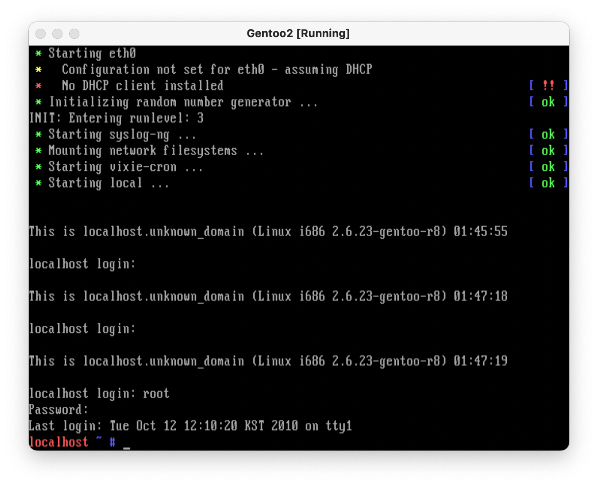

### 1.4) Make a simple program, ex1.c, with vi which displays "hello world". Compile and run it.

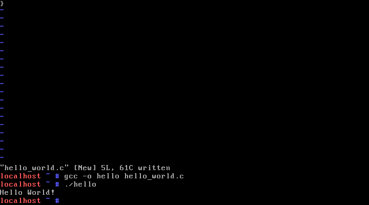

## 2. Go to linux-2.6.25.10 directory and find all the files referred in Section 1 such as main.c, fork.c, entry_32.S, etc.

### `main.c`

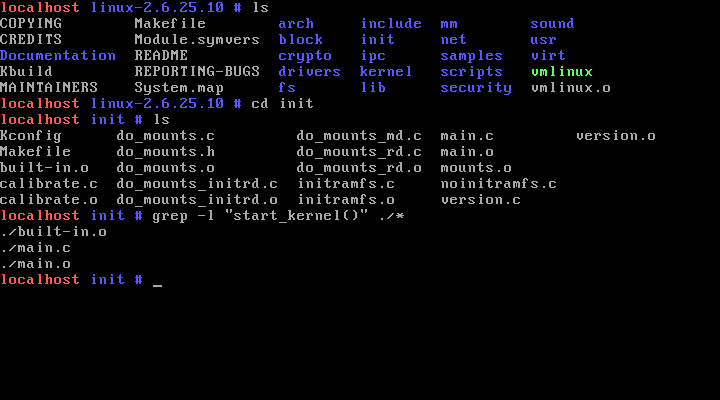

main.c는 init 폴더에 있으며 리눅스의 시작점이다.
start_kernel() 함수도 main.c에 위치한다.

## `fork.c`

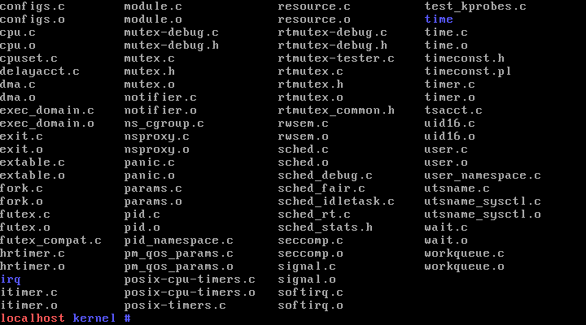
fork.c는 kernel 폴더에 있으며 이 폴더에는 프로세스와 관련된 파일이 있다.

## `entry_32.S`

```bash
find / -name entry_32.S -type f
```

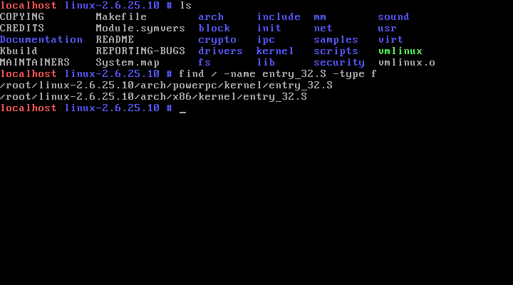
`find` 명령어를 통해 entry_32.S의 위치를 찾아보면
entry_32.S는 "arch/x86/kernel"와 "arch/powerpc/kernel"에 있다. 이 중 "x86" 폴더에는 아키텍처마다 다르게 동작하는 함수들이 담겨있으며 "x86"은 인텔의 32비트 아키텍처를 의미한다.

## 3. Find the location of start_kernel().

To find a string "start_kernel", go to the linux top directory (linux-2.6.25.10) and do

```bash
$ grep -nr "start_kernel" * | more
```

Use `"space"` to move down the screen, `q` to exit

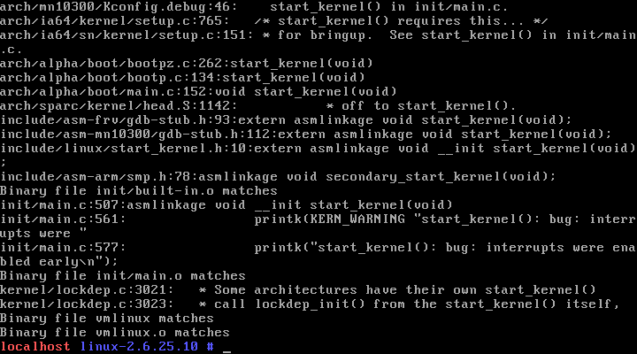

Once you found the file that has "start_kernel", use `vi` to read the file.

In vi, type `/start_kernel` to search for the first instance of "start_kernel".

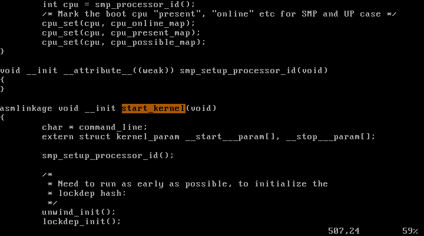

For the next string, simply type "/". Repeat "/" until you find the `start_kernel()` function.

Use "j" to mode down the cursor, "k" to move up, "^f" to move one screen down, "^b" to move  
up one screen up.

## 4. `start_kernel()` is the first C function run by Linux. <br>Predict what will be the first message appearing on the screen by analyzing `start_kernel()`. <br>Note that `printk()` (**not** `printf`) is the function to print something in the kernel. <br>Confirm your prediction with `dmesg > x` and `vi x`. <br>The kernel remembers the booting message in the system buffer and dmesg displays the content of this buffer to the screen. <br>`dmesg > x` will send the booting message to file `x`. <br>With `vi x` you can look at the file `x`.

`start_kernel()` 함수의 내용은 다음과 같다.

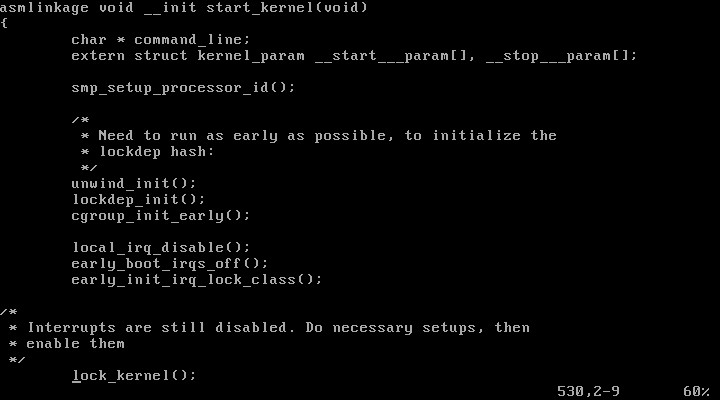
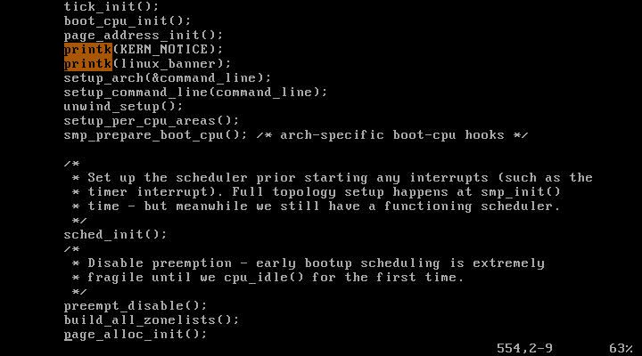
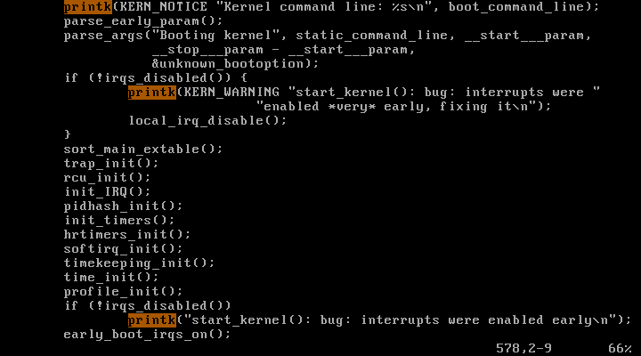
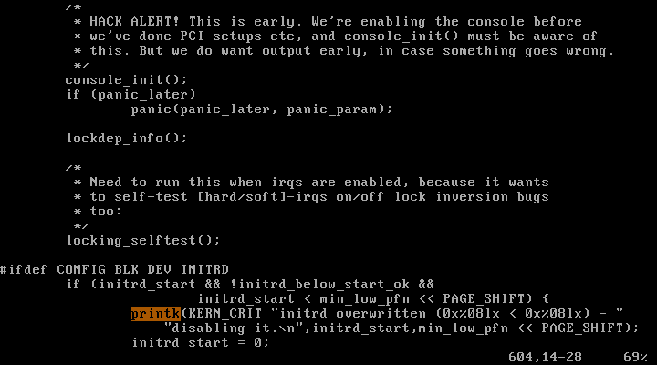
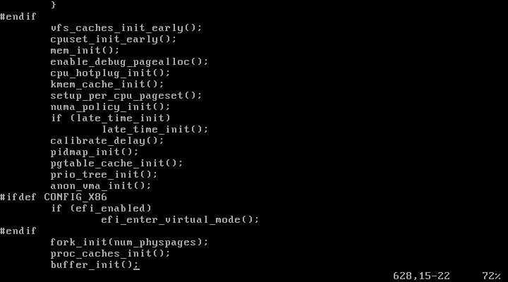
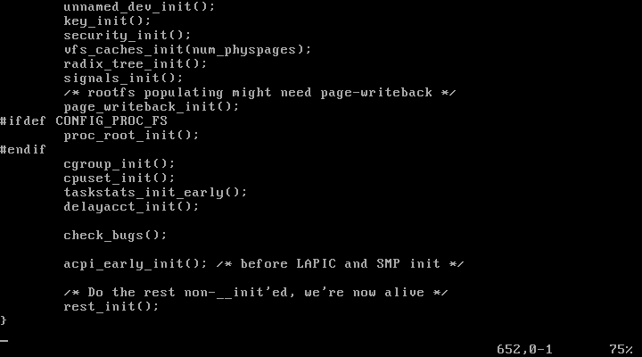

이 중 가장 먼저 `printk`가 사용된 부분은 아래와 같다.

```c
printk(KERNEL_NOTICE);
printk(linux_banner);
```

첫 번째 출력은 위 두 함수 호출로 `KERN_NOTICE`는 출력의 로그 레벨을 설정하는 기호로 다음 출력이 정상적인 정보에 해당하는 로그임을 나타낸다. 그렇다면 `linux_banner`가 진짜 출력인데 해당 값이 정의된 `init/version.c`으로 가면 아래와 같이 리눅스의 버전과 컴파일 환경을 출력하는 문자열이 구성되어 있다.

init/version.c:

```c
/* FIXED STRINGS! Don't touch! */
const char linux_banner[] =
    "Linux version " UTS_RELEASE " (" LINUX_COMPILE_BY "@"
    LINUX_COMPILE_HOST ") (" LINUX_COMPILER ") " UTS_VERSION "\n";
```

따라서 리눅스가 부팅되면 리눅스의 버전과 컴파일 환경이 가장 먼저 출력될 것이다.

`dmesg > x`를 통해 부팅 메세지를 확인해본 결과는 아래와 같다.

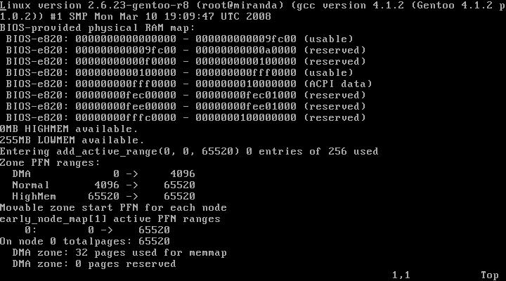

리눅스 버전과 GCC 정보가 가장 먼저 출력된다.

## 5. Find the location of the following functions called in start_kernel() and briefly explain your guessing about what each function is doing (but do not copy the whole code).

### `trap_init()`

```bash
$ grep -nr "trap_init" * | more
```

`linux-2.6.25.10/arch/x86/`에서 위 명령어로 "trap_init"을 찾아보았다.

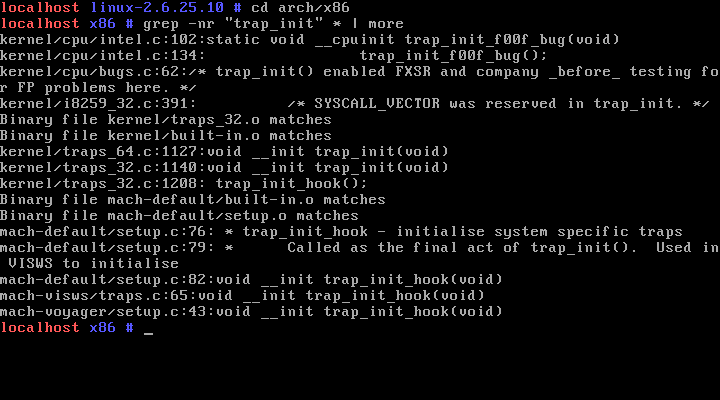

`arch/x86/kernel/traps_64.c:1127`와 `arch/x86/kernel/traps_32.c:1140`에서 `void __init trap_init(void)`가 사용된 것을 확인할 수 있다.

```bash
$ vi kernel/traps_32.c
```

위 명령어를 통해 `traps_32.c` 파일의 `trap_init(void)` 함수를 살펴보았다.

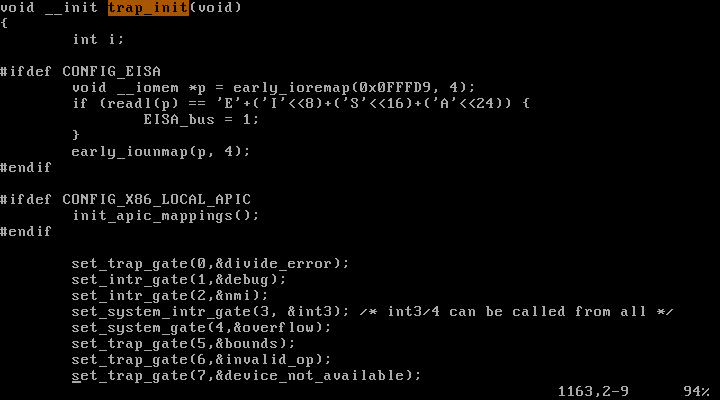

```c
set_trap_gate(0,&divide_error);
set_intr_gate(1,&debug);
set_intr_gate(2,&nmi);
set_system_intr_gate(3, &int3); /* int3/4 can be called from all */
set_system_gate(4,&overflow);
set_trap_gate(5,&bounds);
set_trap_gate(6,&invalid_op);
set_trap_gate(7,&device_not_available);
set_task_gate(8,GDT_ENTRY_DOUBLEFAULT_TSS);
set_trap_gate(9,&coprocessor_segment_overrun);
set_trap_gate(10,&invalid_TSS);
set_trap_gate(11,&segment_not_present);
set_trap_gate(12,&stack_segment);
set_trap_gate(13,&general_protection);
set_intr_gate(14,&page_fault);
set_trap_gate(15,&spurious_interrupt_bug);
set_trap_gate(16,&coprocessor_error);
set_trap_gate(17,&alignment_check);
```

`trap_init()` 함수에는 위와 같이 set 함수가 나열되어 있다. 이것으로 유추해본다면, 시스템콜을 위한 셋팅이 이루어지는 것 같다.

### `init_IRQ()`

```bash
$ grep -nr "init_IRQ" * | more
```

`linux-2.6.25.10/arch/x86/`에서 위 명령어로 "init_IRQ"을 찾아보았다.

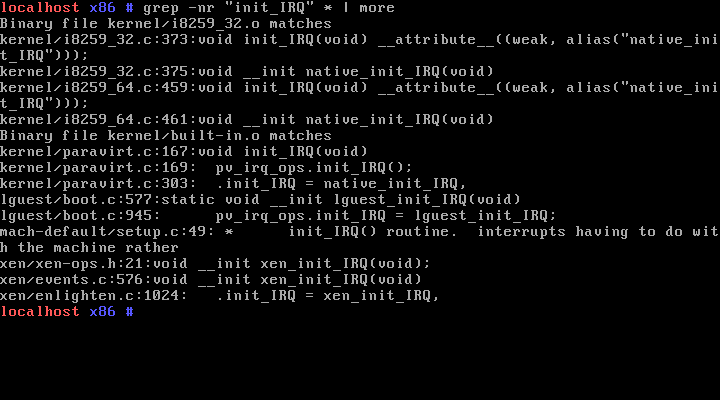

`arch/x86/kernel/paravirt.c:167`에서 `void init_IRQ(void)`가 사용된 것을 확인할 수 있다.

```bash
$ vi kernel/paravirt.c
```


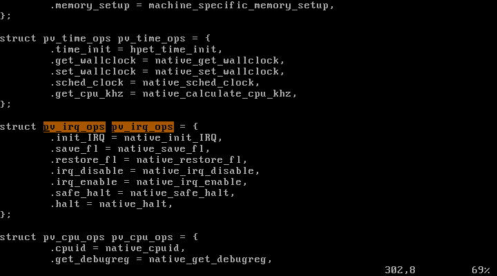
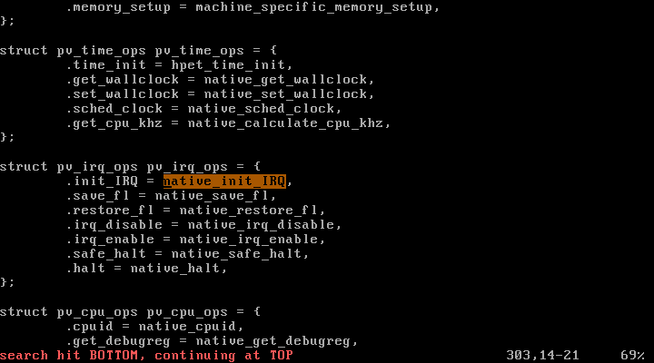

```bash
$ vi kernel/i8259_64.c
```

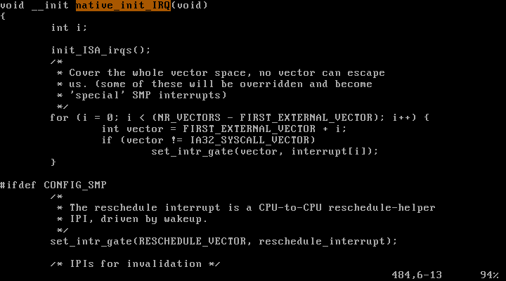

`i8259_64.c`의 `native_init_IRQ(void)` 함수의

```c
...
set_intr_gate(vector, interrupt[i]);
...
```

를 보면, interrupt gate를 초기화하는 것으로 유추해볼 수 있다.

IRQ는 Interrupt ReQuest의 약자로, 인터럽트 신호를 처리하는 데에 쓰이는 컴퓨터 버스 라인의 인터럽트 동작을 말한다.

`init_IRQ()`는 커널 interrupt subsystem의 하드웨어 일부를 초기화하는 것으로 유추할 수 있다.

### `sched_init()`

```bash
$ grep -nr "sched_init(void)" *
```

`linux-2.6.25.10/`에서 위 명령어로 "sched_init"을 찾아보았다.

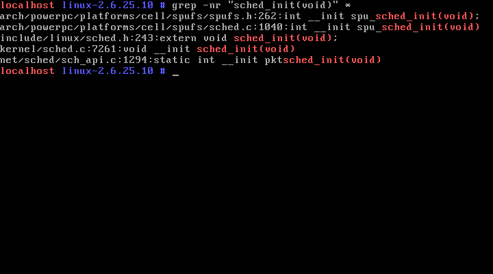

`kernel/sched.c:7261`에서 `void __init sched_init(void)`가 사용된 것을 확인할 수 있다.

```bash
$ vi kernel/sched.c
```

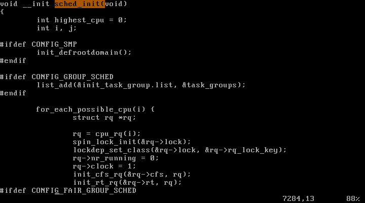

`sched_init(void)`는 init task가 사용하는 CPU 번호를 할당하고 PID HASH TABLE을 초기화한다. 그리고 커널의 내부 타이머가 사용하는 벡터 및 bottom-half handler를 초기화한다.

### `time_init()`

```bash
$ grep -nr "time_init(void)" *
```

`linux-2.6.25.10/arch/x86/`에서 위 명령어로 "time_init"을 찾아보았다.


`arch/x86/kernel/time_32.c:135`와 `arch/x86/kernel/time_64.c:117`에서 `void __init time_init(void)`가 사용된 것을 확인할 수 있다.

```bash
$ vi kernel/time_32.c
```


```bash
$ grep -nr "tsc_init" *
```

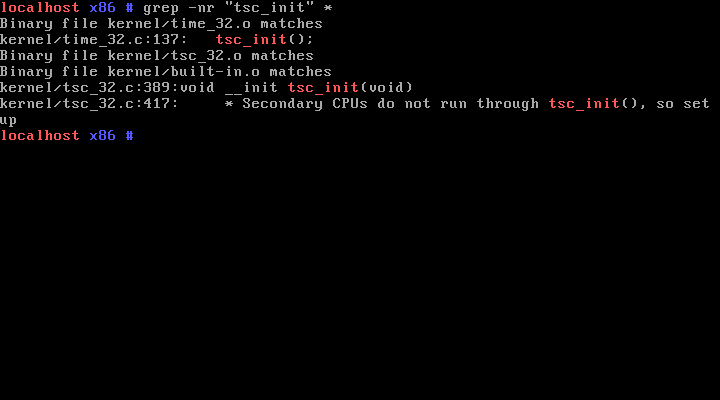

```bash
$ vi kernel/tsc_32.c
```

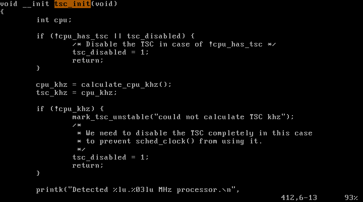

CMOS에서 시간을 읽고 CPU의 속도를 얻어내는 것으로 추측할 수 있다.

### `console_init()`

```bash
$ grep -nr "__init console_init(void)" *
```

`linux-2.6.25.10/`에서 위 명령어로 "console_init"을 찾아보았다.

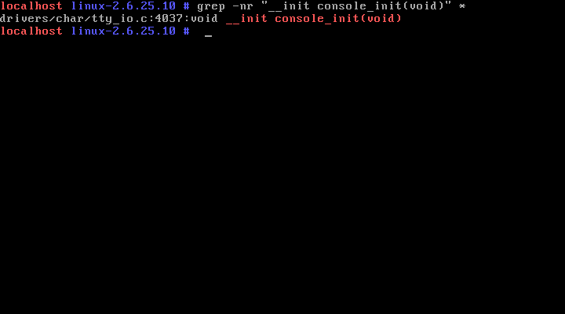

`drivers/char/tty_io.c:4037`에 `void __init console_init(void)` 함수가 사용된 것을 확인할 수 있다.

```bash
$ vi drivers/char/tty_io.c
```

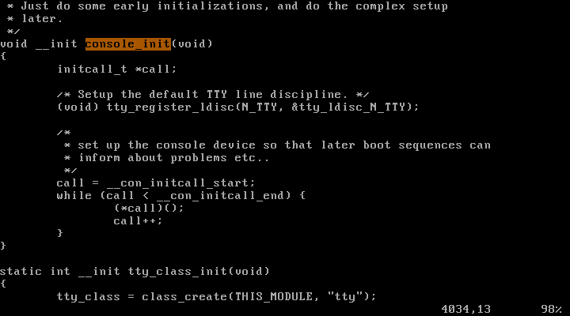

커널의 직렬 콘솔 디바이스가 사용하도록 구성된 경우 초기화를 수행한다.

### `mem_init()`

```bash
$ grep -nr "mem_init" *
```

`linux-2.6.25.10/`에서 위 명령어로 "mem_init"을 찾아보았다.

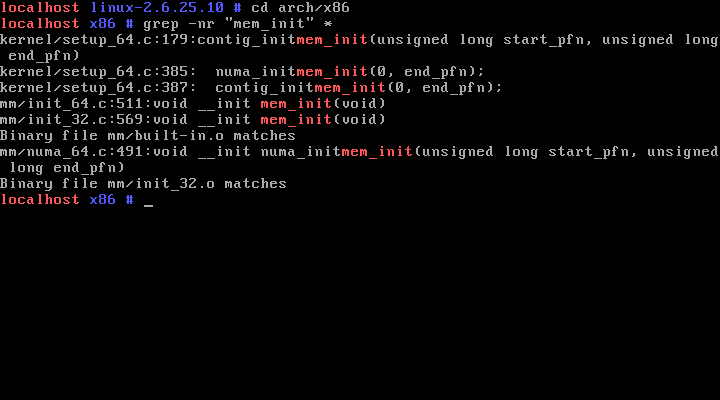

`arch/x86/mm/init_64.c:511`와 `arch/x86/mm/init_32.c:569`에서 `void __init mem_init(void)`가 사용된 것을 확인할 수 있다.

```bash
$ vi mm/init_32.c
```

위 명령어를 통해 `init_32.c` 파일의 `void __init mem_init(void)` 함수를 살펴보았다.

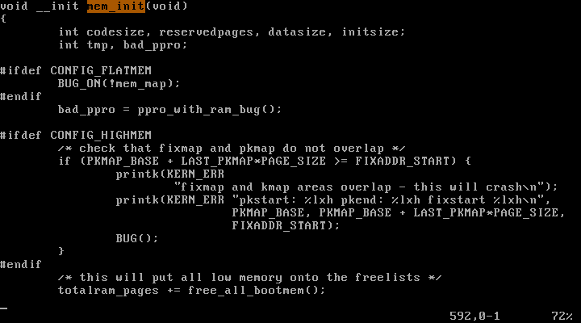

커널의 메모리 관리 서브 시스템을 초기화를 담당하는 함수로 예측할 수 있다.

### `rest_init()`

```bash
$ grep -nr "rest_init" *
```

`linux-2.6.25.10/`에서 위 명령어로 "rest_init"을 찾아보았다.

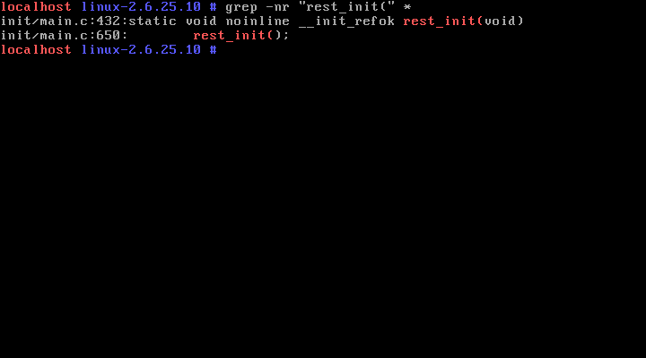

`rest_init()` 함수는 `linux-2.6.25.10/init/main.c`에 위치한 것을 확인할 수 있다.

```bash
$ vi init/main.c
```

위 명령어를 통해 `main.c` 파일의 `rest_init(void)` 함수를 살펴보았다.

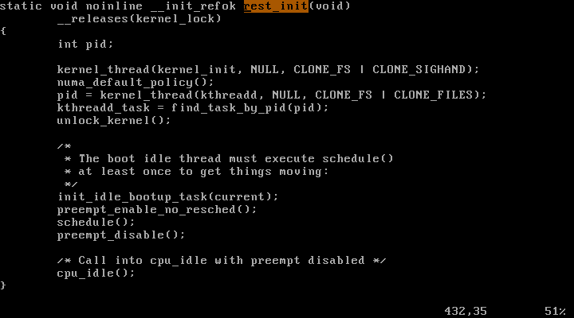

초기화 기능에 사용되는 메모리를 해제한 후 커널 thread로 `init()`을 시작하여 커널 부팅을 완료한다.

## 6. Why can't we use "printf" instead of "printk" in Linux kernel?

- `printf`
  - `printf`는 유저 모드에서만 호출이 가능하다.
  - `printf`함수의 경우 내부적으로 버퍼에 출력할 것을 모아두었다가 방출시킨다.
- `printk`
  - `printk`는 OS 동작 중에 메시지를 출력하는 용도이며 커널모드에서만 호출이 가능하다.
  - `printk`는 버퍼없이 바로 출력한다.
  - OS의 핵심 코드인 kernel에는 OS 운영 중 에러가 발생할 경우 관련 로그를 기록하는 동작 코드 등이 포함되어 있다. 따라서 아주 짧은 시간도 치명적일 수 있기에 `printf`보다 가볍게 동작하는 `printk`를 이용한다.
  - 또한 메시지 출력 로그 레벨을 지정하기 위해 `printk`를 이용한다.
