# Lecture 3. PC Hardware, Execution Cycle, Boot Sequence, GRUB Boot Loader, Kernel Compiling

## 1. PC Hardware

### 1) computer

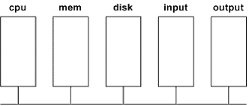

Where are the files located? What’s in memory?

### 2) Intel x86 cpu

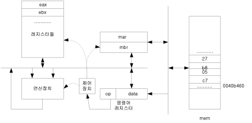

- registers:
  - ax, bx, cx, dx, cs, ds, ss, es, sp, bp, ip, si, di, flag register
  - (for 32-bit: eax, ebx, ecx, edx, esp, ebp, eip, esi, edi)
  - (for 64-bit: rax, rbx, rcx, rdx, rsp, rbp, rip, rsi, rdi)<br><br>
- ax, bx, cx, dx: General purpose. Can contain any data<br><br>
- cs, ds, ss, es : Segement registers. cs for code segment, ds for data segment, ss for stack segment, es for extra segment. A program loaded in memory has 3 segments: code, data, and stack. cs points to the base address of the code segment; ds points to the base of data segment; ss points to the base of stack segment.<br><br>
- sp : points to the current stack top
- bp: points to the base location of the frame for the current function in the stack
- ip : points to the current instruction
- flag register: contains the system status
- si,di : source index, destination index register

# 2. Execution Cycle

- CPU runs the execution cycle forever.
  - Step 1: Fetch the next instruction pointed to by cs:eip.
  - Step 2: Update eip.
  - Step 3: Execute the fetched instruction.
  - Step 4: Check if there was an interrupt.
    - If interrupt (INT x)
      - save flag register, cs, eip ( and ss, esp also in protected mode)
      - replace cs, eip with the ISR location in IDT[x]
      - go to Step 1
    - Else
      - go to Step 1

# 3. Boot Sequence

Refer to http://duartes.org/gustavo/blog/post/how-computers-boot-up or Appendix A of “Understanding Linux Kernel” book.

## Power ON

- cs=0xF000, ip=0xFFF0
- with hidden base address, the first physical address is 0xFFFFFFF0.
  - first instruction is at 0xFFFFFFF0 : BIOS

## BIOS(Basic Input Output System) starts

- system test/initialization
- load/execute 1st sector of boot disk: GRUB boot loader
- (boot disk is searched in the order of A:, B:, C:, etc)

## GRUB boot loader starts

- GRUB (**Gr**and **U**nified **B**ootloader)
- find/load/execute OS(Linux)

## OS(Linux) starts

- set interrupt descriptor table
- initialize system data structure for process/file/memory/io device
- generate system processes: the last one is login process

## login program starts

- print "login:" and wait for user

# 4. Kernel Compiling and Rebooting

- (1) Make some change in the kernel.
- (2) Go to the Linux top directory (`/root/linux-2.6.25.10`) and do

```bash
$ make bzImage
```

- (3) The Linux executable file (bzImage) will be made at: <br>`arch/x86/boot/bzImage`
- (4) So, you need to copy it to /boot/bzImage so that GRUB can load it.

```bash
$ cp arch/x86/boot/bzImage /boot/bzImage
```

- (5)And reboot the system to boot with the new Linux

```bash
$ reboot
```


# 5. Replace boot image

- When the power is on, the cpu loads boot loader program from the first sector of the booting disk.
- In our case it is GRUB (**GR**and **U**nified **B**ootloader) bootloader.
- The GRUB bootloader will try to find the operating system (boot image) as specified in `/boot/grub/grub.conf`.

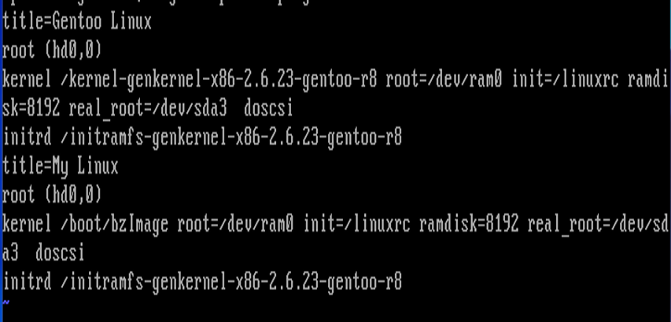

```bash
............
title=Gentoo Linux
root (hd0,0)
kernel /kernel-genkernel-x86-2.6.23-gentoo-r8 root= ............
initrd ..............
title=My Linux
root (hd0,0)
kernel /boot/bzImage root=..........
initrd .......
```

- The above means there are two versions of operating system:
  - **Gentoo Linux** and **My Linux**.
- The kernel image file of "Gentoo Linux" is in
  - `/kernel-genkernel-x86-2.6.23-gentoo-r8`
- And the kernel image file of "My Linux" is in
  `/boot/bzImage`.
- If we select "My Linux" during the booting process, GRUB will load `/boot/bzImage` as the operating system.
- We replace this one with our new Linux.

```bash
$ cp arch/x86/boot/bzImage /boot/bzImage
```

- Reboot the system with

```bash
$ reboot
```

- And select "My Linux".
- Now the new Linux should be running.

# 6. Homework

## 0) Boot Sequence.

### 0-1) When you boot the Linux system, the first program that runs is BIOS. Where is this program (the memory location)?

BIOS는 메모리 `0xFFFFFFF0`에 위치한다.

### 0-2) BIOS loads and runs the boot loader program (GRUB in Linux). Where is this GRUB program?

GRUB는 boot disk의 첫번째 sector에 존재한다.

### 0-3) GRUB loads and runs the Linux executable file. Where is Linux executable file? How GRUB knows the location of Linux executable file?

- GRUB는 Linux 실행파일의 위치를 `/boot/grub/grub.conf`에서 찾는다.
- "Gentoo Linux"의 kernel image file은 `/kernel-genkernel-x86-2.6.23-gentoo-r8`에 있으며
- "My Linux"의 kernel image file은 `/boot/bzImage`에 있다.

## 1) Simple modification of the kernel.

```bash
after
   printk(linux_banner);
Add
   printk("hello from me\n");
```

in `start_kernel()`. Go to the Linux top directory and compile the kernel and replace the boot image. Reboot with this new kernel, and run dmesg to see if the kernel is printing "hello from me".

```bash
$ cd linux-2.6.25.10
$ cd init
$ vi main.c
....... modify start_kernel()
$ cd ..           -- go back to the Linux top directory
$ make bzImage    -- recompile the kernel
$ cp arch/x86/boot/bzImage /boot/bzImage
                  -- copy the new kernel image to boot location
                  -- answer "y"
$ reboot           -- reboot the system with this new kernel and select "My Linux"
......
(select "My Linux")
$ dmesg > x
$ vi x              -- now check if we can see our new message
```

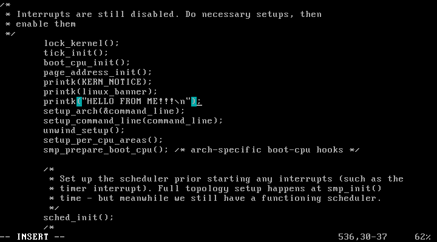

사진과 같이 `start_kernel()` 함수 내에서 `printk(linux_banner);` 다음 줄에 `printk("HELLO FROM ME!!!\n");`를 추가해주었다.

그 다음 `make bzImage` 명령어로 kernel을 recompile 해주었다.

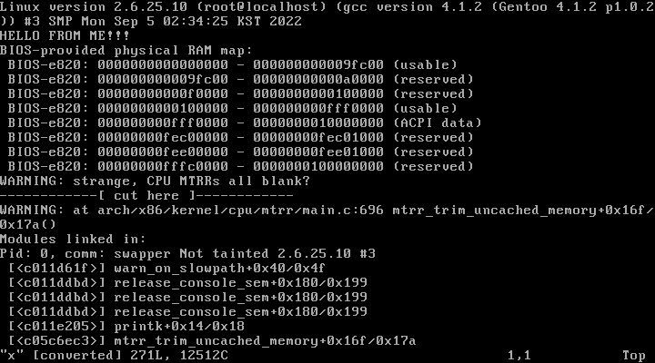

`reboot` 후, `dmesg > x`를 통해 부팅메시지의 두번째 줄을 확인해보면 추가한 "HELLO FROM ME!!!"를 확인할 수 있었다.

## 2) `start_kernel()` calls `trap_init()`, and there are many `trap_init()` functions defined in the kernel code. Make an intelligent guess about which `trap_init()` would be called and insert some `printk()` in the beginning of this `trap_init()` to see if it is really called by the kernel. Use `grep` in the top directory of the linux source tree to find out the locations of `trap_init()`:

```bash
$ grep -nr "trap_init" * | more
```

리눅스의 탑 디렉토리에서 `grep` 명령어로 "`trap_init`" 함수를 찾은 결과는 아래와 같다.

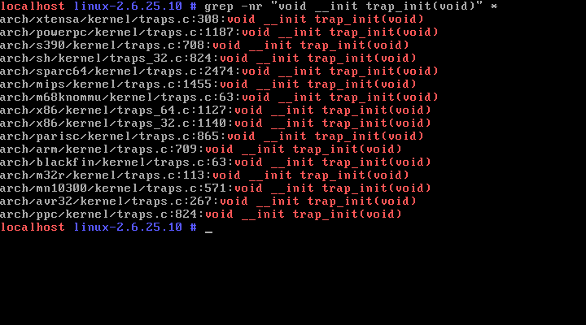

여러 파일이 `trap_init()` 함수를 갖고 있지만, kernel에 출력(`printk`)되도록 수정하려면, 현재 리눅스의 아키텍처가 x86 32비트이기 때문에 `arch/x86/kernel/` 디렉토리의 `traps_32.c` 파일을 수정해야 한다.

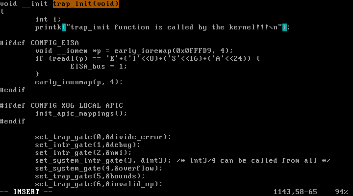

`vi` 명령어를 통해 `printk("trap_init function is called by the kernel!!!\n");`라는 구문을 `trap_init()` 함수에 추가해주었다.

```bash
$ make bzImage
$ cp arch/x86/boot/bzImage /boot/bzImage
```

위 명령어들로 수정사항을 컴파일 해주고, `reboot` 하였다.

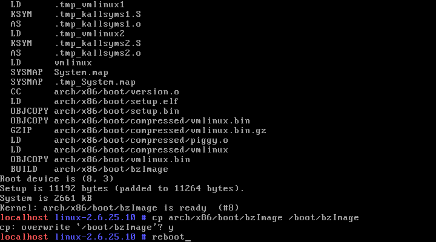

```bash
$ vi dmesg > x
$ vi x
```

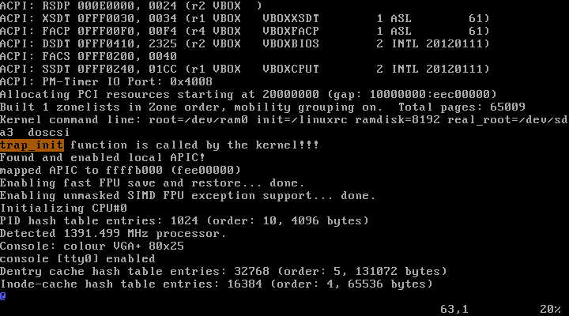

부팅 메세지를 확인해보면 63번째 줄에서부터 `trap_init`이 호출되는 것을 알 수 있다.

## 3) Find also the exact locations of `init_IRQ()` and insert some `printk()` in the beginning of `init_IRQ()` to confirm (actually you insert it in `native_init_IRQ`). <br>Do the same thing for `init_timers()` and `time_init()`.

```bash
$ grep -nr "native_init_IRQ(void)" * | more
```

리눅스의 탑 디렉토리에서 `grep` 명령어로 "`init_IRQ`" 함수를 찾은 결과는 아래와 같다.


여러 파일이 `native_init_IRQ(void)` 함수를 갖고 있지만, kernel에 출력(`printk`)되도록 수정하려면, 현재 리눅스의 아키텍처가 x86 32비트이기 때문에 `arch/x86/kernel/` 디렉토리의 `i8259_32.c` 파일을 수정해야 한다.

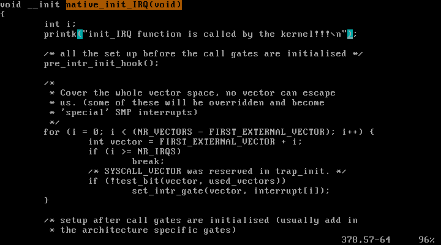

`vi` 명령어를 통해 `printk("init_IRQ function is called by the kernel!!!\n");`라는 구문을 `native_init_IRQ(void)` 함수에 추가해주었다.

<br>

또한, 리눅스의 탑 디렉토리에서 `grep` 명령어로 "`init_timers`" 함수와 "`time_init`" 함수를 찾은 결과는 아래와 같다.

```bash
$ grep -nr "init_timers(void)" *
$ grep -nr "__init time_init(void)" *
```


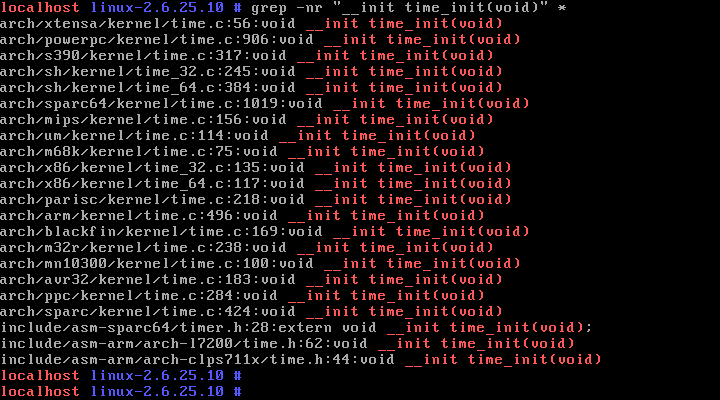

마찬가지로 여러 파일들 중, `kernel` 폴더 하위에 있는 파일인 `kernel/timer.c`와 `arch/x86/kernel/time_32.c`를 수정해주었다.

```bash
$ vi kernel/timer.c
$ vi arch/x86/kernel/time_32.c
```

`vi` 명령어를 통해 `printk("init_timers function is called by the kernel!!!\n");`와
`printk("time_init function is called by the kernel!!!\n");`라는 구문을
각각 `init_timers(void)` 함수와 `time_init(void)` 함수에 추가해주었다.

```bash
$ make bzImage
$ cp arch/x86/boot/bzImage /boot/bzImage
```

위 명령어들로 수정사항을 컴파일 해주고, `reboot` 하였다.

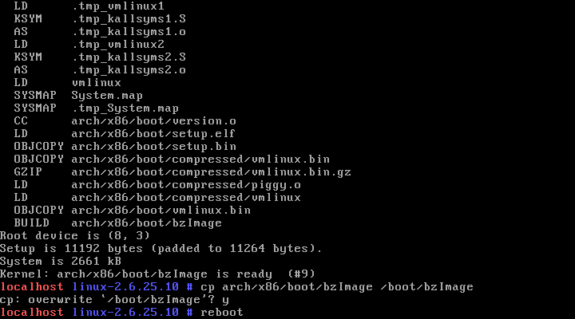

```bash
$ vi dmesg > x
$ vi x
```

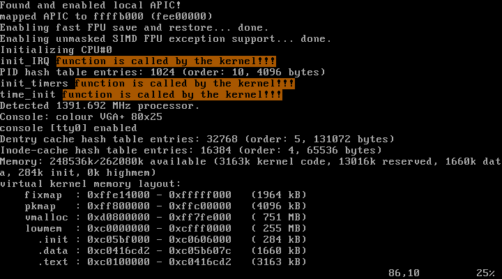

부팅 메세지를 확인해보면 `init_IRQ`, `init_timers`, `time_init` 함수가 순서대로 호출되며, 추가한 3종류의 문구가 출력되는 것을 알 수 있다.

## 4) Modify `/boot/grub/grub.conf` so that GRUB displays another Linux selection, My Linux2. Set the location of the kernel for this linux as /boot/bzImage2. Prepare two versions of My Linux such that when you select "My Linux" the kernel will display "hello from My Linux", and when you select "My Linux2", it displays "hello from My Linux2".

```bash
$ cd /boot/grub
$ vi grub.conf
```

위와 같은 명령어로 `/boot/grub/grub.conf` 파일을 수정하였다.

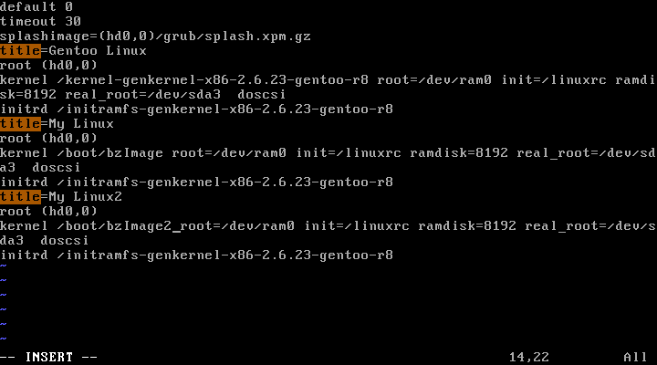

"title=My Linux"가 있는 줄에 커서를 놓고, 4줄을 copy 하기 위해 `4yy` 명령어로 복사 후, `p` 명령어로 붙여넣었다.

붙여넣은 텍스트 중 `title=My Linux`을 `title=My Linux2`로, `kernel /boot/bzImage`을 `kernel /boot/bzImage2`로 변경하였다.

그 다음

```bash
$ vi init/main.c
```

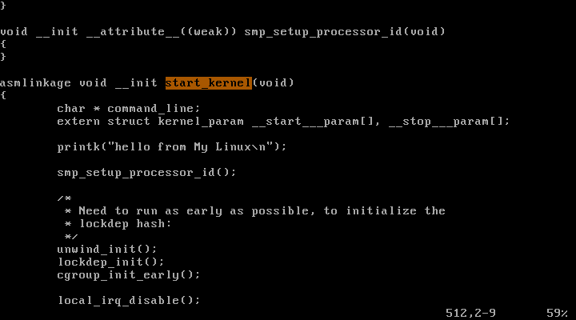

`start_kernel()` 함수로 가서 Linux_banner 위에 "hello from My Linux"가 출력되도록 저장하였다.

```bash
$ make bzImage
$ cp arch/x86/boot/bzImage /boot/bzImage
cp: overwrite '/boot/bzImage'? y
```

로 "My Linux" kernel을 컴파일하였다.

이후 "My Linux" kernel과 마찬가지로 "My Linux2" kernel을 수정하였고, 컴파일하였다.

```bash
$ vi init/main.c  # "start_kernel()" 함수에서
                  # "hello from My Linux2"를 출력하도록 수정
$ make bzImage
$ cp arch/x86/boot/bzImage /boot/bzImage2
$ reboot
```

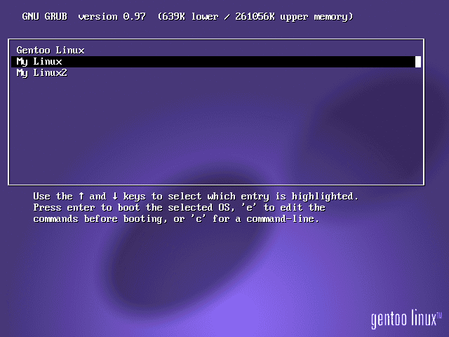

부팅 화면에서 "My Linux2"가 추가된 것을 확인할 수 있다.

우선 "My Linux"로 먼저 부팅하여 부팅 메세지를 확인해본다.

```bash
$ dmesg > x
$ vi x
```

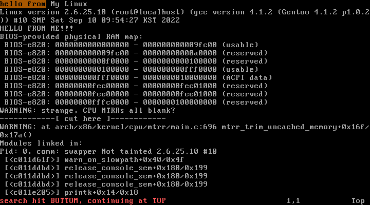

`start_kernel` 함수에 추가한 메세지가 정상 출력된다.

"My Linux2"로 재부팅하여 부팅메세지를 확인해봤을 때도, 추가한 "hello from My Linux2"라는 메세지가 정상 출력되는 것을 확인할 수 있다.

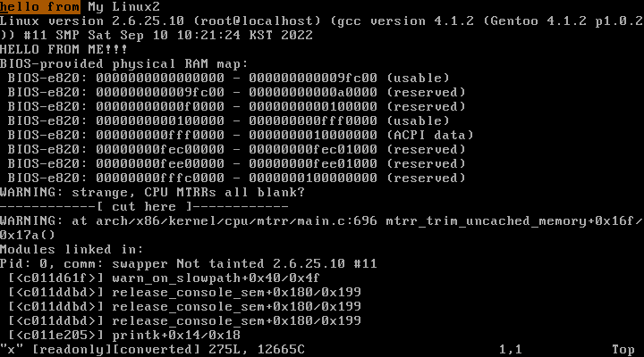

## 5) Where is CPU at the end of the boot sequence when it prints "login" and waits for the user login? Explain your reasoning.

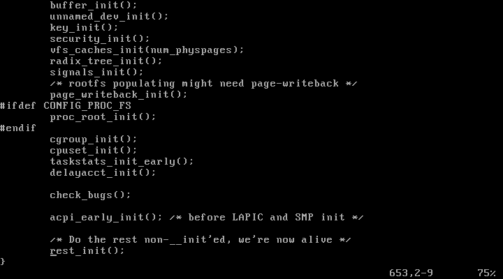

`main.c`에서 부팅 시 가장 먼저 실행되는 `start_kernel`의 가장 마지막 부분을 보면 `rest_init();`이 있다.

`rest_init()` 함수 또한 `init/main.c`에 정의되어 있다.
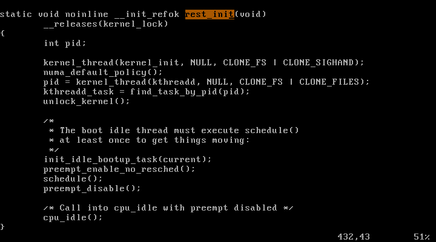
`rest_init()` 함수 안에서는 `cpu_idle();`이 제일 마지막으로 실행된다.

```bash
$ grep -nr "cpu_idle" * | more
```

의 실행결과를 보면

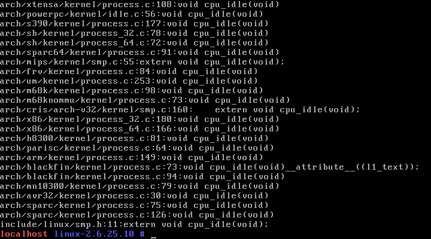

`cpu_idle` 함수는 `arch/x86/kernel/process_32.c`에 있다는 것을 알 수 있다.

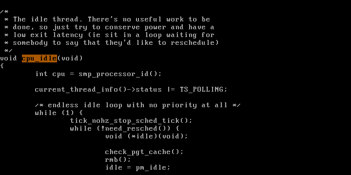
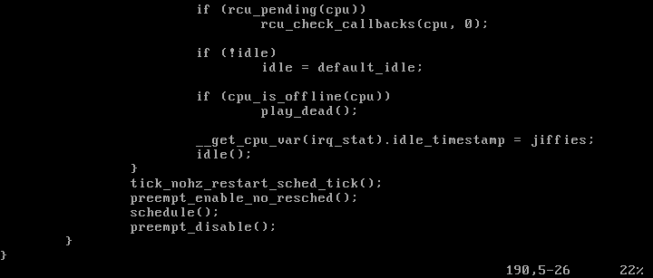

함수 내용을 확인해보니, cpu는 사용자로부터 id를 입력받기 전까지 `while`문을 통해서 무한루프를 돌게
된다.

즉, cpu는 `login:`를 화면에 출력한 후 멈춰있는 것이 아니라 `cpu_idle`의 무한루프에서 사용자의 입력 전까지 계속 대기 중인 것이다.
