# Interrupt

- What is Interrupt
- interrupt number
- handling interrupt
- interrupt service routine: ISR
  - ISR1, ISR2
- OS = initialization code + collection of ISR's

An operating system is a collection of service routines. The service routine can be executed by a request from an application (**system call interrupt**). <br>
Or it runs automatically when there is a serious error while running an application (**exception interrupt**) or when there is an external hardware event that the operating system has to handle (**hardware interrupt**). <br>
The service routines are called ISRs (Interrupt Service Routines).

| external event                        | interrupt number            | ISR (ISR1 => ISR2)                      |
| ------------------------------------- | --------------------------- | --------------------------------------- |
| An application calls<br> `read(...)`  | int 128<br> (syscall num 3) | `system_call()` => `sys_read()`         |
| An application calls<br> `write(...)` | int 128<br> (syscall num 4) | `system_call()` => `sys_write()`        |
| timer ticks                           | int 32                      | `interrupt[0]` => `timer_interrupt()`   |
| key stroke                            | int 33                      | `interrupt[1]` => `atkbd_interrupt()`   |
| An application runs<br> `x=x/0;`      | int 0                       | `divide_error(`) => `do_divide_error()` |
| page fault while an application run   | int 14                      | `page_fault()` => `do_page_fault()`     |

ISR1s are all located in `arch/x86/kernel/entry_32.S`. <br>
ISR2s are located in various locations of the kernel.

When an interrupt, INT x, happens, the cpu stores the current cs, eip, flag register into stack and jumps to ISR1 for INT x. <br>
The ISR1 locations are written in IDT (Interrupt Descriptor Table), and the cpu jumpts to the location written in `IDT[x]`. <br>
ISR1 knows the location of ISR2. <br>
It knows the location of ISR2 because it is hard-coded (exception interrupt case), or is written in irq_desc table (hardware interrupt case) or is written in syscall_table (system call interrupt case).

## 1. Interrupt classification and Interrupt number

- There are two kinds of interrupt:
  - **software interrupt**
  - and **hardware interrupt**.<br><br>
- **Software interrupt** is generated by a program when it makes a serious error (e.g. dividing by zero) or runs a special instruction (e.g. INT, SYSENTER, SYSCALL).
  - The former is called **exception** and the latter **system call**.
- **Hardware interrupt** is generated by peripheral devices connected to CPU.
  - Key press is one example of hardware interrupt. <br><br>
- All interrupts have a unique number defined by the operating system.
- Operating system is a collection of routines that handle interrupts.

**Hardware interrupts** have been assigned following interrupt numbers in Linux.

| device                  | interrupt number | irq number |
| ----------------------- | ---------------- | ---------- |
| timer                   | 32               | 0          |
| keyboard                | 33               | 1          |
| PIC cascading           | 34               | 2          |
| second serial port      | 35               | 3          |
| first serial port       | 36               | 4          |
| floppy disk             | 38               | 6          |
| system clock            | 40               | 8          |
| network interface       | 42               | 10         |
| usb port, sound card    | 43               | 11         |
| ps/2 mouse              | 44               | 12         |
| math coprocessor        | 45               | 13         |
| eide disk, first chain  | 46               | 14         |
| eide disk, second chain | 47               | 15         |

**Exceptions** have been assigned following interrupt numbers.

| exception                   | interrupt number |
| --------------------------- | ---------------- |
| divide-by-zero error        | 0                |
| debug                       | 1                |
| NMI                         | 2                |
| breakpoint                  | 3                |
| overflow                    | 4                |
| bounds check                | 5                |
| invalid opcode              | 6                |
| device not available        | 7                |
| double fault                | 8                |
| coprocessor segment overrun | 9                |
| invalid TSS                 | 10               |
| segment not present         | 11               |
| stack segment fault         | 12               |
| general protection          | 13               |
| page fault                  | 14               |
| intel-reserved              | 15               |
| floating point error        | 16               |
| alignment check             | 17               |
| machine check               | 18               |
| simd floating point         | 19               |

Finally, **system calls** in Linux are all assigned the same interrupt number, **128 (`0x80`)**. To differentiate between different system calls, a unique system call number has been given to each system call. For the full table, look at **`arch/x86/kernel/syscall_table_32.S`**.

| system calls | interrupt number | system call number |
| ------------ | ---------------- | ------------------ |
| exit         | 128              | 1                  |
| fork         | 128              | 2                  |
| read         | 128              | 3                  |
| write        | 128              | 4                  |
| open         | 128              | 5                  |
| close        | 128              | 6                  |
| ......       | ......           | ......             |

## 2. How interrupts are detected?

Interrupts are detected by CPU. Exceptions are detected when the corresponding error happens. System calls are detected when the program executes INT 128 instruction. Hardware interrupts are detected when the corresponding devices are affected. Hardware interrupts need more detailed explanation.

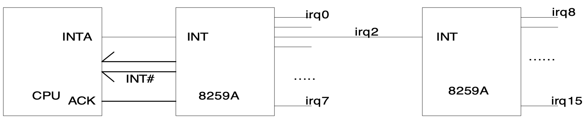

The above picture shows how hardware interrupts are detected by the CPU. All hardware devices are connected to 8259A interrupt controller through IRQ lines. Timer is connected through IRQ0 line, keyboard is connected through IRQ1 line, and so on. When an event happens in one of these devices, the corresponding IRQ line is activated, and 8259A signals CPU about this event along with the corresponding interrupt number for this IRQ line. The interrupt number is computed as (IRQ line number + 32) in Linux.

## 3. How interrupts are handled

Interrupts are first handled by the CPU, and then the operating system takes care of the rest of things.

### 3.1 cpu part

- When an interrupt happens, the CPU executes the corresponding INT instruction.
- For example, if the user presses a key (which corresponds to INT 33), the CPU executes INT 33.
- Executing `INT x` instruction is two steps:
  - save current EFLAG, CS,EIP registers in the stack
  - jump to the location specified in `IDT[x]`<br><br>
- IDT(Interrupt Descriptor Table) is a table containing the address of ISR’s(Interrupt Service Routines).
- More general name for IDT is Interrupt Vector Table. If `IDT[32]` indicates address `0x10200`, the ISR for timer interrupt is located at address `0x10200`, which means whenever the timer ticks, the cpu jumps to address `0x10200`.
- If `IDT[33]` indicates address `0x10300`, the ISR for keyboard is located at `0x10300`.
- Whenever the user hits some key, the cpu will jump to `0x10300` and start to execute whatever program stored there.<br><br>
- It is the responsibility of the operating system to provide the IDT and fill in proper address for each interrupt.
- Linux writes IDT in **`arch/x86/kernel/traps_32.c/trap_init()`** (for exception interrupts and system call interrupt) and in **`arch/x86/kernel/i8259_32.c/init_IRQ()`** (for hardware interrupts).
- Also the cpu knows the location of IDT by its IDTR register.
- Therefore, it is again the responsibility of operating system to write the location of the IDT in IDTR register.
- Each entry in IDT is 8 byte.
- The variable name of IDT table in Linux is idt_table.

### 3.2 OS part

- Once the cpu jumps to the corresponding ISR, OS takes the control since ISR belongs to the operating system.
- All ISR’s (I call ISR1) consist of three steps:
  - save the rest of registers (eflag, cs, eip are already saved by cpu)
  - call actual interrupt handler (I call ISR2)
  - recover the saved registers and go back to the interrupted location
- Linux writes ISR1's in IDT by calling `set_intr_gate()` for hardware interrupts in `arch/x86/kernel/i8259_32.c/native_init_IRQ()`, and by calling `set_trap_gate()` for most of the exceptions and `set_system_gate()` for system call interrupts in `arch/x86/kernel/traps_32.c/trap_init()`.
- Device drivers write their ISR2's for hardware interrupts in `irq_desc[]` table by calling `request_irq()`.
- ISR2's for exceptions are directly called in the corresponding ISR1's, the name always being do\_(ISR1 name). - ISR2's for the system calls are hard-coded in `sys_call_table[]` in `arch/x86/kernel/syscall_table_32.S`.
- ISR1s are defined in `arch/x86/kernel/entry_32.S`, and ISR2s are defined in various places.

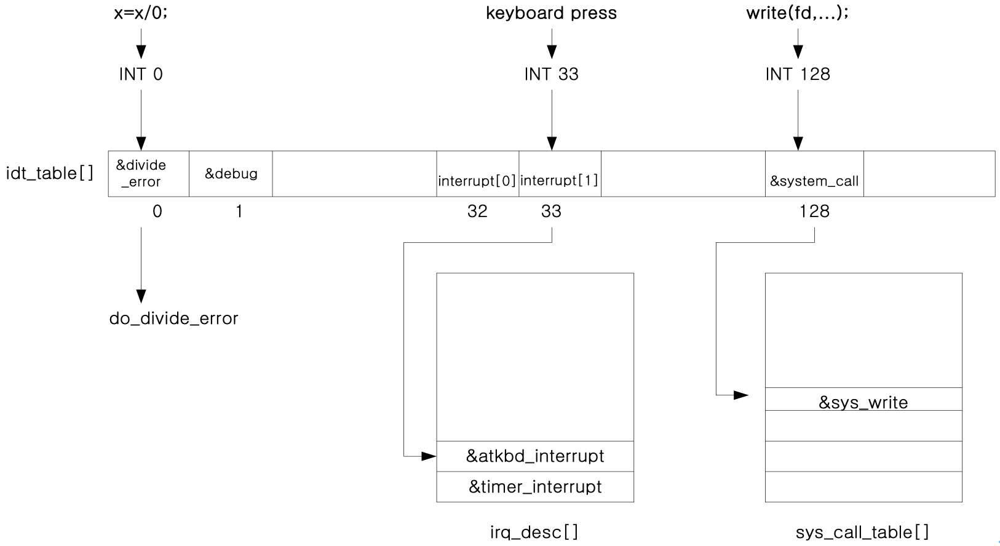

Interrupt numbers and their ISR1 and ISR2 list.

| interrupt number        | ISR1         | ISR2            |
| ----------------------- | ------------ | --------------- |
| 0                       | divide_error | do_divide_error |
| 1                       | debug        | do_debug        |
| ...............         |              |                 |
| 32                      | interrupt[0] | timer_interrupt |
| 33                      | interrupt[1] | atkbd_interrupt |
| ................        |              |                 |
| 128 (syscall num 1)     | system_call  | sys_exit        |
| 128 (syscall num 2)     | system_call  | sys_fork        |
| ....................... |              |                 |

## 4. Exercise

### 1) Following events will cause interrupts in the system. What interrupt number will be assigned to each event? For system call interrupt, also give the system call number.

- A packet has arrived
  - network interface : 42
- An application program calls `scanf()`
  - `system_call()` => `sys_read()(3)` : 128
- A key is pressed
  - `interrupt[1]` : 33
- An application causes a divide-by-zero error
  - Exception interrupt : 0
- An application program calls `printf()`
  - `system_call()` => `sys_read()(3)` :128
- An application causes a page-fault error
  - `page_fault()` => `do_page_fault()` :14

## 2) Change `drivers/input/keyboard/atkbd.c` as follows.

```bash
$ vi drivers/input/keyboard/atkbd.c
```

```c
static irqreturn_t atkbd_interrupt(....){
   return IRQ_HANDLED;  // Add this at the first line
   .............
}
```

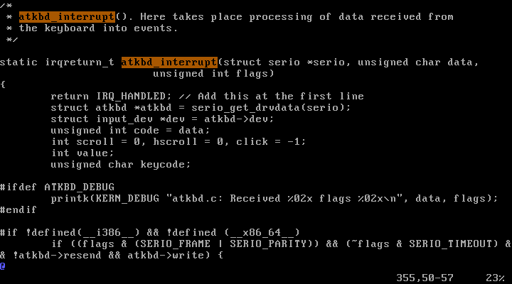

#### Recompile the kernel and reboot with it.

```bash
$ make bzImage
$ cp arch/x86/boot/bzImage /boot/bzImage
$ reboot
```

#### What happens and why does this happen? Show the sequence of events that happen when you hit a key in a normal Linux kernel (as detail as possible): hit a key => keyboard controller sends a signal through IRQ line 1 => ......etc. Now with the changed Linux kernel show which step in this sequence has been modified and prevents the kernel to display the pressed key in the monitor.

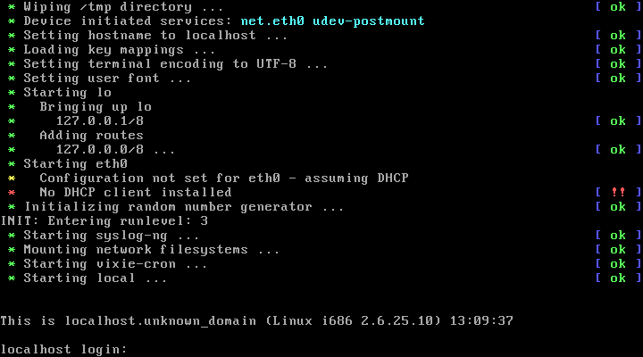

부팅이 끝나면 로그인 입력이 출력되지만, Keyboard action이 먹히지 않는다.

원래 코드는interrupt가 발생 후, 키보드 입력과정을 처리한 뒤 `IRQ_HANDLED`를 리턴하는데, 이 과정들을 거치지 않고 바로 리턴하도록 했기 때문에, 어떤 문자를 입력해도 실행이 되지 않는다.

### 3) Change the kernel such that it prints "x pressed" for each key pressing, where x is the scan code of the key. After you change the kernel and reboot it, do followings to see the effect of your changing.

```bash
$ vi drivers/input/keyboard/atkbd.c
```

`code`를 `printk`로 출력할 수 있도록 `printk("%x pressed\n", code);`를 추가하였다.

`drivers/input/keyboard/atkbd.c`:
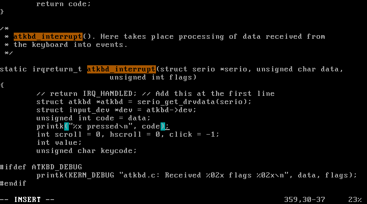

이후, 컴파일하고 재부팅하여 새로운 리눅스 커널을 적용하였다.

```bash
$ cat /proc/sys/kernel/printk
1  4  1  7
```

위는 현재의 콘솔 로그 레벨, 기본 로그 레벨, 최소 로그 레렐, 최대 로그 레벨을 나타낸다. 현재는 `1`로 기본 레벨보다 낮기 때문에 `printk()`로 출력되는 문자들이 화면에 나타나지 않는다.

```bash
$ echo 8 > /proc/sys/kernel/printk
```

위 명령으로 현재 콘솔 로그 레벨을 `8`로 바꾸면 아래와 같이 레벨이 바뀐다.

```bash
$ cat /proc/sys/kernel/printk
8   4   1   7
```

현재는 레벨이 `8`이기 때문에 `printk`로 출력되는 문자들이 화면에 보인다. 위와 같이 입력되는 키 코드가 화면에 보인다.

```bash
$ echo 1 > /proc/sys/kernel/printk
```

`printk` 출력을 보이지 않게 하려면 현재 로그 레벨을 `1`로 되돌리면 된다.

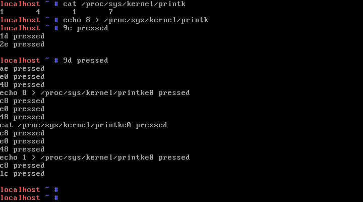

### 4) Change the kernel such that it displays the next character in the keyboard scancode table. For example, when you type "root", the monitor would display "tppy". How can you log in as root with this kernel?

```bash
$ vi drivers/input/keyboard/atkbd.c
```

키보드 입력이 들어오면, 실제 입력한 글자의 다음 글자를 입력한 것으로 처리하도록 `unsigned int code = data;`를 `unsigned int code = data+1;`로 수정하였다.

`drivers/input/keyboard/atkbd.c`:
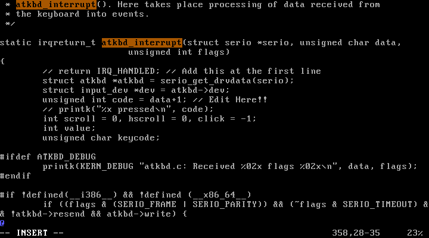

이후, 컴파일하고 재부팅하여 새로운 리눅스 커널을 적용하였다.


재부팅하고 로그인을 하기 위해 "root"를 입력하면 키보드에서 한 글자씩 밀린 "tppy"가 출력된다.

### 5) Define a function `mydelay` in `init/main.c` which whenever called will stop the booting process until you hit 's'. Call this function after `do_basic_setup()` function call in `kernel_init()` in order to make the kernel stop and wait for 's' during the booting process. You need to modify `atkbd.c` such that it changes `exit_mydelay` to 1 when the user presses 's'.

`init/main.c` :

```c
........
int exit_mydelay;    // define a global variable
void mydelay(char *str){
   printk(str);
   printk("enter s to continue\n");
   exit_mydelay=0;  // init to zero
   for(;;){  // and wait here until the user press 's'
      msleep(1); // sleep 1 micro-second so that keyboard interrupt ISR
                 // can do its job
      if (exit_mydelay==1) break; // if the user press 's', break
   }
}
void kernel_init(){
    ...............
    do_basic_setup();
    mydelay("after do basic setup in kernel_init\n"); // wait here
    .........
}
```

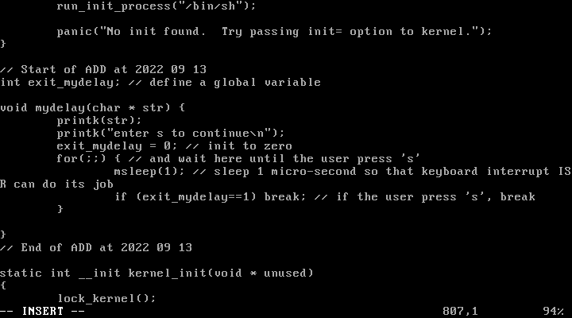
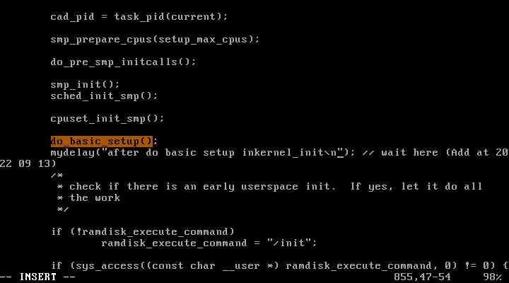

`drivers/input/keyboard/atkbd.c` :

```c
.........
extern int exit_mydelay;  // declare as extern since it is defined in main.c
static irqreturn_t atkbd_interrupt(....){
    .............
    // detect 's' key pressed and change exit_mydelay
    if (code == 31) {
        printk("s pressed\n");
        exit_mydelay = 1;
    }
    .............
}
```

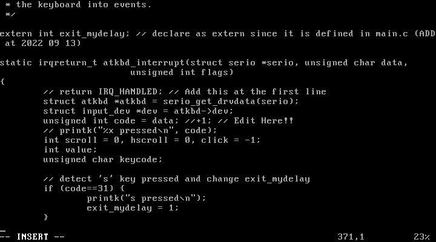

이후, 컴파일하고 재부팅하여 새로운 리눅스 커널을 적용하였다.


부팅 시 "enter s to continue"라는 메세지와 함께 사용자의 입력을 기다리고 있다.

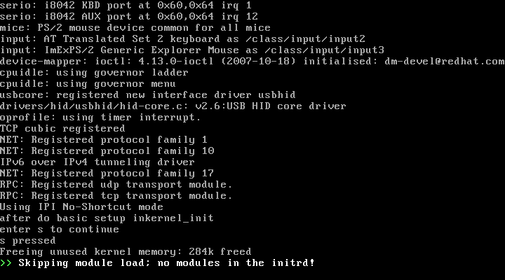

's'를 입력하면 부팅이 이어서 진행된다.

#### 5-1) Add mydelay before `do_basic_setup()`. What happens and why?

```c
void kernel_init(){
    ...............
    mydelay("before do basic setup in kernel_init\n"); // wait here
    do_basic_setup();
    mydelay("after do basic setup in kernel_init\n"); // wait here
    .........
}
```

### 6) Which function call in `atkbd_interrupt()` actually displays the pressed key in the monitor?

#### 6-1) What are the interrupt numbers for divide-by-zero exception, keyboard interrupt, and "read" system call? Where is ISR1 and ISR2 for each of them (write the exact code location)? Show their code, too.

### 7) `sys_call_table[]` is in `arch/x86/kernel/syscall_table_32.S`. How many system calls does Linux 2.6 support? What are the system call numbers for `exit`, `fork`, `execve`, `wait4`, `read`, `write`, and `mkdir`? Find system call numbers for `sys_ni_syscall`, which is defined at `kernel/sys_ni.c`. What is the role of `sys_ni_syscall`?

### 8) Change the kernel such that it prints "length 17 string found" for each `printf(s) `when the length of s is 17. Run a program that contains a `printf()` statement to see the effect. `printf(s)` calls `write(1, s, strlen(s))` system call which in turn runs

```bash
             mov eax, 4 ; eax<--4. 4 is system call number for “write”
             int 128
# INT 128 will make the cpu stop running current process and jump to the location written in IDT[128]. IDT[128] contains the address of system_call (located in arch/x86/kernel/entry_32.S). Finally, system_call will execute
             call *sys_call_table(,%eax,4)
# which eventually calls sys_write() since eax=4 for write() system call (the target function location is sys_call_table+eax*4).
```

- Sometimes the the system call runs "sysenter" instead of "int 128". In this case the cpu jumps to `ia32_sysenter_target` (also in `entry_32.S`) instead of system_call.

### 9) You can call a system call indirectly with `syscall()`.

```c
write(1, “hi”, 2);
```

can be written as

```c
syscall(4, 1, “hi”, 2); // 4 is the system call number for “write” system call
```

Write a program that prints "hello" in the screen using syscall.

### 10) Create a new system call, `my_sys_call` with system call number 17 (system call number 17 is one that is not being used currently). Define `my_sys_call()` just before `sys_write()` in `read_write.c`. Write a program that uses this system call:

```c
void main(){
    syscall(17); // calls a system call with syscall number 17
}
```

When the above program runs, the kernel should display

```bash
hello from my_sys_call
```

- To define a new system call with syscall number x
  - insert the new system call name in `arch/x86/kernel/syscall_table_32.S` at index x
  - define the function in appropriate file (such as `read_write.c`)
  ```c
  asmlinkage void my_sys_call(){
      printk("hello from my_sys_call\n");
  }
  ```
  - recompile and reboot
- To use this system call in a user program
  ```c
  void main(){
      syscall(x);
  }
  ```

#### 10-1) Create another system call that will add two numbers given by the user.

`ex0.c`:

```c
void main(){
    int sum;
    sum = syscall(31, 4, 9);  // suppose 31 is an empty entry in sys_call_table
    printf("sum is %d\n, sum);
}
```

```bash
$./ex0
sum is 13
```

### 11) Modify the kernel such that it displays the system call number for all system calls. Run a simple program that displays "hello" in the screen and find out what system calls have been called. Also explain for each system call why that system call has been used.

### 12) What system calls are being called when you remove a file? Use `system()` function to run a Linux command as below. Explain what each system call is doing. You need to make `f1` file before you run it. Also explain for each system call why that system call has been used.

```c
   ...........
   system("rm f1");
   ...........
```

### 13) Find `rm.c` in `busybox-1.31.1` and show the code that actually removes `f1`. Note all linux commands are actually a program, and running `rm` command means running rm.c program. `rm` needs a system call defined in `uClibc-0.9.33.2` to remove a file. You may want to continue the code tracing all the way up to "INT 0x80" in uClibc for this system call.
