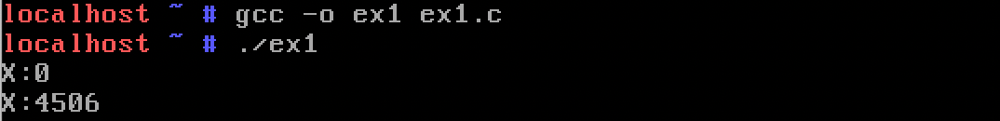
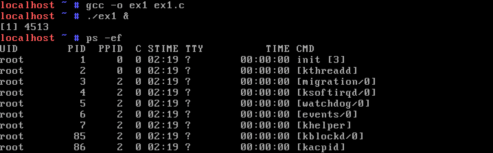
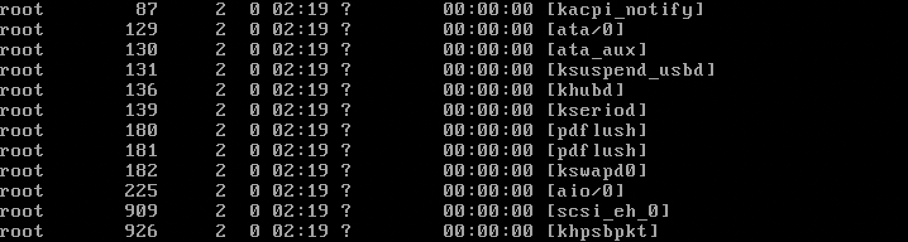
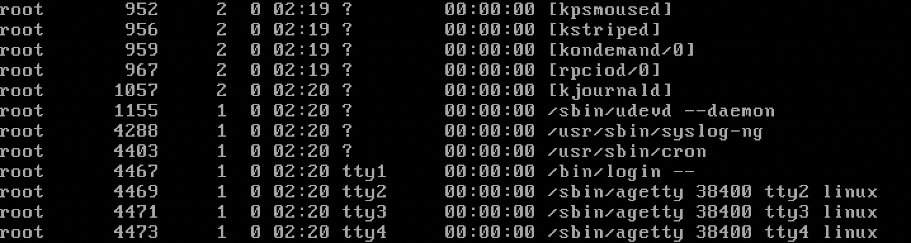
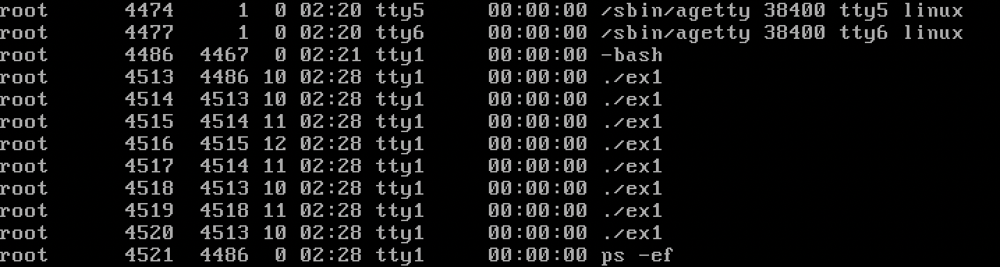
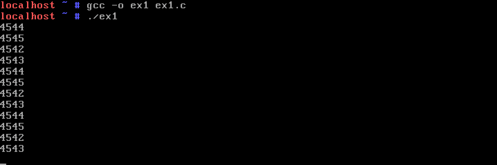
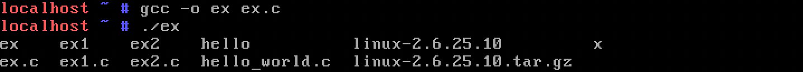
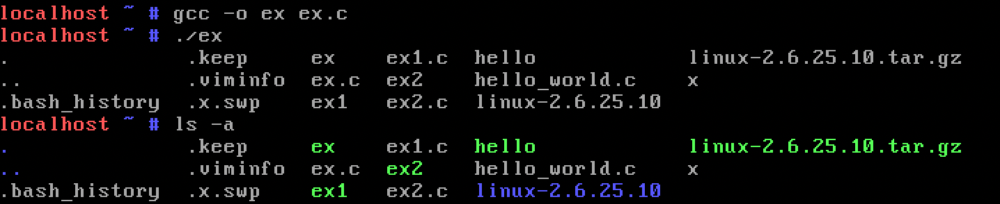

# Process (2)

12181879 이동건

## 10. Exercise

### 1) Run the program below. What happens? Explain the result.

`ex1.c` :

```c
void main(){
   int x;
   x=fork();
   printf("x:%d\n", x);
}
```

`fork`는 자신의 body와 process descriptor를 복사해 child process를 만들어낸다. <br>
`fork`가 성공하면 자식 프로세스에서는 0을 반환하고(실패시 -1), 부모 프로세스에서는 자식의 pid를 반환한다.



0은 자식 프로세스의 printf로부터 출력된 값이고, 4506은 부모 프로세스의 `printf`로부터 출력된 것이다.

### 2) Try below and explain the result.

`ex1.c` :

```c
void main(){
   fork();
   fork();
   fork();
   for(;;);
}
```

위 코드는 `fork`를 2번하고 무한루프를 돌고 있다.

```bash
$ gcc –o ex1 ex1.c
$ ./ex1 &
$ ps –ef
```

총 4개의 프로세스가 생성되는데, `fork` 함수가 2개이기 때문에 2^2=4개의 프로세스가 생성되었다.

<br>
<br>
<br>


### 3) Run following code. What happens? Explain the result.

`ex1.c` :

```c
#include <stdio.h>
#include <unistd.h>

void main(){
   int i; float y=3.14;
   fork();
   fork();
   for(;;){
      for(i=0;i<1000000000;i++) y=y*0.4;
      printf("%d\n", getpid());
   }
}
```

[2번](#2-try-below-and-explain-the-result)과 동일하게 총 4개의 프로세스가 생성된다. <br>4개의 프로세스에서 `y`에 대한 연산을 수행하고 자신의 PID를 출력한다.



무한루프이기 때문에 프로세스가 종료될 때까지 계속 연산을 수행하고 PID를 출력할 것이다.

### 4) Try below and explain the result.

`ex1.c` :

```c
void main(){
   char *argv[10];
   argv[0] = "./ex2";
   argv[1] = 0;
   execve(argv[0], argv, 0);
}
```

`ex2.c` :

```c
void main(){
   printf("korea\n");
}
```

`execve`는 현재 프로세스를 입력 받은 프로그램으로 프로세스를 교체해 새로 시작하는 함수이다. 첫 번째 인자로 프로그램 경로를 받고 두 번째 인자로 프로그램의 `argv`에 넘어갈 값을 받는다.

```bash
$ gcc –o ex1 ex1.c
$ gcc –o ex2 ex2.c
$ ./ex1
```


`ex1`에서 `execve`를 호출했기 때문에 현재 프로세스 body가 `ex2`의 body로 교체되고 새로 실행되기 때문에 `ex2`의 출력인 "korea"가 출력되었다.

### 5) Run following code and explain the result.

```c
void main() {
   char *argv[10];
   argv[0] = "/bin/ls";
   argv[1] = 0;
   execve(argv[0], argv, 0);
}
```

[4번](#4-try-below-and-explain-the-result)과 유사하지만, 실행되는 파일 이름이 "/bin/ls"로 바뀌었다.



`ls` 명령어는 `/bin/ls`이라는 프로그램을 실행하는 명령어이다. <br>
`execve`로 `/bin/ls`을 실행했기 때문에, `ls`를 실행한 결과와 같은 내용이 출력되었다.

### 6) Run following code and explain the result.

`argv`는 문자열 배열로 C언어에서 문자열과 같이 마지막 요소를 `NULL` 표시함으로써 배열의 끝을 나타낸다.

```c
void main() {
   char *argv[10];
   argv[0] = "/bin/ls";
   argv[1] = "-a";
   argv[2] = 0;
   execve(argv[0], argv, 0);
}
```

[5번](#5-run-following-code-and-explain-the-result)과 유사하지만, `argv`의 두 번째 요소로 "-a"가 들어왔다.

`ls`의 `-a` 옵션은 숨겨진 파일이나 디렉토리를 출력하는 옵션이다.



`ls -a`를 직접 실행해보았을 때, 동일한 출력 결과를 얻을 수 있었다.
