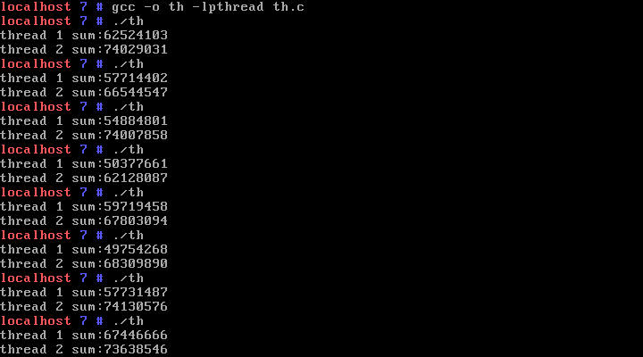
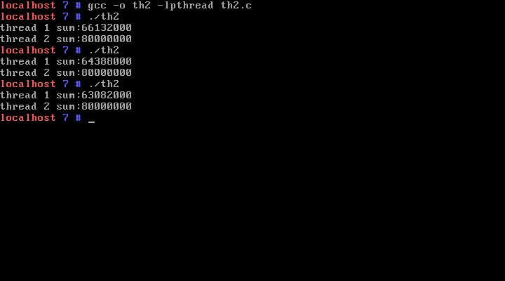
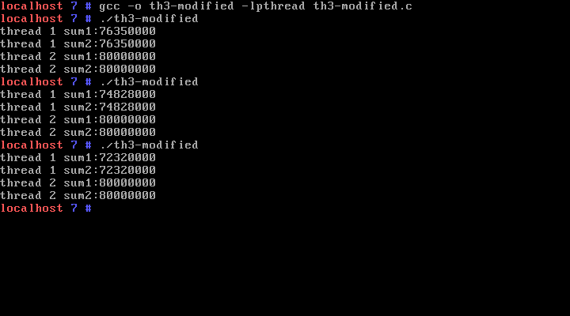
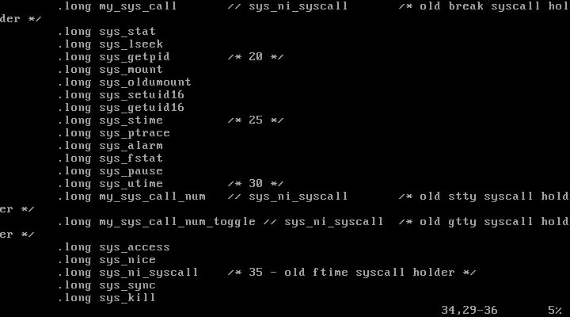
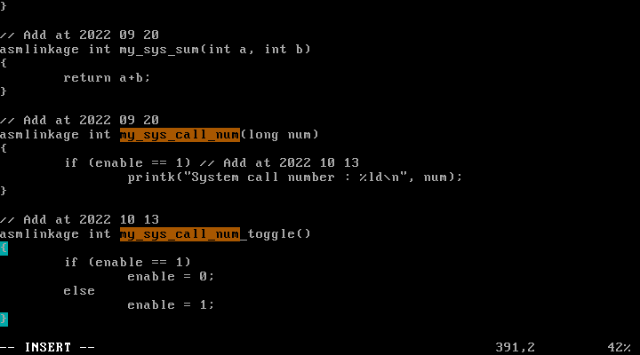
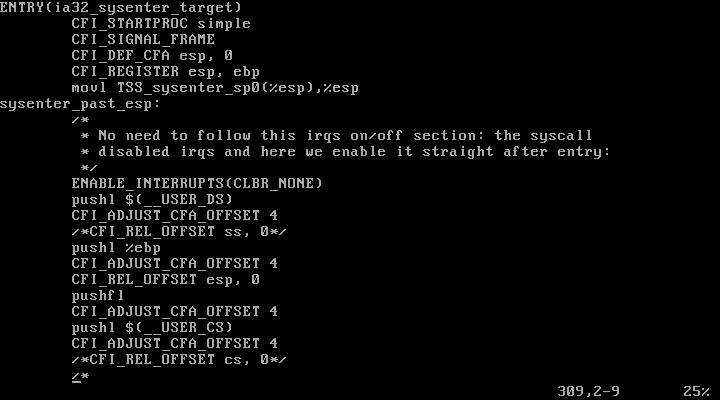
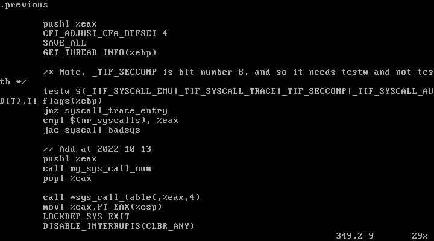

# IPC(Interprocess Communication)

- Communication between two processes
- SM(Shared Memory), MP(Message Passing)
  - SM
    - two processes share the same memory area
    - one of them writes data in it
    - the other reads from it
    - SM is faster but can cause "race condition"
    - e.g., thread
  - MP
    - Operating system provides system calls to relay messages
    - between processes

## 1. Communication between two processes

Accessing a variable or function in the other process is hard. Why?

## 2. Two approaches: MP, SM

- MP(Message Passing): ask OS to transfer the data to the other process
- SM(Shared Memory): access the variable in the other process directly with the help of OS

## 3. messge passing

### 3.1 Usage

`p1`:

```c
x = msgget(75, 0777|IPC_CREAT);
msgsnd(x, &msg, ......);
```

`p2`:

```c
x = msgget(75, 0777);
msgrcv(x, &msg);
```

### 3.2 data structure

msgget returns `struct msg_queue`.

```c
struct msg_queue{
   struct kern_ipc_perm  q_perm;
   .........
   struct list_head  q_messages;
};

struct kern_ipc_perm{
   .........
   int  key;
   unsigned short  mode;  // permission bit mask
   ........
};
```

## 4. Shared memory

### 4.1) usage

`p1` :

```c
x = shmget(75, 4, 0777|IPC_CREAT);
y= (int *)shmat(x, ......);
```

`p2` :

```c
x = shmget(75, 4, 0777);
y = (int *)shmat(x, ....);
```

example :

```c
x = shmget(75, 4, 0777|IPC_CREAT);
if ((fork())==0){ // child
   y= (int *) shmat(x, 0, 0);
   for(j=0;j<100;j++)
      for(i=0;i<10000;i++)
         *y = *y + 1;
   printf("child: the result is %d\n", *y);
}
else{ // parent
   y= (int *) shmat(x, 0, 0);
   for(j=0;j<100;j++)
      for(i=0;i<10000;i++)
         *y = *y + 1;
   printf("parent: the result is %d\n", *y);
}
```

### 4.2) data structure

`shmget()` returns `struct shmid_kernel`.

```c
struct shmid_kernel{
   struct kern_ipc_perm  shm_perm;
   struct file * shm_file; // this file represents the shared memory
                          // this file exists in the physical memory only except
                          // during swapped-out state. The physical location of
                          // this file is the physical location of the shared memory
   .........
};
```

`shmat()` allocates a space in the virtual address space and map this address to the physical location of the shared memory through the page table.

## 5. Race condition

Shared memory is fast but can cause "race condition". When the outcome of a computation depends on how two or more processes are scheduled, the code is incorrect. We say that there is a race condition.

### 5.1) Example

The example in [4.1.](#41-usage).

### 5.2) Why it happens?

```
*y = *y + 1 ==>
mov *y, eax ; *y -> eax
inc eax
mov eax, *y
```

### 5.3) When it happens?

- Critical section: the code area where a shared memory is accessed.
- Race condition can happen when two or more processes enter the CS at the same time.

### 5.4) How to solve?

- Basic idea: mutual exclusion.
- Mutual exclusion: Make sure only one process enters the CS.
- How can we guarantee the mutual exclusion?
  - method:
    - All processes check before entering CS if there is another process in the CS.
    - If there is one
      - wait until it comes out
    - Else
      - enter

### 5.5) Implementing mutual exclusion

- without os, pl
  - sw : dekker, peterson
  - hw : cli/sti, tsi
- with os
  - semaphore
- with pl
  - monitor

### 5.6) sw

P1, P2:

```
lp1: mov r0, lock
     cmp r0, 1
     je lp
     mov lock, 1
     -- CS --
     mov lock, 0
```

- lock=0 initially
- enter if lock=0

### 5.7) hw

P1,P2:

```
    cli
    --CS--
    sti
```

Or

```
    lp: tsl ro, lock
    cmp r0, 1
    je lp
    --CS--
    mov lock, 0
```

tsl ro, lock is same as the following operations all executed atomically

```
    ro = lock
    if (r0==0)
    lock=1
```

### 5.8) semaphore

P1,P2:

```
wait(s);
--CS--
signal(s);
```

wait(s):

```
   s = s - 1;
   if (s < 0)
      someone is already in CS. wait here. (insert into waiting list on s)
   else
      enter CS
```

signal(s):

```
   s = s + 1;
   if (s <=0)
      someone is in the waiting list. wake one up.
```

### 5.9) using semaphore

```c
int semid;
struct sembuf psembuf={0,-1,SEM_UNDO};
struct sembuf vsembuf={0,1,SEM_UNDO};
main(){
.............
semid = semget(75, 1, 0777|IPC_CREAT); // get a semaphore
sem_union.val=1;
semctl(semid, 0, SETVAL, sem_union); // initial value is 1
semop(semid, &psembuf, 1); // wait(s)
--CS--
semop(semid, &vsembuf, 1); // signal(s)
```

### 5.10) data structure for semaphore

`semget()` returns `struct sem_array`.

```c
struct sem_array{
   struct  kern_ipc_perm  sem_perm;
   struct  sem *            sem_base; // link list of sem structure
   .........
};
struct sem{
   unsigned long semval;  // value of this semaphore
   ......
};
```

### 5.11) Deadlock

Using semaphore correctly not easy. Example: producer-consumer problem.

[producer] produce item and push to the `stk`

```c
lp: get_item(&item);
if (top==MAX)
   sleep();
top=top+1;
stk[top]=item
if (top==1)
   wakeup(소비자);
goto lp;
```

[consumer] pop item from stk and consume

```c
lp: if (top==0)
   sleep();
item = stk[top];
top = top-1;
if (top==MAX-1)
   wakeup(생산자);
consume(item);
goto lp;
```

mutex : intialize with 1. sema for mutual exclusion
holes : initial val=MAX. sema for holes
items : initial val=0. sema for items produced so far

[producer]

```c
lp: get_item(&item);
wait(holes);
wait(mutex);
top=top+1;
stk[top]=item
signal(mutex);
signal(items);
goto lp;
```

[consumer]

```c
lp:
wait(items);
wait(mutex);
item = stk[top];
top = top-1;
signal(mutex);
signal(holes);
consume(item);
goto lp;
```

## 6. Exercise

### 1) Try below (`ex1.c`) and explain the result.

`ex1.c` :

```c
#include <stdio.h>

unsigned long long sum = 0;

int main(){
    int x = fork();
    if (x == 0) { // child
        int i, j;
        for (i=0; i<20000; i++)
            for(j=0; j<2000; j++)
                sum++;
        printf("child sum: %llu\n", sum);
    } else { // parent
        int i, j;
        for(i=0; i<20000; i++)
            for(j=0; j<2000; j++)
                sum++;
        printf("parent sum: %llu\n", sum);
    }
    return 0;
}
```

```bash
$ gcc -o ex1 ex1.c
$ ./ex1
```


`fork`로 새로운 프로세스를 만들면 프로세스 간의 변수를 공유하지 않고 새로운 메모리를 할당받는다. 그 결과, Race Condition이 일어나지 않고 두 프로세스 모두 40000000번의 연산을 수행하고 결과를 출력한다.

### 2) Try below (`th.c`) and explain the result.

```c
#include <stdio.h>
#include <string.h>
#include <pthread.h>
#include <stdlib.h>
#include <unistd.h>

pthread_t t1, t2;  // thread 1, thread 2
unsigned long long sum=0;

void * foo1(void *arg){
   int i,j;
   for(i=0;i<20000;i++){
      for(j=0;j<2000;j++)
         sum += 1;
   }
   printf("thread 1 sum:%llu\n", sum);
   return NULL;
}
void * foo2(void *arg){
   int i,j;
   for(i=0;i<20000;i++){
      for(j=0;j<2000;j++)
         sum += 1;
   }
   printf("thread 2 sum:%llu\n", sum);
   return NULL;
}

int main(void){
    pthread_create(&t1, NULL, &foo1, NULL);
    pthread_create(&t2, NULL, &foo2, NULL);
    pthread_join(t1, NULL);
    pthread_join(t2, NULL);
    return 0;
}
```

`undefined reference to 'pthread_create'` 에러를 방지하기 위해, `-lpthread` 옵션을 주어 `th.c`를 컴파일하였다.

```bash
$ gcc -o th -lpthread th.c
$ ./th
....
$ ./th
....
$ ./th
....
```



- (1) 실행 결과가 매번 달랐고 thread2의 `sum`은 기댓값인 80000000에 미치지 못했다.
- (2) 프로그램이 정상적으로 실행됐다면 `foo1`과 `foo2`가 전역변수 `sum`을 공유하기 때문에 thread2의 `sum`은 `80000000`이 되어야한다.
- (3) 각 thread의 연산이 길다보니 연산 중간에 timeout이 발생해 다른 thread가 schedule 되는 상황이 발생한다.
- (4) `sum += 1` . 코드는 어셈블리 코드로 나타내면 아래와 같다
  ```c
  mov eax, sum    // eax ← sum`
  inc eax         // eax = eax + 1
  mov sum, eax    // sum ← eax
  ```
- (5) 만약 여기서 thread1이 `mov eax, sum`이나 `inc eax`까지 실행 후 timeout되고, thread2를 거친 후 다시 thread1이
  schedule 될 때를 가정하면, thread2에서 계산했던 `sum`이 thread1의 eax에 반영되지 않는다. thread2 입장에서도 똑같이
  생각해볼 수 있다. <br>이러한 상황을 **race condition**이라 부르며 위와 같은 결과의 원인이 된다.

### 3) Try below(`th2.c`) and explain the result.

```c
#include <stdio.h>
#include <string.h>
#include <pthread.h>
#include <stdlib.h>
#include <unistd.h>

pthread_t t1, t2;  // thread 1, thread 2
pthread_mutex_t lock;  // semaphore
unsigned long long sum=0;

void * foo1(void *arg){
    int i,j;
    for(i=0;i<20000;i++){
        pthread_mutex_lock(&lock);
        for(j=0;j<2000;j++)
            sum += 1;
        pthread_mutex_unlock(&lock);
    }
    printf("thread 1 sum:%llu\n", sum);
    return NULL;
}
void * foo2(void *arg){
    int i,j;
    for(i=0;i<20000;i++){
        pthread_mutex_lock(&lock);
        for(j=0;j<2000;j++)
            sum += 1;
        pthread_mutex_unlock(&lock);
    }
   printf("thread 2 sum:%llu\n", sum);
   return NULL;
}

int main(void){
    pthread_mutex_init(&lock, NULL);
    pthread_create(&t1, NULL, &foo1, NULL);
    pthread_create(&t2, NULL, &foo2, NULL);
    pthread_join(t1, NULL);
    pthread_join(t2, NULL);
    pthread_mutex_destroy(&lock);
    return 0;
}
```

```bash
$ gcc -o th2 -lpthread th2.c
$ ./th2
...
$ ./th2
...
$ ./th2
.....
```



`pthread_mutex_t lock;`(semaphore)을 이용해 여러 thread가 동시에 한 변수에 접근할 수 없게 했다. <br>
그 결과, [2번처럼](#2-try-below-thc-and-explain-the-result) 최종 계산 값이 유실되지 않고 80000000이 항상 나온다.

thread1의 `sum`이 80000000이 아닌 이유는 thread2가 끝나기 전에 먼저 종료되고 thread2에서 80000000이 계산되기 때문이다.

### 4) (Deadlock) Try below(`th3.c`) and explain the result. Modify the code so that it won't have a deadlock.

`th3.c` :

```c
#include <stdio.h>
#include <string.h>
#include <pthread.h>
#include <stdlib.h>
#include <unistd.h>

pthread_t t1, t2;  // thread 1, thread 2
pthread_mutex_t lock1;  // semaphore 1 for sum 1
pthread_mutex_t lock2;  // semaphore 2 for sum 2

unsigned long long sum1=0;
unsigned long long sum2=0;

void * foo1(void *arg){
    int i,j;
    for(i=0;i<20000;i++){
        pthread_mutex_lock(&lock1);
        pthread_mutex_lock(&lock2);
        for(j=0;j<2000;j++)
            sum1 += 1;
        pthread_mutex_unlock(&lock1);
        for(j=0;j<2000;j++)
            sum2 += 1;
        pthread_mutex_unlock(&lock2);
    }
    printf("thread 1 sum1:%llu\n", sum1);
    printf("thread 1 sum2:%llu\n", sum2);

    return NULL;
}

void * foo2(void *arg){
    int i,j;
    for(i=0;i<20000;i++){
        pthread_mutex_lock(&lock2);
        pthread_mutex_lock(&lock1);
        for(j=0;j<2000;j++)
            sum1 += 1;
        pthread_mutex_unlock(&lock1);
        for(j=0;j<2000;j++)
            sum2 += 1;
        pthread_mutex_unlock(&lock2);
    }
    printf("thread 2 sum1:%llu\n", sum1);
    printf("thread 2 sum2:%llu\n", sum2);

    return NULL;
}

int main(void){
    pthread_mutex_init(&lock1, NULL);
    pthread_mutex_init(&lock2, NULL);
    pthread_create(&t1, NULL, &foo1, NULL);
    pthread_create(&t2, NULL, &foo2, NULL);
    pthread_join(t1, NULL);
    pthread_join(t2, NULL);
    pthread_mutex_destroy(&lock1);
    pthread_mutex_destroy(&lock2);

    return 0;
}
```

```bash
$ gcc -o th3 -lpthread th3.c
$ ./th3
# deadlock
```


코드를 수정하지 않고 실행하였더니, 두 프로세스가 서로 상대방의 semaphore가 풀리기를 기다리는 상태가 되어 프로그램이 더 이상 진행되지 않았다. 이러한 상황을 **deadlock**이라고 한다.

이는 `lock`이나 `unlock`의 순서를 잘못 사용하면 발생하게 된다. 위 코드에서 thread1이 `pthread_mutex_lock(&lock1);`를 실행한 직후 timeout으로 thread2가 schedule되면, thread2는 `pthread_mutex_lock(&lock2);`를 실행하고 그 다음 코드인 `pthread_mutex_lock(&lock1);`를 마주치면 thread1에 의해 아래의 CS로 접근할 수 없게 된다.<br>
이 상태에서 다시 thread1이 schedule되어 `foo1`의 다음 코드인 `pthread_mutex_lock(&lock2);`를 실행하면 이 역시 `lock2`의 CS가 thread2에 의해 block 되었기 때문에 더 이상 코드를 진행할 수 없게 된다.

deadlock을 방지하고자, `foo1`과 `foo2`의 lock 순서를 아래와 같이 수정하였다.

`th3-modified.c` :

```c
void * foo2(void *arg){
    int i,j;
    for(i=0;i<20000;i++){
        pthread_mutex_lock(&lock1);
        pthread_mutex_lock(&lock2);
        for(j=0;j<2000;j++)
            sum1 += 1;
        pthread_mutex_unlock(&lock1);
        for(j=0;j<2000;j++)
            sum2 += 1;
        pthread_mutex_unlock(&lock2);
    }
    printf("thread 2 sum1:%llu\n", sum1);
    printf("thread 2 sum2:%llu\n", sum2);

    return NULL;
}
```

```bash
$ gcc -o th3 -lpthread th3.c
$ ./th3
```



### 5). Find out the ISR2 function for `pthread_mutex_lock()` and trace the code. <br>You can do kernel tracing also in the following site: https://elixir.bootlin.com/linux/latest/ident/. <br>Select the [right version (v2.6.25.10) and type the ISR2 name in the search box](https://elixir.bootlin.com/linux/v2.6.25.10/C/ident/ISR2).

`arch/x86/kernel/syscall_table_32.S` :<br>


32번 자리에 `my_syscall_number_toggle`을 추가해주었다.

<br>

`fs/read_write.c `:<br>


`my_syscall_number_toggle`을 정의해주었다.

`arch/x86/kernel/entry_32.S` :<br>
<br>
......<br>


이렇게 했지만 `pthread_mutex_lock`의 시스템 콜 호출이 보이지 않았다.
