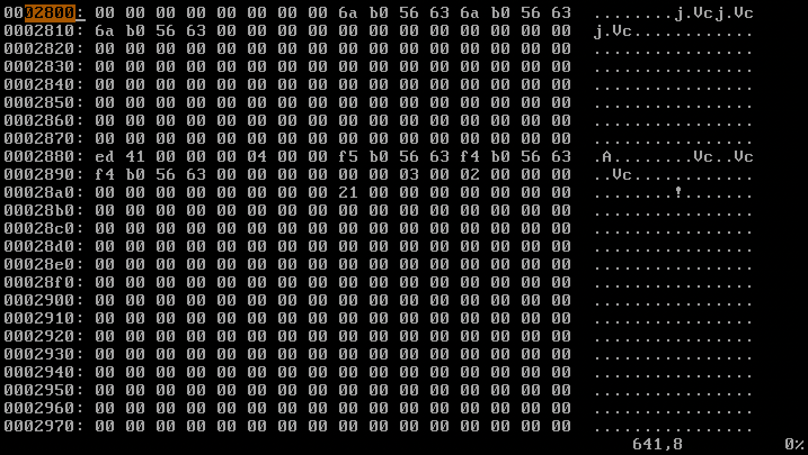
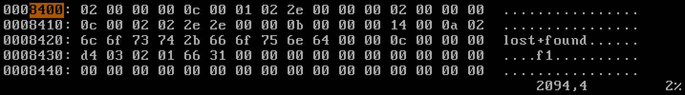
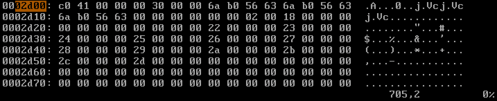
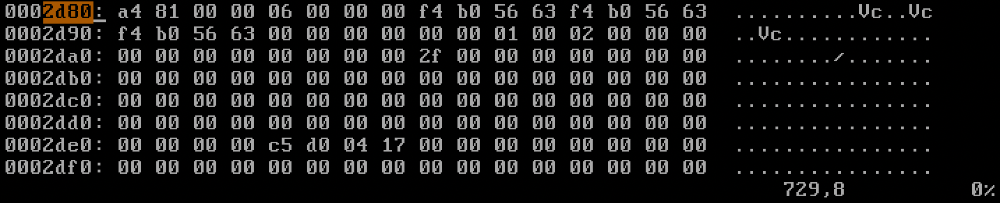
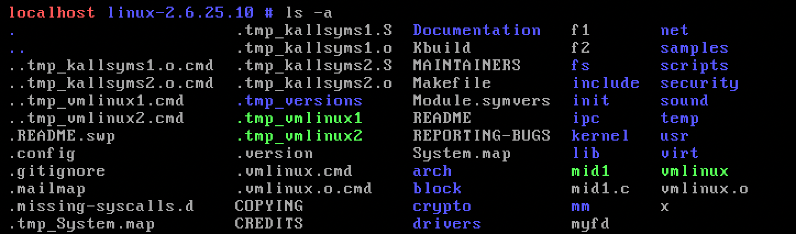
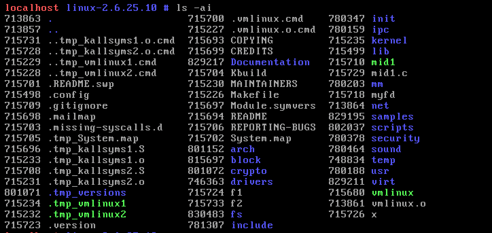

# 12181879 이동건

## 6. (homework) Read the disk and analyze the contents of the meta blocks.

### 9) Read the inode table and find the block location of the root directory file. What is the byte size and block size of this file? Who is the owner of this file?

각각의 inode는 inode table에서 0x80(=128)bytes를 차지한다.

0x2800에 첫번째 inode가 위치하고, 0x2880에 두번째 inode가 위치한다.

root directory file은 inode 2번이므로 0x2880~0x28ff에 기록되어있다.

```c
typedef struct  // inode
{
    ... ......
    u16 m_uid;  // 2-3
    u32 m_size; // 4-7
    ... ......
    u32 m_block[15];   // 28-2C block location of this file
    ... ......
} Inode;
```

inode struct에 따르면 파일의 block 위치를 나타내는 `m_block`은 [28-2C]에 위치한다.



해당 위치에 0x21이 기록된 것을 확인할 수 있다. 따라서 root directory의 file 위치는 0x21 \* 0x400 = 0x8400이다.

또한, `m_size`를 통해 byte size가 0x400 = 1024 bytes이고, `m_blcoks`를 통해 block size가 0x2 (512 bytes) = 1024 bytes임을 알 수 있다.

이 파일의 소유자는 uid field에 기록되며 0이다. uid 0은 root 사용자를 의미한다.

### 10) Read the root directory file. How many member files it has? What are the inode numbers and file names of them? Go to the inode table and find the block location of each member file.

root directory file의 시작 위치는 0x8400이다.



```c
typedef struct // directory
{
    u32 m_inode;
    u16 m_rec_len;
    u08 m_name_len;
    u08 m_file_type;
    char m_name[255];
} DirectoryEntry;
```

- 1. 파일 1
  - `u32 m_inode;` : inode는 00 00 00 02(=2)로 root directory file은 2번 inode에 속해있다.
  - `u16 m_rec_len;` : record length는 00 0c(=12)이다.
  - `u08 m_name_len;` : 01(=1)
  - `u08 m_file_type;` : 02(=2 : directory file)
  - `char m_name[255];` : 00 00 00 2e(=".")
- 2. 파일 2
  - `u32 m_inode;` : inode는 00 00 00 02(=2)로 2번 inode를 의미한다.
  - `u16 m_rec_len;` : record length는 00 0c(=12)이다.
  - `u08 m_name_len;` : 02(=2)
  - `u08 m_file_type;` : 02(=2 : directory file)
  - `char m_name[255];` : 00 00 2e 2e(="..")
- 3. 파일 3
  - `u32 m_inode;` : inode는 00 00 00 0b(=11)로 11번 inode를 의미한다.
  - `u16 m_rec_len;` : record length는 00 14(=20)이다.
  - `u08 m_name_len;` : 0a(=10)
  - `u08 m_file_type;` : 02(=2 : directory file)
  - `char m_name[255];` : 00 00 6c 6f 73 74 2b 66 6f 75 6e 64(="lost+found")
- 4. 파일 4
  - `u32 m_inode;` : inode는 00 00 00 02(=2)로 2번 inode를 의미한다.
  - `u16 m_rec_len;` : record length는 03 d4(=980)이다.
  - `u08 m_name_len;` : 0a(=10)
  - `u08 m_file_type;` : 01(=1 : regular file)
  - `char m_name[255];` : 00 00 66 31(="f1")

총 4개의 파일이 존재한다.

#### lost+found의 inode table



lost+found의 block location은 0x22 \* 0x400 = 0x8800 이다.

#### f1의 inode table



f1의 block location은 0x2f \* 0x400 = 0xbc00 이다.

### 11) Read the member files and confirm the contents.

#### lost+found directory file


lost+found의 directory file 내부에는 `.`과 `..`파일이 있다. `.`파일은 inode 번호가 11인 자신을 나타내고 `..`파일은 2번 root directory file을 의미한다.

#### f1 directory file


f1은 file type 번호가 1인 regular file로 f1의 data, ‘korea’가 기록되어있다.

### 12) You can see all files including hidden ones with `ls -a`. Confirm you can see all files you found in the file system with this command.

```bash
$ ls  -a
```



숨겨진 파일(`.`, `..`)을 포함한 현재 디렉터리의 모든 파일이 출력된다.

### 13) You can see the inode number of a file with `ls -i`. Confirm the inode numbers of all files.

```bash
$ ls  -ai
```



각 파일명 왼쪽에 inode 번호가 같이 출력된다.

### 14) Make another file in your virtual disk. Confirm the changes in the file system: IBM, DBM, Inode table, and root directory file. Now delete this file (with `rm` command). What happens to the file system? How can you recover this file?

```bash
$ mkdir temp
$ mount -o loop myfd temp  # virtual disk(myfd)와 temp 디렉토리 연결
$ echo hello > f3
$ ls
f1  f3  lost+found
$ cd ..
$ umount temp              # 연결 해제
$ xxd -g1 myfd > hw14      # 내용 추출
$ vi hw14
```

#### 14-1) Make a new directory (`d7`) in the root directory (of myfd) with `mkdir` command. Show the disk block content of the root directory file and find out the inode number of `d7`.

#### 14-2) Show the inode content of `d7`. What is the block location of `d7`? Show the block content of `d7`. What files do you have in `d7`?

#### 14-3) Run `mv f1 d7/f2` and show the changes in the root directory file, `d7` file, and inode table.

### 15) Examine the file system in the hard disk (/dev/sda3) and find file names in the root directory.

```bash
$ dd bs=1024 count=8000 if=/dev/sda3 of=myhd
$ xxd –g1 myhd > x
$ vi x
```

### 16) Write a program that opens a disk device formatted with EXT2 and reads and displays the super block, group descriptor, ibm, dbm, and inode table. Also display the file names in the root directory file, their inode numbers, and their block locations. Use open(), lseek(), read(), etc.

```c
         struct superblock{
             int  total_inode_num;
             int  total_block_num;
             .........
         };
         int x; char buf[1024]; struct superblock *sb;
         x=open("myfd", O_RDONLY, 00777); //open a virtual disk
         lseek(x, 1024, SEEK_SET); // move the file pointer to offset 1024 where the
                                    // superblock starts
         read(x, buf, 1024); // read the superblock into buf
         sb=(struct superblock *)buf; // interpret the data in buf as "struct superblock"
         printf("total inode num:%x, total_block_num:%x, ...",
               sb->total_inode_num, sb->total_block_num, ....);
```
