# On-memory file system

on-disk, on-memory file system, mounting, process and file system, file system calls

## 0. Accessing a file in EXT2

```c
x=open("/d1/d2/f1", .....);  // find the inode of "/d1/d2/f1"
```

- read the super block and find the location of the group descriptor
- read the group descriptor and find the location of the inode table
- read the inode table, find inode 2, find the block locations of "/"
- read the blocks of "/" and find the inode number of "d1"
- find the inode of "/d1" and find the block locations of "/d1"
- read the blocks of "/d1" and find the inode number of "d2"
- find the inode of "/d1/d2" and find the block locations of "/d1/d2"
- read the blocks of "/d1/d2" and find the inode number of f1
- find the inode of "/d1/d2/f1"

## 1. on-disk, on-memory file system

### 1) on-disk file system: file system data structure on disks. example: EXT2, FAT, ....

### 2) on-memory file system

- disk is slow => open, read, write take too much time
- we cache frequently-used data (superblock, inode, group descriptor,...) into memory
- when caching, some additional information is added
  - each disk has its own file system, and we need to know which meta block came from which disk

#### 2.1) caching superblock

- (1)
  - on-disk : ext2_super_block{}
  - on-mem: super_block{}
- (2) additional info in super_block{} (include/linux/fs.h)
  - s_list : next superblock
  - s_dev: device number. which disk this superblock came from?
  - s_type: file system type?
  - s_op : operations on superblock
  - s_root : root directory of the file system of this superblock
  - s_files : link list of file{} belonging to this file system
  - s_id : device name of this super block
- (3) all cached superblocks form a link-list pointed to by “super_blocks” (fs/super.c)

#### 2.2) caching inode

Individual inode is cached when accessed by the system.

- (1)
  - on-disk : ext2_inode{}
  - on-mem: inode{} (include/linux/fs.h)
- (2) additional info
  - i_list : next inode
  - i_dentry: corresponding dentry list for this inode
  - i_ino : inode number
  - i_rdev: device this inode belongs to
  - i_count: usage counter
  - i_op: operations on this inode
  - i_sb: pointer to super_block{} this inode belongs to
  - i_pipe: used if a pipe
- (3) all cached inodes form a linked-list pointed to by “inode_in_use” (fs/inode.c)

#### 2.3) caching other blocks

- (1) added info
  - a buffer_head{} structure is attached to each cached block: (include/linux/buffer_head.h)
  - b_blocknr : block number
  - b_bdev : device this block belongs to
  - b_size : block size
  - b_data : original block
- (2) all cached blocks are attached to a hash table, “hash_table_array”(linux 2.4)

#### 2.4) dentry table

- (1) for each cached directory entry, dentry{} structure is defined
  - For example, when reading “/aa/bb”, three dentry objects are created: one for “/”, another for “aa”, and the last for “bb”.
- (2) dentry{} (include/linux/dcache.h)
  - d_inode: pointer to the corresponding inode
  - d_op : operations on this dentry
  - d_mounted: this inode is a mounting point if d_mounted > 0
  - d_name: corresponding file name (d_name.name is the actual file name)

## 2. mounting

All cached file systems are connected into one virtual file system through “mounting”

### 1) root file system: the first file system cached into the system

- other file systems are mounted on this root file system

### 2) mount(“/dev/x”, “/y/z”) or "mount /dev/x /y/z"

- meaning: mount the file system in /dev/x on /y/z
  - mounted file system: /dev/x
  - mounting point: /y/z
- mounting process:
  - cache the file system in /dev/x
  - cache superblock of /dev/x : sb
  - cache the root inode of /dev/x : rinode
  - sb->s_root = rinode
  - connect the new file system to the mounting point
    - ```
        d_mounted of /y/z += 1
        allocate vfsmount{}and set
                mnt_mountpoint=/y/z
                mnt_root= rinode
                mnt_sb=sb
        insert this vfsmount{} into mount_hashtable
      ```
    ````
    - ```c
        struct vfsmount{ // include/linux/mount.h. mounting info of this fs
            struct vfsmount *mnt_parent;  // parent vfsmount
            struct dentry *mnt_mountpoint; // mounting point
            struct dentry *mnt_root;       // root of this file system
            struct super_block *mnt_sb;    // super block of this file system
            char *mnt_devname;  // dev name
            .......
        };
    ````

### 3) example

Suppose we have two disks: dev0 and dev1. Suppose they have the file trees as below:

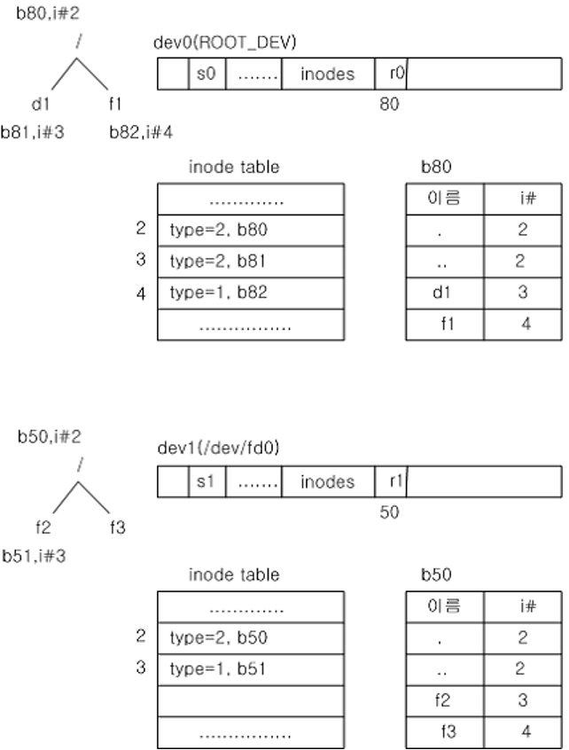

Assume dev0 is the root device (one which has the root file system).

#### (1) start_kernel() -> kernel_init() -> prepare_namespace()->mount_root()

- mount_root() caches the root file system: - cache the superblock - cache the root inode
  After this, the system has:


#### (2) “mount /dev/fd0 /d1”

- cache the file system in /dev/fd0
- cache the superblock of /dev/fd0
- cache the root inode of /dev/fd0
- cache the inode of /d1
- cache the block of “/”
- cache the inode of /d1
- connect the root inode of /dev/fd0 to /d1

After caching the file system of /dev/fd0:<br>
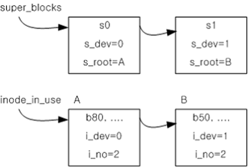

After caching the block of “/”:<br>
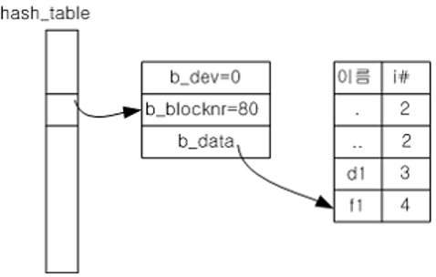

After caching the inode of “/d1” and connecting the new file system with this:<br>
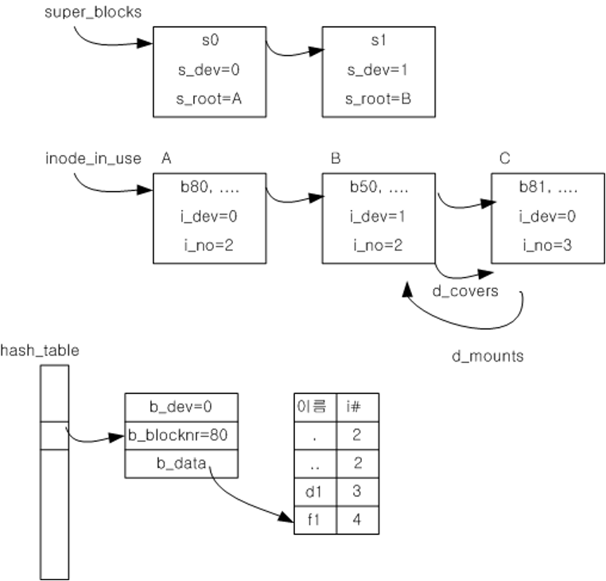

After mounting, the final tree looks like:<br>
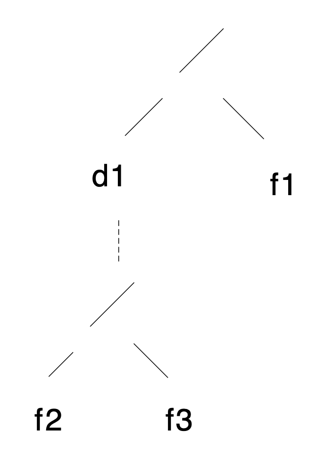

The above tree will look as below to the user:<br>
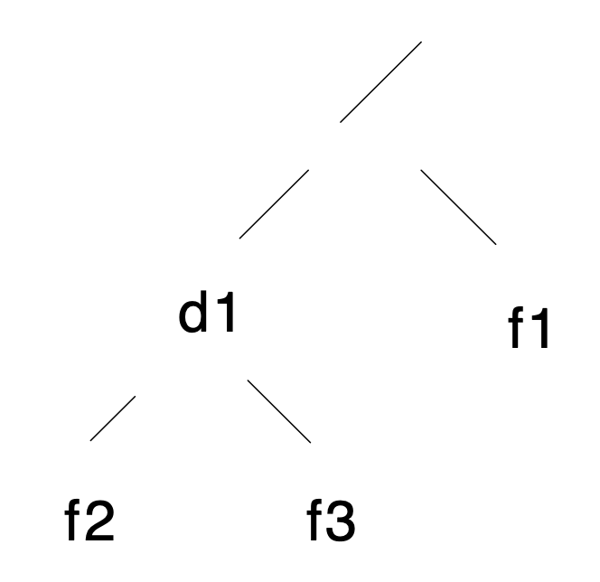

## 3. process and file system

- each process has “root” and “pwd” to access the root of the file system and to access the current working directory, respectively.
  - example
    - p1's root is what p1 thinks as "root"
    - p1's pwd is the current location of p1
    - when p1 says "/aa/bb", the system starts at p1's root for the search
    - when p1 says "aa/bb", the system starts at p1's pwd for the search
  - `chroot()` changes “root” to a “new root”
  - `chdir()` changes “pwd” to a “new pwd”.
- each process has “fd table” for file accessing
- the system has “file table” to control the file accessing by a process
- the on-mem file system is represented by inode_in_use, super_blocks, hash_table_array

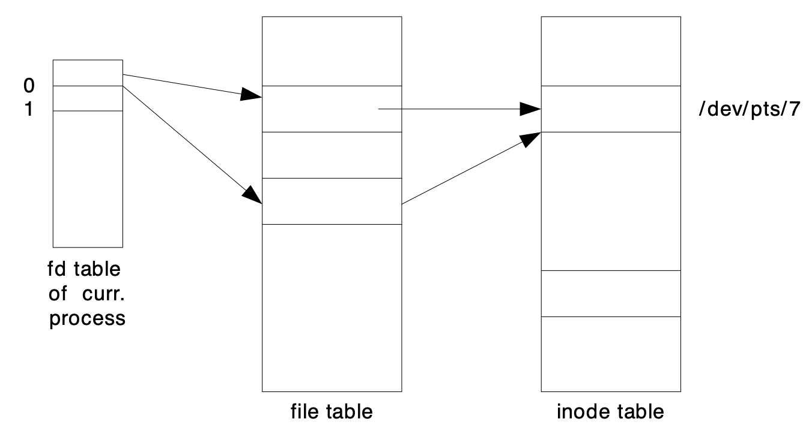

### 1) file table

- for each opened file, we have file{} structure (include/linux/fs.h)
  - f_list: next file{}
  - f_dentry: link to the inode (actually dentry{}) of this file
  - f_op : operations on this file{ (open, read, write, ...)
  - f_pos : file read/write pointer. shows how much has been read/written
  - f_count: number of links to this file{}
  - ..........
- super_block{}->s_files contains a link list of file{} for each file system

### 2) root, pwd, fd table

- each process has (in task_struct) -- include/linux/sched.h

```c
struct fs_struct  *fs;
struct files_struct  *files;
struct nsproxy    *nsproxy;  // namespace

struct nsproxy{ // include/linux/nsproxy.h
    struct mnt_namespace *mnt_ns;
    ......
};
struct mnt_namespace{ // include/linux/mnt_namespace.h
    struct vfsmount * root;   // vfsmount of this process
    .........
};
```

- fs contains root, pwd info

```c
struct fs_struct{  // include/linux/fs_struct.h
    struct path    root,  // the root inode of the file system
                    pwd;  // the present working directory
    .........
};
struct path { // include/linux/path.h
    struct vfsmount *mnt;
    struct denry *dentry;
};
```

- files contains fd table

```c
struct files_struct{ // include/linux/file.h
    struct fdtable *fdt;;
    ...........
};
struct fdtable{
    struct file **fd;  // fd table. file{} pointer array.
    .......
};
```

- fork system call copies this fs, files structure, too – so, the child inherits the root, pwd, and fd table of the parent.

## 4. file system calls

### 1) open

```c
x = open(“/aa/bb”, O_RDWR, 00777);
```

- meaning: find the inode of /aa/bb and open it
- algorithm:
  - find the inode of `/aa/bb`
  - cache into memory
  - connect to file table
    - allocate `file{},` `y`, insert to `sb->s_files` linklist(`sb` is the superblock of this process)
    - `y->f_dentry` = inode of `/aa/bb`
    - `y->f_pos=0`
  - find an empty entry in `fd` table, `z`, and link to `y`
    - `fd[z] = y`
  - `return z`
- Example:
  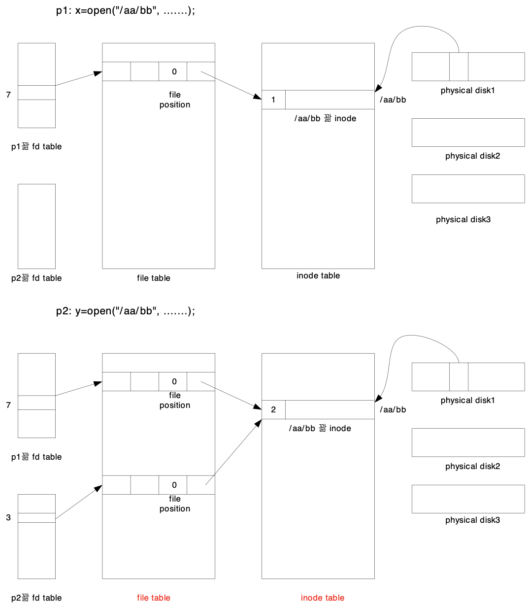

### 2) read

```c
y = read(x, buf, 10)
```

- meaning: go to the file pointed to by `fd[x]` and read 10 bytes into `buf` with `f_op->read()`
- algorithm:
  - go to `file{}` pointed to by `fd[x]`
  - go to `inode{}` pointed to by `file{}->f_dentry`
  - find the block location we want
  - find the block in hash_table_array
  - if not there, cache the block first
  - read max 10 bytes starting from `file{}->f_pos` into `buf`
  - increase `file{}->f_pos` by actual num of bytes read
  - return the actual num of bytes read

### 3) write

```c
y = write(x, buf, 10)
```

- meaning: go to the file pointed to by `fd[x]`, write max 10 bytes starting from the corresponding `f_pos`, increase `f_pos` by the actual num of bytes written, and return the actual num of bytes written.

### 4) close

```c
close(x);
```

- meaning: close the file pointed to by `fd[x]`
- algorithm:
  - `fd[x]=0`
  - `file{}->f_count--` , where `file{}` is the one pointed to by `fd[x]`

### 5) lseek

```c
lseek(x, 20, 0)
```

- meaning: modify `f_pos` to 20, where `f_pos` is the file pointer of file `x`.
- example:

```c
x=open(“/aa/bb”, .......);  // open file /aa/bb
read(x, buf, 10);           // read first 10 bytes into “buf”
lseek(x, 50, SEEK_SET);     // move f_pos to offset 50
read(x, buf, 10);           // read 10 bytes staring from offset 50
```

### 6) dup

```c
y = dup(x);
```

- meaning: copy `fd[x]` into `fd[y]`
- example:

```c
x = open(“/aa/bb”, ........);  // fd[x] points to /aa/bb
y = dup(x);               // fd[y] also points to /aa/bb
read(x, buf, 10);    // read first 10 bytes
read(y, buf, 10);    // read next 10 bytes
```

### 7) link

```c
y = link(“/aa/bb”, “/aa/newbb”);
```

- meaning: `/aa/newbb` is now pointing to the same file as `/aa/bb`
- algorithm:
  - make file `newbb` in `/aa` directory
  - give it the same inode as `/aa/bb`

## 5. homework

### 1) Your Gentoo Linux has two disks: `/dev/sda3` and `/dev/sda1`. Which one is the root file system? Where is the mounting point for the other one? Use `mount` command to answer this.

```bash
$ mount
```

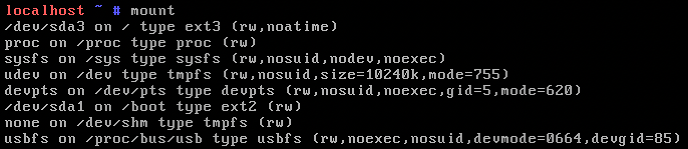

`/dev/sda3`은 `/`에 연결되었고, `/dev/sda1`은 `/boot`에 연결되었다. 따라서 `/dev/sda3`은 루트 파일 파티션이고, `/dev/sda1`은 부팅 파티션이다.

### 1-1) Redo 1) after mounting myfd to temp directory as you did in hw3 in lecture6-fs.docx.

```bash
$ mkdir temp
$ mount -o loop myfd temp # connect myfd to temp direcotry, which is called mounting
$ mount
```

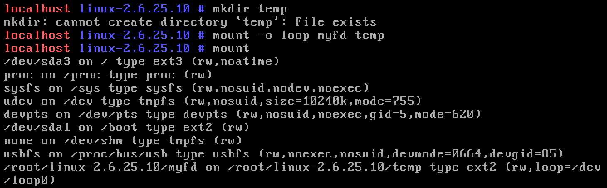

`/root/linux-2.6.25.10/myfd`은 `/root/linux-2.6.25.10/temp`에 추가로 연결된 것을 확인할 수 있다.

### 2) Add another entry in `/boot/grub/grub.conf` as below. This boot selection does not use initrd directive to prevent initramfs loading (initramfs is a temporary in-ram file system used for performance improvement).

`/boot/grub/grub.conf`에 아래와 같이 entry를 추가하였다.

```bash
$ vi /boot/grub/grub.conf
```

```
title=MyLinux3
root (hd0,0)
kernel /boot/bzImage root=/dev/sda3
```

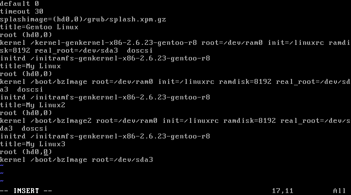

그 후, 변경사항을 컴파일 하고 재부팅시켰다.

```bash
$ cd linux-2.6.25.10
$ make bzImage
$ cp arch/x86/boot/bzImage /boot/bzImage
$ reboot
```

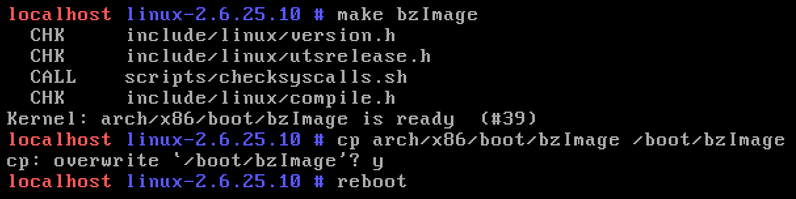

재부팅 후에는 My Linux3를 사용하였다.

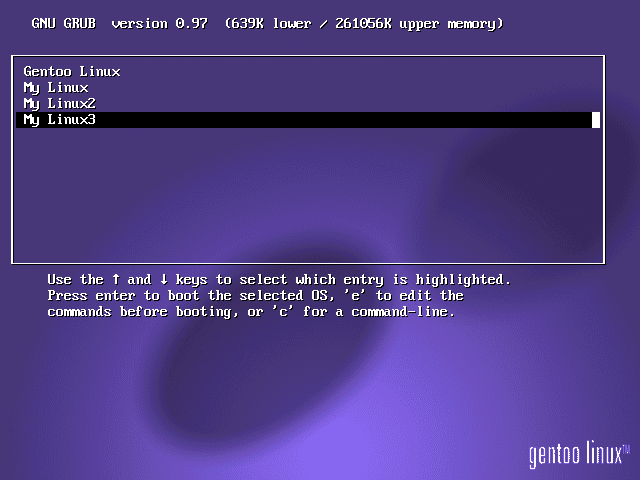

### 3) The kernel calls `mount_root` to cache the root file system. Starting from `start_kernel`, find out the chain of intermediate functions that eventually calls `mount_root`. Confirm your prediction by printing out messge at each intermediate function of this chain until you reach `mount_root()`.

`init/main.c` - `start_kernel` :<br>
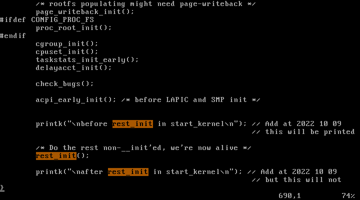<br>
`start_kernel`에서는 `rest_init`을 호출한다.

`init/main.c` - `rest_init` :<br>
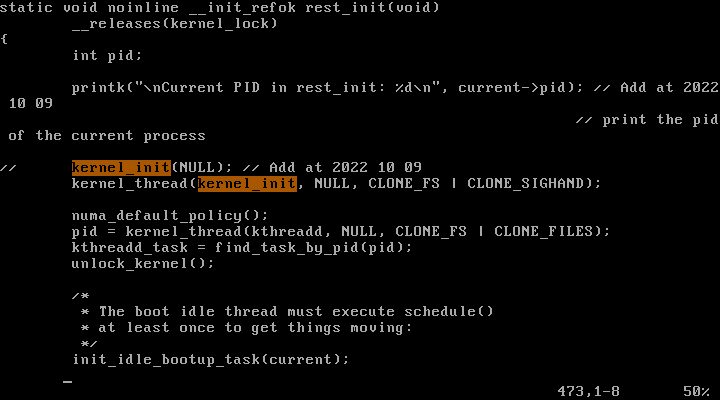<br>
`rest_init`에서는 `kernel_init`을 호출한다.

`init/main.c` - `kernel_init` :<br>
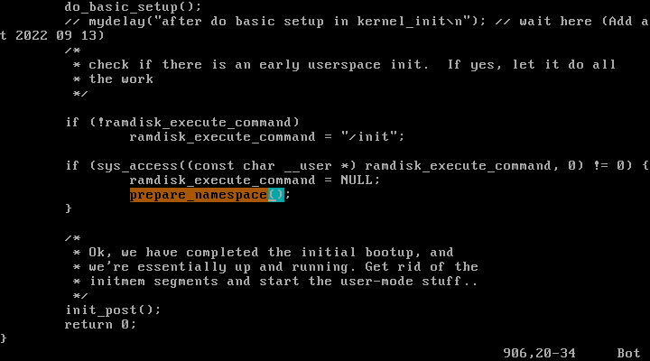<br>
`kernel_init`에서는 `init/do_mounts.c`에 있는 `prepare_namespace`을 호출한다.

`init/do_mounts.c` - `prepare_namespace` :<br>
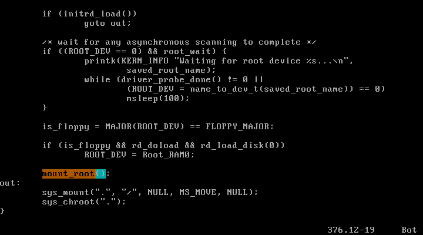<br>
`prepare_namespace`에서는 `mount_root`을 호출한다.

`init/do_mounts.c` - `mount_root` :<br>
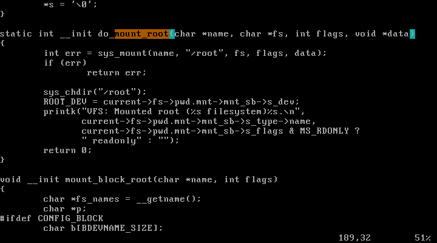<br>
`mount_root`는 root file system을 caching한다.

### 4) Find the data type for each added variable for `super_block`, `inode`, `buffer_head`, and `dentry`.

`include/linux/fs.h`:

```c
struct super_block {
    struct list_head s_list; /* Keep this first */
    dev_t s_dev;             /* search index; _not_ kdev_t */
    unsigned long s_blocksize;
    unsigned char s_blocksize_bits;
    unsigned char s_dirt;
    unsigned long long s_maxbytes; /* Max file size */
    struct file_system_type *s_type;
    const struct super_operations *s_op;
    struct dquot_operations *dq_op;
    struct quotactl_ops *s_qcop;
    const struct export_operations *s_export_op;
    unsigned long s_flags;
    unsigned long s_magic;
    struct dentry *s_root;
    struct rw_semaphore s_umount;
    struct mutex s_lock;
    ...
};

struct inode {
    struct hlist_node i_hash;
    struct list_head i_list;
    struct list_head i_sb_list;
    struct list_head i_dentry;
    unsigned long i_ino;
    atomic_t i_count;
    unsigned int i_nlink;
    uid_t i_uid;
    gid_t i_gid;
    dev_t i_rdev;
    u64 i_version;
    loff_t i_size;
#ifdef __NEED_I_SIZE_ORDERED
    seqcount_t i_size_seqcount;
#endif
    struct timespec i_atime;
    struct timespec i_mtime;
    struct timespec i_ctime;
    unsigned int i_blkbits;
    blkcnt_t i_blocks;
    unsigned short i_bytes;
    umode_t i_mode;
    spinlock_t i_lock; /* i_blocks, i_bytes, maybe i_size */
    struct mutex i_mutex;
    ...
};
```

`include/linux/buffer_head.h`:

```c
struct buffer_head {
    unsigned long b_state;           /* buffer state bitmap (see above) */
    struct buffer_head *b_this_page; /* circular list of page's buffers */
    struct page *b_page;             /* the page this bh is mapped to */

    sector_t b_blocknr; /* start block number */
    size_t b_size;      /* size of mapping */
    char *b_data;       /* pointer to data within the page */

    struct block_device *b_bdev;
    bh_end_io_t *b_end_io;             /* I/O completion */
    void *b_private;                   /* reserved for b_end_io */
    struct list_head b_assoc_buffers;  /* associated with another mapping */
    struct address_space *b_assoc_map; /* mapping this buffer is associated with */
    atomic_t b_count;                  /* users using this buffer_head */
};
```

`include/linux/deache.h`:

```c
struct dentry {
    atomic_t d_count;
    unsigned int d_flags;  /* protected by d_lock */
    spinlock_t d_lock;     /* per dentry lock */
    struct inode *d_inode; /* Where the name belongs to - NULL is negative */
    /*
     * The next three fields are touched by __d_lookup.  Place them here
     * so they all fit in a cache line.
     */
    struct hlist_node d_hash; /* lookup hash list */
    struct dentry *d_parent;  /* parent directory */
    struct qstr d_name;

    struct list_head d_lru; /* LRU list */
    /*
     * d_child and d_rcu can share memory
     */
    union {
        struct list_head d_child; /* child of parent list */
        struct rcu_head d_rcu;
    } d_u;
    struct list_head d_subdirs; /* our children */
    struct list_head d_alias;   /* inode alias list */
    unsigned long d_time;       /* used by d_revalidate */
    struct dentry_operations *d_op;
    struct super_block *d_sb; /* The root of the dentry tree */
    void *d_fsdata;           /* fs-specific data */
#ifdef CONFIG_PROFILING
    struct dcookie_struct *d_cookie; /* cookie, if any */
#endif
    int d_mounted;
    unsigned char d_iname[DNAME_INLINE_LEN_MIN]; /* small names */
};
```

### 5) Change the kernel such that it displays all superblocks before it calls `mount_root` and after `mount_root`. Boot with "My Linux3" to see what happens.

모든 superblocks를 표시하기 위해 아래 코드를 `prepare_namespace` 함수 정의 전에 추가해주었다.

```c
void display_superblocks(){
    struct super_block *sb;
    list_for_each_entry(sb, &super_blocks, s_list) {
        printk("dev name:%s dev maj num:%d dev minor num:%d root ino:%d\n",
                sb->s_id, MAJOR(sb->s_dev), MINOR(sb->s_dev),
                sb->s_root->d_inode->i_ino);
    }
}
```

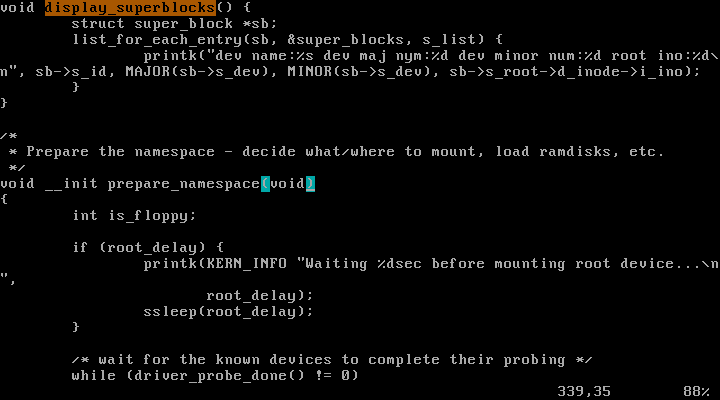

그리고, `prepare_namespace` 함수 정의 내에서 `mount_root` 함수를 호출하는 부분의 앞뒤로 `display_superblocks()` 함수를 호출해주었다.

변경사항을 적용하기 위해 컴파일하고, 재부팅하며 부팅 메세지를 확인하였다.

```bash
$ make bzImage
$ cp arch/x86/boot/bzImage /boot/bzImage
$ reboot
# Boot with "My Linux3"
$ dmesg > x
$ vi x
```

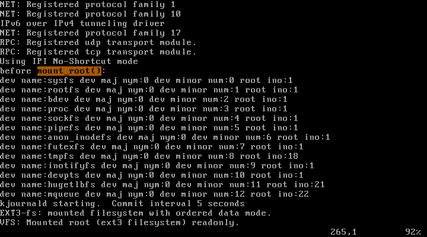
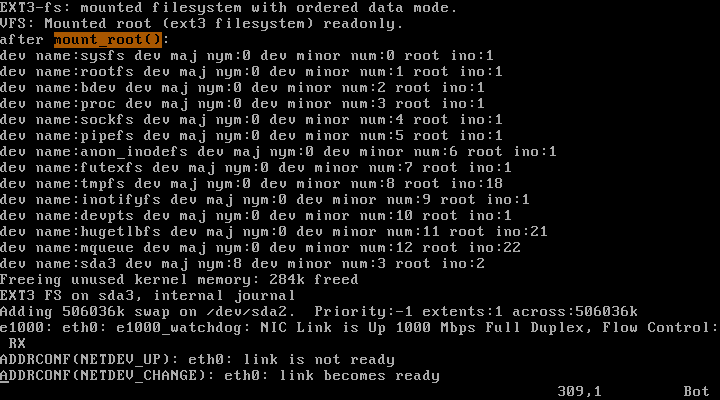

mount_root가 호출된 이후에는 "dev name: sda3, dev major num: 8, dev minor num: 3, root ino: 2"가 더 출력된다.

디바이스 번호는 각 디바이스의 고유번호이다. "/dev"에 각 디바이스의 파일 이름이 적혀 있고, ls -l을 통해 각 디바이스의 major, minor 번호를 볼 수 있다. major 번호는 그 디바이스의 번호이고, minor 번호는 그 디바이스 종류 안에서의 구별 번호를 의미한다. 위 내용은 "Documentation/devices.txt"으로 가면 자세한 정보를 볼 수 있다.

### 6) Change the kernel such that it displays all cached inodes before it calls `mount_root` and after `mount_root`. Boot with "My Linux3" to see what happens.

To display all cached indoes, use below.

```c
extern struct list_head inode_in_use;
void display_all_inodes(){
    struct inode *in;
    list_for_each_entry(in, &inode_in_use, i_list){
        printk("dev maj num:%d dev minor num:%d inode num:%d sb dev:%s\n",
MAJOR(in->i_rdev), MINOR(in->i_rdev), in->i_ino, in->i_sb->s_id);
    }
}
```

#### 6-1) Modify display_all_inodes such that it can also diplay the file name and file byte size of each file represented by the inode.

#### 6-2) Make a system call that displays file name and file byte size of all inodes in use. Show only the first 100 files. Look at the result with dmesg command.

#### 6-3) Modify your system call in 6-2) so that it can display mounting points. Mount myfd to temp directory and confirm your system call can detect it.

### 7) The pid=1 process (kernel_init) eventually execs to `/sbin/init` with `run_init_process("/sbin/init");` by calling `kernel_execve("/sbin/init", ....)` in `init/main.c/init_post()`. Change the kernel such that it execs to `/bin/sh`. Boot the kernel, and you will find you cannot access `/boot/grub/grub.conf`. Explain why.

`init/main.c` :<br>
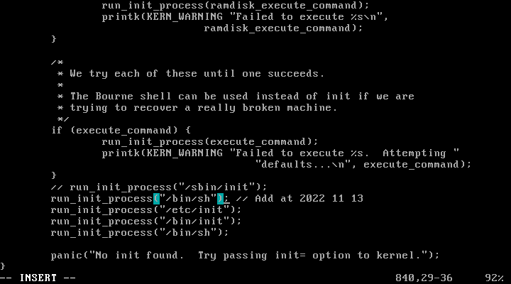

커널이 로드되면 메모리, 프로세서, I/O 등 여러 하드웨어를 초기화하고 설정한다. 압축된 initramfs 이미지를 메모리의 미리 정해진 위치로부터 읽어 "/sysroot/"에 직접 풀고, 모든 필요한 드라이버를 로드한다. 그 후, 커널은 루트 장치를 생성하여 읽기 전용으로 루트 파티션을 마운트하고 사용되지 않는 메모리를 해제한다.

커널이 로드되면 사용자 환경을 설정하기 위해 "/sbin/init" 프로그램을 실행한다. "/sbin/init" 프로그램은 최상위 프로세스(pid = 1)로, 나머지 부트 프로세스를 주관하며 사용자를 위한 환경을 설정하는 역할을 한다.

"/sbin/init"는 파일 시스템의 구조를 검사하고, 시스템을 마운트하고, 서버 데몬을 띄우고, 사용자 로그인을 기다리는 등의 역할을 한다. 만약 "/sbin/init"을 실행하지 않고 "/bin/sh"를 실행하면, "/dev/sda1"가 "/boot"에 연결되지 않을 것이다.

### 8) Try following code. Make `/aa/bb` and type some text with length longer than 50 bytes. Explain the result.

```bash
$ cd /      # cd /로 /에 가서
$ mkdir aa  # mkdir aa로 /aa 디렉토리를 만들고
$ cd aa     # cd aa로 aa에 이동해서
$ vi bb     # vi bb로 /aa/bb를 만듭니다.
```

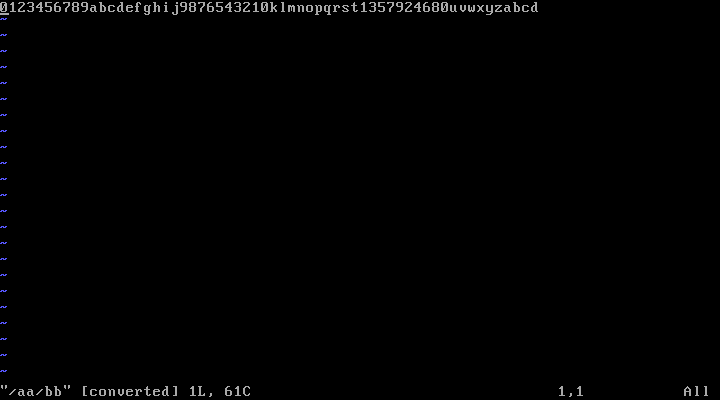

```bash
$ vi ex1.c
```

[`ex1.c`](./code/ex1.c) :

```c
#include <fcntl.h>
#include <stdio.h>
#include <unistd.h>

int main(void)
{
    char buf[100];
    int x = open("/aa/bb", O_RDONLY, 00777);
    int y = read(x, buf, 10);
    buf[y] = '\0';
    printf("we read %s\n", buf);

    lseek(x, 20, SEEK_SET);
    y = read(x, buf, 10);
    buf[y] = '\0';
    printf("we read %s\n", buf);

    int x1 = dup(x);
    y = read(x1, buf, 10);
    buf[y] = '\0';
    printf("we read %s\n", buf);

    link("/aa/bb", "/aa/newbb");
    int x2 = open("/aa/newbb", O_RDONLY, 00777);
    y = read(x2, buf, 10);
    buf[y] = '\0';
    printf("we read %s\n", buf);

    return 0;
}
```

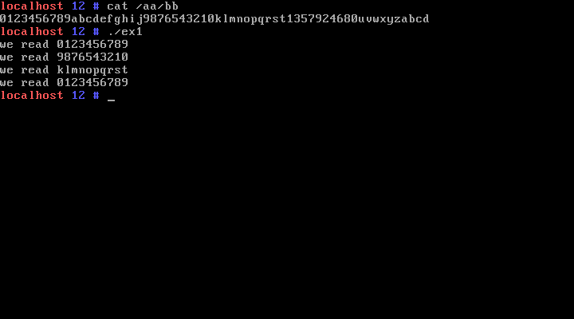

첫번째 `printf` 시점의 `buf`는 `/aa/bb`의 10바이트만큼 `read`한 것이므로 "0123456789"가 출력되었다.

두번째 `printf` 시점에 `x`의 포인터는 `lseek`를 통해 문자열의 현재 위치로부터 20바이트만큼 옮겨졌다. 이 때의 출력되는 `buf`는 파일의 20바이트부터 10바이트만큼 `read`한 것이므로 "9876543210"이 출력되었다.

세번째 `printf` 시점에는 `x1`이 `dup`를 통해 `x`로부터 복제되었다. 이 때의 출력되는 `buf`는 두번째 `printf` 시점에서 마지막으로 읽은 위치의 다음 위치부터 10바이트만큼 `read`한 것이므로 "klmnopqrst"가 출력되었다.

네번째 `printf` 시점에 `link`를 통해 `/aa/newbb`가 같은 파일인 `/aa/bb`를 가리키게 되었다. `buf`는 새로운 `/aa/newbb`의 10바이트만큼 `read`한 것이므로 "0123456789"가 출력되었다.

### 9) Check the inode number of `/aa/bb` and `/aa/newbb` and confirm they are same.

```bash
$ ls –i /aa/*
```


`/aa/bb`와 `/aa/newbb`의 inode number는 "502947"로 동일한 것을 확인하였다.

### 10) Try `fork()` and confirm the parent and child can access the same file.

[`ex2.c`](./code/ex2.c) :

```c
#include <fcntl.h>
#include <stdio.h>
#include <unistd.h>

int main(void)
{
    char buf[100];
    int x = open("/aa/bb", O_RDONLY, 00777);
    int y = fork();
    int z;

    if (y == 0)
    {
        z = read(x, buf, 10);
        buf[z] = '\0';
        printf("child read %s\n", buf);
    }
    else
    {
        z = read(x, buf, 10);
        buf[z] = '\0';
        printf("parent read %s\n", buf);
    }

    return 0;
}
```

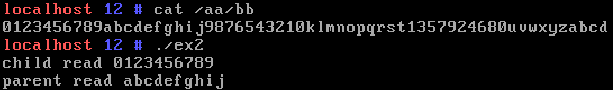

parent와 child가 동일한 파일에 접근한 것을 확인할 수 있다. 프로세스가 `fork`되면 `x`의 `f_pos`가 저장되는 위치도 같이 복사되므로 두 프로세스가 이를 공유하게 된다. 따라서 parent는 child가 읽었던 부분부터 계속 읽게 된다.

### 11) (Using `chroot` and `chdir`) Do following and explain the result of `ex1`.

#### a. Make `f1` in several places with different content (in `/`, in `/root`, and in `/root/d1`) as follows.

```bash
$ cd  /
$ echo hello1 > f1
$ cd
$ echo hello2 > f1
$ mkdir d1
$ echo hello3 > d1/f1
```

#### b. Make `ex3.c` that will display "/f1" before and after `chroot`, and "f1" before and after `chdir` as follows.

[`ex3.c`](./code/ex3.c) :

```c
#include <fcntl.h>
#include <stdio.h>
#include <unistd.h>

void display_root_f1(void) // display the content of "/f1"
{
    char buf[100];
    int x = open("/f1", O_RDONLY);
    int y = read(x, buf, 100);
    buf[y] = '\0';
    printf("%s\n", buf);
}

void display_f1(void)      // display the content of "f1"
{
    char buf[100];
    int x = open("f1", O_RDONLY);
    int y = read(x, buf, 100);
    buf[y] = '\0';
    printf("%s\n", buf);
}

int main(void)
{
    display_root_f1(); // display the content of "/f1"
    chroot(".");
    display_root_f1(); // display the content of "/f1"
    display_f1();      // display the content of "f1"
    chdir("d1");
    display_f1();      // display the content of "f1"
    return 0;
}
```

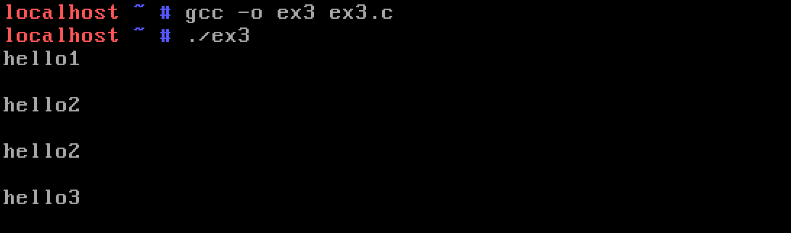

- 첫 `display_root_f1`은 `cd /`로 이동해서 만든 `f1`의 내용을 보여준다.
- `chroot(".")`를 통해 현재 디렉토리로 root가 변경이 되는데, 현재 디렉토리는 홈 디렉토리이다.
- root가 변경된 이후로 다시 `display_root_f1`을 실행하면 현재 디렉토리가 root이므로 현재 디렉토리에 있는 `f1`의 내용이 출력되므로 hello2가 출력이 된다.
- 첫 `display_f1`은 현재 디렉토리의 `f1`의 내용이 출력되므로 똑같이 hello2가 출력된다.
- `chdir("d1")`으로 현재 디렉토리를 `d1`을 바꾼 뒤 실행하면, `d1` 안쪽에 만든 `f1`이 출력되므로 hello3이 출력된다.

### 12) Make a new system call, `my_show_fpos()`, which will display the current process ID and the file position for `fd=3` and `fd=4` of the current process. Use this system call to examine file position as follows. (Use `%lld` to print the file position since f_pos is long long integer)

`arch/x86/kernel/syscall_table_32.S` :<br>
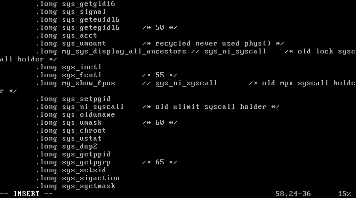

56번에 `my_show_fpos` 시스템 콜을 등록해준다.

`fs/read_write.c` :

```
asmlinkage void my_show_fpos(void)
{
    printk("fd=3, f_pos=%lld\n", current->files->fdt->fd[3]->f_pos);
    printk("fd=4, f_pos=%lld\n", current->files->fdt->fd[4]->f_pos);
}
```

[`ex4.c`](./code/ex4.c) :

```c
#include <fcntl.h>
#include <stdio.h>
#include <unistd.h>

void my_show_fpos()
{
    syscall(56);
}

int main(void)
{
    char buf[25];
    int x = open("f1", O_RDONLY);
    int y = open("f2", O_RDONLY);

    my_show_fpos(); // f_pos right after opening two files
    read(x, buf, 10);
    read(y, buf, 20);
    my_show_fpos(); // f_pos after reading some bytes

    return 0;
}
```

```bash
$ make bzImage
$ cp arch/x86/boot/bzImage /boot/bzImage
$ reboot
# after reboot
$ echo 8 > /proc/sys/kernel/printk
$ ./ex4
```

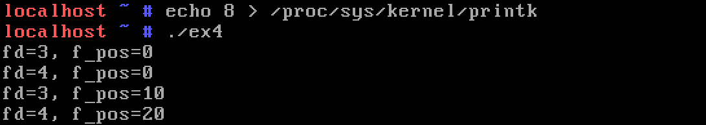

`x`와 `y`는 각각 파일 디스크립터 3과 4를 의미한다. 각각 10글자, 20글자를 읽었으므로 `f_pos`가 0에서 10이, 10에서 20이 되었다.

### 13) Modify your `my_show_fpos()` such that it also displays the address of `f_op->read` and `f_op->write` function for fd 0, fd 1, fd 2, fd 3, and fd 4, respectively. Find the corresponding function names in `System.map`. Why the system uses different functions for fd 0, 1, 2 and fd 3 or 4?

`fs/read_write.c` :

```c
asmlinkage void my_show_fpos(void)
{
    printk("fd=3, f_pos=%lld\n", current->files->fdt->fd[3]->f_pos);
    printk("fd=4, f_pos=%lld\n", current->files->fdt->fd[4]->f_pos);

    // Update
    int i;
    for(i = 0; i < 5; i++) {
        printk("fd=%d, read=%p\n", i, current->files->fdt->fd[i]->f_op->read);
        printk("fd=%d, write=%p\n", i, current->files->fdt->fd[i]->f_op->write);
    }
}
```

```bash
$ make bzImage
$ cp arch/x86/boot/bzImage /boot/bzImage
$ reboot
# after reboot
$ echo 8 > /proc/sys/kernel/printk
$ ./ex4
```

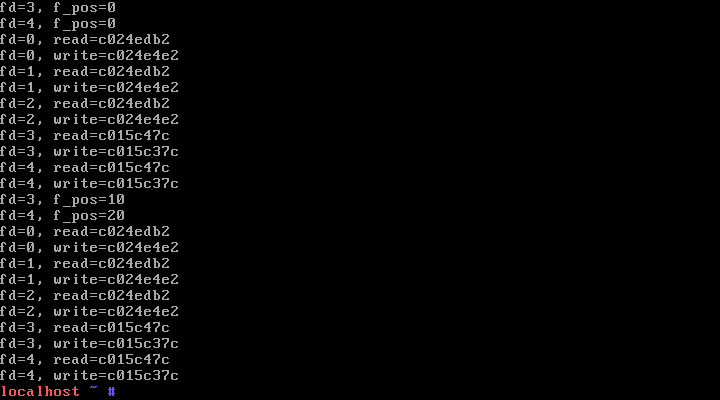

read와 write 함수의 주소를 출력할 수 있게 했다. 출력된 주소를 리눅스 코드의 `System.map`에서 찾아보면 아래와 같이 나온다. `System.map`은 컴파일할 때마다 리눅스 코드 디렉토리에 생성된다.

### 14) Use `my_show_fpos()` to explain the result of the following code. File `f1` has “ab” and File `f2` has “q”. When you run the program, File `f2` will have “ba”. Explain why `f2` have “ba” after the execution.

```c
#include <fcntl.h>
#include <stdio.h>
#include <unistd.h>

void my_show_fpos()
{
    syscall(56);
}

int main(void)
{
    char buf[10];
    int f1 = open("./f1", O_RDONLY, 00777);
    int f2 = open("./f2", O_WRONLY, 00777);
    printf("f1 and f2 are %d %d\n", f1, f2); // make sure they are 3 and 4
    if (fork() == 0)
    {
        my_show_fpos();
        read(f1, buf, 1);
        sleep(2);
        my_show_fpos();
        write(f2, buf, 1);
    }
    else
    {
        sleep(1);
        my_show_fpos();
        read(f1, buf, 1);
        write(f2, buf, 1);
    }

    return 0;
}
```

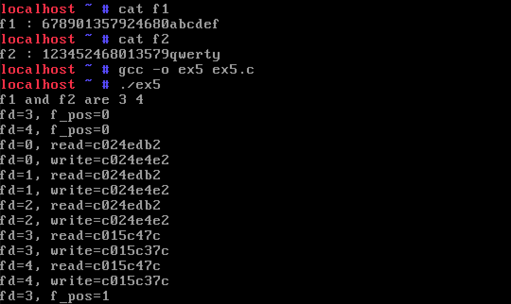<br>
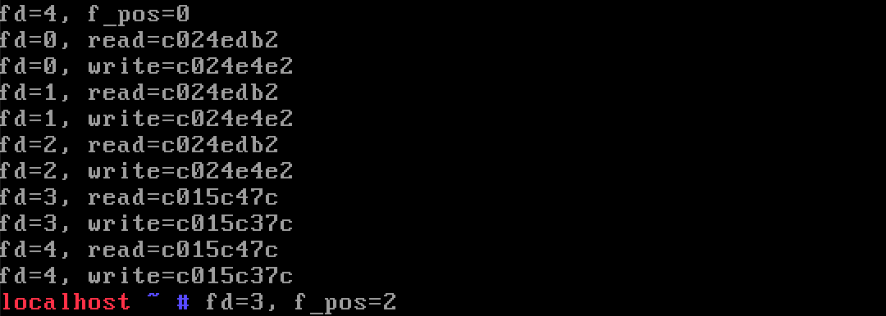<br>
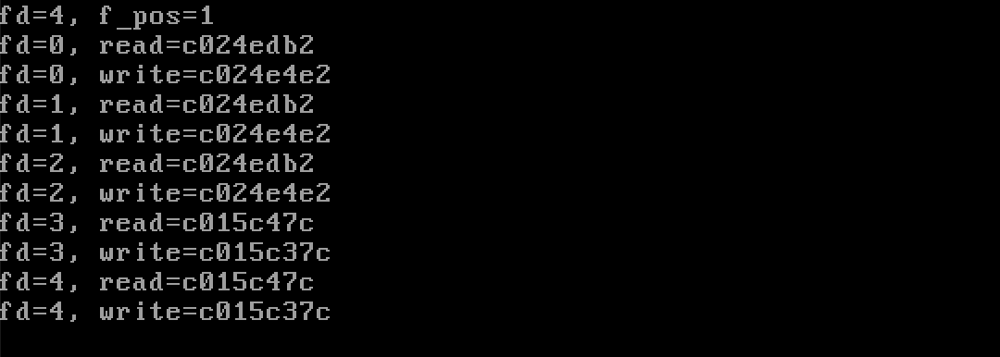

`fork`에 의해 `f_pos`를 공유하는 프로세스 2개로 나누어진다.
가장 먼저 자식 프로세스에서 `f1`과 `f2` 초기 상태를 출력하고 둘 다 `f_pos`는 0이다.
그후 "f1" 파일을 읽어 `buf`에 저장한다. 현재 `buf`에서는 `['a']`가 저장되어 있다.

자식 프로세스가 2초간 대기하는 사이에, 부모 프로세스는 `f1`과 `f2` 상태를 출력하고 이때 `f1`의 `f_pos`가 읽은 글자 수만큼 증가한 것을 확인할 수 있다.
다시 한 글자 읽어 `buf`에 저장하면 `buf`에는 `['b']`가 저장되게 된다.
두 프로세스 사이에 `buf`와 같은 지역변수는 공유되지 않는다.

부모 프로세스의 `buf`를 "f2"에 저장하고, 1초 후 자식 프로세스의 `buf`를 "f2"에 저장하면 "f2"는 "ba"가 된다.

### 15) Find corresponding kernel code for each step below in open and read system calls:

- `x=open(fpath, .......);`
  - 1.  find empty fd
  - 2.  search the inode for "fpath"
    - 2-1) if "fpath" starts with "/", start from "fs->root" of the current process
    - 2-2) otherwise, start from "fs->pwd"
    - 2-3) visit each directory in "fpath" to find the inode of the "fpath"
    - 2-4) while following mounted file path if it is a mounting point.
  - 3.  find empty file{} entry and fill-in relevant information.
  - 4.  chaining
  - 5.  return fd
- `read(x, buf, n);`
  - 1.  go to the inode for x
  - 2.  read n bytes starting from the current file position
  - 3.  save the data in buf
  - 4.  increase the file position by n

### 16) Make a file, /f1. Write some text in it.

```bash
$ cd /
$ vi f1
..........
$
```

Try to read this file before “`mount_root`”, after “`mount_root`”, after sys_mount(“`.`”, “`/`”, ...), and after sys_chroot(“`.`”) in `init/do_mounts.c/prepare_namespace()`. Explain what happens and why. For this problem, the `kernel_init` process should exec to `/sbin/init`.
