# Memory

## 1. goal

- Store processes into memory in an efficient way.
- Efficient in two ways
  - space efficiency : no waste of memory space
  - speed efficiency : fast access (address => physical location in memory)

## 2. basic solution (paging)

- process = sequence of pages
- memory = sequence of page frames
- store the pages of a process in empty page frames of the memory
- remember the location of each page in a page table(task_struct->mm->pgd)
- In default, 1 page= 1 page frame = 4K byte = 4096 byte = 0x1000 byte.

## 3. process image

- process = application code, data, stack + library code, data, stack + .............
- 1 process = 4G byte
- the layout of a process can be shown roughly with printf or exactly with /proc/pid/map
  - (do "man 5 proc" to see the explanation about /proc directory)

### 1) with `printf`

`ex3.c` :

```c
int x;
int y;
void main(){
    y=x+3;
    printf("x:%p y:%p main:%p\n", &x, &y, main);
    for(;;);
}
```

Compile:

```bash
$ gcc -o ex3 ex3.c
```

run:

```bash
$ ./ex3&
x:0x804a01c y:0x804a020 main:0x80483b4
[1] 4693
```

- From above, we can say the location of code and data segment and pid is 4693.
  - code: 8048000
  - date: 804a000

### 2) /proc/xxx/maps shows the layout of a process whose pid=xxx (For mor detailed layout, type `readelf -S ex3`: .text is code section, .data is initialized data section, .bss is uninitialized data section)

example)

```bash
$ ./ex3 &
$ ps
  PID TTY          TIME CMD
4601 tty1    00:00:00 bash
4693 tty1    00:02:24 ex3
4694 tty1    00:00:00 ps
$ cat /proc/4693/maps
Start      end       perm offset    dev   inode       file
08048000-08049000 r-xp 00000000 08:03 614956     /root/ex3
08049000-0804a000 r--p 00000000 08:03 614956     /root/ex3
0804a000-0804b000 rw-p 00001000 08:03 614956     /root/ex3
b7de7000-b7de8000 rw-p b7de7000 00:00 0
b7de8000-b7f12000 r-xp 00000000  08:03 113693    /lib/libc-2.6.1.so
b7f12000-b7f14000 r--p 0012a000  08:03 113693    /lib/libc-2.6.1.so
b7f14000-b7f15000 rw-p 0012c000  08:03 113693    /lib/libc-2.6.1.so
..........................
```

- The above map shows that process 4693 has
  - code at 08048000-08049000 (page number 8048)
  - read-only (such as linking info) data at 08049000-0x80da000 (page number 8049)
  - data at 0804a000-0804b000 (page number 804a)
  - c library code at b7de8000-b7f12000 (page number b7de8 to b7f11)
  - c library data at b7f14000-b7f15000 (page number b7f14)

#### (hw 1-1) Draw the memory map (process image) of the following program (`ex1.cpp`). What are the starting addresses of the code, data, heap, stack segment of this program and how many pages each segment occupies? What is the address of main function, the addresses of the global variables and local variables?

`ex1.cpp` :

```c
#include <stdio.h>
int x;
int y[10000];
int main(){
   int k;
   int *pk;
   pk=new int;
   printf("ex1. &main:%p &x:%p &y:%p &y[9999]:%p &k:%p &pk:%p pk:%p\n", main,&x,&y,&y[9999],&k,&pk,pk);
   for(;;);  // to see memory map of this process
   return 0;
}
```

`printf`의 출력 결과는 Logical 주소를 의미하는 것이기 때문에 실제 메모리에 저장되는 위치를 알기 위해서는 Process Table을 열어 Physical 주소를 확인해야 한다.

```bash
$ g++  -o ex1 ex1.cpp
$ ./ex1 &
$ cat /proc/(pid of ex1)/maps > x1
$ vi x1
```

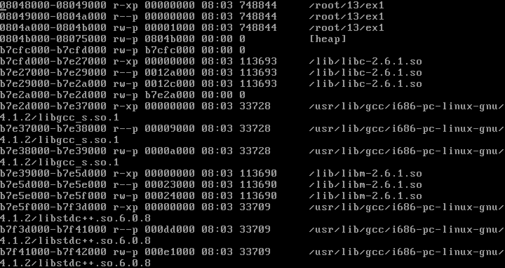<br>
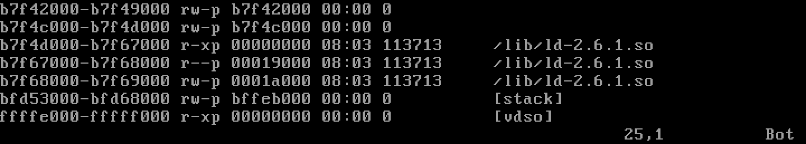

| Segment        | Address                              | Identifier       |
| -------------- | ------------------------------------ | ---------------- |
| Code           | 08048000-08049000                    | `&main`          |
| Read-Only Data | 08049000-0804a000                    |                  |
| Data           | 0804a000-0804b000                    | `&x`, `&y`       |
| Heap           | 0804b000-08075000, b7e22000-b7e23000 | `&y[9999]`, `pk` |
| C Library Code | b7e23000-b7f4d000                    |                  |
| C Library Data | b7f4d000-b7f50000                    |                  |
| Library Loader | b7f58000-b7f74000                    |                  |
| Stack          | bfc5f000-bfc74000                    | `&k`, `&pk`      |

#### (hw 1-2) Write another simple program, `ex2.cpp` (see below), and run `ex2`, `ex1` at the same time. Confirm they have the same address for main function. How can they run at the same location at the same time?

`ex2.cpp` :

```c
#include <stdio.h>
int x1;
int main(){
   int *pk1;
   pk1 = new int;
   printf("ex2. &main:%p &x1:%p\n", main,&x1);
   for(;;);  // to see memory map of this process
   return 0;
}
```

```bash
$ g++ -o ex2 ex2.cpp
$ ./ex2 &
...........
$ ./ex1 &
...........
$ ps
.............. ex2
.............. ex1
```


ex1과 ex2의 main 주소가 0x80484f4로 똑같이 출력된다. 하지만 이는 컴파일러가 생성한 logical address이다.<br>
`ps` 명령어로 PID를 확인해보면, 실제 memory에 load된 physical address는 서로 다르다는 것을 확인할 수 있다.<br>
따라서 ex1과 ex2는 동시에 실행이 가능하다.

## 4. similarity with file system

### 4.1) FS and MM

The goal is similar, and the basic solution is also similar. For a file, all information about a particular file is stored at the corresponding inode{}; for a process, all information is stored at the corresponding task_struct{}. For a file, the block location of this file is stored in inode->i_private->i_block[] table; for a process, the page location of this process is stored in task_struct->mm->pgd table.

example)
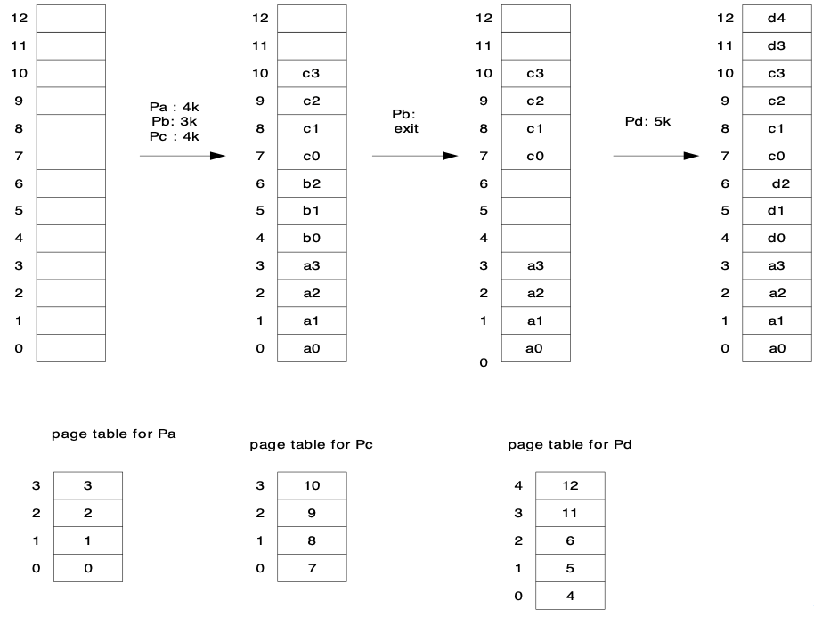

#### (hw 2) Show the memory map of the following program. Which pages does the program access during the run time? Show the page numbers that the program accesses in the order they are accessed. Indicate which pages are for code and which are for global data and which are for local data. To predict page numbers, you need to print the address of main, variable `i` and `j`, and the address of `A[0]`, `A[1]`, .., `A[4]`.

`ex4.c`:

```c
#include <stdio.h>
int A[5][1024];
int main()
{
    int i, j;
    printf("ex4. &main:%p &i:%p &j:%p\n", main, &i, &j);
    for (i = 0; i < 5; i++)
    {
        printf("   A[%d][0]:%p\n", i, &A[i][0]);
        printf("A[%d][1023]:%p\n", i, &A[i][1023]);
        for (j = 0; j < 1024; j++)
            A[i][j] = 3;
    }
    for (;;);
}
```

```bash
$ ./ex4 &
```

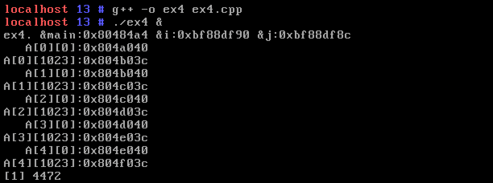

| Segment | Page        | Identifier    |
| ------- | ----------- | ------------- |
| Code    | 8048-8049   | `&main`       |
| Data    | 804a-804b   | `&A`          |
| Heap    | 804b-8050   | `&A[4][1024]` |
| Stack   | bfc5d-bfc72 | `&i`, `&j`    |

기본적으로 Page의 크기는 4KB이기 때문에 "/proc/pid/maps"에서 0x1000당 한 Page라고 볼 수 있다.
그렇기 때문에 시작과 끝 메모리 주소에서 뒤 3자리를 제하면 Page 번호를 구할 수 있다.
프로그램은 Code(`main`) -> Data(전역변수) -> Heap(전역변수) -> Stack(지역변수) 순으로 접근한다.

### 4.2) Address mapping (assume 1block=1page=4K)

#### FS:

```c
      x=open("/aa/bb", ...);     // assume /aa/bb is at disk block 100, 101
      lseek(x, 4098, SEEK_SET);
      read(x, buf, 10);
```

- read 10 bytes from file /aa/bb starting at logical address 4098
- logical address 4098 = (file block 1, offset 2)
- inode tells that file block 1 is at disk block 101 (i_block[0]=100, i_block[1]=101)
- physical address = (disk block 101, offset 2)
- read 10 bytes from disk block 101 at offset 2

#### MM:

```c
    y = x + 3;       // assume x is at 0x804a040 (logical address) and stored at
                     // 0x7000040 (physical address)
```

- read value of x = read 4 bytes at logical address 0x804a040
- logical address 0x804a040 = (page 0x804a, offset 0x40)
- mm->pgd tells page 0x804a is at frame 0x7000
- physical address = (memory frame 0x7000, offset 0x40)
- read 4 bytes from physical address 0x7000040

## 5. Three problems with paging

### 1) Process is much bigger than a file while the memory is much smaller than a disk.

- All files can be stored in a disk.
- But not all processes can be stored in the physical memory.
- Solution: virtual memory, demand paging

### 2) Page table itself is also very large

- 1 page = 4KB
- 4GB = 4GB/4KB pages = 1MB pages
- 1MB page = 1MB\*(4 bytes/frame number)= 4MB
- So we need 4M bytes for page table for each process in addition to the process body itself which is 4G bytes. If we have 1000 processes running in the system (which is not unusual), we need 4GB for page tables only.
- Solution: 2-level paging

### 3) Address mapping is becoming slower

- logical address => physical address mapping is needed in paging system:
  - the pages of a process are randomly stored in the memory page frames
  - whenever we need a page x of a process, we have to find the corresponding physical frame y
  - accessing a page of a process usually happens every 3 instructions
    - movl $0x4, 0x80495b4 ; mov $4, x. access page 0x8049
    - mov 0x80495b4, %eax ; mov x, eax. access page 0x8049
    - add $0x3, %eax ; add 3, eax
    - mov %eax, 0x80495b8 ; mov eax, y. access page 0x8049
- Solution: TLB cache

## 6. Solution

- To use paging system, we need to solve the three problems described in [Section 5](#5-three-problems-with-paging).
- The basic solution is "virtual memory" and "caching".

### 1) process size too big

- solution:
  - Store only active pages of the process in memory. For other pages, just remember where they are in disk so that they can be fetched whenever they are needed.
- assumption:
  - locality of reference: the reference to pages are usually localized within a few number of pages (working set).
- example:
  - 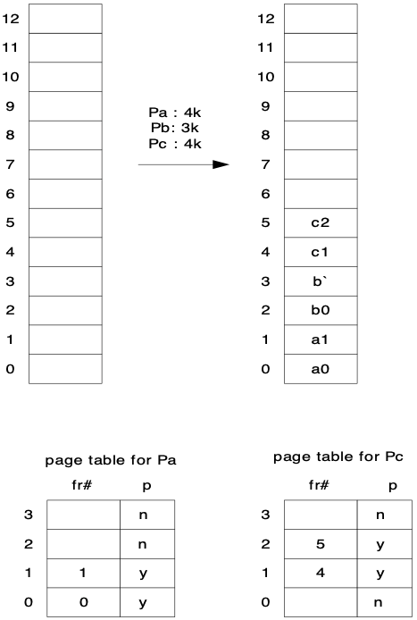
- Only some pages are stored in memory (In above, we assumed 2 frames are allowed per process)
- If a page not in memory is referred, we have a page fault (INT 14)
- When page fault happens,
  - we have to expel one page to disk to make an empty frame (if all frames are busy)
    - which page to expel? : LRU(Least Recently Used)
  - and bring the needed page from disk into memory
  - page fault -> INT 14 -> page_fault() in arch/x86/kernel/entry_32.S -> do_page_fault() in arch/x86/mm/fault.c
- The expelled page
  - is just destroyed if its copy exists in disk (e.g. code page)
  - goes to swap space if it is a dynamically generated page
    - ("swapon -s" will show the partition/file location of the swap space)
- The system needs to know which page is where in disk: VMA list for each process
  - VMA list: vm_area_struct \* task_struct->mm->mmap
  - vm_area_struct: include/linux/mm_types.h
    - ```c
        struct vm_area_struct {
           unsigned long vm_start, vm_end;
           struct vm_area_struct *vm_next;
           struct file * vm_file;
           ......
        }
      ```

example of VMA list:

`xx.c` :

```c
#include <stdio.h>
#include <stdlib.h>
int i=1; int j=10; int k[10000];
int main(){
   char * x;
   j=i+5;
   x = (char *)malloc(1024*1024);
   printf("x: %p &k[0]:%p &k[9999]:%p &i:%p &j:%p\n", x, &k[0],&k[9999], &i, &j);
   for(;;);
   return 0;
}
```

Compile above to get an executable file `xx`.

```bash
$ gcc -o xx xx.c
$ ./xx &
.................
[1] 23277
```

Get the process image of `xx`.

```bash
$ cat /proc/23277/maps
08048000-08049000 r-xp 00000000 03:06 614954     /home/kchang/xx
08049000-0804a000 r--p 00000000 03:06 614954     /home/kchang/xx
0804a000-0804b000 rw-p 00000000 03:06 614954     /home/kchang/xx  -- i, j, k[]
0804b000-08054000 rw-p 00001000 00:00 0            -- k[]
b7cc7000-b7dc9000 rw-p 0804b000 00:00 0             -- x[]
.........................
```

Now the VMA list is<br>
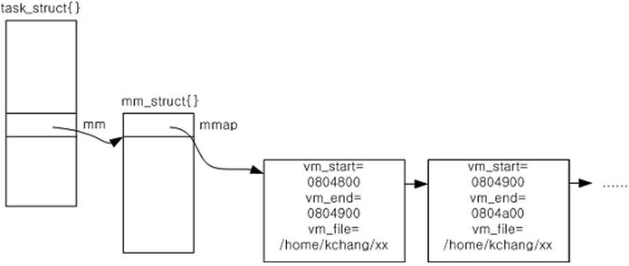

#### hw 3) How many page faults will the program in [hw 2)](#hw-2-show-the-memory-map-of-the-following-program-which-pages-does-the-program-access-during-the-run-time-show-the-page-numbers-that-the-program-accesses-in-the-order-they-are-accessed-indicate-which-pages-are-for-code-and-which-are-for-global-data-and-which-are-for-local-data-to-predict-page-numbers-you-need-to-print-the-address-of-main-variable-i-and-j-and-the-address-of-a0-a1--a4) generate? Explain your reasoning. Remember in the beginning the system has no page of the current process in the memory.

Page Faults는 아직 frame에 할당되지 않은 새로운 page에 접근할 때마다 발생한다. 따라서 `A[][]`를 선언 시 1번, `main`에 1번, `i`&`j`에 1번, loop 안에서 `A[][]`에 접근할 때 5번, 총 **8**번의 Page Faults가 발생한다.

#### hw 4) Confirm your answer in [hw 3)](#hw-2-show-the-memory-map-of-the-following-program-which-pages-does-the-program-access-during-the-run-time-show-the-page-numbers-that-the-program-accesses-in-the-order-they-are-accessed-indicate-which-pages-are-for-code-and-which-are-for-global-data-and-which-are-for-local-data-to-predict-page-numbers-you-need-to-print-the-address-of-main-variable-i-and-j-and-the-address-of-a0-a1--a4) by defining a new system call, `my_sys_show_pfcnt()`, in `mm/mmap.c`, which displays the number of page faults generated so far. The `pfcnt` should be increased by one whenever there is a page fault. Remember a page fault will raise INT 14 which will be processed by `page_fault()` in `arch/x86/kernel/entry_32.S`, which in turn calls `do_page_fault()` in `arch/x86/mm/fault.c`. Define "`int pfcnt=0`" in this file and increase it inside `do_page_fault()`. Now you call this system call before and after the double loop in [hw 2)](#hw-2-show-the-memory-map-of-the-following-program-which-pages-does-the-program-access-during-the-run-time-show-the-page-numbers-that-the-program-accesses-in-the-order-they-are-accessed-indicate-which-pages-are-for-code-and-which-are-for-global-data-and-which-are-for-local-data-to-predict-page-numbers-you-need-to-print-the-address-of-main-variable-i-and-j-and-the-address-of-a0-a1--a4) and see the difference.

`arch/x86/kernel/syscall_table_32.S` :<br>
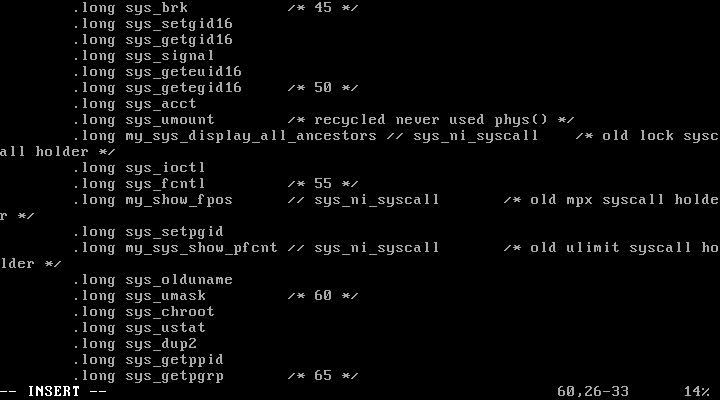<br>
58번에 `my_sys_show_pfnt`를 할당하였다.

`mm/mmap.c` :

```c
......
extern int pfcnt;
void sys_show_pfcnt() {
  printk("page fault count so far: %d\n", pfcnt);
}
......
```

`arch/x86/mm/fault.c` :<br>
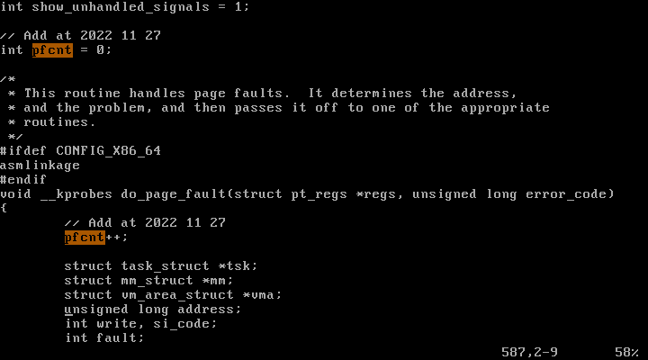

파일들을 수정 후에 컴파일 및 재부팅한다.

```bash
$ make bzImage
$ cp arch/x86/boot/bzImage /boot/bzImage
$ reboot
```

`ex5.c` :<br>
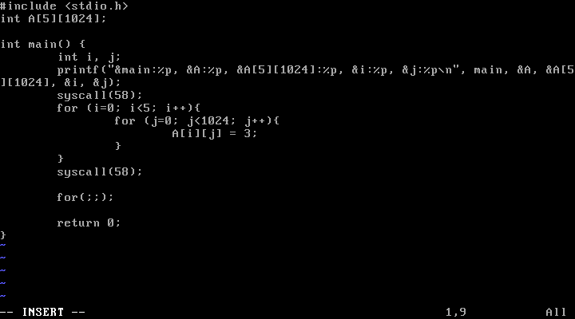

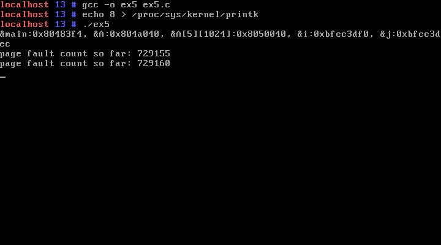

Page fault count는 loop가 끝난 후, 5 증가한 것을 확인할 수 있다. 전역변수를 불러오기 위해 `A[0]`가 위치한 804a Page를 제외하고 `A[4][1024]`까지 데이터를 불러오기 위해서는 804f까지의 5번의 Page Fault가 필요하기 때문이다.

#### hw 4-1) You can display the exact address where page fault has happend. Make `ex3.c` and insert following code in `arch/mm/fault.c`:`do_page_fault()`. When you run `ex3`, the kernel will display the page fault addresses generated by `ex3`. Explain the result. Also confirm your answer in [hw 3)](#hw-2-show-the-memory-map-of-the-following-program-which-pages-does-the-program-access-during-the-run-time-show-the-page-numbers-that-the-program-accesses-in-the-order-they-are-accessed-indicate-which-pages-are-for-code-and-which-are-for-global-data-and-which-are-for-local-data-to-predict-page-numbers-you-need-to-print-the-address-of-main-variable-i-and-j-and-the-address-of-a0-a1--a4) again by examining page fault addresses.

`ex3.c` :

```c
int x;
void main(){
    x=3;
}
```

`arch/x86/mm/fault.c` :

```c
void do_page_fault(...........){
        ...........
        /* get the address */
        address = read_cr2();
        if (strcmp(tsk->comm, "ex3")==0){
            printk("pg fault for ex3 at:%p\n", address);
        }
        ..............
```

파일들을 수정 후에 컴파일 및 재부팅한다.

```bash
$ make bzImage
$ cp arch/x86/boot/bzImage /boot/bzImage
$ reboot
```

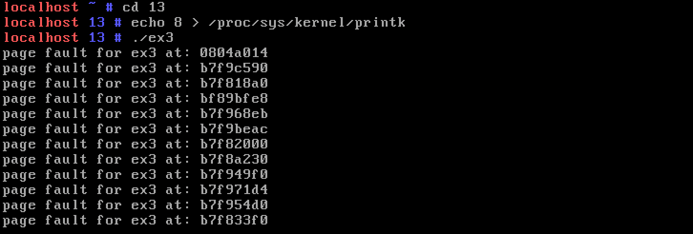<br>
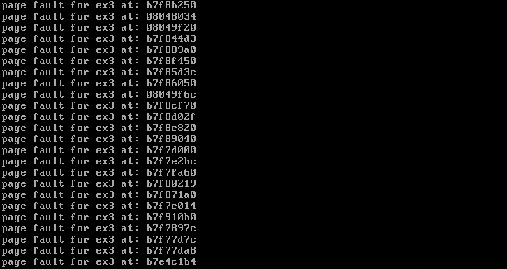<br>
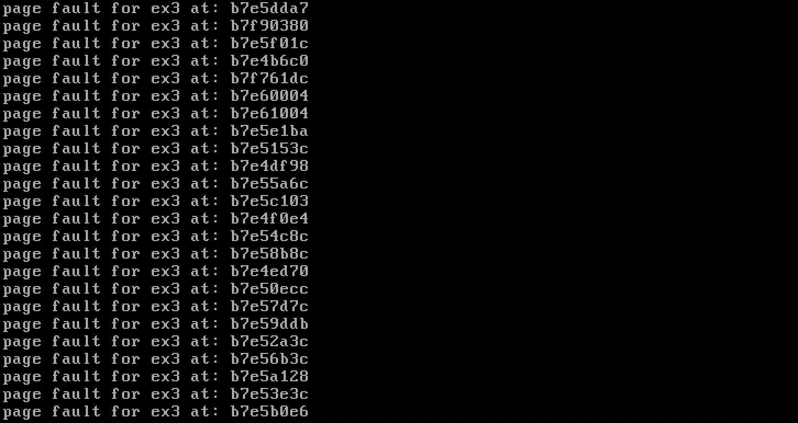<br>
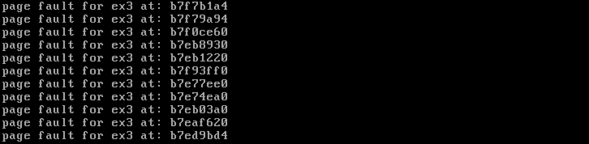

`do_page_fault` 함수에 현재 실행하는 프로그램 이름이 "ex3"이면 Page Fault 주소를 출력하도록 커널 코드를 수정했다. 프로그램이 시작되면 Code(804a) Page를 먼저 읽고, libc 등의 라이브러리가 저장된 페이지를 읽는다. 그리고 Heap 영역을 메모리에 올린다. 프로그램의 코드에 비해 많은 Page Fault가 생성된 이유는 main함수가 초기화되어 호출되기까지의 메모리 접근이 포함되었기 때문이다.

#### hw 4-2) Repeat [hw 4)](#hw-4-confirm-your-answer-in-hw-3-by-defining-a-new-system-call-my_sys_show_pfcnt-in-mmmmapc-which-displays-the-number-of-page-faults-generated-so-far-the-pfcnt-should-be-increased-by-one-whenever-there-is-a-page-fault-remember-a-page-fault-will-raise-int-14-which-will-be-processed-by-page_fault-in-archx86kernelentry_32s-which-in-turn-calls-do_page_fault-in-archx86mmfaultc-define-int-pfcnt0-in-this-file-and-increase-it-inside-do_page_fault-now-you-call-this-system-call-before-and-after-the-double-loop-in-hw-2-and-see-the-difference) with modified [hw 2)](#hw-2-show-the-memory-map-of-the-following-program-which-pages-does-the-program-access-during-the-run-time-show-the-page-numbers-that-the-program-accesses-in-the-order-they-are-accessed-indicate-which-pages-are-for-code-and-which-are-for-global-data-and-which-are-for-local-data-to-predict-page-numbers-you-need-to-print-the-address-of-main-variable-i-and-j-and-the-address-of-a0-a1--a4) code as below. Why is `pfcnt` increased?

`ex6.c` :

```c
#include <stdio.h>
int A[5][1024];
int main()
{
    int i, j;
    syscall(58);
    for (i = 0; i < 5; i++)
    {
        printf("A[%d][0]:%p\n", i, &A[i][0]);
        for (j = 0; j < 1024; j++)
            A[i][j] = 3;
    }
    syscall(58);
    for (;;);
}
```

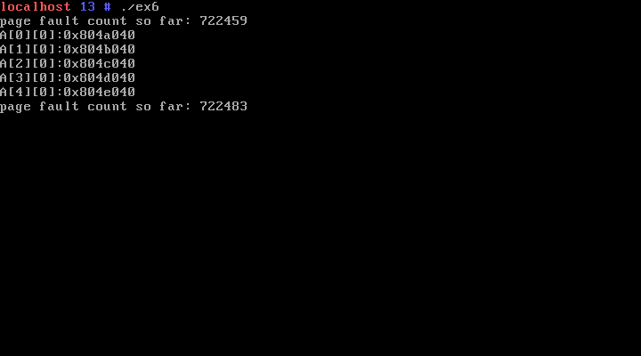

5에서 722483-722459=24로 값이 증가한 이유는 `printf` 호출에서 추가적인 Page Fault가 일어났기 때문이다.

#### hw 5) Make a system call that prints vma information of the current process, and write a user program that displays the VMA list with it. Confirm that this result matches to those in "/proc/_ex7's_pid_/maps".

- (1) Use system call 31 which is not used currently.
- (2) Modify the system call table so that system call 31 is redirected to `sys_get_VMAlist`.
  - `arch/x86/kernel/syscall_table_32.S` :<br>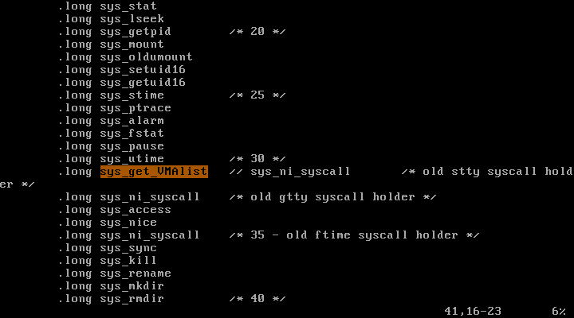
- (3) Provide `sys_get_VMAlist()` in `mm/mmap.c` (not `arch/x86/mm/mmap.c`). This function will display all vma's of the current process.
  - 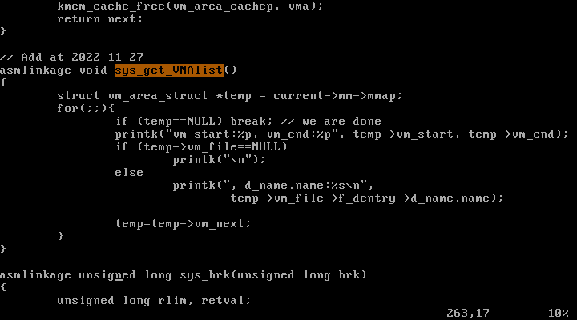
- (4) Write a user program `ex7.c` that invokes system call 31
  - 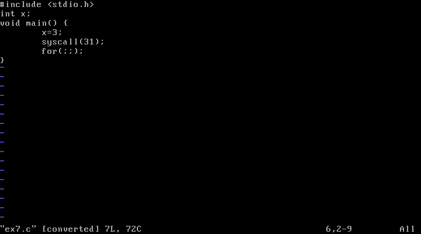

파일들을 수정 후에 컴파일 및 재부팅한다.

```bash
$ make bzImage
$ cp arch/x86/boot/bzImage /boot/bzImage
$ reboot
```

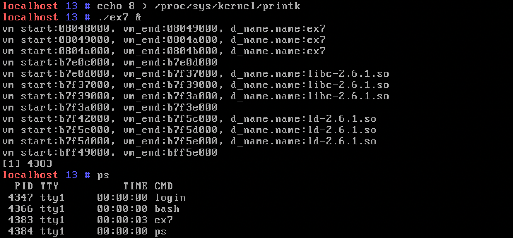<br>
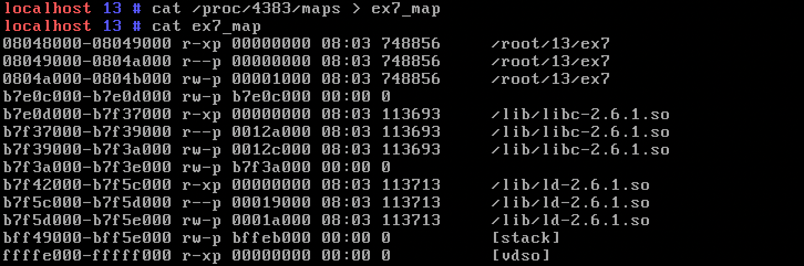

VMA List는 Linked List 형태로 구현되었기 때문에 `temp = temp->vm_next`로 다음 값을 지정하며 `NULL`이 될 때까지 이를 반복한다. `vm_file` 값이 `NULL`일 경우에는 `name`을 출력하지 않는다.

출력 결과를 보면 vDSO부분을 제외하고 "/proc/_ex7's_pid_/maps"와 같은 결과를 보여주는 것을 확인할 수 있었다.

#### hw 6) Count the number of page faults when you run following `ex1` and `ex2` by using `sys_show_pfcnt()`. Explain the results. Also compare the running time of each code (use `gettimeofday()` function) and explain why they differ. Run several times and compute the average.

`ex8.c` :

```c
#include <stdio.h>
#include <unistd.h>
#include <sys/time.h>
int A[8192][8192];

double getUnixTime()
{
    struct timeval tv;
    gettimeofday(&tv, (void *)NULL);         // get current time
    return (tv.tv_sec + tv.tv_usec / 1.0e6); // return it in seconds
}

int main()
{
    int i, j;
    double stime, etime, diff;

    stime = getUnixTime(); // starting time
    syscall(58);           // display pfcnt

    for (i = 0; i < 8192; i++)
        for (j = 0; j < 8192; j++)
            A[i][j] = 3;

    syscall(58);           // display pfcnt again
    etime = getUnixTime(); // ending time
    diff = etime - stime;  // the difference
    printf("The elapsed time: %f\n", diff);

    return 0;
}
```

`ex9.c` :

```c
// same as `ex8.c` except
// change A[i][j]=3; to A[j][i]=3;
// (If your vm dies, reduce the array size)
```

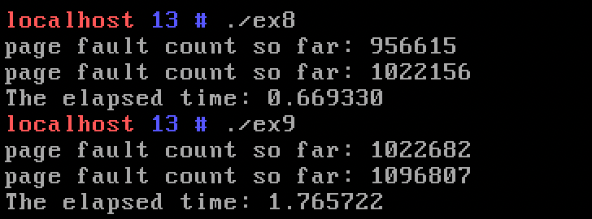

| Program | Page Fault | Elapsed Time |
| ------- | ---------- | ------------ |
| ex8     | 65,541     | 0.669330     |
| ex9     | 74,125     | 1.765722     |

`ex8`과 `ex9`의 차이점은 `A[i][j]`와 `A[j][i]`이다.
`ex9`에서 더 많은 Page Fault가 발생했는데, `ex8`은 `A`에 메모리 적재된 순서대로 접근한 반면, `ex9`는 순서대로 접근하지 않았기(참조의 지역성을 만족하지 않았기) 때문에 LRU 알고리즘에 의해 사용하지 않은 Page를 삭제하고 메모리에서 내려간 Page를 새로 읽어오는 작업이 반복되어 더 많은 Page Fault가 일어났다.

Page Fault 과정은 발생한 회수만큼 프로그램의 성능을 저하시키므로 `ex9`이 `ex8`보다 느리게 실행을 끝마쳤다.

### 2) page table size too big

#### solution: two-level paging

- only the active pages of a process is stored in memory
- similarly only the active pages of the page table is stored in memory
  - page table itself is divided into pages (we call this page a "directory")
  - we need a directory table which shows which directory goes to which frame

#### example)

Suppose we have a process which has only two pages(page 1 and 2099) stored in the memory as below:<br>
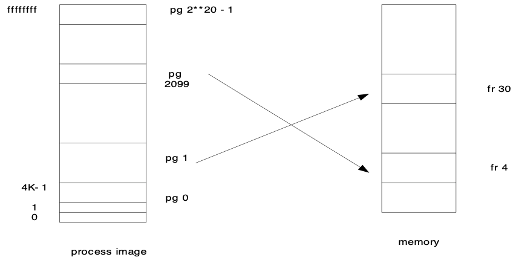

The page table should look like as the left picture in below:<br>
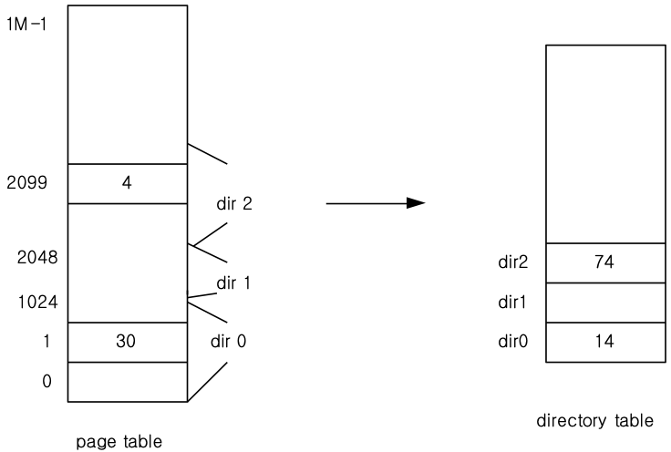

Since storing this entire page table into memory is inefficient, we divide the page table into a number of pages(which are called directories), store only the active directories, and store the directory table which shows which directory is stored in which frame. In above, we can see only dir0 and dir2 are stored in frame 14 and frame 74 respectively. The final memory that contains our process and page table looks as below:<br>
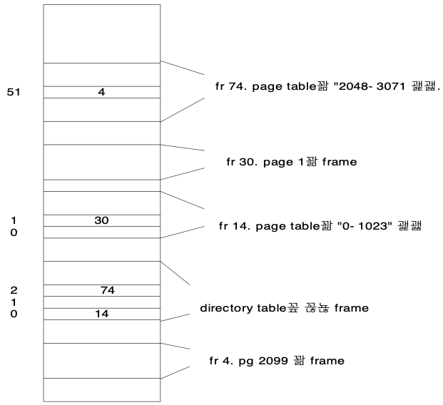

1-level paging requires 2+1024=1026 frames while 2-level paging requires only 5 frames.

### 3) logical address to physical address mapping becomes slow

#### solution: use TLB(Translation Lookaside Buffer) cache

- TLB contains (page#, frame#) pairs for recently referred pages.
- 22 entries in Motorola68030, 32 entries in Intel 486
- 98% hit-rate in Intel 486
  | pg # | fr # |
  |--- |--- |
  | 34 | 42 |
  | 33 | 51 |
  | ....... | ........... |

- address mapping (logical addr => physical addr):
  1.  logical addr = (page, offset) : 8195 = (page 2, offset 3)
  2.  page 2 in TLB?
  3.  if yes (TLB hit), return frame #
  4.  else (TLB miss), go to page table
  5.  page 2 has frame # in the page table?
  6.  if yes (page table hit), return frame #
  7.  else (page table miss), raise interrupt 14 (page fault exception)
  8.  ISR for int 14 go to disk, copy the page into a free frame, report this frame # in
      the page table and TLB, and go to step 1.
- step 1 to 7 is executed by MMU(Memory Management Unit) hardware. step 8 is
  executed by OS

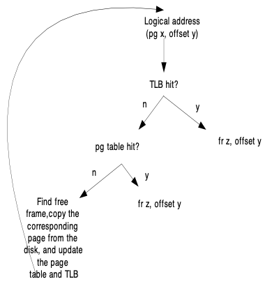

## 7. Implementation of paging in Linux

### 7.1. process image, page table, page frame

#### 1) process image: current->mm->mmap (VMA list)

```c
struct mm_struct{
    .............
    struct vm_area_struct *mmap;
    ..........
};
struct vm_area_struct{
        .........
        unsigned long  vm_start;
        unsigned long  vm_end;
        struct file *     vm_file;
        struct vm_area_struct *vm_next;
        .........
}
```

### 7.2) page table: current->mm->pgd

pgd is a pointer to Page Global Directoy.

```c
struct mm_struct{
      .............
      pgd_t * pgd;
      ..........
};
```

`pgd[x]` has the physical address of the frame where page table `x` resides.

#### hw 7) Make a system call, `sys_get_phyloc()`, which will display the physical address of `main()`.

`arch/x86/kernel/syscall_table_32.S` :<br>
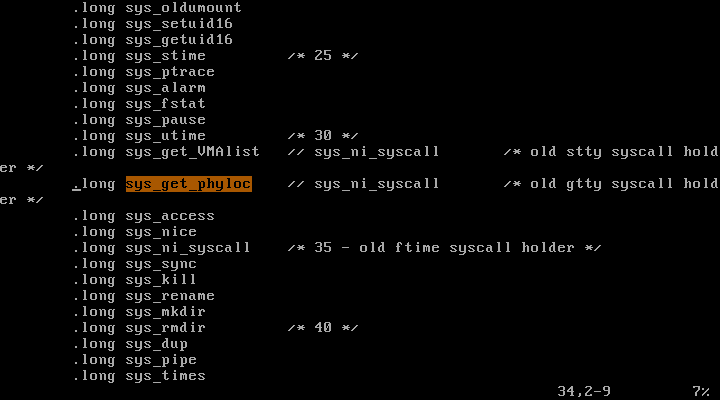

##### 1) Write a simple program that prints the address of `main()`.

`hw7-1.c` :<br>
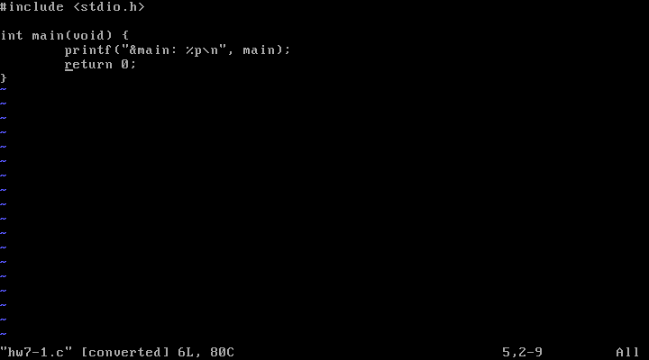

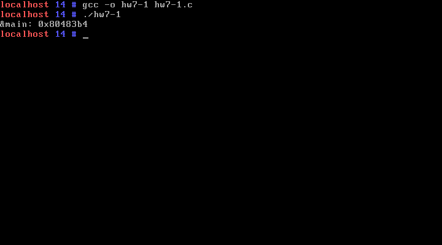

##### 2) Call `sys_get_phyloc(main)` in this program which passes the address of `main`.

`hw7-2.c` :<br>
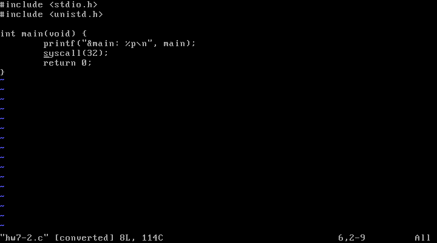

##### 3) `sys_get_phyloc(addr)` is a system call that performs following steps in order:

- step0: print the value of `PGDIR_SHIFT`, `PTRS_PER_PGD`, `PAGE_SHIFT`, `PTRS_PER_PTE`
  - `PGDIR_SHIFT=22`: number of shifting to extract directory number from a logical address. Logical address 0x080484a4 = (dir 20h, page 48h, offset 4a4h) pgd_index=20h, pte_index=48h
  - `PAGE_SHIFT=12`: number of shifting to extract page number from a logical address.
  - `PTRS_PER_PGD=1024`: number of directory entries in a directory table
  - `PTRS_PER_PTE=1024`: number of frame pointer entries in a directory
- step1: extract directory number (dir), page number(pg), and offset(off) from addr, and display them.
- step2: print the location of directory table of the current process: `x`
  - ```c
      unsigned int *x = current->mm->pgd; // virtual
      printk("x: %x\n", x);
    ```
- step3: print the location of directory table entry for `main()`: `y`
  - ```c
      unsigned int *y= &x[dir]; // virtual
    ```
- step4: print the physical location of the directory (partial page table) for `main()`: `pdir`
  - ```c
      unsigned int pdir = *y & 0xfffff000; // the physical address should be at frame boundary
    ```
- step5: print the virtual address of this directory: `vdir`
  - ```c
      unsigned int *vdir = pdir + 0xc0000000; // physical to virtual mapping for kernel address
                                // read about kernel address space in Section 7.4.
    ```
- step6: print the location of the frame entry for `main()`: `k`
  - ```c
      // this is not working!
      unsigned int *k = &pdir[pg]; // We can't access physical memory directly
      // Compute vdir, corresponding virtual address for pdir, and use it to k.
      unsigned int *k = &vdir[pg]; // virtual
    ```
- step7: print the physical location of frame for `main()`: `pfr`
  - ```c
      unsigned int pfr = *k & 0xfffff000; // the physical address should be at frame boundary
    ```
- step8: print the physical address of `main()`: `pmain`
- step9: print the virtual address for the physical address of `main()`: `vmain`
- step10: display the first 4 bytes in `vmain` and compare them with the first 4 bytes of `main` in the original executable file(use "`objdump -d program-name`" to see the first 4 bytes of main in the original program). If they are same, you have the correct physical address of `main`.

`mm/mmap.c` :<br>
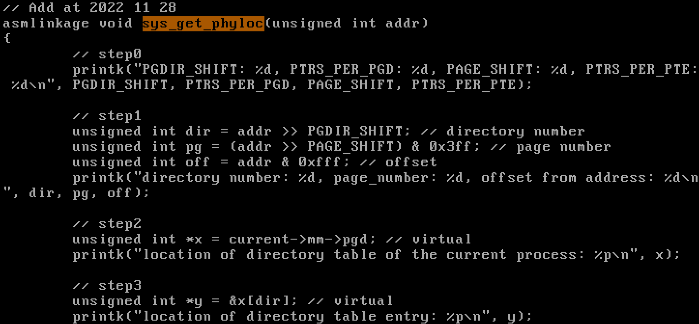<br>
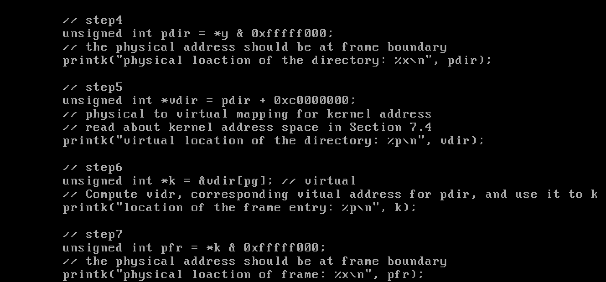<br>
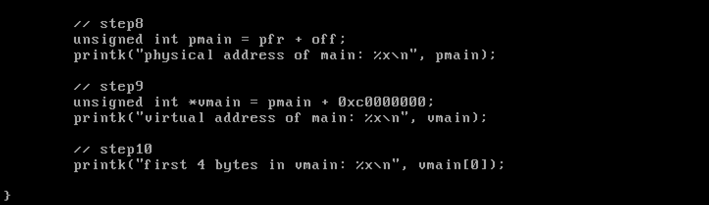

파일을 수정 후에 컴파일 및 재부팅한다.

```bash
$ make bzImage
$ cp arch/x86/boot/bzImage /boot/bzImage
$ reboot
```

바로 직전 [7-2 문제](#2-call-sys_get_phylocmain-in-this-program-which-passes-the-address-of-main)에서 만든 `hw7-2` 프로그램을 실행시켰다.

```bash
$ echo 8 > /proc/sys/kernel/printk
$ ./hw7-2
```

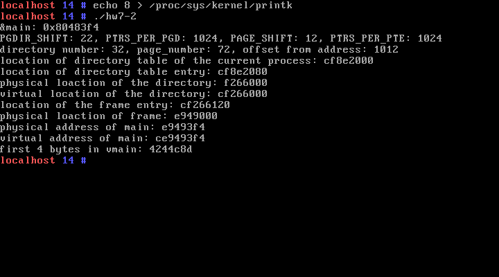

```bash
$ objdump -d ./hw7-2
```

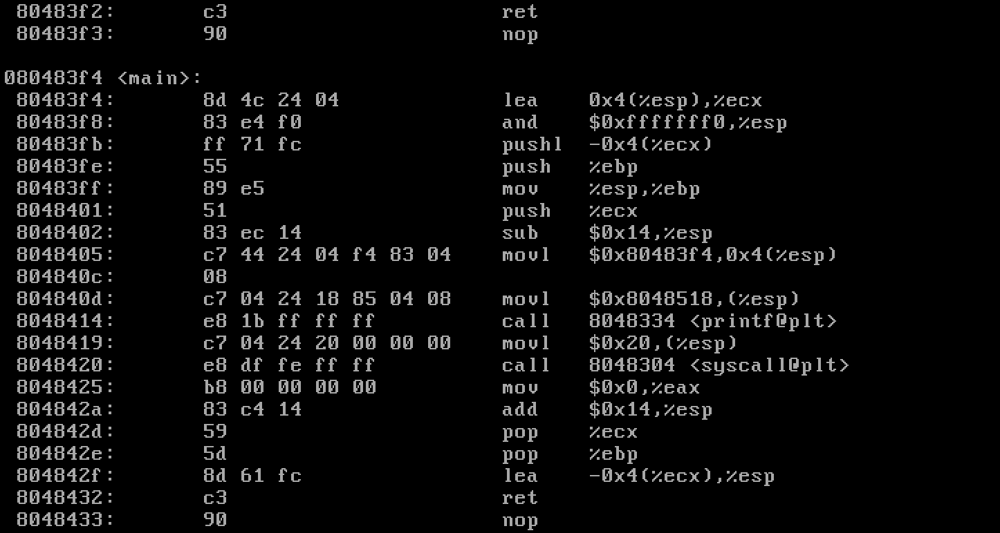

`main`의 첫 주소와 `objdump`로 출력한 주소 값이 **0x80483f4**로 같은 것을 확인할 수 있다.

### 7.3) page frame table: `mem_map`

```c
struct page * mem_map; // array of struct page
```

`page{}` is a page descriptor: it has the information of the corresponding page frame.

Each descriptor is 32 bytes. For 4GB ram, we have 2**32/2**12=2**20 frames. This means we need 2**20 memory descriptors, which will require 2\*_20 _ 32 bytes=32 MB.

- virt_to_page(addr): yields the location of the page descriptor for virt address "addr"
- pfn_to_page(pfn): yields the location of the page descriptor for frame number "pfn"
- page_to_pfn(page); frame number for page descriptor "page"
- page_address(pfn_to_page(pfn)): yields the virtual address of the frame

```c
struct page {
   unsigned long flags; // property of this frame
   atomic_t  _count;  // page frame's reference number. -1 if free
   .....
}

struct mm_struct{
   unsigned long nr_ptes; // number of page tables(directories) this process is using
   .........
}
```

### 7.4) process address space =

user-mode address space(3GB)+ kernel-mode address space(1GB)

kernel-mode address space starts at 0xc0000000, and each page there maps each frame in the physical memory. So we can read the physical memory via kernel-mode address space.

#### example)

`ex1.c` :

```c
void main(){
    write(...);
    ....
}
```

```bash
$ ./ex1
```

=> write(.....) => .... => sys_write(....) => call 0xc015d04b (assuming the address of sys_write is 0xc015d04b)

Now cpu has to jump to 0xc015d04b which is a virtual address. The cpu looks at ex1’s page table since "current" is still ex1. How ex1 knows the physical location of sys_write? Because of this problem, Linux maps all the physical address of the memory page frames to the virtual address starting at 0xc0000000. For example, the above virtual address 0xc015d04b maps to physical address 0xc015d04b - 0xc0000000 = 0x015d04b.
