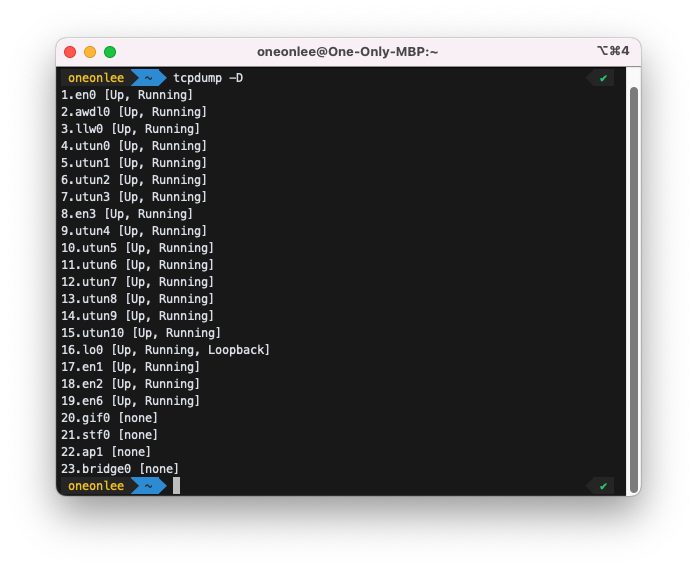
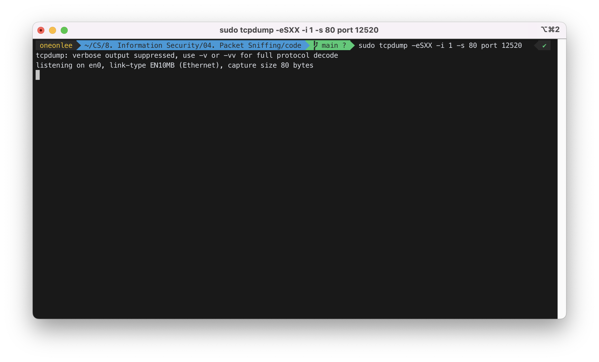
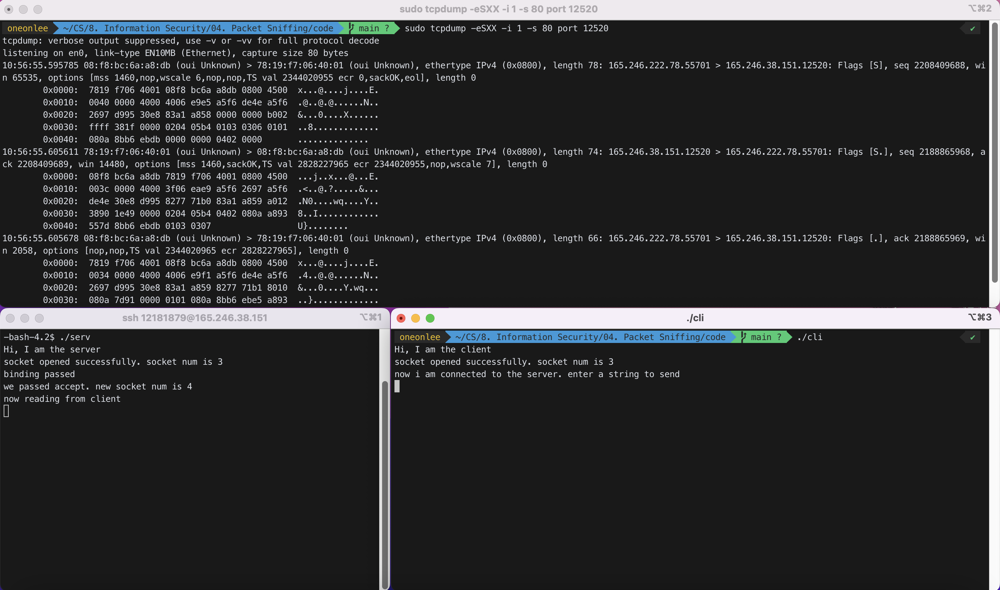
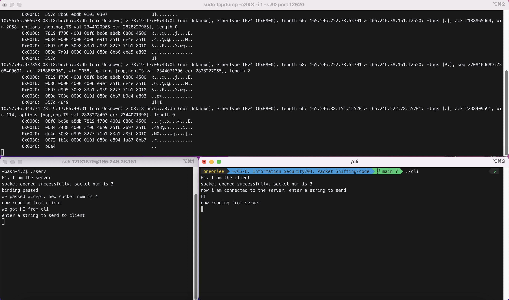
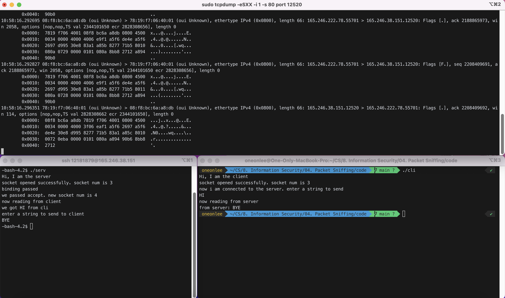
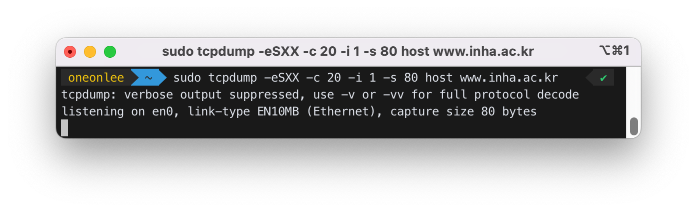
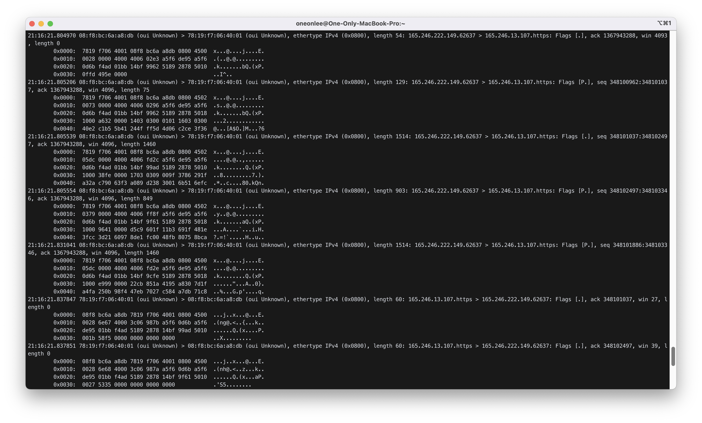
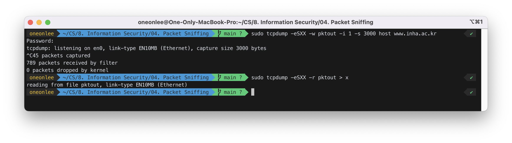
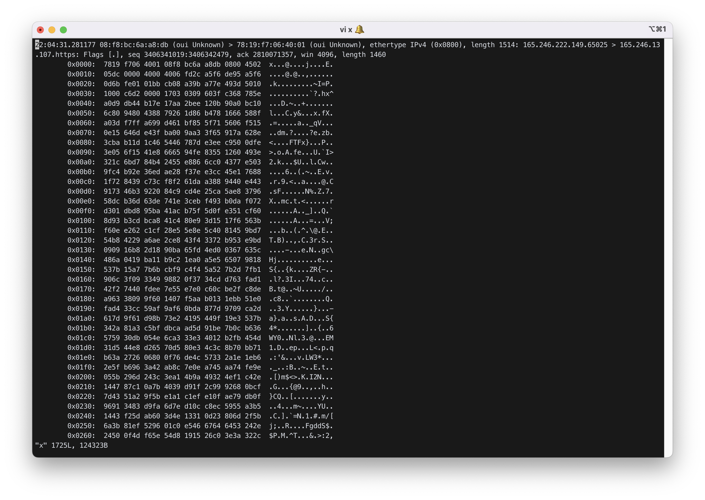

- [Review on socket programming](#review-on-socket-programming)
- [Packet Sniffing](#packet-sniffing)

---

# Review on socket programming

## 1. Communication using a file

`p1`:

```c
x=open("/aa/bb", O_WRONLY, 00777);  // open a file
write(x, "korea", 5);                    // write some data
close(x);                              // close it
```

`p2`:

```c
x=open("/aa/bb", O_RDONLY, 00777);  // open the same file
y=read(x, buf, 50);                      // read max 50 bytes from file x into buf
buf[y]=0;                              // make it a string
printf("the data was %s\n", buf);                    // check the contents
close(x);
```

## 2. Communication using a socket

`p1`(client):

```c
x=socket(PF_INET, SOCK_STREAM, 0);
connect(x, &serv_addr, sizeof(serv_addr));      // open a socket
write(x, "hi", 2);                            // write some data
.........
```

`p2`(server):

```c
x1=socket(PF_INET, SOCK_STREAM, 0);
bind(x1, &serv_addr, sizeof(serv_addr));
listen(x1, 5);
x2=accept(x1, &cli_addr, &xx);                 // open a socket
y= read(x2, buf, 2);                             // read
..........
```

## 3. Example

### client:

```c
#include <stdio.h>
#include <sys/types.h>
#include <sys/socket.h>
#include <netinet/in.h>
#include <arpa/inet.h>

#define SERV_TCP_PORT 9924
#define SERV_ADDR "165.246.38.157"

main(){
   int x, y;
   struct sockaddr_in  serv_addr;
   char buf[100];

   printf("Hi, I am the client\n");

   bzero((char *) &serv_addr, sizeof(serv_addr));
   serv_addr.sin_family = PF_INET;
   serv_addr.sin_addr.s_addr = inet_addr(SERV_ADDR);
   serv_addr.sin_port = htons(SERV_TCP_PORT);

   /* open a tcp socket*/
   if ( (x =socket(PF_INET, SOCK_STREAM,0)) < 0){
      perror("socket creation error\n");
      exit(1);
   }
   printf(" socket opened successfully. socket num is %d\n", x);

   /* connect to  the server */
   if (connect(x, (struct sockaddr *) &serv_addr, sizeof(serv_addr))<0){
      perror("can't connect to the server\n");
      exit(1);
   }

    /* send msg to the server */
    printf("now i am connected to the erver. enter a string to send\n");
    scanf("%s", buf);
    write(x,buf,strlen(buf));

    // read from the server
    printf("now let's read from the server\n");
    y=read(x,buf,50);
    buf[y]=0;
    printf("what echoed from the server is %s\n",buf);
    close(x);   // disconnect the connection
}
```

### server:

```c
#include <stdio.h>
#include <sys/types.h>
#include <sys/socket.h>
#include <netinet/in.h>
#include <arpa/inet.h>

#define SERV_TCP_PORT 9924
#define SERV_ADDR "165.246.38.157"

main(){
        int s1,s2,x, y;
        struct sockaddr_in serv_addr, cli_addr;
        char buf[100];
        size_t xx;

        printf("Hi, I am the server\n");

        bzero((char *)&serv_addr, sizeof(serv_addr));
        serv_addr.sin_family=PF_INET;
        serv_addr.sin_addr.s_addr=inet_addr(SERV_ADDR);
        serv_addr.sin_port=htons(SERV_TCP_PORT);

        // open a tcp socket
        if((s1=socket(PF_INET, SOCK_STREAM, 0))<0){
                perror("socket creation error\n");
                exit(1);
        }
        printf("socket created successfully. socket num is %d\n", s1);

        // bind ip
        x=bind(s1, (struct sockaddr *)&serv_addr, sizeof(serv_addr));
        if (x < 0){
           perror("binding failed\n");
           exit(1);
        }
        printf("binding passed\n");

        listen(s1, 5);
        xx = sizeof(cli_addr);
        s2 = accept(s1,(struct sockaddr *)&cli_addr,&xx);
        printf("we passed accept. new socket num is %d\n", s2);

        // read msg from client
        printf(“now reading from client\n”);
        y=read(s2,buf,50);
        buf[y]=0;
        printf("we got %s from cli\n",buf);

        // send  msg to the client
        printf("what do you want to send  to cli? enter your string\n");
        scanf("%s", buf);
        write(s2,buf,strlen(buf));
        close(s2);  // disconnect the connection
        close(s1);  // close the original socket
}
```

## 4. protocol

### 1) well-known port

Internet service programs are waiting on well-known ports for service. The client can talk to these service programs by opening a socket on a well-known port and following the corresponding protocol.
21: ftp, 23: telnet, 25: smtp, 80: http, ........................

### 2) SMTP (Simple Mail Transfer Protocol) (rfc 2821) : for sending mail (port 25)

```
kchang(mail.inha.ac.kr) ==> kchang(mail.inha.ac.kr)
S: EHLO 165.246.38.219
R: 250-portal.inha.ac.kr Hello
   250-TURN
   .............
   250 OK
S: MAIL FROM:<kchang@inha.ac.kr>
R: 250 ............... OK
S: RCPT TO:<kchang@mail.inha.ac.kr>
R: 250 ................
S: DATA
R: 354 Start mail input; end with <CRLF>.<CRLF>
S: Blah blah blah...
S: <CRLF>.<CRLF>
R: 250 ..........
S: QUIT
R: Connection closed
```

### 3) POP3 (rfc 1939) : for retrieving mail (port 110)

```
S: USER ****
R: +OK
S: PASS ****
R: +OK
S: stat
R: +OK 1 539
S: list
R: +OK 1 539
S: retr 1
R: +OK
   mail here .........
S: quit
```

### 4) http client/server

#### http client(web browser):

```c
      ..........
      #define SERV_TCP_PORT 80
      ..........
      connect(s, ........);
      write(s, "GET / HTTP/1.0\r\n\r\n", 18);  // 1st msg in http protocol
      read(s, buf, ..);
      .............
```

#### http server(web server):

```c
     ...............
     s1=socket(...);
     bind(s1,...);  // bind on port 80
     listen(s1,...);
     for(;;){
       s2=accept(s1, .....);
       x=fork();
       if (x==0){
            close(s1);
            read(s2, in_buf, n); // read http request
            build_out_buf(in_buf, out_buf);
                                //find the request html file and return with
                                // a proper header.
            write(s2, out_buf, ....);
            close(s2);
            exit(0);
        } else cose(s2); /
     }
```

## 5. Exercise

### 1) Copy `serv.c`.

`serv.c`:

```c
#include <stdio.h>
#include <sys/types.h>
#include <sys/socket.h>
#include <netinet/in.h>
#include <arpa/inet.h>
#include <string.h>
#include <stdlib.h>

#define SERV_TCP_PORT 13131
#define SERV_ADDR "165.246.38.151"

void main(){
   int s1,s2, x, y;
   struct sockaddr_in serv_addr, cli_addr;
   char buf[50];
   socklen_t  xx;

   printf("Hi, I am the server\n");

   bzero((char *)&serv_addr, sizeof(serv_addr));
   serv_addr.sin_family=PF_INET;
   serv_addr.sin_addr.s_addr=inet_addr(SERV_ADDR);
   serv_addr.sin_port=htons(SERV_TCP_PORT);

   //open a tcp socket
   if ((s1=socket(PF_INET, SOCK_STREAM, 0))<0){
      printf("socket creation error\n");
      exit(1);
   }
   printf("socket opened successfully. socket num is %d\n", s1);

   // bind ip
   x =bind(s1, (struct sockaddr *)&serv_addr, sizeof(serv_addr));
   if (x < 0){
      printf("binding failed\n");
      exit(1);
   }
   printf("binding passed\n");
   listen(s1, 5);
   xx = sizeof(cli_addr);
   s2 = accept(s1, (struct sockaddr *)&cli_addr, &xx);
   printf("we passed accept. new socket num is %d\n", s2);

   // read msg from client
   printf("now reading from client\n");
   y=read(s2, buf, 50);
   buf[y]=0;
   printf("we got %s from cli\n", buf);
   // send msg to the client
   printf("enter a string to send to client\n");
   scanf("%s", buf);
   write(s2, buf, strlen(buf));
   close(s2);   // disconnect the connection
   close(s1);   // close the original socket
}
```

### 2) Copy `cli.c`

`cli.c`:

```c
#include <stdio.h>
#include <sys/types.h>
#include <sys/socket.h>
#include <netinet/in.h>
#include <arpa/inet.h>
#include <string.h>
#include <stdlib.h>

#define SERV_TCP_PORT 9948
#define SERV_ADDR "165.246.38.151"

void main(){
   int x,y;
   struct sockaddr_in serv_addr;
   char buf[50];
   printf("Hi, I am the client\n");

   bzero((char *)&serv_addr, sizeof(serv_addr));
   serv_addr.sin_family=PF_INET;
   serv_addr.sin_addr.s_addr=inet_addr(SERV_ADDR);
   serv_addr.sin_port=htons(SERV_TCP_PORT);

   //open a tcp socket
   if ((x=socket(PF_INET, SOCK_STREAM, 0))<0){
      printf("socket creation error\n");
      exit(1);
   }
   printf("socket opened successfully. socket num is %d\n", x);

   //connect to the server
   if (connect(x, (struct sockaddr *)&serv_addr, sizeof(serv_addr)) < 0){
      printf("can't connect to the server\n");
      exit(1);
   }
   // send msg to the server
   printf("now i am connected to the server. enter a string to send\n");
   scanf("%s",buf);
   write(x, buf, strlen(buf));
   // read from server
   printf("now reading from server\n");
   y=read(x, buf, 50);
   buf[y]=0;
   printf("from server: %s\n", buf);
   close(x);  // disconect the communication
}
```

### 3) Adjust port number both server and client. Recompile both and run the server first and run the client next. The client should talk first and then the server.

`serv.c`와 `cli.c`의 port number를 임의로 12520으로 설정하고 컴파일하여 server와 client를 구동시켰다.


왼쪽 터미널이 server이고, 오른쪽 터미널이 client이다.

client가 server에게 "HI!"라고 보냈고, server는 client에게 "BYE"라고 하였다.

---

# Packet Sniffing

## 1. Tool

`tcpdump` for Unix/Linux/macOS.
`windump` for Windows

## 2. windump

- download WinPcap and install
- download WinDump
- run WinDump

## 3. usage (use `tcpdump` for macOS)

```bash
windump -AdDeflLnNOpqRStuUvxX -c count -C file_size -F file -i interface
         -s snaplen -T type -w file -W filecount expression

-A  print each packet in ascii
-c  exit after receiving count packets
-D  print available network interfaces
-e  print the link-level header on each dump line
-i  Listen on "interface"
-n  Don not t convert addresses to names
-q  short output format
-S  print absolute, rather than relative, TCP sequence numbers
-s  snarf "snaplen" bytes from each packet rather than the default of 68
-t  Do not print a timestamp on each dump line
-w  write the raw packets to "file" rather than parsing and printing them out. standard output is used if the file is "-"
-x  print in hex
-xx  same as `-x` but print link level header, too.
-X  print in hex and ascii
-XX  same as `-X` but print link level header, too
```

- expression:
  - packets that make "expression" true will be captured
  - expression = [primitive+] constrained by and, or, not
  - primitive = [qualifier+] id
  - qualifier = type | dir | proto
  - type = host(default) | net | port | portrange
- ex) host foo : packet for foo
  - net 128.3 : packet for 128.3._._
  - port 20 : packet for port 20
  - dir = src | dst | src or dst (default) | src and dst
- ex) src foo : packet coming from foo
  - proto = ether | ip | arp | rarp | wlan | tcp | udp
- if not specified all relevant protocols are captured

### examples)

`windump host sundown` : print all in/out packets for sundown
`windump host ace and not helios` : print all packets between ace and any host except helios
`windump -D` : shows all available network interface
`windump -eSXX -i 2 -s 80 port 9924` : show all in/out packets in interface 2 for port 9924 in hex including the link header. Capture max 80 bytes.
(in macOS: `sudo tcpdump -eSXX -i 2 -s 80 port 9924`)

## 4. Exercise:

Follow the steps below to display the contents of the packets between the server and the client. Submit explanation of each field in those packets.

### 1) Make a client in your PC as follows.

(For macOS, use sftp to download `cli.c from` lab server and use it to connect to the server.)


### 2) Run `tcpdump` to monitor packets for specified port.

#### (1) Check available network interfaces

```bash
$ tcpdump -D
```



1, 2, 3, 4, ... 등이 Running 으로 available 한 것을 확인 할 수 있다.

#### (2) Monitor packets at device 2 whose src or dest ports are 12520

```bash
sudo tcpdump -eSXX -i 1 -s 80 port 12520
```

`-i` 옵션은 어느 인터페이스를 경유하는 패킷들을 잡을지 지정한다. 지정되지 않으면 시스템의 인터페이스 리스트를 뒤져서 가장 낮은 번호를 가진 인터페이스를 선택한다(이 때 loopback은 제외된다).<br>
출처: https://sugerent.tistory.com/348 [MISTERY:티스토리]



### 3) Run your server again. Run the client in your PC.

`tcpdump` 명령어를 실행한 터미널 창(스크린샷의 위쪽)을 유지한 후, 'serv'(스크린샷의 좌측 하단)와 'cli'(스크린샷의 우측 하단)의 3 hand shake 과정을 진행해 주었다.

#### (1) 'serv'와 'cli'가 연결된 직후



```bash
$ sudo tcpdump -eSXX -i 1 -s 80 port 12520
tcpdump: verbose output suppressed, use -v or -vv for full protocol decode
listening on en0, link-type EN10MB (Ethernet), capture size 80 bytes
10:56:55.595785 08:f8:bc:6a:a8:db (oui Unknown) > 78:19:f7:06:40:01 (oui Unknown), ethertype IPv4 (0x0800), length 78: 165.246.222.78.55701 > 165.246.38.151.12520: Flags [S], seq 2208409688, win 65535, options [mss 1460,nop,wscale 6,nop,nop,TS val 2344020955 ecr 0,sackOK,eol], length 0
	0x0000:  7819 f706 4001 08f8 bc6a a8db 0800 4500  x...@....j....E.
	0x0010:  0040 0000 4000 4006 e9e5 a5f6 de4e a5f6  .@..@.@......N..
	0x0020:  2697 d995 30e8 83a1 a858 0000 0000 b002  &...0....X......
	0x0030:  ffff 381f 0000 0204 05b4 0103 0306 0101  ..8.............
	0x0040:  080a 8bb6 ebdb 0000 0000 0402 0000       ..............
10:56:55.605611 78:19:f7:06:40:01 (oui Unknown) > 08:f8:bc:6a:a8:db (oui Unknown), ethertype IPv4 (0x0800), length 74: 165.246.38.151.12520 > 165.246.222.78.55701: Flags [S.], seq 2188865968, ack 2208409689, win 14480, options [mss 1460,sackOK,TS val 2828227965 ecr 2344020955,nop,wscale 7], length 0
	0x0000:  08f8 bc6a a8db 7819 f706 4001 0800 4500  ...j..x...@...E.
	0x0010:  003c 0000 4000 3f06 eae9 a5f6 2697 a5f6  .<..@.?.....&...
	0x0020:  de4e 30e8 d995 8277 71b0 83a1 a859 a012  .N0....wq....Y..
	0x0030:  3890 1e49 0000 0204 05b4 0402 080a a893  8..I............
	0x0040:  557d 8bb6 ebdb 0103 0307                 U}........
10:56:55.605678 08:f8:bc:6a:a8:db (oui Unknown) > 78:19:f7:06:40:01 (oui Unknown), ethertype IPv4 (0x0800), length 66: 165.246.222.78.55701 > 165.246.38.151.12520: Flags [.], ack 2188865969, win 2058, options [nop,nop,TS val 2344020965 ecr 2828227965], length 0
	0x0000:  7819 f706 4001 08f8 bc6a a8db 0800 4500  x...@....j....E.
	0x0010:  0034 0000 4000 4006 e9f1 a5f6 de4e a5f6  .4..@.@......N..
	0x0020:  2697 d995 30e8 83a1 a859 8277 71b1 8010  &...0....Y.wq...
	0x0030:  080a 7d91 0000 0101 080a 8bb6 ebe5 a893  ..}.............
	0x0040:  557d                                     U}

```

#### (2) 'cli'가 'serv'에게 "HI"라는 메세지를 보낸 직후



```bash
10:57:46.037858 08:f8:bc:6a:a8:db (oui Unknown) > 78:19:f7:06:40:01 (oui Unknown), ethertype IPv4 (0x0800), length 68: 165.246.222.78.55701 > 165.246.38.151.12520: Flags [P.], seq 2208409689:2208409691, ack 2188865969, win 2058, options [nop,nop,TS val 2344071396 ecr 2828227965], length 2
	0x0000:  7819 f706 4001 08f8 bc6a a8db 0800 4500  x...@....j....E.
	0x0010:  0036 0000 4000 4006 e9ef a5f6 de4e a5f6  .6..@.@......N..
	0x0020:  2697 d995 30e8 83a1 a859 8277 71b1 8018  &...0....Y.wq...
	0x0030:  080a 703e 0000 0101 080a 8bb7 b0e4 a893  ..p>............
	0x0040:  557d 4849                                U}HI
10:57:46.043774 78:19:f7:06:40:01 (oui Unknown) > 08:f8:bc:6a:a8:db (oui Unknown), ethertype IPv4 (0x0800), length 66: 165.246.38.151.12520 > 165.246.222.78.55701: Flags [.], ack 2208409691, win 114, options [nop,nop,TS val 2828278407 ecr 2344071396], length 0
	0x0000:  08f8 bc6a a8db 7819 f706 4001 0800 4500  ...j..x...@...E.
	0x0010:  0034 2438 4000 3f06 c6b9 a5f6 2697 a5f6  .4$8@.?.....&...
	0x0020:  de4e 30e8 d995 8277 71b1 83a1 a85b 8010  .N0....wq....[..
	0x0030:  0072 fb1c 0000 0101 080a a894 1a87 8bb7  .r..............
	0x0040:  b0e4                                     ..
```

#### (3) 'serv'가 'cli'에게 "BYE"라는 메세지를 보낸 직후



```bash
10:58:16.292552 78:19:f7:06:40:01 (oui Unknown) > 08:f8:bc:6a:a8:db (oui Unknown), ethertype IPv4 (0x0800), length 69: 165.246.38.151.12520 > 165.246.222.78.55701: Flags [P.], seq 2188865969:2188865972, ack 2208409691, win 114, options [nop,nop,TS val 2828308656 ecr 2344071396], length 3
	0x0000:  08f8 bc6a a8db 7819 f706 4001 0800 4500  ...j..x...@...E.
	0x0010:  0037 2439 4000 3f06 c6b5 a5f6 2697 a5f6  .7$9@.?.....&...
	0x0020:  de4e 30e8 d995 8277 71b1 83a1 a85b 8018  .N0....wq....[..
	0x0030:  0072 fd8e 0000 0101 080a a894 90b0 8bb7  .r..............
	0x0040:  b0e4 4259 45                             ..BYE
10:58:16.292559 78:19:f7:06:40:01 (oui Unknown) > 08:f8:bc:6a:a8:db (oui Unknown), ethertype IPv4 (0x0800), length 66: 165.246.38.151.12520 > 165.246.222.78.55701: Flags [F.], seq 2188865972, ack 2208409691, win 114, options [nop,nop,TS val 2828308656 ecr 2344071396], length 0
	0x0000:  08f8 bc6a a8db 7819 f706 4001 0800 4500  ...j..x...@...E.
	0x0010:  0034 243a 4000 3f06 c6b7 a5f6 2697 a5f6  .4$:@.?.....&...
	0x0020:  de4e 30e8 d995 8277 71b4 83a1 a85b 8011  .N0....wq....[..
	0x0030:  0072 84ef 0000 0101 080a a894 90b0 8bb7  .r..............
	0x0040:  b0e4                                     ..
10:58:16.292639 08:f8:bc:6a:a8:db (oui Unknown) > 78:19:f7:06:40:01 (oui Unknown), ethertype IPv4 (0x0800), length 66: 165.246.222.78.55701 > 165.246.38.151.12520: Flags [.], ack 2188865972, win 2058, options [nop,nop,TS val 2344101650 ecr 2828308656], length 0
	0x0000:  7819 f706 4001 08f8 bc6a a8db 0800 4500  x...@....j....E.
	0x0010:  0034 0000 4000 4006 e9f1 a5f6 de4e a5f6  .4..@.@......N..
	0x0020:  2697 d995 30e8 83a1 a85b 8277 71b4 8010  &...0....[.wq...
	0x0030:  080a 072a 0000 0101 080a 8bb8 2712 a894  ...*........'...
	0x0040:  90b0                                     ..
10:58:16.292695 08:f8:bc:6a:a8:db (oui Unknown) > 78:19:f7:06:40:01 (oui Unknown), ethertype IPv4 (0x0800), length 66: 165.246.222.78.55701 > 165.246.38.151.12520: Flags [.], ack 2188865973, win 2058, options [nop,nop,TS val 2344101650 ecr 2828308656], length 0
	0x0000:  7819 f706 4001 08f8 bc6a a8db 0800 4500  x...@....j....E.
	0x0010:  0034 0000 4000 4006 e9f1 a5f6 de4e a5f6  .4..@.@......N..
	0x0020:  2697 d995 30e8 83a1 a85b 8277 71b5 8010  &...0....[.wq...
	0x0030:  080a 0729 0000 0101 080a 8bb8 2712 a894  ...)........'...
	0x0040:  90b0                                     ..
10:58:16.292827 08:f8:bc:6a:a8:db (oui Unknown) > 78:19:f7:06:40:01 (oui Unknown), ethertype IPv4 (0x0800), length 66: 165.246.222.78.55701 > 165.246.38.151.12520: Flags [F.], seq 2208409691, ack 2188865973, win 2058, options [nop,nop,TS val 2344101650 ecr 2828308656], length 0
	0x0000:  7819 f706 4001 08f8 bc6a a8db 0800 4500  x...@....j....E.
	0x0010:  0034 0000 4000 4006 e9f1 a5f6 de4e a5f6  .4..@.@......N..
	0x0020:  2697 d995 30e8 83a1 a85b 8277 71b5 8011  &...0....[.wq...
	0x0030:  080a 0728 0000 0101 080a 8bb8 2712 a894  ...(........'...
	0x0040:  90b0                                     ..
10:58:16.296351 78:19:f7:06:40:01 (oui Unknown) > 08:f8:bc:6a:a8:db (oui Unknown), ethertype IPv4 (0x0800), length 66: 165.246.38.151.12520 > 165.246.222.78.55701: Flags [.], ack 2208409692, win 114, options [nop,nop,TS val 2828308662 ecr 2344101650], length 0
	0x0000:  08f8 bc6a a8db 7819 f706 4001 0800 4500  ...j..x...@...E.
	0x0010:  0034 0000 4000 3f06 eaf1 a5f6 2697 a5f6  .4..@.?.....&...
	0x0020:  de4e 30e8 d995 8277 71b5 83a1 a85c 8010  .N0....wq....\..
	0x0030:  0072 0eba 0000 0101 080a a894 90b6 8bb8  .r..............
	0x0040:  2712                                     '.
```

### 4) Find the first packet which is a SYN packet sent by the client to the server in the windump window. Extract all packet header information. Refer TCP packet structure in Section 6 below.

- SYN(Synchronization:동기화) - S : 연결 요청 플래그
  - TCP 에서 세션을 성립할 때 가장 먼저 보내는 패킷, 시퀀스 번호를 임의적으로 설정하여 세션을 연결하는 데에 사용되며 초기에 시퀀스 번호를 보내게 된다.
- ACK(Acknowledgement) - Ack : 응답
  - 상대방으로부터 패킷을 받았다는 걸 알려주는 패킷, 다른 플래그와 같이 출력되는 경우도 있다.
  - 받는 사람이 보낸 사람 시퀀스 번호에 TCP 계층에서 길이 또는 데이터 양을 더한 것과 같은 ACK를 보낸다.(일반적으로 +1 하여 보냄)
  - ACK 응답을 통해 보낸 패킷에 대한 성공, 실패를 판단하여 재전송 하거나 다음 패킷을 전송한다.
- RST(Reset) - R : 재연결 종료
  - 재설정(Reset)을 하는 과정이며 양방향에서 동시에 일어나는 중단 작업이다.
  - 비정상적인 세션 연결 끊기에 해당한다.
  - 이 패킷을 보내는 곳이 현재 접속하고 있는 곳과 즉시 연결을 끊고자 할 때 사용한다.
- PSH(Push) - P : 밀어넣기
  - TELNET 과 같은 상호작용이 중요한 프로토콜의 경우 빠른 응답이 중요한데, 이 때 받은 데이터를 즉시 목적지인 OSI 7 Layer 의 Application 계층으로 전송하도록 하는 FLAG.
  - 대화형 트랙픽에 사용되는 것으로 버퍼가 채워지기를 기다리지 않고 데이터를 전달한다.
  - 데이터는 버퍼링 없이 바로 위 계층이 아닌 7 계층의 응용프로그램으로 바로 전달한다.
- URG(Urgent) - U : 긴급 데이터
  - Urgent pointer : 유효한 것인지를 나타낸다.
  - Urgent pointer란 전송하는 데이터 중에서 긴급히 전당해야 할 내용이 있을 경우에 사용한다.
  - 긴급한 데이터는 다른 데이터에 비해 우선순위가 높아야 한다.
  - e.g., `ping` 명령어 실행 도중 `Ctrl+c` 입력
- FIN(Finish) - F : 연결 종료 요청
  - 세션 연결을 종료시킬 때 사용되며 더이상 전송할 데이터가 없음을 나타낸다.

첫번째 packet은 아래와 같다.

```bash
10:56:55.595785 08:f8:bc:6a:a8:db (oui Unknown) > 78:19:f7:06:40:01 (oui Unknown), ethertype IPv4 (0x0800), length 78: 165.246.222.78.55701 > 165.246.38.151.12520: Flags [S], seq 2208409688, win 65535, options [mss 1460,nop,wscale 6,nop,nop,TS val 2344020955 ecr 0,sackOK,eol], length 0
	0x0000:  7819 f706 4001 08f8 bc6a a8db 0800 4500  x...@....j....E.
	0x0010:  0040 0000 4000 4006 e9e5 a5f6 de4e a5f6  .@..@.@......N..
	0x0020:  2697 d995 30e8 83a1 a858 0000 0000 b002  &...0....X......
	0x0030:  ffff 381f 0000 0204 05b4 0103 0306 0101  ..8.............
	0x0040:  080a 8bb6 ebdb 0000 0000 0402 0000       ..............
```

- 처음 14bytes인 `7819 f706 4001 08f8 bc6a a8db 0800`은 Ethernet header이다.
  - `7819 f706 4001`은 dest MAC addr를, `08f8 bc6a a8db`는 src MAC addr를 의미한다.
  - `0800`는 IP packet의 type을 의미한다.
- 다음 20bytes인 `4500 0040 0000 4000 4006 e9e5 a5f6 de4e a5f6 2697`은 IP header이다.
  - `4500`에서
    - `4`는 IP version을 의미한다.
    - `5`는 IP Header의 length를 표현한 것으로 IP header의 length는 `5`\*4 = 20bytes 라는 것을 확인할 수 있다.
    - `00`은 type of service를 의미한다.
  - `0040`은 packet length를 의미한다.
  - ...
  - `e9e5`는 ip header checksum을 의미한다.
  - `a5f6 de4e`는 src ip를, `a5f6 2697`는 dest ip를 의미한다.
- 나머지 부분인 `d995 30e8 83a1 a858 0000 0000 b002 ffff 381f 0000 0204 05b4 0103 0306 0101 080a 8bb6 ebdb 0000 0000 0402 0000`이 TCP header 이며, 크기는 44bytes이고, 내용에 따라 길이가 가변적이다. (20+@bytes)
  - TCP header에서 `d995`는 src port를, `30e8`은 dst port를 의미한다.
  - `83a1 a858`는 seq number를 의미한다.
  - 다음으로 `b002`에서
    - `b`는 TCP header의 length를 표현한 것으로 TCP header의 length는 `b`\*4 = 11\*4 = 44bytes 라는 것을 확인할 수 있다.
    - 16진법으로 표현된 `002`를 2진법으로 바꾸면 `000000 000010`이다.
      - 여기서, 처음 `000000`은 reserved를,
      - 나머지 `000010`은 자릿수 별로 각각 URG ACK PSH RST SYN FIN의 여부를 나타낸다.
        - 여기서는 SYN이 1이라는 것을 확인할 수 있다.

### 5) Analyze rest of the packets similarly.

#### 두번째 packet은 아래와 같다.

```bash
10:56:55.605611 78:19:f7:06:40:01 (oui Unknown) > 08:f8:bc:6a:a8:db (oui Unknown), ethertype IPv4 (0x0800), length 74: 165.246.38.151.12520 > 165.246.222.78.55701: Flags [S.], seq 2188865968, ack 2208409689, win 14480, options [mss 1460,sackOK,TS val 2828227965 ecr 2344020955,nop,wscale 7], length 0
	0x0000:  08f8 bc6a a8db 7819 f706 4001 0800 4500  ...j..x...@...E.
	0x0010:  003c 0000 4000 3f06 eae9 a5f6 2697 a5f6  .<..@.?.....&...
	0x0020:  de4e 30e8 d995 8277 71b0 83a1 a859 a012  .N0....wq....Y..
	0x0030:  3890 1e49 0000 0204 05b4 0402 080a a893  8..I............
	0x0040:  557d 8bb6 ebdb 0103 0307                 U}........
```

- 처음 14bytes인 `08f8 bc6a a8db 7819 f706 4001 0800`은 Etherntet header이다.
  - `08f8 bc6a a8db`은 dest MAC addr를, `7819 f706 4001`는 src MAC addr를 의미한다.
  - `0800`은 IP packet의 type을 의미한다.
- 다음 20bytes인 `4500 003c 0000 4000 3f06 eae9 a5f6 2697 a5f6 de4e`은 IP header이다.
  - `4500`에서
    - `4`는 IP version을 의미한다.
    - `5`는 IP Header의 length를 표현한 것으로 IP header의 length는 `5`\*4 = 20bytes 라는 것을 확인할 수 있다.
    - `00`은 type of service를 의미한다.
  - `0040`은 packet length를 의미한다.
  - ...
  - `eae9`는 ip header checksum을 의미한다.
  - `a5f6 2697`는 src ip를, `a5f6 de4e`는 dest ip를 의미한다.
- 나머지 부분인 `30e8 d995 8277 71b0 83a1 a859 a012 3890 1e49 0000 0204 05b4 0402 080a a893 557d`이 TCP header 이며, 크기는 40bytes이고, 내용에 따라 길이가 가변적이다. (20+@bytes)
  - TCP header에서 `30e8`는 src port를, `d995`은 dst port를 의미한다.
  - `8277 71b0`는 seq number를 의미한다.
  - 다음으로 `83a1 a859 a012` 중 `a012`에서
    - `a`는 TCP header의 length를 표현한 것으로 TCP header의 length는 `a`\*4 = 10\*4 = 40bytes 라는 것을 확인할 수 있다.
    - 16진법으로 표현된 `012`를 2진법으로 바꾸면 `000000 001100`이다.
      - 여기서, 처음 `000000`은 reserved를,
      - 나머지 `001100`은 자릿수 별로 각각 URG ACK PSH RST SYN FIN의 여부를 나타낸다.
        - 여기서는 PSH과 RST이 1이라는 것을 확인할 수 있다.

#### 세번째 packet은 아래와 같다.

```bash
10:56:55.605678 08:f8:bc:6a:a8:db (oui Unknown) > 78:19:f7:06:40:01 (oui Unknown), ethertype IPv4 (0x0800), length 66: 165.246.222.78.55701 > 165.246.38.151.12520: Flags [.], ack 2188865969, win 2058, options [nop,nop,TS val 2344020965 ecr 2828227965], length 0
	0x0000:  7819 f706 4001 08f8 bc6a a8db 0800 4500  x...@....j....E.
	0x0010:  0034 0000 4000 4006 e9f1 a5f6 de4e a5f6  .4..@.@......N..
	0x0020:  2697 d995 30e8 83a1 a859 8277 71b1 8010  &...0....Y.wq...
	0x0030:  080a 7d91 0000 0101 080a 8bb6 ebe5 a893  ..}.............
	0x0040:  557d                                     U}
```

- 처음 14bytes인 `7819 f706 4001 08f8 bc6a a8db 0800`은 Etherntet header이다.
  - `7819 f706 4001`은 dest MAC addr를, `08f8 bc6a a8db`는 src MAC addr를 의미한다.
  - `0800`은 IP packet의 type을 의미한다.
- 다음 20bytes인 `4500 0034 0000 4000 4006 e9f1 a5f6 de4e a5f6 2697`은 IP header이다.
  - `4500`에서
    - `4`는 IP version을 의미한다.
    - `5`는 IP Header의 length를 표현한 것으로 IP header의 length는 `5`\*4 = 20bytes 라는 것을 확인할 수 있다.
    - `00`은 type of service를 의미한다.
  - `0040`은 packet length를 의미한다.
  - ...
  - `e9f1`는 ip header checksum을 의미한다.
  - `a5f6 de4e`는 src ip를, `a5f6 2697`는 dest ip를 의미한다.
- 나머지 부분인 `d995 30e8 83a1 a859 8277 71b1 8010 080a 7d91 0000 0101 080a 8bb6 ebe5 a893 557d`이 TCP header 이며, 크기는 32bytes이고, 내용에 따라 길이가 가변적이다. (20+@bytes)
  - TCP header에서 `d995`는 src port를, `30e8`은 dst port를 의미한다.
  - `83a1 a859`는 seq number를 의미한다.
  - 다음으로 `8277 71b1 8010` 중 `8010`에서
    - `8`는 TCP header의 length를 표현한 것으로 TCP header의 length는 `8`\*4 = 8\*4 = 32bytes 라는 것을 확인할 수 있다.
    - 16진법으로 표현된 `010`를 2진법으로 바꾸면 `000000 001010`이다.
      - 여기서, 처음 `000000`은 reserved를,
      - 나머지 `001010`은 자릿수 별로 각각 URG ACK PSH RST SYN FIN의 여부를 나타낸다.
        - 여기서는 PSH과 SYN이 1이라는 것을 확인할 수 있다.

### 6) Connect to [www.inha.ac.kr](www.inha.ac.kr) with your web browser and analyze SYN, S/ACK, ACK packets between the web browser and [www.inha.ac.kr](www.inha.ac.kr). You may need `-c num` option to capture the first num packets as below.

```bash
$ sudo tcpdump -eSXX -c 20 -i 1 -s 80 host www.inha.ac.kr
```



명령어를 입력 후, 웹 브라우저로 [www.inha.ac.kr](www.inha.ac.kr)에 접속한 후의 결과 화면은 아래와 같다.

<br>
<br>
<br>

### 7) Click login menu(로그인) and enter id and password. Find the packet that contains your login ID and password. <br>To capture login ID and password, make the capture size larger, e.g. 3000. <br>Use `-w` option to save the result in a file (e.g. pktout) and use `-r` option to read packets from a file.

```bash
$ sudo tcpdump -eSXX -w pktout -i 1 -s 3000 host www.inha.ac.kr
$ sudo tcpdump -eSXX -r pktout > x
$ vi x
```



ID로는 '12181879'를, PASSWORD로는 'QWERTY123!@#'을 입력하였다.

`x`의 일부분만을 보이면 아래와 같다.



### 8) Connect to portal.inha.ac.kr and do the same thing as in Problem 6) and 7).

## 5. `wincli.cpp`

```c
#include "winsock2.h"
#include "ws2tcpip.h"
#include "stdio.h"

#define SERVER_PORT 9924  // server port number
#define BUF_SIZE 4096 // block transfer size
#define QUEUE_SIZE 10
#define IPAddress "165.246.38.152" // server IP address

int main()
{
	WORD		        wVersionRequested;
	WSADATA		wsaData;
	SOCKADDR_IN          target; //Socket address information
	SOCKET		        s;
	int			err;
	int			bytesSent;
	char		        buf[100];

	   //--- INITIALIZATION -----------------------------------
	   wVersionRequested = MAKEWORD( 1, 1 );
	   err = WSAStartup( wVersionRequested, &wsaData );

	   if ( err != 0 ) {
		printf("WSAStartup error %ld", WSAGetLastError() );
		WSACleanup();
		return false;
	   }
	   //------------------------------------------------------

	   //---- Build address structure to bind to socket.--------
	   target.sin_family = AF_INET; // address family Internet
	   target.sin_port = htons (SERVER_PORT); //Port to connect on
	   inet_pton(AF_INET, IPAddress, &(target.sin_addr.s_addr)); // target IP
           //--------------------------------------------------------


	   // ---- create SOCKET--------------------------------------
	   s = socket (AF_INET, SOCK_STREAM, IPPROTO_TCP); //Create socket
	   if (s == INVALID_SOCKET)
	   {
		printf("socket error %ld" , WSAGetLastError() );
		WSACleanup();
		return false; //Couldn't create the socket
	   }
	   //---------------------------------------------------------


	   //---- try CONNECT -----------------------------------------
	   if (connect(s, (SOCKADDR *)&target, sizeof(target)) == SOCKET_ERROR)
	   {
		printf("connect error %ld", WSAGetLastError() );
		WSACleanup();
		return false; //Couldn't connect
	   }
	   //-------------------------------------------------------

	   //---- SEND bytes -------------------------------------------
	   printf("enter a string to send to server\n");
	   gets_s(buf, 99);
	   bytesSent = send( s, buf, strlen(buf), 0 ); // use "send" in windows
	   printf( "Bytes Sent: %ld \n", bytesSent );

           // now receive
	   int n;
	   n=recv(s, buf, 50, 0); // read max 50 bytes
	   buf[n]=0; // make a string
	   printf("received: %s\n", buf);

	   //--------------------------------------------------------
	   closesocket( s );
	   WSACleanup();

	   return 0;
}
```

## 6. TCP packet structure

- packet
  - Ethernet header (14)+ IP header(20) + TCP header(20 or greater) + data + Ethernet trailer(4)
- Ethernet header = Dest addr(6) + Src addr(6) + type(2)
  - Dest addr: hardware address of the destination network interface
  - Src addr: hardware address of the source network interface
  - type : 0x0800 (IP packet), 0x0806(ARP packet), 0x8035(RARP packet), .....
- IP header=
  - version(4 bit) + header length(4 bit) <br>
    \+ type of service(8 bit) + total length(16 bit)<br>
    \+ identification(16 bit) + flags(3 bit) + fragment offset(13 bit)<br>
    \+ time to live(8 bit) + protocol(8 bit) + header checksum(16 bit)<br>
    \+ source IP address(32 bit)
    \+ dest IP address(32 bit)
- header length = number of 32-bit words in the header. normally 5 (5\*4 = 20 bytes)
- TOS(Type Of Service) = unused bits(3) + TOS(4) + 0
  - TOS = minimize delay(1) + maximize throughput(1)<br>
    \+ maximize reliability(1) + minimize monetary cost(1)
- total length = total bytes in the packet (IP header + TCP header + data + trailer).
  - 16-bit field ==> max IP packet size is 2\*\*16-1 = 65535
- identification :unique number for each IP packet. When an IP packet is fragmented
  - all fragments have the same identification number to indicate they belong to the same IP packet
- fragment offset : show the position of this fragment in the original IP packet before fragmentation
- flags = 0 + DF(1) + MF(1)
  - DF: don't fragment this fragment further
  - MF: more fragment after this meaning this is not the final fragment
- time to live(TTL): max routers this packet can pass. if ttl=8, after 8 routers, this packet will be dropped.
- protocol: tcp, udp, icmp, igmp
- source/dest IP address: 32 bit. dotted expression shows each byte in decimal seperated by '.'
- TCP header =
  - source port number(16) + dest port number(16)<br>
    \+ sequence number(32)<br>
    \+ acknowledgment number(32)<br>
    \+ header length(4) + reserved(6) <br>
    \+ URG + ACK + PSH + RST + SYN + FIN <br>
    \+ window size(16)<br>
    \+ TCP checksum(16) + urgent pointer(16)
- sequence number = ISN(Initial Sequence Number) + (# of bytes sent so far in this tcp connection)
- acknowledgment number=next sequence number expected from the other part

## 7. TCP protocol

server: waits in accept()<br>
client: calls connect()<br>

client -> server: SYN packet<br>
server-> client: SYN/ACK packet<br>
client-> server:ACK packet<br>

Now connection is established, and the client and server can send/receive data.
