# Writing a sniffer with winpcap library

- for winpcap manual go to<br>
  http://www.winpcap.org/docs/docs_40_2/html/main.html

## 0. Overall steps

- obtain network interface list
- open the device
- set filtering rules
- sniff

## 1. Obtaining the device list: what network adapters are available?

- use `pcap_findalldevs()`
- this will return a linked list of `pcap_if{}`

```c
#include <stdio.h>
#include "pcap.h"

int main()
{
	pcap_if_t *alldevs = NULL;
	char errbuf[PCAP_ERRBUF_SIZE];

	// find all network adapters
	if (pcap_findalldevs(&alldevs, errbuf) == -1)
	{
		printf("dev find failed\n");
		return -1;
	}
	if (alldevs == NULL)
	{
		printf("no devs found\n");
		return -1;
	}

	// print them
	pcap_if_t *d;
	int i;
	for (d = alldevs, i = 0; d != NULL; d = d->next)
	{
		printf("%d-th dev: %s ", ++i, d->name);

		if (d->description)
			printf(" (%s)\n", d->description);
		else
			printf(" (No description available)\n");
	}

  return 0;
}
```

- `pcap_if` :

```c
    {
         pcap_if *next;  // pointer to next interface
         char *name;  // name of this device
         char *description; // device description
         pcap_addr * addresses; // ip address
         flgas;
    }
```

- You should already have win10pcap driver installed.
  - If not, download win10pcap installation executable and run to install the win10pcap device driver
- Download winpcap developer's packs(WpdPack_4_0_2.zip) and uncompress.
  - Remember the location of winpcap library and header files.
- Now satisfy the naming rule: include `pcap.h` and link with `ws2_32.lib` and `wpcap.lib`
  - add `pcap.h` (actually this is already done in above program)
    - `#include "pcap.h"`
  - add `ws2_32.lib` and `wpcap.lib` as linking modules
    - In Visual Studio, (Project>project properties>Linker>input output>additional dependencies>edit)
      - `ws2_32.lib`
      - `wpcap.lib`
    - or add below at the top of your code:
      - `#pragma comment (lib, "ws2_32.lib")`
      - `#pragma comment (lib, "wpcap.lib")`
  - the location of non-standard header file and lib file should be specified
    - add the path of winpcap header files in the include file search paths.<br>(Project>project properties>VC++ Directories>Include Directories) - add the path of winpcap library in the library search path.<br>(Project>project properties>VC++ Directories>library Directories)
- Now compile and run.
  <br>
  (Sometimes, the platform of the program (the one shown in the main interface screen:release or debug) is different from the platform in properties configuration. They should both be set to "active(debug)" and `x86/win32`. Also add `/VERBOSE` in `linker/options/additional options` in order to check if the library files in the specified directories are linked correctly.)
  <br>
  (for some later Visual Studio version add following before `#include <stdio.h>`

```c
#define WIN32
#define WPCAP
#define HAVE_REMOTE
#define _CRT_SECURE_NO_WARNINGS
```

Refer to: http://www.rhyous.com/2011/11/12/how-to-compile-winpcap-with-visual-studio-2010/) <br>
(if above still does not work, add them in `proj>properties>c/c++>preprocessor>definitions`<br>
`WIN32`<br>
`WPCAP`<br>
`HAVE_REMOTE`<br>
`CRT_SECURE_NO_WARNINGS`<br>
refer to: https://lab714.tistory.com/4)
<br>
<br>
(For macOS

1. include `<pcap.h>` instead of `"pcap.h"`

```c
.........
#include <pcap.h>
........
```

2. compile with `-lpcap`

```bash
$ gcc -o sniffer sniffer.c -lpcap
# or if you have __gxx_personality_v0 error
$ g++ -o sniffer sniffer.c -lpcap
```

3. run with `sudo`

```bash
$ sudo ./sniffer
```

)

## 2. Opening an adapter: `pcap_open()`

```c
  .............
  int inum;
	printf("enter the interface number: ");
	scanf("%d", &inum);
	for (d = alldevs, i = 0; i < inum - 1; d = d->next, i++)
		; // jump to the inum-th dev

	// open
	pcap_t *fp;
	if ((fp = pcap_open_live(d->name, // name of the device
							 65536,	  // capture size
							 1,		  // promiscuous mode
							 20,	  // read timeout
							 errbuf)) == NULL)
	{
		printf("pcap open failed\n");
		pcap_freealldevs(alldevs);
		return -1;
	}
	printf("pcap open successful\n");
```

If reading from a pcap file, use

```c
    pcap_t * pcap_open_offline(const char *fname, char *errbuf)

    struct pcap {
        int fd;
        int snapshot;
        ....
        int bufsize;
        u_char *buffer;
        .......
    };
```

## 3. Set filtering rules for the traffic: `pcap_compile()`, `pcat_setfilter()`

```c
	struct bpf_program fcode;
	if (pcap_compile(fp,											 // pcap handle
					 &fcode,										 // compiled rule
					 (char *)("host 165.246.38.151 and port 12520"), // 캡처할 ip 및 port 번호 지정
																	 // filter rule
					 1,												 // optimize
					 NULL) < 0)
	{
		printf("pcap compile failed\n");
		pcap_freealldevs(alldevs);
		return -1;
	} // Now we have filter rule in fcode. Apply it to the interface, fp.

	if (pcap_setfilter(fp, &fcode) < 0)
	{
		printf("pcap setfilter failed\n");
		pcap_freealldevs(alldevs);
		return -1;
	}

	printf("filter setting successful\n");
```

## 4. Capturing the packet: `pcap_next_ex()`

// capture. you have to implement `print_raw_packet`, `print_ether_header`, etc.

```c
	pcap_freealldevs(alldevs); // we don't need this anymore
	struct pcap_pkthdr *header;
	const unsigned char *pkt_data;
	int res;

	while ((res = pcap_next_ex(fp, &header, &pkt_data)) >= 0) // 1 if success
	{
		if (res == 0) // 0 if time-out
		{
			continue;
		}

		print_raw_packet(pkt_data, header->caplen);
		print_ether_header(pkt_data);
		print_ip_header(pkt_data);
		print_tcp_header(pkt_data);
		print_data(pkt_data);
	}
```

header contains timestamp and actual captured packet length as below.

```c
struct pcap_pkhdr {  // defined in pcap.h
    struct timeval ts; // time stamp
    bpf_u_int32 caplen; // length of portion present
    bpf_u_int32 len; // length of this packet
};
```

Timestamp can be read as follows.

```c
struct timeval this_ts=header->ts; // timestamp of this packet
double pkt_time=this_ts.tv_sec + this_ts.tv_usec/1.0e6; // time value of this packet

char timestr[256];
sprintf(timestr, "%d.%06d", (int)this_ts.tv_sec, (int)this_ts.tv_usec);  // disply sec and usec
printf("sec and usec:%s\n", timestr);
printf("packet timestamp:%f\n", pkt_time); // display timestamp
```

## 5. Exercise

### 1) Make a packet sniffer using `pcap` library. Let it dump the raw byte stream of the packet. Compare it with the output of `tcpdump`.

#### STEP 1 : `sniffer.c`를 아래와 같이 수정하였다.

`sniffer.c` : <br>
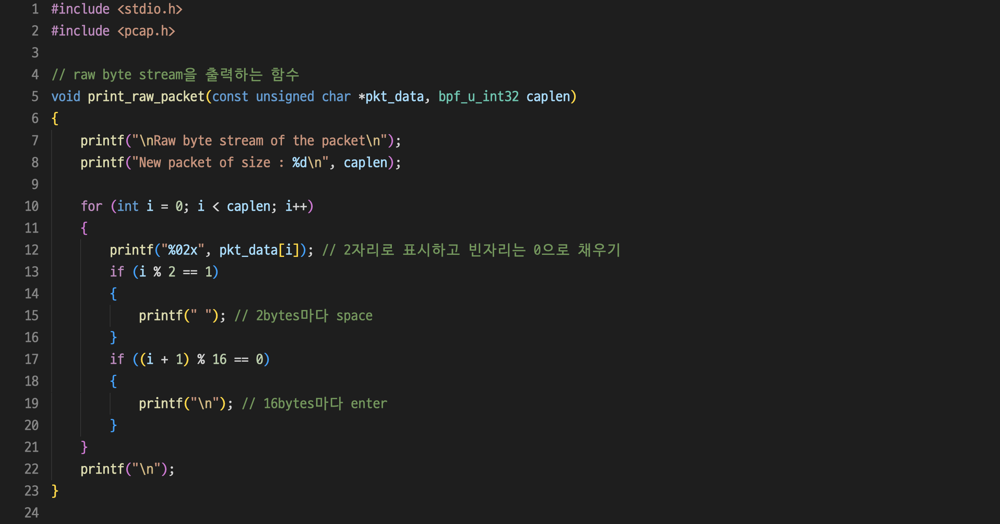<br>
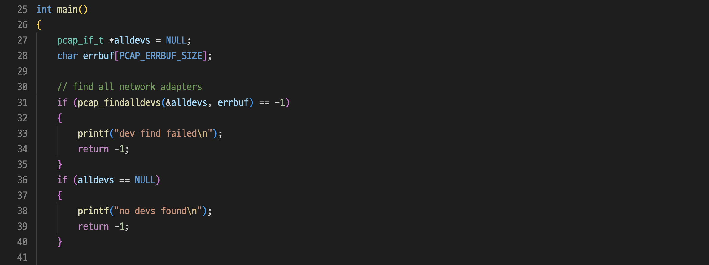<br>
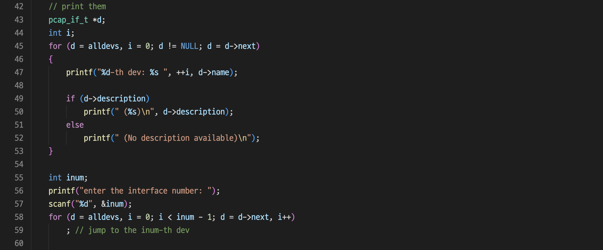<br>
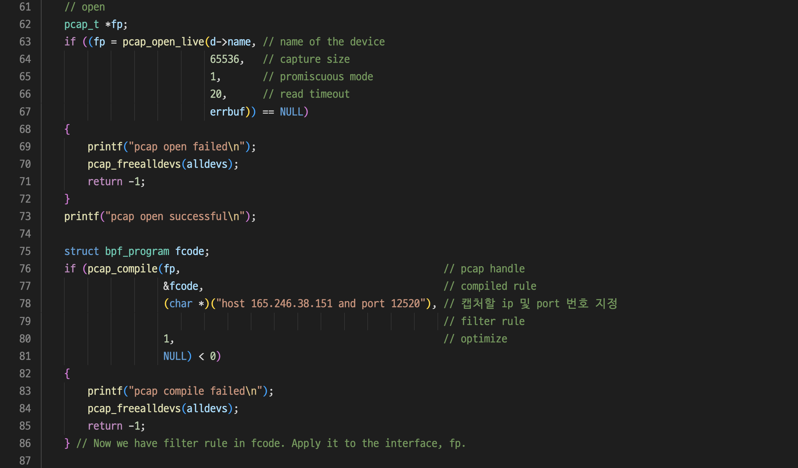<br>
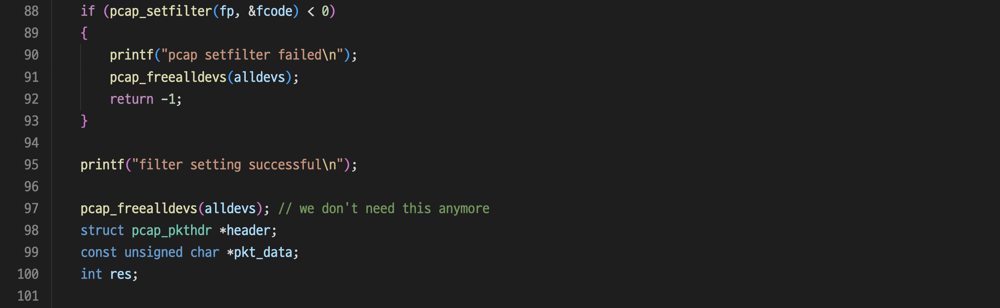<br>
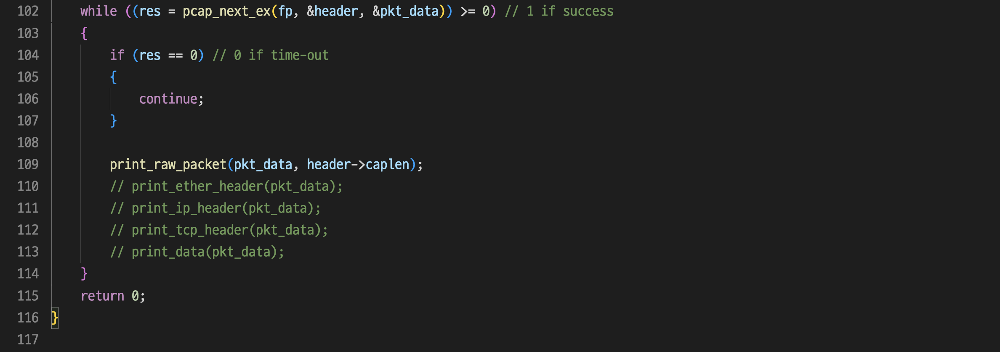<br>

#### STEP 2 : 수정한 `sniffer.c`를 "\_\_gxx_personality_v0 error"를 방지하기 위해 `g++`로 `-lpcap` 옵션을 주어 컴파일하고, 실행 파일을 `sudo` 권한을 주어 실행하였다.

```bash
$ g++ -o sniffer sniffer.c -lpcap
$ sudo ./sniffer
```

interface number로 `1`을 입력하였다.

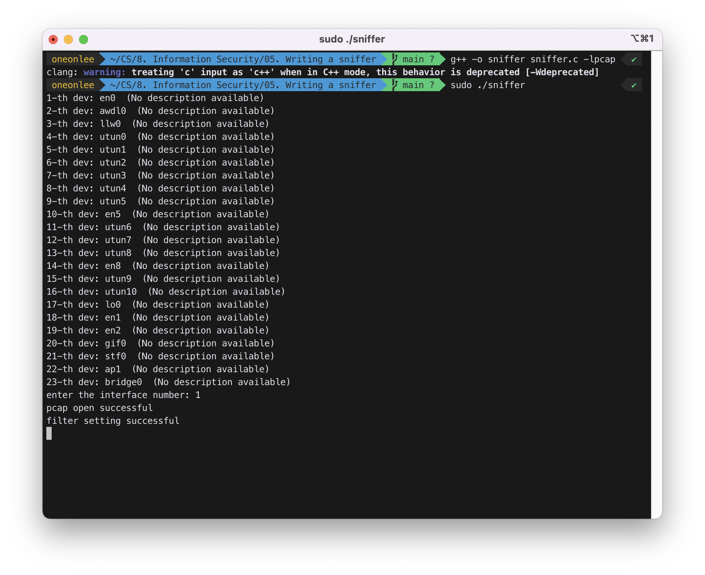

available한 dev를 확인할 수 있었다.

#### STEP 3 : server에 접속하여 `./serv`를 실행하였다.

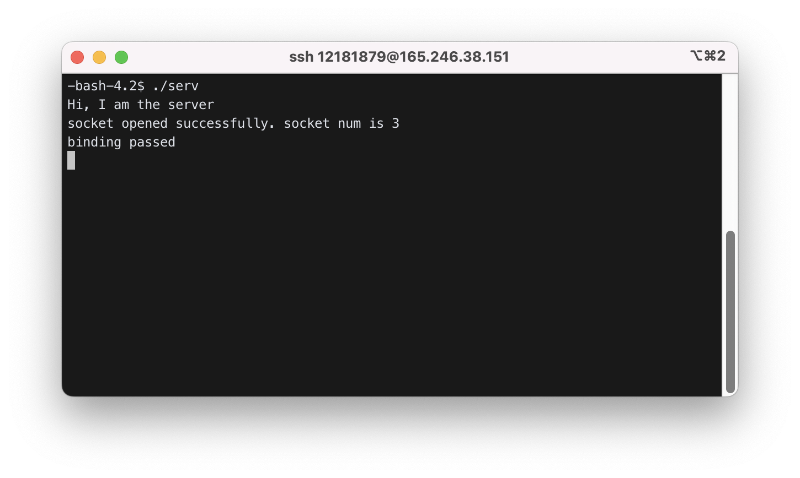

#### STEP 4 : 로컬에서 client 실행 파일인 `./cli`를 실행하였다.

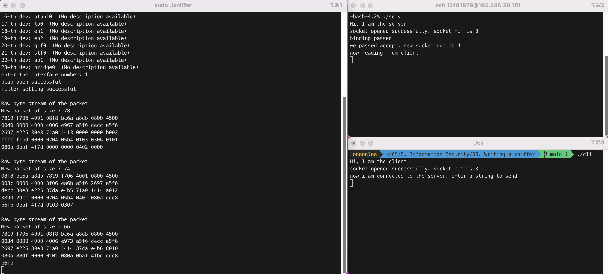<br>
위 화면에서 왼쪽 터미널은 `./sniffer`를 실행한 화면이다. 오른쪽 위 터미널은 server의 터미널이고, 오른쪽 아래 터미널이 client의 터미널이다.

```
Raw byte stream of the packet
New packet of size : 78
7819 f706 4001 08f8 bc6a a8db 0800 4500
0040 0000 4000 4006 e967 a5f6 decc a5f6
2697 e225 30e8 71a0 1413 0000 0000 b002
ffff f1bd 0000 0204 05b4 0103 0306 0101
080a 0baf 4f7d 0000 0000 0402 0000

Raw byte stream of the packet
New packet of size : 74
08f8 bc6a a8db 7819 f706 4001 0800 4500
003c 0000 4000 3f06 ea6b a5f6 2697 a5f6
decc 30e8 e225 37da e4b5 71a0 1414 a012
3890 29cc 0000 0204 05b4 0402 080a ccc8
b6fb 0baf 4f7d 0103 0307

Raw byte stream of the packet
New packet of size : 66
7819 f706 4001 08f8 bc6a a8db 0800 4500
0034 0000 4000 4006 e973 a5f6 decc a5f6
2697 e225 30e8 71a0 1414 37da e4b6 8010
080a 88df 0000 0101 080a 0baf 4fbc ccc8
b6fb
```

#### STEP 5 : server와 client 간에 통신을 시작하였다.

##### Client -> Server : "HI"

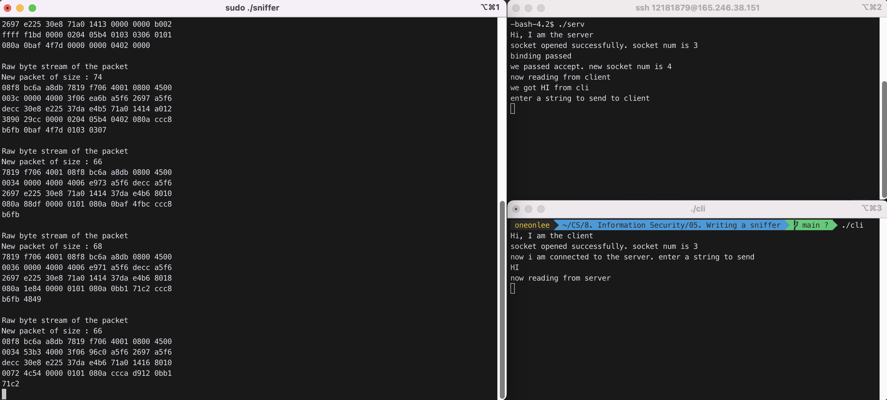

```Raw byte stream of the packet
New packet of size : 68
7819 f706 4001 08f8 bc6a a8db 0800 4500
0036 0000 4000 4006 e971 a5f6 decc a5f6
2697 e225 30e8 71a0 1414 37da e4b6 8018
080a 1e84 0000 0101 080a 0bb1 71c2 ccc8
b6fb 4849

Raw byte stream of the packet
New packet of size : 66
08f8 bc6a a8db 7819 f706 4001 0800 4500
0034 53b3 4000 3f06 96c0 a5f6 2697 a5f6
decc 30e8 e225 37da e4b6 71a0 1416 8010
0072 4c54 0000 0101 080a ccca d912 0bb1
71c2
```

##### Server -> Client : "BYE"

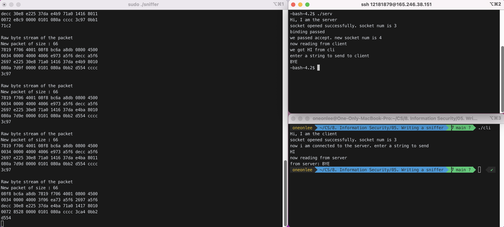

```
Raw byte stream of the packet
New packet of size : 69
08f8 bc6a a8db 7819 f706 4001 0800 4500
0037 53b4 4000 3f06 96bc a5f6 2697 a5f6
decc 30e8 e225 37da e4b6 71a0 1416 8018
0072 6169 0000 0101 080a cccc 3c97 0bb1
71c2 4259 45

Raw byte stream of the packet
New packet of size : 66
08f8 bc6a a8db 7819 f706 4001 0800 4500
0034 53b5 4000 3f06 96be a5f6 2697 a5f6
decc 30e8 e225 37da e4b9 71a0 1416 8011
0072 e8c9 0000 0101 080a cccc 3c97 0bb1
71c2

Raw byte stream of the packet
New packet of size : 66
7819 f706 4001 08f8 bc6a a8db 0800 4500
0034 0000 4000 4006 e973 a5f6 decc a5f6
2697 e225 30e8 71a0 1416 37da e4b9 8010
080a 7d9f 0000 0101 080a 0bb2 d554 cccc
3c97

Raw byte stream of the packet
New packet of size : 66
7819 f706 4001 08f8 bc6a a8db 0800 4500
0034 0000 4000 4006 e973 a5f6 decc a5f6
2697 e225 30e8 71a0 1416 37da e4ba 8010
080a 7d9e 0000 0101 080a 0bb2 d554 cccc
3c97

Raw byte stream of the packet
New packet of size : 66
7819 f706 4001 08f8 bc6a a8db 0800 4500
0034 0000 4000 4006 e973 a5f6 decc a5f6
2697 e225 30e8 71a0 1416 37da e4ba 8011
080a 7d9d 0000 0101 080a 0bb2 d554 cccc
3c97

Raw byte stream of the packet
New packet of size : 66
08f8 bc6a a8db 7819 f706 4001 0800 4500
0034 0000 4000 3f06 ea73 a5f6 2697 a5f6
decc 30e8 e225 37da e4ba 71a0 1417 8010
0072 8528 0000 0101 080a cccc 3ca4 0bb2
d554
```

전체 코드는 아래와 같다.

```c
#include <stdio.h>
#include <pcap.h>

// raw byte stream을 출력하는 함수
void print_raw_packet(const unsigned char *pkt_data, bpf_u_int32 caplen)
{
	printf("\nRaw byte stream of the packet\n");
	printf("New packet of size : %d\n", caplen);

	for (int i = 0; i < caplen; i++)
	{
		printf("%02x", pkt_data[i]); // 2자리로 표시하고 빈자리는 0으로 채우기
		if (i % 2 == 1)
		{
			printf(" "); // 2bytes마다 space
		}
		if ((i + 1) % 16 == 0)
		{
			printf("\n"); // 16bytes마다 enter
		}
	}
	printf("\n");
}

int main()
{
	pcap_if_t *alldevs = NULL;
	char errbuf[PCAP_ERRBUF_SIZE];

	// find all network adapters
	if (pcap_findalldevs(&alldevs, errbuf) == -1)
	{
		printf("dev find failed\n");
		return -1;
	}
	if (alldevs == NULL)
	{
		printf("no devs found\n");
		return -1;
	}

	// print them
	pcap_if_t *d;
	int i;
	for (d = alldevs, i = 0; d != NULL; d = d->next)
	{
		printf("%d-th dev: %s ", ++i, d->name);

		if (d->description)
			printf(" (%s)\n", d->description);
		else
			printf(" (No description available)\n");
	}

	int inum;
	printf("enter the interface number: ");
	scanf("%d", &inum);
	for (d = alldevs, i = 0; i < inum - 1; d = d->next, i++)
		; // jump to the inum-th dev

	// open
	pcap_t *fp;
	if ((fp = pcap_open_live(d->name, // name of the device
							 65536,	  // capture size
							 1,		  // promiscuous mode
							 20,	  // read timeout
							 errbuf)) == NULL)
	{
		printf("pcap open failed\n");
		pcap_freealldevs(alldevs);
		return -1;
	}
	printf("pcap open successful\n");

	struct bpf_program fcode;
	if (pcap_compile(fp,											 // pcap handle
					 &fcode,										 // compiled rule
					 (char *)("host 165.246.38.151 and port 12520"), // 캡처할 ip 및 port 번호 지정
																	 // filter rule
					 1,												 // optimize
					 NULL) < 0)
	{
		printf("pcap compile failed\n");
		pcap_freealldevs(alldevs);
		return -1;
	} // Now we have filter rule in fcode. Apply it to the interface, fp.

	if (pcap_setfilter(fp, &fcode) < 0)
	{
		printf("pcap setfilter failed\n");
		pcap_freealldevs(alldevs);
		return -1;
	}

	printf("filter setting successful\n");

	pcap_freealldevs(alldevs); // we don't need this anymore
	struct pcap_pkthdr *header;
	const unsigned char *pkt_data;
	int res;

	while ((res = pcap_next_ex(fp, &header, &pkt_data)) >= 0) // 1 if success
	{
		if (res == 0) // 0 if time-out
		{
			continue;
		}

		print_raw_packet(pkt_data, header->caplen);
		// print_ether_header(pkt_data);
		// print_ip_header(pkt_data);
		// print_tcp_header(pkt_data);
		// print_data(pkt_data);
	}
	return 0;
}
```

### 2) Improve your sniffer such that it also prints all the fields in ethernet header, ip header, and tcp header. Use `ntohs` for "`short`" data type and `ntohl` for "`int`" data type in order to display them correclty. For the data part, just show them in hexadecimal numbers.

```
           dest MAC: ......
           src MAC: .......
           protocol type: ........
           IP version: ...
           IP header length: .....
           ......................
```

Use following structures.

```c
struct ether_addr {
    unsigned char ether_addr_octet[6];
};

struct ether_header {
    struct  ether_addr ether_dhost;
    struct  ether_addr ether_shost;
    unsigned short ether_type;          // 0x0800 for IP
};

struct ip_header{
   unsigned char ip_header_len:4;
   unsigned char ip_version:4;
   unsigned char ip_tos;
   unsigned short ip_total_length;
   unsigned short ip_id;
   unsigned char ip_frag_offset:5;
   unsigned char ip_more_fragment:1;
   unsigned char ip_dont_fragment:1;
   unsigned char ip_reserved_zero:1;
   unsigned char ip_frag_offset1;
   unsigned char ip_ttl;
   unsigned char ip_protocol;
   unsigned short ip_checksum;
   unsigned int ip_srcaddr;
   unsigned int ip_destaddr;
};

struct tcp_header{
   unsigned short source_port;
   unsigned short dest_port;
   unsigned int sequence;
   unsigned int acknowledge;
   unsigned char ns:1;
   unsigned char reserved_part1:3;
   unsigned char data_offset:4;
   unsigned char fin:1;
   unsigned char syn:1;
   unsigned char rst:1;
   unsigned char psh:1;
   unsigned char ack:1;
   unsigned char urg:1;
   unsigned char ecn:1;
   unsigned char cwr:1;
   unsigned short window;
   unsigned short checksum;
   unsigned short urgent_pointer;
};
```

#### STEP 1 : `sniffer.c`를 아래와 같이 수정하였다.

`sniffer.c` : <br>

```c
#include <stdio.h>
#include <pcap.h>

struct ether_addr
{
	unsigned char ether_addr_octet[6];
};

struct ether_header
{
	struct ether_addr ether_dhost;
	struct ether_addr ether_shost;
	unsigned short ether_type; // 0x0800 for IP
};

struct ip_header
{
	unsigned char ip_header_len : 4;
	unsigned char ip_version : 4;
	unsigned char ip_tos;
	unsigned short ip_total_length;
	unsigned short ip_id;
	unsigned char ip_frag_offset : 5;
	unsigned char ip_more_fragment : 1;
	unsigned char ip_dont_fragment : 1;
	unsigned char ip_reserved_zero : 1;
	unsigned char ip_frag_offset1;
	unsigned char ip_ttl;
	unsigned char ip_protocol;
	unsigned short ip_checksum;
	unsigned int ip_srcaddr;
	unsigned int ip_destaddr;
};

struct tcp_header
{
	unsigned short source_port;
	unsigned short dest_port;
	unsigned int sequence;
	unsigned int acknowledge;
	unsigned char ns : 1;
	unsigned char reserved_part1 : 3;
	unsigned char data_offset : 4;
	unsigned char fin : 1;
	unsigned char syn : 1;
	unsigned char rst : 1;
	unsigned char psh : 1;
	unsigned char ack : 1;
	unsigned char urg : 1;
	unsigned char ecn : 1;
	unsigned char cwr : 1;
	unsigned short window;
	unsigned short checksum;
	unsigned short urgent_pointer;
};

// raw byte stream을 출력하는 함수
void print_raw_packet(const unsigned char *pkt_data, bpf_u_int32 caplen)
{
	printf("\nRaw Byte Stream of the Packet\n");
	printf("New Packet of Size : %d\n", caplen);

	for (int i = 0; i < caplen; i++)
	{
		printf("%02x", pkt_data[i]); // 2자리로 표시하고 빈자리는 0으로 채우기
		if (i % 2 == 1)
		{
			printf(" "); // 2bytes마다 space
		}
		if ((i + 1) % 16 == 0)
		{
			printf("\n"); // 16bytes마다 enter
		}
	}
	printf("\n");
}

// Ethernet Header를 출력하는 함수
void print_ether_header(const unsigned char *pkt_data)
{
	struct ether_header *eh;
	eh = (struct ether_header *)pkt_data;

	printf("\nPrinting Ethernet Header: ");
	printf("\n\tDestination MAC Address: ");
	for (int i = 0; i < 6; i++)
	{
		printf("%02x", eh->ether_dhost.ether_addr_octet[i]);
	}
	printf("\n\tSource MAC Address: ");
	for (int i = 0; i < 6; i++)
	{
		printf("%02x", eh->ether_shost.ether_addr_octet[i]);
	}
	printf("\nProtocol Type: %04x\n", ntohs(eh->ether_type));
}

// IP Header를 출력하는 함수
void print_ip_header(const unsigned char *pkt_data)
{
	struct ip_header *ih;
	ih = (struct ip_header *)(pkt_data + 14); // ethernet header(14) 이후부터 시작
	printf("\nPrinting IP Header: ");

	printf("\tIP Version: %x\n", ih->ip_version);
	printf("\tIP Header Length: %d bytes\n", ih->ip_header_len);
	printf("\tIP Type of Service: %d\n", ih->ip_tos);
	printf("\tIP Total Length: %d\n", ntohs(ih->ip_total_length));

	printf("\tIP Identification: %d\n", ntohs(ih->ip_id));
	printf("\tIP Reserved Zero: %x\n", ih->ip_reserved_zero);
	printf("\tIP Don't Fragment: %x\n", ih->ip_dont_fragment);
	printf("\tIP More Fragment: %x\n", ih->ip_more_fragment);
	printf("\tIP Frag Offset: %02x\n", ih->ip_frag_offset);
	printf("\tIP Frag Offset 1: %02x\n", ih->ip_frag_offset1);

	printf("\tIP TTL: %02x\n", ih->ip_ttl);
	printf("\tIP Protocol: %02x\n", ih->ip_protocol);
	printf("\tIP CheckSum: %04x\n", ntohs(ih->ip_checksum));

	printf("\tSource IP Address: %08x\n", ntohl(ih->ip_srcaddr));
	printf("\tDestination IP Address: %08x\n", ntohl(ih->ip_destaddr));
}

// TCP Header를 출력하는 함수
void print_tcp_header(const unsigned char *pkt_data)
{
	struct tcp_header *th;
	th = (struct tcp_header *)&pkt_data[34];

	printf("\nPrinting TCP Header: ");

	printf("\tSource Port Number: %d\n", ntohs(th->source_port));
	printf("\tDestination Port Number: %d\n", ntohs(th->dest_port));

	printf("\tSequence Number: %d\n", ntohl(th->sequence));
	printf("\tACK Number: %d\n", ntohl(th->acknowledge));

	printf("\tTCP Data Offset: %x\n", th->data_offset);
	printf("\tReserved Part 1: %x\n", th->reserved_part1);
	printf("\tTCP NS: %x\n", th->ns);
	printf("\tFIN: %x\n", th->fin);
	printf("\tSYN: %x\n", th->syn);
	printf("\tRST: %x\n", th->rst);
	printf("\tPSH: %x\n", th->psh);
	printf("\tACK: %x\n", th->ack);
	printf("\tURG: %x\n", th->urg);
	printf("\tECN: %x\n", th->ecn);
	printf("\tCWR: %x\n", th->cwr);
	printf("\tWindow: %d\n", ntohs(th->window));

	printf("\tTCP CheckSum: %04x\n", ntohs(th->checksum));
	printf("\tUrgent Pointer: %04x\n", ntohs(th->urgent_pointer));
}

void print_data(const unsigned char *pkt_data, bpf_u_int32 caplen, unsigned int tcp_length = 20)
{
	int packet_size_without_data = 14 + 20 + tcp_length;
	unsigned char *data = (unsigned char *)(pkt_data + packet_size_without_data);

	printf("\nPrinting data of packet : \n");
	for (int i = 0; i < caplen - packet_size_without_data; i++)
	{
		printf("%02x", data[i]); // 2자리로 표시하고 빈자리는 0으로 채우기
		if (i % 2 == 1)
		{
			printf(" "); // 2bytes마다 space
		}
		if ((i + 1) % 16 == 0)
		{
			printf("\n"); // 16bytes마다 enter
		}
	}
	printf("\n");
}

int main()
{
	pcap_if_t *alldevs = NULL;
	char errbuf[PCAP_ERRBUF_SIZE];

	// find all network adapters
	if (pcap_findalldevs(&alldevs, errbuf) == -1)
	{
		printf("dev find failed\n");
		return -1;
	}
	if (alldevs == NULL)
	{
		printf("no devs found\n");
		return -1;
	}

	// print them
	pcap_if_t *d;
	int i;
	for (d = alldevs, i = 0; d != NULL; d = d->next)
	{
		printf("%d-th dev: %s ", ++i, d->name);

		if (d->description)
			printf(" (%s)\n", d->description);
		else
			printf(" (No description available)\n");
	}

	int inum;
	printf("enter the interface number: ");
	scanf("%d", &inum);
	for (d = alldevs, i = 0; i < inum - 1; d = d->next, i++)
		; // jump to the inum-th dev

	// open
	pcap_t *fp;
	if ((fp = pcap_open_live(d->name, // name of the device
							 65536,	  // capture size
							 1,		  // promiscuous mode
							 20,	  // read timeout
							 errbuf)) == NULL)
	{
		printf("pcap open failed\n");
		pcap_freealldevs(alldevs);
		return -1;
	}
	printf("pcap open successful\n");

	struct bpf_program fcode;
	if (pcap_compile(fp,											 // pcap handle
					 &fcode,										 // compiled rule
					 (char *)("host 165.246.38.151 and port 12520"), // 캡처할 ip 및 port 번호 지정
																	 // filter rule
					 1,												 // optimize
					 NULL) < 0)
	{
		printf("pcap compile failed\n");
		pcap_freealldevs(alldevs);
		return -1;
	} // Now we have filter rule in fcode. Apply it to the interface, fp.

	if (pcap_setfilter(fp, &fcode) < 0)
	{
		printf("pcap setfilter failed\n");
		pcap_freealldevs(alldevs);
		return -1;
	}

	printf("filter setting successful\n");

	pcap_freealldevs(alldevs); // we don't need this anymore
	struct pcap_pkthdr *header;
	const unsigned char *pkt_data;
	int res;

	while ((res = pcap_next_ex(fp, &header, &pkt_data)) >= 0) // 1 if success
	{
		if (res == 0) // 0 if time-out
		{
			continue;
		}

		print_raw_packet(pkt_data, header->caplen);
		print_ether_header(pkt_data);
		print_ip_header(pkt_data);
		print_tcp_header(pkt_data);
		print_data(pkt_data, header->caplen);
	}
	return 0;
}
```

#### STEP 2 : 수정한 `sniffer.c`를 "\_\_gxx_personality_v0 error"를 방지하기 위해 `g++`로 `-lpcap` 옵션을 주어 컴파일하고, 실행 파일을 `sudo` 권한을 주어 실행하였다.

```bash
$ g++ -o sniffer sniffer.c -lpcap
$ sudo ./sniffer
```

interface number로 `1`을 입력하였다.

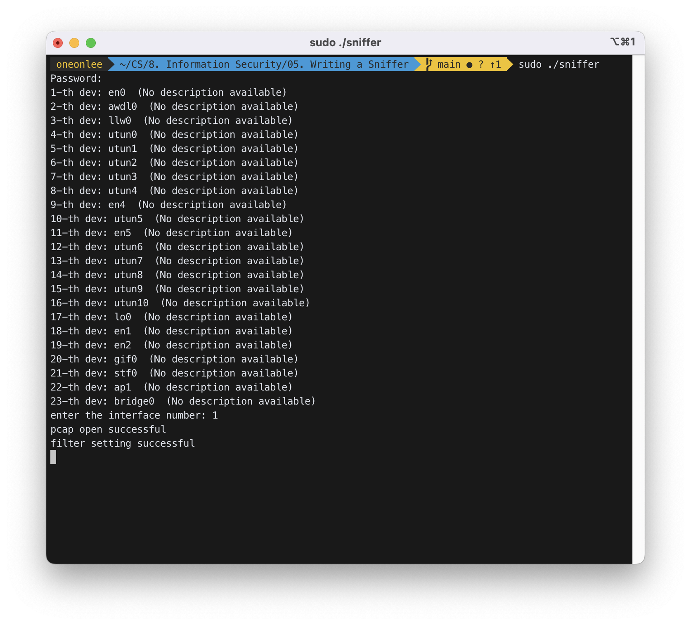

available한 dev를 확인할 수 있었다.

#### STEP 3 : server에 접속하여 `./serv`를 실행하였다.

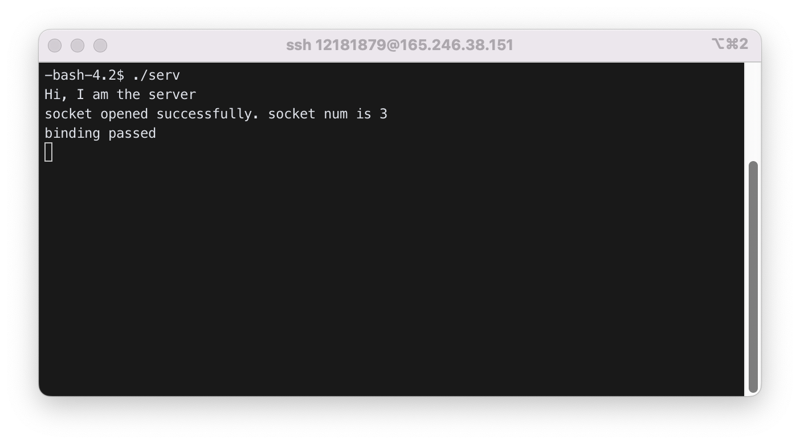

#### STEP 4 : 로컬에서 client 실행 파일인 `./cli`를 실행하였다.

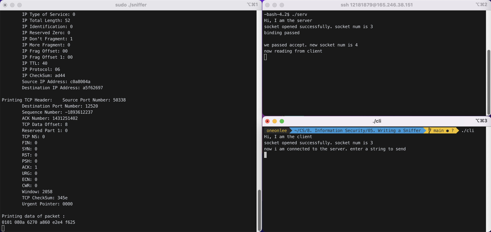<br>
위 화면에서 왼쪽 터미널은 `./sniffer`를 실행한 화면이다. 오른쪽 위 터미널은 server의 터미널이고, 오른쪽 아래 터미널이 client의 터미널이다.

```
Raw Byte Stream of the Packet
New Packet of Size : 78
705d ccaa 6e94 08f8 bc6a a8db 0800 4500
0040 0000 4000 4006 ad38 c0a8 004a a5f6
2697 c4a2 30e8 8f21 c532 0000 0000 b002
ffff 54dd 0000 0204 05b4 0103 0306 0101
080a 6270 a84f 0000 0000 0402 0000

Printing Ethernet Header:
	Destination MAC Address: 705dccaa6e94
	Source MAC Address: 08f8bc6aa8db
	Protocol Type: 0800

Printing IP Header:
	IP Version: 4
	IP Header Length: 5 bytes
	IP Type of Service: 0
	IP Total Length: 64
	IP Identification: 0
	IP Reserved Zero: 0
	IP Don't Fragment: 1
	IP More Fragment: 0
	IP Frag Offset: 00
	IP Frag Offset 1: 00
	IP TTL: 40
	IP Protocol: 06
	IP CheckSum: ad38
	Source IP Address: c0a8004a
	Destination IP Address: a5f62697

Printing TCP Header: 	Source Port Number: 50338
	Destination Port Number: 12520
	Sequence Number: -1893612238
	ACK Number: 0
	TCP Data Offset: b
	Reserved Part 1: 0
	TCP NS: 0
	FIN: 0
	SYN: 1
	RST: 0
	PSH: 0
	ACK: 0
	URG: 0
	ECN: 0
	CWR: 0
	Window: 65535
	TCP CheckSum: 54dd
	Urgent Pointer: 0000

Printing data of packet :
0204 05b4 0103 0306 0101 080a 6270 a84f
0000 0000 0402 0000

Raw Byte Stream of the Packet
New Packet of Size : 74
08f8 bc6a a8db 705d ccaa 6e94 0800 4500
003c 0000 4000 3806 b53c a5f6 2697 c0a8
004a 30e8 c4a2 554f 29c9 8f21 c533 a012
3890 d51c 0000 0204 05b4 0402 080a e2e4
f625 6270 a84f 0103 0307

Printing Ethernet Header:
	Destination MAC Address: 08f8bc6aa8db
	Source MAC Address: 705dccaa6e94
	Protocol Type: 0800

Printing IP Header:
	IP Version: 4
	IP Header Length: 5 bytes
	IP Type of Service: 0
	IP Total Length: 60
	IP Identification: 0
	IP Reserved Zero: 0
	IP Don't Fragment: 1
	IP More Fragment: 0
	IP Frag Offset: 00
	IP Frag Offset 1: 00
	IP TTL: 38
	IP Protocol: 06
	IP CheckSum: b53c
	Source IP Address: a5f62697
	Destination IP Address: c0a8004a

Printing TCP Header: 	Source Port Number: 12520
	Destination Port Number: 50338
	Sequence Number: 1431251401
	ACK Number: -1893612237
	TCP Data Offset: a
	Reserved Part 1: 0
	TCP NS: 0
	FIN: 0
	SYN: 1
	RST: 0
	PSH: 0
	ACK: 1
	URG: 0
	ECN: 0
	CWR: 0
	Window: 14480
	TCP CheckSum: d51c
	Urgent Pointer: 0000

Printing data of packet :
0204 05b4 0402 080a e2e4 f625 6270 a84f
0103 0307

Raw Byte Stream of the Packet
New Packet of Size : 66
705d ccaa 6e94 08f8 bc6a a8db 0800 4500
0034 0000 4000 4006 ad44 c0a8 004a a5f6
2697 c4a2 30e8 8f21 c533 554f 29ca 8010
080a 345e 0000 0101 080a 6270 a860 e2e4
f625

Printing Ethernet Header:
	Destination MAC Address: 705dccaa6e94
	Source MAC Address: 08f8bc6aa8db
	Protocol Type: 0800

Printing IP Header:
	IP Version: 4
	IP Header Length: 5 bytes
	IP Type of Service: 0
	IP Total Length: 52
	IP Identification: 0
	IP Reserved Zero: 0
	IP Don't Fragment: 1
	IP More Fragment: 0
	IP Frag Offset: 00
	IP Frag Offset 1: 00
	IP TTL: 40
	IP Protocol: 06
	IP CheckSum: ad44
	Source IP Address: c0a8004a
	Destination IP Address: a5f62697

Printing TCP Header: 	Source Port Number: 50338
	Destination Port Number: 12520
	Sequence Number: -1893612237
	ACK Number: 1431251402
	TCP Data Offset: 8
	Reserved Part 1: 0
	TCP NS: 0
	FIN: 0
	SYN: 0
	RST: 0
	PSH: 0
	ACK: 1
	URG: 0
	ECN: 0
	CWR: 0
	Window: 2058
	TCP CheckSum: 345e
	Urgent Pointer: 0000

Printing data of packet :
0101 080a 6270 a860 e2e4 f625
```

#### STEP 5 : server와 client 간에 통신을 시작하였다.

##### Client -> Server : "HI"

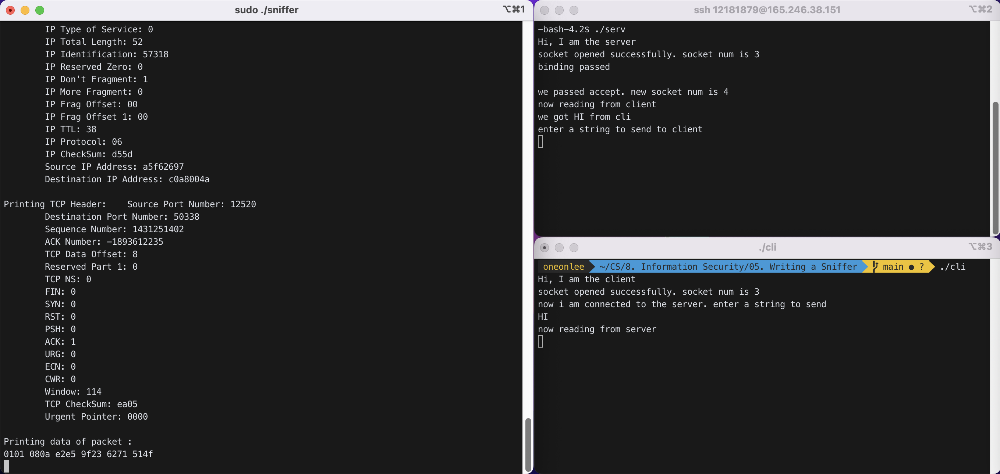

```Raw byte stream of the packet
Raw Byte Stream of the Packet
New Packet of Size : 68
705d ccaa 6e94 08f8 bc6a a8db 0800 4500
0036 0000 4000 4006 ad42 c0a8 004a a5f6
2697 c4a2 30e8 8f21 c533 554f 29ca 8018
080a 431b 0000 0101 080a 6271 514f e2e4
f625 4849

Printing Ethernet Header:
	Destination MAC Address: 705dccaa6e94
	Source MAC Address: 08f8bc6aa8db
	Protocol Type: 0800

Printing IP Header:
	IP Version: 4
	IP Header Length: 5 bytes
	IP Type of Service: 0
	IP Total Length: 54
	IP Identification: 0
	IP Reserved Zero: 0
	IP Don't Fragment: 1
	IP More Fragment: 0
	IP Frag Offset: 00
	IP Frag Offset 1: 00
	IP TTL: 40
	IP Protocol: 06
	IP CheckSum: ad42
	Source IP Address: c0a8004a
	Destination IP Address: a5f62697

Printing TCP Header: 	Source Port Number: 50338
	Destination Port Number: 12520
	Sequence Number: -1893612237
	ACK Number: 1431251402
	TCP Data Offset: 8
	Reserved Part 1: 0
	TCP NS: 0
	FIN: 0
	SYN: 0
	RST: 0
	PSH: 1
	ACK: 1
	URG: 0
	ECN: 0
	CWR: 0
	Window: 2058
	TCP CheckSum: 431b
	Urgent Pointer: 0000

Printing data of packet :
0101 080a 6271 514f e2e4 f625 4849

Raw Byte Stream of the Packet
New Packet of Size : 66
08f8 bc6a a8db 705d ccaa 6e94 0800 4500
0034 dfe6 4000 3806 d55d a5f6 2697 c0a8
004a 30e8 c4a2 554f 29ca 8f21 c535 8010
0072 ea05 0000 0101 080a e2e5 9f23 6271
514f

Printing Ethernet Header:
	Destination MAC Address: 08f8bc6aa8db
	Source MAC Address: 705dccaa6e94
	Protocol Type: 0800

Printing IP Header:
	IP Version: 4
	IP Header Length: 5 bytes
	IP Type of Service: 0
	IP Total Length: 52
	IP Identification: 57318
	IP Reserved Zero: 0
	IP Don't Fragment: 1
	IP More Fragment: 0
	IP Frag Offset: 00
	IP Frag Offset 1: 00
	IP TTL: 38
	IP Protocol: 06
	IP CheckSum: d55d
	Source IP Address: a5f62697
	Destination IP Address: c0a8004a

Printing TCP Header: 	Source Port Number: 12520
	Destination Port Number: 50338
	Sequence Number: 1431251402
	ACK Number: -1893612235
	TCP Data Offset: 8
	Reserved Part 1: 0
	TCP NS: 0
	FIN: 0
	SYN: 0
	RST: 0
	PSH: 0
	ACK: 1
	URG: 0
	ECN: 0
	CWR: 0
	Window: 114
	TCP CheckSum: ea05
	Urgent Pointer: 0000

Printing data of packet :
0101 080a e2e5 9f23 6271 514f

```

##### Server -> Client : "BYE"

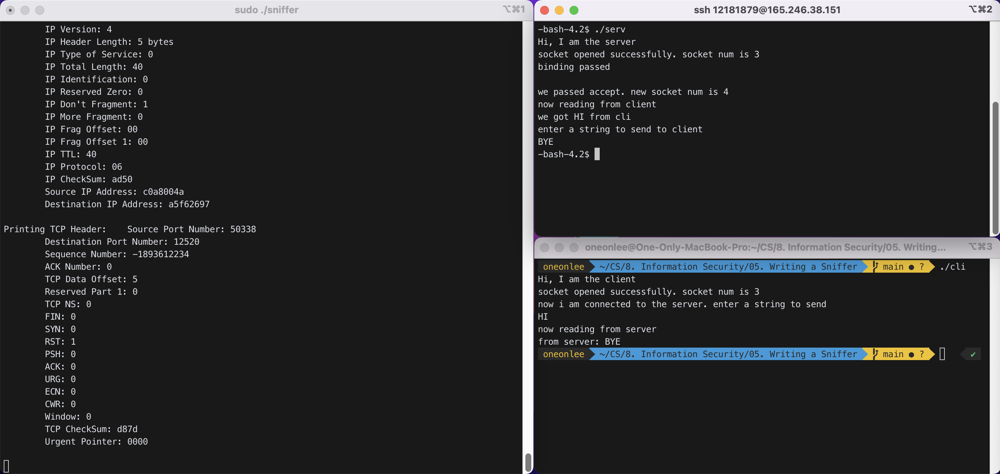

```
Raw Byte Stream of the Packet
New Packet of Size : 66
08f8 bc6a a8db 705d ccaa 6e94 0800 4500
0034 dfe8 4000 3806 d55b a5f6 2697 c0a8
004a 30e8 c4a2 554f 29cd 8f21 c535 8011
0072 04aa 0000 0101 080a e2e6 847a 6271
514f

Printing Ethernet Header:
	Destination MAC Address: 08f8bc6aa8db
	Source MAC Address: 705dccaa6e94
	Protocol Type: 0800

Printing IP Header:
	IP Version: 4
	IP Header Length: 5 bytes
	IP Type of Service: 0
	IP Total Length: 52
	IP Identification: 57320
	IP Reserved Zero: 0
	IP Don't Fragment: 1
	IP More Fragment: 0
	IP Frag Offset: 00
	IP Frag Offset 1: 00
	IP TTL: 38
	IP Protocol: 06
	IP CheckSum: d55b
	Source IP Address: a5f62697
	Destination IP Address: c0a8004a

Printing TCP Header: 	Source Port Number: 12520
	Destination Port Number: 50338
	Sequence Number: 1431251405
	ACK Number: -1893612235
	TCP Data Offset: 8
	Reserved Part 1: 0
	TCP NS: 0
	FIN: 1
	SYN: 0
	RST: 0
	PSH: 0
	ACK: 1
	URG: 0
	ECN: 0
	CWR: 0
	Window: 114
	TCP CheckSum: 04aa
	Urgent Pointer: 0000

Printing data of packet :
0101 080a e2e6 847a 6271 514f

Raw Byte Stream of the Packet
New Packet of Size : 69
08f8 bc6a a8db 705d ccaa 6e94 0800 4500
0037 dfe7 4000 3806 d559 a5f6 2697 c0a8
004a 30e8 c4a2 554f 29ca 8f21 c535 8018
0072 7d49 0000 0101 080a e2e6 847a 6271
514f 4259 45

Printing Ethernet Header:
	Destination MAC Address: 08f8bc6aa8db
	Source MAC Address: 705dccaa6e94
	Protocol Type: 0800

Printing IP Header:
	IP Version: 4
	IP Header Length: 5 bytes
	IP Type of Service: 0
	IP Total Length: 55
	IP Identification: 57319
	IP Reserved Zero: 0
	IP Don't Fragment: 1
	IP More Fragment: 0
	IP Frag Offset: 00
	IP Frag Offset 1: 00
	IP TTL: 38
	IP Protocol: 06
	IP CheckSum: d559
	Source IP Address: a5f62697
	Destination IP Address: c0a8004a

Printing TCP Header: 	Source Port Number: 12520
	Destination Port Number: 50338
	Sequence Number: 1431251402
	ACK Number: -1893612235
	TCP Data Offset: 8
	Reserved Part 1: 0
	TCP NS: 0
	FIN: 0
	SYN: 0
	RST: 0
	PSH: 1
	ACK: 1
	URG: 0
	ECN: 0
	CWR: 0
	Window: 114
	TCP CheckSum: 7d49
	Urgent Pointer: 0000

Printing data of packet :
0101 080a e2e6 847a 6271 514f 4259 45

Raw Byte Stream of the Packet
New Packet of Size : 78
705d ccaa 6e94 08f8 bc6a a8db 0800 4500
0040 0000 4000 4006 ad38 c0a8 004a a5f6
2697 c4a2 30e8 8f21 c535 554f 29ca b010
080a c8b4 0000 0101 080a 6272 36b6 e2e5
9f23 0101 050a 554f 29cd 554f 29ce

Printing Ethernet Header:
	Destination MAC Address: 705dccaa6e94
	Source MAC Address: 08f8bc6aa8db
	Protocol Type: 0800

Printing IP Header:
	IP Version: 4
	IP Header Length: 5 bytes
	IP Type of Service: 0
	IP Total Length: 64
	IP Identification: 0
	IP Reserved Zero: 0
	IP Don't Fragment: 1
	IP More Fragment: 0
	IP Frag Offset: 00
	IP Frag Offset 1: 00
	IP TTL: 40
	IP Protocol: 06
	IP CheckSum: ad38
	Source IP Address: c0a8004a
	Destination IP Address: a5f62697

Printing TCP Header: 	Source Port Number: 50338
	Destination Port Number: 12520
	Sequence Number: -1893612235
	ACK Number: 1431251402
	TCP Data Offset: b
	Reserved Part 1: 0
	TCP NS: 0
	FIN: 0
	SYN: 0
	RST: 0
	PSH: 0
	ACK: 1
	URG: 0
	ECN: 0
	CWR: 0
	Window: 2058
	TCP CheckSum: c8b4
	Urgent Pointer: 0000

Printing data of packet :
0101 080a 6272 36b6 e2e5 9f23 0101 050a
554f 29cd 554f 29ce

Raw Byte Stream of the Packet
New Packet of Size : 66
705d ccaa 6e94 08f8 bc6a a8db 0800 4500
0034 0000 4000 4006 ad44 c0a8 004a a5f6
2697 c4a2 30e8 8f21 c535 554f 29ce 8010
080a 17aa 0000 0101 080a 6272 36b6 e2e6
847a

Printing Ethernet Header:
	Destination MAC Address: 705dccaa6e94
	Source MAC Address: 08f8bc6aa8db
	Protocol Type: 0800

Printing IP Header:
	IP Version: 4
	IP Header Length: 5 bytes
	IP Type of Service: 0
	IP Total Length: 52
	IP Identification: 0
	IP Reserved Zero: 0
	IP Don't Fragment: 1
	IP More Fragment: 0
	IP Frag Offset: 00
	IP Frag Offset 1: 00
	IP TTL: 40
	IP Protocol: 06
	IP CheckSum: ad44
	Source IP Address: c0a8004a
	Destination IP Address: a5f62697

Printing TCP Header: 	Source Port Number: 50338
	Destination Port Number: 12520
	Sequence Number: -1893612235
	ACK Number: 1431251406
	TCP Data Offset: 8
	Reserved Part 1: 0
	TCP NS: 0
	FIN: 0
	SYN: 0
	RST: 0
	PSH: 0
	ACK: 1
	URG: 0
	ECN: 0
	CWR: 0
	Window: 2058
	TCP CheckSum: 17aa
	Urgent Pointer: 0000

Printing data of packet :
0101 080a 6272 36b6 e2e6 847a

Raw Byte Stream of the Packet
New Packet of Size : 66
705d ccaa 6e94 08f8 bc6a a8db 0800 4500
0034 0000 4000 4006 ad44 c0a8 004a a5f6
2697 c4a2 30e8 8f21 c535 554f 29ce 8011
080a 17a9 0000 0101 080a 6272 36b6 e2e6
847a

Printing Ethernet Header:
	Destination MAC Address: 705dccaa6e94
	Source MAC Address: 08f8bc6aa8db
	Protocol Type: 0800

Printing IP Header:
	IP Version: 4
	IP Header Length: 5 bytes
	IP Type of Service: 0
	IP Total Length: 52
	IP Identification: 0
	IP Reserved Zero: 0
	IP Don't Fragment: 1
	IP More Fragment: 0
	IP Frag Offset: 00
	IP Frag Offset 1: 00
	IP TTL: 40
	IP Protocol: 06
	IP CheckSum: ad44
	Source IP Address: c0a8004a
	Destination IP Address: a5f62697

Printing TCP Header: 	Source Port Number: 50338
	Destination Port Number: 12520
	Sequence Number: -1893612235
	ACK Number: 1431251406
	TCP Data Offset: 8
	Reserved Part 1: 0
	TCP NS: 0
	FIN: 1
	SYN: 0
	RST: 0
	PSH: 0
	ACK: 1
	URG: 0
	ECN: 0
	CWR: 0
	Window: 2058
	TCP CheckSum: 17a9
	Urgent Pointer: 0000

Printing data of packet :
0101 080a 6272 36b6 e2e6 847a

Raw Byte Stream of the Packet
New Packet of Size : 66
08f8 bc6a a8db 705d ccaa 6e94 0800 4500
0034 dfe9 4000 3806 d55a a5f6 2697 c0a8
004a 30e8 c4a2 554f 29ce 8f21 c536 8010
0072 1f38 0000 0101 080a e2e6 8483 6272
36b6

Printing Ethernet Header:
	Destination MAC Address: 08f8bc6aa8db
	Source MAC Address: 705dccaa6e94
	Protocol Type: 0800

Printing IP Header:
	IP Version: 4
	IP Header Length: 5 bytes
	IP Type of Service: 0
	IP Total Length: 52
	IP Identification: 57321
	IP Reserved Zero: 0
	IP Don't Fragment: 1
	IP More Fragment: 0
	IP Frag Offset: 00
	IP Frag Offset 1: 00
	IP TTL: 38
	IP Protocol: 06
	IP CheckSum: d55a
	Source IP Address: a5f62697
	Destination IP Address: c0a8004a

Printing TCP Header: 	Source Port Number: 12520
	Destination Port Number: 50338
	Sequence Number: 1431251406
	ACK Number: -1893612234
	TCP Data Offset: 8
	Reserved Part 1: 0
	TCP NS: 0
	FIN: 0
	SYN: 0
	RST: 0
	PSH: 0
	ACK: 1
	URG: 0
	ECN: 0
	CWR: 0
	Window: 114
	TCP CheckSum: 1f38
	Urgent Pointer: 0000

Printing data of packet :
0101 080a e2e6 8483 6272 36b6

Raw Byte Stream of the Packet
New Packet of Size : 66
08f8 bc6a a8db 705d ccaa 6e94 0800 4500
0034 0000 4000 3806 b544 a5f6 2697 c0a8
004a 30e8 c4a2 554f 29ce 8f21 c536 8010
0072 1f38 0000 0101 080a e2e6 8483 6272
36b6

Printing Ethernet Header:
	Destination MAC Address: 08f8bc6aa8db
	Source MAC Address: 705dccaa6e94
	Protocol Type: 0800

Printing IP Header:
	IP Version: 4
	IP Header Length: 5 bytes
	IP Type of Service: 0
	IP Total Length: 52
	IP Identification: 0
	IP Reserved Zero: 0
	IP Don't Fragment: 1
	IP More Fragment: 0
	IP Frag Offset: 00
	IP Frag Offset 1: 00
	IP TTL: 38
	IP Protocol: 06
	IP CheckSum: b544
	Source IP Address: a5f62697
	Destination IP Address: c0a8004a

Printing TCP Header: 	Source Port Number: 12520
	Destination Port Number: 50338
	Sequence Number: 1431251406
	ACK Number: -1893612234
	TCP Data Offset: 8
	Reserved Part 1: 0
	TCP NS: 0
	FIN: 0
	SYN: 0
	RST: 0
	PSH: 0
	ACK: 1
	URG: 0
	ECN: 0
	CWR: 0
	Window: 114
	TCP CheckSum: 1f38
	Urgent Pointer: 0000

Printing data of packet :
0101 080a e2e6 8483 6272 36b6

Raw Byte Stream of the Packet
New Packet of Size : 66
08f8 bc6a a8db 705d ccaa 6e94 0800 4500
0034 0000 4000 3806 b544 a5f6 2697 c0a8
004a 30e8 c4a2 554f 29ce 8f21 c536 8010
0072 1f37 0000 0101 080a e2e6 8484 6272
36b6

Printing Ethernet Header:
	Destination MAC Address: 08f8bc6aa8db
	Source MAC Address: 705dccaa6e94
	Protocol Type: 0800

Printing IP Header:
	IP Version: 4
	IP Header Length: 5 bytes
	IP Type of Service: 0
	IP Total Length: 52
	IP Identification: 0
	IP Reserved Zero: 0
	IP Don't Fragment: 1
	IP More Fragment: 0
	IP Frag Offset: 00
	IP Frag Offset 1: 00
	IP TTL: 38
	IP Protocol: 06
	IP CheckSum: b544
	Source IP Address: a5f62697
	Destination IP Address: c0a8004a

Printing TCP Header: 	Source Port Number: 12520
	Destination Port Number: 50338
	Sequence Number: 1431251406
	ACK Number: -1893612234
	TCP Data Offset: 8
	Reserved Part 1: 0
	TCP NS: 0
	FIN: 0
	SYN: 0
	RST: 0
	PSH: 0
	ACK: 1
	URG: 0
	ECN: 0
	CWR: 0
	Window: 114
	TCP CheckSum: 1f37
	Urgent Pointer: 0000

Printing data of packet :
0101 080a e2e6 8484 6272 36b6

Raw Byte Stream of the Packet
New Packet of Size : 54
705d ccaa 6e94 08f8 bc6a a8db 0800 4500
0028 0000 4000 4006 ad50 c0a8 004a a5f6
2697 c4a2 30e8 8f21 c536 0000 0000 5004
0000 d87d 0000

Printing Ethernet Header:
	Destination MAC Address: 705dccaa6e94
	Source MAC Address: 08f8bc6aa8db
	Protocol Type: 0800

Printing IP Header:
	IP Version: 4
	IP Header Length: 5 bytes
	IP Type of Service: 0
	IP Total Length: 40
	IP Identification: 0
	IP Reserved Zero: 0
	IP Don't Fragment: 1
	IP More Fragment: 0
	IP Frag Offset: 00
	IP Frag Offset 1: 00
	IP TTL: 40
	IP Protocol: 06
	IP CheckSum: ad50
	Source IP Address: c0a8004a
	Destination IP Address: a5f62697

Printing TCP Header: 	Source Port Number: 50338
	Destination Port Number: 12520
	Sequence Number: -1893612234
	ACK Number: 0
	TCP Data Offset: 5
	Reserved Part 1: 0
	TCP NS: 0
	FIN: 0
	SYN: 0
	RST: 1
	PSH: 0
	ACK: 0
	URG: 0
	ECN: 0
	CWR: 0
	Window: 0
	TCP CheckSum: d87d
	Urgent Pointer: 0000


Raw Byte Stream of the Packet
New Packet of Size : 54
705d ccaa 6e94 08f8 bc6a a8db 0800 4500
0028 0000 4000 4006 ad50 c0a8 004a a5f6
2697 c4a2 30e8 8f21 c536 0000 0000 5004
0000 d87d 0000

Printing Ethernet Header:
	Destination MAC Address: 705dccaa6e94
	Source MAC Address: 08f8bc6aa8db
	Protocol Type: 0800

Printing IP Header:
	IP Version: 4
	IP Header Length: 5 bytes
	IP Type of Service: 0
	IP Total Length: 40
	IP Identification: 0
	IP Reserved Zero: 0
	IP Don't Fragment: 1
	IP More Fragment: 0
	IP Frag Offset: 00
	IP Frag Offset 1: 00
	IP TTL: 40
	IP Protocol: 06
	IP CheckSum: ad50
	Source IP Address: c0a8004a
	Destination IP Address: a5f62697

Printing TCP Header: 	Source Port Number: 50338
	Destination Port Number: 12520
	Sequence Number: -1893612234
	ACK Number: 0
	TCP Data Offset: 5
	Reserved Part 1: 0
	TCP NS: 0
	FIN: 0
	SYN: 0
	RST: 1
	PSH: 0
	ACK: 0
	URG: 0
	ECN: 0
	CWR: 0
	Window: 0
	TCP CheckSum: d87d
	Urgent Pointer: 0000

^C
```

### 3) Improve your sniffer further such that it detects an attack packet from the server. Assume an attack packet contains "attack" string.

string "attack"을 16진수 아스키 코드로 변환하면 `61 74 74 61 63 6b`이다.
