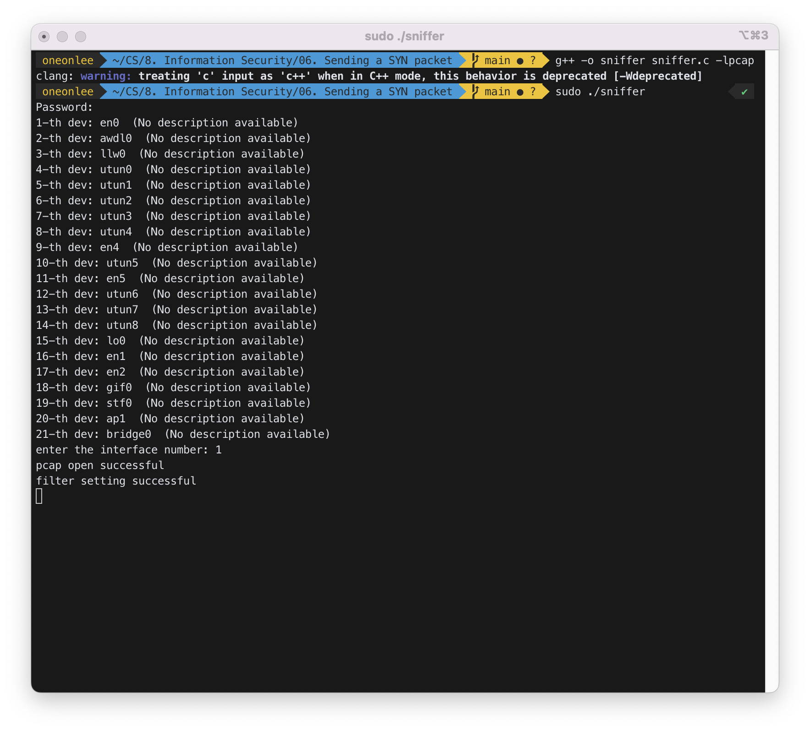
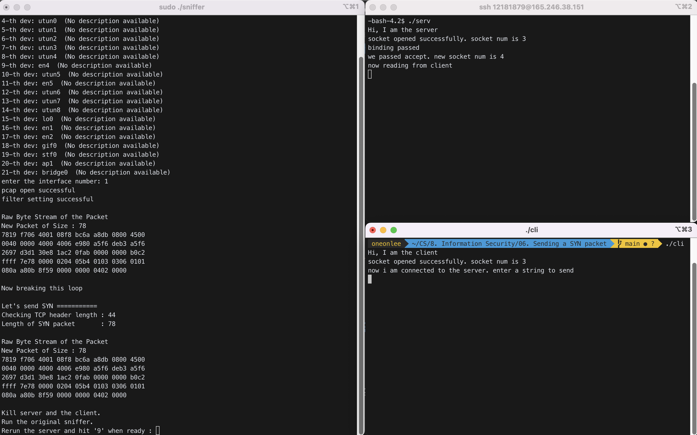
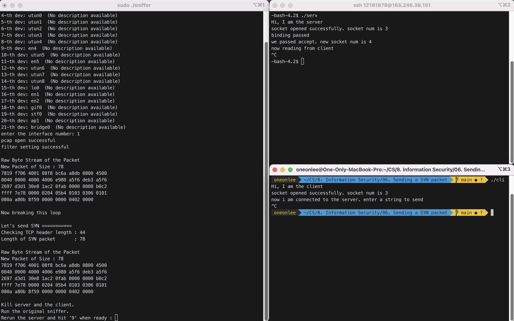
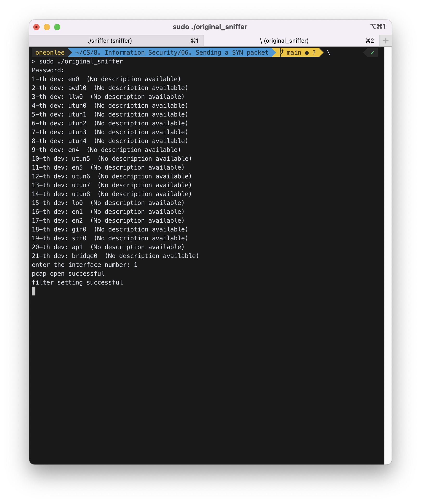
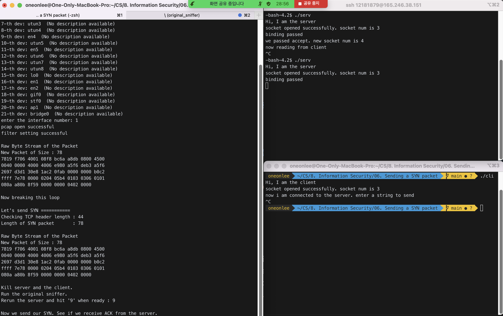
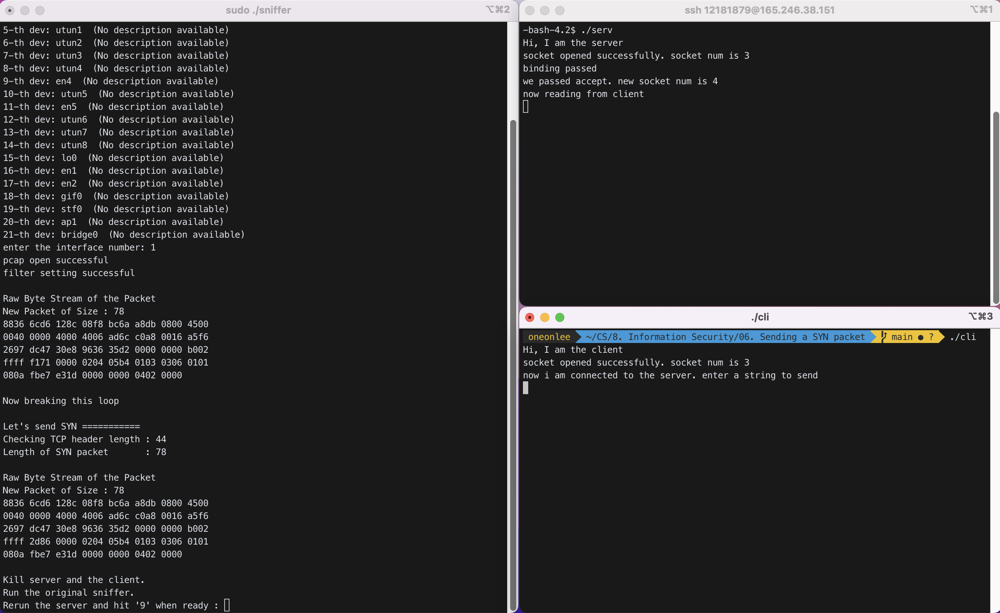
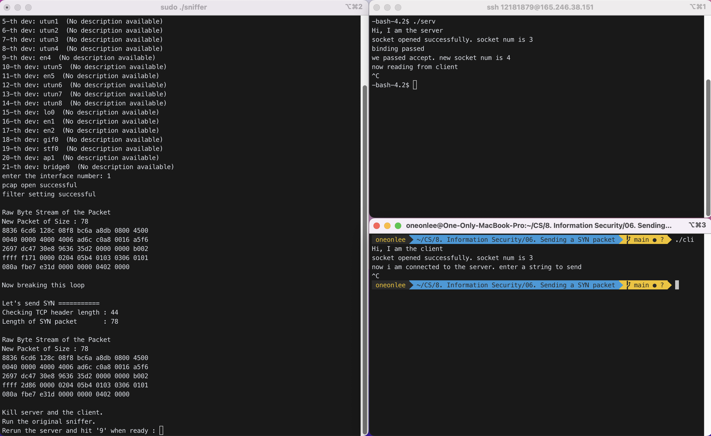
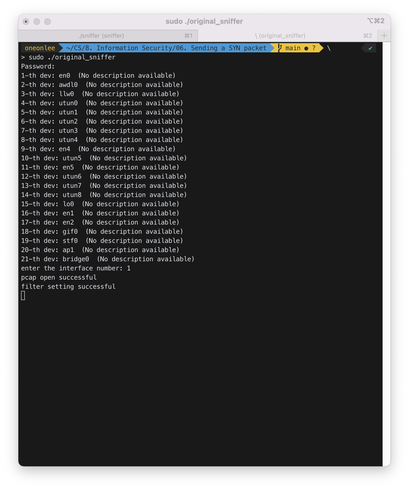
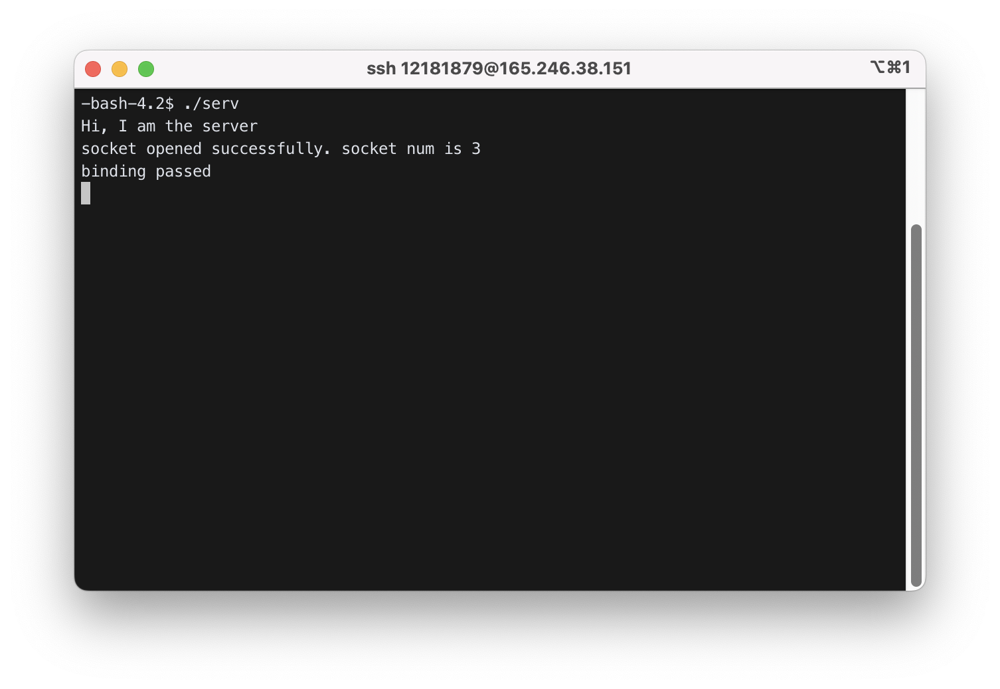

# Sending a SYN packet with `winpcap`

## 1. algorithm

```c
       ..............
       fp = pcap_open(..........);
       unsigned char  packet[65535];    // max packet size is 65535
       build_packet(packet);
       pcap_sendpacket(fp, packet, ......);
```

## 2. `build_packet()` : ethernet header, ip header, tcp header

### 1) Build ethernet header

- Define the structure for ethernet header.

  ```c
  struct ether_addr {
      unsigned char ether_addr_octet[6];
  };

  struct  ether_header {
      struct  ether_addr ether_dhost;
      struct  ether_addr ether_shost;
      unsigned short ether_type;          // 0x0800 for IP
  };

  struct  ether_header  *myeh;   // create a etherhead structure
  ```

- Now fill in `myeh`. First make `myeh` point to the start of the packet buffer.
  ```c
  myeh = (struct ether_header *)packet;
  ```
- And fill in the destination MAC address.
  ```c
  myeh->ether_dhost.ether_addr_octet[0]=dest_mac[0];
  myeh->ether_dhost.ether_addr_octet[1]=dest_mac[1];
  ..............
  myeh->ether_dhost.ether_addr_octet[5]=dest_mac[5];
  ```
- And the source MAC address.
  ```c
  myeh->ether_shost.ether_addr_octet[0]=src_mac[0];
  myeh->ether_shost.ether_addr_octet[1]=src_mac[1];
  ..............
  myeh->ether_shost.ether_addr_octet[5]=src_mac[5];
  ```
- MAC address of a network device is always 6 bytes. `src_mac` is the MAC for the PC. `dest_mac` is the MAC of the gateway computer. Get these addresses from captured packets.
- Finally fill in the ethernet header type.
  ```c
  myeh->ether_type = htons(0x0800);  // must be in network byte order
  ```

### 2) Build ip header

- Define the structure for the ip header.
  ```c
  struct ip_hdr {
      unsigned char ip_header_len:4;
      unsigned char ip_version:4;
      unsigned char ip_tos;
      unsigned short ip_total_length;
      unsigned short ip_id;
      unsigned char ip_frag_offset:5;
      unsigned char ip_more_fragment:1;
      unsigned char ip_dont_fragment:1;
      unsigned char ip_reserved_zero:1;
      unsigned char ip_frag_offset1;
      unsigned char ip_ttl;
      unsigned char ip_protocol;
      unsigned short ip_checksum;
      unsigned int ip_srcaddr;
      unsigned int ip_destaddr;
  };
  ```
- Make a variable for the ip header.
  ```c
  struct ip_hdr  *myih;
  ```
- Make it point to the proper location in packet buffer.
  ```c
  myih = (struct ip_hdr *)(packet + 14);
  ```
- Now fill in `myih`.
  ```c
  myih->ip_header_len=5;
  myih->ip_version = 4;
  .............
  myih->ip_checksum = 0;
  myih->ip_checksum = in_checksum((unsigned short *)myih, 20);
  ```
- `in_checksum` computes the checksum for the given bytes as follows:

  ```c
  unsigned short in_checksum(unsigned short *ptr,int nbytes) {
      register long sum;
      unsigned short oddbyte;
      register short answer;

      sum=0;
      while(nbytes>1) {
          sum+=*ptr++;
          nbytes-=2;
      }
      if(nbytes==1) {
          oddbyte=0;
          *((u_char*)&oddbyte)=*(u_char*)ptr;
          sum+=oddbyte;
      }

      sum = (sum>>16)+(sum & 0xffff);
      sum = sum + (sum>>16);
      answer=(SHORT)~sum;  // use “short” in MacOS

      return(answer);
  }
  ```

### 3) Build tcp header

- Define a structure for the tcp header:
  ```c
  struct tcp_hdr {
      unsigned short source_port;
      unsigned short dest_port;
      unsigned int sequence;
      unsigned int acknowledge;
      unsigned char ns:1;
      unsigned char reserved_part1:3;
      unsigned char data_offset:4;
      unsigned char fin:1;
      unsigned char syn:1;
      unsigned char rst:1;
      unsigned char psh:1;
      unsigned char ack:1;
      unsigned char urg:1;
      unsigned char ecn:1;
      unsigned char cwr:1;
      unsigned short window;
      unsigned short checksum;
      unsigned short urgent_pointer;
  };
  ```
- Define a variable to point to this structure.
  ```c
  struct tcp_hdr  *myth;
  ```
- Make it point to the proper location in the packet buffer.
  ```c
  myth = (struct tcp_hdr *)(packet + 14 + 20);
  ```
- Now fill in `myth`.
  ```c
  myth->source_port=htons(src_port);
  myth->dest_port=htons(dest_port);
  ...............
  myth->window=htons(0x4000);
  myth->checksum=0;
  myth->urgent_pointer=0;
  ```
- Checksum has to be computed properly. The ckecksum algorithm is applied to "pseudo header + tcp header + data".
- Computing psudo header

  ```c
  struct pseudo_header {
      unsigned int source_address;
      unsigned int dest_address;
      unsigned char placeholder;
      unsigned char protocol;
      unsigned short tcp_length;
  };

  struct pseudo_header psh;

  // to use inet_pton(), include "winsock2.h" and "ws2tcpip.h" in windows
  // in MacOS, include <arpa/inet.h>
  inet_pton(AF_INET, "211.110.41.36", &(psh.source_address)); // ip of your pc
  inet_pton(AF_INET, "165.246.38.151", &(psh.dest_address)); // dest ip
  psh.placeholder = 0;  // reserved
  psh.protocol = 6;  // protocol number for tcp
  psh.tcp_length = htons(tcp_header_len); // store multi byte number in network byte order
  ```

- Now build pseudo header + tcp header.
  ```c
  unsigned char *seudo;
  seudo = (unsigned char *)malloc(sizeof(struct pseudo_header)+tcp_header_len);
  memcpy(seudo, &psh, sizeof(struct pseudo_header));
  memcpy(seudo+sizeof(struct pseudo_header), myth, tcp_header_len);
  ```
- Compute the checksum.
  ```c
  myth->checksum=
  in_checksum((unsigned short *)seudo, sizeof(struct pseudo_header)+tcp_header_len);
  ```

## 3. Send the packet

```c
if (pcap_sendpacket(fp, packet, 14+20+tcp_header_len) != 0) {
   printf("err in packet send:%s\n",pcap_geterr(fp));
}
```

## 4. Exercise

### 1) Send a SYN packet to the server.

### 1-1)

- Modify your sniffer such that it can send a SYN packet instead of sniffing.
  - (1) break out of the while loop after capturing the first SYN packet.
  - (2) display the packet in raw bytes.
  - (3) kill the server and the client (manually)
  - (4) run the original sniffer
  - (5) rerun the server
  - (6) send the captured SYN packet to the server
  - (7) check if you can see this packet in the original sniffer
  - (8) check if you can see the ACK packet from the server.<br><br>
- If the captured SYN packet shows `checksum`=0, you need to disable "checksum offload" feature of your network interface:
  - press windows logo and x > device manager > network adapters > right mouse button on target adapter > properties > advanced > disable all "offload"s. Disabling checksum offload may slow down the network. Enable it after your finish the homework.
  - If above method is not working, just recompute the checksum as in [1-2)](#1-2). You may try packet injection tool such as Scapy (windows version).

#### STEP 1 : `sniffer.c`를 아래와 같이 수정하였다. 수정한 `sniffer.c`를 "\_\_gxx_personality_v0 error"를 방지하기 위해 `g++`로 `-lpcap` 옵션을 주어 컴파일하고, 실행 파일을 `sudo` 권한을 주어 실행한다.

저번 lecture에서 사용하였던 `sniffer.c`를 `original_sniffer.c`라고 하자.<br>
본 문제에서는 `original_sniffer.c`를 바탕으로 이 문제에서 요구하는 각 단계에 맞게 수정하였다.

`sniffer.c` :

```c
int main()
{
  ......

  while ((res = pcap_next_ex(fp, &header, &pkt_data)) >= 0) // 1 if success
	{
		if (res == 0) // 0 if time-out
		{
			continue;
		}

		print_raw_packet(pkt_data, header->caplen);
		// print_ether_header(pkt_data);
		// print_ip_header(pkt_data);
		// print_tcp_header(pkt_data);
		// print_data(pkt_data, header->caplen);

		// 1-1-1)
		printf("\nNow breaking this loop\n");
		break; // break out of the while loop after capturing the first SYN packet.
	}

	// 1-1-2)
	struct tcp_header *th = (struct tcp_header *)(pkt_data + 14 + 20);
	int tcp_length = th->data_offset * 4;
	// now we have syn packet in pkt_data
	printf("\nLet's send SYN ===========\n");
	printf("Checking TCP header length : %d\n", tcp_length);
	printf("Length of SYN packet       : %d\n", header->caplen); // header : struct pcap_pkthdr
	print_raw_packet(pkt_data, header->caplen);					 // display the packet in raw bytes.

	// 1-1-3) kill the server and the client (manually)
	printf("\nKill server and the client.\n");
	// 1-1-4) run the original sniffer
	printf("Run the original sniffer.\n");
	// 1-1-5) rerun the server
	printf("Rerun the server and hit '9' when ready : ");
	int x;
	scanf("%d", &x);

	if (x == 9)
	{
		// 1-1-6) send the captured SYN packet to the server
		printf("\nNow we send our SYN. See if we receive ACK from the server.\n");
		if (pcap_sendpacket(fp, pkt_data, 14 + 20 + tcp_length) != 0)
		{
			printf("err in packet send : %s\n", pcap_geterr(fp));
		}
	}

	return 0;
}
```

```bash
$ g++ -o sniffer sniffer.c -lpcap
$ sudo ./sniffer
```

interface number로 `1`을 입력하였다.



available한 dev를 확인할 수 있었다.

#### STEP 2 : server에 접속하여 `./serv`를 실행한 후, 로컬에서 client 실행 파일인 `./cli`를 실행한다.

<br>
위 화면에서 왼쪽 터미널은 `./sniffer`를 실행한 화면이다. 오른쪽 위 터미널은 server의 터미널이고, 오른쪽 아래 터미널이 client의 터미널이다.

```
Raw Byte Stream of the Packet
New Packet of Size : 78
7819 f706 4001 08f8 bc6a a8db 0800 4500
0040 0000 4000 4006 e980 a5f6 deb3 a5f6
2697 d3d1 30e8 1ac2 0fab 0000 0000 b0c2
ffff 7e78 0000 0204 05b4 0103 0306 0101
080a a80b 8f59 0000 0000 0402 0000

Now breaking this loop

Let's send SYN ===========
Checking TCP header length : 44
Length of SYN packet       : 78

Raw Byte Stream of the Packet
New Packet of Size : 78
7819 f706 4001 08f8 bc6a a8db 0800 4500
0040 0000 4000 4006 e980 a5f6 deb3 a5f6
2697 d3d1 30e8 1ac2 0fab 0000 0000 b0c2
ffff 7e78 0000 0204 05b4 0103 0306 0101
080a a80b 8f59 0000 0000 0402 0000

Kill server and the client.
Run the original sniffer.
Rerun the server and hit '9' when ready :
```

#### STEP 3 : `./serv`와 `./cli`를 `^C`로 수동으로 강제 종료한다.



#### STEP 4 : `./original_sniffer`를 실행한다.



#### STEP 5 : `./serv`를 재실행한다.

#### STEP 6 : `./sniffer`에 '9'를 입력하여, `./serv`에 captured SYN packet을 전송한다.



#### STEP 7 : `./original_sniffer`애서 packet을 확인한다.

아래 Packet의 MAC Address 부분과 IP Address 부분에서 `-`은 주소를 일부 가린 것이다.

```
Raw Byte Stream of the Packet
New Packet of Size : 78
7819 f706 4001 08f8 bc6a a8db 0800 4500
0040 0000 4000 4006 e980 a5f6 deb3 a5f6
2697 d3d1 30e8 1ac2 0fab 0000 0000 b0c2
ffff 7e78 0000 0204 05b4 0103 0306 0101
080a a80b 8f59 0000 0000 0402 0000

Printing Ethernet Header:
	Destination MAC Address: --19--06--01 // Server MAC
	Source MAC Address: 08--bc--a8-- // PC MAC
	Protocol Type: 0800

Printing IP Header:
	IP Version: 4
	IP Header Length: 5 bytes
	IP Type of Service: 0
	IP Total Length: 64
	IP Identification: 0
	IP Reserved Zero: 0
	IP Don't Fragment: 1
	IP More Fragment: 0
	IP Frag Offset: 00
	IP Frag Offset 1: 00
	IP TTL: 40
	IP Protocol: 06
	IP CheckSum: e980
	Source IP Address: --f6--b3 // Server IP
	Destination IP Address: a5--26-- // PC IP

Printing TCP Header: 	Source Port Number: 54225
	Destination Port Number: 12520
	Sequence Number: 448925611
	ACK Number: 0
	TCP Data Offset: b
	Reserved Part 1: 0
	TCP NS: 0
	FIN: 0
	SYN: 1
	RST: 0
	PSH: 0
	ACK: 0
	URG: 0
	ECN: 1
	CWR: 1
	Window: 65535
	TCP CheckSum: 7e78
	Urgent Pointer: 0000

Printing data of packet :
0204 05b4 0103 0306 0101 080a a80b 8f59
0000 0000 0402 0000

Raw Byte Stream of the Packet
New Packet of Size : 74
08f8 bc6a a8db 7819 f706 4001 0800 4500
003c 0000 4000 3f06 ea84 a5f6 2697 a5f6
deb3 30e8 d3d1 2c45 f93b 1ac2 0fac a052
3890 6152 0000 0204 05b4 0402 080a f0a8
dfde a80b 8f59 0103 0307

Printing Ethernet Header:
	Destination MAC Address: 08--bc--a8-- // PC MAC
	Source MAC Address: --19--06--01 // Server MAC
	Protocol Type: 0800

Printing IP Header:
	IP Version: 4
	IP Header Length: 5 bytes
	IP Type of Service: 0
	IP Total Length: 60
	IP Identification: 0
	IP Reserved Zero: 0
	IP Don't Fragment: 1
	IP More Fragment: 0
	IP Frag Offset: 00
	IP Frag Offset 1: 00
	IP TTL: 3f
	IP Protocol: 06
	IP CheckSum: ea84
	Source IP Address: a5--26-- // PC IP
	Destination IP Address: --f6--b3 // Server IP

Printing TCP Header: 	Source Port Number: 12520
	Destination Port Number: 54225
	Sequence Number: 742783291
	ACK Number: 448925612
	TCP Data Offset: a
	Reserved Part 1: 0
	TCP NS: 0
	FIN: 0
	SYN: 1
	RST: 0
	PSH: 0
	ACK: 1
	URG: 0
	ECN: 1
	CWR: 0
	Window: 14480
	TCP CheckSum: 6152
	Urgent Pointer: 0000

Printing data of packet :
0204 05b4 0402 080a f0a8 dfde a80b 8f59
0103 0307

Raw Byte Stream of the Packet
New Packet of Size : 54
7819 f706 4001 08f8 bc6a a8db 0800 4500
0028 0000 4000 4006 e998 a5f6 deb3 a5f6
2697 d3d1 30e8 1ac2 0fac 0000 0000 5004
0000 2f81 0000

Printing Ethernet Header:
	Destination MAC Address: --19--06--01 // Server MAC
	Source MAC Address: 08--bc--a8-- // PC MAC
	Protocol Type: 0800

Printing IP Header:
	IP Version: 4
	IP Header Length: 5 bytes
	IP Type of Service: 0
	IP Total Length: 40
	IP Identification: 0
	IP Reserved Zero: 0
	IP Don't Fragment: 1
	IP More Fragment: 0
	IP Frag Offset: 00
	IP Frag Offset 1: 00
	IP TTL: 40
	IP Protocol: 06
	IP CheckSum: e998
	Source IP Address: --f6--b3 // Server IP
	Destination IP Address: a5--26-- // PC IP

Printing TCP Header: 	Source Port Number: 54225
	Destination Port Number: 12520
	Sequence Number: 448925612
	ACK Number: 0
	TCP Data Offset: 5
	Reserved Part 1: 0
	TCP NS: 0
	FIN: 0
	SYN: 0
	RST: 1
	PSH: 0
	ACK: 0
	URG: 0
	ECN: 0
	CWR: 0
	Window: 0
	TCP CheckSum: 2f81
	Urgent Pointer: 0000
```

#### STEP 8 : check if you can see the ACK packet from the server.

##### Packet 1

```
Printing TCP Header: 	Source Port Number: 54225
  ......
	TCP NS: 0
	FIN: 0
	SYN: 1
	RST: 0
	PSH: 0
	ACK: 0
	URG: 0
	ECN: 1
	CWR: 1
	Window: 65535
	TCP CheckSum: 7e78
	Urgent Pointer: 0000
```

처음 Packet에서 서버는 SYN 패킷 만을 보냈다.

##### Packet 2

```
Printing TCP Header: 	Source Port Number: 12520
  ......
	TCP NS: 0
	FIN: 0
	SYN: 1
	RST: 0
	PSH: 0
	ACK: 1
	URG: 0
	ECN: 1
	CWR: 0
	Window: 14480
	TCP CheckSum: 6152
	Urgent Pointer: 0000
```

두번째 Packet에서 서버는 SYN/ACK 패킷을 PC로 보냈다. 그러나 PC에서 응답이 없기 때문에 그 후로도 패킷을 계속해서 보낸다.

### 1-2) Modify the sniffer further such that it re-computes ip and tcp checksum.

- (1) break out of the while loop after capturing the first SYN packet.
- (2) copy them into another buffer: pkt_data=>packet
- (3) set `ip_check_sum` and `tcp_check_sum` to zero
- (4) recompute `ip_check_sum`
- (5) recompute `tcp_check_sum`
- (6) display the packet in raw bytes. this should be same as `pkt_data`
- (7) kill the server and the client (manually)
- (8) run the original sniffer
- (9) rerun the server
- (10) send packet to the server
- (11) check if you can see this packet in the original sniffer
- (12) check if you can see the ACK packet from the server.<br><br>
- If you have "fatal bad memory block" error, just ignore it. It is caused by some bug in `win10pcap`, but the packet is still sent ok.
  - Or you can install `Npcap` instead of `win10pcap`, which is more stable.

#### STEP 1 : `sniffer.c`를 아래와 같이 수정하였다. 수정한 `sniffer.c`를 "\_\_gxx_personality_v0 error"를 방지하기 위해 `g++`로 `-lpcap` 옵션을 주어 컴파일하고, 실행 파일을 `sudo` 권한을 주어 실행한다.

저번 lecture에서 사용하였던 `sniffer.c`를 `original_sniffer.c`라고 하자.<br>
본 문제에서는 `original_sniffer.c`를 바탕으로 이 문제에서 요구하는 각 단계에 맞게 수정하였다.

`sniffer.c` :

```c
#include <stdio.h>
#include <stdlib.h>
#include <pcap.h>
#include <string.h>
#include <arpa/inet.h>

#define IP_OF_YOUR_PC "165.---.222.---"
#define IP_OF_DEST "165.246.38.151"

......

// 1-2)
unsigned short in_checksum(unsigned short *ptr, int nbytes)
{
	register long sum;
	unsigned short oddbyte;
	register short answer;

	sum = 0;
	while (nbytes > 1)
	{
		sum += *ptr++;
		nbytes -= 2;
	}
	if (nbytes == 1)
	{
		oddbyte = 0;
		*((u_char *)&oddbyte) = *(u_char *)ptr;
		sum += oddbyte;
	}

	sum = (sum >> 16) + (sum & 0xffff);
	sum = sum + (sum >> 16);
	answer = (short)~sum; // use “short” in MacOS instead of “SHORT”

	return (answer);
}

int main()
{
  ......
  while ((res = pcap_next_ex(fp, &header, &pkt_data)) >= 0) // 1 if success
	{
		if (res == 0) // 0 if time-out
		{
			continue;
		}

		print_raw_packet(pkt_data, header->caplen);
		// print_ether_header(pkt_data);
		// print_ip_header(pkt_data);
		// print_tcp_header(pkt_data);
		// print_data(pkt_data, header->caplen);

		// 1-1-1), 1-2-1)
		printf("\nNow breaking this loop\n");
		break; // 1-1-1), 1-2-1) break out of the while loop after capturing the first SYN packet.
	}

	// 1-2-2) copy them into another buffer: pkt_data=>packet
	const unsigned char *packet = (unsigned char *)malloc(65535);
	packet = pkt_data;

	// 1-2-3)
	struct ip_header *ih = (struct ip_header *)(pkt_data + 14);
	struct tcp_header *th = (struct tcp_header *)(pkt_data + 14 + 20);
	// 1-2-3) set ip_check_sum and tcp_check_sum to zero
	ih->ip_checksum = 0;
	th->checksum = 0;

	// 1-2-4), 1-2-5)
	int tcp_length = th->data_offset * 4;

	struct pseudo_header psh;
	// to use inet_pton(), include "winsock2.h" and "ws2tcpip.h" in windows
	// in MacOS, include <arpa/inet.h>
	inet_pton(AF_INET, IP_OF_YOUR_PC, &(psh.source_address)); // ip of your pc
	inet_pton(AF_INET, IP_OF_DEST, &(psh.dest_address));	  // dest ip
	psh.placeholder = 0;									  // reserved
	psh.protocol = 6;										  // protocol number for tcp
	psh.tcp_length = htons(tcp_length);						  // store multi byte number in network byte order

	unsigned char *seudo;
	seudo = (unsigned char *)malloc(sizeof(struct pseudo_header) + tcp_length);
	memcpy(seudo, &psh, sizeof(struct pseudo_header));
	memcpy(seudo + sizeof(struct pseudo_header), th, tcp_length);

	// 1-2-4), 1-2-5) recompute ip_check_sum and tcp_check_sum
	ih->ip_checksum = in_checksum((unsigned short *)ih, 20);
	th->checksum = in_checksum((unsigned short *)seudo, sizeof(struct pseudo_header) + tcp_length);

	// 1-1-2) now we have syn packet in pkt_data
	printf("\nLet's send SYN ===========\n");
	printf("Checking TCP header length : %d\n", tcp_length);
	printf("Length of SYN packet       : %d\n", header->caplen); // header : struct pcap_pkthdr
	print_raw_packet(pkt_data, header->caplen);					 // 1-2-6) display the packet in raw bytes.
																 // this should be same as pkt_data

	// 1-1-3), 1-2-7) kill the server and the client (manually)
	printf("\nKill server and the client.\n");
	// 1-1-4), 1-2-8) run the original sniffer
	printf("Run the original sniffer.\n");
	// 1-1-5), 1-2-9) rerun the server
	printf("Rerun the server and hit '9' when ready : ");
	int x;
	scanf("%d", &x);

	if (x == 9)
	{
		// 1-1-6), 1-2-10) send the captured SYN packet to the server
		printf("\nNow we send our SYN. See if we receive ACK from the server.\n");
		if (pcap_sendpacket(fp, pkt_data, 14 + 20 + tcp_length) != 0)
		{
			printf("err in packet send : %s\n", pcap_geterr(fp));
		}
	}

	return 0;
}
```

```bash
$ g++ -o sniffer sniffer.c -lpcap
$ sudo ./sniffer
```

interface number로 `1`을 입력하였다.


available한 dev를 확인할 수 있었다.

#### STEP 2 : server에 접속하여 `./serv`를 실행한 후, 로컬에서 client 실행 파일인 `./cli`를 실행한다.

<br>
위 화면에서 왼쪽 터미널은 `./sniffer`를 실행한 화면이다. 오른쪽 위 터미널은 server의 터미널이고, 오른쪽 아래 터미널이 client의 터미널이다.

```
Raw Byte Stream of the Packet
New Packet of Size : 78
8836 6cd6 128c 08f8 bc6a a8db 0800 4500
0040 0000 4000 4006 ad6c c0a8 0016 a5f6
2697 dc47 30e8 9636 35d2 0000 0000 b002
ffff f171 0000 0204 05b4 0103 0306 0101
080a fbe7 e31d 0000 0000 0402 0000

Now breaking this loop

Let's send SYN ===========
Checking TCP header length : 44
Length of SYN packet       : 78

Raw Byte Stream of the Packet
New Packet of Size : 78
8836 6cd6 128c 08f8 bc6a a8db 0800 4500
0040 0000 4000 4006 ad6c c0a8 0016 a5f6
2697 dc47 30e8 9636 35d2 0000 0000 b002
ffff 2d86 0000 0204 05b4 0103 0306 0101
080a fbe7 e31d 0000 0000 0402 0000

Kill server and the client.
Run the original sniffer.
Rerun the server and hit '9' when ready :
```

#### STEP 3 : `./serv`와 `./cli`를 `^C`로 수동으로 강제 종료한다.



#### STEP 4 : `./original_sniffer`를 실행한다.

```bash
$ sudo ./original_sniffer
```



#### STEP 5 : `./serv`를 재실행한다.



#### STEP 6 : `./sniffer`에 '9'를 입력하여, `./serv`에 captured SYN packet을 전송한다.


#### STEP 7 : `./original_sniffer`애서 packet을 확인한다.

아래 Packet의 MAC Address 부분과 IP Address 부분에서 `-`은 주소를 일부 가린 것이다.

```
Raw Byte Stream of the Packet
New Packet of Size : 78
8836 6cd6 128c 08f8 bc6a a8db 0800 4500
0040 0000 4000 4006 ad6c c0a8 0016 a5f6
2697 dc47 30e8 9636 35d2 0000 0000 b002
ffff 2d86 0000 0204 05b4 0103 0306 0101
080a fbe7 e31d 0000 0000 0402 0000

Printing Ethernet Header:
	Destination MAC Address: --36--d6--8c // Server MAC
	Source MAC Address: 08--bc--a8-- // PC MAC
	Protocol Type: 0800

Printing IP Header:
	IP Version: 4
	IP Header Length: 5 bytes
	IP Type of Service: 0
	IP Total Length: 64
	IP Identification: 0
	IP Reserved Zero: 0
	IP Don't Fragment: 1
	IP More Fragment: 0
	IP Frag Offset: 00
	IP Frag Offset 1: 00
	IP TTL: 40
	IP Protocol: 06
	IP CheckSum: ad6c
	Source IP Address: --a8--16 // Server IP
	Destination IP Address: a5--26-- // PC IP

Printing TCP Header: 	Source Port Number: 56391
	Destination Port Number: 12520
	Sequence Number: -1774832174
	ACK Number: 0
	TCP Data Offset: b
	Reserved Part 1: 0
	TCP NS: 0
	FIN: 0
	SYN: 1
	RST: 0
	PSH: 0
	ACK: 0
	URG: 0
	ECN: 0
	CWR: 0
	Window: 65535
	TCP CheckSum: 2d86
	Urgent Pointer: 0000

Printing data of packet :
0204 05b4 0103 0306 0101 080a fbe7 e31d
0000 0000 0402 0000
```

#### STEP 8 : check if you can see the ACK packet from the server.

```
Printing TCP Header: 	Source Port Number: 56391
	......
	TCP NS: 0
	FIN: 0
	SYN: 1
	RST: 0
	PSH: 0
	ACK: 0
	URG: 0
	ECN: 0
	CWR: 0
	Window: 65535
	TCP CheckSum: 2d86
	Urgent Pointer: 0000
```

### 2) Implement a stealth scanner.

- Modify the packet sender such that it sends a SYN packet to all possible ports in the server.
- Detect which ports are live by finding out those who respond with SYN/ACK.
- You may need separate sniffer for such detection.
- Detect live ports in 165.246.38.136 server also.
