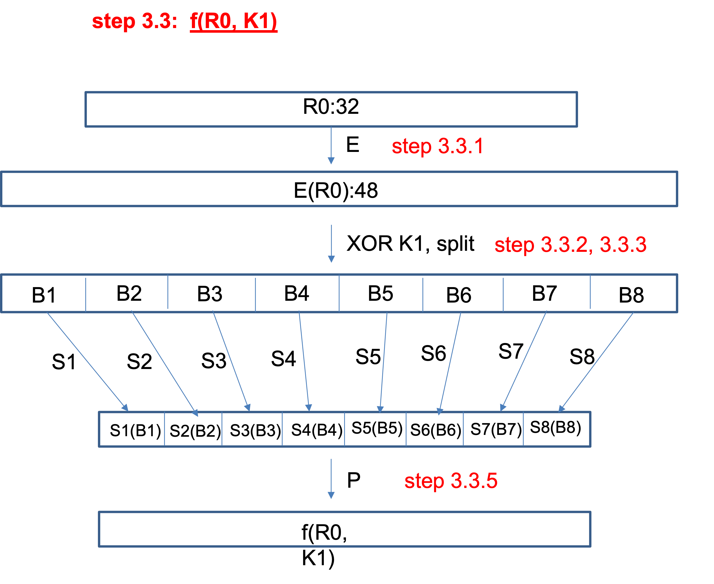
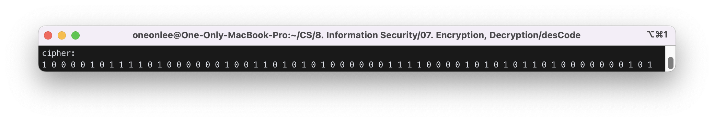
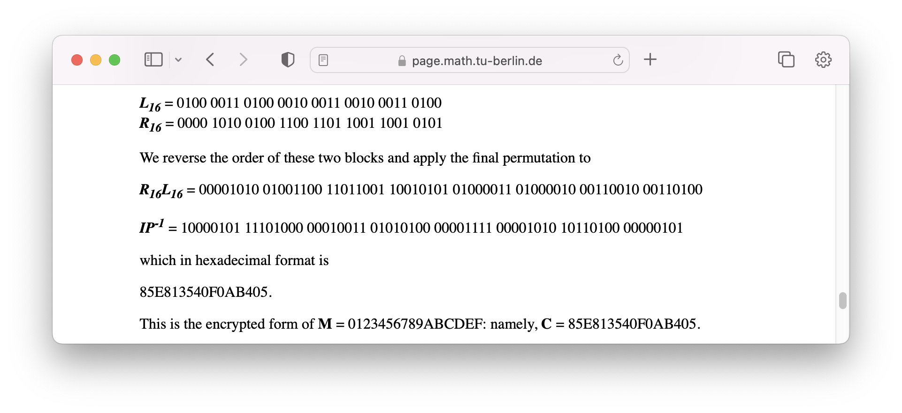

# Encryption, Decryption

Basic concepts, symmetric-key algorithm, public-key algorithm, security protocol

## 1. Basic concepts

### 1) symbols

- p: plain text (p1, p2, ..., pn) // before encryption
- c: cipher text (c1, c2, ..., cm) // after encryption
- enc: encryption algorithm
- dec: decryption algorithm
- e: encryption key
- d: decryption key
  - c = enc(p, e) // encryption. e is an encryption key
  - p = dec(c, d) // decryption. d is a decryption key

### 2) basic encryption technique

substitution, transposition

#### ex0) shift cipher (Caesar's cipher)

- plain: a b c d .... x y z
- cipher: d e f g ... a b c
  - shift amount = 3.
  - Encryption key is the shift amount.
  - Key space size = 25

#### ex1) substitution

- plain: a b c d .......z
- cipher: d f e r .......k
  - Encryption key is the cipher line.
    Key space size = 26! (> 4\*10^26)

#### frequency attack

- Brute force attack for ex1 is virtually impossible even if we know the encryption algorithm because of the large key space, but frequency attack is possible. Each letter has a known frequency in English sentences.
  - 'a': 8.167%, 'b':1.492%, 'e':12.702%, 't': 9.056%, ...
- We can match a cipher letter which has 8.1667% frequency to 'a', etc.

## 2. Symmetric-key algorithm

- In symmetric-key algorithm, encryption key is equal to or closely related to the decryption key.
- Closely related means the other key can be easily computed from one of the keys.
  - DES, AES, Blowfish, RC4, IDEA, ....

## 3. DES(Data Encryption Standard)

### 1) Algorithm

[construct key schedule](#2-construct-key-schedule-key-list) & [encrypt](#3-encryption)

- (0) Select a 64-bit key. Derive 16 48-bit sub-keys from it: K[1], K[2], …, K[16]
- (1) Divide plain text into 64-bit blocks
- (2) For each 64-bit block, T
  - T0 = IP(T)
  - T1 = E(T0)
  - T2 = E(T1)
  - ...............
  - T16 = E(T15)
  - T16' = R16L16 -- reverse left half and right half
  - T17 = FP(T16')
    - T17 is the encrypted one for plain text T.
- (3) IP is the initial permutation and FP is the final permutation.
- (4) T[j] = E(T[j-1])
  - a) divide T[j-1] into L[j-1], the left half, and R[j-1], the right half
  - b) L[j]=R[j-1]
  - c) R[j]=L[j-1] xor f(R[j-1], K[j])
    - where f is expand R[j-1] to 48 bits using "expansion permutation"
    - R[j-1] xor K[j]
      - divide the result into 6-bit block (we will have 8 blocks)
      - perform s-box substitution for each block.
        each block becomes 4 bit after subtituion
      - permute the resulting 32 bit
- (5) decrytion process is same as above encryption process ((1) to (4)) except in Step 4 the keys are applied in backward (K[16], K[15], ..., K[1]).

ref: "The DES Algorithm Illustrated" :<br>
http://page.math.tu-berlin.de/~kant/teaching/hess/krypto-ws2006/des.htm

### 2) Construct key schedule (key list)

DES key is a 64 bit number. We construct a key schedule (key list) (16 sub-keys each being a 48 bit number) from it.

```
64 bit K ==> 56 bit K+ ==> C0 D0 ==> C1 D1, C2 D2, ..., C16 D16 ==> K1, K2, ..., K16
         PC-1         split      ROL                            PC⁻²
```

```
K = 133457799BBCDFF1
  = 00010011 00110100 01010111 01111001 10011011 10111100 11011111 11110001
    1        9        17       25       33       41       49       57
```

### step 2.1) Permute with PC-1 (bit extractor matrix) to get K-Plus

```
PC-1 (bit extractor matrix) =
57   49    41   33    25    17    9
 1   58    50   42    34    26   18
10    2    59   51    43    35   27
19   11     3   60    52    44   36
63   55    47   39    31    23   15
 7   62    54   46    38    30   22
14    6    61   53    45    37   29
21   13     5   28    20    12    4
```

```
K-Plus = 1111000 0110011 0010101 0101111 0101010 1011001 1001111 0001111
```

### step 2.2) Split into C0(left half) and D0(right half)

```
C0 = 1111000 0110011 0010101 0101111
D0 = 0101010 1011001 1001111 0001111
```

### step 2.3) Compute Cn, Dn (n=1,2,...,16) by doing "rotate left" for C(n-1), D(n-1) once or twice depending on following schedule (key list)

| Iteration Number | Number of Left Shifts |
| ---------------- | --------------------- |
| 1                | 1                     |
| 2                | 1                     |
| 3                | 2                     |
| 4                | 2                     |
| 5                | 2                     |
| 6                | 2                     |
| 7                | 2                     |
| 8                | 2                     |
| 9                | 1                     |
| 10               | 2                     |
| 11               | 2                     |
| 12               | 2                     |
| 13               | 2                     |
| 14               | 2                     |
| 15               | 2                     |
| 16               | 1                     |

Now Cn, Dn is

```
C0 = 1111000011001100101010101111
D0 = 0101010101100110011110001111
C1 = 1110000110011001010101011111
D1 = 1010101011001100111100011110
C2 = 1100001100110010101010111111
D2 = 0101010110011001111000111101
C3 = 0000110011001010101011111111
D3 = 0101011001100111100011110101
C4 = 0011001100101010101111111100
D4 = 0101100110011110001111010101
C5 = 1100110010101010111111110000
D5 = 0110011001111000111101010101
C6 = 0011001010101011111111000011
D6 = 1001100111100011110101010101
C7 = 1100101010101111111100001100
D7 = 0110011110001111010101010110
C8 = 0010101010111111110000110011
D8 = 1001111000111101010101011001
C9 = 0101010101111111100001100110
D9 = 0011110001111010101010110011
C10 = 0101010111111110000110011001
D10 = 1111000111101010101011001100
C11 = 0101011111111000011001100101
D11 = 1100011110101010101100110011
C12 = 0101111111100001100110010101
D12 = 0001111010101010110011001111
C13 = 0111111110000110011001010101
D13 = 0111101010101011001100111100
C14 = 1111111000011001100101010101
D14 = 1110101010101100110011110001
C15 = 1111100001100110010101010111
D15 = 1010101010110011001111000111
C16 = 1111000011001100101010101111
D16 = 0101010101100110011110001111
```

### step 2.4) Compute Kn by applying PC⁻² to CnDn

```
PC⁻² =
14    17   11    24     1    5
3    28   15     6    21   10
23    19   12     4    26    8
16     7   27    20    13    2
41    52   31    37    47   55
30    40   51    45    33   48
44    49   39    56    34   53
46    42   50    36    29   32
```

#### example)

```
C1 = 1110000110011001010101011111
D1 = 1010101011001100111100011110
C1D1 = 11100001 10011001 01010101 11111010 10101100 11001111 00011110
       1        9        17       25       33       41       49
```

```bash
K1 = 000110 110000 001011 101111 111111 000111 000001 110010
# For the other keys we have
K2 = 011110 011010 111011 011001 110110 111100 100111 100101
K3 = 010101 011111 110010 001010 010000 101100 111110 011001
K4 = 011100 101010 110111 010110 110110 110011 010100 011101
K5 = 011111 001110 110000 000111 111010 110101 001110 101000
K6 = 011000 111010 010100 111110 010100 000111 101100 101111
K7 = 111011 001000 010010 110111 111101 100001 100010 111100
K8 = 111101 111000 101000 111010 110000 010011 101111 111011
K9 = 111000 001101 101111 101011 111011 011110 011110 000001
K10 = 101100 011111 001101 000111 101110 100100 011001 001111
K11 = 001000 010101 111111 010011 110111 101101 001110 000110
K12 = 011101 010111 000111 110101 100101 000110 011111 101001
K13 = 100101 111100 010111 010001 111110 101011 101001 000001
K14 = 010111 110100 001110 110111 111100 101110 011100 111010
K15 = 101111 111001 000110 001101 001111 010011 111100 001010
K16 = 110010 110011 110110 001011 000011 100001 011111 110101
```

### 3) Encryption

Divide the plain text into a sequence of 64-bit blocks and apply DES to each block.

```
M = 0123456789ABCDEF
  = 0000 0001 0010 0011 0100 0101 0110 0111 1000 1001 1010 1011 1100 1101 1110 1111
```



#### step 3.1) Initial permutation with IP

```
IP=
            58    50   42    34    26   18    10    2
            60    52   44    36    28   20    12    4
            62    54   46    38    30   22    14    6
            64    56   48    40    32   24    16    8
            57    49   41    33    25   17     9    1
            59    51   43    35    27   19    11    3
            61    53   45    37    29   21    13    5
            63    55   47    39    31   23    15    7
```

```
M⁺ = 1100 1100 0000 0000 1100 1100 1111 1111 1111 0000 1010 1010 1111 0000 1010 1010
```

#### step 3.2) Split into L0(left half) and R0(right half)

```
L0 = 1100 1100 0000 0000 1100 1100 1111 1111
R0 = 1111 0000 1010 1010 1111 0000 1010 1010
```

#### step 3.3) Compute Ln and Rn from L(n-1) and R(n-1) as follows

```
Ln=R(n-1)
Rn=L(n-1) xor f(R(n-1), Kn)
```

##### example:

for n=1,

```
K1=000110 110000 001011 101111 111111 000111 000001 110010
L1=R0=1111 0000 1010 1010 1111 0000 1010 1010
R1=L0 xor f(R0, K1)
```

function f:

```
R0 ==> E(R0) ==> E(R0) xor K1 ==> B1 B2 B3 B4 B5 B6 B7 B8
==>SB = S1(B1) S2(B2) S3(B3) S4(B4) S5(B5) S6(B6) S7(B7) S8(B8)
==> P(SB)
```

#### step 3.3.1)

Evaluate E(R0) from below E BIT-SELECTION TABLE

```
    E BIT-SELECTION TABLE

32     1    2     3     4    5
 4     5    6     7     8    9
 8     9   10    11    12   13
12    13   14    15    16   17
16    17   18    19    20   21
20    21   22    23    24   25
24    25   26    27    28   29
28    29   30    31    32    1
```

```
R0 =
1111 0000 1010 1010 1111 0000 1010 1010
   1    5    9   13   17   21   25   29
E(R0) = 011110 100001 010101 010101 011110 100001 010101 010101
K1 = 000110 110000 001011 101111 111111 000111 000001 110010
E(R0) = 011110 100001 010101 010101 011110 100001 010101 010101
```

#### step 3.3.2), step 3.3.3)

```
K1 xor E(R0) = 011000 010001 011110 111010 100001 100110 010100 100111
                 B1     B2     B3     B4     B5     B6     B7     B8
```

#### step 3.3.4)

Evaluate S1(B1) from below S1 Table

```
                             S1
Row                     Column Number
No.    0   1   2   3   4   5   6   7   8   9  10  11  12  13  14  15

  0   14   4  13   1   2  15  11   8   3  10   6  12   5   9   0   7
  1    0  15   7   4  14   2  13   1  10   6  12  11   9   5   3   8
  2    4   1  14   8  13   6   2  11  15  12   9   7   3  10   5   0
  3   15  12   8   2   4   9   1   7   5  11   3  14  10   0   6  13
```

```
S1(B1) = S1(011000)=S1[00][1100]=S1[0][12] = 5=0101
S2(B2) = S2(010001)=S2[1][8] = 12=1100
S3(B3) = S3(011110)=S3[0][15] = 8=1000
........

SB = 0101 1100 1000 0010 1011 0101 1001 0111
```

```
                             S1

     14  4  13  1   2 15  11  8   3 10   6 12   5  9   0  7
      0 15   7  4  14  2  13  1  10  6  12 11   9  5   3  8
      4  1  14  8  13  6   2 11  15 12   9  7   3 10   5  0
     15 12   8  2   4  9   1  7   5 11   3 14  10  0   6 13

                             S2

     15  1   8 14   6 11   3  4   9  7   2 13  12  0   5 10
      3 13   4  7  15  2   8 14  12  0   1 10   6  9  11  5
      0 14   7 11  10  4  13  1   5  8  12  6   9  3   2 15
     13  8  10  1   3 15   4  2  11  6   7 12   0  5  14  9

                             S3

     10  0   9 14   6  3  15  5   1 13  12  7  11  4   2  8
     13  7   0  9   3  4   6 10   2  8   5 14  12 11  15  1
     13  6   4  9   8 15   3  0  11  1   2 12   5 10  14  7
      1 10  13  0   6  9   8  7   4 15  14  3  11  5   2 12

                             S4

      7 13  14  3   0  6   9 10   1  2   8  5  11 12   4 15
     13  8  11  5   6 15   0  3   4  7   2 12   1 10  14  9
     10  6   9  0  12 11   7 13  15  1   3 14   5  2   8  4
      3 15   0  6  10  1  13  8   9  4   5 11  12  7   2 14

                             S5

      2 12   4  1   7 10  11  6   8  5   3 15  13  0  14  9
     14 11   2 12   4  7  13  1   5  0  15 10   3  9   8  6
      4  2   1 11  10 13   7  8  15  9  12  5   6  3   0 14
     11  8  12  7   1 14   2 13   6 15   0  9  10  4   5  3

                             S6

     12  1  10 15   9  2   6  8   0 13   3  4  14  7   5 11
     10 15   4  2   7 12   9  5   6  1  13 14   0 11   3  8
      9 14  15  5   2  8  12  3   7  0   4 10   1 13  11  6
      4  3   2 12   9  5  15 10  11 14   1  7   6  0   8 13

                             S7

      4 11   2 14  15  0   8 13   3 12   9  7   5 10   6  1
     13  0  11  7   4  9   1 10  14  3   5 12   2 15   8  6
      1  4  11 13  12  3   7 14  10 15   6  8   0  5   9  2
      6 11  13  8   1  4  10  7   9  5   0 15  14  2   3 12

                             S8

     13  2   8  4   6 15  11  1  10  9   3 14   5  0  12  7
      1 15  13  8  10  3   7  4  12  5   6 11   0 14   9  2
      7 11   4  1   9 12  14  2   0  6  10 13  15  3   5  8
      2  1  14  7   4 10   8 13  15 12   9  0   3  5   6 11
```

#### step 3.3.5)

```
f = P(SB)=P(0101 1100 1000 0010 1011 0101 1001 0111)
            1    5    9    13   17   21   25   29
```

```
                                P
                         16   7  20  21
                         29  12  28  17
                          1  15  23  26
                          5  18  31  10
                          2   8  24  14
                         32  27   3   9
                         19  13  30   6
                         22  11   4  25
```

```
f=0010 0011 0100 1010 1010 1001 1011 1011
```

```
R1 = L0 + f(R0 , K1 )
= 1100 1100 0000 0000 1100 1100 1111 1111
+ 0010 0011 0100 1010 1010 1001 1011 1011
= 1110 1111 0100 1010 0110 0101 0100 0100
.................
L16 = 0100 0011 0100 0010 0011 0010 0011 0100
R16 = 0000 1010 0100 1100 1101 1001 1001 0101
```

#### step 3.4) Reverse L16 and R16 and apply the final permutation

```
R16L16=
00001010 01001100 11011001 10010101 01000011 01000010 00110010 00110100
```

```
                               IP⁻¹

            40     8   48    16    56   24    64   32
            39     7   47    15    55   23    63   31
            38     6   46    14    54   22    62   30
            37     5   45    13    53   21    61   29
            36     4   44    12    52   20    60   28
            35     3   43    11    51   19    59   27
            34     2   42    10    50   18    58   26
            33     1   41     9    49   17    57   25
```

```
IP⁻¹(R16L16) =
10000101 11101000 00010011 01010100 00001111 00001010 10110100 00000101
= 85E813540F0AB405
```

## 4. Exercise

### 1) Implement Caesar's cipher system. Write a program that breaks this system.

### 2) Implement DES

You can use des-CodeTemplate and fill out empty functions to complete it. This code template follows the example and you can check the output at each step with the output result in this file.

ref: "The DES Algorithm Illustrated" :<br>
http://page.math.tu-berlin.de/~kant/teaching/hess/krypto-ws2006/des.htm

des-CodeTemplate에는 여러 개의 `.cpp` 파일과 `.h` 파일이 있다.

`g++`을 사용해 컴파일 할 경우, 아래 명령어로 컴파일을 하고, 결과파일을 실행할 수 있다.

```bash
$ g++ table.cpp util.cpp enc.cpp f-func.cpp keysched.cpp main.cpp -o DES
$ ./DES
```

#### Step 2.2

`KPlus`(56bits)를 `C0`(좌, 28bits)와 `D0`(우, 28bits)로 나눈다.

`keyched.cpp` :

```cpp
void split_KPlus(char KPlus[], char C0[], char D0[])
{
   // split kplus into c0 and d0
   // ......code........
   for (int i = 0; i < 28; i++)
   {
      C0[i] = KPlus[i];
      D0[i] = KPlus[i + 28];
   }

   printf("after split KPlust\n");
   show_CD(C0, D0);
}
```

#### Step 2.3

ROL table의 횟수만큼 `C[]`와 `D[]`를 왼쪽으로 shift하는 함수 `comp_Ci_Di`를 구현한다.

`keyched.cpp` :

```cpp
void comp_Ci_Di(char C[17][28], char D[17][28], int i, int ROL[])
{
   // compute C[i], D[i] from C[i-1], D[i-1] using ROL[i]
   // ........... code ...........
   rotate_left_and_store(C[i - 1], 28, ROL[i], C[i]);
   rotate_left_and_store(D[i - 1], 28, ROL[i], D[i]);
}
```

#### Step 2.4

`keys`의 0번째 값은 출력하지 않도록 변경한다.

`keyched.cpp` :

```cpp
void comp_keys(char C[17][28], char D[17][28], int PC_2[8][6], char keys[17][48])
{
   char CD[56];
   for (int i = 1; i <= 16; i++)
   {
      combine_arr(C[i], D[i], CD, 28);
      permute_8_6(PC_2, CD, keys[i]);
   }
   printf("displaying keys\n");
   for (int i = 1; i <= 16; i++)
   // for (int i = 0; i < 17; i++)
   {
      printf("K%d=", i);
      show_arr(keys[i], 48);
   }
}
```

#### Step 3.2

`MPlus`(64bits)를 `L0`(좌, 32bits)와 `R0`(우, 32bits)로 나눈다.

`enc.cpp` :

```cpp
void split_into_L0R0(char MPlus[], char L[], char R[], int len)
{
   int i;

   // ........... code ...........
   for (i = 0; i < len; i++)
   {
      L[i] = MPlus[i];
      R[i] = MPlus[i + len];
   }

   printf("after split into L0R0.\n");
   show_LR(L, R);
}
```

#### Step 3.3.3

`ERp`(48bits)를 6bits씩 총 8행의 배열 `B`(B1~B8)로 옮겨 담는다.

`f-func.cpp` :

```cpp
void split_B(char ERp[], char B[8][6])
{
   // ............ code
   int i, j;
   for (i = 0; i < 8; i++)
   {
      for (j = 0; j < 6; j++)
      {
         B[i][j] = ERp[i * 6 + j];
      }
   }
}
```

#### Step 3.3.4

`B[i]`는 각각 6bits씩을 가진다. 이 중 첫 번째와 마지막 bit는 각각 `Sbox[i]` row의 첫 번째, 두 번째 bit값이 된다. `B[i]`의 2번째~5번째 bit는 `Sbox[i]`의 column 값이 된다. 이렇게 해서 매칭되는 `Sbox`값을 `SB` 배열에 담는다.

`f-func.cpp` :

```cpp
void do_sbox_i(char B[8][6], char SB[8][4], int Sbox[8][4][16], int idx)
{
   // comp SB[idx] from B[idx] using Sbox[idx]
   // ............. code
   int Sbox_row = (B[idx][0] * 2) + B[idx][5];
   int Sbox_col = (B[idx][1] * 8) + (B[idx][2] * 4) + (B[idx][3] * 2) + B[idx][4];
   int temp = Sbox[idx][Sbox_row][Sbox_col];

   for (int j = 3; j >= 0; j--)
   {
      SB[idx][j] = temp % 2;
      temp = temp / 2;
   }
}
```

#### Step 3.4

L16과 R16을 서로 바꾸는 `reverse` 함수와, `reverse` 작업이 완료된 `L16`과 `R16`을 하나로 잇는 `combineLR`를 구현한다.

`enc.cpp` :

```cpp
void reverse(char L[], char R[])
{
   // ........... code ..............
   int i;
   char temp;
   for (i = 0; i < 32; i++)
   {
      temp = L[i];
      L[i] = R[i];
      R[i] = temp;
   }

   printf("after reverse. L and R is\n");
   show_LR(L, R);
}

void combineLR(char L[], char R[], char LR[])
{
   // combine L and R into LR
   // ............code ..............
   int i;
   for (i = 0; i < 32; i++)
   {
      LR[i] = L[i];
      LR[i + 32] = R[i];
   }

   printf("after combineLR\n");
   show_arr(LR, 64);
}
```

#### 실행 결과

```bash
$ g++ table.cpp util.cpp enc.cpp f-func.cpp keysched.cpp main.cpp -o DES
$ ./DES
......
cipher:
1 0 0 0 0 1 0 1 1 1 1 0 1 0 0 0 0 0 0 1 0 0 1 1 0 1 0 1 0 1 0 0 0 0 0 0 1 1 1 1 0 0 0 0 1 0 1 0 1 0 1 1 0 1 0 0 0 0 0 0 0 1 0 1
```



실행 결과를 [홈페이지](https://page.math.tu-berlin.de/~kant/teaching/hess/krypto-ws2006/des.htm)에서 제공하는 예제의 정답과 비교해보면, 일치하는 것을 확인할 수 있다.



<details>
   <summary><strong>참고 : 출력 결과 전체 확인하기</strong></summary>
   <br>

```
after permute. dest (size:56) is
1 1 1 1 0 0 0 0 1 1 0 0 1 1 0 0 1 0 1 0 1 0 1 0 1 1 1 1 0 1 0 1 0 1 0 1 0 1 1 0 0 1 1 0 0 1 1 1 1 0 0 0 1 1 1 1
after split KPlust
1111000011001100101010101111
0101010101100110011110001111
1th CD
1110000110011001010101011111
1010101011001100111100011110
2th CD
1100001100110010101010111111
0101010110011001111000111101
3th CD
0000110011001010101011111111
0101011001100111100011110101
4th CD
0011001100101010101111111100
0101100110011110001111010101
5th CD
1100110010101010111111110000
0110011001111000111101010101
6th CD
0011001010101011111111000011
1001100111100011110101010101
7th CD
1100101010101111111100001100
0110011110001111010101010110
8th CD
0010101010111111110000110011
1001111000111101010101011001
9th CD
0101010101111111100001100110
0011110001111010101010110011
10th CD
0101010111111110000110011001
1111000111101010101011001100
11th CD
0101011111111000011001100101
1100011110101010101100110011
12th CD
0101111111100001100110010101
0001111010101010110011001111
13th CD
0111111110000110011001010101
0111101010101011001100111100
14th CD
1111111000011001100101010101
1110101010101100110011110001
15th CD
1111100001100110010101010111
1010101010110011001111000111
16th CD
1111000011001100101010101111
0101010101100110011110001111
after permute. dest (size:48) is
0 0 0 1 1 0 1 1 0 0 0 0 0 0 1 0 1 1 1 0 1 1 1 1 1 1 1 1 1 1 0 0 0 1 1 1 0 0 0 0 0 1 1 1 0 0 1 0
after permute. dest (size:48) is
0 1 1 1 1 0 0 1 1 0 1 0 1 1 1 0 1 1 0 1 1 0 0 1 1 1 0 1 1 0 1 1 1 1 0 0 1 0 0 1 1 1 1 0 0 1 0 1
after permute. dest (size:48) is
0 1 0 1 0 1 0 1 1 1 1 1 1 1 0 0 1 0 0 0 1 0 1 0 0 1 0 0 0 0 1 0 1 1 0 0 1 1 1 1 1 0 0 1 1 0 0 1
after permute. dest (size:48) is
0 1 1 1 0 0 1 0 1 0 1 0 1 1 0 1 1 1 0 1 0 1 1 0 1 1 0 1 1 0 1 1 0 0 1 1 0 1 0 1 0 0 0 1 1 1 0 1
after permute. dest (size:48) is
0 1 1 1 1 1 0 0 1 1 1 0 1 1 0 0 0 0 0 0 0 1 1 1 1 1 1 0 1 0 1 1 0 1 0 1 0 0 1 1 1 0 1 0 1 0 0 0
after permute. dest (size:48) is
0 1 1 0 0 0 1 1 1 0 1 0 0 1 0 1 0 0 1 1 1 1 1 0 0 1 0 1 0 0 0 0 0 1 1 1 1 0 1 1 0 0 1 0 1 1 1 1
after permute. dest (size:48) is
1 1 1 0 1 1 0 0 1 0 0 0 0 1 0 0 1 0 1 1 0 1 1 1 1 1 1 1 0 1 1 0 0 0 0 1 1 0 0 0 1 0 1 1 1 1 0 0
after permute. dest (size:48) is
1 1 1 1 0 1 1 1 1 0 0 0 1 0 1 0 0 0 1 1 1 0 1 0 1 1 0 0 0 0 0 1 0 0 1 1 1 0 1 1 1 1 1 1 1 0 1 1
after permute. dest (size:48) is
1 1 1 0 0 0 0 0 1 1 0 1 1 0 1 1 1 1 1 0 1 0 1 1 1 1 1 0 1 1 0 1 1 1 1 0 0 1 1 1 1 0 0 0 0 0 0 1
after permute. dest (size:48) is
1 0 1 1 0 0 0 1 1 1 1 1 0 0 1 1 0 1 0 0 0 1 1 1 1 0 1 1 1 0 1 0 0 1 0 0 0 1 1 0 0 1 0 0 1 1 1 1
after permute. dest (size:48) is
0 0 1 0 0 0 0 1 0 1 0 1 1 1 1 1 1 1 0 1 0 0 1 1 1 1 0 1 1 1 1 0 1 1 0 1 0 0 1 1 1 0 0 0 0 1 1 0
after permute. dest (size:48) is
0 1 1 1 0 1 0 1 0 1 1 1 0 0 0 1 1 1 1 1 0 1 0 1 1 0 0 1 0 1 0 0 0 1 1 0 0 1 1 1 1 1 1 0 1 0 0 1
after permute. dest (size:48) is
1 0 0 1 0 1 1 1 1 1 0 0 0 1 0 1 1 1 0 1 0 0 0 1 1 1 1 1 1 0 1 0 1 0 1 1 1 0 1 0 0 1 0 0 0 0 0 1
after permute. dest (size:48) is
0 1 0 1 1 1 1 1 0 1 0 0 0 0 1 1 1 0 1 1 0 1 1 1 1 1 1 1 0 0 1 0 1 1 1 0 0 1 1 1 0 0 1 1 1 0 1 0
after permute. dest (size:48) is
1 0 1 1 1 1 1 1 1 0 0 1 0 0 0 1 1 0 0 0 1 1 0 1 0 0 1 1 1 1 0 1 0 0 1 1 1 1 1 1 0 0 0 0 1 0 1 0
after permute. dest (size:48) is
1 1 0 0 1 0 1 1 0 0 1 1 1 1 0 1 1 0 0 0 1 0 1 1 0 0 0 0 1 1 1 0 0 0 0 1 0 1 1 1 1 1 1 1 0 1 0 1
displaying keys
K1=0 0 0 1 1 0 1 1 0 0 0 0 0 0 1 0 1 1 1 0 1 1 1 1 1 1 1 1 1 1 0 0 0 1 1 1 0 0 0 0 0 1 1 1 0 0 1 0
K2=0 1 1 1 1 0 0 1 1 0 1 0 1 1 1 0 1 1 0 1 1 0 0 1 1 1 0 1 1 0 1 1 1 1 0 0 1 0 0 1 1 1 1 0 0 1 0 1
K3=0 1 0 1 0 1 0 1 1 1 1 1 1 1 0 0 1 0 0 0 1 0 1 0 0 1 0 0 0 0 1 0 1 1 0 0 1 1 1 1 1 0 0 1 1 0 0 1
K4=0 1 1 1 0 0 1 0 1 0 1 0 1 1 0 1 1 1 0 1 0 1 1 0 1 1 0 1 1 0 1 1 0 0 1 1 0 1 0 1 0 0 0 1 1 1 0 1
K5=0 1 1 1 1 1 0 0 1 1 1 0 1 1 0 0 0 0 0 0 0 1 1 1 1 1 1 0 1 0 1 1 0 1 0 1 0 0 1 1 1 0 1 0 1 0 0 0
K6=0 1 1 0 0 0 1 1 1 0 1 0 0 1 0 1 0 0 1 1 1 1 1 0 0 1 0 1 0 0 0 0 0 1 1 1 1 0 1 1 0 0 1 0 1 1 1 1
K7=1 1 1 0 1 1 0 0 1 0 0 0 0 1 0 0 1 0 1 1 0 1 1 1 1 1 1 1 0 1 1 0 0 0 0 1 1 0 0 0 1 0 1 1 1 1 0 0
K8=1 1 1 1 0 1 1 1 1 0 0 0 1 0 1 0 0 0 1 1 1 0 1 0 1 1 0 0 0 0 0 1 0 0 1 1 1 0 1 1 1 1 1 1 1 0 1 1
K9=1 1 1 0 0 0 0 0 1 1 0 1 1 0 1 1 1 1 1 0 1 0 1 1 1 1 1 0 1 1 0 1 1 1 1 0 0 1 1 1 1 0 0 0 0 0 0 1
K10=1 0 1 1 0 0 0 1 1 1 1 1 0 0 1 1 0 1 0 0 0 1 1 1 1 0 1 1 1 0 1 0 0 1 0 0 0 1 1 0 0 1 0 0 1 1 1 1
K11=0 0 1 0 0 0 0 1 0 1 0 1 1 1 1 1 1 1 0 1 0 0 1 1 1 1 0 1 1 1 1 0 1 1 0 1 0 0 1 1 1 0 0 0 0 1 1 0
K12=0 1 1 1 0 1 0 1 0 1 1 1 0 0 0 1 1 1 1 1 0 1 0 1 1 0 0 1 0 1 0 0 0 1 1 0 0 1 1 1 1 1 1 0 1 0 0 1
K13=1 0 0 1 0 1 1 1 1 1 0 0 0 1 0 1 1 1 0 1 0 0 0 1 1 1 1 1 1 0 1 0 1 0 1 1 1 0 1 0 0 1 0 0 0 0 0 1
K14=0 1 0 1 1 1 1 1 0 1 0 0 0 0 1 1 1 0 1 1 0 1 1 1 1 1 1 1 0 0 1 0 1 1 1 0 0 1 1 1 0 0 1 1 1 0 1 0
K15=1 0 1 1 1 1 1 1 1 0 0 1 0 0 0 1 1 0 0 0 1 1 0 1 0 0 1 1 1 1 0 1 0 0 1 1 1 1 1 1 0 0 0 0 1 0 1 0
K16=1 1 0 0 1 0 1 1 0 0 1 1 1 1 0 1 1 0 0 0 1 0 1 1 0 0 0 0 1 1 1 0 0 0 0 1 0 1 1 1 1 1 1 1 0 1 0 1
after permute. dest (size:64) is
1 1 0 0 1 1 0 0 0 0 0 0 0 0 0 0 1 1 0 0 1 1 0 0 1 1 1 1 1 1 1 1 1 1 1 1 0 0 0 0 1 0 1 0 1 0 1 0 1 1 1 1 0 0 0 0 1 0 1 0 1 0 1 0
after split into L0R0.
L: 1 1 0 0 1 1 0 0 0 0 0 0 0 0 0 0 1 1 0 0 1 1 0 0 1 1 1 1 1 1 1 1
R: 1 1 1 1 0 0 0 0 1 0 1 0 1 0 1 0 1 1 1 1 0 0 0 0 1 0 1 0 1 0 1 0
after permute. dest (size:48) is
0 1 1 1 1 0 1 0 0 0 0 1 0 1 0 1 0 1 0 1 0 1 0 1 0 1 1 1 1 0 1 0 0 0 0 1 0 1 0 1 0 1 0 1 0 1 0 1
after xoring
0 1 1 0 0 0 0 1 0 0 0 1 0 1 1 1 1 0 1 1 1 0 1 0 1 0 0 0 0 1 1 0 0 1 1 0 0 1 0 1 0 0 1 0 0 1 1 1
aftr split B. B is
0 1 1 0 0 0
0 1 0 0 0 1
0 1 1 1 1 0
1 1 1 0 1 0
1 0 0 0 0 1
1 0 0 1 1 0
0 1 0 1 0 0
1 0 0 1 1 1
after do sbox. SB is
0 1 0 1
1 1 0 0
1 0 0 0
0 0 1 0
1 0 1 1
0 1 0 1
1 0 0 1
0 1 1 1
after SB merge. totalSB is
0 1 0 1 1 1 0 0 1 0 0 0 0 0 1 0 1 0 1 1 0 1 0 1 1 0 0 1 0 1 1 1
after permute. dest (size:32) is
0 0 1 0 0 0 1 1 0 1 0 0 1 0 1 0 1 0 1 0 1 0 0 1 1 0 1 1 1 0 1 1
after xoring
1 1 1 0 1 1 1 1 0 1 0 0 1 0 1 0 0 1 1 0 0 1 0 1 0 1 0 0 0 1 0 0
showing 1-th LR. L is
L: 1 1 1 1 0 0 0 0 1 0 1 0 1 0 1 0 1 1 1 1 0 0 0 0 1 0 1 0 1 0 1 0
R: 1 1 1 0 1 1 1 1 0 1 0 0 1 0 1 0 0 1 1 0 0 1 0 1 0 1 0 0 0 1 0 0
after permute. dest (size:48) is
0 1 1 1 0 1 0 1 1 1 1 0 1 0 1 0 0 1 0 1 0 1 0 0 0 0 1 1 0 0 0 0 1 0 1 0 1 0 1 0 0 0 0 0 1 0 0 1
after xoring
0 0 0 0 1 1 0 0 0 1 0 0 0 1 0 0 1 0 0 0 1 1 0 1 1 1 1 0 1 0 1 1 0 1 1 0 0 0 1 1 1 1 1 0 1 1 0 0
aftr split B. B is
0 0 0 0 1 1
0 0 0 1 0 0
0 1 0 0 1 0
0 0 1 1 0 1
1 1 1 0 1 0
1 1 0 1 1 0
0 0 1 1 1 1
1 0 1 1 0 0
after do sbox. SB is
1 1 1 1
1 0 0 0
1 1 0 1
0 0 0 0
0 0 1 1
1 0 1 0
1 0 1 0
1 1 1 0
after SB merge. totalSB is
1 1 1 1 1 0 0 0 1 1 0 1 0 0 0 0 0 0 1 1 1 0 1 0 1 0 1 0 1 1 1 0
after permute. dest (size:32) is
0 0 1 1 1 1 0 0 1 0 1 0 1 0 1 1 1 0 0 0 0 1 1 1 1 0 1 0 0 0 1 1
after xoring
1 1 0 0 1 1 0 0 0 0 0 0 0 0 0 1 0 1 1 1 0 1 1 1 0 0 0 0 1 0 0 1
showing 2-th LR. L is
L: 1 1 1 0 1 1 1 1 0 1 0 0 1 0 1 0 0 1 1 0 0 1 0 1 0 1 0 0 0 1 0 0
R: 1 1 0 0 1 1 0 0 0 0 0 0 0 0 0 1 0 1 1 1 0 1 1 1 0 0 0 0 1 0 0 1
after permute. dest (size:48) is
1 1 1 0 0 1 0 1 1 0 0 0 0 0 0 0 0 0 0 0 0 0 1 0 1 0 1 1 1 0 1 0 1 1 1 0 1 0 0 0 0 1 0 1 0 0 1 1
after xoring
1 0 1 1 0 0 0 0 0 1 1 1 1 1 0 0 1 0 0 0 1 0 0 0 1 1 1 1 1 0 0 0 0 0 1 0 0 1 1 1 1 1 0 0 1 0 1 0
aftr split B. B is
1 0 1 1 0 0
0 0 0 1 1 1
1 1 0 0 1 0
0 0 1 0 0 0
1 1 1 1 1 0
0 0 0 0 1 0
0 1 1 1 1 1
0 0 1 0 1 0
after do sbox. SB is
0 0 1 0
0 1 1 1
0 0 0 1
0 0 0 0
1 1 1 0
0 0 0 1
0 1 1 0
1 1 1 1
after SB merge. totalSB is
0 0 1 0 0 1 1 1 0 0 0 1 0 0 0 0 1 1 1 0 0 0 0 1 0 1 1 0 1 1 1 1
after permute. dest (size:32) is
0 1 0 0 1 1 0 1 0 0 0 1 0 1 1 0 0 1 1 0 1 1 1 0 1 0 1 1 0 0 0 0
after xoring
1 0 1 0 0 0 1 0 0 1 0 1 1 1 0 0 0 0 0 0 1 0 1 1 1 1 1 1 0 1 0 0
showing 3-th LR. L is
L: 1 1 0 0 1 1 0 0 0 0 0 0 0 0 0 1 0 1 1 1 0 1 1 1 0 0 0 0 1 0 0 1
R: 1 0 1 0 0 0 1 0 0 1 0 1 1 1 0 0 0 0 0 0 1 0 1 1 1 1 1 1 0 1 0 0
after permute. dest (size:48) is
0 1 0 1 0 0 0 0 0 1 0 0 0 0 1 0 1 1 1 1 1 0 0 0 0 0 0 0 0 1 0 1 0 1 1 1 1 1 1 1 1 0 1 0 1 0 0 1
after xoring
0 0 1 0 0 0 1 0 1 1 1 0 1 1 1 1 0 0 1 0 1 1 1 0 1 1 0 1 1 1 1 0 0 1 0 0 1 0 1 0 1 0 1 1 0 1 0 0
aftr split B. B is
0 0 1 0 0 0
1 0 1 1 1 0
1 1 1 1 0 0
1 0 1 1 1 0
1 1 0 1 1 1
1 0 0 1 0 0
1 0 1 0 1 0
1 1 0 1 0 0
after do sbox. SB is
0 0 1 0
0 0 0 1
1 1 1 0
1 1 0 1
1 0 0 1
1 1 1 1
0 0 1 1
1 0 1 0
after SB merge. totalSB is
0 0 1 0 0 0 0 1 1 1 1 0 1 1 0 1 1 0 0 1 1 1 1 1 0 0 1 1 1 0 1 0
after permute. dest (size:32) is
1 0 1 1 1 0 1 1 0 0 1 0 0 0 1 1 0 1 1 1 0 1 1 1 0 1 0 0 1 1 0 0
after xoring
0 1 1 1 0 1 1 1 0 0 1 0 0 0 1 0 0 0 0 0 0 0 0 0 0 1 0 0 0 1 0 1
showing 4-th LR. L is
L: 1 0 1 0 0 0 1 0 0 1 0 1 1 1 0 0 0 0 0 0 1 0 1 1 1 1 1 1 0 1 0 0
R: 0 1 1 1 0 1 1 1 0 0 1 0 0 0 1 0 0 0 0 0 0 0 0 0 0 1 0 0 0 1 0 1
after permute. dest (size:48) is
1 0 1 1 1 0 1 0 1 1 1 0 1 0 0 1 0 0 0 0 0 1 0 0 0 0 0 0 0 0 0 0 0 0 0 0 0 0 1 0 0 0 0 0 1 0 1 0
after xoring
1 1 0 0 0 1 1 0 0 0 0 0 0 1 0 1 0 0 0 0 0 0 1 1 1 1 1 0 1 0 1 1 0 1 0 1 0 0 0 1 1 0 1 0 0 0 1 0
aftr split B. B is
1 1 0 0 0 1
1 0 0 0 0 0
0 1 0 1 0 0
0 0 0 0 1 1
1 1 1 0 1 0
1 1 0 1 0 1
0 0 0 1 1 0
1 0 0 0 1 0
after do sbox. SB is
0 1 0 1
0 0 0 0
1 1 0 0
1 0 0 0
0 0 1 1
0 0 0 1
1 1 1 0
1 0 1 1
after SB merge. totalSB is
0 1 0 1 0 0 0 0 1 1 0 0 1 0 0 0 0 0 1 1 0 0 0 1 1 1 1 0 1 0 1 1
after permute. dest (size:32) is
0 0 1 0 1 0 0 0 0 0 0 1 0 0 1 1 1 0 1 0 1 1 0 1 1 1 0 0 0 0 1 1
after xoring
1 0 0 0 1 0 1 0 0 1 0 0 1 1 1 1 1 0 1 0 0 1 1 0 0 0 1 1 0 1 1 1
showing 5-th LR. L is
L: 0 1 1 1 0 1 1 1 0 0 1 0 0 0 1 0 0 0 0 0 0 0 0 0 0 1 0 0 0 1 0 1
R: 1 0 0 0 1 0 1 0 0 1 0 0 1 1 1 1 1 0 1 0 0 1 1 0 0 0 1 1 0 1 1 1
after permute. dest (size:48) is
1 1 0 0 0 1 0 1 0 1 0 0 0 0 1 0 0 1 0 1 1 1 1 1 1 1 0 1 0 0 0 0 1 1 0 0 0 0 0 1 1 0 1 0 1 1 1 1
after xoring
1 0 1 0 0 1 1 0 1 1 1 0 0 1 1 1 0 1 1 0 0 0 0 1 1 0 0 0 0 0 0 0 1 0 1 1 1 0 1 0 1 0 0 0 0 0 0 0
aftr split B. B is
1 0 1 0 0 1
1 0 1 1 1 0
0 1 1 1 0 1
1 0 0 0 0 1
1 0 0 0 0 0
0 0 1 0 1 1
1 0 1 0 1 0
0 0 0 0 0 0
after do sbox. SB is
0 1 0 0
0 0 0 1
1 1 1 1
0 0 1 1
0 1 0 0
1 1 0 0
0 0 1 1
1 1 0 1
after SB merge. totalSB is
0 1 0 0 0 0 0 1 1 1 1 1 0 0 1 1 0 1 0 0 1 1 0 0 0 0 1 1 1 1 0 1
after permute. dest (size:32) is
1 0 0 1 1 1 1 0 0 1 0 0 0 1 0 1 1 1 0 0 1 1 0 1 0 0 1 0 1 1 0 0
after xoring
1 1 1 0 1 0 0 1 0 1 1 0 0 1 1 1 1 1 0 0 1 1 0 1 0 1 1 0 1 0 0 1
showing 6-th LR. L is
L: 1 0 0 0 1 0 1 0 0 1 0 0 1 1 1 1 1 0 1 0 0 1 1 0 0 0 1 1 0 1 1 1
R: 1 1 1 0 1 0 0 1 0 1 1 0 0 1 1 1 1 1 0 0 1 1 0 1 0 1 1 0 1 0 0 1
after permute. dest (size:48) is
1 1 1 1 0 1 0 1 0 0 1 0 1 0 1 1 0 0 0 0 1 1 1 1 1 1 1 0 0 1 0 1 1 0 1 0 1 0 1 1 0 1 0 1 0 0 1 1
after xoring
0 0 0 1 1 0 0 1 1 0 1 0 1 1 1 1 1 0 1 1 1 0 0 0 0 0 0 1 0 0 1 1 1 0 1 1 0 0 1 1 1 1 1 0 1 1 1 1
aftr split B. B is
0 0 0 1 1 0
0 1 1 0 1 0
1 1 1 1 1 0
1 1 1 0 0 0
0 0 0 1 0 0
1 1 1 0 1 1
0 0 1 1 1 1
1 0 1 1 1 1
after do sbox. SB is
0 0 0 1
0 0 0 0
0 1 1 1
0 1 0 1
0 1 0 0
0 0 0 0
1 0 1 0
1 1 0 1
after SB merge. totalSB is
0 0 0 1 0 0 0 0 0 1 1 1 0 1 0 1 0 1 0 0 0 0 0 0 1 0 1 0 1 1 0 1
after permute. dest (size:32) is
1 0 0 0 1 1 0 0 0 0 0 0 0 1 0 1 0 0 0 1 1 1 0 0 0 0 1 0 0 1 1 1
after xoring
0 0 0 0 0 1 1 0 0 1 0 0 1 0 1 0 1 0 1 1 1 0 1 0 0 0 0 1 0 0 0 0
showing 7-th LR. L is
L: 1 1 1 0 1 0 0 1 0 1 1 0 0 1 1 1 1 1 0 0 1 1 0 1 0 1 1 0 1 0 0 1
R: 0 0 0 0 0 1 1 0 0 1 0 0 1 0 1 0 1 0 1 1 1 0 1 0 0 0 0 1 0 0 0 0
after permute. dest (size:48) is
0 0 0 0 0 0 0 0 1 1 0 0 0 0 1 0 0 1 0 1 0 1 0 1 0 1 0 1 1 1 1 1 0 1 0 0 0 0 0 0 1 0 1 0 0 0 0 0
after xoring
1 1 1 1 0 1 1 1 0 1 0 0 1 0 0 0 0 1 1 0 1 1 1 1 1 0 0 1 1 1 1 0 0 1 1 1 1 0 1 1 0 1 0 1 1 0 1 1
aftr split B. B is
1 1 1 1 0 1
1 1 0 1 0 0
1 0 0 0 0 1
1 0 1 1 1 1
1 0 0 1 1 1
1 0 0 1 1 1
1 0 1 1 0 1
0 1 1 0 1 1
after do sbox. SB is
0 1 1 0
1 1 0 0
0 0 0 1
1 0 0 0
0 1 1 1
1 1 0 0
1 0 1 0
1 1 1 0
after SB merge. totalSB is
0 1 1 0 1 1 0 0 0 0 0 1 1 0 0 0 0 1 1 1 1 1 0 0 1 0 1 0 1 1 1 0
after permute. dest (size:32) is
0 0 1 1 1 1 0 0 0 0 0 0 1 1 1 0 1 0 0 0 0 1 1 0 1 1 1 1 1 0 0 1
after xoring
1 1 0 1 0 1 0 1 0 1 1 0 1 0 0 1 0 1 0 0 1 0 1 1 1 0 0 1 0 0 0 0
showing 8-th LR. L is
L: 0 0 0 0 0 1 1 0 0 1 0 0 1 0 1 0 1 0 1 1 1 0 1 0 0 0 0 1 0 0 0 0
R: 1 1 0 1 0 1 0 1 0 1 1 0 1 0 0 1 0 1 0 0 1 0 1 1 1 0 0 1 0 0 0 0
after permute. dest (size:48) is
0 1 1 0 1 0 1 0 1 0 1 0 1 0 1 1 0 1 0 1 0 0 1 0 1 0 1 0 0 1 0 1 0 1 1 1 1 1 0 0 1 0 1 0 0 0 0 1
after xoring
1 0 0 0 1 0 1 0 0 1 1 1 0 0 0 0 1 0 1 1 1 0 0 1 0 1 0 0 1 0 0 0 1 0 0 1 1 0 1 1 0 0 1 0 0 0 0 0
aftr split B. B is
1 0 0 0 1 0
1 0 0 1 1 1
0 0 0 0 1 0
1 1 1 0 0 1
0 1 0 0 1 0
0 0 1 0 0 1
1 0 1 1 0 0
1 0 0 0 0 0
after do sbox. SB is
0 0 0 1
0 0 0 1
0 0 0 0
1 1 0 0
0 1 0 1
0 1 1 1
0 1 1 1
0 1 1 1
after SB merge. totalSB is
0 0 0 1 0 0 0 1 0 0 0 0 1 1 0 0 0 1 0 1 0 1 1 1 0 1 1 1 0 1 1 1
after permute. dest (size:32) is
0 0 1 0 0 0 1 0 0 0 1 1 0 1 1 0 0 1 1 1 1 1 0 0 0 1 1 0 1 0 1 0
after xoring
0 0 1 0 0 1 0 0 0 1 1 1 1 1 0 0 1 1 0 0 0 1 1 0 0 1 1 1 1 0 1 0
showing 9-th LR. L is
L: 1 1 0 1 0 1 0 1 0 1 1 0 1 0 0 1 0 1 0 0 1 0 1 1 1 0 0 1 0 0 0 0
R: 0 0 1 0 0 1 0 0 0 1 1 1 1 1 0 0 1 1 0 0 0 1 1 0 0 1 1 1 1 0 1 0
after permute. dest (size:48) is
0 0 0 1 0 0 0 0 1 0 0 0 0 0 1 1 1 1 1 1 1 0 0 1 0 1 1 0 0 0 0 0 1 1 0 0 0 0 1 1 1 1 1 1 0 1 0 0
after xoring
1 0 1 0 0 0 0 1 0 1 1 1 0 0 0 0 1 0 1 1 1 1 1 0 1 1 0 1 1 0 1 0 1 0 0 0 0 1 0 1 1 0 1 1 1 0 1 1
aftr split B. B is
1 0 1 0 0 0
0 1 0 1 1 1
0 0 0 0 1 0
1 1 1 1 1 0
1 1 0 1 1 0
1 0 1 0 0 0
0 1 0 1 1 0
1 1 1 0 1 1
after do sbox. SB is
1 1 0 1
1 0 1 0
0 0 0 0
0 1 0 0
0 1 0 1
0 0 1 0
0 1 1 1
0 1 0 1
after SB merge. totalSB is
1 1 0 1 1 0 1 0 0 0 0 0 0 1 0 0 0 1 0 1 0 0 1 0 0 1 1 1 0 1 0 1
after permute. dest (size:32) is
0 1 1 0 0 0 1 0 1 0 1 1 1 1 0 0 1 0 0 1 1 1 0 0 0 0 1 0 0 0 1 0
after xoring
1 0 1 1 0 1 1 1 1 1 0 1 0 1 0 1 1 1 0 1 0 1 1 1 1 0 1 1 0 0 1 0
showing 10-th LR. L is
L: 0 0 1 0 0 1 0 0 0 1 1 1 1 1 0 0 1 1 0 0 0 1 1 0 0 1 1 1 1 0 1 0
R: 1 0 1 1 0 1 1 1 1 1 0 1 0 1 0 1 1 1 0 1 0 1 1 1 1 0 1 1 0 0 1 0
after permute. dest (size:48) is
0 1 0 1 1 0 1 0 1 1 1 1 1 1 1 0 1 0 1 0 1 0 1 1 1 1 1 0 1 0 1 0 1 1 1 1 1 1 0 1 1 0 1 0 0 1 0 1
after xoring
0 1 1 1 1 0 1 1 1 0 1 0 0 0 0 1 0 1 1 1 1 0 0 0 0 0 1 1 0 1 0 0 0 0 1 0 1 1 1 0 0 0 1 0 0 0 1 1
aftr split B. B is
0 1 1 1 1 0
1 1 1 0 1 0
0 0 0 1 0 1
1 1 1 0 0 0
0 0 1 1 0 1
0 0 0 0 1 0
1 1 1 0 0 0
1 0 0 0 1 1
after do sbox. SB is
0 1 1 1
0 0 1 1
0 0 0 0
0 1 0 1
1 1 0 1
0 0 0 1
0 0 0 0
0 0 0 1
after SB merge. totalSB is
0 1 1 1 0 0 1 1 0 0 0 0 0 1 0 1 1 1 0 1 0 0 0 1 0 0 0 0 0 0 0 1
after permute. dest (size:32) is
1 1 1 0 0 0 0 1 0 0 0 0 0 1 0 0 1 1 1 1 1 0 1 0 0 0 0 0 0 0 1 0
after xoring
1 1 0 0 0 1 0 1 0 1 1 1 1 0 0 0 0 0 1 1 1 1 0 0 0 1 1 1 1 0 0 0
showing 11-th LR. L is
L: 1 0 1 1 0 1 1 1 1 1 0 1 0 1 0 1 1 1 0 1 0 1 1 1 1 0 1 1 0 0 1 0
R: 1 1 0 0 0 1 0 1 0 1 1 1 1 0 0 0 0 0 1 1 1 1 0 0 0 1 1 1 1 0 0 0
after permute. dest (size:48) is
0 1 1 0 0 0 0 0 1 0 1 0 1 0 1 1 1 1 1 1 0 0 0 0 0 0 0 1 1 1 1 1 1 0 0 0 0 0 1 1 1 1 1 1 0 0 0 1
after xoring
0 0 0 1 0 1 0 1 1 1 0 1 1 0 1 0 0 0 0 0 0 1 0 1 1 0 0 0 1 0 1 1 1 1 1 0 0 1 0 0 0 0 0 1 1 0 0 0
aftr split B. B is
0 0 0 1 0 1
0 1 1 1 0 1
1 0 1 0 0 0
0 0 0 1 0 1
1 0 0 0 1 0
1 1 1 1 1 0
0 1 0 0 0 0
0 1 1 0 0 0
after do sbox. SB is
0 1 1 1
1 0 1 1
1 0 0 0
1 0 1 1
0 0 1 0
0 1 1 0
0 0 1 1
0 1 0 1
after SB merge. totalSB is
0 1 1 1 1 0 1 1 1 0 0 0 1 0 1 1 0 0 1 0 0 1 1 0 0 0 1 1 0 1 0 1
after permute. dest (size:32) is
1 1 0 0 0 0 1 0 0 1 1 0 1 0 0 0 1 1 0 0 1 1 1 1 1 1 1 0 1 0 1 0
after xoring
0 1 1 1 0 1 0 1 1 0 1 1 1 1 0 1 0 0 0 1 1 0 0 0 0 1 0 1 1 0 0 0
showing 12-th LR. L is
L: 1 1 0 0 0 1 0 1 0 1 1 1 1 0 0 0 0 0 1 1 1 1 0 0 0 1 1 1 1 0 0 0
R: 0 1 1 1 0 1 0 1 1 0 1 1 1 1 0 1 0 0 0 1 1 0 0 0 0 1 0 1 1 0 0 0
after permute. dest (size:48) is
0 0 1 1 1 0 1 0 1 0 1 1 1 1 0 1 1 1 1 1 1 0 1 0 1 0 0 0 1 1 1 1 0 0 0 0 0 0 1 0 1 1 1 1 0 0 0 0
after xoring
1 0 1 0 1 1 0 1 0 1 1 1 1 0 0 0 0 0 1 0 1 0 1 1 0 1 1 1 0 1 0 1 1 0 1 1 1 0 0 0 1 0 1 1 0 0 0 1
aftr split B. B is
1 0 1 0 1 1
0 1 0 1 1 1
1 0 0 0 0 0
1 0 1 0 1 1
0 1 1 1 0 1
0 1 1 0 1 1
1 0 0 0 1 0
1 1 0 0 0 1
after do sbox. SB is
1 0 0 1
1 0 1 0
1 1 0 1
0 0 0 1
1 0 0 0
1 0 1 1
0 1 0 0
1 1 1 1
after SB merge. totalSB is
1 0 0 1 1 0 1 0 1 1 0 1 0 0 0 1 1 0 0 0 1 0 1 1 0 1 0 0 1 1 1 1
after permute. dest (size:32) is
1 1 0 1 1 1 0 1 1 0 1 1 1 0 1 1 0 0 1 0 1 0 0 1 0 0 1 0 0 0 1 0
after xoring
0 0 0 1 1 0 0 0 1 1 0 0 0 0 1 1 0 0 0 1 0 1 0 1 0 1 0 1 1 0 1 0
showing 13-th LR. L is
L: 0 1 1 1 0 1 0 1 1 0 1 1 1 1 0 1 0 0 0 1 1 0 0 0 0 1 0 1 1 0 0 0
R: 0 0 0 1 1 0 0 0 1 1 0 0 0 0 1 1 0 0 0 1 0 1 0 1 0 1 0 1 1 0 1 0
after permute. dest (size:48) is
0 0 0 0 1 1 1 1 0 0 0 1 0 1 1 0 0 0 0 0 0 1 1 0 1 0 0 0 1 0 1 0 1 0 1 0 1 0 1 0 1 1 1 1 0 1 0 0
after xoring
0 1 0 1 0 0 0 0 0 1 0 1 0 1 0 1 1 0 1 1 0 0 0 1 0 1 1 1 1 0 0 0 0 1 0 0 1 1 0 1 1 1 0 0 1 1 1 0
aftr split B. B is
0 1 0 1 0 0
0 0 0 1 0 1
0 1 0 1 1 0
1 1 0 0 0 1
0 1 1 1 1 0
0 0 0 1 0 0
1 1 0 1 1 1
0 0 1 1 1 0
after do sbox. SB is
0 1 1 0
0 1 0 0
0 1 1 1
1 0 0 1
1 0 0 1
1 0 1 0
1 1 1 1
0 0 0 1
after SB merge. totalSB is
0 1 1 0 0 1 0 0 0 1 1 1 1 0 0 1 1 0 0 1 1 0 1 0 1 1 1 1 0 0 0 1
after permute. dest (size:32) is
1 0 1 1 0 1 1 1 0 0 1 1 0 0 0 1 1 0 0 0 1 1 1 0 0 1 0 1 0 1 0 1
after xoring
1 1 0 0 0 0 1 0 1 0 0 0 1 1 0 0 1 0 0 1 0 1 1 0 0 0 0 0 1 1 0 1
showing 14-th LR. L is
L: 0 0 0 1 1 0 0 0 1 1 0 0 0 0 1 1 0 0 0 1 0 1 0 1 0 1 0 1 1 0 1 0
R: 1 1 0 0 0 0 1 0 1 0 0 0 1 1 0 0 1 0 0 1 0 1 1 0 0 0 0 0 1 1 0 1
after permute. dest (size:48) is
1 1 1 0 0 0 0 0 0 1 0 1 0 1 0 0 0 1 0 1 1 0 0 1 0 1 0 0 1 0 1 0 1 1 0 0 0 0 0 0 0 1 0 1 1 0 1 1
after xoring
0 1 0 1 1 1 1 1 1 1 0 0 0 1 0 1 1 1 0 1 0 1 0 0 0 1 1 1 0 1 1 1 1 1 1 1 1 1 1 1 0 1 0 1 0 0 0 1
aftr split B. B is
0 1 0 1 1 1
1 1 1 1 0 0
0 1 0 1 1 1
0 1 0 1 0 0
0 1 1 1 0 1
1 1 1 1 1 1
1 1 1 1 0 1
0 1 0 0 0 1
after do sbox. SB is
1 0 1 1
0 0 1 0
1 1 1 0
1 0 0 0
1 0 0 0
1 1 0 1
0 0 1 1
1 1 0 0
after SB merge. totalSB is
1 0 1 1 0 0 1 0 1 1 1 0 1 0 0 0 1 0 0 0 1 1 0 1 0 0 1 1 1 1 0 0
after permute. dest (size:32) is
0 1 0 1 1 0 1 1 1 0 0 0 0 0 0 1 0 0 1 0 0 1 1 1 0 1 1 0 1 1 1 0
after xoring
0 1 0 0 0 0 1 1 0 1 0 0 0 0 1 0 0 0 1 1 0 0 1 0 0 0 1 1 0 1 0 0
showing 15-th LR. L is
L: 1 1 0 0 0 0 1 0 1 0 0 0 1 1 0 0 1 0 0 1 0 1 1 0 0 0 0 0 1 1 0 1
R: 0 1 0 0 0 0 1 1 0 1 0 0 0 0 1 0 0 0 1 1 0 0 1 0 0 0 1 1 0 1 0 0
after permute. dest (size:48) is
0 0 1 0 0 0 0 0 0 1 1 0 1 0 1 0 0 0 0 0 0 1 0 0 0 0 0 1 1 0 1 0 0 1 0 0 0 0 0 1 1 0 1 0 1 0 0 0
after xoring
1 1 1 0 1 0 1 1 0 1 0 1 0 1 1 1 1 0 0 0 1 1 1 1 0 0 0 1 0 1 0 0 0 1 0 1 0 1 1 0 0 1 0 1 1 1 0 1
aftr split B. B is
1 1 1 0 1 0
1 1 0 1 0 1
0 1 1 1 1 0
0 0 1 1 1 1
0 0 0 1 0 1
0 0 0 1 0 1
0 1 1 0 0 1
0 1 1 1 0 1
after do sbox. SB is
1 0 1 0
0 1 1 1
1 0 0 0
0 0 1 1
0 0 1 0
0 1 0 0
0 0 1 0
1 0 0 1
after SB merge. totalSB is
1 0 1 0 0 1 1 1 1 0 0 0 0 0 1 1 0 0 1 0 0 1 0 0 0 0 1 0 1 0 0 1
after permute. dest (size:32) is
1 1 0 0 1 0 0 0 1 1 0 0 0 0 0 0 0 1 0 0 1 1 1 1 1 0 0 1 1 0 0 0
after xoring
0 0 0 0 1 0 1 0 0 1 0 0 1 1 0 0 1 1 0 1 1 0 0 1 1 0 0 1 0 1 0 1
showing 16-th LR. L is
L: 0 1 0 0 0 0 1 1 0 1 0 0 0 0 1 0 0 0 1 1 0 0 1 0 0 0 1 1 0 1 0 0
R: 0 0 0 0 1 0 1 0 0 1 0 0 1 1 0 0 1 1 0 1 1 0 0 1 1 0 0 1 0 1 0 1
after reverse. L and R is
L: 0 0 0 0 1 0 1 0 0 1 0 0 1 1 0 0 1 1 0 1 1 0 0 1 1 0 0 1 0 1 0 1
R: 0 1 0 0 0 0 1 1 0 1 0 0 0 0 1 0 0 0 1 1 0 0 1 0 0 0 1 1 0 1 0 0
after combineLR
0 0 0 0 1 0 1 0 0 1 0 0 1 1 0 0 1 1 0 1 1 0 0 1 1 0 0 1 0 1 0 1 0 1 0 0 0 0 1 1 0 1 0 0 0 0 1 0 0 0 1 1 0 0 1 0 0 0 1 1 0 1 0 0
after permute. dest (size:64) is
1 0 0 0 0 1 0 1 1 1 1 0 1 0 0 0 0 0 0 1 0 0 1 1 0 1 0 1 0 1 0 0 0 0 0 0 1 1 1 1 0 0 0 0 1 0 1 0 1 0 1 1 0 1 0 0 0 0 0 0 0 1 0 1
cipher:
1 0 0 0 0 1 0 1 1 1 1 0 1 0 0 0 0 0 0 1 0 0 1 1 0 1 0 1 0 1 0 0 0 0 0 0 1 1 1 1 0 0 0 0 1 0 1 0 1 0 1 1 0 1 0 0 0 0 0 0 0 1 0 1
```

   <br>
</details>
