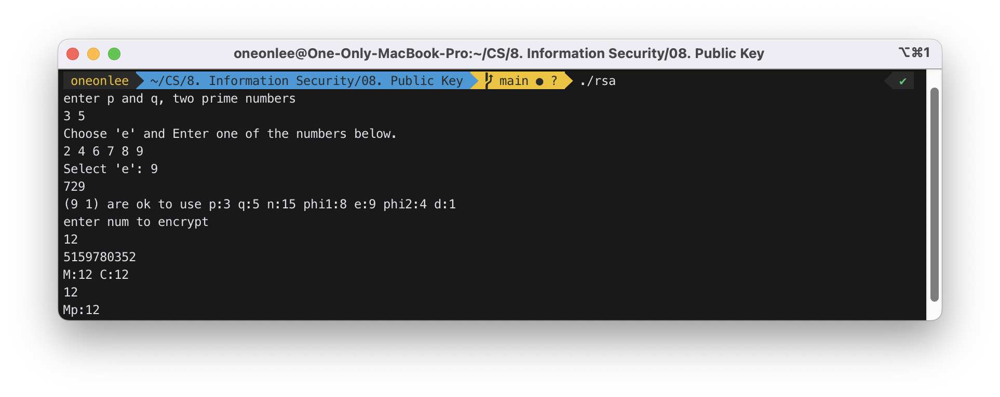
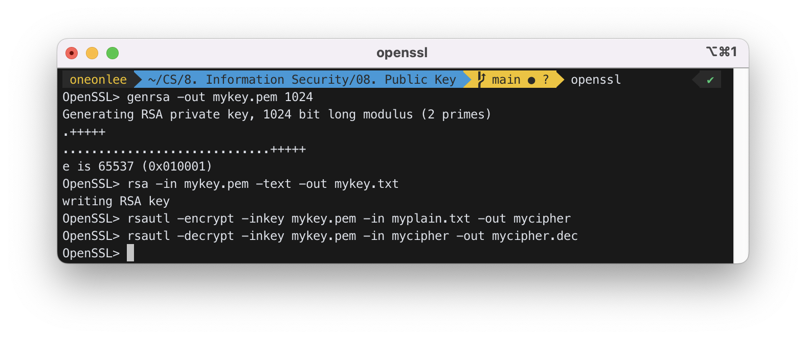
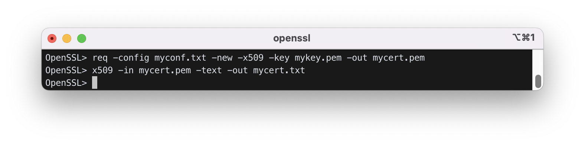
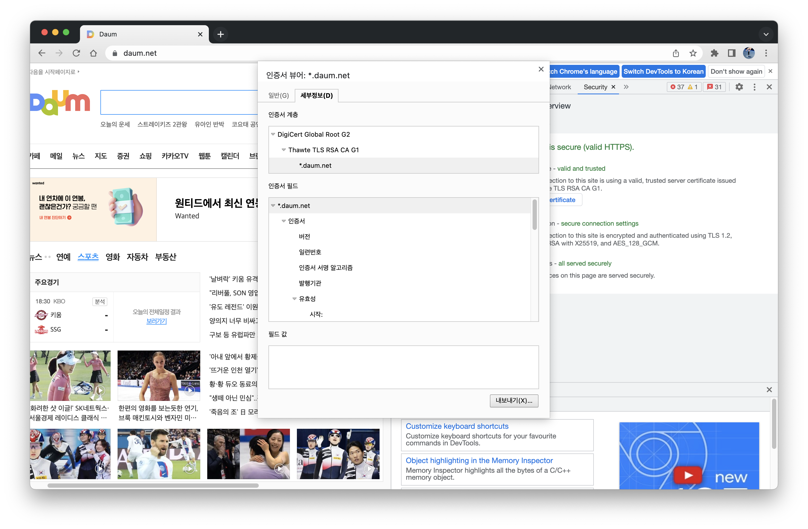
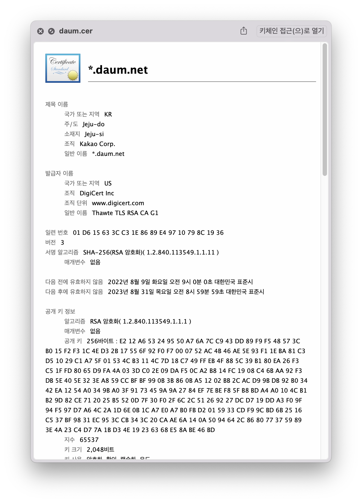
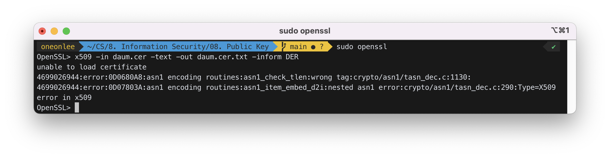

# Public Key

- Symmetric key vs ASymmetric key (Public key)
- RSA
- Digital Signature
- Public Key Certificate (X.509)

## 1. Problem of symmetric-key algorithm

- fast, easy to use
- key distribution problem
  - you want to send credit card number to G-market
  - to use DES, you and the G-market need to share the same 64-bit key.
  - how can you and G-market exchange the key?
  - G-market creates a 64-bit key and send to you by email or by phone?

## 2. public-key algorithm

- Encryption key is different from the decryption key.
- Computing the other key from one of the keys is very hard (virtually impossible).
- e.g., RSA, ElGamal, DSA, elliptic curve, ..........

## 3. RSA

### 1) basic concepts

- relative prime: two numbers are relative prime to each other if the GCD of them =1
  - ex) 21, 10 are relative prime => GCD(21, 10) = 1
- phi function: phi(N) is the number of relative primes to N in [1..N-1]
  - ex) phi(8) = 4 because we have {1, 3, 5, 7} which are relative prime to 8
  - phi(7) = 6
- phi(N) = N - 1, if N is a prime number.
- phi(P\*Q) = (P-1)\*(Q-1), if P and Q are prime numbers
  - ex) phi(15) = phi(3\*5) = 2\*4=8 // {1, 2, 4, 7, 8, 11, 13, 14}
- We can easily compute phi for a number x by finding two prime factors for x.

### 2) algorithm

- a) select two prime numbers p and q (about 200 digits each)
- b) n = p\*q
- c) phi1 = (p-1)(q-1) // phi1 is the number of relative prime numbers to n
- d) select e = relative prime to phi1, and < phi1
- e) compute d such that d\*e = 1 (mod (p-1)(q-1))
  - d = e^(phi2-1) mod phi1,
  - where phi2 is the number of relative prime numbers to phi1
  - Now
    - n: modulus
    - e: public exponent
    - d: private exponent
    - (n, e): public key
    - (n, d): private key
- f) encryption: C = M^e mod n, where M is the plain text. Usually a number of consecutive letters are grouped together to produce a number, which will be used as a plain text. The resulting number should be less than n. For example, if we are using 26 characters, and each 4 consecutive letters are grouped to produce a plain text, the plain text for letters abcd would be 97\*26^0+98\*26^1+99\*26^2+100\*26^3
  - (refer http://www.math.mtu.edu/mathlab/COURSES/holt/dnt/phi4.html)
- g) decryption: M = C^d mod n
  - ex) p = 3, q = 5 ==> n=15
    - phi(n)=(3-1)(5-1)=8 // they are 1, 2, 4, 7, 8, 11, 13, 14
    - To count relative primes for 15
      - ```
          1) 1, 2, 3, 4, ..........., 15   // 15 candidates
          2) remove multiple of 3   // these numbers can't be relative prime numbers
                                      // there are 5 of them
              remove multiple of 5   // these numbers can't be relative prime numbers
                                      // there are 3 of them
          3) number 15 will be removed twice, so add 1
          4) 15 - (5+3) + 1 = 8
        ```
    - No suitable e!!
  - ex) p=11, q=17 ==> n=187
    - phi1=phi(187) = (11-1)(17-1)=160
    - phi2=phi(160)=64
    - choose e=7
    - d=e^(phi2-1) mod phi1 =7^63 mod 160 =23
    - Now try encryption and decryption.
      - M = 144
      - C = M^e mod n = 144^7 mod 187 = 100
      - M = C^d mod n = 100^23 mod 187 = 144

### 3) security of RSA

- (n,e): public key
- (n,d): private key

n, e is known. Computing d from n and e is almost impossible. The number of bits of “n” is the key length of this RSA. 1024 bit is considered medium security.

### 4) using RSA

- Every one has (e, d) pair.
- Every one publicizes his own public key e (in the form of a public key certificate)
- To send a message "m" secretly to person A, encrypt it with A's public key "e_A"
  - c = m^e_A mod n_A
- No one can read this except A. A decrypts it by
  - c^d_A mod n_A
- To make it more secure, if B is the sender,
  - c = enc(enc(m, d_B), e_A)

## 4. Usage of public-key system

### 1) digital signature by A

- (M, enc(H(M), d_A))
- M: document
- H(M): hash value of M
- enc(H(M), d_A): **encrypt H(M) with the private key of A**

The receiver can check the validity of M by comparing its hash value with H(M). the H(M) can be obtained by decrypting enc(H(M), d_A) with e_A which is public.

If someone has changed M, the H(M) will not match. If someone, B, make a change in M and provide enc(H(M), d_B), the decryption with e_A will fail.

### 2) public key certificate (X. 509)

CA(Certificate Authority) : provide digital signature to a certificate

A person or an organization (company, web cite, ...) can obtain a certificate from one of the CA's. The CA verifies the information in the certificate and attaches a digital signature on it. X.509 specifies what information should be provided in the certificate.

- X.509 field:
  - Version number
  - Serial number
  - Signature Algorithm ID
  - Issuer Name (CA name who signed this certificate)
    - Validity period
      - Not Before
      - Not After
    - Subject name (the owner of this certificate)
    - Subject Public Key Info
      - Public Key Algorithm
      - Subject Public Key
    - Certificate Signature Algorithm
    - Certificate Signature

X.509 file can be stored in various formats such as DER, PEM, cer, crt, PFX, ...

ex) A certificate issued to "FreeSoft". CA is "Thawte"

- Certificate:
  - Data:
    - Version: 1 (0x0)
    - Serial Number: 7829 (0x1e95)
    - Signature Algorithm: md5WithRSAEncryption
    - Issuer: C=ZA, ST=Western Cape, L=Cape Town, O=Thawte Consulting cc,
      - OU=Certification Services Division,
      - CN=Thawte Server CA/emailAddress=server-certs@thawte.com
    - Validity
      - Not Before: Jul 9 16:04:02 1998 GMT
      - Not After : Jul 9 16:04:02 1999 GMT
    - Subject: C=US, ST=Maryland, L=Pasadena, O=Brent Baccala, - OU=FreeSoft, CN=www.freesoft.org/emailAddress=baccala@freesoft.org
    - Subject Public Key Info:
      - Public Key Algorithm: rsaEncryption
      - RSA Public Key: (1024 bit)
        - Modulus (1024 bit):
          - ```
              00:b4:31:98:0a:c4:bc:62:c1:88:aa:dc:b0:c8:bb:
              33:35:19:d5:0c:64:b9:3d:41:b2:96:fc:f3:31:e1:
              66:36:d0:8e:56:12:44:ba:75:eb:e8:1c:9c:5b:66:
              70:33:52:14:c9:ec:4f:91:51:70:39:de:53:85:17:
              16:94:6e:ee:f4:d5:6f:d5:ca:b3:47:5e:1b:0c:7b:
              c5:cc:2b:6b:c1:90:c3:16:31:0d:bf:7a:c7:47:77:
              8f:a0:21:c7:4c:d0:16:65:00:c1:0f:d7:b8:80:e3:
              d2:75:6b:c1:ea:9e:5c:5c:ea:7d:c1:a1:10:bc:b8:
              e8:35:1c:9e:27:52:7e:41:8f
            ```
        - Exponent: 65537 (0x10001)
  - Signature Algorithm: md5WithRSAEncryption
    - ```
        93:5f:8f:5f:c5:af:bf:0a:ab:a5:6d:fb:24:5f:b6:59:5d:9d:
        92:2e:4a:1b:8b:ac:7d:99:17:5d:cd:19:f6:ad:ef:63:2f:92:
        ab:2f:4b:cf:0a:13:90:ee:2c:0e:43:03:be:f6:ea:8e:9c:67:
        d0:a2:40:03:f7:ef:6a:15:09:79:a9:46:ed:b7:16:1b:41:72:
        0d:19:aa:ad:dd:9a:df:ab:97:50:65:f5:5e:85:a6:ef:19:d1:
        5a:de:9d:ea:63:cd:cb:cc:6d:5d:01:85:b5:6d:c8:f3:d9:f7:
        8f:0e:fc:ba:1f:34:e9:96:6e:6c:cf:f2:ef:9b:bf:de:b5:22:
        68:9f
      ```

To confirm the validity of the above certificate, we need a certificate of Thawte.

- Certificate:
  - Data:
    - Version: 3 (0x2)
    - Serial Number: 1 (0x1)
    - Signature Algorithm: md5WithRSAEncryption
    - Issuer: C=ZA, ST=Western Cape, L=Cape Town, O=Thawte Consulting cc,
      - OU=Certification Services Division,
      - CN=Thawte Server CA/emailAddress=server-certs@thawte.com
    - Validity
      - Not Before: Aug 1 00:00:00 1996 GMT
      - Not After : Dec 31 23:59:59 2020 GMT
    - Subject: C=ZA, ST=Western Cape, L=Cape Town, O=Thawte Consulting cc,
      - OU=Certification Services Division,
      - CN=Thawte Server CA/emailAddress=server-certs@thawte.com
    - Subject Public Key Info:
      - Public Key Algorithm: rsaEncryption
      - RSA Public Key: (1024 bit)
        - Modulus (1024 bit):
          - ```
              00:d3:a4:50:6e:c8:ff:56:6b:e6:cf:5d:b6:ea:0c:
              68:75:47:a2:aa:c2:da:84:25:fc:a8:f4:47:51:da:
              85:b5:20:74:94:86:1e:0f:75:c9:e9:08:61:f5:06:
              6d:30:6e:15:19:02:e9:52:c0:62:db:4d:99:9e:e2:
              6a:0c:44:38:cd:fe:be:e3:64:09:70:c5:fe:b1:6b:
              29:b6:2f:49:c8:3b:d4:27:04:25:10:97:2f:e7:90:
              6d:c0:28:42:99:d7:4c:43:de:c3:f5:21:6d:54:9f:
              5d:c3:58:e1:c0:e4:d9:5b:b0:b8:dc:b4:7b:df:36:
              3a:c2:b5:66:22:12:d6:87:0d
            ```
        - Exponent: 65537 (0x10001)
    - X509v3 extensions:
      - X509v3 Basic Constraints: critical
        - CA:TRUE
  - Signature Algorithm: md5WithRSAEncryption
    - ```
        07:fa:4c:69:5c:fb:95:cc:46:ee:85:83:4d:21:30:8e:ca:d9:
        a8:6f:49:1a:e6:da:51:e3:60:70:6c:84:61:11:a1:1a:c8:48:
        3e:59:43:7d:4f:95:3d:a1:8b:b7:0b:62:98:7a:75:8a:dd:88:
        4e:4e:9e:40:db:a8:cc:32:74:b9:6f:0d:c6:e3:b3:44:0b:d9:
        8a:6f:9a:29:9b:99:18:28:3b:d1:e3:40:28:9a:5a:3c:d5:b5:
        e7:20:1b:8b:ca:a4:ab:8d:e9:51:d9:e2:4c:2c:59:a9:da:b9:
        b2:75:1b:f6:42:f2:ef:c7:f2:18:f9:89:bc:a3:ff:8a:23:2e:
        70:47
      ```

## 5. Homework

### 3) Make an RSA key pair from two small prime numbers (p=11, q=3). Encrypt/decrypt for some example numbers. The example number should be in the range of 0 to 32. Try to encrypt HELLO using this RSA key.

### 4) Write a program that allows users to generate an RSA key and encrypt/decrypt with this key. Use the fact `x*y mod n = (x mod n)*(y mod n) mod n`

`rsa.cpp` :

```cpp
#include <stdio.h>
#include <cmath>

int enc(int M, int e, int n);
int dec(int C, int d, int n);
int compute_pow(int a, int b, int m);
int select_e(int phi1, int p, int q);
int compute_phi2(int phi1);
int GCD(int a, int b);

int main()
{
	printf("enter p and q, two prime numbers\n");
	int p, q;
	scanf("%d %d", &p, &q);
	// step 1. compute n
	int n = p * q;
	// step 2. compute phi1
	int phi1 = (p - 1) * (q - 1);
	int e;
	int phi2;
	int d;

	for (;;)
	{
		// step 3. select e
		e = select_e(phi1, p, q);

		// step 4. compute phi2
		phi2 = compute_phi2(phi1);

		// step 5. compute d
		d = compute_pow(e, phi2 - 1, phi1);
		if (e == d)
			printf("not suitable e. select another one\n");
		else
		{
			printf("(%d %d) are ok to use ", e, d);
			break;
		}
	}
	printf("p:%d q:%d n:%d phi1:%d e:%d phi2:%d d:%d\n",
		   p, q, n, phi1, e, phi2, d);
	// now encrypt
	printf("enter num to encrypt\n");
	int M, C;
	scanf("%d", &M);
	C = enc(M, e, n);
	printf("M:%d C:%d\n", M, C);
	int Mp = dec(C, d, n);
	printf("Mp:%d\n", Mp);
}
int enc(int M, int e, int n)
{
	return compute_pow(M, e, n);
}
int dec(int C, int d, int n)
{
	return compute_pow(C, d, n);
}
int compute_pow(int a, int b, int m)
{
	unsigned long long int power = (unsigned long long int)pow(a, b);
	printf("%llu\n", power);
	return power % m; // return a^b mod m
}

int select_e(int phi1, int p, int q)
{
	printf("Choose 'e' and Enter one of the numbers below.\n");

	// display relative prime numbers to phi1
	for (int i = 2; i <= phi1 + 1; i++)
	{
		if (p % i == 0 or q % i == 0)
			continue;
		else
			printf("%d ", i);
	}
	// let user select one of them
	printf("\nSelect \'e\': ");

	int e;
	scanf("%d", &e);
	return e;
}

int compute_phi2(int phi1)
{
	int cnt = 0;
	for (int i = 1; i < phi1; i++)
	{
		if (GCD(phi1, i) == 1)
			cnt++;
	}
	return cnt; // return num of relative prime numbers to phi1
}

int GCD(int a, int b)
{
	int gcd;
	for (int i = 1; i <= a && i <= b; ++i)
	{
		// Checks if i is factor of both integers
		if (a % i == 0 && b % i == 0)
			gcd = i;
	}

	return gcd; // return GCD of a, b
}
```



### 5) Write a program that breaks your RSA system.

### 6) Write a pair of secure client and server that exchange a password using RSA system.

### 7) Install openssl in your pc.

1. download openssl from http://gnuwin32.sourceforge.net/packages/openssl.htm
   - (get "complete package except source")
2. install in your pc
3. go to the installed directory/bin
4. double click on openssl (you may need to run as "administrator")

### 8-1) Generate an RSA key pair using openssl.

```bash
$ openssl
OpenSSL> genrsa -out mykey.pem 1024
    # generate public/private key pair in file "mykey.pem" with keysize 1024 bits.
    # default size 512 bits if keysize is not specified
```

### 8-2) Convert mykey.pem to a text file, mykey.txt, to look at the contents. Use WordPad to open mykey.txt. Find n, e, and d.

```bash
OpenSSL> rsa -in mykey.pem -text -out mykey.txt
    # display the contents of "mykey.pem" in plain text in
    # output file "mykey.txt"
```

### 8-3) Encrypt "hello" with (n, e) to produce ciphertext. How many bytes in the ciphertext? Decrypt the ciphertext with (n, d) to recover "hello".

`myplain.txt` :

```
hello
```

```bash
OpenSSL> rsautl -encrypt -inkey mykey.pem -in myplain.txt -out mycipher # encrypting
OpenSSL> rsautl -decrypt -inkey mykey.pem -in mycipher -out mycipher.dec # decrypting
```

Refer the manual in `man/pdf/openssl-mal.pdf`.

PEM(Privacy Enhanced Mail) file format transforms a binary file into an ascii file using base64. Each 6 bit in the input file will be converted to a letter in {A-Z, a-z, 0-9, +, -}, and wrapped with boundary lines.<br>
ex) Man ==> 77 97 110 ==> 01001101 01100001 01101110<br>
==> T(010011, 19) W(010110, 22) F(000101, 5) u(101110, 46)

(.der : binary DER encoded certificates<br>
.cer : similar to .der<br>
.key : PKCS#8 keys. the keys are encoded as binary DER or ASCII PEM)



### 9) Make an X.509 certificate.

#### 9.1) make a config file `myconf.txt`

`myconf.txt` :

```
[req]
string_mask = nombstr
distinguished_name = req_distinguished_name
prompt = no
[req_distinguished_name]
commonName = my CA
stateOrProvinceName = some state
countryName = US
emailAddress = root@somename.somewhere.com
organizationName = mycompany
```

#### 9.2) Make a certificate for the person/company specified in `myconf.txt`. The public key of this person/company is given in mykey.pem:

```bash
OpenSSL> req -config myconf.txt -new -x509 -key mykey.pem -out mycert.pem
```

#### 9.3) let's read the contents of the certificate

```bash
OpenSSL> x509 -in mycert.pem -text -out mycert.txt
```



`mycert.txt` :

```text
Certificate:
    Data:
        Version: 1 (0x0)
        Serial Number:
            47:c7:8c:3f:81:69:4d:b6:31:77:27:16:64:47:75:c9:8d:7d:2f:65
        Signature Algorithm: sha256WithRSAEncryption
        Issuer: CN = my CA, ST = some state, C = US, emailAddress = root@somename.somewhere.com, O = mycompany
        Validity
            Not Before: Nov  1 08:37:13 2022 GMT
            Not After : Dec  1 08:37:13 2022 GMT
        Subject: CN = my CA, ST = some state, C = US, emailAddress = root@somename.somewhere.com, O = mycompany
        Subject Public Key Info:
            Public Key Algorithm: rsaEncryption
                RSA Public-Key: (1024 bit)
                Modulus:
                    00:bf:f9:7f:75:7d:20:7f:2d:82:e5:29:93:80:3e:
                    61:d4:d1:78:47:2f:f5:1c:a6:7f:d2:d6:a9:bd:11:
                    81:c0:8a:ba:39:a2:d2:34:60:3f:99:8b:05:8d:cf:
                    04:60:e3:e2:de:a0:e0:83:d6:f7:ac:75:00:7d:c6:
                    73:38:41:cf:0c:f7:78:02:35:b6:f8:31:36:19:0d:
                    45:d7:83:2c:f9:cb:99:38:c7:d1:37:09:f3:a2:80:
                    2e:17:17:a8:36:da:70:74:2c:27:72:44:71:f8:64:
                    08:36:90:ad:0a:4a:30:a4:c1:3f:89:ad:b3:9c:12:
                    38:55:ca:37:32:5a:c6:aa:31
                Exponent: 65537 (0x10001)
    Signature Algorithm: sha256WithRSAEncryption
         25:b2:79:50:93:fe:3f:db:d3:c7:c8:69:79:b9:e9:96:12:38:
         da:17:88:1e:13:1f:01:aa:29:f3:21:3d:b0:45:cf:fe:c0:07:
         06:ae:76:a4:d2:29:7d:1e:3d:b3:be:65:0d:01:13:0c:8a:74:
         74:af:72:98:01:8b:e6:33:6c:6a:81:2c:e0:6f:8d:a4:eb:f6:
         df:76:4c:5b:62:60:4c:a5:48:63:d9:1c:31:6c:30:6c:df:c9:
         3f:92:e7:f9:56:94:21:5c:5b:a2:81:51:14:b9:65:2a:f0:e3:
         be:62:d9:ec:c6:51:4c:5d:b8:c7:7d:13:75:34:89:2c:00:fb:
         00:1a
-----BEGIN CERTIFICATE-----
MIICZjCCAc8CFEfHjD+BaU22MXcnFmRHdcmNfS9lMA0GCSqGSIb3DQEBCwUAMHIx
DjAMBgNVBAMTBW15IENBMRMwEQYDVQQIEwpzb21lIHN0YXRlMQswCQYDVQQGEwJV
UzEqMCgGCSqGSIb3DQEJARYbcm9vdEBzb21lbmFtZS5zb21ld2hlcmUuY29tMRIw
EAYDVQQKEwlteWNvbXBhbnkwHhcNMjIxMTAxMDgzNzEzWhcNMjIxMjAxMDgzNzEz
WjByMQ4wDAYDVQQDEwVteSBDQTETMBEGA1UECBMKc29tZSBzdGF0ZTELMAkGA1UE
BhMCVVMxKjAoBgkqhkiG9w0BCQEWG3Jvb3RAc29tZW5hbWUuc29tZXdoZXJlLmNv
bTESMBAGA1UEChMJbXljb21wYW55MIGfMA0GCSqGSIb3DQEBAQUAA4GNADCBiQKB
gQC/+X91fSB/LYLlKZOAPmHU0XhHL/Ucpn/S1qm9EYHAiro5otI0YD+ZiwWNzwRg
4+LeoOCD1vesdQB9xnM4Qc8M93gCNbb4MTYZDUXXgyz5y5k4x9E3CfOigC4XF6g2
2nB0LCdyRHH4ZAg2kK0KSjCkwT+JrbOcEjhVyjcyWsaqMQIDAQABMA0GCSqGSIb3
DQEBCwUAA4GBACWyeVCT/j/b08fIaXm56ZYSONoXiB4THwGqKfMhPbBFz/7ABwau
dqTSKX0ePbO+ZQ0BEwyKdHSvcpgBi+YzbGqBLOBvjaTr9t92TFtiYEylSGPZHDFs
MGzfyT+S5/lWlCFcW6KBURS5ZSrw475i2ezGUUxduMd9E3U0iSwA+wAa
-----END CERTIFICATE-----
```

Who is the owner of this certificate? What is the public key? What is the key size?<br>
Who has signed this certificate?

### 10) Get a certificate in Internet Explorer or in Chrome. Check the contents of x.509 file.

#### 10.1) Go to "tools>internet options>contents>certificates" to get a copy of a certificate. To view the certificate of a site:

- In Chrome, go to some https site such as www.daum.net and select Three Dots Menu>More Tools>Developer Tools>Security>View certificate>Details>Copy to File
- In IE, go to some https site such as www.daum.net and click the padlock symbol, select “View Certificate”>Detail>Copy to File.

<br>


#### 10.2) Look at the contents of this certificate (assume the file name is `daum.cer`) with

`daum.cer` :<br>


```bash
OpenSSL> x509 -in daum.cer -text -out daum.cer.txt -inform DER
```

(DER: Distinguished Encoding Rules)



```bash
unable to load certificate
4699026944:error:0D0680A8:asn1 encoding routines:asn1_check_tlen:wrong tag:crypto/asn1/tasn_dec.c:1130:
4699026944:error:0D07803A:asn1 encoding routines:asn1_item_embed_d2i:nested asn1 error:crypto/asn1/tasn_dec.c:290:Type=X509
error in x509
```

위와 같은 에러가 발생하였다.

Who is the owner of this certificate? Who has signed this certificate? What is the public key? <br>
What is the key size?
