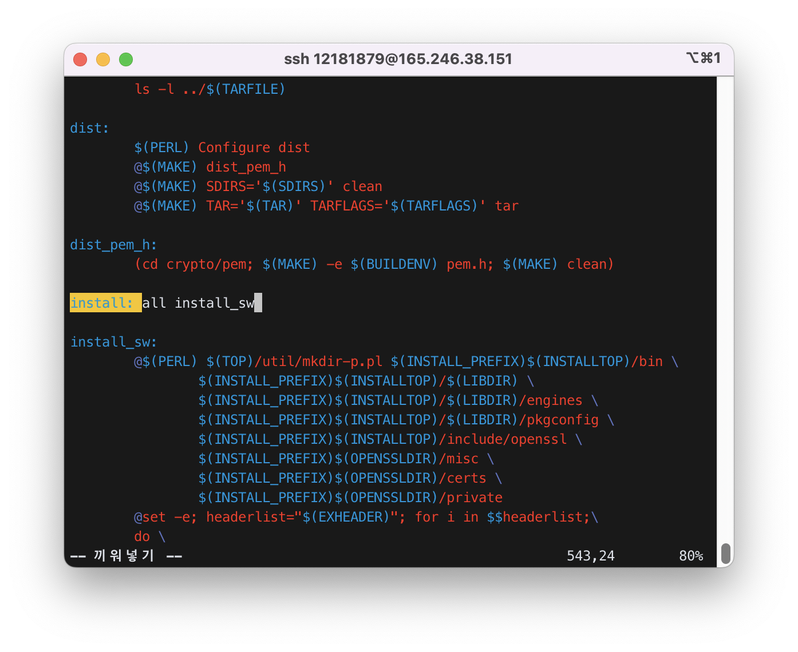
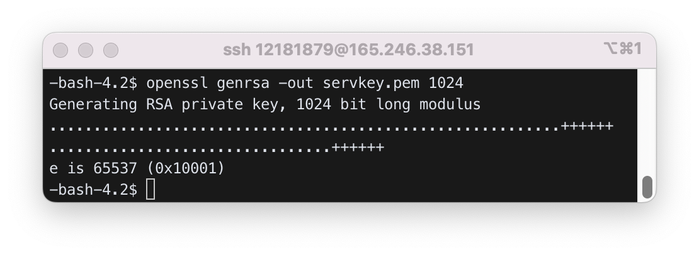
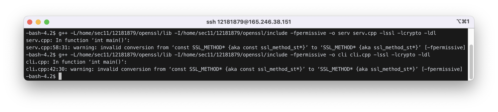
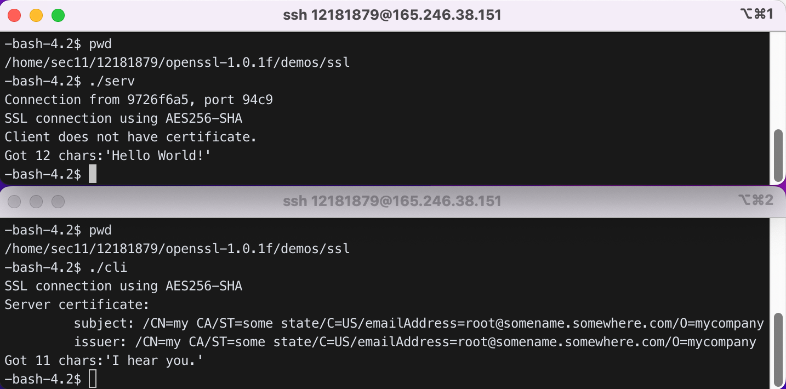
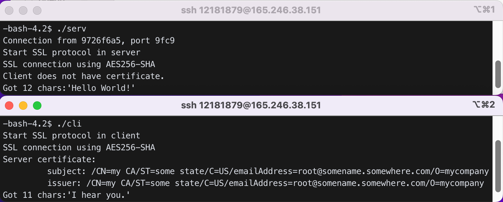
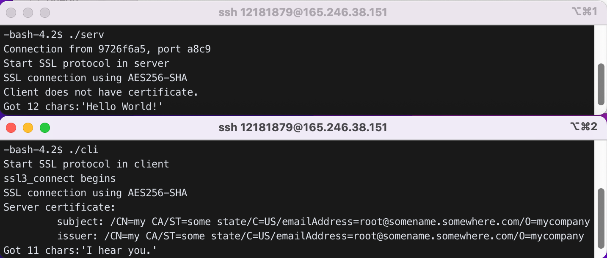
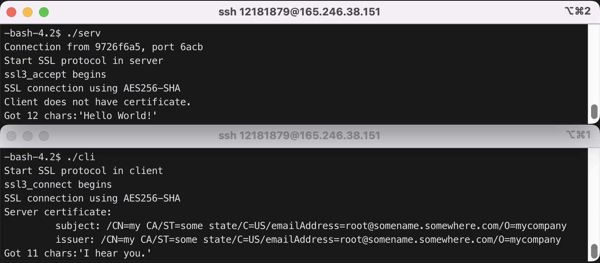
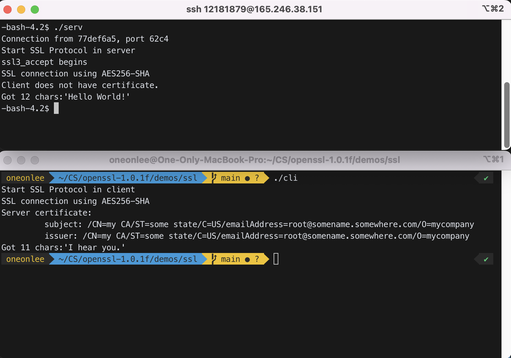

# Programming with OpenSSL

(TLS for tcp, DTLS for udp. DTLS is for Internet of Things and used with CoAP)

## 1. SSL(Secure Socket Layer)

A protocol for secure connection over internet. Uses a public-key algorithm to generate a session key, which is a symmetric key.<br>
(version hisotry: SSL 1.0, SSL 2.0, SSL 3.0, TLS 1.0(SSL 3.1), TLS 1.1(SSL 3.2), TLS 1.2(SSL 3.3))

### 1) client->server: client hello

```c
protocol version list (SSLv2, SSLv3, TLSv1, ...)
session ID
cipher suite list
        key exchange algorithm list (RSA, Diffie-Hellman, ...)
        symmetric key algorithm list (TripleDES, DES, ...)
        message digest algorithm list (SHA-1, MD5, ...)
        compression algorithm list (PKZip, gzip, ...)
random number (196, 201, 083)
```

### 2) server -> client: server hello

```c
protocol version (TLSv1)
session ID
chosen cipher suite
        key exchange algorithm (RSA)
        symmetric key algorithm (DES)
        message digest algorithm (SHA-1)
        compression algorithm (PKZip)
random number (823, 495, 127)
```

### 3) server -> client: server certificate

### 4) server -> client : hello done

### 5) client -> server: pre-master secret (48 bytes)

```c
encRSA((client_version, random[46]), e_S)
        // e_S is the public key of the server
```

Client and Server create symmetric keys (called session keys) based on this pre-master secret. They will use these session keys for actual communcation.

```c
premaster_secret=>master_secret=>enc key, IV, MAC(Message Authentication Code) key
master_secret = PRF(pre_master_secret,"master secret",ClientHello.random+ServerHello.random);
                // (PRF:pseudo random function)
```

### 6) server <-> client: finished

```c
encDES(finished_message, session_key)
```

- OpenSSL toolkit provides:
  - libssl.a :implementation of SSLv2, SSLv3, TLSv1 to support ssl client/server.
    - API to use OpenSSL (SSL_connect, SSL_accept, SSL_read, SSL_write, ..)
  - libcrypto.a: encryption library and x509 stuff. needed by ssl/tls.
    - for ciphers, it has libdes (DES), RC4, RC2, Blowfish, IDEA
    - for digests, it has MD5, MK2, SHA, SHA-1, MDC2
    - for public key, it has RSA, DSA, Diffie-Hellman
    - for x509, it has x509 encoding/decoding routines
  - OpenSSL: a command line tool

## 2. Making an ssl client/server in the lab server.

### 1) Copy `openssl-1.0.1f.tar.gz` into your home directory(assume it is `/home/sec11/12181879`), and un-tar it to create `openssl-1.0.1f` directory.

```bash
$ pwd
/home/sec11/12181879
$ cp ../../openssl-1.0.1f.tar.gz .
$ tar xvf openssl-1.0.1f.tar.gz
```

### 2) config

```bash
$ mkdir openssl
$ cd openssl-1.0.1f
$ pwd
/home/sec11/12181879/openssl-1.0.1f
```

Let config know it should use the openssl direcotry in the current user's home direcotry(`/home/sec11/12181879`).

```bash
$ ./config no-dso --prefix=/home/sec11/12181879/openssl --openssldir=/home/sec11/12181879/openssl
```

### 3) compile openssl-1.0.1f library

```bash
$ make
```

will compile OpenSSL library code. libssl.a, libcrypto.a will be created in the top directory (`/home/sec11/12181879/openssl-1.0.1f`).

### 4) Install

#### 4.1) Remove "install_docs" from `Makefile` (to reduce compile time) as below.

```bash
$ vi Makefile
```

and change `install: all install_docs install_sw`<br>
to `install: all install_sw`



#### 4.2) Install

```bash
$ make install
```

will install OpenSSL in `/home/sec11/12181879/openssl`.

Now you should have all necessary files in `/home/sec11/12181879/openssl` directory.

- All files will be installed in `/home/sec11/12181879/openssl` (make sure you have them all).
  - `lib` will have `libssl.a`, `libcrypto.a`
  - `include/openssl` will have header files
  - `bin` will have openssl binary files
  - `certs` will have certificates
  - `private` will have private keys

### 5) Compile application: Compile `cli.cpp` and `serv.cpp` in `demos` directory.

#### 5.1) Go to `demos/ssl` directory.

```bash
$ cd openssl-1.0.1f/demos/ssl
```

#### 5.2) Generate server rsa key pair: `servkey.pem`

```bash
$ openssl genrsa -out servkey.pem 1024
```



#### 5.3) Make a config file `servconf.txt` and generate server public key certificate(the server public key will be self-signed): `servcert.pem`

```bash
$ vi servconf.txt
```

`servconf.txt` :

```
[req]
string_mask = nombstr
distinguished_name = req_distinguished_name
prompt = no
[req_distinguished_name]
commonName = my CA
stateOrProvinceName = some state
countryName = US
emailAddress = root@somename.somewhere.com
organizationName = mycompany
```

```bash
$ openssl req -config servconf.txt -new -x509 -key servkey.pem -out servcert.pem
```

#### 5.4) Change followings.

- `serv.cpp`:
  - change the port number (임의의 숫자인 12500으로 지정함)
  - change the file name for the certificate (CERTF) and key file (KEYF)
    - `#define CERTF HOME "servcert.pem"`
    - `#define KEYF HOME "servkey.pem"`
  - change the return data type of `main()` to `int`
  - change `size_t client_len` to `socklen_t client_len`
- `cli.cpp`:
  - change the server port number and IP address
    - server port number : 임의의 숫자인 12500으로 지정함
    - server IP address : `"165.246.38.151"`
  - change the return data type of `main()` to `int`
  - include `#include <unistd.h>`
  - Change ssl version to TLSv1: use `TLSv1_client_method()` instead of `SSLv2_client_method()` in `cli.cpp`.

#### 5.5) Compile the client and server

```bash
$ g++ -L/home/sec11/12181879/openssl/lib -I/home/sec11/12181879/openssl/include -fpermissive -o serv serv.cpp -lssl -lcrypto -ldl
$ g++ -L/home/sec11/12181879/openssl/lib -I/home/sec11/12181879/openssl/include -fpermissive -o cli cli.cpp -lssl -lcrypto -ldl
```

- `-L` is option for additional library directory and `-I` for additional header file directory.
- `-lssl` means "link with libssl.a" (for static library) or "link with libssl.so" (for dynamically linked library, or shared object) and `-lcrypto` "link with libcrypto.a" or "link with libcrypto.so".



#### 5.6). Run the server first and run the client to see if they can talk.



위의 터미널 화면이 `serv`를 실행시킨 화면이고, 아래 터미널 화면이 `cli`를 실행시킨 화면이다.

`serv`가 `cli`에게 'Hello World!'를 보내고,
`cli`가 `serv`에게 'I hear you.'를 보낸 것을 확인할 수 있다.

## 3. Making an ssl client in windows (For MacOS, get openssl-1.0.1f.tar.gz from the lab server via SFTP and install following the steps in [Section 2](#2-making-an-ssl-clientserver-in-the-lab-server))

### 1) Go to http://www.npcglib.org/~stathis/blog/precompiled-openssl/

Download precompiled OpenSSL libray and header files(one matching your vs version: e.g., openssl-1.1.0f-vs2015.7z[md5]) and uncompress. (You may need to download 7-zip from internet to uncompress.)

### 2) Make an empty visual studio project and create a c++ source file with the code in [`winsslcli.c`](./code/winsslcli.c)

### 3) Set lib, include path of this project to the lib, include directory (32 bit version) of the uncompressed OpenSSL.

- project>properties>vc++ directories>include directory
- project>properties>vc++ directories>library directory

### 4) Add following 4 libraries in linker>input>additional dependencies (each in different lines):

ws2_32.lib, libsslMT.lib, Crypt32.lib, libcryptoMT.lib

### 5) Run the ssl server in the lab machine, run windows ssl client, and see if they can talk.

(\* If Visual Studio cannot find header files, check Debug/Release set-up. It should be Debug set-up for both platform and properties>구성.)

## 4. Run the sniffer. Run the server in the lab machine and run the windows ssl client. Analyze the packets between the client and the server. The format of the TLS packet is in the next section. (Analyze only client hello and server hello)

## 5. General format of TLS record

(refer to " http://en.wikipedia.org/wiki/Secure_Sockets_Layer" for detail)

- byte 0: content type (RT: Record Type)
  - 0x14 : ChangeCipherSpec
  - 0x15 : Alert
  - 0x16 : Handshake
  - 0x17 : Application Data
  - 0x18 : Heartbeat
- byte 1, 2 : Version (byte 1:Major, byte 2: Minor)
  - SSLv3: 3, 0
  - TLS 1.0 : 3, 1
  - TLS 1.1 : 3, 2
  - TLS 1.2 : 3, 3
- byte 3, 4 : Length (byte 3: bits 15..8, byte 4: bits 7..0) -- the length of the protocol message
- byte 5..(m-1) : protocol message
- byte m..(p-1) : MAC(Message Authentication Code) -- optional
- byte p..(q-1) : Padding(block ciphers only)

## 6. Handshake protocol

- byte 0: 0x16
- byte 1, 2: Version
- byte 3, 4: Length of the protocol message
- byte 5 : MT(Message Type)
  - 0 : HelloRequest
  - 1 : ClientHello
  - 2 : ServerHello
  - 11: Certificate
  - 12 : ServerKeyExchange
  - 13: CertificateRequest
  - 14: ServerHelloDone
  - 15: Certificate Verify
  - 16: ClientKeyExchange
- 20: Finished
- byte 6, 7, 8: Handshake message data length(byte 6: bits 23..16, byte 7:bits 15..8, byte 8:bits7..0)
- byte 9..(n-1): Handshake message data
- byte n..(n+3): message type, handshake message data length (repeat)
- byte (n+4).. : handshake message data
  ...........

7. ClinetHello handshake message data

```c
struct {
   ProtocolVersion  client_version;  // 2 bytes
   Random  random;   // 4 byte for time, 28 bytes for random number
   SessionID  session_id; // 1 byte for length (0 for new session). x bytes for id
   CipherSuite  cipher_suites<2..2^16-1>;  //2 bytes for length. x ciphersuits
   CompressionMethod  compression_methods<1..2^8-1>; // 1 byte for length. x method
} ClientHello;
```

(\* ClientHello can contain "extensions" at the end. Refer to https://tls.ulfheim.net/)

```c
enum { null(0), (255) }  CompressionMethod; // CompressionMethod.null is 0 and
                                            // it consumes 1-byte memory. not C/C++.
unit8  CipherSuite[2];  // cryptographic suite selector
byte 1, 2, 3: reserved
opaque  SessionID<0..32>;

struct{
   uint32  gmt_unix_time;
   opaque  random_bytes[28];  // 28 bytes
} Random;

struct{
   uint8 major, minor;
} ProtocolVersion;
```

CipherSuite: refer "https://www.iana.org/assignments/tls-parameters/tls-parameters.xhtml" to see the list of ciphersuites. or http://www.thesprawl.org/research/tls-and-ssl-cipher-suites/

- 0x00, 0x09: SSL_RSA_WITH_DES_CBC_SHA
- 0x00, 0x0A : SSL_RSA_WITH_3DES_EDE_CBC_SHA
- 0x00, 0x07 : SSL_RSA_WITH_IDEA_CBC_SHA
- 0x00, 0x015 : SSL_DHE_RSA_WITH_3DES_EDE_CBC_SHA
- ...................

## 8. ServerHello message data

```c
struct {
   ProtocolVersion  client_version;  // 2 bytes
   Random  random;   // 4 byte for time, 28 bytes for random number
   SessionID  session_id; // 1 byte for length (0 for clientHello). x bytes for id
   CipherSuite  cipher_suites;  //2 bytes for selected ciphersuit
   CompressionMethod  compression_methods; // 1 byte for method
} ServerHello;
```

## 9. Alert protocol

Message type: close_notify, unexpected_message, ...

## 10. HeartBeat protocol

Message type HB request, HB response

## 11. Homework

### 1) Do the steps in [Section 2](#2-making-an-ssl-clientserver-in-the-lab-server).

### 2) Modify `cli.cpp` such that it displays "Start SSL protocol in client" before it calls `SSL_connect(ssl)`. Also modify `serv.cpp` such that it displays "Start SSL protocol in server" before it calls `SSL_accept(ssl)`. Recompile `cli`, `serv`, and rerun them to see the effect.



### 3) `cli.cpp` calls `SSL_connect()` which in turn calls `ssl3_connect()` (defined in `openssl-1.0.1f/ssl/s3_clnt.c`). Add `printf("ssl3_connect begins\n");` in the beginning of `ssl3_connect()`. Go to the SSL top directory (`openssl-1.0.1f`) and recompile ssl library with `make`. Re-install ssl library with `make install`. Now go to `demos/ssl` and recompile `cli.cpp` and `serv.cpp` and rerun them to see if the client prints "ssl3_connect begins". If the output does not reflect your change, check the lib directory location in `g++` command.



### 4) `serv.cpp` calls `SSL_accept()` which in turn calls `ssl3_accept()` (defined in `openssl-1.0.1f/ssl/s3_srvr.c`). Add `printf("ssl3_accept begins\n");` in the beginning of `ssl3_accept()`. Recompile and re-install ssl library. Recompile `cli.cpp` and `serv.cpp` and see if the server displays the above message.

g++ -L/home/sec11/12181879/openssl/lib -I/home/sec11/12181879/openssl/include -fpermissive -o serv serv.cpp -lssl -lcrypto -ldl & g++ -L/home/sec11/12181879/openssl/lib -I/home/sec11/12181879/openssl/include -fpermissive -o cli cli.cpp -lssl -lcrypto -ldl

### 5) Modify `ssl3_connect()`, `ssl3_accept()` such that they print some message at each ssl protocol stage. Recompile ssl libraries, `cli`, `serv`, and rerun. Match the state changes in the client and the server with the state changes explained in [Section 1](#1-sslsecure-socket-layer).

`ssl3_accept()` function in `openssl-1.0.1f/ssl/s3_srvr.c` :

```cpp
int ssl3_accept(SSL *s)
{
    printf("ssl3_accept begins here\n");
    BUF_MEM *buf;
    unsigned long alg_k, Time = (unsigned long)time(NULL);
    void (*cb)(const SSL *ssl, int type, int val) = NULL;
    int ret = -1;
    int new_state, state, skip = 0;

    RAND_add(&Time, sizeof(Time), 0);
    ERR_clear_error();
    clear_sys_error();

    if (s->info_callback != NULL)
        cb = s->info_callback;
    else if (s->ctx->info_callback != NULL)
        cb = s->ctx->info_callback;

    /* init things to blank */
    s->in_handshake++;
    if (!SSL_in_init(s) || SSL_in_before(s))
        SSL_clear(s);

    if (s->cert == NULL)
    {
        SSLerr(SSL_F_SSL3_ACCEPT, SSL_R_NO_CERTIFICATE_SET);
        return (-1);
    }

#ifndef OPENSSL_NO_HEARTBEATS
    /* If we're awaiting a HeartbeatResponse, pretend we
     * already got and don't await it anymore, because
     * Heartbeats don't make sense during handshakes anyway.
     */
    if (s->tlsext_hb_pending)
    {
        s->tlsext_hb_pending = 0;
        s->tlsext_hb_seq++;
    }
#endif

    for (;;)
    {
        state = s->state;

        switch (s->state)
        {
        case SSL_ST_RENEGOTIATE:
            s->renegotiate = 1;
            /* s->state=SSL_ST_ACCEPT; */

        case SSL_ST_BEFORE:
        case SSL_ST_ACCEPT:
        case SSL_ST_BEFORE | SSL_ST_ACCEPT:
        case SSL_ST_OK | SSL_ST_ACCEPT:

            s->server = 1;
            if (cb != NULL)
                cb(s, SSL_CB_HANDSHAKE_START, 1);

            if ((s->version >> 8) != 3)
            {
                SSLerr(SSL_F_SSL3_ACCEPT, ERR_R_INTERNAL_ERROR);
                return -1;
            }
            s->type = SSL_ST_ACCEPT;

            if (s->init_buf == NULL)
            {
                if ((buf = BUF_MEM_new()) == NULL)
                {
                    ret = -1;
                    goto end;
                }
                if (!BUF_MEM_grow(buf, SSL3_RT_MAX_PLAIN_LENGTH))
                {
                    ret = -1;
                    goto end;
                }
                s->init_buf = buf;
            }

            if (!ssl3_setup_buffers(s))
            {
                ret = -1;
                goto end;
            }

            s->init_num = 0;
            s->s3->flags &= ~SSL3_FLAGS_SGC_RESTART_DONE;

            if (s->state != SSL_ST_RENEGOTIATE)
            {
                /* Ok, we now need to push on a buffering BIO so that
                 * the output is sent in a way that TCP likes :-)
                 */
                if (!ssl_init_wbio_buffer(s, 1))
                {
                    ret = -1;
                    goto end;
                }

                ssl3_init_finished_mac(s);
                s->state = SSL3_ST_SR_CLNT_HELLO_A;
                s->ctx->stats.sess_accept++;
            }
            else if (!s->s3->send_connection_binding &&
                     !(s->options & SSL_OP_ALLOW_UNSAFE_LEGACY_RENEGOTIATION))
            {
                /* Server attempting to renegotiate with
                 * client that doesn't support secure
                 * renegotiation.
                 */
                SSLerr(SSL_F_SSL3_ACCEPT, SSL_R_UNSAFE_LEGACY_RENEGOTIATION_DISABLED);
                ssl3_send_alert(s, SSL3_AL_FATAL, SSL_AD_HANDSHAKE_FAILURE);
                ret = -1;
                goto end;
            }
            else
            {
                /* s->state == SSL_ST_RENEGOTIATE,
                 * we will just send a HelloRequest */
                s->ctx->stats.sess_accept_renegotiate++;
                s->state = SSL3_ST_SW_HELLO_REQ_A;
            }
            break;

        case SSL3_ST_SW_HELLO_REQ_A:
        case SSL3_ST_SW_HELLO_REQ_B:

            s->shutdown = 0;
            ret = ssl3_send_hello_request(s);
            if (ret <= 0)
                goto end;
            s->s3->tmp.next_state = SSL3_ST_SW_HELLO_REQ_C;
            s->state = SSL3_ST_SW_FLUSH;
            s->init_num = 0;

            ssl3_init_finished_mac(s);
            break;

        case SSL3_ST_SW_HELLO_REQ_C:
            s->state = SSL_ST_OK;
            break;

        case SSL3_ST_SR_CLNT_HELLO_A:
        case SSL3_ST_SR_CLNT_HELLO_B:
        case SSL3_ST_SR_CLNT_HELLO_C:

            s->shutdown = 0;
            if (s->rwstate != SSL_X509_LOOKUP)
            {
                ret = ssl3_get_client_hello(s);
                if (ret <= 0)
                    goto end;
            }
#ifndef OPENSSL_NO_SRP
            {
                int al;
                if ((ret = ssl_check_srp_ext_ClientHello(s, &al)) < 0)
                {
                    /* callback indicates firther work to be done */
                    s->rwstate = SSL_X509_LOOKUP;
                    goto end;
                }
                if (ret != SSL_ERROR_NONE)
                {
                    ssl3_send_alert(s, SSL3_AL_FATAL, al);
                    /* This is not really an error but the only means to
                                       for a client to detect whether srp is supported. */
                    if (al != TLS1_AD_UNKNOWN_PSK_IDENTITY)
                        SSLerr(SSL_F_SSL3_ACCEPT, SSL_R_CLIENTHELLO_TLSEXT);
                    ret = SSL_TLSEXT_ERR_ALERT_FATAL;
                    ret = -1;
                    goto end;
                }
            }
#endif

            s->renegotiate = 2;
            s->state = SSL3_ST_SW_SRVR_HELLO_A;
            s->init_num = 0;
            break;

        case SSL3_ST_SW_SRVR_HELLO_A:
        case SSL3_ST_SW_SRVR_HELLO_B:
            printf("SERV GET HELLO FROM CLNT\n");
            ret = ssl3_send_client_certificate(s);
            ret = ssl3_send_server_hello(s);
            if (ret <= 0)
                goto end;
#ifndef OPENSSL_NO_TLSEXT
            if (s->hit)
            {
                if (s->tlsext_ticket_expected)
                    s->state = SSL3_ST_SW_SESSION_TICKET_A;
                else
                    s->state = SSL3_ST_SW_CHANGE_A;
            }
#else
            if (s->hit)
                s->state = SSL3_ST_SW_CHANGE_A;
#endif
            else
                s->state = SSL3_ST_SW_CERT_A;
            s->init_num = 0;
            break;

        case SSL3_ST_SW_CERT_A:
        case SSL3_ST_SW_CERT_B:
            /* Check if it is anon DH or anon ECDH, */
            /* normal PSK or KRB5 or SRP */
            if (!(s->s3->tmp.new_cipher->algorithm_auth & SSL_aNULL) && !(s->s3->tmp.new_cipher->algorithm_mkey & SSL_kPSK) && !(s->s3->tmp.new_cipher->algorithm_auth & SSL_aKRB5))
            {
                printf("SERV SEND CERT TO CLNT\n");
                ret = ssl3_send_server_certificate(s);
                if (ret <= 0)
                    goto end;
#ifndef OPENSSL_NO_TLSEXT
                if (s->tlsext_status_expected)
                    s->state = SSL3_ST_SW_CERT_STATUS_A;
                else
                    s->state = SSL3_ST_SW_KEY_EXCH_A;
            }
            else
            {
                skip = 1;
                s->state = SSL3_ST_SW_KEY_EXCH_A;
            }
#else
            }
            else
                skip = 1;

            s->state = SSL3_ST_SW_KEY_EXCH_A;
#endif
            s->init_num = 0;
            break;

        case SSL3_ST_SW_KEY_EXCH_A:
        case SSL3_ST_SW_KEY_EXCH_B:
            alg_k = s->s3->tmp.new_cipher->algorithm_mkey;

            /* clear this, it may get reset by
             * send_server_key_exchange */
            if ((s->options & SSL_OP_EPHEMERAL_RSA)
#ifndef OPENSSL_NO_KRB5
                && !(alg_k & SSL_kKRB5)
#endif /* OPENSSL_NO_KRB5 */
            )
                /* option SSL_OP_EPHEMERAL_RSA sends temporary RSA key
                 * even when forbidden by protocol specs
                 * (handshake may fail as clients are not required to
                 * be able to handle this) */
                s->s3->tmp.use_rsa_tmp = 1;
            else
                s->s3->tmp.use_rsa_tmp = 0;

            /* only send if a DH key exchange, fortezza or
             * RSA but we have a sign only certificate
             *
             * PSK: may send PSK identity hints
             *
             * For ECC ciphersuites, we send a serverKeyExchange
             * message only if the cipher suite is either
             * ECDH-anon or ECDHE. In other cases, the
             * server certificate contains the server's
             * public key for key exchange.
             */
            if (s->s3->tmp.use_rsa_tmp
            /* PSK: send ServerKeyExchange if PSK identity
             * hint if provided */
#ifndef OPENSSL_NO_PSK
                || ((alg_k & SSL_kPSK) && s->ctx->psk_identity_hint)
#endif
#ifndef OPENSSL_NO_SRP
                /* SRP: send ServerKeyExchange */
                || (alg_k & SSL_kSRP)
#endif
                || (alg_k & (SSL_kDHr | SSL_kDHd | SSL_kEDH)) || (alg_k & SSL_kEECDH) || ((alg_k & SSL_kRSA) && (s->cert->pkeys[SSL_PKEY_RSA_ENC].privatekey == NULL || (SSL_C_IS_EXPORT(s->s3->tmp.new_cipher) && EVP_PKEY_size(s->cert->pkeys[SSL_PKEY_RSA_ENC].privatekey) * 8 > SSL_C_EXPORT_PKEYLENGTH(s->s3->tmp.new_cipher)))))
            {
                printf("SERV SEND KEY TO CLNT\n");
                ret = ssl3_send_server_key_exchange(s);
                if (ret <= 0)
                    goto end;
            }
            else
                skip = 1;

            s->state = SSL3_ST_SW_CERT_REQ_A;
            s->init_num = 0;
            break;

        case SSL3_ST_SW_CERT_REQ_A:
        case SSL3_ST_SW_CERT_REQ_B:
            if (/* don't request cert unless asked for it: */
                !(s->verify_mode & SSL_VERIFY_PEER) ||
                /* if SSL_VERIFY_CLIENT_ONCE is set,
                 * don't request cert during re-negotiation: */
                ((s->session->peer != NULL) &&
                 (s->verify_mode & SSL_VERIFY_CLIENT_ONCE)) ||
                /* never request cert in anonymous ciphersuites
                 * (see section "Certificate request" in SSL 3 drafts
                 * and in RFC 2246): */
                ((s->s3->tmp.new_cipher->algorithm_auth & SSL_aNULL) &&
                 /* ... except when the application insists on verification
                  * (against the specs, but s3_clnt.c accepts this for SSL 3) */
                 !(s->verify_mode & SSL_VERIFY_FAIL_IF_NO_PEER_CERT)) ||
                /* never request cert in Kerberos ciphersuites */
                (s->s3->tmp.new_cipher->algorithm_auth & SSL_aKRB5)
                /* With normal PSK Certificates and
                 * Certificate Requests are omitted */
                || (s->s3->tmp.new_cipher->algorithm_mkey & SSL_kPSK))
            {
                /* no cert request */
                skip = 1;
                s->s3->tmp.cert_request = 0;
                s->state = SSL3_ST_SW_SRVR_DONE_A;
                if (s->s3->handshake_buffer)
                    if (!ssl3_digest_cached_records(s))
                        return -1;
            }
            else
            {
                s->s3->tmp.cert_request = 1;
                ret = ssl3_send_certificate_request(s);
                if (ret <= 0)
                    goto end;
#ifndef NETSCAPE_HANG_BUG
                s->state = SSL3_ST_SW_SRVR_DONE_A;
#else
                s->state = SSL3_ST_SW_FLUSH;
                s->s3->tmp.next_state = SSL3_ST_SR_CERT_A;
#endif
                s->init_num = 0;
            }
            break;

        case SSL3_ST_SW_SRVR_DONE_A:
        case SSL3_ST_SW_SRVR_DONE_B:
            ret = ssl3_send_server_done(s);
            if (ret <= 0)
                goto end;
            s->s3->tmp.next_state = SSL3_ST_SR_CERT_A;
            s->state = SSL3_ST_SW_FLUSH;
            s->init_num = 0;
            break;

        case SSL3_ST_SW_FLUSH:

            /* This code originally checked to see if
             * any data was pending using BIO_CTRL_INFO
             * and then flushed. This caused problems
             * as documented in PR#1939. The proposed
             * fix doesn't completely resolve this issue
             * as buggy implementations of BIO_CTRL_PENDING
             * still exist. So instead we just flush
             * unconditionally.
             */

            s->rwstate = SSL_WRITING;
            if (BIO_flush(s->wbio) <= 0)
            {
                ret = -1;
                goto end;
            }
            s->rwstate = SSL_NOTHING;

            s->state = s->s3->tmp.next_state;
            break;

        case SSL3_ST_SR_CERT_A:
        case SSL3_ST_SR_CERT_B:
            /* Check for second client hello (MS SGC) */
            ret = ssl3_check_client_hello(s);
            if (ret <= 0)
                goto end;
            if (ret == 2)
                s->state = SSL3_ST_SR_CLNT_HELLO_C;
            else
            {
                if (s->s3->tmp.cert_request)
                {
                    ret = ssl3_get_client_certificate(s);
                    if (ret <= 0)
                        goto end;
                }
                s->init_num = 0;
                s->state = SSL3_ST_SR_KEY_EXCH_A;
            }
            break;

        case SSL3_ST_SR_KEY_EXCH_A:
        case SSL3_ST_SR_KEY_EXCH_B:
            printf("SERV GET KEY FROM CLNT\n");
            ret = ssl3_get_client_key_exchange(s);
            if (ret <= 0)
                goto end;
            if (ret == 2)
            {
                /* For the ECDH ciphersuites when
                 * the client sends its ECDH pub key in
                 * a certificate, the CertificateVerify
                 * message is not sent.
                 * Also for GOST ciphersuites when
                 * the client uses its key from the certificate
                 * for key exchange.
                 */
#if defined(OPENSSL_NO_TLSEXT) || defined(OPENSSL_NO_NEXTPROTONEG)
                s->state = SSL3_ST_SR_FINISHED_A;
#else
                if (s->s3->next_proto_neg_seen)
                    s->state = SSL3_ST_SR_NEXT_PROTO_A;
                else
                    s->state = SSL3_ST_SR_FINISHED_A;
#endif
                s->init_num = 0;
            }
            else if (TLS1_get_version(s) >= TLS1_2_VERSION)
            {
                s->state = SSL3_ST_SR_CERT_VRFY_A;
                s->init_num = 0;
                if (!s->session->peer)
                    break;
                /* For TLS v1.2 freeze the handshake buffer
                 * at this point and digest cached records.
                 */
                if (!s->s3->handshake_buffer)
                {
                    SSLerr(SSL_F_SSL3_ACCEPT, ERR_R_INTERNAL_ERROR);
                    return -1;
                }
                s->s3->flags |= TLS1_FLAGS_KEEP_HANDSHAKE;
                if (!ssl3_digest_cached_records(s))
                    return -1;
            }
            else
            {
                int offset = 0;
                int dgst_num;

                s->state = SSL3_ST_SR_CERT_VRFY_A;
                s->init_num = 0;

                /* We need to get hashes here so if there is
                 * a client cert, it can be verified
                 * FIXME - digest processing for CertificateVerify
                 * should be generalized. But it is next step
                 */
                if (s->s3->handshake_buffer)
                    if (!ssl3_digest_cached_records(s))
                        return -1;
                for (dgst_num = 0; dgst_num < SSL_MAX_DIGEST; dgst_num++)
                    if (s->s3->handshake_dgst[dgst_num])
                    {
                        int dgst_size;

                        s->method->ssl3_enc->cert_verify_mac(s, EVP_MD_CTX_type(s->s3->handshake_dgst[dgst_num]), &(s->s3->tmp.cert_verify_md[offset]));
                        dgst_size = EVP_MD_CTX_size(s->s3->handshake_dgst[dgst_num]);
                        if (dgst_size < 0)
                        {
                            ret = -1;
                            goto end;
                        }
                        offset += dgst_size;
                    }
            }
            break;

        case SSL3_ST_SR_CERT_VRFY_A:
        case SSL3_ST_SR_CERT_VRFY_B:

            /* we should decide if we expected this one */
            ret = ssl3_get_cert_verify(s);
            if (ret <= 0)
                goto end;

#if defined(OPENSSL_NO_TLSEXT) || defined(OPENSSL_NO_NEXTPROTONEG)
            s->state = SSL3_ST_SR_FINISHED_A;
#else
            if (s->s3->next_proto_neg_seen)
                s->state = SSL3_ST_SR_NEXT_PROTO_A;
            else
                s->state = SSL3_ST_SR_FINISHED_A;
#endif
            s->init_num = 0;
            break;

#if !defined(OPENSSL_NO_TLSEXT) && !defined(OPENSSL_NO_NEXTPROTONEG)
        case SSL3_ST_SR_NEXT_PROTO_A:
        case SSL3_ST_SR_NEXT_PROTO_B:
            ret = ssl3_get_next_proto(s);
            if (ret <= 0)
                goto end;
            s->init_num = 0;
            s->state = SSL3_ST_SR_FINISHED_A;
            break;
#endif

        case SSL3_ST_SR_FINISHED_A:
        case SSL3_ST_SR_FINISHED_B:
            printf("SERV GET FIN FROM CLNT\n");
            ret = ssl3_get_finished(s, SSL3_ST_SR_FINISHED_A,
                                    SSL3_ST_SR_FINISHED_B);
            if (ret <= 0)
                goto end;
            if (s->hit)
                s->state = SSL_ST_OK;
#ifndef OPENSSL_NO_TLSEXT
            else if (s->tlsext_ticket_expected)
                s->state = SSL3_ST_SW_SESSION_TICKET_A;
#endif
            else
                s->state = SSL3_ST_SW_CHANGE_A;
            s->init_num = 0;
            break;

#ifndef OPENSSL_NO_TLSEXT
        case SSL3_ST_SW_SESSION_TICKET_A:
        case SSL3_ST_SW_SESSION_TICKET_B:
            ret = ssl3_send_newsession_ticket(s);
            if (ret <= 0)
                goto end;
            s->state = SSL3_ST_SW_CHANGE_A;
            s->init_num = 0;
            break;

        case SSL3_ST_SW_CERT_STATUS_A:
        case SSL3_ST_SW_CERT_STATUS_B:
            ret = ssl3_send_cert_status(s);
            if (ret <= 0)
                goto end;
            s->state = SSL3_ST_SW_KEY_EXCH_A;
            s->init_num = 0;
            break;

#endif

        case SSL3_ST_SW_CHANGE_A:
        case SSL3_ST_SW_CHANGE_B:

            s->session->cipher = s->s3->tmp.new_cipher;
            if (!s->method->ssl3_enc->setup_key_block(s))
            {
                ret = -1;
                goto end;
            }

            ret = ssl3_send_change_cipher_spec(s,
                                               SSL3_ST_SW_CHANGE_A, SSL3_ST_SW_CHANGE_B);

            if (ret <= 0)
                goto end;
            s->state = SSL3_ST_SW_FINISHED_A;
            s->init_num = 0;

            if (!s->method->ssl3_enc->change_cipher_state(s,
                                                          SSL3_CHANGE_CIPHER_SERVER_WRITE))
            {
                ret = -1;
                goto end;
            }

            break;

        case SSL3_ST_SW_FINISHED_A:
        case SSL3_ST_SW_FINISHED_B:
            printf("SERV SEND FIN TO CLNT\n");
            ret = ssl3_send_finished(s,
                                     SSL3_ST_SW_FINISHED_A, SSL3_ST_SW_FINISHED_B,
                                     s->method->ssl3_enc->server_finished_label,
                                     s->method->ssl3_enc->server_finished_label_len);
            if (ret <= 0)
                goto end;
            s->state = SSL3_ST_SW_FLUSH;
            if (s->hit)
            {
#if defined(OPENSSL_NO_TLSEXT) || defined(OPENSSL_NO_NEXTPROTONEG)
                s->s3->tmp.next_state = SSL3_ST_SR_FINISHED_A;
#else
                if (s->s3->next_proto_neg_seen)
                    s->s3->tmp.next_state = SSL3_ST_SR_NEXT_PROTO_A;
                else
                    s->s3->tmp.next_state = SSL3_ST_SR_FINISHED_A;
#endif
            }
            else
                s->s3->tmp.next_state = SSL_ST_OK;
            s->init_num = 0;
            break;

        case SSL_ST_OK:
            /* clean a few things up */
            ssl3_cleanup_key_block(s);

            BUF_MEM_free(s->init_buf);
            s->init_buf = NULL;

            /* remove buffering on output */
            ssl_free_wbio_buffer(s);

            s->init_num = 0;

            if (s->renegotiate == 2) /* skipped if we just sent a HelloRequest */
            {
                s->renegotiate = 0;
                s->new_session = 0;

                ssl_update_cache(s, SSL_SESS_CACHE_SERVER);

                s->ctx->stats.sess_accept_good++;
                /* s->server=1; */
                s->handshake_func = ssl3_accept;

                if (cb != NULL)
                    cb(s, SSL_CB_HANDSHAKE_DONE, 1);
            }

            ret = 1;
            goto end;
            /* break; */

        default:
            SSLerr(SSL_F_SSL3_ACCEPT, SSL_R_UNKNOWN_STATE);
            ret = -1;
            goto end;
            /* break; */
        }

        if (!s->s3->tmp.reuse_message && !skip)
        {
            if (s->debug)
            {
                if ((ret = BIO_flush(s->wbio)) <= 0)
                    goto end;
            }

            if ((cb != NULL) && (s->state != state))
            {
                new_state = s->state;
                s->state = state;
                cb(s, SSL_CB_ACCEPT_LOOP, 1);
                s->state = new_state;
            }
        }
        skip = 0;
    }
end:
    /* BIO_flush(s->wbio); */

    s->in_handshake--;
    if (cb != NULL)
        cb(s, SSL_CB_ACCEPT_EXIT, ret);
    return (ret);
}
```

`ssl3_connect()` function in `openssl-1.0.1f/ssl/s3_clnt.c` :

```cpp
int ssl3_connect(SSL *s)
	{
	BUF_MEM *buf=NULL;
	unsigned long Time=(unsigned long)time(NULL);
	void (*cb)(const SSL *ssl,int type,int val)=NULL;
	int ret= -1;
	int new_state,state,skip=0;


        printf("ssl3 connect begins\n"); //add khj
	RAND_add(&Time,sizeof(Time),0);
	ERR_clear_error();
	clear_sys_error();

	if (s->info_callback != NULL)
		cb=s->info_callback;
	else if (s->ctx->info_callback != NULL)
		cb=s->ctx->info_callback;

	s->in_handshake++;
	if (!SSL_in_init(s) || SSL_in_before(s)) SSL_clear(s);

#ifndef OPENSSL_NO_HEARTBEATS
	/* If we're awaiting a HeartbeatResponse, pretend we
	 * already got and don't await it anymore, because
	 * Heartbeats don't make sense during handshakes anyway.
	 */
	if (s->tlsext_hb_pending)
		{
		s->tlsext_hb_pending = 0;
		s->tlsext_hb_seq++;
		}
#endif

	for (;;)
		{
		state=s->state;

		switch(s->state)
			{
		case SSL_ST_RENEGOTIATE:
			s->renegotiate=1;
			s->state=SSL_ST_CONNECT;
			s->ctx->stats.sess_connect_renegotiate++;
			/* break */
		case SSL_ST_BEFORE:
		case SSL_ST_CONNECT:
		case SSL_ST_BEFORE|SSL_ST_CONNECT:
		case SSL_ST_OK|SSL_ST_CONNECT:

			s->server=0;
			if (cb != NULL) cb(s,SSL_CB_HANDSHAKE_START,1);

			if ((s->version & 0xff00 ) != 0x0300)
				{
				SSLerr(SSL_F_SSL3_CONNECT, ERR_R_INTERNAL_ERROR);
				ret = -1;
				goto end;
				}

			/* s->version=SSL3_VERSION; */
			s->type=SSL_ST_CONNECT;
                        printf("SSL_ST_CONNECT\n");

			if (s->init_buf == NULL)
				{
				if ((buf=BUF_MEM_new()) == NULL)
					{
					ret= -1;
					goto end;
					}
				if (!BUF_MEM_grow(buf,SSL3_RT_MAX_PLAIN_LENGTH))
					{
					ret= -1;
					goto end;
					}
				s->init_buf=buf;
				buf=NULL;
				}

			if (!ssl3_setup_buffers(s)) { ret= -1; goto end; }

			/* setup buffing BIO */
			if (!ssl_init_wbio_buffer(s,0)) { ret= -1; goto end; }

			/* don't push the buffering BIO quite yet */

			ssl3_init_finished_mac(s);

			s->state=SSL3_ST_CW_CLNT_HELLO_A;
			s->ctx->stats.sess_connect++;
			s->init_num=0;
			break;

		case SSL3_ST_CW_CLNT_HELLO_A:
		case SSL3_ST_CW_CLNT_HELLO_B:
                        printf("SSL_ST_CW_CLNT_HELLO\ncli random:");

                        srand(time(0));
                        int i;
                        for(i = 0; i < 32 ; i ++){
                            printf(" %02x",(int)rand()%100);
                        }
                        printf("\n");

                        s->shutdown=0;
			ret=ssl3_client_hello(s);
			if (ret <= 0) goto end;
			s->state=SSL3_ST_CR_SRVR_HELLO_A;
			s->init_num=0;

			/* turn on buffering for the next lot of output */
			if (s->bbio != s->wbio)
				s->wbio=BIO_push(s->bbio,s->wbio);

			break;

		case SSL3_ST_CR_SRVR_HELLO_A:
		case SSL3_ST_CR_SRVR_HELLO_B:
                        printf("SSL_ST_CR_SERV_HELLO\n");
			ret=ssl3_get_server_hello(s);
			if (ret <= 0) goto end;

			if (s->hit)
				{
				s->state=SSL3_ST_CR_FINISHED_A;
#ifndef OPENSSL_NO_TLSEXT
				if (s->tlsext_ticket_expected)
					{
					/* receive renewed session ticket */
					s->state=SSL3_ST_CR_SESSION_TICKET_A;
					}
#endif
				}
			else
				s->state=SSL3_ST_CR_CERT_A;
			s->init_num=0;
			break;

		case SSL3_ST_CR_CERT_A:
		case SSL3_ST_CR_CERT_B:
                        printf("SSL_ST_CR_CERT\n");
#ifndef OPENSSL_NO_TLSEXT
			ret=ssl3_check_finished(s);
			if (ret <= 0) goto end;
			if (ret == 2)
				{
				s->hit = 1;
				if (s->tlsext_ticket_expected)
					s->state=SSL3_ST_CR_SESSION_TICKET_A;
				else
					s->state=SSL3_ST_CR_FINISHED_A;
				s->init_num=0;
				break;
				}
#endif
			/* Check if it is anon DH/ECDH */
			/* or PSK */
			if (!(s->s3->tmp.new_cipher->algorithm_auth & SSL_aNULL) &&
			    !(s->s3->tmp.new_cipher->algorithm_mkey & SSL_kPSK))
				{
				ret=ssl3_get_server_certificate(s);
				if (ret <= 0) goto end;
#ifndef OPENSSL_NO_TLSEXT
				if (s->tlsext_status_expected)
					s->state=SSL3_ST_CR_CERT_STATUS_A;
				else
					s->state=SSL3_ST_CR_KEY_EXCH_A;
				}
			else
				{
				skip = 1;
				s->state=SSL3_ST_CR_KEY_EXCH_A;
				}
#else
				}
			else
				skip=1;

			s->state=SSL3_ST_CR_KEY_EXCH_A;
#endif
			s->init_num=0;
			break;

		case SSL3_ST_CR_KEY_EXCH_A:
		case SSL3_ST_CR_KEY_EXCH_B:
                        printf("SSL_ST_CR_KEY_EXCH\n");
			ret=ssl3_get_key_exchange(s);
			if (ret <= 0) goto end;
			s->state=SSL3_ST_CR_CERT_REQ_A;
			s->init_num=0;

			/* at this point we check that we have the
			 * required stuff from the server */
			if (!ssl3_check_cert_and_algorithm(s))
				{
				ret= -1;
				goto end;
				}
			break;

		case SSL3_ST_CR_CERT_REQ_A:
		case SSL3_ST_CR_CERT_REQ_B:
                        printf("SSL_ST_CR_CERT_REQ\n");
                        //printf("client request cert to serv /");
			ret=ssl3_get_certificate_request(s);
			if (ret <= 0) goto end;
			s->state=SSL3_ST_CR_SRVR_DONE_A;
			s->init_num=0;
			break;

		case SSL3_ST_CR_SRVR_DONE_A:
		case SSL3_ST_CR_SRVR_DONE_B:
                        printf("SSL_ST_CR_SRVR_DONE\n");
                        //printf(" client cert serv done\n");
			ret=ssl3_get_server_done(s);
			if (ret <= 0) goto end;
#ifndef OPENSSL_NO_SRP
			if (s->s3->tmp.new_cipher->algorithm_mkey & SSL_kSRP)
				{
				if ((ret = SRP_Calc_A_param(s))<=0)
					{
					SSLerr(SSL_F_SSL3_CONNECT,SSL_R_SRP_A_CALC);
					ssl3_send_alert(s,SSL3_AL_FATAL,SSL_AD_INTERNAL_ERROR);
					goto end;
					}
				}
#endif
			if (s->s3->tmp.cert_req)
				s->state=SSL3_ST_CW_CERT_A;
			else
				s->state=SSL3_ST_CW_KEY_EXCH_A;
			s->init_num=0;

			break;

		case SSL3_ST_CW_CERT_A:
		case SSL3_ST_CW_CERT_B:
		case SSL3_ST_CW_CERT_C:
		case SSL3_ST_CW_CERT_D:
			ret=ssl3_send_client_certificate(s);
			if (ret <= 0) goto end;
			s->state=SSL3_ST_CW_KEY_EXCH_A;
			s->init_num=0;
			break;

		case SSL3_ST_CW_KEY_EXCH_A:
		case SSL3_ST_CW_KEY_EXCH_B:
                        printf("SSL_ST_CW_KEY_EXCH\n");
			ret=ssl3_send_client_certificate(s);
			ret=ssl3_send_client_key_exchange(s);
                        printf("ssl3_send_client_key_exchange\n");
			if (ret <= 0) goto end;
			/* EAY EAY EAY need to check for DH fix cert
			 * sent back */
			/* For TLS, cert_req is set to 2, so a cert chain
			 * of nothing is sent, but no verify packet is sent */
			/* XXX: For now, we do not support client
			 * authentication in ECDH cipher suites with
			 * ECDH (rather than ECDSA) certificates.
			 * We need to skip the certificate verify
			 * message when client's ECDH public key is sent
			 * inside the client certificate.
			 */
			if (s->s3->tmp.cert_req == 1)
				{
				s->state=SSL3_ST_CW_CERT_VRFY_A;
				}
			else
				{
				s->state=SSL3_ST_CW_CHANGE_A;
				s->s3->change_cipher_spec=0;
				}
			if (s->s3->flags & TLS1_FLAGS_SKIP_CERT_VERIFY)
				{
				s->state=SSL3_ST_CW_CHANGE_A;
				s->s3->change_cipher_spec=0;
				}

			s->init_num=0;
			break;

		case SSL3_ST_CW_CERT_VRFY_A:
		case SSL3_ST_CW_CERT_VRFY_B:
			ret=ssl3_send_client_verify(s);
			if (ret <= 0) goto end;
			s->state=SSL3_ST_CW_CHANGE_A;
			s->init_num=0;
			s->s3->change_cipher_spec=0;
			break;

		case SSL3_ST_CW_CHANGE_A:
		case SSL3_ST_CW_CHANGE_B:
			ret=ssl3_send_change_cipher_spec(s,
				SSL3_ST_CW_CHANGE_A,SSL3_ST_CW_CHANGE_B);
			if (ret <= 0) goto end;

#if defined(OPENSSL_NO_TLSEXT) || defined(OPENSSL_NO_NEXTPROTONEG)
			s->state=SSL3_ST_CW_FINISHED_A;
#else
			if (s->s3->next_proto_neg_seen)
				s->state=SSL3_ST_CW_NEXT_PROTO_A;
			else
				s->state=SSL3_ST_CW_FINISHED_A;
#endif
			s->init_num=0;

			s->session->cipher=s->s3->tmp.new_cipher;
#ifdef OPENSSL_NO_COMP
			s->session->compress_meth=0;
#else
			if (s->s3->tmp.new_compression == NULL)
				s->session->compress_meth=0;
			else
				s->session->compress_meth=
					s->s3->tmp.new_compression->id;
#endif
			if (!s->method->ssl3_enc->setup_key_block(s))
				{
				ret= -1;
				goto end;
				}

			if (!s->method->ssl3_enc->change_cipher_state(s,
				SSL3_CHANGE_CIPHER_CLIENT_WRITE))
				{
				ret= -1;
				goto end;
				}

			break;

#if !defined(OPENSSL_NO_TLSEXT) && !defined(OPENSSL_NO_NEXTPROTONEG)
		case SSL3_ST_CW_NEXT_PROTO_A:
		case SSL3_ST_CW_NEXT_PROTO_B:
			ret=ssl3_send_next_proto(s);
			if (ret <= 0) goto end;
			s->state=SSL3_ST_CW_FINISHED_A;
			break;
#endif

		case SSL3_ST_CW_FINISHED_A:
		case SSL3_ST_CW_FINISHED_B:
			ret=ssl3_send_client_certificate(s);
			ret=ssl3_send_finished(s,
				SSL3_ST_CW_FINISHED_A,SSL3_ST_CW_FINISHED_B,
				s->method->ssl3_enc->client_finished_label,
				s->method->ssl3_enc->client_finished_label_len);
			if (ret <= 0) goto end;
			s->state=SSL3_ST_CW_FLUSH;

			/* clear flags */
			s->s3->flags&= ~SSL3_FLAGS_POP_BUFFER;
			if (s->hit)
				{
				s->s3->tmp.next_state=SSL_ST_OK;
				if (s->s3->flags & SSL3_FLAGS_DELAY_CLIENT_FINISHED)
					{
					s->state=SSL_ST_OK;
					s->s3->flags|=SSL3_FLAGS_POP_BUFFER;
					s->s3->delay_buf_pop_ret=0;
					}
				}
			else
				{
#ifndef OPENSSL_NO_TLSEXT
				/* Allow NewSessionTicket if ticket expected */
				if (s->tlsext_ticket_expected)
					s->s3->tmp.next_state=SSL3_ST_CR_SESSION_TICKET_A;
				else
#endif

				s->s3->tmp.next_state=SSL3_ST_CR_FINISHED_A;
				}
			s->init_num=0;
			break;

#ifndef OPENSSL_NO_TLSEXT
		case SSL3_ST_CR_SESSION_TICKET_A:
		case SSL3_ST_CR_SESSION_TICKET_B:
			ret=ssl3_get_new_session_ticket(s);
			if (ret <= 0) goto end;
			s->state=SSL3_ST_CR_FINISHED_A;
			s->init_num=0;
		break;

		case SSL3_ST_CR_CERT_STATUS_A:
		case SSL3_ST_CR_CERT_STATUS_B:
			ret=ssl3_get_cert_status(s);
			if (ret <= 0) goto end;
			s->state=SSL3_ST_CR_KEY_EXCH_A;
			s->init_num=0;
		break;
#endif

		case SSL3_ST_CR_FINISHED_A:
		case SSL3_ST_CR_FINISHED_B:

			ret=ssl3_get_finished(s,SSL3_ST_CR_FINISHED_A,
				SSL3_ST_CR_FINISHED_B);
			if (ret <= 0) goto end;

			if (s->hit)
				s->state=SSL3_ST_CW_CHANGE_A;
			else
				s->state=SSL_ST_OK;
			s->init_num=0;
			break;

		case SSL3_ST_CW_FLUSH:
			s->rwstate=SSL_WRITING;
			if (BIO_flush(s->wbio) <= 0)
				{
				ret= -1;
				goto end;
				}
			s->rwstate=SSL_NOTHING;
			s->state=s->s3->tmp.next_state;
			break;

		case SSL_ST_OK:
			/* clean a few things up */
			ssl3_cleanup_key_block(s);

			if (s->init_buf != NULL)
				{
				BUF_MEM_free(s->init_buf);
				s->init_buf=NULL;
				}

			/* If we are not 'joining' the last two packets,
			 * remove the buffering now */
			if (!(s->s3->flags & SSL3_FLAGS_POP_BUFFER))
				ssl_free_wbio_buffer(s);
			/* else do it later in ssl3_write */

			s->init_num=0;
			s->renegotiate=0;
			s->new_session=0;

			ssl_update_cache(s,SSL_SESS_CACHE_CLIENT);
			if (s->hit) s->ctx->stats.sess_hit++;

			ret=1;
			/* s->server=0; */
			s->handshake_func=ssl3_connect;
			s->ctx->stats.sess_connect_good++;

			if (cb != NULL) cb(s,SSL_CB_HANDSHAKE_DONE,1);

			goto end;
			/* break; */

		default:
			SSLerr(SSL_F_SSL3_CONNECT,SSL_R_UNKNOWN_STATE);
			ret= -1;
			goto end;
			/* break; */
			}

		/* did we do anything */
		if (!s->s3->tmp.reuse_message && !skip)
			{
			if (s->debug)
				{
				if ((ret=BIO_flush(s->wbio)) <= 0)
					goto end;
				}

			if ((cb != NULL) && (s->state != state))
				{
				new_state=s->state;
				s->state=state;
				cb(s,SSL_CB_CONNECT_LOOP,1);
				s->state=new_state;
				}
			}
		skip=0;
		}
end:
	s->in_handshake--;
	if (buf != NULL)
		BUF_MEM_free(buf);
	if (cb != NULL)
		cb(s,SSL_CB_CONNECT_EXIT,ret);
	return(ret);
	}
```



### 6) Do the steps in [Section 3](#3-making-an-ssl-client-in-windows-for-macos-get-openssl-101ftargz-from-the-lab-server-via-sftp-and-install-following-the-steps-in-section-2) and [4](#4-run-the-sniffer-run-the-server-in-the-lab-machine-and-run-the-windows-ssl-client-analyze-the-packets-between-the-client-and-the-server-the-format-of-the-tls-packet-is-in-the-next-section-analyze-only-client-hello-and-server-hello).

MacOS를 사용중이므로, `openssl-1.0.1f.tar.gz`를 `scp` 명령어를 통해 server에서 가져온 뒤 [Section 2](#2-making-an-ssl-clientserver-in-the-lab-server))에 있는 과정대로 설치하였다.



### 7) Make the sniffer sniff "host www.wooribank.com and port 443" which is the default ssl port. Use your web browser to connect to [www.wooribank.com](https://www.wooribank.com) and let the sniffer analyze the packets. Analyze only client hello and server hello. (read: http://max.euston.net/d/tip_ssldump.html)

`sniffer.c`의 filtering rule을 "host www.wooribank.com and port 443"로 바꿔주었다.

`sniffer.c` :

```c
struct bpf_program fcode;
    if (pcap_compile(fp,                                              // pcap handle
                     &fcode,                                          // compiled rule
                     (char *)("host www.wooribank.com and port 443"), // 캡처할 ip 및 port 번호 지정
                                                                      // filter rule
                     1,                                               // optimize
                     NULL) < 0)
    {
        printf("pcap compile failed\n");
        pcap_freealldevs(alldevs);
        return -1;
    } // Now we have filter rule in fcode. Apply it to the interface, fp.
```

```bash
$ g++ -o sniffer sniffer.c -lpcap
```

<br>

sniffer를 사용하지 않고, 아래와 같은 `tcpdump` 명령어를 사용하여 패킷을 확인할 수도 있다.

```bash
$  sudo tcpdump -s 1500 -lntX host www.wooribank.com and port 443 > x
```

### 8) Write a client and server that exchange a DES key through an SSL channel and communicate securely with this DES key.

### 9) Modify OpenSSL such that the server always asks for a client certificate.

### 10) Read articles about “heartbleed” attack in the Internet and summarize. (e.g., [BBC : Russian man charged over 'massive' US hack attacks](https://www.bbc.com/news/technology-45472766))Find actual attack incidents. Which function in OpenSSL can cause the "heartbleed" attack? Analyze this function and explain why it can allow the "heartbleed" attack.

- [BBC - Russian man charged over 'massive' US hack attacks](https://www.bbc.com/news/technology-45472766)
  - 러시아인이 美 기관을 해킹하여 개인정보 1억건 이상를 취득함.
  - 사용한 공격 기법 중 "Heartbleed"는 공격자가 컴퓨터에 저장된 민감한 데이터에 접근할 수 있는 버그임.
- [SBS 뉴스 - "美 NSA '하트블리드 버그' 알고도 방치…오히려 활용"](https://news.sbs.co.kr/news/endPage.do?news_id=N1002342120&plink=COPYPASTE&cooper=SBSNEWSEND&plink=COPYPASTE&cooper=SBSNEWSEND)
  - 美 NSA가 2012년에 오픈 SSL의 "Heartbleed" 버그를 알아냈지만, 외부에 공개하지 않고 오히려 해킹에 사용한 사실이 2014년에 드러남.
- [ZDNET Korea - 전 세계 보안 위기, 오픈SSL 치명적 취약점 발견](https://zdnet.co.kr/view/?no=20221031110117)
  - 2022년 11월, 과거에도 "Heartbleed"라는 고위험도 취약점이 발견된 오픈 SSL에서, 다시 한 번 치명적인 보안 취약점이 발견되어 보안 수정버전인 ‘오픈SSL 3.0.7’을 릴리즈할 예정임.

### 11) openssl-1.0.1f has Heartbleed bug. Modify your ssl client in windows such that it can exploit this bug and obtain the server private key.

### 12) Modify ssl library such that it can prevent the Heartbleed bug. Do not copy the official fix published in the internet.
