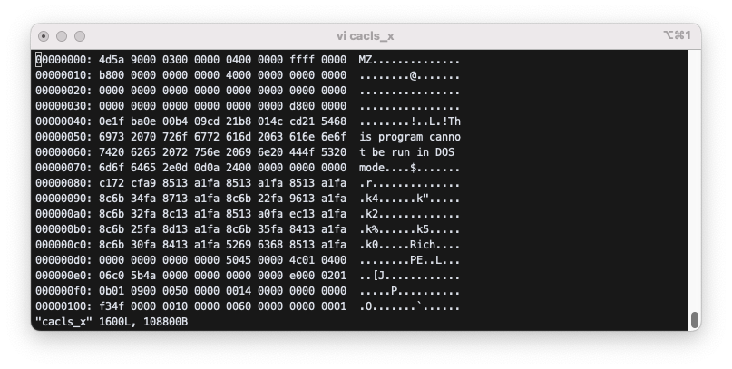

# PE format

## 0. PC malware

- collect information on target
- break-in
- install malware

Malware typically performs API hooking to control the system.

## 1. PE: Portable Executable file format for exe or dll file.

## 2. PE format

PE=dos header + image nt header + section table + sections

(Assume cacls.exe for below. Full analysis of cacls.exe is in Section 13.)

## 3. dos header

dos header = image dos header + dos stub

### 3.1 image dos header(64 byte)=

- 0,1: e_magic(2) : 4d 5a
- 2,3: e_cblp(2)
- .................
- 3c-3f:e_lfanew(4) : offset of IMAGE_NT_HEADER (00 00 00 D8 in cacls.exe)

### 3.2 dos stub: not used

## 4. image nt header

IMAGE_NT_HEADER=pe signature(4) + file header + optional header

### 4.1 pe signature

d8-db: pe signature=50 45 00 00 : PE

### 4.2 file header

```
IMAGE_FILE_HEADER=
             Machin(2)+NumberOfSections(2)+TimeDateStamp(4)+PointToSymbolTable(4)+
             NumberOfSymbols(4)+SizeOfOptionalHeader(2)+Characteristics(2)

   Machin: Intel386(0x014c), Intel64(0x0200), AMD64(0x8664), ...
   NumberOfSections: number of section headers in the section table
   SizeOfOptionalHeader: size of IMAGE_OPTIONAL_HEADER
   Characteristics: executable(0002), 32bit(0100), system file(1000), dll(2000), ...

dc-dd: machne. 4c 01
de-df: NumberOfSections. 04 00. 4 sections
```

### 4.3 optional header

IMAGE_OPTIONAL_HEADER= standard fields + NT additional fields

#### 4.3.1 standard fiedls

```
standard fields=Magic(2)+version(2)+SizeOfCode(4)+SizeOfInitializedData(4)+
     SizeOfUninitializedData(4)+AddressOfEntryPoint(4)+BaseOfCode(4)+BaseOfData(4)
```

(Every address in pe file is RVA(Relative Virtual Address) except Image Base which is a virtual address. Virtual address of x is the address of x in the virtual address space. Relative Virtual Address of x is the distance of x from the Image Base in the virtual address space. File offset of variable x is the location of x in the executable file. To compute the file offset of x, we need some known file offset, e.g. file offset of y=1000. Then rva(x) - rva(y) + file_offset(y) = file_offset(x).)

```
f0-f1: Magic. 0b 01. 32bit(010B), 64bit(020B), ROM(0107)
...
100-103: AddressOfEntryPoint. 00 00 4f f3. program starting address(the address of the
        first instruction). rva(entry point). eip=AddressOfEntryPoint+ImageBase.
        File_offset of AddressOfEntryPoint= rva(AddressOfEntryPoint)-rva(code)+file_offset(code)
        = 4ff3-1000+400=43f3.
104-107: BaseOfCode. 1000. rva(code). code segment starts at ImageBase+BaseOfCode
108-10b: BaseOfData. 6000. rva(data).  data segment starts at ImageBase+BaseOfData
```

#### 4.3.2 NT additional fields

```
NT additional fileds=ImageBase(4)+SectionAlignment(4)+FileAlignment(4)+
     os version(4)+image version(4)+subsystem version(4)+Win32VersionValue(4)+
     SizeOfImage(4)+SizeOfHeaders(4)+CheckSum(4)+Subsystem(2)+DllCharacteristics(2)+
     SizeOfStackReserve(4)+SizeOfStackCommit(4)+SizeOfHeapReserve(4)+SizeOfHeapCommit(4)+
     LoaderFlags(4)+NumberOfRvaAndSizes(4)+
     IMAGE_DATA_DIRECTORY[IMAGE_NUMBEROF_DIRECTORY_ENTRIES]

10c-10f: Image Base. 1000000. Image Base is the starting address of a process in its virtual address space. This is the only address which is not rva.

110-113: SectionAlignment. 0x1000
114-117: FileAlignment
...
134-136: 0003(console program). Subsystem: system drive file(0x01), gui(0x02), console(0x03)
........
14c-14f: NumberOfRvaAndSizes. 0x10. 16 entries in DataDirectory[]
        Each entry in DataDirectory[] is 4(relative virt addr)+4(size)=8, so we have
        16*8=128=0x80 bytes for DataDirectory. DataDirectory starts at 150; the end
        should be 150+80=1d0
150-153: export dir relative virtual addr
154-157: export dir size
158-15b: import dir. relative virt addr=55 54
15c-15f: import dir. size=64. each dll entry is 0x14 byte, so we have 64/14=5 dll imported
...............

IMAGE_DATA_DIRECTORY=VirtualAddress(4)+Size(4)
    export dir, import dir, resource dir, exception dir,
    security dir, base reloc table, debug dir, x86 usage,
    rva of gp, tls dir, load config dir, bound import dir,
    import address table, delay load import descr, com runtime desc
```

## 5. section table (4 section headers). 40 byte(0x28 byte) for each section header.

Each section header=name(8)+misc(4)+relative virtual address(4)+size(4)+file address(4)+ptr to reloc(4)+ptr to linenum(4)+num reloc(2)+num linenum(2)+characteristics(4)

- Section name example:
  - .bss: uninitialized data
  - .data: initialized data
  - .idata: import tables
  - .edata: export tables
  - .rdata: read-only data
  - .text: executable code
  - ................

## 6. rva to file offset

= rva - sect_virt_off + sect_file_offset

- sect_virt_off: rva of belonging section (0x1000 for text, 0x6000 for data)
- sect_file_offset: raw offset of this section (0x400 for text, 0x5400 for data)

3 steps: which section for this rva=>distance=>file address

- example: Import Directory rva=0x5554. What is file address of Import Directory?
  - 1. which section: .text
  - 2. distance: 5554-1000=4554
  - 3. file addr: 4554+400=4954

## 7. Import Directory has the pointer to an array of IMAGE_IMPORT_DESCRIPTOR. For each imported DLL, we have an IMAGE_IMPORT_DESCRIPTOR.

```
IMAGE_IMPORT_DESCRIPTOR(20 byte)=
   OriginalFirstThunk(4)+TimeDateStamp(4)+ForwarderChain(4)+Name(4)+FirstThunk(4)

   Name: x=pointer to DLL name
   OriginalFirstThunk(INT:Import Name Table): API name list from this DLL
pointer to IMAGE_THUNK_DATA32 pointer list
       IMAGE_THUNK_DATA32 pointer.u1.AddressOfData: pointer to IMAGE_IMPORT_BY_NAME
       IMAGE_IMPORT_BY_NAME: Hint(2 byte)+API name
   FirstThunk(IAT:Import Address Table): list of runtime function addresses for the API in OriginalFirstThunk

IMAGE_THUK_DATA32
     typedef struct _IMAGE_THUNK_DATA32{
 union{
DWORD ForwarderString;
DWORD Function;       // memory address of the imported function
DWORD Ordinal;
DWORD AddressOfData; // rva to IMAGE_IMPORT_BY_NAME
        } u1;
      } IMAGE_THUNK_DATA32;

typedef struct _IMAGE_IMPORT_BY_NAME{
    WORD Hint;
    Byte Name[1];
} IMAGE_IMPORT_BY_NAME;

158-15b: import dir. virt addr=55 54. file offset=5554-1000+400=4954
15c-15f: import dir. size=64. each dll entry is 0x14 byte, so we have 64/14=5 dll imported
        But the last one is nul entry. Therefore we have 4 DLLs imported

00004954: B8 55 00 00 FF FF FF FF FF FF FF FF 40 59 00 00 00 10 00 00
00004968: 08 56 00 00 FF FF FF FF FF FF FF FF 10 5B 00 00 50 10 00 00
0000497C: 9C 56 00 00 FF FF FF FF FF FF FF FF 9E 5C 00 00 E4 10 00 00
00004990: 28 57 00 00 FF FF FF FF FF FF FF FF 8C 5E 00 00 70 11 00 00
000049A4: 00 00 00 00 00 00 00 00 00 00 00 00 00 00 00 00 00 00 00 00

DLL 1:
   DLL name: 5940-1000+400=4D40
          41 44 56 41 50 49 33 32 2E 64 6C 6C 00 (ADVAPI32.dll)
   OriginalFirstThunk(INT): 55B8-1000+400=49B8
      48 57 00 00 5c 57 00 00
72 57 00 00 82 57 00 00 8e 57 00 00 9e 57 00 00
a8 57 00 00 e0 57 00 00 fc 57 00 00 16 58 00 00
30 58 00 00 44 58 00 00 5e 58 00 00 76 58 00 00
92 58 00 00 b2 58 00 00 ca 58 00 00 e8 58 00 00
08 59 00 00 00 00 00 00

5748-1000+400=4b48: 91 01 4c 6f 6b 75 70 41 63 63 6f 75 6e 74 53 69 64 57 00
          Hint: 0191. api:LookupAccountSidW
575c-1000+400=4b5c:: 8f 01 4c 6f 6f 6b 75 ............
          Hint: 018f. api:LookupAccountNameW
      .......................
   FirstThunk(IAT): 1000
```

## 8. EnumProcessModules(hProcess. hMods, cbsize, &cb)

return module handles in hMods for process hProcess

## 9. GetModuleFileNameEx(hProcess, hMod, szModName, sizeModName)

store name of hMod in hProcess into szModName.

## 10. showAllModules: display all modules of current process.

(Choose "multibyte character set" for all program: proj property>advanced>character set.)

```c
//#define PSAPI_VERSION 1
//#pragma comment(lib, "psapi.lib")
// you may need above two lines when there are compile errors
#include <windows.h>
#include <stdio.h>
#include <psapi.h>

int main()
{
    HMODULE hMods[1024];
    HANDLE hProcess;
    DWORD cbNeeded;
    unsigned int i;

// Get a handle to the current process.

    hProcess = GetCurrentProcess();
    if (NULL == hProcess)
        return 1;

   // Get a list of all the modules in this process.

    if( EnumProcessModules(hProcess, hMods, sizeof(hMods), &cbNeeded))
    {
        for ( i = 0; i < (cbNeeded / sizeof(HMODULE)); i++ )
        {
            char szModName[MAX_PATH];

            // Get the full path to the module's file.

            if ( GetModuleFileNameEx( hProcess, hMods[i], szModName, MAX_PATH))
            {
                // Print the module name and handle value.

                printf( "%s\n", szModName);
            }
        }
    }

    // Release the handle to the process.

    CloseHandle( hProcess );

    return 0;
}
```

## 11. displayAllApis: display all api names for all dlls in the current process. (You should add "imagehlp.lib" in the linker input/output option.)

```c
#include <windows.h>
#include <stdio.h>
#include <psapi.h>
#include <imagehlp.h>
#include <stdlib.h>

void show_allApiNames(HMODULE hMod){
	// Get the address of the module뭩 import section
        ULONG ulSize;
	PIMAGE_IMPORT_DESCRIPTOR pImportDesc =
		(PIMAGE_IMPORT_DESCRIPTOR)ImageDirectoryEntryToData(
			hMod,
			TRUE,
			IMAGE_DIRECTORY_ENTRY_IMPORT,
			&ulSize);

	// Does this module have an import section ?
	if (pImportDesc == NULL)
		return;

	while (pImportDesc->Name)
	{
	    PSTR pszModName = (PSTR)((PBYTE)hMod + pImportDesc->Name);
	    printf("\n========checking %s\n\n", pszModName);
	    //Get caller's INT. we need to add ImageBase of this DLL to compute VA since
            // OriginalFirstThunk is rva.
	    PIMAGE_THUNK_DATA pNThunk =
(PIMAGE_THUNK_DATA)((PBYTE)hMod + pImportDesc->OriginalFirstThunk);

	    // display all api names
	    printf("\n================displaying api names for this dll\n\n");
	    while (pNThunk->u1.AddressOfData) {
		   PIMAGE_IMPORT_BY_NAME pname =
(PIMAGE_IMPORT_BY_NAME)((PBYTE)hMod + pNThunk->u1.AddressOfData);
		   printf("api name:%s\n", pname->Name);
		   pNThunk++;
	    }
	    pImportDesc++;
	} // while
}

int main()
{
    HMODULE hMods[1024];
    HANDLE hProcess;
    DWORD cbNeeded;
    unsigned int i;

// Get a handle to the current process.

    hProcess = GetCurrentProcess();
    if (NULL == hProcess)
        return 1;

   // Get a list of all the modules in this process.

    if( EnumProcessModules(hProcess, hMods, sizeof(hMods), &cbNeeded))
    {
        for ( i = 0; i < (cbNeeded / sizeof(HMODULE)); i++ )
        {
            char szModName[MAX_PATH];

            // Get the full path to the module's file.

            if ( GetModuleFileNameEx( hProcess, hMods[i], szModName, MAX_PATH))
            {
                // Print the module name and handle value.
                // hMods[i] is the ImageBase of the i-th DLL

                printf( "\n============module %s\n", szModName);
                show_allApiNames(hMods[i]);
            }
        }
    }

    // Release the handle to the process.

    CloseHandle( hProcess );

    return 0;
}
```

## 12. Homework

Do not use PEview for following homework. Only check your answer with PEview. If you are using MacOS, use `xxd` instead of `HxD` and skip PEview part, or install virtual machine with windows in it.

### 1) Open `cacls.exe` with `HxD` and extract following informtion: `e_lfanew`, `NumberOfSections`, `AddressOfEntryPoint`, `BaseOfCode`, `BaseOfData`, and `ImageBase`.

```bash
$ xxd cacls.exe > cacls_x
```

```
......  : .... .... .... .... .... .... .... ....  ................
00000030: 0000 0000 0000 0000 0000 0000 d800 0000  ................
......  : .... .... .... .... .... .... .... ....  ................
000000d0: 0000 0000 0000 0000 5045 0000 4c01 0400  ........PE..L...
......  : .... .... .... .... .... .... .... ....  ................
00000100: f34f 0000 0010 0000 0060 0000 0000 0001  .O.......`......
......  : .... .... .... .... .... .... .... ....  ................
```



값을 읽을 때는 역순으로 읽는다.

- `e_lfanew` (0x03c-0x03f) : 0000 00d8
- `NumberOfSections` (0x0de-0x0df) : 0004
- `AddressOfEntryPoint` (0x100-0x103) : 0000 4ff3
- `BaseOfCode` (0x104-0x107) : 0000 1000
- `BaseOfData` (0x108-0x10b) : 0000 0060
- `ImageBase` (0x10c-0x10f) : 00100 0000

### 2) How many sections are there in `cacls.exe`? Show the name, rva, and file offset of all section.

`NumberOfSections`의 값이 4이므로, `cacls.exe`에는 4개의 section들이 있다.

```
......  : .... .... .... .... .... .... .... ....  ................
000001d0: 2e74 6578 7400 0000 964e 0000 0010 0000  .text....N......
000001e0: 0050 0000 0004 0000 0000 0000 0000 0000  .P..............
000001f0: 0000 0000 2000 0060 2e64 6174 6100 0000  .... ..`.data...
00000200: 5804 0000 0060 0000 0002 0000 0054 0000  X....`.......T..
00000210: 0000 0000 0000 0000 0000 0000 4000 00c0  ............@...
00000220: 2e72 7372 6300 0000 e007 0000 0070 0000  .rsrc........p..
00000230: 0008 0000 0056 0000 0000 0000 0000 0000  .....V..........
00000240: 0000 0000 4000 0040 2e72 656c 6f63 0000  ....@..@.reloc..
00000250: be04 0000 0080 0000 0006 0000 005e 0000  .............^..
00000260: 0000 0000 0000 0000 0000 0000 4000 0042  ............@..B
......  : .... .... .... .... .... .... .... ....  ................
```

4개의 section들은 각각 `.text`, `.data`, `.rsrc`, `.reloc`이다.

- `.text`
  - RVA : 1000
  - File Offset : 400
- `.data`
  - RVA : 6000
  - File Offset : 5400
- `.rsrc`
  - RVA : 7000
  - File Offset : 5600
- `.reloc`
  - RVA : 8000
  - File Offset : 5e00

### 3) What is the file offset for IMAGE_DATA_DIRECTORY array? What is the file offset of the import directory? How many DLLs do you see in the import directory?

```
......  : .... .... .... .... .... .... .... ....  ................
00000150: 0000 0000 0000 0000 5455 0000 6400 0000  ........TU..d...
......  : .... .... .... .... .... .... .... ....  ................
```

- IMAGE_DATA_DIRECTORY의 file offset은 0x150이다.
- import directory의 file offset : 0x5554(rva) - 0x1000(rva of .text) + 0x400(file offset of .text) = 0x4954

```
......  : .... .... .... .... .... .... .... ....  ................
00004950: 1653 0001 b855 0000 ffff ffff ffff ffff  .S...U..........
00004960: 0010 0000 0856 0000 ffff ffff  @Y.......V......
00004970: ffff ffff 105b 0000 5010 0000 9c56 0000  .....[..P....V..
00004980: ffff ffff ffff ffff 9e5c 0000 e410 0000  .........\......
00004990: 2857 0000 ffff ffff ffff ffff 8c5e 0000  (W...........^..
000049a0: 7011 0000 0000 0000 0000 0000 0000 0000  p...............
......  : .... .... .... .... .... .... .... ....  ................
```

해당 위치로 가보면 총 4개의 dll이 존재한다.

### 4) Show the file offset of OriginalFirstThunk, Name, and FirstThunk for all DLLs in cacls.exe.

```
......  : .... .... .... .... .... .... .... ....  ................
00004950: 1653 0001 b855 0000 ffff ffff ffff ffff  .S...U..........
00004960: 0010 0000 0856 0000 ffff ffff  @Y.......V......
00004970: ffff ffff 105b 0000 5010 0000 9c56 0000  .....[..P....V..
00004980: ffff ffff ffff ffff 9e5c 0000 e410 0000  .........\......
00004990: 2857 0000 ffff ffff ffff ffff 8c5e 0000  (W...........^..
000049a0: 7011 0000 0000 0000 0000 0000 0000 0000  p...............
......  : .... .... .... .... .... .... .... ....  ................
```

|                    | < ADVAPI32.dll | >          | < KERNEL32.dll | >          | < msvcrt.dll | >          | < ntdll.dll | >          |
| ------------------ | -------------- | ---------- | -------------- | ---------- | ------------ | ---------- | ----------- | ---------- |
| 항목               | rva            | FileOffset | rva            | FileOffset | rva          | FileOffset | rva         | FileOffset |
| OriginalFirstThunk | 55b8           | 49b8       | 5608           | 4a08       | 569c         | 4a9c       | 5728        | 4b28       |
| Name               | 5940           | 4d40       | 5b10           | 4f10       | 5c9e         | 509e       | 5e8c        | 528c       |
| FirstThunk         | 1000           | 400        | 1050           | 450        | 10e4         | 4e4        | 1170        | 570        |

### 5) Go to the file offset you found in 4) and show names and first 5 API names for all DLLs in cacls.exe.

### 6) Repeat 1)-5) for the programs in Sect 10 and 11. Also run the programs and compare the results with your analysis.

## 13. cacls.exe

### 13.1. dos header

- 0-1: 4D5A : e_magic
- 3c-3f: 00 00 00 d8 e_lfanew. file addr of pe header

### 13.2. nt header: pe signature+file header

- d8-db: 50 45 00 00. pe signature
- dc-dd: mach. 4c 01
- de-df: NumberOfSections. 04 00. 4 sections
- e0-e3: TimeDateStamp. 06 c0 5b 4a
- e4-e7: PointerToSymbolTable. 00 00 00 00
- e8-eb: NumberOfSymbols. 00 00 00 00
- ec-ed: SizeOfOptionalHeader. e0 00. 224 bytes
- ee-ef: Characteristics. 02 01. executable, 32bit machine

### 13.3. nt header: optional header

- f0-f1: magic. 0b 01 (32bit application). 0b02 (64bit app) 0x107 (ROM image)
- f2, f3: major linker version(09), minor linker version(00)
- f4-f7: SizeOfCode. 00 50 00 00 = 50 00
- f8-fb: SizeOfInitializedData. 14 00
- fc-ff: SizeOfUninitializedData. 00
- 100-103: AddressOfEntryPoint. 4f F3. eip=ImageBase+AddressOfEntryPoint
- 104-107:BaseOfCode. 1000.
- 108-10b:BaseOfData. 6000
- 10c-10f:ImageBase. 01 00 00 00.
- 110-113:SectionAlignment. 10 00. section size
- 114-117: FileAlignment. 200.
- 118-119: Major OS version. 6
- 11a-11b: Minor OS version. 0
- 11c-11d, 11e-11f: major, minor image version: 6, 1
- 120-121, 122-123: major, minor subsystem version. 6, 1
- 124-127: reserved1
- 128-12b: SizeOfImage. 900
- 12c-12f: SizeOfHeaders. 400.
- 130-133: CheckSum
- 134-135: SubSystem. 3(CUI), 2(GUI), 1(driver program)
- 136-137: DllCharacteristics. 40 81
- 138-13b: SizeOfStackReserve. 400 00
- 13c-13f: SizeOfStackCommit: 20 00
- 140-143: SizeOfHeapReserve: 10 00 00
- 144-147: SizeOfHeapCommit. 10 00
- 148-14b: LoaderFlags. 00
- 14c-14f: NumberOfRvaAndSizes. 10.
- 150-153: export dir virtual addr. 00
- 154-157: export dir size. 00
- 158-15b: import dir. virtual addr. 55 54
- 15c-15f: import dir. size. 64
- 160-167: resource dir. virt addr 70 00, size 7e0
- 168-16f: exception dir. 00
- 170-177: security directory. 00
- 178-17f: base relocation table. virt addr 80 00. size 3c4
- 180-187: debug dir. virt addr 11b0, size 1c
- 188-18f: architecture specific data. 00
- 190-197: RVA of GP. 00
- 198-19f: TLS directory. 00
- 1a0-1a7: load configuration dir. virt addr 15 28. size 40
- 1a8-1af: bound import dir in headers. virt addr 270. size 58
- 1b0-1b7: Import Address Table. virt addr 10 00 size 190
- 1b8-1bf: Delay load import descriptors. 00
- 1c0-1c7: COM runtime descriptor 00
- 1c8-1cf: 00

### 13.4. section header table(4 section headers)

- 1d0-1d7: name. ".text" -- text section (code section)
- 1d8-1db: misc. 4e 96
- 1dc-1df: VirtualAddress. 10 00. offset of this section from ImageBase. same as BaseOfCode
- 1e0-1e3: SizeOfRawData. 50 00. Same as SizeOfCode
- 1e4-1e7:PointerToRawData. 400. section starting location in this file
- 1e8-1eb:PointerToRelocations. 00
- 1ec-1ef:PointerToLinenumbers. 00
- 1f0-1f1: NumberOfRelocations. 00
- 1f2-1f3: NumberOfLinenumbers. 00
- 1f4-1f7: Characteristics. 60 00 00 20. code, readable, executable.
- 1f8-1ff: name. ".data"
- 200-203: misc.
- 204-207: VirtualAddress. 60 00
- 208-20b: SizeOfRawData. 200
- 20c-20f: PointerToRawData. 54 00
- 210-213:PointerToRelocations. 00
- 214-217:PointerToLinenumbers. 00
- 218-219:NumberOfRelocations. 00
- 21a-21b:NumberOfLinenumbers. 00
- 21c-21f:Characteristics. c0 00 00 40. writable, readable, data
- 220-227:name. ".rscr"
- 228-22b: misc.
- 22c-22f: VirtualAddress. 70 00
- 230-233: SizeOfRawData. 800
- 234-237: PointerToRawData. 56 00
- 238-23b:PointerToRelocations. 00
- 23c-23f:PointerToLinenumbers. 00
- 240-241:NumberOfRelocations. 00
- 242-243:NumberOfLinenumbers. 00
- 244-247:Characteristics. 40 00 00 40. readable, data
- 248-24f: name. ".reloc"
- 250-253: misc.
- 254-257: VirtualAddress. 80 00
- 258-25b: SizeOfRawData. 600
- 25c-25f: PointerToRawData. 5e 00
- 260-263:PointerToRelocations. 00
- 264-267:PointerToLinenumbers. 00
- 268-269:NumberOfRelocations. 00
- 26a-26b:NumberOfLinenumbers. 00
- 26c-26f:Characteristics. 42 00 00 40. writable, executable, data
