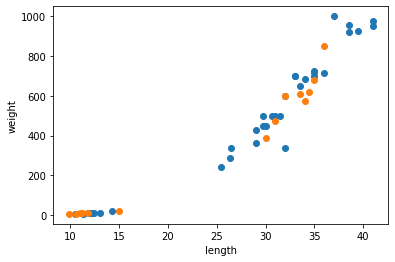
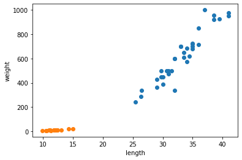

# Intro2ML

## Class Variation
> Intra-class Variation VS. Inter-class Variation

Class Variation이란 데이터의 클래스가 얼마나 떨어져 있는지(분산)을 나타내는 표현이다.

Class Variation의 표현에는 크게 **Inter-class Variation**과 **Intra-class Variation**이 있다.

- ***Inter*-class Variation** : ***다른*** 클래스 간의 분산을 나타내는 표현
- ***Intra*-class Variation** : ***같은*** 클래스 내부의 분산을 나타내는 표현

두 단어들의 발음이 비슷해서 더 헷갈리는 것 같다. 하지만 [인트라넷](https://ko.wikipedia.org/wiki/%EC%9D%B8%ED%8A%B8%EB%9D%BC%EB%84%B7)이 어떤 조직의 폐쇄적인 ***내부***망을 의미한다는 것을 떠올리면 어렵지 않다.

### Examples

 <b>Example 1</b>

  

 <b>Example 2</b>

위 두 예시들은 데이터들의 클래스 분포를 색깔로 나타낸 점이다. 

- ***Inter*-class Variation**
    - Inter-class Variation이 **작은** 경우
        - Example 1은 두 클래스가 **가까이 섞여** 있으므로,  Inter-class Variation가 **작다**.
    - Inter-class Variation이 **큰** 경우
        - Example 2는 두 클래스가 **멀리 떨어져** 있으므로,  Inter-class Variation가 **크다**.
- ***Intra*-class Variation**
    - Intra-class Variation이 **작은** 경우
        - Example 1은 (Example 2에 비해 비교적) 같은 색의 클래스들이 **멀리 떨어져** 있으므로,  Intra-class Variation가 **크다**.
    - Intra-class Variation이 **큰** 경우
        - Example 2는 (Example 1에 비해 비교적) 같은 색의 클래스들이 **가까이 붙어** 있으므로,  Intra-class Variation가 **작다**.

## Distance Metric to Compare Vectors(Data)
> L1 Distance (Manhattan distance) VS. L2 Distance (Euclidean distance)

L1 Distance와 L2 Distance는 두 벡터 간의 거리 또는 유사성을 측정하는 일반적인 방법이다.

Manhattan distance라고도 하는 **L1 Distance**는 두 벡터의 해당 요소 간 **절대 차이의 합**이다. 

수학적으로 두 벡터 p와 q 사이의 L1 Distance는 아래와 같이 정의된다.

**L1 Distance (Manhattan distance):** 
$$
\begin{equation}
d_{1}(\mathbf{p},\mathbf{q}) = \sum_{i=1}^{n} |p_{i}-q_{i}|
\end{equation}
$$

택시가 한 지점에서 다른 지점으로 이동하기 위해 그리드와 같은 도로 시스템을 따라 이동해야 하는 거리를 측정한다는 사실에서 이름을 얻었다고 한다. 여기서 그리드 선은 일련의 직각을 형성한다. 

 

유클리드 Distance라고도 하는 **L2 Distance**는 두 벡터의 해당 요소 간 **차이 제곱합의 제곱근**이다. 직선의 두 점 사이의 최단 거리를 측정한다는 사실에서 이름이 붙여졌다. 수학적으로 두 벡터 p와 q 사이의 L2 거리는 다음과 같이 정의된다.

**L2 Distance (Euclidean distance):** 
$$
\begin{equation}
d_{2}(\mathbf{p},\mathbf{q}) = \sqrt{\sum_{i=1}^{n} (p_{i}-q_{i})^2}
\end{equation}
$$

일반적으로 L2 Distance는 벡터 요소 간의 차이 크기를 고려하기 때문에 L1 Distance보다 더 일반적으로 사용되는 반면, L1 Distance는 절대 값만 고려한다.  
그러나 L1 Distance는 요소 간 차이의 크기가 다르고 부호가 중요한 상황에서 유용하게 사용된다.

### Examples

아래 그림들은 L1 Distance와 L2 Distance를 시각화한 그림이다.

 <b>Example 1</b>

  

 <b>Example 2</b>

  

 <b>Example 3</b>

## Regression Loss Functions
> L1 Loss (Mean Absolute Error) VS. L2 Loss (Mean Squared Error)

**평균 절대 오차**(MAE)라고도 하는 **L1 Loss**과 **평균 제곱 오차**(MSE)라고도 하는 **L2 Loss**은 대상 변수의 예측 값과 실제 값 간의 차이 또는 오류를 측정하기 위해 회귀(Regression) 작업에 사용되는 손실 함수이다. 

 

**L1 Loss (Mean Absolute Error):**
$$
\begin{equation}
L_{1}=\frac{1}{n}\sum_{i=1}^{n}|y_{i}-\hat{y}_{i}|
\end{equation}
$$
 

**L2 Loss (Mean Squared Error):**
$$
\begin{equation}
L_{2}=\frac{1}{n}\sum_{i=1}^{n}(y_{i}-\hat{y}_{i})^2
\end{equation}
$$ 

 

**L1 Loss**은 예측 값과 실제 값 간의 **절대 차이**를 계산하는 반면 **L2 Loss**은 **차이 제곱**을 계산한다.

이러한 손실 함수를 사용하는 목적은 학습 중에 예측 값과 실제 값 간의 **차이 또는 오류를 최소화**하기 위함이다.

## L@ Loss와 L@ Distance의 주요 차이점
> L@ Loss VS. L@ Distance

L1 Loss, L2 Loss, L1 Distance, L2 Distance는 유사한 수학 공식을 공유하지만, 서로 다른 용도로 사용된다. 

L@ Loss는 회귀 작업에서 예측 값과 실제 값의 차이 또는 오류를 측정하는데 사용되는 반면, L@ Distance는 거리 또는 두 벡터 사이의 유사성을 측정하는데에 사용된다.

## Split Data
> 데이터셋을 분리하는 이유는 무엇인가?

데이터셋을 train set, validation set, test set으로 나누는 이유는 이전에 보지 못한 데이터로 딥러닝 모델의 성능을 평가할 수 있는 방법을 갖기 위함이다. 

train set는 모델을 훈련시키는 데 사용되며, validation set는 모델 하이퍼파라미터를 조정하는 데 사용되며, test set는 본 적이 없는 데이터에 대한 모델의 최종 성능을 평가하는 데 사용된다.

