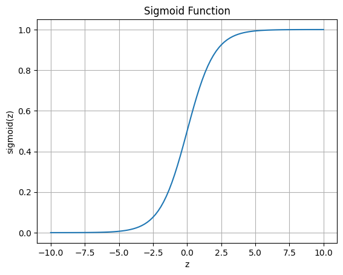

# Supervised Learning

## K-Nearest Neighbors
> What is K-Nearest Neighbors?

K-Nearest Neighbors(K-최근접 이웃, K-NN)은 머신 러닝 알고리즘 중 하나로, 데이터 분류 및 회귀 분석에 사용되는 Supervised Learning 방식의 알고리즘이다. K-NN은 데이터를 분류할 때, 가장 가까운 K개의 이웃 데이터 포인트를 찾아 이들의 클래스를 기반으로 해당 데이터 포인트의 클래스를 결정한다. 이 때, 데이터 간의 거리를 측정할 때에는 L2 Distance (Euclidean distance)가 사용된다. 

### K-NN의 장점
- 단순하고 효율적이다.
- 모델 훈련이 필요하지 않다.
- 학습 데이터가 많은 경우에도 학습 시간이 빠르다.
- 다중 클래스 분류가 가능하다.

### K-NN의 단점
- 데이터가 많아지면 계산량이 많아지면서 시간이 오래 걸린다.
- 적절한 k 값의 선택이 필요하다.
- 모델을 생성하지 않아 특징과 클래스 간 관계를 이해하는 데 제한적이다.
- 예측하기 전에 데이터를 정규화해야 한다. 
    - 이는 알고리즘이 데이터 점 사이의 거리를 기반으로 하고 데이터 점 사이의 거리는 척도의 차이에 의해 영향을 받을 수 있기 때문이다.

## 회귀와 분류
> Regression VS. Classification

기계 학습 중 Supervised Learning에는 두 가지 유형이 있다. 바로 회귀 (Regression) 및 분류 (Classification)이다. 

회귀는 연속적인 숫자 값을 예측하는 데 사용되는 예측 모델링 유형이다. 회귀의 목표는 새 데이터에 대한 예측을 만드는 데 사용할 수 있는 입력 변수와 출력 변수 간의 관계를 설정하는 것이다. 회귀 작업의 예로는 평방 피트 및 침실 수와 같은 기능을 기반으로 주택 가격을 예측하거나 온도 및 습도와 같은 기능을 기반으로 강우량을 예측하는 것이 있다.

반면 분류는 데이터 포인트가 속한 클래스 또는 범주를 예측하는 데 사용된다. 분류의 목표는 입력 공간에서 서로 다른 클래스를 구분하는 결정 경계를 학습하는 것이다. 분류 작업의 예로는 이메일이 스팸인지 여부를 예측하거나 환자의 증상을 기반으로 특정 질병이 있는지 예측하는 것이 있다.

회귀와 분류의 주요 차이점은 예측하는 출력 변수의 유형이다. **회귀**는 연속적인 숫자 값을 예측하는 반면 (**continuous**), <br>**분류**는 데이터 포인트가 속한 클래스 또는 범주를 예측한다 (**discrete**).

요약하면 아래와 같다.

- **회귀 (Regression)** : **연속(continuous) 값** 예측
    - e.g., 실내 온도 예측
- **분류 (Classifiacation)** : **이산(discrete) 값** 예측
    - 이진 분류 (Binary Classification): 출력이 0 또는 1
    - 다중 클래스 분류 (Multi-class Classifiacation) : N 클래스 집합


## Logistic Regression for Binary Classification

Logistic Regression은 이진 분류(Binary Classification) 문제를 해결하기 위한 통계학적 방법 중 하나이다. 이 알고리즘은 입력 특성(feature)과 이진 분류 결과(target) 사이의 관계를 모델링하고, 이를 통해 새로운 입력값에 대한 분류 결과를 예측한다.

Logistic Regression은 입력값과 가중치(weight)의 선형 조합을 계산한 후, 이를 Logistic Function에 적용하여 확률값을 계산한다. 이 확률값을 분류 문제에서는 0.5를 기준으로 0 또는 1로 분류한다.

Logistic Regression이 이진 분류에 적합한 이유는 다음과 같다.
- Logistic Function를 사용하여 출력값을 0과 1 사이의 값으로 한정시킬 수 있다.
- Logistic Function의 출력값은 확률값으로 해석될 수 있어, 분류 문제에서 신뢰도를 예측하는데에 활용될 수 있다.
- 입력값과 가중치의 선형 조합을 계산하는 과정이 간단하고, 모델이 적은 수의 파라미터를 가지므로 모델 학습이 빠르다.

하지만 Logistic Regression도 몇 가지 단점이 있다.
- 입력값과 출력값의 관계를 선형으로 가정하므로, 복잡한 비선형 문제에서는 성능이 떨어진다.
- 클래스 간의 경계선이 직선일 경우에만 적용 가능하다.


### Sigmoid for Binary Classification
Sigmoid Function는 Logistic Function 중 하나로, 입력값을 0과 1 사이의 값으로 변환시켜주는 함수이다. 이 함수는 이진 분류(Binary Classification)에서 매우 자주 사용되며, 출력값을 확률로 다루는 경우에도 많이 사용된다.

Sigmoid Function의 수식은 다음과 같다.

$$
sigmoid(z) = \frac{1}{1 + e^{-z}}
$$

여기서 e는 자연상수이고, z는 입력값을 의미한다. 

이 함수를 그래프로 표현하면 아래 그래프처럼 S자 형태를 갖게 된다.

<!-- ```python
import matplotlib.pyplot as plt
import numpy as np

def sigmoid(z):
    return 1 / (1 + np.exp(-z))

# generate values for the input variable z
z = np.linspace(-10, 10, 100)

# compute the sigmoid function for each value of z
y = sigmoid(z)

# plot the sigmoid function
plt.plot(z, y)
plt.xlabel('z')
plt.ylabel('sigmoid(z)')
plt.title('Sigmoid Function')
plt.grid(True)
plt.show()
``` -->

<p align="center">

</p>

입력값 z가 0으로 가까워질수록 출력값은 0.5에 수렴하고, <br>
입력값 z가 큰 양수일 경우 출력값은 1에 가까워지며,<br> 
입력값 z가 큰 음수일 경우 출력값은 0에 가까워진다.

Sigmoid Function의 장점은 다음과 같다.
- 출력값이 항상 0과 1 사이에 있어 이진 분류 문제에 적합하다.
- 함수의 미분이 쉽고, 복잡한 모델에서도 계산이 쉽다.
- 출력값이 확률로 해석될 수 있어, 분류 문제에서 신뢰도를 예측하는데에 활용될 수 있다.

하지만 Sigmoid Function는 몇 가지 단점도 갖고 있다.
- 출력값의 범위가 0과 1로 한정되어 있어, 다중 분류 문제에서는 사용이 어렵다.
- 입력값이 크거나 작은 경우, 그래프의 기울기가 0에 수렴하여, 역전파 과정에서 기울기 소실 문제가 발생할 수 있다.

참고로, 다중 분류 문제에서는 Softmax 함수를 사용하고, 기울기 소실 문제를 해결하기 위해서는 ReLU와 같은 함수를 사용한다.

### Logistic Function와 Sigmoid Function의 차이점
Logistic Function와 Sigmoid Function의 차이점은 주로 사용되는 목적과 수식의 의미에서 차이가 있다. 

Logistic Function는 Logistic Regression에서 사용되는 확률 모델링을 위한 함수이며, 입력값과 출력값의 관계를 모델링하는 데에 사용된다. 

반면, Sigmoid Function는 다양한 분야에서 데이터의 스케일링, 정규화, 분류 등에 사용된다.

따라서, Logistic Function는 Logistic Regression에서 특정 목적으로 사용되는 함수이며, Sigmoid Function는 다양한 분야에서 활용되는 일반적인 함수이다.

## SVM Classifier VS. Softmax Classifier
> SVM Classifier VS. Softmax Classifier

SVM Classifier와 Softmax Classifier는 모두 분류 알고리즘 중 하나로, 입력 데이터를 미리 정의된 클래스로 분류하는 것을 목적으로 한다. 하지만 두 알고리즘은 동작 방식이 다르다.

먼저 SVM Classifier는 Support Vector Machine의 약자로, 각 클래스를 분리하는 최적의 초평면(hyperplane)을 찾아서 데이터를 분류한다. 이때 SVM은 데이터를 분류할 때, Margin(여유 공간)을 최대화하는 초평면을 찾아내어, 새로운 데이터가 들어왔을 때 분류를 더 잘할 수 있도록 한다. SVM은 이 Margin을 최대화하면서, 이상치(outlier)에 대해서는 덜 민감한 모델을 만들 수 있다.

반면에 Softmax Classifier는 입력 데이터를 각 클래스로 분류할 확률을 계산한다. 이때 Softmax 함수를 사용하여, 입력 데이터가 각 클래스에 속할 확률을 구해낸다. Softmax 함수는 입력값을 일종의 확률값으로 변환하여, 모든 클래스에 대한 확률의 합이 1이 되도록 만들어 준다. 따라서 Softmax Classifier는 다중 클래스 분류 문제에 적합하다.

SVM과 Softmax Classifier의 차이점을 간단히 정리하면 다음과 같다.

1. SVM은 Margin을 최대화하여 이상치(outlier)에 대해 덜 민감한 모델을 만들 수 있다. Softmax Classifier는 다중 클래스 분류 문제에 적합한 모델이다.
2. SVM은 초평면(hyperplane)을 사용하여 데이터를 분류한다. Softmax Classifier는 입력 데이터를 각 클래스로 분류할 확률을 계산한다.
3. SVM은 이진 분류 문제와 다중 클래스 분류 문제에 모두 적용 가능하다. Softmax Classifier는 다중 클래스 분류 문제에 적용 가능하다.

### Softmax function

Softmax fuction의 수식은 아래와 같다.

$$\sigma (\textup{z})_i =\frac{ \exp(z_i)}{\sum_{j=1}^{K}\exp(z_j)}$$

- 여기서 $\exp$의 기능은 두가지가 있다.
    1. 모든 값들을 0 이상의 값으로 만들어준다.
    2. 큰 값은 더 크게, 작은 값은 더 작게 만들어준다.

## Information Theory
> (Shannon) Entropy, Cross Entropy, KL Divergence

참고하면 좋은 자료 : [KL divergence - 공돌이의 수학정리노트](https://angeloyeo.github.io/2020/10/27/KL_divergence.html#kl-divergence-%EC%A0%95%EB%B3%B4-%EC%97%94%ED%8A%B8%EB%A1%9C%ED%94%BC%EC%9D%98-%EC%83%81%EB%8C%80%EC%A0%81-%EB%B9%84%EA%B5%90)

### Entropy
**Entropy**는 정보 이론에서 사용되는 개념 중 하나로, 어떤 확률 분포가 가지는 정보의 평균적인 양을 나타내는 값이다. 

정보량이 많을수록 Entropy 값은 높아지며, 정보량이 적을수록 Entropy 값은 낮아진다. 

*(엔트로피가 크다 = 무질서도가 크다 = 예측 불가능)*

$$H(X) = - \sum_{i=1}^{n} p(x_i) log_2 p(x_i)$$

여기서 p(x)는 확률 분포를 나타낸다.

#### Examples
엔트로피를 이해하기 위해 동전 던지기의 예를 고려할 수 있다. 

공정한 동전이 있다면 이 시스템의 엔트로피는 1이 될 것이다. 즉, 평균적으로 각 동전 던지기에서 1비트의 정보를 받을 것으로 예상된다. 

그러나 편향된 코인이 있으면 시스템의 불확실성과 무작위성이 적기 때문에 엔트로피가 낮아진다. 예를 들어 항상 앞면이 나오는 동전이 있는 경우 결과에 불확실성이 없기 때문에 이 시스템의 엔트로피는 0이 된다.

<br>

엔트로피의 또 다른 예는 언어 모델이 있다. 언어 모델의 엔트로피는 이전 단어를 기반으로 문장의 다음 단어를 예측하는 데 필요한 평균 정보량을 나타낸다. 

언어 모델이 큰 텍스트 코퍼스에 대해 학습되면 다음 단어를 예측할 때 불확실성이 적기 때문에 엔트로피가 낮아진다.

### Cross Entropy
**Cross Entropy**는 두 확률 분포 간의 차이를 나타내는 값으로, 예측 모델의 결과값과 실제 값의 차이를 계산할 때 사용된다. 

$$H(P, Q) = -\sum_{i=1}^{n} P(x_i) log(Q(x_i))$$

여기서 p(x)는 **실제 정답값**의 확률 분포, q(x)는 **예측 값의 확률 분포**를 나타낸다.

### KL Divergence

**KL Divergence**는 **두 확률 분포 간의 차이**를 측정하는 지표 중 하나로, 기계 학습 및 정보 이론에서 예측 분포를 목표 분포와 비교하는 데 자주 사용된다.

KL Divergence가 작으면 예측한 확률 분포가 실제 확률 분포와 비슷하다는 뜻이고, 클수록 차이가 크다는 뜻이다.

$$D_{KL}(P | Q) = \sum_{i=1}^{n} P(x_i) \log \frac{P(x_i)}{Q(x_i)}$$

여기서 p(x)는 실제 값의 확률 분포, q(x)는 예측 값의 확률 분포를 나타낸다. 

### KL Divergence VS. Cross Entropy
KL Divergence와 Cross Entropy는 유사하지만, KL Divergence는 두 확률 분포 간의 차이를 측정할 때 **비대칭성을 가진다**는 차이점이 있다. 

KL Divergence에서는 $D_{KL}(P | Q)$와 $D_{KL}(Q | P)$가 서로 다를 수 있는 반면, Cross Entropy는 항상 대칭적으로 계산된다. 

따라서 KL Divergence는 Cross Entropy보다 더 엄격한 지표로써 예측 모델의 성능을 더욱 정확하게 평가할 수 있다.