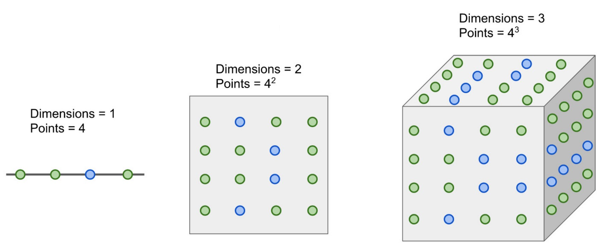
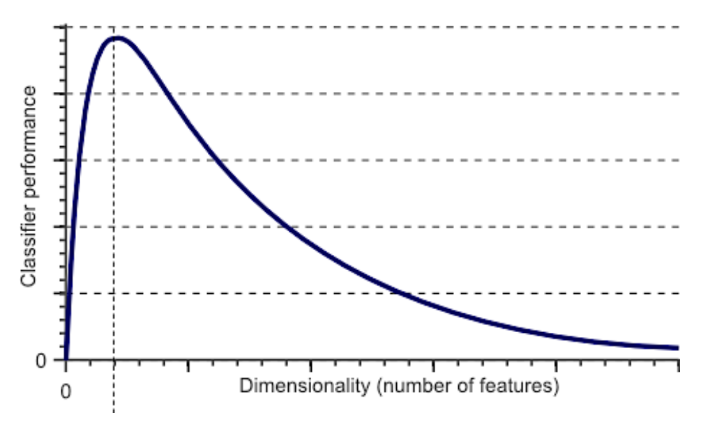
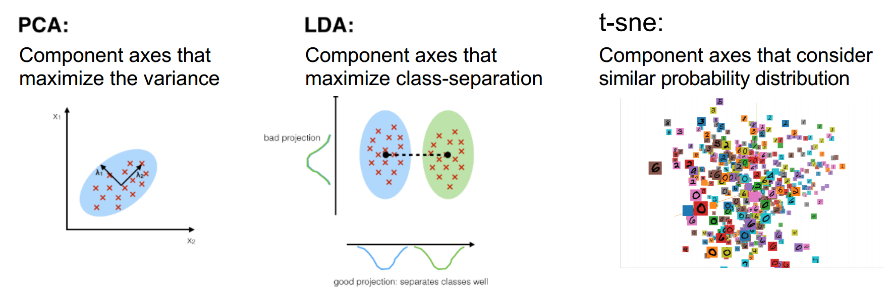
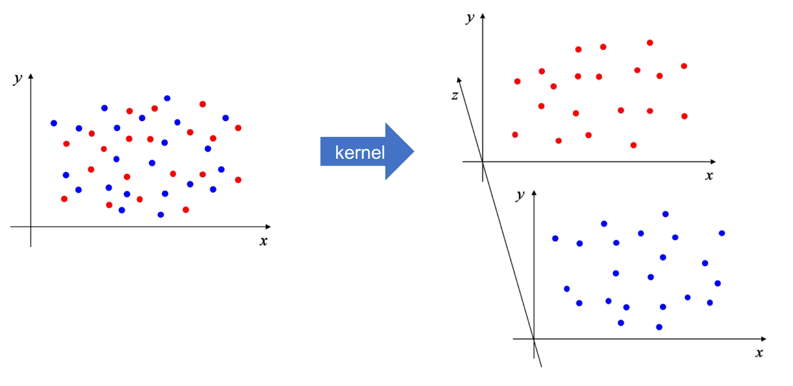

# Neural Networks

## 활성화 함수(Activation Function)

- 활성화 함수(Activation Function)란 인공 신경망(Neural Network)에서 사용되는 은닉층(Hidden Layer)을 활성화하기 위해 **Non-linear한 함수를 사용하여 Output 뉴런을 바꿔주는 함수**이다.
- 활성화 함수를 사용하는 이유는, 활성화 함수가 전체 인공 신경망(Neural Network)이 표현할 수 있는 함수를 더 다양하게 만들어주기 때문이다.

## Curse of dimensionality (차원의 저주)

1. 차원이 늘어나면, 샘플 데이터의 수도 같이 늘어나야 한다.
2. 차원이 늘어나는데 샘플 데이터 수가 늘어나지 낳으면, 오히려 모델이 학습에 실패할 확률이 늘어난다.

### 차원 수에 따른 모델의 성능 그래프
샘플 데이터의 수는 고정하고, 차원을 늘렸을 때의 모델 성능 그래프

### Dimensionality Reduction

- 목적
    1. 차원을 축소함으로써, curse of dimensionality를 줄일 수 있다.
    2. Visualize를 할 수 있다.

### Dimensionality Expansion

- 목적
    - 차원을 적당히 늘려줌으로써, 데이터의 해석을 쉽게 할 수도 있음
     

# References

1. 인공지능 응용 (ICE4104), 인하대학교 정보통신공학과 홍성은 교수님