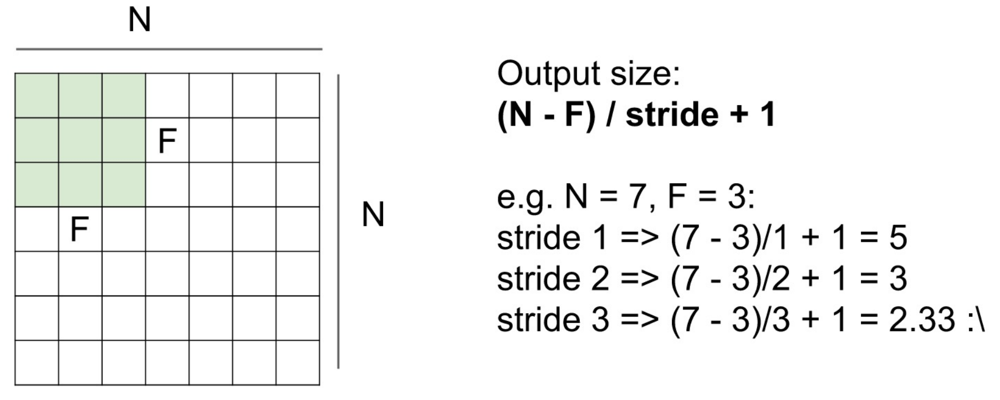
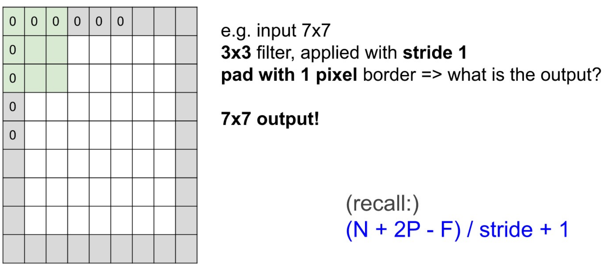
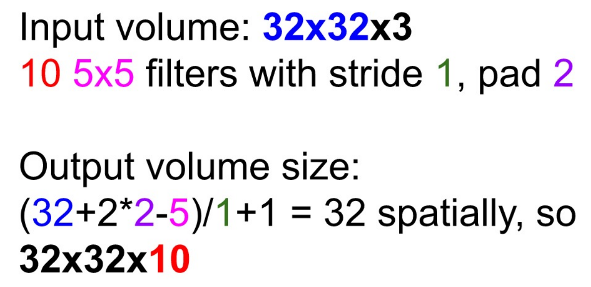
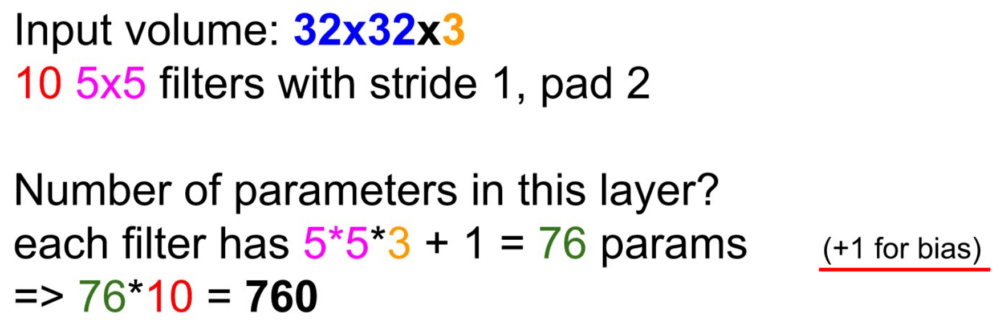
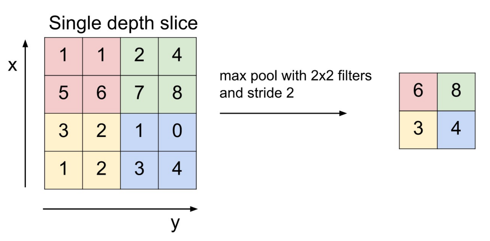

# CNN (Convolutional Neural Network)

## Basic Operations in CNN

### Fully-Connected (FC) Layer

- **Flatten** : `32x32x3` image -> stretch to `3072x1`
    - `32x32x3` image
        - preserve spatial structure

### Convolutional Layer

역할 : Rawdata를 응축시켜서 많은 정보를 담게 하기 위한 목적

#### Output Size of Convolutional Layer

#### Output Size of Zero Padding

#### Examples (1)

- Input volume : `32x32x3`
- Ten(10) 5x5 filters with stride 1, pad 2
- Output volume size?

Result :

#### Examples (2)

- Input volume : `32x32x3`
- Ten(10) 5x5 filters with stride 1, pad 2
- Number of parameters in this layer?

Result :

#### 1x1 Convolution을 사용하는 이유

가장 근본적인 이유는 채널 수를 조정하기 위함이다.

output 크기에는 변화가 없고 채널의 수를 조정할 수 있는 역할을 하게 된다.

1x1 Conv를 사용함으로써, 차원을 확대하거나 축소할 수 있다.

### Pooling Layer

- down-sampling과 같은 역할
- Parameter를 가지지 않음

#### Max Pooling

overlapping 되지 않기 위해, 보통 filter 크기와 stride를 같도록 해준다.

## AlexNet

## VGGNet

## GoogLeNet (Inception module)

## ResNet

# References
1. 인공지능 응용 (ICE4104), 인하대학교 정보통신공학과 홍성은 교수님
2. [[DL] 1x1 convolution은 무엇이고 왜 사용할까? | Sociological Imagination](https://euneestella.github.io/research/2021-10-14-why-we-use-1x1-convolution-at-deep-learning/)